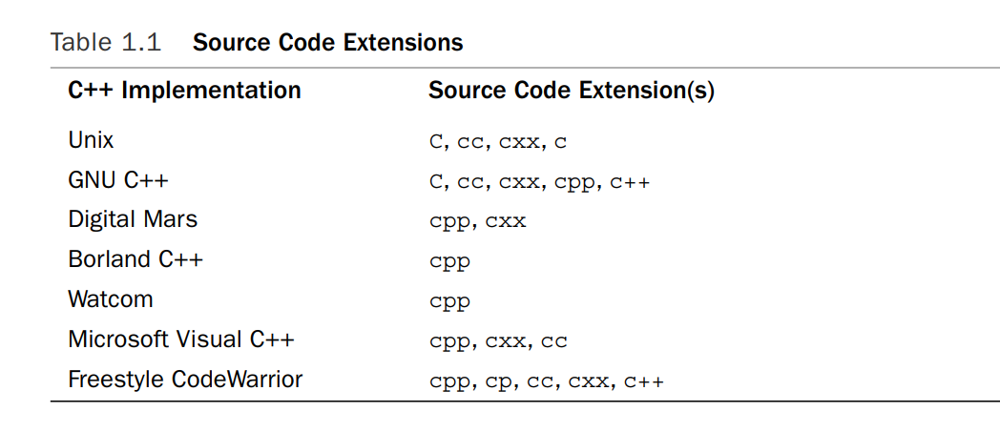

# 第一章

## C++入门

### 背景介绍

#### 分类

- 面向过程语言:C/FORTRAN/BASIC

- 面向对象语言：C++类与C

- 泛型编程：C++模板

  

#### 起源

- **1970s**：**C\Pascal** 结构化编程

  - 贝尔实验室的unix操作系统项目

  - **低级语言**：汇编语言（不同类型计算机需要重写）

  - **高级语言**：C

  - 编译器：将高级语言翻译成内部低级语言

    

- **1980s**：面向对象编程OOP

  - SmallTalk

  - C++

    

#### 创建源文件

**IDE**(integrated development enviroment)

- Microsoft Visual C++
- Embarcadero C++ Builder
- Apple Xcode
- Open Watcom C++
- Digital Mars C++


#### 后缀


- **c++**:c++源代码

  - unix系统（大小写**敏感**）

    - c:C程序
    - C\cc\cxx:C++程序

  - DOS（大小写**不敏感**）

    


#### 编译和链接

`spiffy.C`编译后生成`spiffy.o`文件,链接器链接库函数生成可执行文件`a.out`

编译项目：编译器不删除object代码文件

- 列出文件列表

再编译

- `CC my.C precious.o`

指定库

- `CC using math.C -lm`


##### linux编译和链接

编译生成一个可执行文件

`g++ spiffy.cpp`


链接C++库

`g++ spiffy.cpp -lg++`


编译多个源文件,产生一个可执行文件和中间的object文件

`g++ my.cpp precious.cpp`


在编译

`g++ my.cpp precious.o`


##### Windows命令行

1. 下载免费的windows环境下的命令行编译器

   1. GNU C++编译器（Cygwin/MinGW)

2. windows编译器

   1. Microsoft Visual C++

      :link: http://en.wikipedia.org/wiki/List_of_compilers

      1. 编译

         1. Debug: contains extra code that increases the program size
         2. Release:

      2. Build/Make: compile the code for all the source code files in the project

      3. Build All

      4. Link

      5. Run/Execute

      6. Debug

         

```c++
cin.get(); // add this statement
cin.get(); // 代码末尾可加入该行，避免console关闭
return 0;
}
```

[^cin.get()]: reads the next keystroke


##### C++ on mac

the apple supplies a developer framework called Xcode with the Mac OS X operating system.

- 提供IDE支持多种语言开发
- 安装一组编译器用于unix模式的命令行操作

