# 数据

#### 变量

- 存储地址（&获取变量存储地址）
- 存储内容
- 存储类型


###### 变量名：

- 可包含字母字符，数字和下划线

- **第一个字符不能是数字**

- 大小写敏感

- 不能使用关键词

- **双下划线开始**\一个**下划线接一个大写字母**保留给<mark>编译器及其使用资源</mark>，**单下划线开头**的字符保留为执行时的<mark>全局标识符</mark>
  - `_time_stop`和`_Donut`不产生编译错误但是会出现无法定义的行为

- 变量名长度无限制（ANSI C99只有前63个字符有效)


范例：

```c++
int _Mystars3; //有效但为保留词

int 4ever; //不合法

int begin; //合法
```


---

**常用命名技巧：多个单词命**

1、下划线区分： my_onions

2、首字母大小写区分：myEyeTooth

3类型命前缀sMyname\iNumber\bRes(str/int/boolean)

---


#### 内置数据类型：

###### 基本数据类型

[^整型]:无小数部分
[^宽度]:用来描述使用的存储空间大小
[^bit]:可以控制的最小单位（0/1）
[^byte]:通常情况下1byte=8bit,至少容纳一个char的空间（字符集有ASCII和EBCDIC为8bit,以及Unicode16bit）

---

**Note**

<p align=center>1kb=1024byte<br/>
1mb=1023kb
</p>

---


<center>总结</center>

| 整形类别  |        存储空间        |    符号     |
| :-------: | :--------------------: | :---------: |
|   char    |          8bit          | sign/unsign |
|   short   |       至少16bit        | sign/unsign |
|    int    |     至少大于short      | sign/unsign |
|   long    | 至少32bit&至少大于int  | sign/unsign |
| long long | 至少64bit&至少大于long | sign/unsign |


| 方法名 | 作用                       |
| ------ | -------------------------- |
| sizeof | 返回类型、变量大小（byte） |


#### climit文件

包含int型大小的信息，如`INT_MAX`，`CHAR_BIT`等


**演示案例**：

```c++
#include <iostream>
#include <climits>

int main(){
    using namespace std;
    int n_int = INT_MAX;
    short n_short = SHRT_MAX;
    long n_long = LONG_MAX;
    long long n_llong = LONG_LONG_MAX;
    cout<<"int is "<<sizeof(int)<<" Bytes."<<endl;
    cout<<"short is "<<sizeof(short)<<" Bytes"<<endl;
    cout<<"long is "<<sizeof(long)<<" Bytes"<<endl;
    cout<<"long long is "<<sizeof(long long)<<" Bytes"<<endl<<endl;

    cout<<"Maximum values:"<<endl;
    cout<<"int: "<<n_int<<endl;
    cout<<"short: "<<n_short<<endl;
    cout<<"long: "<<n_long<<endl;
    cout<<"long long: "<<n_llong<<endl;

    cout<<"Minimum int values = "<<INT_MIN;
    cout<<"Bits per byte = "<<CHAR_BIT<<endl;
    return 0;
}
```

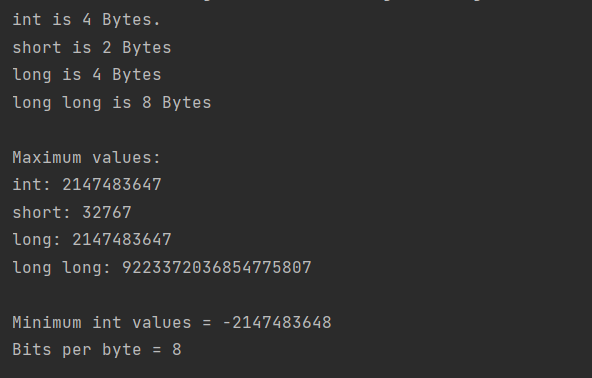


<span style="color:#8d0000">**sizeof操作符**</span>

操作对象：类型名|变量名

- 类型名：
- 变量名：


<span style="color:#8d0000">**climits头文件**</span>：定义符号常量来表示符号的限定

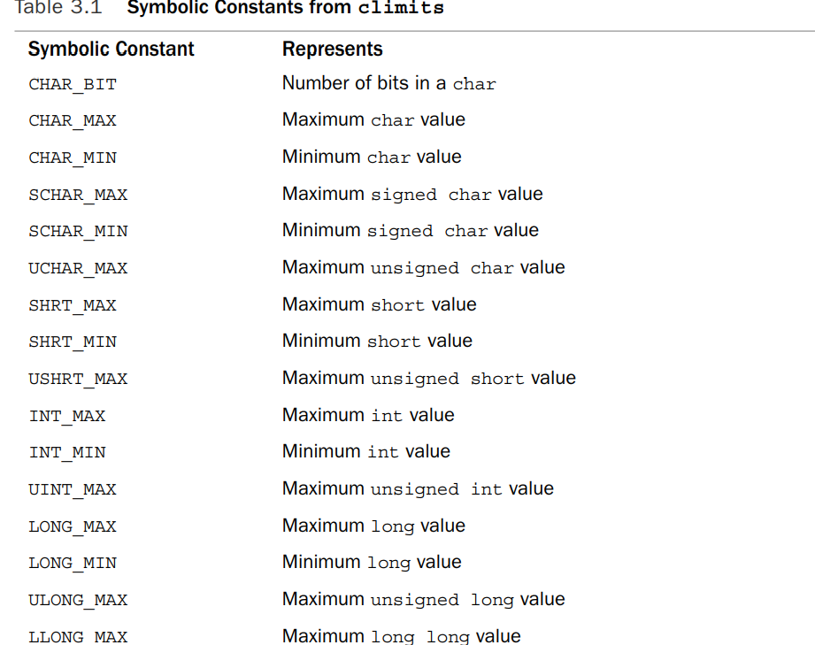


**定义方式**

- define
- include

`#define INT_MAX 32767`

处理机制：通过预处理程序指令在编译之前进行替换


#### 初始化

初始化是声明和赋值语句的结合

```c++
int n_int = INT_MAX;
```


赋值的内容可以是字面量，表达式，其他变量

- C和C++风格

```c++
int n_int = INT_MAX;
int n_int_2(INT_MAX);
```

:warning:不初始化值会造成未定义，即该变量的值可能为内容的任意值


- <span style="color:#8d0000">以C11的方式初始化</span>

```c++
int emus={7};
int rval{9};//c11中=可忽略

int emus={};
int rval{};//括号中的内容可以位空，即默认为0
```

提供更好的类型转换保护


#### 无符号类型

无符号类型**不能表征负数**，优点在于提高变量能够容纳的最大值


:white_small_square:声明方式：

```c++
unsigned short u_short;
unsigned int u_int;
unsigned long u_long;
unsigned long long u_llong;
```


:white_small_square:*溢出问题：让变量表示超出其能力的数字*

```c++
using namespace std;
short test = SHRT_MAX;
unsigned short utest = test;
cout<<test<<endl;
cout<<utest<<endl;
test+=1;
utest+=1;
cout<<test<<endl;
cout<<utest<<endl;
test=0;
utest=0;
cout<<test<<endl;
cout<<utest<<endl;
test-=1;
utest-=1;
cout<<test<<endl;
cout<<utest<<endl;
```

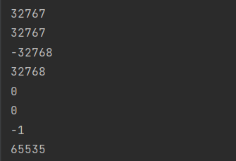


---

**选择一个整形类型**

- 通常情况下，最常用的选择为int，也是计算机处理最为高校的类型

- 非负数选择无符号类型
- 超过16bit容纳范围，最好选long(尽管有的系统上int为32bit)
- 超过20亿选择long long
- short可以减少空间占用
- 只需要一个字节，用char

---


#### 整形字面量

:white_medium_small_square:**进制**，前面一到两个位用来表征进制

- 十进制(1到9)
- 八进制：**0**(0到7)
- 十六进制：**0x/0X**(0到F)

```c++
#include <iostream>

int main(){
    using namespace std;
    int chest = 42;
    int waist = 0x42;
    int inseam = 042;
    cout<<"Monsieur cuts a striking figure!\n";
    cout<<"chest = "<<chest<<" 42 in decimal"<<endl;
    cout<<"waist = "<<waist<<" 0x42 in hex"<<endl;
    cout<<"inseam = "<<inseam<<" 042 in octal\n";
    return 0;
}
```

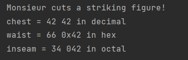

虽然表示方式不同，但相同大小的存储内容一样


:white_medium_small_square:**打印不同进制**：

```c++
#include <iostream>

int main(){
    using namespace std;
    int chest = 42;
    int waist = 0x42;
    int inseam = 042;
    cout<<"Monsieur cuts a striking figure!\n";
    cout<<"chest = "<<chest<<" 42 in decimal"<<endl;
    cout<<hex;/*持续效果直到下一次改变*/
    cout<<"waist = "<<waist<<" 0x42 in hex"<<endl;
    cout<<oct;
    cout<<"inseam = "<<inseam<<" 042 in octal\n";
    return 0;
}
```

:warning:hex是std命名空间的一部分，当声明使用该空间时，不能用hex做变量名。


---

**C++如何决定常量类型**

C++存储整型常量**通常以int形式**

- 用后缀进行提示
  - l或L：long
  - u或U:unsigned int
  - ul：unsigned long int
  - ll或LL：long long

- 存储的数据太大
  - 十进制存储规则：int，long，long long
  - 十六进制和八进制存储规则：int，unsigne int，long，unsigned long，long long，unsigned long long


---


#### 字符编码

[^char]:能表示所有字母，数字和标点符号，许多系统支持少于128种字符，当然char也可以表示比short空间小的整形变量

:warning:C++执行的代码与其使用主机相关

|  主机类型   | 字符集 |
| :---------: | :----: |
| IBM大型主机 | EBCDIC |


<span style="color:#8d0000">**字符集**</span>：

- ASCII:最常用字符集
  - A:65
  - M:77


范例：

```c++
#include <iostream>
int main(){
    using namespace std;
    char ch;
    cout <<"Enter a character:";
    cin>>ch;
    cout<<"Hola!";
    cout <<"You have enter the "<<ch<<" character."<<endl;
    return 0;
}
```

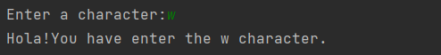

输出w而非其值的大小是由于cin和cout,cin将输入的字符转换为其值的大小，cout将值转换为字符的表示，这些操作按照变量类型进行操作。

:warning:字面量形式描述字符：'M'，双引号"M"则表示字符串


<span style="color:#8d0000">**无法直接键入的字符**</span>

- 新行（Enter被编译器看作是在源文件的新行）
- 其他（被C++赋予其他的意义）
  - "
    - 转义序列：

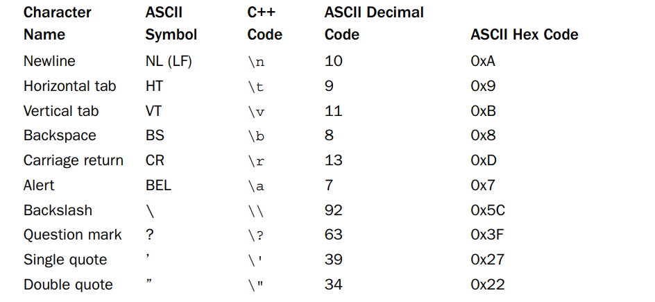

e.g.

```c++
#include <iostream>
int main(){
    using  std::cout;
    char alarm = '\a';
    cout <<alarm<< "Dont do that again!\a\n";
    cout<<" Ben \" Buggsie\" Hacker\nwas here!\n";
}
```


- 可以用八进制或十六进制来表示转义字符

|  名字  | 八进制 | 十进制 | 十六进制 |
| :----: | :----: | :----: | :------: |
| Ctrl+Z |  \032  |   26   |  \0x1a   |

:warning:当有字符和数值表示时，建议用字符表示，数值表示可能会和特殊的代码绑定，字符表示则更加可靠和具有表示性


**新行的三种表示**

```c++
#include <iostream>
int main(){
    using  std::cout;
    cout<<"begin:";
    cout<<"\n";
    cout<<'\n';
    cout<<std::endl;
    cout<<"end.";
}
```

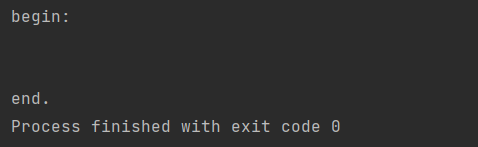


**转义符演示**

```c++
#include <iostream>
int main(){
    using  std::cout;
    using std::cin;
    cout << "\aOperation \"HyperHype\" is now activated!\n";
    cout << "Enter your agent code:      \b\b\b\b\b\b";
    long code;
    cin >> code;
    cout<< "\aYou entered " << code <<"...\n";
    cout<< "\aCode verified! Proceed with Plan Z3!\n";
    return 0;
}
```


```c++
#include <iostream>
int main(){
    using namespace std;
    char ch = 'M';
    int i =ch;
    cout <<"The ASCII code for "<<ch<<" is "<<i<<endl;
    cout<<"Add one to the character code:"<<endl;
    ch = ch+1;
    i=ch;
    cout<<"The ASCII code for "<<ch<<" is "<<i<<endl;

    //using the cout,put() member function to display a char
    cout << "Displaying char ch using cout,put(ch):";
    cout.put(ch);

    //using the cout,put() membet function to display a char constant
    cout.put('!');

    cout<<endl<<"Done"<<endl;
    return 0;

}
```

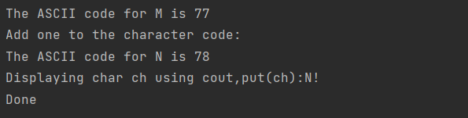

:warning:cout根据变量类型来展示变量的内容


<span style="color:#8d0000">**通用字符名**</span>

- C++支持的基础源字符集：可以用来写源代码的字符集，其中包含字母（大小写），数字（标准US键盘），符号（=等）以及分散的其他字符（如空白符）

- 基础的执行字符集：可以在程序执行过程中被处理的字符（例如从文件读取字符，展示在屏幕中等），这其中增加了一些字符，例如后退符，预警等

- 标准C++允许提供扩展源字符集和执行字符集，如果支持扩展字符集，可以在标识符中使用通用字符名

- 通用字符集：表达独立于各个键盘的此类国际字符（针对不同国家的特点字符集）

  - 开头：\u跟八进制数或者\U跟十六进制数，这些数字表示字符的ISO 10646码点


**成员函数：cout.put()**

cout是ostream类的实例，

cout.put是ostream类的成员函数，功能是输出字符

cout.put()可以作为<<操作符的替代（由于历史遗留问题，早期版本的C++将字符常量以int型来存储，从2.0以后用char存储)

> char ch='M'[将常量的8bit的值复制到ch中]


---

**unicode** 和**ISO 10646**

uniode:表示大量字符集提供一个标准的编号系统，并以类型进行区分，其中ASCII就是其中的一个子集，unicode表示超过109000字符和超过90个脚本，并仍然持续发展中 <a>www. unicode.org.</a>

码点：每个字符都有其数值

*1991年ISO和Unicode共同工作时期标准一致

---


**有符号char和无符号char**

char既不是默认有符号，也不是默认无符号，根据C++的实现而定，使其更好符合硬件特性

浮点数


#### 宽字符wchar_t

处理超过8bit的字符，例如日语kanji系统

- 大的基础字符集，编译器供应商可设定char为16bit或更大
- 小的基础字符集和大的扩展字符集，8bit字符表征小基础字符集，wchar_t（整型，基础类型的选择看实现）表征扩展字符集


由于**cin和cout只支持char**，故有wcin和wcout支持wchar_t流

```c++
#include <iostream>
int main(){
    using namespace std;
    wchar_t wch = L'a';
    wcout<<wch<<endl;
    return 0;
}
```

---

**C++11新类型**

:warning:有时候wchar_t并不足够，随着实现的不同，wchar_t在不停的变换

- char16_t：unsigned 16 bit char,u前缀

e.g. `u'C'`以及` u"be good"`

- char32_t：unsigned 32 bit char,U前缀

e.g. `U"R'`以及`U"dirty car"`

----


#### bool类型

[^bool类型]:即值为true或者false的变量

```c++
bool is_ready = true;
```


bool类型的**类型转换**：false(0),true(1)

```c++
int num = is_ready;
```


任何数值都可被隐式转换为bool类型（无显示方法）

```c++
    bool start = -100;//true;
    bool end=0;//false;
}
```


#### const限定符

常量符合，**声明即需进行初始化**，被赋值后值不能进行更改，当声明的时候未进行初始化将会产生无法定义的值

```c++
const int Months = 12;
```

:warning:如果后续想要修改months的值，则编译器则会报错


对const变量的**命名**：

- 一般是对常量进行首字母大写
- 对所有字母进行大写（例如#define常做的操作)


---

**讨论：const或者#define**

本书建议使用const

- 对类型的显示声明
- C++的范围规则将定义限制在特定范围
- const能够定义多种类型（如数组、结构体等）

注*：ANSI C以有const限制符

---


#### 浮点数

**第二重要的基本数据类型**，允许你表示小数部分，也可以表示更大的范围的值，以及特别小的值


浮点数的**表示方式**：

- 值
- 比例因子:改变小数点的位置，因子为2

e.g. `3.41245`以及`34.1245`


浮点数的**表示**：

- 标准小数点表方式：`12.34`
- 科学计数法：`3.45E6(=3.45×1000000)`


e/E的使用保证以浮点数的格式存储数据，即使没有小数点

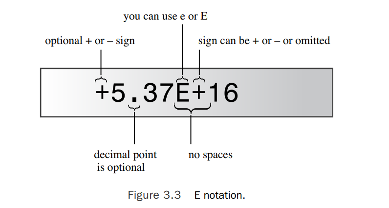


###### 浮点数类型(表明其可以表示的有效数字和最小指数范围)

- float
- double
- long double


---

**Note**

C和C++要求float至少使用**32bit**,double至少为**48bit且比float大**，long double不小于double

通常情况下，float为32bit，double64bit,以及long double为80/96/128bit

指数范围至少为**-37~+37**

查阅资料：cfloat或者float.h头文件表明系统的限制

---


e.g.

```c++
//最少有效数字
#define DBL_DIG 15 // double
#define FLT_DIG 6 // float
#define LDBL_DIG 18 // long double

//尾数位数
#define DBL_MANT_DIG 53
#define FLT_MANT_DIG 24
#define LDBL_MANT_DIG 64

//最大或最小指数值
#define DBL_MAX_10_EXP +308
#define FLT_MAX_10_EXP +38
#define LDBL_MAX_10_EXP +4932

#define DBL_MIN_10_EXP -307
#define FLT_MIN_10_EXP -37
#define LDBL_MIN_10_EXP -4931

```


e.g.

```c++
#include <iostream>

int main(){
    using namespace std;
    //调用了ostream类的成员函数setf()，该方法进行定点使得避免程序对过大的数值切换为科学计数法表示，让小数点右边的有效数字为六个，其中ios_base::fixed,ios_base::floatfield是常数，由库iostream提供
    cout.setf(ios_base::fixed,ios_base::floatfield);
    float tub = 10.0/3.0;
    double mint = 10.0/3.0;
    const float million = 1.0e6;

    cout<<"tub = "<<tub<<", a million tub = "<<tub*million<<",\nand ten million tubs="<<10*million*tub<<endl;
    cout<<"mint = "<<mint<<" and a million mints = "<< million*mint <<endl;
    return 0;
}
```

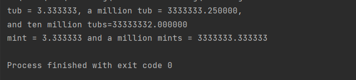

:warning:通常情况下，尾部的0会被舍掉，通过调用`cout.setf()`来改变这个行为，从这个例子可以看出float在精度上比double要差一点


#### 浮点常量

通常情况下，**默认存储浮点数常量类型为`double`**,如果想以`float`作为存储类型，则需加后缀`f`或`F`,对于`long double`则采用后缀`l`或`L`

`1.234f`

`2.45E20F`

`2.345324E28`

`2.2L`


---

浮点数相对于整型的**优势**：

- 可以表示整型范围的数据

浮点数相对于整型的**劣势**：

- 浮点数的处理速度比整型慢，并且计算过程中可能会丢失精度

---


**案列：丢失精度**

```c++
#include <iostream>

int main(){
    using namespace std;
    float a=2.34E+22f;
    float b=a+1.0f;

    cout<<"a = "<<a<<endl;
    cout<<"b - a = "<<b-a<<endl;
    return 0;
}
```

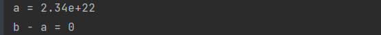

:warning:由于float能够表示的有效位数只有6位，而a+b后的有效位数为23位，故对第23位数的修改没有任何作用


#### 数据类型总结

**整型**

- 有符号整型
  - char,short,int,long,long long
- 无符号整型
  - 略
- 其他
  - bool,char,wchar_t,char16_t和char32_t
- 浮点数
  - float,double,long double


#### C++算术运算

五类基本运算

- 加+
- 减-
- 乘*
- 除/
- 取模%,取模操作的两个操作数都必须为整型，如果为浮点数类型会造成编译错误，如果操作数存在负数`a%b=c`，c的符号等同于a


运算符和操作数共同构成表达式

`int wheels = 4 + 2;//wheels=6`


**e.g.**

```c++
#include <iostream>

int main(){
    using namespace std;
    float hats,heads;

    cout.setf(ios_base::fixed,ios_base::floatfield);
    cout<<"Enter a number:";
    cin>>hats;
    cout<<"Enter another number:";
    cin>>heads;

    cout<<"hats = " <<hats<<";heads = "<<heads<<endl;
    cout<<"hats + heads = "<<hats+heads<<endl;
    cout<<"hats - heads = "<<hats-heads<<endl;
    cout<<"hats * heads = "<<hats*heads<<endl;
    cout<<"hats / heads = "<<hats/heads<<endl;
    return 0 ;


}
```

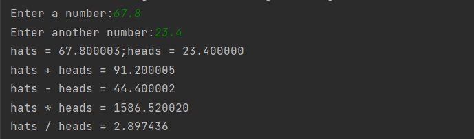


###### 运算符处理顺序

- 优先级
- 关联性（相同优先级情况下的处理顺序）

:warning:特殊情况： `int dues = 30*5 + 9 /3;` //实现顺序由系统自己决定


:small_blue_diamond:**/**:操作的执行取决于操作数的类型

- 都是整型：舍弃小数部分
- 存在浮点数：保留小数部分


e.g.

```c++
#include <iostream>

int main(){
    using namespace std;
    cout.setf(ios_base::fixed,ios_base::floatfield);
    cout << "Integer division: 9/5 = "<<9/5<<endl;
    cout << "Floating-point division: 9.0/5.0 = "<<9.0/5.0<<endl;
    cout << "Mixed division: 9.0/5 = "<< 9.0/5 <<endl;
    cout << "double constants: le7/9.0"<<1e7/9.0<<endl;
    cout << "float constants: 1e7f/9.0f"<<1e7f/9.0f<<endl;
    return 0;
}
```

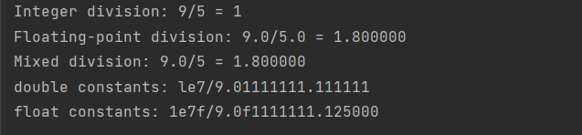

---

**操作符重载**：用同样的符号实现多种操作

- 整型除

- float除

- double除

---


:small_blue_diamond:**%**

e.g.

```c++
#include <iostream>

int main(){
    using namespace std;
    const int Lbs_per_stn = 14;
    int lbs;
    cout<<"Enter you weight in pounds:";
    cin>>lbs;
    int stone = lbs / Lbs_per_stn;
    int pounds = lbs % Lbs_per_stn;
    cout << lbs << " pounds are " << stone << " stone, "<<pounds<<" pound(s).\n";
    return 0;
}
```

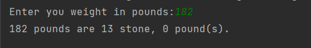


#### 类型转换

###### 自动类型转换

- 分配一个类型值给另一个类型的变量
- 表达式中使用混合类型
- 在传递参数过程中的自动类型转换


##### 在初始化或赋值期间的类型转换

C++运行用一个类型的值赋值给其他类型的变量：类型转换为接受变量的类型

````c++
so_long = thirty//将short转换为long
````

例如：so_long的类型为long，thirty的类型为short

:warning:一般情况下从小范围变量转换为大范围变量不会产生任何问题.但是，将一个较大的值分配给小范围变量可能会导致精度丢失


| 类型转换                   | 潜在问题                                |
| -------------------------- | --------------------------------------- |
| 大浮点类型转换为小浮点类型 | 丢失精度/值超过表示范围（未定义的行为） |
| 浮点类型转换为整型         | 丢失小数部分/值不能被表示               |
| 大整型转换为小整型         | 值不能被表示，同时低位部分直接被复制    |


---

**Note**

0值赋值给**bool型**表示为假，非零值表示为真

---


e.g.

```c++
#include <iostream>

int main(){
    using namespace std;
    cout.setf(ios_base::fixed,ios_base::floatfield);
    float tree  = 3;  //int转换为float
    int guess(3.9832);//double转换为int
    int debt = 7.2e12;//double转换为int
    cout << "tree = "<<tree <<endl;
    cout << "guess = "<<guess<<endl;
    cout << "debt = "<<debt <<endl;
    return 0;
}
```

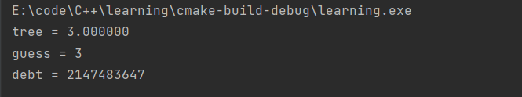


###### **C++11属性**：采用{}初始化时的类型转换

列表初始化:调用初始化通过使用

- 列表初始化**不允许缩小**
  - float->int
- 可以const


e.g.

```c++
#include <iostream>

int main(){
    using namespace std;
    cout.setf(ios_base::fixed,ios_base::floatfield);
    const int code =66;
    int x = 66;
    char c1 {31325};//缩小，不允许
    char c2 {66};//可以
    char c3 {code};//可以被容纳的常量，故可以
    char c4 {x};//不行，x不是常数
    char c5 = x; //允许这种形式的初始化
    return 0;
}
```


###### 表达式类型转换

- 自动转换：

  当检测到表达式时，C++会将bool,char,unsigned char,signed char 和short转换为int[**整型提升**]

  - 特别的，true=1,false=0

  

  **混合运算**：当结合两个类型，通常是将小的转换为较大的类型[c11规则]

  - 如果有一个为long double，则另一个转换为long  double
  - 否则，如果有一个为double,则另一个转换为double
  - 否则，如果有一个float,则另一个转换为float
  - 如果两个都是有符号操作数或者无符号操作数，则低阶转换为高阶
  - 否则，一个为有符号一个为无符号，无符号比有符号高阶，则有符号转换为无符号操作数的类型
  - 否则，如果有符号的类型可以表达该无符号类型所有值，则无符号类型转换为该有符号类型
  - 否则，两个类型都转换为无符号整系

e.g.

```c++
short chickens = 20;
short ducks = 35;
short fowl = chickens+ducks;
```

c++将chickens和ducks转换为int型，然后将计算结果转换为short

---

**Note**

int是计算机处理最为自然的类型，一般处理速度最快，通常情况下，如果unsigned short类型比int小，会转换为int,如果两个大小相同，则会从unsigned short转换为unsigned int,这样就保证没有数据丢失问题


ANSI C遵循ISO 2003 C++的规则，有一丢丢不同

经典的看K&R C也有些许不同

- 总是将float提升为double(尽管两则都是float)

---


**整型**：

- 有符号：long long,long,int ,short,signed char
- 无符号：unsigned long long ,unsigned long, unsigned int,unsigned short,unsigned char
- bool:最低级


###### 参数传递过程中的类型转换

可能会放弃对参数传递的原型控制，在这种情况下对char或者short类型（有符号/无符号）进行整型提升，将float类型转换为double


###### 强制类型转换

C++运行用户对类型进行强制转换，通过type cast机制

实现的两种方式

- （typeName）value//C方式
- typeName(value) //C++方式，类似于函数调用的格式

type cast**不会改变thorn变量本身，它创造指定类型的新值**，因此可以将它用在表达式当中


[^static_cast<>]:操作符可以用来将数值类型转换为其他类型

`static_cast<long> (thorn)`

`static_cast<typeName> (value)`

**static_cast<>**相比传统的类型转换，更加的严格


e.g.

```c++
#include <iostream>

int main(){
    using namespace std;
    int auks,bats,coots;
    auks = 19.99+11.99;

    bats = (int)19.99+(int)11.99;//传统C语言
    coots = int(19.99)+int(11.99);//新C++特性
    cout<<"auks = "<<auks <<", bats = "<<bats;
    cout<<", coots = "<<coots<<endl;

    char ch = 'Z';
    cout << "The code for "<<ch<<" is ";
    cout <<int(ch)<<endl;
    cout<<"Yes, the code is ";
    cout<<static_cast<int>(ch)<<endl;
    return 0;
}
```

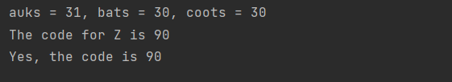


#### C++ 自动声明

C++创造了一个工具使得编译器能够自动推导一个初始化值的类型，并将其定义为auto

`auto n = 100;`

`auto x = 1.5`;

`auto y = 1.3e12L;`

:warning:auto有时也会产生问题，例如当你想对double类型赋值为0时，如果写作0则auto会将其命名为int类型。


**对标准模板库的推导特别有用**

`std::vector<double> scores;`

`std::vecotr<double>::iterator pv = scores.begin();`

`auto pv = scores.begin();`