# 第四章 复合类型

#### 数组

同类型多个值,多个值连续存储在同一块内存中


**声明**：类型 数组名[元素个数]

`short month[12];`

:warning:元素个数必须为整型，可以为常量，在编译时能够准确知道它的值


**通过下标或者索引**访问数组的值，第一个值的下标约定为0

`month[0];//访问第一个元素`

:warning:编译器不检查下标越界问题，这个有程序员代码进行保证


```c++
ios_base::sync_with_stdio(false);
```

使得c++和C标准流不同步，采用单独的缓冲区


```c++
cin.tie(NULL);
```

确保cin前的cout的flush


e.g.

```c++
#include <iostream>


int main() {
    using namespace std;

    int yams[3];
    yams[0]=7;
    yams[1]=8;
    yams[2]=6;

    int yamcosts[3] = {20,30,5};

    cout <<"Total yams = ";
    cout << yams[0]+yams[1]+yams[2]<<"\n";
    cout <<"The package with "<<yams[1] << " yams costs ";
    cout << yamcosts[1] <<" cents per yam.\n";
    int total = yams[0]*yamcosts[0]+yams[1]*yamcosts[1]+yams[2]*yamcosts[2];
    cout <<"The total yam expense is "<< total <<" cents.\n";
    cout<<"\nSize of yams array = "<<sizeof yams;
    cout <<" bytes.\n";
    cout <<"Size of one element = "<<sizeof yams[0];
    cout <<" bytes.\n";
    return 0;

}
```

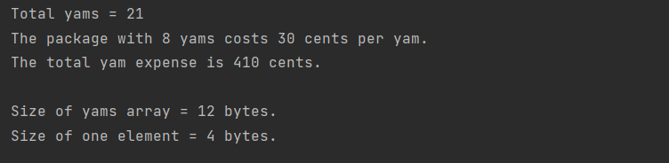


#### 数组初始化

- 挨个赋值
- 列表初始化(只能在定义的时候使用，括号内的值可以比元素个数小)

`   int yamcosts[3] = {20,30,5};`

`float hotelTips[5] = {5.0, 2.5};`依序赋值，后面的元素赋值为0

`long totals[500] = {0};`全部赋值为0

- 不指明个数

`short things[] = {1, 5, 3, 8};`

编译器自动计算个数

- C11数组初始化

`double earnings[4]{1.2,1.3,1.4,1.5};`

`unsigned int counts[10]{};//所有元素被赋值为0`


---

**禁止缩小**

`long plifs[] = {24,92,3.0};`错误，从浮点数转换为整型是缩小

`char slifs[4] {'h', 'i', 1122011, '\0'};` 1122011超出范围，故错误

---


#### 字符串

字符串是一系列的字符存储在连续空间，C++有两种字符串

- 源自C语言，C风格字符串
  - 末尾字符以null('\0')结尾
- 基于string类库


###### 初始化

```c++
char bird[11] = "My. cheeps";
```

带引号字符串隐式添加'\0'，任何C++的从键盘读取输入的工具都自动在末尾添加休止符null。

*注：使用者需确保有足够的空间去容纳string,字符串的大小取决于休止符而非字符数组的大小*

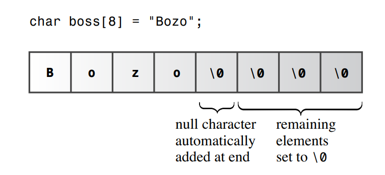

##### 字符串字面量

字符串字面量（双引号）不能与字符字面量（单引号）互换

```c++
char size = "S";//类型不匹配
```

"S"表示两个字符的字符串（‘s','\0'),同时也可以表示存储该字符串的地址，而’s'是对字符的速写


##### 字符串操作

- 连接字符串字面量
  - 字符串太长难以在一行进行表示

任何以空白符分割的两个字符串都会自动的连接在一起

```c++
#include <iostream>


int main() {
    using namespace std;
    cout << "I'd give my right arm to be" "a great violinist.\n";
    cout << "I'd give my right ar"
            "m to be a great violinist.\n";
}
```

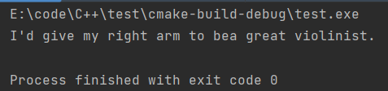

- 在数组中使用字符串
  - 用字符串常量去初始化数组
  - 将文件输入\键盘输入到字符串中

```c++
#include <iostream>
#include <cstring>


int main() {
    using namespace  std;
    const int Size = 15;
    char name1[Size];
    char name2[Size] = "C++study";
    cout <<"Hello, I'm"<<name2;
    cout <<"! What's your name ?"<<endl;
    cin>>name1;
    cout <<"Well, "<<name1<<" your name has "<<strlen(name1)<<" letters and I remembered.";
}
```

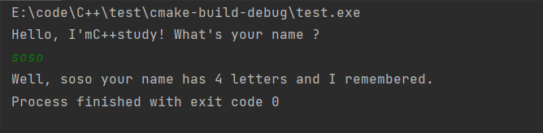

:warning:strlen不计入空字符

[^sizeof]:返回整个数组的字符数


<span style="color:#8d0000">**瑕疵**</span>

```c++
#include <iostream>

int main() {
    using namespace  std;
    const int ArSize = 20;
    char name[ArSize];
    char dessert[ArSize];

    cout << "Enter you name:";
    cin >> name;
    cout <<"Enter you favorite dessert:";
    cin >> dessert;
    cout << "I have some delicious "<<dessert;
    cout << " for you, "<< name <<" .\n";
    return 0;
}
```

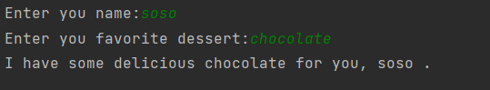

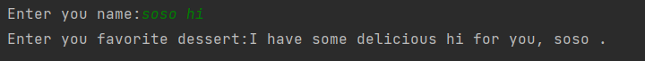

:warning:不能输入null字符,导致cin只能通过空白符进行字符串的区分,输入字符数大于接受的字符串大小


#### 读入整行

- **getline() 读取整行，丢弃换行符，该换行符为null**
  - 参数
    - 存储输入变量
    - 读取字符数限制（小于）

```c++
#include <iostream>

int main() {
    using namespace std;
    const int ArSize = 20;
    char name[ArSize];
    char dessert[ArSize];

    cout << "Enter your name:";
    cin.getline(name,ArSize);
    cout << "Enter your favorite dessert:";
    cin.getline(dessert,ArSize);
    cout << "I have some delicious "<<dessert << " for you , "<<name<<".\n";

}
```

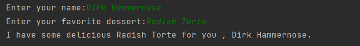

- **get() 读取整行，返回cin对象**
  - 类似于getline()的两个参数，但保留换行符不读取(将定界符留在队列中，从而能够将其视为下一个输入的一部分)
  - 无参数，读取单个下一个字符

```c++
#include <iostream>

int main() {
    using namespace std;
    const int ArSize = 20;
    char name[ArSize];
    char dessert[ArSize];

    cout << "Enter your name:";
    cin.get(name,ArSize).get();
    cout << "Enter your favorite dessert:";
    cin.get(dessert,ArSize).get();
    cout << "I have some delicious "<<dessert << " for you , "<<name<<".\n";
}
```

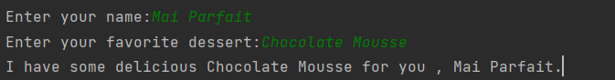


###### 空行

读取空行的行为

- get()读取空行，设置failbit,可通过cin.clear()操作取消阻塞
- getline()和get()读取内容大于分配空间将**剩余字符留在队列中**，getline()将设置failbit并关闭输入


##### 混合字符串和数字

```c++
#include <iostream>

int main() {
    using namespace std;
    cout <<"What year was your house built?\n";
    int year;
    cin>>year;
    cout <<"What is its street address?\n";
    char address[64];
    cin.getline(address,64);
    cout <<"Year built:"<<year<<"\n";
    cout <<"Address:"<<address<<"\n";
    return 0;
}
```

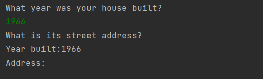

cin读取了1966之后，将留下一个换行符

解决办法：读取换行符

```c++
cin.get()

cin.get(char类型变量)

(cin>>year).get(ch)
```


#### string类

需要包含string头文件

```c++
#include <iostream>
#include <string>

int main() {
    using namespace std;
    char charr1[20];//创建空数组
    char charr2[20] = "jaguar";//创建并初始化
    string str1;//空字符串对象
    string str2 = "panther";//创建初始化字符串

    cout<<"Enter a kind of feline:";
    cin >> charr1;
    cout <<"Enter another kind of feline:";
    cin >>str1;
    cout <<"Here are some felines:\n"<<charr1<<" "<<charr2<<" "<<str1<<" "<<str2<<"\n";
    cout <<"The third letter in "<< str2 << " is "<<str2[2]<<"\n";
    cout <<"The third letter in "<< charr2 << " is "<< charr2[2]<<"\n";
}
```

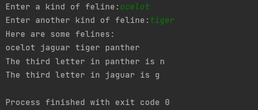


:white_medium_small_square:可以以字符数组的方式对待string对象

- C方式初始化string
- cin将输入存储到string对象
- cout去展示string对象
- 用数组下标去访问单个字符

**差异**：声明方式，类的设计允许自行处理大小，根据输入等自行调整大小


###### C11的string初始化

```c++
char first_date[] = {"Le Chapon Dodu"};
char second_date[] = {"The Elegant Plate"};
string third_date = {"The Bread Bowl"};
string fourth_date = {"Hank's Fine Ea"};
```


###### 赋值，连接，追加

string类让字符串的操作更简单

- 用string对象赋值另一个string对象
- 通过+运算连接两个字符串
- +=字符串附加其他字符串


e.g.

```c++
#include <iostream>
#include <string>

int main() {
    using namespace std;
    string s1 = "penguin";
    string s2,s3;

    cout << "You can assign one string object to another: s2=s1";
    s2 = s1;
    cout << "s1:"<<s1<<", s2:"<<s2<<"\n";
    cout << "You can assign a C-style string to a string object.\n";
    cout << "s2 = \"buzzard\"\n";
    s2 = "buzzard";
    cout << "s2: "<<s2<<"\n";
    cout << "You can concatenate strings: s3 = s1+s2\n";
    s3 = s1 + s2;
    cout << " s3: "<< s3<<"\n";
    cout << "You can append strings.\n";
    s1+=s2;
    cout << "s1+=s2 yields s1= "<<s1<<"\n";
    s2+=" for a day";
    cout <<"s2+= \" for a day\" yields s2="<<s2<<"\n";
}
```

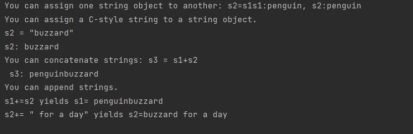


###### 其他操作

- C风格字符串[头文件cstring]

  - [^strcpy]:赋值字符串到一个字符数组中

  - [^strcat]:追加字符串到字符数组中


e.g.

```c++
#include <iostream>
#include <string>
#include <cstring>

int main() {
    using  namespace std;
    char charr1[20];
    char charr2[20]= "jaguar";
    string str1;
    string str2 = "panther";

    str1 = str2;
    strcpy(charr1,charr2);//复制charr2到charr1

    str1+=" paste";
    strcat(charr1," juice");

    int len1 = str1.size();
    int len2 = strlen(charr1);

    cout << "The string "<<str1<<" contains "<< len1 << " characters.\n";
    cout << "The string "<< charr1 << " contains " << len2 << " characters.\n";
}
```

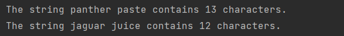


:warning:strcat()可能导致内存溢出

更安全的方法：第三个参数指出目标数组的最大容量，增加项目的另一层复杂度

strncat()

strncpy()


###### 字符串输入输出

```c++
#include <iostream>
#include <string>
#include <cstring>

int main() {
    using namespace std;
    char charr[20];
    string str;

    cout << "Length of string in charr before input: "<<strlen(charr)<<"\n";
    cout << "Lenght of string in str before input :"<<str.size()<<"\n";
    cout << "Enter a line of text:\n";
    cin.getline(charr,20);
    cout << "You entered:"<<charr<<endl;
    cout << "Enter another lien of text:\n";
    getline(cin,str);
    cout <<"You entered: "<<str<<"\n";
    cout << "Length of string in charr after input:"<<strlen(charr)<<"\n";
    cout << "Length of string in str after input:"<<str.size()<<"\n";

}
```

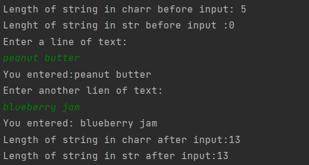

字符数组在未初始化时的内容未定义

**getline():**

- 参数1：输入源

- 参数2：字符串大小


###### 其他类型的字符串字面量

宽字符字符串

```c++
#include <iostream>
#include <string>
#include <cstring>

int main() {
    using namespace std;
    wchar_t title[] = L"Chief Astrogator";
    char16_t name[] = u"Felonia Ripova";
    char32_t car[] = U"Humber Super Snipe";
}
```

C++11的编码体系支持Unicode字符（UTF-8),在这种体系下给定字符会被存储在8bit单元，或八位字节，四个8bit单元等，这有数值决定，用前缀表示（u8等）

另一个C++11的特性为原始字符串，在原始字符串中字符只表示他们本身，原始字符串用()作为定界符，用R前缀作为原始字符串

```c++
int main() {
    using namespace std;
    cout << R"(Jim "King" Tutt uses "\n" instead of endl.)"<<'\n';
}
```

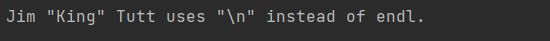

允许在"(之间增加额外的字符，同样)"之间亦可以

```c++
cout << R"+*("(Who wouldn't)",she whispered.)+*"<<'\n';
```

默认的分隔符"()"被"+*替代

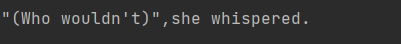


#### 结构体

结构体是用户自定义类型，结构体声明定义结构体的数据特性

- 定义结构体
- 创建结构体变量

```c++
struct  inflatable{
    char name[20];
    float volume;
    double price;
};
inflatable vincent;
```

:warning:区别于C语言，C++对结构体变量的声明不需要加struct标签，通过成员.操作符访问每个成员


e.g.

```c++
#include <iostream>
#include <string>
#include <cstring>

struct  inflatable{
    char name[20];
    float volume;
    double price;
};

int main() {
    using namespace std;
    inflatable guest = {
            "Glorious Gloria",
            1.88,
            29.99
    };
    inflatable pal = {
            "Audacious Arthur",
            3.12,
            32.99
    };

    cout << "Expand your guest list with " << guest.name;
    cout << " and " << pal.name <<"!\n";
    cout << "You can have both for $" << guest.price+pal.price<<"!\n";

}
```

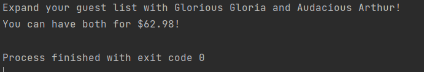

初始化通过逗号区分列表变量值，每个结构体成员都以其类型变量进行对待


###### 结构体声明的放置位置

- main函数内部：内部声明，只有该函数可以使用
- main函数外部：外部声明，可以被所有后续函数使用

C++不鼓励外部声明变量，但鼓励外部声明结构体


###### C++11结构体初始化

- =可以选择省略

```
inflatable pal  {
     "Audacious Arthur",
     3.12,
     32.99
};
```

空括号初始化则被赋值为0


- 结构体成员变量可以是string

```c++
struct ha{
    std::string name;
};
```


###### **其他结构体特性**

C++尽可能让结构体类型近似于内置类型，可以作为函数参数以及函数返回值，可以用=进行赋值

```c++
#include <iostream>
#include <string>
#include <cstring>


struct  inflatable{
    char name[20];
    float volume;
    double price;
};

int main() {
    using namespace std;
    inflatable bouquet = {
            "sunflowers",
            0.20,
            12.49
    };
    
    inflatable choice;
    cout << "bouquet:"<<bouquet.name << " for $"<<bouquet.price<<"\n";
    choice = bouquet;
    cout << "choice:"<<choice.name<<" for $"<<choice.price<<"\n";

}
```

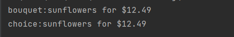


**e.g.结构体声明和初始化相结合**

```c++
struct  inflatable{
    char name[20];
    float volume;
    double price;
}mr_smith,ms_jones;

struct  inflatable{
    char name[20];
    float volume;
    double price;
}mr_smith,ms_jones={
        "hello",
        23.4,
        1.3,
};

```


**e.g. 无类型名声明**

```c++
struct {
    int x;
    int y;
} position;
```

:warning:C++项目不同于C的结构体在于可以有成员方法


###### 结构体数组

创建元素类型是结构体的数组

```c++
inflatable gifts[100];
```


结构体数组初始化：数组初始化（括号+逗号）和结构体初始化（括号+逗号）相结合

```c++
#include <iostream>
#include <string>
#include <cstring>


struct inflatable{
    char name[20];
    float volume;
    double price;

};
int main() {
    using namespace  std;
    inflatable guests[2]={
            {"Bambi",0.5,21.99},
            {"Godzilla",2000,565.99}
    };

    cout << "The guests "<<guests[0].name<<" and "<<guests[1].name<<"\nhave a combined volume of "<<guests[0].volume+guests[1].volume;
    return 0;
}
```

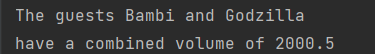


###### 结构体中的位域(常用于底层开发)

指定结构体成员所占据位的个数

类型 名称 (可选)：位数

```c++
struct torgle_register{
    unsigned int SN:4;//4bit
    unsigned int :4;//未使用
    bool goodIn:1;
    bool goodTorgle:1;
};
```


#### Union

可以容纳各种数据类型，每个类型不能同时出现

e.g.

```c++
union one4all{
    int int_val;
    long long_val;
    double double_val;
};
```

e.g.

```c++
pail.int_val = 15;//存储int值
cout << pail.int_val<<'\n';
pail.double_val = 1.38;//int的值失效
cout << pail.double_val;
```

:warning:union的大小等于其最大的成员类型的大小，可以节约空间


###### 匿名union

它的成员共享同一个地址


#### 枚举

const的另一个选择，用来创造符号常量，枚举的语法类似于结构体，是整型且可以提升为int型，但int型不能转换为枚举类型。

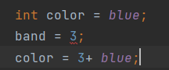

```c++
enum spectrum {red,orange,yellow,green,blue,violet,indigo,ultraviolet};
```


枚举默认从0开始赋值，可以使用枚举名去声明一个枚举类型的变量，只能将枚举值分配给枚举变量

`spectrum band = blue;`


枚举只能采用赋值运算符，可以将int通过显示类型转换分配给枚举类型

```c++
band = spectrum(3);
```

:warning:对于无效的int将会产生未定义的结果


**举常用来作为常数符号而非新的类型**

如果只想将它作为常数而非枚举类型，则可以省略类型名

```c++
enum  {red,orange,yellow,green,blue,violet,indigo,ultraviolet};
```


###### 设定枚举值

通过赋值操作显示设定枚举值

```c++
enum spectrum {one=1, two=2,four=4,eight=8};
enum bigstep{first,second=1000,third};//first=1,second=2000,third-2001
```

可以相同的值多个枚举

```c++
enum bigstep{zero,null=0,one,numero_uno=1};
```

可以对枚举使用long和longlong的值


###### 枚举值的范围

通常情况下，枚举值的范围在命名的有效值中，C++对此通过类型转换进行扩展

```c++
enum bits{one = 1,two =2, four=4,eight=8};
bits myflag;
myflag = bits(6);//有效，6在bits的范围内
```

范围：

- 上界：最大的枚举值，最小的2的幂大于最大的枚举值即为上界

  101最小的大于其的2的幂为128，故上界为127

- 下界：

  - 非负数：0
  - 负数：操作类似于上界


#### 指针与自由存储

取址操作&：显示找到普通变量的地址

```c++
int main() {
    using namespace std;
    int  donuts = 6;
    double cups = 4.5;

    cout << "donuts value = " <<donuts;
    cout << " and donuts address = " <<&donuts<<endl;
    cout << "cups value = "  <<cups;
    cout << " and cups address = " << &cups <<endl;
    return 0;

}
```

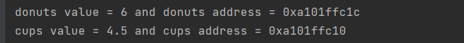

当展示地址时，显示十六进制数，同时donuts存储的地址高于cups


使用传统变量：

- 值：命名量
- 地址：派生量


指针：

- 值：派生量
- 地址：命名量

---

**Note**

面向对象编程不同于传统的过程编程在于它是运行时决策

运行时决策根据当前环境进行灵活修改

---


***：解引用**，返回地址所指向的值

e.g.

```c++
#include <iostream>

int main() {
    using namespace std;
    int updates = 6;
    int * p_updates;
    p_updates = &updates;
    cout << "Values:updates = " << updates;
    cout << ",*p_updates = " << *p_updates <<endl;
    cout << "Addresses : &update = " <<&updates;
    cout << ", Addresses : p_update = " << p_updates<<endl;
    *p_updates =*p_updates+1;
    cout << "Now updates = " <<updates << endl;
    return 0;
}
```

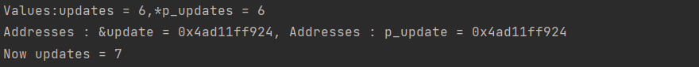


###### 声明和初始化指针

`声明类型[任意空格] *[任意空格] 指针名；`

`int* ptr;`

通常地址需要2或4个字节，这取决于计算机系统

```c++
#include <iostream>

int main() {
    using namespace std;
    int higgens = 5;
    int * pt = &higgens;
    cout <<"Value of higgens = " << higgens;
    cout <<"; Address of higgens = " << &higgens<<endl;
    cout <<"Value of *pt = " <<*pt;
    cout <<"; Value of pt = " << pt <<endl;

}
```

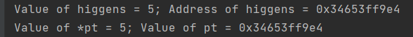


###### 指针问题

当创建指针时，系统会分配内存去保存地址，而不是分配内存去保存值，因此在为初始化地址时进行赋值会导致严重的问题。

`long *fellow;`

`*fellow = 223323;//将值放在一个不存在的地方`

:fried_egg:在进行解引用之前要对指针的执行的地址进行定义


###### 指针和数

指针不是整型，指针是从整型独立出来的类型，指针不能进行整型类型的运算操作，因此不能直接用整型对指针进行赋值。

`int * pt;`

`pt = 0xB8000000`	

C99之前的C可能允许这类操作，但C++有更严格的类型一致要求，因此会进行报错

正确操作，要进行类型转换

`int * pt;`

`pt = (int *)0xB8000000;`


#### new分配内存

指针的作用：

- 访问在编译时期就进行初始化的变量的内存（即命名存储）
- 访问在运行时期分配的未命名存储的存储值（指针是唯一访问方式）


相关库函数：

- malloc()
- new : 创建运行时期未命名存储给指定类型值，并以指针的形式访问该类型，选择正确大小的内存并返回其地址给指针


`int * pn = new int `

基本格式：`typeName * pointer_name = new typeName;`

```c++
#include <iostream>

int main() {
    using namespace std;
    int nights  = 1001;
    int * pt = new int;
    *pt = 1001;

    cout << "night value = ";
    cout << nights <<":location"<<&nights<<endl;
    cout <<" int ";
    cout << " value = "<<*pt <<":location = "<<pt <<endl;

    double *pd = new double;
    *pd = 10000001.0;

    cout << "double";
    cout << "value = "<<*pd<<": location = "<<pd<<endl;
    cout << "location of pointer pd:"<<&pd<<endl;
    cout <<"size of pt = "<<sizeof(pt);
    cout <<":size of *pt = "<<sizeof(*pt)<<endl;
    cout <<"size of pd = "<<sizeof( pd);
    cout <<":size of *pd = " <<sizeof(*pd)<<endl;
}
```

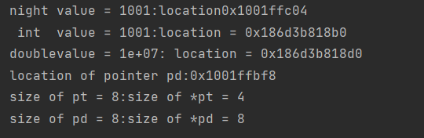

> 值得注意的是，new关键词采用的内存块不同于常用的变量定义，变量存储的内存在栈，而new分配的内存在堆/自由存储区

:warning:当计算机的内存不能满足new的请求时，通常会抛出异常并进行异常处理，在老版本会返回空指针


###### delete

通过delete归还内存，该操作只是去掉存储还非除去指针，对于new和delete的操作要谨慎使用，否则会导致内存泄露，不能释放一个被释放过的内存，否则会造成未定义的结果。并且，不能用delete去释放普通变量内存，delete只能释放通过new操作进行分配的内存。

```c++
int jugs = 5;
int * pi = &jugs;
delete pi;//不允许的操作
```


######  动态数组

编译时期进行数组分配：静态绑定，必须在运行时指定数组大小

运行时期进行数组创建：动态绑定[该数组也叫动态数组]

` int * psome = new int[10];`


对于new和delete的操作应该保持一致，否则会产生未定义的行为

`int * pt = new int;`

`short * ps = new short[500];`

`delete [] pt`;//未定义行为

`delete ps;`//未定义行为

:warning:detete空指针是安全但无意义的行为


系统跟踪分配的内存大小，但不跟踪数组的元素个数，并且内存大小无法通过sizeof操作获取

基本格式:`type_name * pointer_name = new type_name[num_elements];`

e.g.

```c++
#include <iostream>

int main() {
    using namespace std;
    double * p3 = new double [3];
    p3[0] = 0.2;
    p3[1] = 0.5;
    p3[2] = 0.8;
    cout << "p3[1] is " <<p3[1]<<".\n";
    p3=p3+1;//只能对指针进行该操作，不能对数组名进行
    cout << "Now p3[0] is " <<p3[0] << " and p3[1] is "<<p3[1]<<".\n";
    p3=p3-1;
    delete [] p3;
    return 0;
}
```

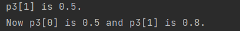


###### 指针，数组以及指针运算

```c++
#include <iostream>

int main() {
    using namespace std;
    double wages[3] = {10000.0,20000.0,30000.0};
    short stacks[3] = {3,2,1};

    double * pw = wages;
    short * ps = &stacks[0];

    cout << "pw = " << pw<<", *pw = "<<*pw<<endl;
    pw+=1;
    cout << "add 1 to the pw pointer:\n";
    cout << "pw = " << pw<<",*pw = "<<*pw<<"\n";
    cout << "ps = "<<ps<<", *ps = "<<*ps <<endl;
    ps+=1;
    cout << "add 1 to the ps pointer:\n";
    cout <<"ps = "<<ps <<",*ps = "<<*ps <<"\n\n\n";

    cout <<"access two elements with array notation\n";
    cout <<"stacks[0] = "<<stacks[0]<<",stacks[1] = "<<stacks[1]<<endl;
    cout <<"access two elements with pointer notation\n";
    cout <<"*stacks = "<<*stacks<<",*(stacks+1) = "<<*(stacks+1)<<endl;
    cout <<sizeof(wages)<<" = size of wages array\n";
    cout <<sizeof(pw)<<" = size of pw pointer\n";
}
```


一般C++会把数组名看作是定一个元素的地址

---

**针和数组的最大区别**

`pointername  = pointername + 1`;

`arrayname = arrayname + 1 ;`//不允许


`sizeof(pointername);`//指针的大小

`sizeof(arrayname);`//数组的大小

数组的地址，虽然数组名被翻译成第一个元素的地址，但是取址操作会返回整个数组的地址

---


e.g.

```c++
#include <iostream>

int main() {
    using namespace std;
    short tell[10];
    cout << tell <<endl;
    cout << &tell <<endl;
}
```

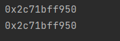

理论上两个值相同，但是&tell+1会增加20，而非2，&tell是一个指向有10个short元素的数组的指针

`short (*pas)[20] = &tell;`

```c++
#include <iostream>

int main() {
    using namespace std;
    int a = 23;
    int *p = &a;
    cout <<p[0];
}
```


###### 指针与字符串

指针由于是指向字符数组的第一个，因此cout在进行打印的时候会按序打印直到遇到空字符，因此可以像打印字符串一样打印字符数组。

被引用的字符串也类似于数组名，代表着第一个元素的地址。也就是说数组中的字符串，引用字符串常量，以及指针指向字符串的处理方式是相同的，以地址的方式进行传递

```c++
#include <iostream>
#include <cstring>

int main() {
    using namespace std;
    char animal[20] = "bear";
    const char * bird = "wren";
    char* ps;
    
    cout << animal <<" and "<<bird<<"\n";
    
    cout <<"Enter a kind of animal:";
    cin >> animal;
    
    ps = animal;
    cout << ps <<"!\n";
    cout <<"Before using strcpy():\n";
    cout << animal <<" at "<<(int *) animal << endl;
    cout << ps << " at "<<(int*)ps<<endl;
    ps = new char[strlen(animal)+1];
    strcpy(ps,animal);
    cout<<"After using strcpy():\n";
    cout<<animal <<" at "<<(int*)animal<<endl;
    cout<<ps<<" at "<<(int*)ps<<endl;
    delete [] ps;
    return 0;
}
```

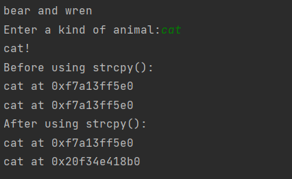


###### 字符串常量

- 编译器会特意留出一段空间用来存储源代码中的引用字符并将存储的字符与其地址项联系
- 字符串字面量是不变的（可用const进行声明）
- 一些编译器对于对字**符串常量赋值**的操作会产生运行时**错误**
- 一些编译器仅使用字符串字面的一个副本来表示程序中该文字的所有出现。
- 编译器可以防止任何尝试更改字符串字面量指向地址位置内容的行为

:warning:通常，如果**给Cout一个指针，它将打印其地址**。 但是，如果指针是char *类型，则将显示指向的字符串。 如果您想查看字符串的地址，则必须类型变化指针指向另一个指针类型,例如int *


###### 拷贝字符串

1. 分配内存：

   a.声明数组

   b.new关键字  `ps = new char[strlen(animal) + 1];`

2. 赋值

[^strlen()]: 字符串长度，排除结尾的空字符
[^strcpy(dst,src)]: 将字符串复制到新内存，该函数将字符串的其余部分复制到数组之后的内存字节中，可以覆盖程序正在使用的其他内存。
[^strncpy()]: 第三个参数要复制的最大字符数，如果这个函数在到达字符串的末尾之前就没有可用空间，它就**不会添加空字符**。

[^new]:运行时分配


在结构体中使用new：*语法与C ++的内置类型完全相同*

```c++
inflatable * ps = new inflatable;
```

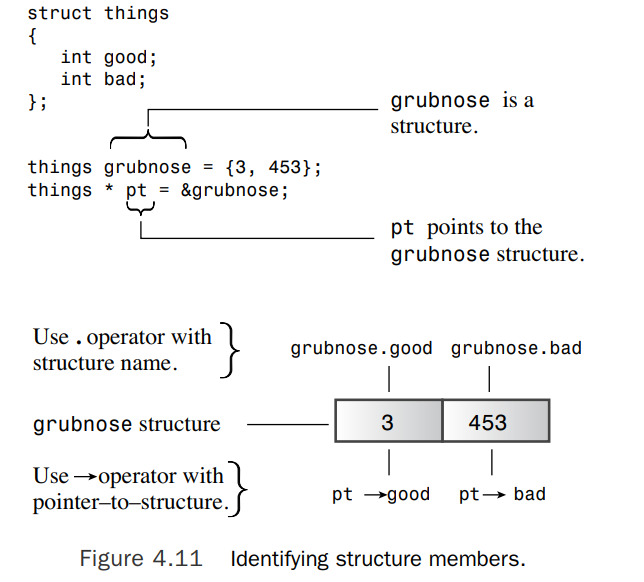


动态创建结构体时，您将无法使用点运算符，因为该结构没有名称。箭头成员运算符（ - >）

```c++
int main() {
    using namespace std;
    inflatable *ps = new inflatable;
    cout << "Enter name of inflatable item:";
    cin.get(ps->name,20);
    cout<< "Enter volume in cubic feet:";
    cin>>(*ps).volume;
    cout<<"Enter price: $";
    cin >> ps->price;
    cout <<"Name:"<<(*ps).name<<endl;
    cout<< "Volume: "<<ps->volume<<" cubic feet\n";
    cout <<"Price: $"<<ps->price<<endl;
    delete ps;
    return 0;
}
```

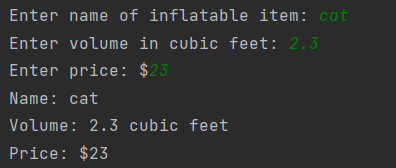


合理分配和使用内存的案例：

```c++
#include <iostream>
#include <cstring>

using namespace std;
char* getname();

int main() {
    char* name;
    name = getname();
    cout << name << " at "<<(int*)name<<"\n";
    delete[] name;

    name = getname();
    cout << name <<" at "<<(int*)name<<"\n";
    delete[] name;

    return 0;
}

char* getname(){
    char temp[80];
    cout << "Enter last name:";
    cin >> temp;
    char* pn = new char[strlen(temp)+1];
    strcpy(pn,temp);

    return pn;
}
```

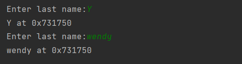

:warning:最好不要将new和delete放在不同函数中

---

**扩充**

内存管理模式

- 自动内存：随函数的调用构建并销毁

  - 函数内部定义的普通变量
  - 通常存储在栈中

- 动态存储（free store/heap）：new 和 delete 运算符提供管理一个内存池，C++ 将其称为**自由存储**或堆，与用于静态和自动变量的内存分开（<mark>内存泄露</mark>）

  :warning:*在栈中，自动增删改查机制导致使用的内存部分始终是连续的。 但是 new 和 delete 之间的相互作用可能会在空闲存储中留下漏洞，使得跟踪在何处分配新内存请求变得更加困难。*

- 静态存储：贯穿整个程序执行的存储

  - 定义：
    - 外部定义它，在一个函数之外
    - 使用关键字static

- 线程存储

---


##### 混合类型案例

```c++
#include <iostream>

struct antarctica_years_end{
    int year;
};


int main() {
    antarctica_years_end s01, s02, s03;
    s01.year = 1998;
    antarctica_years_end *pa = &s02;
    pa->year = 1999;
    antarctica_years_end trio[3];
    trio[0].year=2003;
    std::cout<<trio->year<<"\n";
    const antarctica_years_end* arp[3]={&s01,&s02,&s03};
    std::cout <<arp[1]->year<<"\n";
    const antarctica_years_end** ppa= arp ;
    auto ppb = arp;
    std::cout<<(*ppa)->year<<"\n";
    std::cout<<(*(ppb+1))->year<<"\n";

    //ilegal const antarctica_years_end** arp=&trio; const keyword
    return 0;

}
```

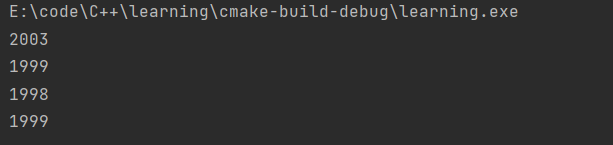


#### 替代数组

vector 和 array 模板类作为替代内置数组。


###### vector模板类

- 它是一个动态数组,可以在运行时设置对象的大小
- vector类用new和delete来管理内存


###### array模板类

- 是 std 命名空间的一部分

- 具有固定大小并使用栈（或静态内存分配）

- 加了便利性和额外的安全性

  

`array<typeName, n_elem> arr;`

:warning:n_elem can’t be a variable


e.g.

```c++
#include <vector>
#include <iostream>
#include <array>
using namespace std;

struct antarctica_years_end{
    int year;
};


int main() {
    //build_in array:c
    double a1[]={1.2,2.4,3.6,4.8};
    //C++ 98 STL
    vector<double> a2(4);
    a2[0]=1.0/3.0;
    a2[1]=1.0/5.0;
    a2[2]=1.0/7.0;
    a2[3]=1.0/9.0;
    //C++ 11
    array<double,4> a3={3.14,2.72,1.62,1.41};
    array<double,4> a4;
    a4=a3;
    cout<<"a1[2]:"<<a1[2]<<" at "<<&a1[2]<<"\n";
    cout<<"a2[2]:"<<a2[2]<<" at "<<&a2[2]<<"\n";
    cout<<"a3[2]:"<<a3[2]<<" at "<<&a3[2]<<"\n";
    cout<<"a4[2]:"<<a4[2]<<" at "<<&a4[2]<<"\n";
    a1[-2]=20.2;
    cout<<"a1[-2]:"<<a1[-1]<<" at "<<&a1[-2]<<"\n";
    cout<<"a3[2]:"<<a3[2]<<" at "<<&a3[2]<<"\n";
    cout<<"a4[2]:"<<a4[2]<<" at "<<&a4[2]<<"\n";
    return 0;

}
```

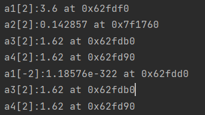


数组对象使用与内置数组相同的内存区域（栈）的地址，而vector对象存储在不同的区域（free store, or heap)

使用 at()，则在运行时和程序中会捕获无效index，默认情况下，中止