# 第五章

[TOC]


#### for 循环

for循环是一个入口条件循环。这意味着在每个循环周期之前评估测试表达式。当测试表达式为假时，循环从不执行循环体。

e.g.

```c++
#include <iostream>

int main(){
    using namespace std;
    int i;
    for(i=0;i<5;i++)
        cout<<"C++ knows loops.\n";
    cout << "C++ knows when to stop.\n";
    return 0;
}
```

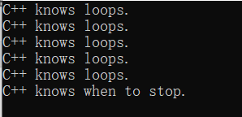

###### 过程

1.	最初设置一个值
2.	执行一个测试，看循环是否应该继续下去
3.	执行循环动作
4.	更新用于测试的值


###### 原理

初始化(循环只执行一次初始化)、测试(关系表达式,比较为真，则程序执行循环体)和更新操作()构成了一个包含在括号中的三部分控制部分，每部分都是一个表达式,表达式之间用分号分隔。控制部分后面的语句称为循环体，只要测试表达式为真，它就会执行：

for (int_expr; test_expr; update_expr) 

​		statement2

statement3


:warning:C++ 语法将完整的 for 语句视为单个语句，即使它可以在主体部分包含一个或多个语句。


值为 0 的表达式将转换为 bool 值 false，然后循环 终止。 如果表达式的计算结果为非零，则将其类型转换为布尔值 true，然后循环继续。

e.g.

```c++
#include <iostream>

int main(){
    using namespace std;
    cout << "Enter the starting countdown value: ";
    int limit;
    cin>>limit;
    int i;
    for(i=limit;i;i--)
        cout<<"i = "<<i<<"\n";
    cout <<"Done now that i= " << i<< "\n";
    getchar();
    getchar();
    return 0;
}
```

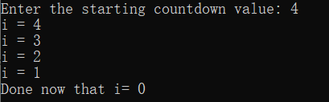


> **Tips**
>
> C++ 是一种非常具有表现力的语言。 任何值或值与运算符的任何有效组合构成一个表达式,每个表达式都有一个值。
>
> - 10 是一个值为 10 的表达式
> - 28 * 20 是一个值为 560 的表达式。
> - maids = (cooks = 4) + 3;赋值表达式的值定义为左侧成员的值


e.g.

```c++
#include <iostream>

int main() {
    using namespace std;
    int x;
    cout << "The expression x= 100 has the value " << (x = 100) << "\n";
    cout << "Now x = "<<x<<endl;
    cout << "The expression x < 3 has the value "<<(x<3)<<"\n";
    cout << "The expression x > 3 has the value "<<(x>3)<<"\n";
    cout.setf(ios_base::boolalpha);// show bool format;
    cout << "The expression x < 3 has the value "<<(x<3)<<"\n";
    cout << "The expression x > 3 has the value "<<(x>3)<<"\n";
    return 0;
    }
```

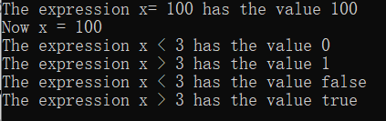

cout 在显示它们之前将 bool 值转换为 int，但是 cout.setf(ios::boolalpha) 函数调用设置了一个标志，指示 cout 显示单词 true 和 false 而不是 1 和 0。


> **Tips**
>
> 判定赋值表达式具有更改值的副作用，判定表达式是主要效果。 并非所有表达式都有副作用。
>
> 计算 x + 15 会计算出一个新值，但不会更改 x 的值。
>
> ++x + 15 有副作用，它涉及递增 x。
>
> 


###### 非表达式与语句

如果添加分号，任何表达式都可以成为语句，但结果可能对编程没有意义。

例如，如果 rodents 是一个变量，那么下面是一个有效的 C++ 语句：

`rodents + 6;	// // 有效但无用`


虽然在任何表达式中添加分号确实使它成为语句，但反之则不然。

例如

- return 语句
- 声明语句：`int load;`
-  for 语句


---

**Tips**

C语言规则

for (expression; expression; expression) 

​		statement

C++ 循环允许在 for 循环的初始化区域声明一个变量,这可能很方便，但它不符合原始语法，因为声明不是表达式。


for (for-init-statement condition; expression) 

​		statement

for-init-statement 被标识为语句，并且语句有自己的分号。

---


```c++
for(int i=0;i<5;i++)
    cout<<"C++ knows loops.\n";
cout<<i<<endl;//没有定义，需要定义
```

:warning:一些较旧的 C++ 实现遵循较早的规则，并将前面的循环视为就好像 i 是在循环之前声明的一样，从而使其在循环终止后可用。


**e.g 生成并打印阶乘**

```c++
#include <iostream>
const int ArSize = 16;

int main() {
    long long factorials[ArSize];
    factorials[1]=factorials[0]=1LL;
    for(int i=2;i<ArSize;i++){
        factorials[i]=i*factorials[i-1];
    }
    for(int i=0;i<ArSize;i++){
        std::cout << i <<"!="<<factorials[i]<<"\n";
    }

    return 0;
    }
```

ArSize 在程序运行期间存在，并且程序文件中的所有函数都可以使用它。

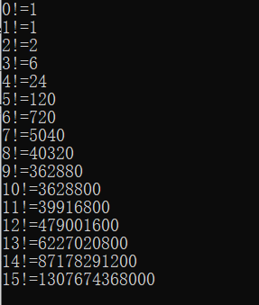


---

**Tips**

定义一个 const 值来表示数组中元素的数量通常是个好主意。

---


**e.g.改变步长**:更新表达式可以是任何有效的表达式

```c++
int main() {
    using std::cout;
    using std::cin;
    cout<<"Enter an integer:";
    int by;
    cin>>by;
    cout<<"Counting by "<<by<<"s:\n";
    for(int i=0;i<100;i+=by)
        cout<<i<<"\n";
    return 0;
    }
```

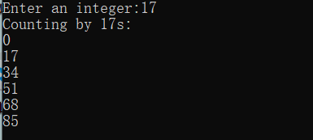

---

**Note**

测试不平等通常比测试平等更好。

---


**e.g.倒序显示字符**

```c++
#include <iostream>
#include <string>

int main() {
    using namespace std;
    cout<<"Enter a word:";
    string word;
    cin>>word;
    for(int i=word.size()-1;i>=0;i--){
        cout<<word[i];
    }
    cout<<"\nBye.\n";
    return 0;
    }
```

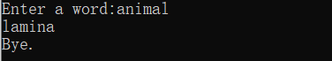

[^size()]:产生字符串中的字符数


###### 单增和单减

递增运算符 (++):将循环计数器增加一个

递减运算符 (--):将循环计数器减少一个


每个运算符有两个变体

- 前缀版本在操作数之前，如 ++b 表示“首先增加 b 的值，然后在计算表达式时使用新值”
- 后缀版本在操作数之后，如a++ “在计算表达式时使用 a 的当前值，然后递增 a 的值。”

`int x= 5;`

`int y=++5;//y=6`


`int z = 5;`

`int y = z++;//y=5;`


**e.g.**

```c++
int main() {
    using namespace std;
    int a = 20;
    int b = 20;
    cout<< "a   = "<<a<< ": b  ="<<b<<"\n";
    cout<< "a++ ="<<a++<<": ++b="<<++b<<"\n";
    cout<< "a   = "<<a<< ": b  ="<<b<<"\n";
    return 0;
    }
```

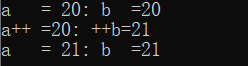

:warning:不要在同一语句中多次递增或递减相同的值。

`x = 2 * x++ * (3 - ++x);	// 除非作为实验，否则不要这样做`


###### 副作用和序列点

**副作用**是在评估表达式修改某些内容（例如存储在变量中的值）时发生的效果。

**序列点**是程序执行中的一个点，在该点保证在继续下一步之前评估所有副作用，在 C++ 中，语句中的分号标记一个序列点。


```c++
while (guests++ < 10)

cout << guests << endl;

```

while 循环，其工作方式类似于只有一个测试表达式的 for 循环。使用后缀形式可以保证在与 10 进行比较后guest将递增。

---

**Note**

`y = (4 + x++) + (6 + x++);`

表达式 4 + x++ 不是完整表达式，因此 C++ 不保证在计算子表达式 4 + x++ 后 x 会立即递增,这里的完整表达式是整个赋值语句，分号标记序列点，因此 C++ 只能保证在程序移动到下一个语句时 x 已经递增两次。C++ 没有指定 x 是在每个子表达式被求值之后递增，还是仅在所有表达式都被求值之后递增，这就是为什么你应该避免这种语句的原因。

---

:warning:C++11 文档删除了术语“序列点”，因为在讨论多线程执行时这个概念不能很好地延续


###### 前缀vs后缀

如果值用于某些目的，例如函数参数或分配给变量，则使用前缀或后缀形式会有所不同。

`x++;`和`++x;`

```c++
for (n = lim; n > 0; --n)

 ...;
```

和

```c++
for (n = lim; n > 0; n--)

  ...;
```

> - 从逻辑上讲，无论使用前缀还是后缀形式，在这两种情况下都没有区别。
>
> 不使用表达式的值，因此唯一的影响是副作用。 这里使用运算符的表达式是完整表达式，因此递增 x 和递减 n 的副作用保证在程序进入下一步时执行； 前缀形式和后缀形式导致相同的最终结果。
>
> - 对于内置类型，使用哪种形式很可能没有区别。 对于具有用户定义的递增和递减运算符的用户定义类型，前缀形式更有效。
>
> 但是 C++ 允许您为类定义这些运算符。 在这种情况下，用户定义一个前缀函数，该函数通过递增一个值然后返回它来工作。但是后缀版本的工作原理是首先存储值的副本，增加值，然后返回存储的副本。因此，对于类，前缀版本比后缀版本更有效。


###### 递增/递减运算符和指针

可以对指针和基本变量使用递增运算符，将递增运算符添加到指针会使其值增加其指向的类型中的字节数。

```c++
double arr[5]={21.1,32.8,23.4,45.2,37.4};

double *pt = arr;//pt 指向 arr[0]，即指向 21.1

++pt;//pt 指向 arr[1]，即指向 32.8

double x = *++pt; //即 arr[2] 或 23.4

++*pt;//即，将 23.4 更改为 24.4

(*pt)++;//25.4

x = *pt++;//*pt++ 的值是 arr[2]，即 25.4，但语句完成后 pt 的值是 arr[3] 的地址。
```

前缀递增、前缀递减和解引用运算符都具有相同的优先级并从右到左关联,后缀自增和自减运算符（从左到右关联。）的优先级相同，都高于前缀优先级。

`*++pt`先把++应用到pt上,然后再把*应用到pt的新值上.


###### 组合加法和赋值运算符

C++ has a combined addition and assignment operator that accomplishes the same result more concisely:

`i += by`等于`i = i + by`

```c++
int *pa = new int[10];	// pa指向pa[0] 
34 += 10;	// 左操作数不能被赋值，错误
```

| 操作符 | L=左操作数，R=右操作数 |
| :----: | :--------------------: |
|   +=   |         L=L+R          |
|   -=   |         L=L-R          |
|   *=   |         L=L*R          |
|   /=   |         L=L/R          |
|   %=   |         L=L%R          |


使用成对的大括号构造复合语句或块:该块由成对的大括号和它们所包含的语句组成，并且出于语法的目的，算作单个语句。

e.g. 

```c++
int main() {
    using namespace std;
    cout << "The Amazing Accounto will sum and average ";
    cout << "five numbers for you.\n";
    cout << "Please enter five values:\n";
    double number;
    double sum = 0.0;
    for (int i = 1; i <= 5; i++)
    {	// block starts here
        cout << "Value " << i << ": "; cin >> number;
        sum += number;
    }	// block ends here

    cout << "Five exquisite choices indeed! "; cout << "They sum to " << sum << "\n";
    cout << "and average to " << sum / 5 << ".\n";
    cout << "The Amazing Accounto bids you adieu!\n";
    return 0;
    }
```

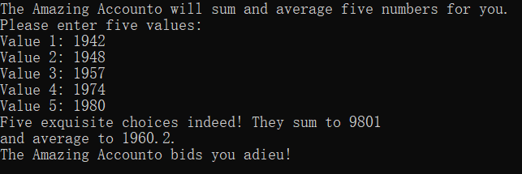

:warning:如果您在块内定义一个新变量，那么只要程序在块内执行语句，该变量就会一直存在。当执行离开块时，变量将被释放。这意味着该变量仅在块内是已知的


如果您在块中声明一个变量，该变量与块外的变量同名,新变量从它的出现点一直隐藏旧变量，直到块结束。然后旧变量再次变得可见.

e.g.

```c++
int main() {
    using namespace std;
    int x = 20;    // original x
    {  // block starts
        cout << x << endl; // use original x int x = 100;  // new x
        cout << x << endl; // use new x
    }  // block ends
    cout << x << endl; // use original x return 0;
    return 0;
    }
```

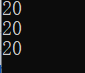


---

**逗号运算符**

逗号运算符使您能够将两个表达式执行在 C++ 语法只允许一个表达式的位置。

`++j, --i// 出于语法目的，两个表达式算作一个`


逗号并不总是逗号运算符:

`int i, j; // comma is a separator here, not an operator`


---

**Note**

[^strlen()]:返回字符数组的字符个数，不包括字符数
[^size()等同于length()]:返回字符串字符个数，由于std::string不以null结尾，故不包含空字符，但c_str()包含null terminated

---


**e.g. 逆序**

```c++
#include <iostream>
#include <string>

int main() {
    using namespace std;
    cout<<"Enter a word:";
    string word;
    cin>>word;

    char temp;
    int i,j;
    for(i=0,j=word.size()-1;i<j;i++,j--){
        temp = word[i];
        word[i]=word[j];
        word[j]=temp;
    }
    cout<<word<<"\nDone\n";
    return 0;
    }
```

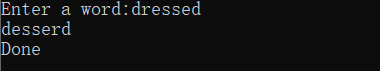


流程解析

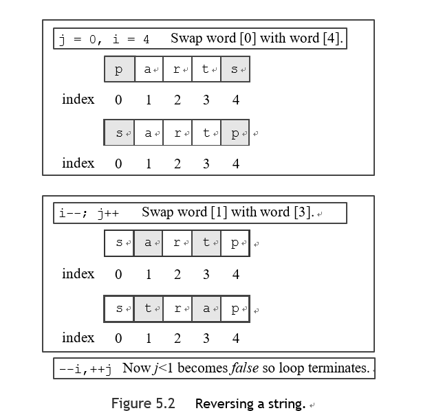


**不能使用逗号运算符组合两个声明**

`int j = 0, i = word.size() - 1;`

在这种情况下，逗号只是列表分隔符，而不是逗号运算符


**可以在 for 循环中声明**

` temp： int temp = word[i];`

这可能会导致在每个循环周期中分配和释放 temp。


---

**Note**

- 逗号运算符保证第一个表达式先于第二个表达式求值

`i = 20, j = 2 * i//i设置为 20，然后 j 设置为 40`

- 逗号表达式的值是表达式第二部分的值。
- **逗号运算符**的优先级是**所有运算符中最低的。**


###### 关系表达式

C++ 提供了六个关系运算符来比较数字。因为字符由它们的 ASCII 代码表示，所以您也可以将这些运算符用于字符。它们可以用于字符串类对象。 如果比较为真，则每个关系表达式都还原为布尔值 true，如果比较为假，则还原为布尔值 false。

| 操作符 |    含义    |
| :----: | :--------: |
|   <<   |    小于    |
|   <=   | 小于或等于 |
|   ==   |    等于    |
|   >    |    大于    |
|   >=   | 大于或等于 |
|   !=   |   不等于   |

:warning:关系运算符的优先级低于算术运算符(非零值测试为真，零测试为假。)


e.g.关于赋值运算符和等于运算符常见错误

```c++
#include <iostream>
#include <string>

int main() {
    using namespace std;
    int quizscores[10] =
            { 20, 20, 20, 20, 20, 19, 20, 18, 20, 20};

    cout << "Doing it right:\n";
    int i;
    for (i = 0; quizscores[i] == 20; i++)
        cout << "quiz " << i << " is a 20\n";
// Warning: you may prefer reading about this program
// to actually running it.
    cout << "Doing it dangerously wrong:\n";
    for (i = 0; quizscores[i] = 20; i++)
        cout << "quiz " << i << " is a 20\n";

    return 0;
    }
```


**字符串操作**

[^strcmp()]:将两个字符串地址作为参数,比较字符串,如果两个字符串相同，函数返回值 0。如果第一个字符串按字母顺序在第二个字符串之前，则 strcmp() 返回一个负值，如果第一个字符串按字母顺序在第二个字符串之后，strcmp() 返回一个正值。

“按系统排序”比“按字母顺序”更准确。 这意味着根据字符的系统代码比较字符。 例如，在 ASCII 码中，大写字母的代码比小写字母的代码小，因此在整理顺序中大写字母在小写字母之前。因此，字符串“Zoo”在字串“aviary”之前。

e.g.比较字符数组

```c++
#include <cstring>

int main() {
    using namespace std;
    char word[5]="?ate";
    for(char ch='a';strcmp(word,"mate");ch++){
        cout<<word<<'\n';
        word[0]=ch;
    }
    cout<<"After loop ends,word is "<<word<<'\n';
    getchar();
    return 0;
    }
```


e.g. 比较字符串类

```c++
int main() {
    using namespace std;
    string word="?ate";
    for(char ch='a';word!="mate";ch++){
        cout<<word<<'\n';
        word[0]=ch;
    }
    cout<<"After loop ends, word is "<<word<<'\n';
    getchar();
    return 0;
}
```

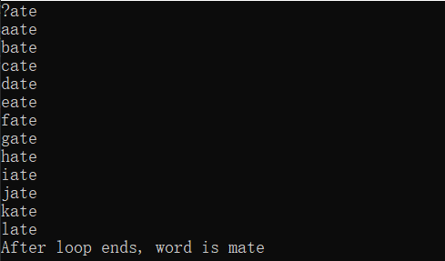

:warning:字符串类重载 != 运算符的方式允许您使用它，只要至少一个操作数是字符串对象；


####  while循环

while 循环是一个去除了初始化和更新部分的 for 循环, 它只有一个测试条件和一个主体.

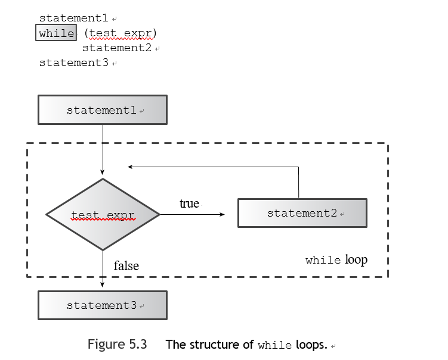

```c++
#include <iostream>
#include <string>
#include <cstring>

const int ArSize = 20;

int main() {
    using namespace std;
    char name[ArSize];
    cout <<"Your first name,please:";
    cin >> name;
    cout<<"Here is your name ,verticalized and ASCIIized:\n";
    int i=0;
    while(name[i]){
        cout<<name[i]<<":"<<int(name[i++])<<'\n';
    }
    getchar();
    getchar();
    return 0;
}
```

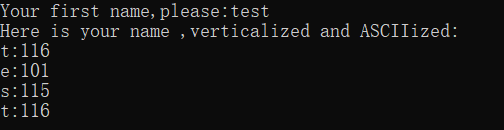

:warning:字符串类对象不使用空字符来标识字符串的结尾


#### for与while

for 循环中缺少的测试表达式被解释为 true，因此该循环将永远运行。


不同点：

- for 循环中省略的测试条件被解释为 true

- 可以在 for 循环中使用初始化语句来声明一个局部于循环的变量；
- 如果正文包含 continue 语句，则会有细微差别


---

**Note**

`while (name[i] != ‘\0’);  // problem semicolon`

一个分号终止一个语句，所以这个分号终止了 while 循环

---


###### 构建延时循环

[^clock()]:返回自程序开始执行以来经过的系统时间。
[^CLOCKS_PER_SEC]:等于每秒的系统时间单位数,因此，系统时间除以这个值得到秒。
[^clock_t]:作为 clock() 返回类型的别名


e.g.延时

```c++
#include <iostream>
#include <string>
#include <cstring>
#include <ctime>

const int ArSize = 20;

int main() {
    using namespace std;
    float secs;
    cin>>secs;
    clock_t delay=secs*CLOCKS_PER_SEC;
    cout<<"Starting\a\n";
    clock_t start=clock();
    while((clock()-start)<delay);
    cout<<"done \a\n";
    return 0;
}
```

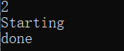

:warning:避免在每个循环周期中将系统时间转换为秒。


---

**类型别名**

C++ 有两种方法来建立一个新名称作为类型的别名。

- 使用预处理器

`#define BYTE char // preprocessor replaces BYTE with char`

预处理器会将所有出现的 BYTE 替换为 char，从而使 BYTE 成为 char 的别名。

- 关键字 typedef 创建别名

`typedef char byte;`

`typedef char byte;`

:warning:使用 #define 尝试类似的操作，如果您声明了一个变量列表，那将不起作用

```c++
#define FLOAT_POINTER 
float * FLOAT_POINTER pa, pb;
```

预处理器替换将声明转换为

```c++
float * pa, pb;//// pa一个指向浮点数的指针，pb 只是一个浮点数
```

typedef 方法没有这个问题。 它处理更复杂的类型别名的能力使得使用 typedef 成为比 #define 更好的选择

---


#### do-while循环

**退出条件循环**:首先执行循环体，然后才评估测试表达式以查看它是否应该继续循环。

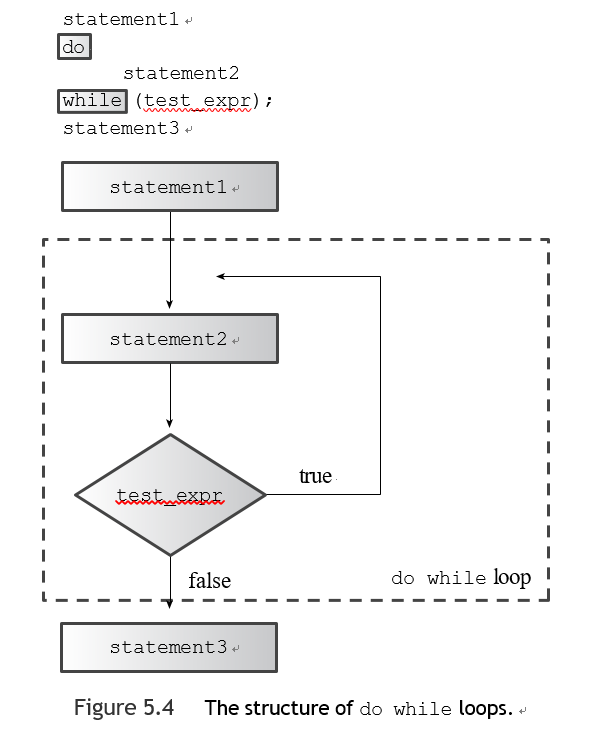

e.g.

```c++
int main() {
    using namespace std;
    int n;
    cout<<"Enter numbers in the range 1-10 to find";
    cout<<"my favorite number\n";
    do{
        cin>>n;
    }while(n!=7);
    cout<<"Yes,7 is my favorite.\n";
    return 0;
}
```

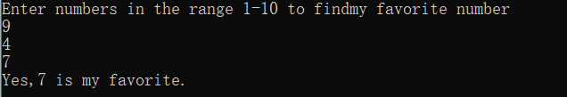


#### range相关循环

**简化一个常见的循环任务:**对数组的每个元素执行某项操作，或者更一般地说，对其中一个容器类（例如向量或数组）执行操作。

e.g.

```c++
int main() {
    using namespace std;
    double prices[5]={4.99,10.99,6.87,7.99,8.49};
    for(double x:prices)
        cout<<x<<'\n';
    return 0;
}
```

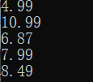


e.g.

```c++
int main() {
    using namespace std;
    double prices[5]={4.99,10.99,6.87,7.99,8.49};
    for(double &x:prices)
        x=x*0.80;
    return 0;
}
```

& 符号将 x 标识为引用变量


e.g基于范围的 for 循环也可以与初始化列表一起使用

```c++
int main() {
    using namespace std;
    double prices[5]={4.99,10.99,6.87,7.99,8.49};
    for(int x:{3,5,2,8,6})
        cout<<x<<' ';
    cout<<'\n';
    return 0;
}
```

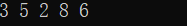


###### 案例：从文件或键盘逐个字符地读取文本

从文件中读取信息

- 文件重定向：用文件代替键盘输入

- 从键盘模拟 EOF 条件

  - 在 Unix 中，可以在一行的开头按 Ctrl+D 来执行此操作

  - 在 Windows 命令提示符模式下，按 Ctrl+Z，然后在该行的任意位置按 Enter

  - 适用于 Mac 的 Symantec C++ 模仿 Unix，并将 Ctrl+D 识别为模拟的 EOF

  - Metrowerks Codewarrior 在 Macintosh 和 Windows 环境中识别 Ctrl+Z

  - Microsoft Visual C++、Borland C++ 5.5 和 GNU C++ 识别 Ctrl+Z （当它是一行中的第一个字符时，但它们需要随后的 Enter）

    


标志停止：

- 特殊字符（有时称为哨兵字符）作为停止标志。
- 检测文件结尾 (EOF):设施与操作系统合作以检测输入何时到达文件末尾并将该信息报告回程序。
  - 当cin 检测到EOF 时，它会将两个位（eofbit 和failbit）设置为1
- 

e.g. 采用cin作为输入

```c++
int main() {
    using namespace std;
    char ch;
    int count =0;
    cout<<"Enter characters;\nenter # to quit:\n";
    cin>>ch;
    while(ch!='#'){
        cout<<ch;
        count++;
        cin>>ch;
    }
    cout<<'\n'<<count<<" characters read\n";
    return 0;
}
```

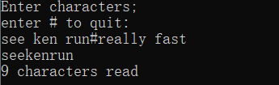

:warning:就像读取其他基本类型时一样，cin 会跳过空格和换行符。输入中的空格不会被回显，因此不会被计算在内。cin 的输入是缓冲的。这意味着您键入的字符在您按下 Enter 之前不会发送到程序。


e.g采用cin.get(char)

```c++
int main() {
    using namespace std;
    char ch;
    int count =0;
    cout<<"Enter characters;\nenter # to quit:\n";
    cin>>ch;
    while(ch!='#'){
        cout<<ch;
        count++;
        cin.get(ch);
    }
    cout<<'\n'<<count<<" characters read\n";
    return 0;
}
```

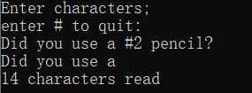

:warning:cin.get(ch) 从输入中读取下一个字符，即使它是一个空格，并将其分配给变量 ch。iostream 头文件将 cin.get(ch) 的参数声明为引用类型，因此该函数可以更改其参数的值。


**cin.get()**

- 一个版本的 cin.get() 有两个参数：字符串的地址（类型为 char*），一个 int 类型的整数。
- 不带参数的:返回输入中的下一个字符,将字符代码返回到类型int值

```c++
char ch = cin.get();
//当功能到达EOF时，没有更多的字符可以返回，cin.get（）返回以符号常数为EOF表示的特殊值。通常，EOF定义为值-1，因为没有字符的ASCII代码为-1，但是您不需要知道实际值。您可以在程序中使用EOF。

int main() {
    using namespace std;
    //使用 fail() 而不是 eof() ，前一种方法似乎适用于更广泛的实现。
    int count=0;
    int ch = cin.get();
    while((ch = cin.get())!=EOF){
        cout.put((char)ch);
        ++count;
    }
    cout<<'\n'<<count<<" characters read\n";
    return 0;
}
```

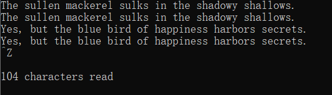

[^cout.put()]: 显示字符,参数类型char而不是类型int。一些C ++实现提供了三个原型：put（char），put（unsigned char）和put（signed char）。 在这些实现中，使用put（）与int参数一起会生成错误消息，因为int的转换选择有三种。

:warning:由于EOF代表有效字符代码之外的值，因此它可能与Char类型不兼容,它可能与Char类型不兼容。 例如，在某些系统类型上，char均未unsigned，因此char变量永远不会具有-1的eof值。 因此，如果您使用cin.get()（没有参数）并测试eof，则必须将返回值分配为type int而不是type char。


- 一个参数，类型为 char,返回值是cin

cin.get(char)函数并未为EOF分配特殊值

**e.g**

```c++
#include <iostream>
#include <string>
#include <cstring>
#include <ctime>

int main() {
    using namespace std;
    //使用 fail() 而不是 eof() ，前一种方法似乎适用于更广泛的实现。
    char ch;
    int count=0;
    cin.get(ch);
    while(!cin.fail()){
        cout<<ch;
        ++count;
        cin.get(ch);
    }
    cout<<'\n'<<count<<" characters read\n";
    clock_t start=clock();
    clock_t delay=CLOCKS_PER_SEC*10;
    while((clock()-start)<delay);
    return 0;
}
```

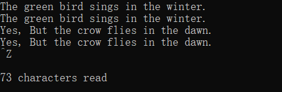

[^cin.eof()]: 查看eofbit 是否已设置,如果检测到 EOF，返回布尔值 true，否则返回 false
[^cin.fail()]: 如果 eofbit 或 failbit 已设置为 1，则 fail() 成员函数返回 true，否则返回 false

:warning:eof() 和 fail() 方法报告最近一次尝试读取的结果


istream类提供了一个可以将istream对象（例如cin）转换为bool值的函数,如果上次尝试的读取成功并且否则为错误。可以重写代码为,它可以检测到其他可能的故障原因，例如磁盘故障。

```c++
while (cin)	// while input is successful
```

进一步缩减

```c++
while (cin.get(ch)) // while input is successful
{
...	// do stuff
}
```


---

**Note**

对于键盘输入，您可能会使用模拟的EOF来定型循环，但希望稍后读取更多输入。

[^cin.clear()]: 方法清除了EOF FLAG，并让输入再次继续进行。

---


**cin.get（ch）与cin.get（）**

|         性质         |            cin.get(ch)            |      ch=cin.get()      |
| :------------------: | :-------------------------------: | :--------------------: |
|  传达输入字符的方法  |           分配到参数ch            | 使用函数返回值分配给ch |
| 字符输入的功能返回值 | 类istream对象（true:bool转换后）  |  字符代码为类型int值   |
|   EOF的功能返回值    | 类istream对象（false:bool转换后） |          EOF           |

cin.get(ch):可以使用链,`cin.get(ch1).get(ch2);`

###### 嵌套循环和二维队列

五个城市的过去4年的最高温度数据

```c++
int maxtemps[4][5];
```

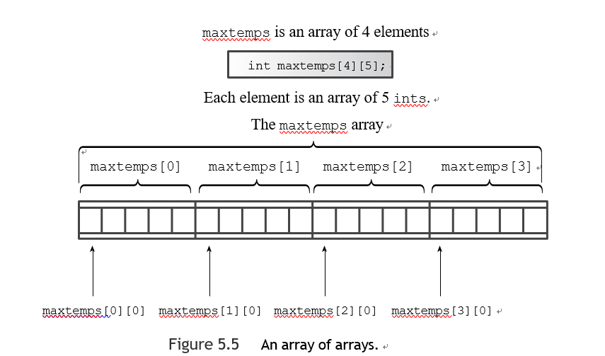


**e.g 打印所有数组内容**

```c++
for (int row = 0; row < 4; row++)
{
for (int col = 0; col < 5; ++col)
cout << maxtemps[row][col] << "\t"; cout << endl;
}
```


**e.g 初始化二维阵列**

```
int maxtemps[4][5] =	// 2-D array
{
{96, 100, 87, 101, 105},	// values for maxtemps[0]
{96, 98, 91, 107, 104},	// values for maxtemps[1]
{97, 101, 93, 108, 107},	// values for maxtemps[2]
{98, 103, 95, 109, 108}	// values for maxtemps[3]
};
```


e.g 

```c++
#include <iostream>
#include <string>
#include <cstring>
#include <ctime>

const int Cities=5;
const int Years=4;

int main() {
    using namespace std;
    const char* cities[Cities] = {
            "Gribble City",
            "Gribble town",
            "New Gribble",
            "San Gribble",
            "Gribble Vista"
    };

    int maxtemps[Years][Cities]={
            {96, 100, 87, 101, 105},   // values for maxtemps[0]
            {96, 98, 91, 107, 104},    // values for maxtemps[1]
            {97, 101, 93, 108, 107},   // values for maxtemps[2]
            {98, 103, 95, 109, 108}    // values for maxtemps[3]
    };
    cout << "Maximum temperatures for 2008 - 2011\n\n";
    for(int city = 0; city < Cities; city++) {
        cout << cities[city] << ":\t";
        for (int year= 0; year < Years; year++) {
            cout << maxtemps[year][city] << "\t";
        }
        cout<<'\n';
    }
    return 0;
}
```

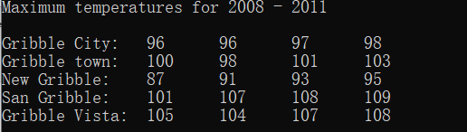


:warning:可以使用字符串类对象数组，如果你想让字符串可以被修改，可以省略const限定词。


