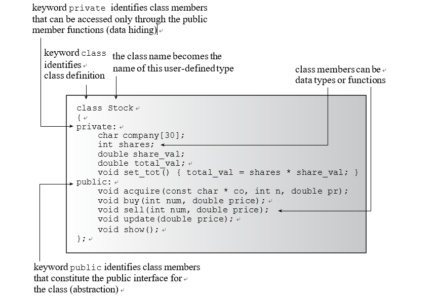
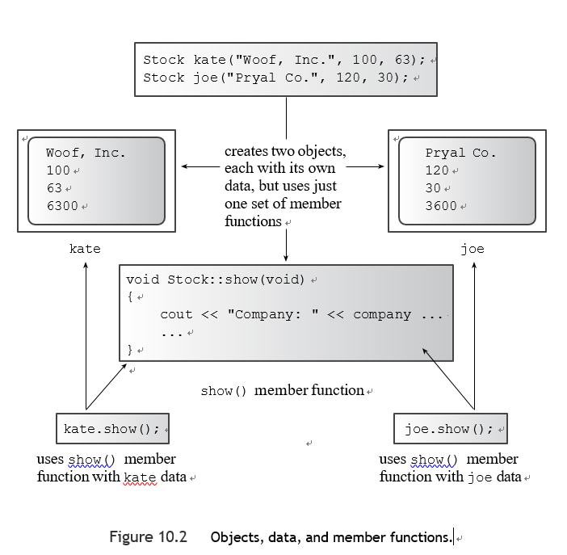
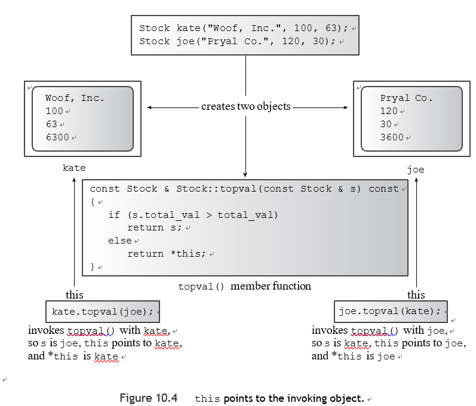

# 第十章

[TOC]


#### 程序和面向对象 

面向对象的编程（OOP）是一种设计程序的特殊概念方法，C++增强了C的功能，使应用这种方法更加容易：

以下是最重要的OOP特性：

- 抽象
- 封装和数据隐藏
- 多态性
- 继承性
- 代码的可重用性


#### 程序设计抽象和类

 指定一个基本类型有三件事：

- 决定一个数据对象需要多少内存
- 决定内存中的位是如何解释的
- 决定哪些操作或方法可以使用数据对象来执行

###### C++中的类

类是一种C++工具，用于将抽象概念转化为用户定义的类型，它将数据表示和操作该数据的方法结合到一个整洁的包中。

e.g 类的定义

```c++
class stock{
private:
    std::string company;
    long shares;
    double share_val;
    double total_val;
    void set_tot() { total_val = shares * share_val; } public:
    void acquire(const std::string & co, long n, double pr); 
    void buy(long num, double price);
    void sell(long num, double price); 
    void update(double price);
    void show();

};

```

C++的关键字class将代码确定为定义了一个类的设计，该语法将Stock作为这个新类的类型名称。该声明使你能够声明变量，称为对象，或实例，Stock类型的变量，每个单独的对象代表一个单一的持有量,将数据和方法绑定到一个单元中是类最显著的特征。

```c++
Stock sally;
Stock solly;
```


###### 访问控制

同样新的是关键字private和public，这些标签描述了类成员的访问控制。任何使用一个特定类的对象的程序都可以直接访问公共部分。一个程序只能通过使用公共成员函数（或通过好友函数）来访问对象的私有成员。这种将数据隔绝于程序直接访问的做法被称为数据隐藏。(C++提供了第三个访问控制关键字，protected) 



一个类的设计试图将公共接口与实现的细节分开。公共接口代表了设计的抽象部分。将实现的细节聚集在一起，并将它们与抽象部分分开，这就是所谓的封装。数据隐藏（将数据放入类的私有部分）是封装的一个实例，将实现的功能细节隐藏在私有部分也是封装的一个实例，封装的另一个实例是将类的函数定义放在与类声明分开的文件中的通常做法。


###### 成员访问控制： public或private

构成类接口的成员函数被放在公共部分，否则，你就不能从程序中调用这些函数。你不必在类的声明中使用关键字private，因为这是类对象的默认访问控制。

C++将类所具有的相同功能扩展到结构上。唯一的区别是，结构的默认访问类型是公共的，而类的默认类型是私有的。C++程序员通常使用类来实现类的描述，同时将结构限制为代表纯数据对象（通常称为普通数据结构，或POD结构）。


###### 实现类的成员函数

成员函数的定义很像普通的函数定义。每个都有一个函数头和一个函数体。成员函数定义可以有返回类型和参数。但是它们也有两个特殊的特点：

- 当你定义一个成员函数时，你使用范围解析操作符（::）来识别该函数所属的类。
- 类方法可以访问类的私有成分

范围解析操作符解析了方法定义所适用的类的身份。我们说标识符update()具有类的范围。如果有必要，股票类的其他内存函数可以使用update()方法，而不需要使用范围解析操作符。这是因为它们属于同一个类，使得update()在范围。


看待方法名称的一种方式是，一个类方法的完整名称包括类的名称。

```c++
Stock::update() 
```

Stock::update()被称为该函数的限定名称。一个简单的update()是全名的缩写（非限定名称）,只在类范围内使用的缩写方法，function可以访问类的私有成员。


```c++
void Stock::acquire(const std::string &co, long n, double pr) {
    company=co;
    if(n<0){
        std::cout << "Number of shares can’t be negative; "
                  << company << " shares set to 0.\n";
        shares = 0;
    }else
        shares=n;
    share_val = pr;
    set_tot();
}

void Stock::buy(long num, double price) {
    if(num<0){
        std::cout << "Number of shares purchased can’t be negative. "
                  << "Transaction is aborted.\n";
    }else{
        shares+=num;
        share_val=price;
        set_tot();
    }
}

void Stock::sell(long num, double price) {
    using std::cout;
    if(num<0){
        cout << "Number of shares sold can’t be negative. "
             << "Transaction is aborted.\n";
    }else if(num>shares){
        cout << "You can’t sell more than you have! "
             << "Transaction is aborted.\n";
    }else{
        shares -= num;
        share_val = price;
        set_tot();
    }

}

void Stock::show() {
    std::cout << "Company: " << company
              << " Shares: " << shares << '\n';
    std::cout<< " Share Price: $" << share_val<< " Total Worth: $" << total_val << '\n';
}

void Stock::update(double price) {
    share_val=price;
    set_tot();
}
```


###### 内联方法

任何在类声明中有定义的函数都会自动成为内联函数。因此，Stock::set_tot()是一个内联函数,类声明中经常使用内联函数来表示简短的成员函数，set_tot()就符合这个条件。如果你愿意，你可以在类声明之外定义一个成员函数，并使其成为内联函数。要做到这一点，你只需在类的实现部分定义该函数时使用内联限定符：

```c++
class Stock
{
    private:
    ...
    void set_tot(); // definition kept separate 
    public:
    ...
};

inline void Stock::set_tot() // use inline in definition
{
    total_val = shares * share_val;
}
```

内联函数的特殊规则要求它们在每个使用它们的文件中被定义。确保内联定义对多文件程序中的所有文件都可用的最简单方法是将内联定义包含在定义相应类的同一个头文件中(有些开发系统可能有智能链接器，允许内联定义进入一个单独的实现文件）。根据重写规则，在类声明中定义一个方法相当于用原型替换方法定义，然后把定义改写成紧跟在类声明之后的内联函数


**方法使用哪个对象？**

首先考虑如何创建一个对象,最简单的方法是声明类变量：

```c++
Stock kate, joe;
```

考虑如何使用这些对象中的一个成员函数，答案是，与结构和结构成员一样，使用成员操作符。

```c++
kate.show();	
```

:warning:当你调用一个成员函数时，它使用用于调用该成员函数的特定对象的数据成员


创建的每一个新对象都包含了它自己的内部变量的存储，即类成员。但是同一类别的所有对象共享相同的类方法集，每个方法只有一个副本。调用一个成员函数就是一些OOP语言所说的发送消息。因此，向两个不同的对象发送相同的消息，调用了相同的方法，但将其应用于两个不同的对象



**使用类**

你可以通过声明一个类变量来创建一个类对象，或者使用new来分配一个类类型的对象。你可以将对象作为参数传递，作为函数返回值返回，并将一个对象分配给另一个对象。C++提供了初始化对象的工具，教cin和cout识别对象，甚至提供类似类的对象之间的自动类型转换。I

main.cpp

```c++
int main()
{
    Stock fluffy_the_cat;
    fluffy_the_cat.acquire("NanoSmart", 20, 12.50);
    fluffy_the_cat.show();
    fluffy_the_cat.buy(15, 18.125);
    fluffy_the_cat.show();
    fluffy_the_cat.sell(400, 20.00);
    fluffy_the_cat.show();
    fluffy_the_cat.buy(300000,40.125);
    fluffy_the_cat.show();
    fluffy_the_cat.sell(300000,0.125);
    fluffy_the_cat.show();

    return 0;
}
```


修改细节

```c++
std::cout.setf(std::ios_base::fixed,std::ios_base::floatfield);
```

这将在cout对象中设置一个标志，指示cout使用定点符号。

```c++
std::cout.precision(3);
```

在小数点右边显示三个位置

将格式化信息重置到show()被调用之前的状态

```c++
std::streamsize prec =std::cout.precision(3); // save preceding value for precision
...
std::cout.precision(prec);	// reset to old value

// store original flags
std::ios_base::fmtflags orig = std::cout.setf(std::ios_base::fixed);
...
// reset to stored values
std::cout.setf(orig, std::ios_base::floatfield);
```


e.g 修改后的show()

```c++
void Stock::show() {
    using std::cout;
    std::ios_base::fmtflags orig=std::cout.setf(std::ios_base::floatfield,std::ios_base::fixed);
    std::streamsize prec=std::cout.precision(3);
    cout << "Company: " << company
         << " Shares: " << shares <<'\n';
    cout << " Share Price: $" << share_val;
// set format to #.##
    cout.precision(2);
    cout << " Total Worth: $" << total_val << '\n';
    std::cout.setf(orig,std::ios_base::floatfield);
    std::cout.precision(prec);
}
```


#### 类的构造函数和析构函数

有一些标准的函数，称为构造函数和析构函数，你通常应该为一个类提供这些函数。 C++的目标之一是使使用类对象与使用标准类型相似。

通常的初始化语法并不适用Stock类型。

```c++
int year = 2001;	// valid initialization struct thing
{
char * pn; int m;
};
thing amabob = {"wodget", -23};	
// valid initialization 
Stock hot = {"Sukie’s Autos, Inc.", 200, 50.25};	// NO! compile error

```

你不能这样初始化Stock对象的原因是数据部分具有私有访问状态，这意味着程序不能直接访问这些数据成员。


C++提供了特殊的成员函数，称为类构造函数，特别是用于构造新的对象并为其数据成员赋值。更确切地说，C++为这些成员函数提供了一个名称和使用它们的语法，而你提供了方法定义。这个方法名称与类的名称相同。

e.g.，Stock class的一个可能的构造函数是一个叫做Stock()的成员函数。构造函数的原型和标题有一个有趣的属性： 虽然构造函数没有返回值，但它没有声明类型为void。事实上，一个构造函数没有声明的类型。


###### 声明和定义构造函数

现在你需要建立一个Stock构造函数。因为一个Stock对象有三个需要从外部世界提供的值，你应该给构造函数三个参数。

```c++
// constructor prototype with some default arguments 
Stock(const string & co, long n = 0, double pr = 0.0);
```

这里是构造函数的一个可能的定义：
// 构造函数定义

```c++
Stock::Stock(const std::string &co, long n, double pr) {
    company=co;
    shares=n;
    if(n<0){
        std::cerr << "Number of shares can’t be negative; "
                  << company << " shares set to 0.\n";
        shares = 0;
    }
    share_val=pr;
    set_tot();
}

```

> 程序在声明一个对象时自动调用构造函数。


**成员名和参数名**

那些刚接触构造函数的人常常试图在构造函数中使用类成员名作为参数名。 这是不对的。构造函数参数并不代表类成员，它们代表的是分配给类成员的值，因此，它们必须有不同的名字。


**使用构造函数**

C++提供了两种使用构造函数初始化对象的方法

- 显示调用构造函数

```c++
Stock food = Stock("World Cabbage", 250, 1.25);
```

- 隐式调用构造函数

```c++
Stock garment("Furry Mason", 50, 2.5);
```

只要你创建一个该类的对象，C++就会使用一个类的构造函数，即使你使用new进行动态内存分配。

```c++
Stock *pstock = new Stock("Electroshock Games", 18, 19.0);
```

你不能用一个对象来调用一个构造函数，因为在构造函数完成其制造对象的工作之前，并没有对象存在。与其说构造函数被一个对象调用，不如说它被用来创建对象。


**默认构造函数**

默认构造函数是指当你没有提供明确的初始化值时，用来创建对象的构造函数。

```c++
Stock fluffy_the_cat; // uses the default constructor
```

如果你没有提供任何构造函数，C++会自动提供一个默认构造函数。这是一个默认构造函数的隐含版本，它什么也不做。

对于Stock class，默认的构造函数是这样的：

```c++
Stock::Stock() { }
```

最终的结果是，fluffy_the_cat对象在创建时没有初始化其成员

---

**Note**

关于默认构造函数的一个奇怪的事实是，只有当你没有定义任何构造函数时，编译器才会提供一个。在你为一个类定义了任何构造函数后，为该类提供默认构造函数的责任就从编译器转移到了你身上。

如果你提供了一个非默认的构造函数，比如Stock(const string & co, long n, double pr)，并且没有提供你自己版本的默认构造函数，那么像这样的声明就会变成一个错误：

```c++
Stock stock1; // not possible with current constructor
```

然而，如果你希望在没有明确初始化的情况下创建对象，你必须定义你自己的默认构造函数。这是一个不需要参数的构造函数。你可以通过两种方式定义默认构造函数。

- 一个是为现有构造函数的所有参数提供默认值

```c++
Stock(const string & co = "Error", int n = 0, double pr = 0.0);
```

- 使用函数重载来定义第二个构造函数，一个没有参数的构造函数


你通常应该初始化对象，以确保所有成员以已知的、合理的值开始。

```c++
Stock::Stock()	// default constructor
{
    company = "no name"; 
    shares = 0;
    share_val = 0.0;
    total_val = 0.0;
}
```

:warning:当你设计一个类时，你通常应该提供一个默认的构造函数，隐式地初始化所有的类成员。


在你使用任一方法（无参数或所有参数的默认值）创建默认构造函数后，你可以声明对象变量而不明确初始化它们：

```c++
Stock first;	// calls default constructor implicitly 
Stock first = Stock();	// calls it explicitly
Stock *prelief = new Stock; // calls it implicitly
Stock first("Concrete Conglomerate");	// calls constructor 
Stock second();	// declares a function
Stock third;	// calls default constructor
```

:warning:当你隐式调用默认构造函数时，你不需要使用括号。


###### 析构函数

当您使用构造函数创建对象时，程序会负责跟踪该对象直到其失效。在这个时候，程序会自动调用一个名为“析构函数”的特殊成员函数。析构函数应该清理任何未清理的东西，因此它实际上是有用的。例如，如果您的构造函数使用 new 来分配内存，那么析构函数应该使用 delete 来释放该内存。Stock 构造函数没有使用 new 进行任何操作，因此 Stock 类的析构函数实际上没有任何任务要执行。在这种情况下，您可以让编译器生成一个隐式的、什么也不做的析构函数，这正是 Stock 类的第一个版本所做的事情。

和构造函数一样，析构器也有一个特殊的名字：它由类的名称组成，前面有一个省略号（~），和构造函数一样，析构函数可以没有返回值，也没有声明的类型，与构造函数不同，析构器必须没有参数。

e.g.

```
~Stock();
```


什么时候应该调用一个析构器？编译器会处理这个决定；通常你的代码不应该明确地调用一个析构器。

- 如果你创建了一个静态存储类对象，它的析构器会在程序终止时被自动调用。
- 如果你创建了一个自动存储类对象，当程序退出定义该对象的代码块时，它的析构器会被自动调用。
- 如果该对象是通过使用new创建的，它驻留在堆内存中，或自由存储区，当你使用delete释放内存时，它的析构器会被自动调用。
- 最后，程序可以创建临时对象来执行某些操作，在这种情况下，程序在使用完对象后会自动调用其析构器。

因为当一个类对象过期时，会自动调用一个析构器，所以应该有一个析构器。如果你不提供一个，编译器会隐含地声明一个默认的构造函数，如果它检测到存在对象销毁的行为，它会提供一个析构器的定义。


e.g. 头文件

```c++
#include <string>
//用双引号而不是方括号括起来的文件名会使编译器在你的源文件所在的同一位置搜索它。
class Stock{
private:
    std::string company;
    long shares;
    double share_val;
    double total_val;
    void set_tot() { total_val = shares * share_val; }
public:
    Stock();
    Stock(const std::string &co,long n=0,double pr=0);
    ~Stock();
    void buy(long num, double price);
    void sell(long num, double price);
    void update(double price);
    void show();

};
```


e.g.源代码文件

```c++
//
// Created by student on 2023/3/23.
//

#include "support.h"
#include <iostream>


void Stock::buy(long num, double price) {
    if(num<0){
        std::cout << "Number of shares purchased can’t be negative. "
                  << "Transaction is aborted.\n";
    }else{
        shares+=num;
        share_val=price;
        set_tot();
    }
}

void Stock::sell(long num, double price) {
    using std::cout;
    if(num<0){
        cout << "Number of shares sold can’t be negative. "
             << "Transaction is aborted.\n";
    }else if(num>shares){
        cout << "You can’t sell more than you have! "
             << "Transaction is aborted.\n";
    }else{
        shares -= num;
        share_val = price;
        set_tot();
    }

}

void Stock::show() {
    using std::cout;
    std::ios_base::fmtflags orig=std::cout.setf(std::ios_base::floatfield,std::ios_base::fixed);
    std::streamsize prec=std::cout.precision(3);
    cout << "Company: " << company
         << " Shares: " << shares <<'\n';
    cout << " Share Price: $" << share_val;
// set format to #.##
    cout.precision(2);
    cout << " Total Worth: $" << total_val << '\n';
    std::cout.setf(orig,std::ios_base::floatfield);
    std::cout.precision(prec);
}

void Stock::update(double price) {
    share_val=price;
    set_tot();
}

Stock::Stock(const std::string &co, long n, double pr) {
    std::cout << "Constructor using " << co << " called\n";
    company=co;
    shares=n;
    if(n<0){
        std::cerr << "Number of shares can’t be negative; "
                  << company << " shares set to 0.\n";
        shares = 0;
    }
    share_val=pr;
    set_tot();
}

Stock::Stock() {
    std::cout << "Default constructor called\n";
    company = "no name";
    shares = 0;
    share_val = 0.0;
    total_val = 0.0;

}

Stock::~Stock() {
    std::cout << "Bye, " << company << "!\n";
}
```


e.g.一个测试文件

```c++
int main() {
    {
    using std::cout;
    cout << "Using constructors to create new objects\n";
    Stock stock1("NanoSmart", 12, 20.0);    // syntax 1
    stock1.show();
    Stock stock2 = Stock("Boffo Objects", 2, 2.0); // syntax 2
    stock2.show();

    cout << "Assigning stock1 to stock2:\n";
    stock2 = stock1;
    cout << "Listing stock1 and stock2:\n";
    stock1.show();
    stock2.show();

    cout << "Using a constructor to reset an object\n";
    stock1 = Stock("Nifty Foods", 10, 50.0);    // temp object
//stock1对象已经存在。因此，该语句没有初始化stock1，而是为该对象分配了新的值。它通过让构造函数创建一个新的、临时的对象，然后将新对象的内容复制到stock1.然后程序处置临时对象，在这样做的时候调用析构函数
    cout << "Revised stock1:\n";
    stock1.show();
    cout << "Done\n";
        //因为这种自动变量会进入堆栈，所以最后创建的对象是第一个被删除的，而第一个被创建的对象是最后被删除的。
}
    return 0;
}
```


>Using constructors to create new objects
>Constructor using NanoSmart called
>Company: NanoSmart Shares: 12
>Share Price: $20.000Total Worth: $240.00
>Constructor using Boffo Objects called
>Company: Boffo Objects Shares: 2
>Share Price: $2.000Total Worth: $4.00
>Assigning stock1 to stock2:
>Listing stock1 and stock2:
>Company: NanoSmart Shares: 12
>Share Price: $20.000Total Worth: $240.00
>Company: NanoSmart Shares: 12
>Share Price: $20.000Total Worth: $240.00
>Using a constructor to reset an object
>Constructor using Nifty Foods called
>Bye, Nifty Foods!
>Revised stock1:
>Company: Nifty Foods Shares: 10
>Share Price: $50.000Total Worth: $500.00
>Done
>Bye, NanoSmart!
>Bye, Nifty Foods!

C++标准给了编译器几种执行第二种语法的方法

- 一种是让它的行为与第一种语法完全一样
- 第二种方法是允许调用构造函数来创建一个临时对象，然后复制到stock2.然后丢弃这个临时对象。如果编译器使用这个选项，就会为临时对象调用析构器，而产生这样的输出：

```c++
Constructor using Boffo Objects called 
Company: Boffo Objects Shares: 2
```

与结构赋值一样，类对象赋值，在默认情况下，将一个对象的成员复制到另一个对象。在这种情况下，stock2的原始内容被覆盖了。

:warning:当你把一个对象赋值给同一类别的另一个对象时，默认情况下，C++会把源对象的每个数据成员的内容复制到目标对象的相应数据成员。

:warning:有些编译器可能会稍后处理临时对象，推迟析构器的调用。

*如果你可以通过初始化或赋值来设置对象的值，请选择初始化。它通常更有效率。*

---

**Note**

您可能已经注意到在 main() 的开头和结尾附近有一个额外的大括号。 当程序退出包含它们定义的块时，诸如 stock1 和 stock2 之类的自动变量就会失效。 如果没有额外的大括号，该块将成为 main() 的主体，因此在 main() 完成执行之前不会调用析构函数。 在窗口环境中，这意味着窗口将在最后两个析构函数调用之前关闭，从而阻止您看到最后两个消息。 但是对于大括号，最后两个析构函数调用发生在返回语句之前，因此会显示消息。

不完全准确，目前有的编译器对此进行了优化

---


**C++11的列表初始化**

在C++11中，你可以在类中使用列表初始化语法，只要括号内的内容与构造函数的参数列表相匹配：

```c++
Stock hot_tip = {"Derivatives Plus Plus", 100, 45.0}; 
Stock jock {"Sport Age Storage, Inc"};
Stock temp {};
```

---

**Note**

C++11提供了一个名为std::initializer_list的类，可以作为函数或方法参数的类型。这个类可以代表一个任意长度的列表，前提是所有条目都是相同的类型，或者可以转换为相同的类型。

---


如果一个构造函数只有一个参数，如果你将一个对象初始化为一个与构造函数参数类型相同的值，该构造函数就会被调用。

例如，假设你有这个构造函数的原型：

```c++
Bozo(int age);
```

那么你可以使用以下任何一种形式来初始化一个对象：

```c++
Bozo dribble = bozo(44);	// primary form 
Bozo roon(66);	// secondary form
Bozo tubby = 32;	// special form for one-argument constructors
```

:warning:一个可以使用单一参数的构造函数允许你使用赋值语法将一个对象初始化为一个值


**const成员函数**

e.g.

```c++
const Stock land = Stock("Kludgehorn Properties"); 
land.show();
```

在当前的C++中，编译器应该反对第二行。为什么？ 因为show()的代码不能保证它不会修改调用的对象，因为它是const，所以不应该被改变。

```c++
void show() const;	// promises not to change invoking object 
```

以这种方式声明和定义的类函数被称为常量成员函数。就像你应该在适当的时候使用常量引用和指针作为正式的函数参数一样，你应该在不修改调用对象的情况下使类方法成为常量。


#### 了解你的对象：this指针

一个方法可能需要处理两个对象，而这样做可能涉及到一个奇怪的C++指针，叫做this，this 指针指向用于调用成员函数的对象。

```c++
const Stock & topval(const Stock & s) const;
```

一般来说，所有的类方法都有一个this指针，设置为调用该方法的对象的地址。函数调用stock1.topval(stock2)将this设置为stock1对象的地址，并使该指针可用于topval()方法。




每个成员函数，包括构造函数和析构函数，都有一个this指针。this指针的特殊属性是，它指向调用的对象。如果一个方法需要引用整个调用对象，它可以使用表达式*this。在函数参数括号后使用const修饰符可以将this限定为一个指向const的指针；在这种情况下，你不能用this来改变对象的值。

e.g当前头文件

```c++
class Stock{
private:
    std::string company;
    long shares;
    double share_val;
    double total_val;
    void set_tot() { total_val = shares * share_val; }
public:
    Stock();
    Stock(const std::string &co,long n=0,double pr=0);
    ~Stock();
    void buy(long num, double price);
    void sell(long num, double price);
    void update(double price);
    void show() const;
    const Stock& topval(const Stock& s) const;

};
```


e.g 当前源代码文件

```c++
void Stock::buy(long num, double price) {
    if(num<0){
        std::cout << "Number of shares purchased can’t be negative. "
                  << "Transaction is aborted.\n";
    }else{
        shares+=num;
        share_val=price;
        set_tot();
    }
}

void Stock::sell(long num, double price) {
    using std::cout;
    if(num<0){
        cout << "Number of shares sold can’t be negative. "
             << "Transaction is aborted.\n";
    }else if(num>shares){
        cout << "You can’t sell more than you have! "
             << "Transaction is aborted.\n";
    }else{
        shares -= num;
        share_val = price;
        set_tot();
    }

}

void Stock::show() const{
    using std::cout;
    std::ios_base::fmtflags orig=std::cout.setf(std::ios_base::floatfield,std::ios_base::fixed);
    std::streamsize prec=std::cout.precision(3);
    cout << "Company: " << company
         << " Shares: " << shares <<'\n';
    cout << "Share Price: $" << share_val;
// set format to #.##
    cout.precision(2);
    cout << "Total Worth: $" << total_val << '\n';
    std::cout.setf(orig,std::ios_base::floatfield);
    std::cout.precision(prec);
}

void Stock::update(double price) {
    share_val=price;
    set_tot();
}

Stock::Stock(const std::string &co, long n, double pr) {
    std::cout << "Constructor using " << co << " called\n";
    company=co;
    if(n<0){
        std::cerr << "Number of shares can’t be negative; "
                  << company << " shares set to 0.\n";
        shares = 0;
    }else
        shares=n;
    share_val=pr;
    set_tot();
}

Stock::Stock() {
    std::cout << "Default constructor called\n";
    company = "no name";
    shares = 0;
    share_val = 0.0;
    total_val = 0.0;

}

Stock::~Stock() {
}

const Stock& Stock::topval(const Stock &s) const{
   if(s.total_val>this->total_val){
       return s;
   }else return *this;
}
```


#### 对象的数组

你声明一个对象数组的方式与声明任何标准类型的数组一样：

```c++
Stock mystuff[4]; // creates an array of 4 Stock objects
```

> 程序在创建没有明确初始化的类对象时，总是调用默认的类构造函数。


你可以使用一个构造函数来初始化数组元素。在这种情况下，你必须为每个单独的元素调用构造函数：

```c++
const int STKS = 4; 
Stock stocks[STKS] = {
Stock("NanoSmart", 12.5, 20),
Stock("Boffo Objects", 200, 2.0),
Stock("Monolithic Obelisks", 130, 3.25),
Stock("Fleep Enterprises", 60, 6.5)
};
```

这段代码使用了初始化数组的标准形式：用花括号括起来的逗号分隔的值列表。在这种情况下，每个值都是调用构造函数方法的结果。如果这个类有多个构造函数，你可以为不同的元素使用不同的构造函数。


如果该类有一个以上的构造函数，你可以对不同的元素使用不同的构造函数：

```c++
const int STKS = 10; 
Stock stocks[STKS] = {
    Stock("NanoSmart", 12.5, 20), 
    Stock(),
    Stock("Monolithic Obelisks", 130, 3.25),
};
```

因为这个声明只是部分初始化了数组，剩下的七个成员是用默认的构造函数初始化的。


e.g.

```c++
const int STKS=10;

int main() {

    // create an array of initialized objects
    Stock stocks[STKS] = {
            Stock("NanoSmart", 12, 20.0),
            Stock("Boffo Objects", 200, 2.0),
            Stock("Monolithic Obelisks", 130, 3.25),
            Stock("Fleep Enterprises", 60, 6.5)
    };

    std::cout << "Stock holdings:\n"; int st;
    for (st = 0; st < STKS; st++)
        stocks[st].show();
// set pointer to first element
    const Stock * top = &stocks[0];
    for (st = 1; st < STKS; st++)
        top = &(top->topval(stocks[st]));

std::cout << "\nMost valuable holding:\n";
top->show();


_mywait();
    return 0;
}
```

---

**Note**

最初的Unix实现使用了一个C++前端cfront，将C++程序转换为C程序。为了处理方法定义，它所要做的就是转换一个C++方法定义

```c++
void Stock::show() const
{
cout << "Company: " << company
<< " Shares: " << shares << ‘\n’
<< " Share Price: $" << share_val
<< " Total Worth: $" << total_val << ‘\n’;
}
```

到以下C语言风格的定义：

```c++
void show(const Stock * this)
{
cout << "Company: " << this->company
<< " Shares: " << this->shares << ‘\n’
<< " Share Price: $" << this->share_val
<< " Total Worth: $" << this->total_val << ‘\n’;
}

```

它将Stock::限定符转换为一个函数参数，该参数是一个指向Stock的指针，然后使用该指针来访问类成员。
类似地，前端将函数调用，如

```c++
top.show(); 
```

的函数调用转换为这个： 

```c++
show(&top);
```

以这种方式，这个指针被分配到调用对象的地址。(实际的细节可能会更多一些)。


#### 类的范围

C++类引入了一种新的作用域：类作用域。

类的范围适用于在类中定义的名称，如类数据成员和类成员函数的名称。具有类范围的项目在类内是已知的，但在类外是不知道的。因此，你可以在不同的类中使用相同的类成员名称而不发生冲突。类的作用域意味着你不能直接从外部访问类的成员，即使是公共成员函数也是如此。也就是说，要调用公共成员函数，必须使用对象。

在类声明或成员函数定义内，可以使用未加修饰的成员名称（未限定名称）。一个构造函数的名字在被调用时被识别，因为它的名字与类的名字相同。否则，当你使用一个类成员名时，你必须根据上下文使用直接成员操作符（.）、间接成员操作符（->）或范围解析操作符（::）。

**类范围常量**

```c++

class Bakery
{
private:
const int Months = 12;	// declare a constant? FAILS double costs[Months];
...
```

 :warning:声明一个类描述了一个对象的样子，但并不创建一个对象，因此，在你创建一个对象之前，没有任何地方可以存储一个值。


- 可以在一个类中声明一个枚举。在类声明中给出的枚举具有类的范围，所以你可以使用枚举为整数常量提供类范围的符号名称。

```c++
class Bakery
{
private:
enum {Months = 12}; 
double costs[Months];
...
```

以这种方式声明一个枚举并不创建一个类的数据成员。也就是说，每个单独的对象中并不带有一个枚举。相反，只是一个符号化的名字，当编译器在类的范围内遇到它时，会用30来代替。因为Bakery类使用枚举只是为了创建一个符号常量，并不打算创建枚举类型的变量，所以你不需要提供一个枚举标签。


---

**Note**

ios_base类在其公共部分做了类似的事情，是诸如ios_base::fixed这样的标识符的来源，fixed通常是一个定义在ios_base类中的枚举器。

---


- 使用关键字static：

```c++
class Bakery
{
private:
static const int Months = 12; double costs[Months];
...
```

这就创建了一个名为Muns的常量，它与其他静态变量一起存储，而不是存储在一个对象中。因此，只有一个Muns常量被所有Bakery对象共享。

>  在C++98中，你只能使用这种技术来声明具有积分和枚举值的静态常量。因此，C++98不允许你用这种方式来存储一个双倍常量。C++11取消了这一限制。


**作用域枚举（C++11）**

传统的枚举有一些问题。一个是来自两个不同枚举定义的枚举器会发生冲突。C++11提供了一种新的枚举形式，通过为其枚举器设置类的范围来避免这个问题。这种形式的声明看起来像这样：

```c++
enum class egg {Small, Medium, Large, Jumbo};
enum class t_shirt {Small, Medium, Large, Xlarge};
```

另外，你也可以用关键字struct来代替class，在这两种情况下，你现在都需要使用枚举名称来限定枚举器：

```c++
egg choice = egg::Large;	// the Large enumerator of the egg 
enum t_shirt Floyd = t_shirt::Large; // the Large enumerator of the t_shirt enum
```

现在，枚举器有了类的范围，来自不同枚举定义的枚举器不再有潜在的名称冲突，你的鸡蛋和衬衫项目可以继续进行。

C++11还加强了范围内枚举的类型安全性。常规枚举在某些情况下会自动转换为整数类型，例如赋值给int变量或被用于比较表达式，但范围内的枚举没有隐含的转换为整数类型：

```c++
enum egg_old {Small, Medium, Large, Jumbo};	// unscoped 
enum class t_shirt {Small, Medium, Large, Xlarge}; // scoped 
egg_old one = Medium;	// unscoped
t_shirt rolf = t_shirt::Large;	// scoped 
int king = one;	// implicit type conversion for unscoped
int ring = rolf;	// not allowed, no implicit type conversion 
if (king < Jumbo)	// allowed
std::cout << "Jumbo converted to int before comparison.\n"; 
if (king < t_shirt::Medium)	// not allowed
std::cout << "Not allowed: < not defined for scoped enum.\n";

```


枚举是由一些底层的整数类型表示的，在C98下，这种选择是依赖于实现的。因此，一个包含枚举的结构在不同的系统上可能有不同的大小。C++11对范围内的枚举取消了这种依赖性。默认情况下，C++11范围内的枚举的底层类型是int。此外，有一种语法可以表示不同的选择：

```c++
// underlying type for pizza is short
enum class pizza: short {Small, Medium, Large, XLarge};
```

: short底层类型为短。底层类型必须是一个整数类型。在C++11下，你也可以用这个语法来表示非范围枚举的底层类型，但如果你不选择类型，实现与编译器的选择有关的。


#### 抽象数据类型

让我们以一种一般的、抽象的方式来看看堆栈的属性。首先，一个堆栈可以容纳几个项目。(这个属性使它成为一个容器，一个更一般的抽象。)接下来，一个堆栈的特点是你可以对它进行的操作：

- 你可以创建一个空栈
- 你可以在堆栈的顶部添加一个项目
- 你可以从顶部移除一个项目（也就是说，你可以弹出一个项目）。
- 你可以检查堆栈是否已满。
- 你可以检查堆栈是否为空。

你可以用一个类的声明来匹配这个描述，其中公共成员函数提供了一个表示堆栈操作的接口，私有数据成员负责存储堆栈数据。

e.g.

```c++
typedef unsigned long Item;
class Stack
{
private:
    enum{MAX=10};
    Item items[MAX];
    int top;
public:
    Stack();
    bool isempty() const;
    bool isfull() const;
    bool push(const Item &item);
    bool pop(Item &item);
};
```


e.g. 源代码文件

```c++
Stack::Stack() {
    top=0;
}

bool Stack::pop(Item &item) {
    if(isempty()){
        return false;
    }
    item=items[--top];
    return true;
}

bool Stack::push(const Item &item) {
    if(isfull()){
        return false;
    }
    items[top++]=item;
    return true;
}

bool Stack::isempty() const {
    return top==0;
}

bool Stack::isfull() const {
    return top==MAX;
}
```


main.cpp

```c++
int main() {

    using namespace std;
    Stack st; // create an empty stack
    char ch;
    unsigned long po;
    cout << "Please enter A to add a purchase order,\n"
         << "P to process a PO, or Q to quit.\n";
    while (cin >> ch && toupper(ch) != 'Q')
    {

        while (cin.get() != '\n')
            continue;
        if (!isalpha(ch))
        {
            cout << '\q';
            continue;
        }
        switch(ch)
        {
            case 'A':
            case 'a':
                cout << "Enter a PO number to add: ";
                cin >> po;
                if (st.isfull())
                    cout << "stack already full\n";
                else
                    st.push(po);
                break;
            case 'P':
            case 'p':
                if (st.isempty())
                    cout << "stack already empty\n";
                else {
                    st.pop(po);
                    cout << "PO #" << po << " popped\n";
                }
                break;
        }
        cout << "Please enter A to add a purchase order,\n"
             << "P to process a PO, or Q to quit.\n";
    }
    cout << "Bye\n";
    return 0;
}
```


