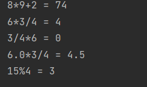
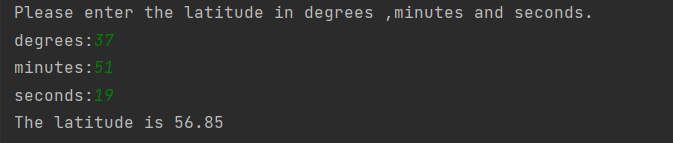
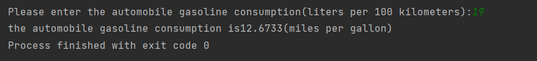

# 第三章练习

#### 问答题

\1. Why does C++ have more than one integer type? 

为了适应不同的需求，节约空间利用率，提高计算机处理效率


2.Declare variables matching the following descriptions: 

a. A short integer with the value 80 

b. An unsigned int integer with the value 42,110 

c. An integer with the value 3,000,000,000

a:unsigned short value = 80;

b:unsigned int =42110;

c: long 


\3. What safeguards does C++ provide to keep you from exceeding the limits of an integer type?

没有


\4. What is the distinction between 33L and 33?

类型不同，一个是long,一个是int


\5. Consider the two C++ statements that follow: 

`char grade = 65; `

`char grade = 'A';`

Are they equivalent?

是滴


\6. How could you use C++ to find out which character the code 88 represents? Come up with at least two ways

`char ch=88;`

`cout<<ch;`


`cout<<(int)(88-'a')<<endl;`

`cout<<int(88-'A')<<endl;`


\7. Assigning a long value to a float can result in a rounding error.What about assigning long to double? long long to double? 

long to double会可能产生精度误差，long long也是；


8.Evaluate the following expressions as C++ would: 

a. 8 * 9 + 2 =74

b. 6 * 3 / 4 =4

**c. 3 / 4 * 6=0**

d. 6.0 * 3 / 4 =4.5

e. 15 % 4 =3




9.Suppose x1 and x2 are two type double variables that you want to add as integers and assign to an integer variable. Construct a C++ statement for doing so.What if you want to add them as type double and then convert to int?

`int x3 = (int)x1+(int)x2`

`int x3 = x1+x2;`


10. What is the variable type for each of the following declarations? 

a. auto cars = 15; 

b. auto iou = 150.37f; 

c. auto level = 'B'; 

d. auto crat = U'/U00002155'; 

e. auto fract = 8.25f/2.5;

a:int \ b:float \ c:char \ d:char32_t \ e:float


#### 编程题

\1. Write a short program that asks for your height in integer inches and then converts your height to feet and inches. Have the program use the underscore character to indicate where to type the response.Also use a const symbolic constant to represent the conversion factor.

```c++
#include <iostream>

int main(){
    using namespace std;
    int height;
    const int f2i = 12;
    cout<<"Please enter the height in inches:______\b\b\b\b\b\b";
    cin >> height;
    cout<<"Your height is "<<(double)height/f2i<<" in inches.\n";
    return 0;
}
```


\2. Write a short program that asks for your height in feet and inches and your weight in pounds. (Use three variables to store the information.) Have the program report your body mass index (BMI).To calculate the BMI, first convert your height in feet and inches to your height in inches (1 foot = 12 inches).Then convert your height in inches to your height in meters by multiplying by 0.0254.Then convert your weight in pounds into your mass in kilograms by dividing by 2.2. Finally, compute your BMI by dividing your mass in kilograms by the square of your height in meters. Use symbolic constants to represent the various conversion factors. 

```c++
#include <iostream>
#include <cmath>

int main() {
    using namespace std;
    double height, weight;
    const int f2i = 12;
    const float i2m = 0.0254;
    const float p2k = 2.2;
    cout << "Please enter your height in feet:______\b\b\b\b\b\b";
    cin >> height;
    cout << "Please enter your weight in pounds:______\b\b\b\b\b\b";
    cin >> weight;
    cout << "Your BMI is :______\b\b\b\b\b\b" << weight / p2k * pow(height * f2i * i2m, 2) << endl;
    return 0;
}
```


3.Write a program that asks the user to enter a latitude in degrees, minutes,and seconds and that then displays the latitude in decimal format.There are 60 seconds of arc to a minute and 60 minutes of arc to a degree; represent these values with symbolic constants.You should use a separate variable for each input value.A sample run should look like this: Enter a latitude in degrees, minutes, and seconds: First, enter the degrees: 37 Next, enter the minutes of arc: 51 Finally, enter the seconds of arc: 19 37 degrees, 51 minutes, 19 seconds = 37.8553 degrees 

```c++
#include <iostream>

int main() {
    using namespace std;
    double degrees,minutes,seconds;
    const int s2m = 60;
    const int m2d = 60;
    cout<<"Please enter the latitude in degrees ,minutes and seconds.\n";
    cout<<"degrees:____\b\b\b\b";
    cin>>degrees;
    cout<<"minutes:----\b\b\b\b";
    cin>>minutes;
    cout<<"seconds:----\b\b\b\b";
    cin>>seconds;
    cout<<"The latitude is "<<degrees+minutes/m2d+seconds/m2d*s2m<<endl;
    return 0 ;
}
```




4.Write a program that asks the user to enter the number of seconds as an integer value (use type long, or, if available, long long) and that then displays the equivalent time in days, hours, minutes,and seconds. Use symbolic constants to represent the number of hours in the day, the number of minutes in an hour,and the number of seconds in a minute.The output should look like this: Enter the number of seconds: 31600000 31600000 seconds = 365 days, 17 hours, 46 minutes, 40 seconds

```c++
#include <iostream>

int main() {
    using namespace std;
    long long seconds;
    int sec2hour = 3600;
    int sec2day =  86400;
    int sec2min =  60;
    cout<<"Please enter the time in seconds:________\b\b\b\b\b\b\b\b";
    cin>>seconds;
    cout<<"The time is "<<seconds/sec2day<<" day, "<<seconds%sec2day/sec2hour<<" hours,"<<seconds%sec2hour/sec2min<<" min,"
    <<seconds%sec2min<<" seconds.\n";
    return 0 ;
}
```


5. Write a program that requests the user to enter the current world population and the current population of the U.S. (or of some other nation of your choice). Store the information in variables of type long long. Have the program display the percent that the U.S. (or other nation’s) population is of the world’s population.The output should look something like this: Enter the world's population: 6898758899 Enter the population of the US: 310783781 The population of the US is 4.50492% of the world population. You can use the Internet to get more recent figures. 

```c++
#include <iostream>

int main() {
    using namespace std;
    long long word_population;
    long long china_population;
    cout<<"Please enter the current world population:";
    cin>>word_population;
    cout<<"Please enter the current china population:";
    cin>>china_population;
    cout<<"The population of the china is "<<(long double)china_population/word_population*100<<"% of the world population\n";
    return 0 ;
}
```


6. Write a program that asks how many miles you have driven and how many gallons of gasoline you have used and then reports the miles per gallon your car has gotten. Or, if you prefer, the program can request distance in kilometers and petrol in liters and then report the result European style, in liters per 100 kilometers.

```c++
#include <iostream>


int main() {
    using namespace std;
    double miles;
    double gallons;
    cout<<"Please enter the distance in miles you have driven:";
    cin>>miles;
    cout<<"Please enter the amount of gasoline you have used:";
    cin>>gallons;
    cout<<"the gallon miles per gallon your car has gotten is "<<miles/gallons<<"\n";

    return 0 ;
}
```


\7. Write a program that asks you to enter an automobile gasoline consumption figure in the European style (liters per 100 kilometers) and converts to the U.S. style of miles per gallon. Note that in addition to using different units of measurement, the U.S.approach (distance / fuel) is the inverse of the European approach (fuel / distance). Note that 100 kilometers is 62.14 miles,and 1 gallon is 3.875 liters.Thus, 19 mpg is about 12.4 l/100 km,and 27 mpg is about 8.7 l/100 km.

```c++
int main() {
    using namespace std;
    double European_style;
    const double eu2us=3.875*62.14;
    cout<<"Please enter the automobile gasoline consumption(liters per 100 kilometers):";
    cin>>European_style;
    cout<<"the automobile gasoline consumption is"<<eu2us/European_style<<"(miles per gallon)";

    return 0 ;
}
```



