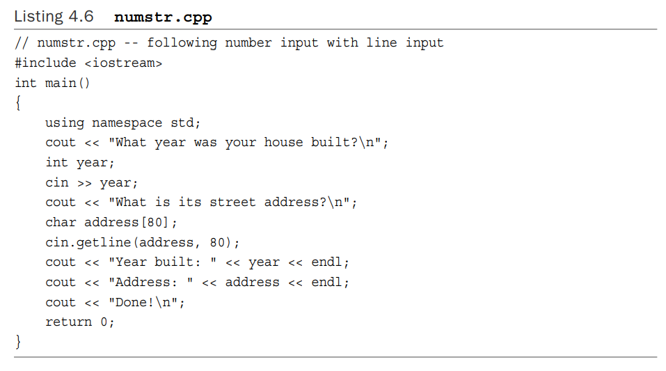
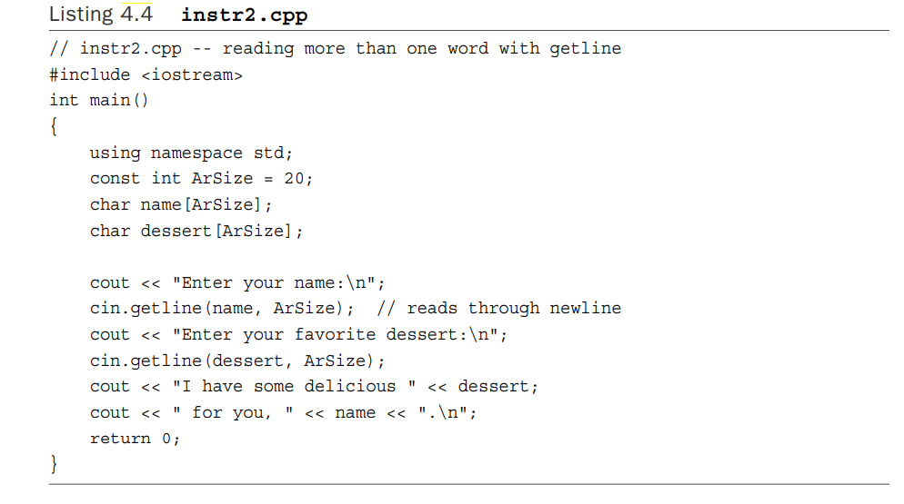
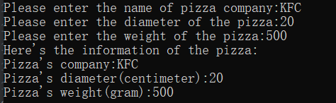
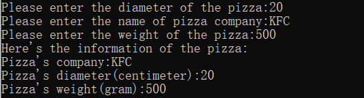
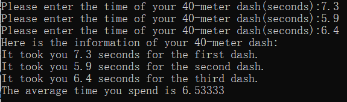

# 第四章

#### 复习题

1.您将如何声明以下各项？
A.actors 是一个包含 30 个字符的数组。

b. betsie 是一个 100 短数组。
C.chuck 是一个包含 13 个浮点数的数组。
d. dipsea 是一个 64 长双精度数组。

```c++
char actors[30];
short betsie[100];
float chuck[13];
long double dipsea[64];
```


2.使用数组模板类而不是内置数组完成问题1。

```c++
    array<char,30> actors;
    array<short,100> betsie;
    array<float,13> chuck;
    array<long double,64> dipsea;
```


3. 声明一个包含五个整数的数组，并将其初始化为前五个奇数正整数。

```c++
array<int,5> odds={1,3,5,7,9};
```


4. 写一个语句，将问题 3 中数组的第一个和最后一个元素的和赋值给变量 even。

`int even=odds[0]+odds[4];`


5.编写一条语句，显示浮点数组 ideas 中第二个元素的值。

```c++
cout<<ideas[1]<<"\n";
```


6.声明一个char数组并将其初始化为字符串“cheeseburger”。

```c++
char string[]="cheeseburger";
```


7.声明一个字符串对象并将其初始化为字符串“Waldorf Salad”。

```c++
std::string str="Waldorf Salad";
```


8.设计一个描述fish的结构声明。结构应该包括种类、重量（whole ounces）和长度（fractional inches）。

```c++
struct  fish{
    string type;
    int ounces;
    float inches;
};
```


9.声明一个问题 8 中定义的类型的变量并初始化它。

```c++
fish goldfish={
        "goldfish",1,14.5
};
```


10.使用枚举定义一个名为 Response 的类型，其可能的值为 Yes、No 和 Maybe。 Yes 应该是 1，No 应该是 0，Maybe 应该是 2。

```c++
enum Response{Yes=1,No=0,Maybe=2};
```


11.假设 ted 是一个double变量。 声明一个指向 ted 的指针，并使用该指针显示 ted 的值。

```c++
double ted;
double* ptr;
ptr=&ted;
cout<<*ptr<<"\n";
```


12.假设treacle是一个包含10个float的数组。声明一个指针指向糖蜜的第一个元素，并使用该指针显示数组的第一个和最后一个元素。

```c++
float* ptr=&treacle[0];
cout<<"first element:"<<*ptr<<" last element"<<*(ptr+9)<<'\n';
```


13.编写一个代码片段，要求用户输入一个正整数，然后创建一个包含那么多int的动态数组。 通过使用 new 来执行此操作，然后再次使用vector对象

```c++
int* dynamicArray = new int[num];
vector<int> dynamicarray(num);
```


14.以下代码是否有效？ 如果是这样，它会打印什么？

`cout << (int *) “Home of the jolly bytes”;`

有效，打印字面量地址


15. 编写一个代码片段，动态分配问题 8 中描述的类型的结构，然后读取该结构的 kind 成员的值。

```c++
fish* fi = new fish;
cout<<fi->type<<'\n';
cout<<fi->ounces<<'\n';
cout<<fi->inches<<'\n';
```


16.list4.6 说明了在数字输入之后使用面向行的字符串输入所产生的问题。 如何替换这个：



```c++
cin.getline(address,80);
//有了这个：
cin >> address;
```

影响这个程序的工作？

答：因为getline会把换行符读入返回空字符串。


17. 声明一个包含 10 个字符串对象的vector对象和一个包含 10 个字符串对象的数组对象。 显示必要的头文件，不要使用using。 一定要使用 const 作为字符串的数量。

```c++
#include <vector>
#include <array>


int main(){
 int const num = 10;
 std::array<std::string,num> obj1;
 std::vector<std::string> obj2(num);
}
```


#### 编程题

1. 编写一个 C++ 程序来请求和显示信息，如以下输出示例所示：

---

What is your first name? Betty Sue
What is your last name? Yewe
What letter grade do you deserve? B
What is your age? 22
Name: Yewe, Betty Sue
Grade: C
Age: 22

---

请注意，该程序应该能够接受包含多个单词的名字。还要注意，该程序会向下调整等级，即向上调整一个字母。假设用户请求 A、B 或 C，因此 你不必担心 D 和 F 之间的差距。

```c++
using namespace std;
int main(){
    string firstName,lastName;
    char grade;
    int age;
    cout<<"What is your first name?";
    getline(cin,firstName);
    cout<<"What is your last name?";
    getline(cin,lastName);
    cout<<"What letter grade do you deserve?";
    cin>>grade;
    grade+=1;
    cout<<"What is your age?";
    cin>>age;
    cout<<"Name:"<<lastName<<","<<firstName<<"\n";
    cout<<"Grade:"<<grade<<"\n";
    cout<<"Age:"<<age;
    return 0;
}
```


2.重写listing 4.4，使用 C++ 字符串类代替字符数组。



```c++
#include <iostream>
int main(){
    using namespace std;
    string name;
    string dessert;
    cout << "Enter your name:\n";
    getline(cin,name);
    cout << "Enter your favorite dessert:\n";
    getline(cin,dessert);
    cout << "I have some delicious " << dessert;
    cout << " for you, " << name << ".\n";
    return 0;
}
```


3. 编写一个程序，要求用户输入他或她的名字，然后输入姓氏，然后构造、存储和显示第三个字符串，该字符串由用户的姓氏、逗号、空格和第一个组成 姓名。 使用 cstring 头文件中的 char 数组和函数。运行示例可能如下所示：

---

Enter your first name: Flip 

Enter your last name: Fleming 

Here’s the information in a single string: Fleming, Flip

---

```c++
#include <iostream>
#include <cstring>
int main(){
    using namespace std;
    const int size=80;
    char first_name[size],last_name[size];
    cout<<"Enter your first name:";
    cin.getline(first_name,size-1);
    cout<<"Enter your last name:";
    cin.getline(last_name,size-1);
    char third_string[strlen(first_name)+ strlen(last_name)+3];
    strcpy(third_string,last_name);
    size_t index= strlen(last_name);
    third_string[index++]=',';
    third_string[index++]=' ';
    strcat(third_string,first_name);
    cout<<"Here's the information in a single string:"<<third_string;
    return 0;
}
```

:warning:*尽管不用特别写明,但每个字符串字面量最后都隐含着一个空字符(\0)。*


4.编写一个程序，要求用户输入他或她的名字，然后输入姓氏，然后构造、存储和显示第三个字符串，该字符串由用户的姓氏、逗号、空格和名字组成。 使用字符串头文件中的字符串对象和方法。示例运行可能如下所示：

---

Enter your first name: Flip 

Enter your last name: Fleming 

Here’s the information in a single string: Fleming, Flip

---

```c++
#include <iostream>
#include <string>
int main(){
    using namespace std;
    string first_name,last_name;
    cout<<"Enter your first name:";
    getline(cin,first_name);
    cout<<"Enter your last name:";
    getline(cin,last_name);
    string third_string=last_name+", "+first_name;
    cout<<"Here's the information in a single string:"<<third_string;
    return 0;
}
```


5. CandyBar结构包含三个成员，第一个成员保存的是棒棒糖的品牌名称，第二个成员保存的是棒棒糖的重量（可能有小数部分），第三个成员保存的是卡路里数（ 一个整数值）在糖果条中。编写一个程序来声明这样一个结构并创建一个名为 snack 的 CandyBar 变量，将其成员分别初始化为“Mocha Munch”、2.3 和 350。初始化应该是声明的一部分 小吃。 最后，程序应该显示 snack 变量的内容。

```c++
#include <iostream>
#include <string>

struct CandyBar{
    std::string brand;
    double weight;
    int calories;
};

int main(){
    using namespace std;
    CandyBar snack={"Munch",2.3,350};
    cout<<"brand name:"<<snack.brand<<"\n";
    cout<<"candy weight:"<<snack.weight<<"\n";
    cout<<"number of calories:"<<snack.calories<<"\n";
    return 0;
}
```


6.CandyBar 结构包含三个成员，如编程练习 5 中所述。编写一个程序，创建一个包含三个 CandyBar 结构的数组，将它们初始化为您选择的值，然后显示每个结构的内容。

```c++
#include <iostream>
#include <string>

struct CandyBar{
    std::string brand;
    double weight;
    int calories;
};

int main(){
    using namespace std;
    CandyBar candy[3]={"Hard Candy",1.6,230,"chocolate",
                       2.5,150,"Sours",13,1200
    };
    for(int i=0;i<3;i++){
        cout<<"The item of "<<i<<"\n";
        cout<<"The brand name is "<<candy[i].brand<<"\n";
        cout<<"The weight of candy is "<<candy[i].weight<<"\n";
        cout<<"The calories of candy is "<<candy[i].calories<<"\n";
    }
    
    return 0;
}
```


7.William Wingate 经营披萨分析服务。 对于每一个披萨，他都需要记录以下信息： 披萨公司的名称，可以由一个以上的单词组成 披萨的直径 披萨的重量 设计一个可以保存这些信息的结构，并编写一个使用这种类型的结构变量的程序。该程序应该要求用户输入前面的每一项信息，然后程序应该显示该信息。 使用 cin（或其方法）和 cout。

```c++
#include <iostream>
#include <string>

struct Pizza{
    std::string companyName;
    double diameter;
    double weight;
};

int main(){
    using namespace std;
    Pizza pizza;
    cout<<"Please enter the name of pizza company:";
    getline(cin,pizza.companyName);
    cout<<"Please enter the diameter of the pizza:";
    cin>> pizza.diameter;
    cout<<"Please enter the weight of the pizza:";
    cin>>pizza.weight;
    cout<<"Here's the information of the pizza:\n";
    cout<< "Pizza's company:"<<pizza.companyName<<"\n";
    cout<< "Pizza's diameter(centimeter):"<<pizza.diameter<<"\n";
    cout<< "Pizza's weight(gram):"<<pizza.weight<<"\n";
    return 0;
}
```




8.做编程练习 7，但使用 new 来分配一个结构而不是声明一个结构变量。另外让程序在请求比萨公司名称之前先请求比萨直径。

```c++
#include <iostream>
#include <string>

struct Pizza{
    std::string companyName;
    double diameter;
    double weight;
};

int main(){
    using namespace std;
    Pizza* ptr= new Pizza;
    cout<<"Please enter the diameter of the pizza:";
    cin>> ptr->diameter;
    getline(cin,ptr->companyName);
    cout<<"Please enter the name of pizza company:";
    getline(cin,ptr->companyName);
    cout<<"Please enter the weight of the pizza:";
    cin>>ptr->weight;
    cout<<"Here's the information of the pizza:\n";
    cout<< "Pizza's company:"<<ptr->companyName<<"\n";
    cout<< "Pizza's diameter(centimeter):"<<ptr->diameter<<"\n";
    cout<< "Pizza's weight(gram):"<<ptr->weight<<"\n";
    return 0;
}
```




**:pencil2:Note**:注意关于数组和new操作的初始化是类似的,注意**辨析差异**（questiong6\question9）

9.做编程练习 6，但不是声明一个包含三个 CandyBar 结构的数组，而是使用 new 动态分配数组。

```c++
#include <iostream>
#include <string>

struct CandyBar{
    std::string brand;
    double weight;
    int calories;
};

int main(){
    using namespace std;
    CandyBar* candy= new CandyBar[3]{{"Hard Candy",1.6,230},{"chocolate",
                                                   2.5,150},{"Sours",13,1200}};


    for(int i=0;i<3;i++){
        cout<<"The item of "<<i<<"\n";
        cout<<"The brand name is "<<candy[i].brand<<"\n";
        cout<<"The weight of candy is "<<candy[i].weight<<"\n";
        cout<<"The calories of candy is "<<candy[i].calories<<"\n";
    }
    getchar();
    return 0;
}
```


10.编写一个程序，要求用户输入 3 次 40 码短跑（或 40 米，如果您愿意），然后显示次数和平均值。 使用数组对象来保存数据。 （如果数组不可用，请使用内置数组。）

```c++
#include <iostream>
#include <string>
#include <array>


int main(){
    using namespace std;
    array<double,3> time{0};


    for(int i=0;i<3;i++){
        cout<<"Please enter the time of your 40-meter dash(seconds):";
        cin>>time[i];
    }

    cout<<"Here is the information of your 40-meter dash:\n";
    cout<<"It took you "<<time[0]<<" seconds for the first dash.\n";
    cout<<"It took you "<<time[1]<<" seconds for the second dash.\n";
    cout<<"It took you "<<time[2]<<" seconds for the third dash.\n";
    cout<<"The average time you spend is "<<(time[0]+time[1]+time[2])/3<<"\n";
    return 0;
}
```




