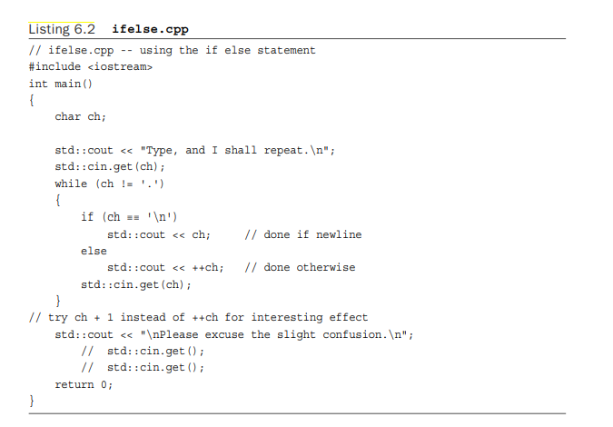

# 第六章

[TOC]

#### 问答题

1 请考虑以下两个计算空格和换行的代码片段

version 1

```cassandra
while (cin.get(ch))	// quit on eof
{
if (ch == ' ')
spaces++; 
if (ch == '\n')
newlines++;
}

```

version 2

```c++
while (cin.get(ch))	// quit on eof
{
if (ch == ' ')
    spaces++;
else if (ch == '\n') 
    newlines++;
}

```

如果有的话，第二种形式比第一种形式有什么优势？

第二种排除了ch==' ',更加高效


2.在listing 6.2中，用ch+1代替++ch的效果是什么？



ch+1会有一个类型转换，会导致打印的结果为ch的代码值


3.仔细考虑以下程序。

```c++
#include <iostream> using namespace std; int main()
{
    char ch;
    int ct1, ct2;
    ct1 = ct2 = 0;
while ((ch = cin.get()) != '$')
{
cout << ch; 
    ct1++;
if (ch = '$') 
    ct2++;
cout << ch;
}
cout <<"ct1 = " << ct1 << ", ct2 = " << ct2 << "\n"; 
    return 0;
}

```

假设你提供以下输入，在每一行的末尾按回车键

**Hi!**

**Send $10 or $20 now!**

输出是什么？(回顾一下，输入是有缓冲的。)

H$i$!$

$S$e$n$d$ $


4.构建逻辑表达式来表示下列条件

a. 重量大于或等于115但小于125。

`weight>=115&&weight<125`

b. ch是q或Q

`ch=='q'||ch=='Q'`

c. x是偶数但不是26。

`x%2==0&&x!=26`

d. x是偶数，但不是26的倍数。

`x%2==0&&x%26!=0`

e. 捐款在1,000-2,000的范围内，或者客人是1。

`(donation<=2000&&donation<=1000)||guest==1`

f. ch是一个小写字母或一个大写字母(假设与ASCII一样，小写字母是按顺序编码的，大写字母是按顺序编码的，但在大写字母和小写字母之间有一个间隙）。

`(ch>='a'&&ch<='z')||(ch>='A'&&ch<='Z')`


5. 在英语中，"我不会不说话 "与 "我会说话 "的意思相同。在C++中，!!x和x是一样的吗？

不一样，!!x的值为0（false）和1(true)而x可以取任意值。


6.构建一个条件表达式，它等于一个变量的绝对值。也就是说，如果一个变量x是正的，表达式的值就是x，但是如果x是负的，表达式的值就是-x，也就是正的。

```c++
if x>0?x:-x;
```


7.用switch重写下面的片段


```c++
switch (ch) {
    case 'A':
        a_grade++;
        break;
    case 'B':
        b_grade++;
        break;
    case 'C':
        c_grade++;
        break;
    case 'D':
        d_grade++;
        break;
    default:
        f_grade++;
}
```


8.在Listing 6.10中，使用字符标签，如a和c，而不是数字来表示菜单选择和切换情况，会有什么好处？(提示：想想如果用户在这两种情况下输入q会发生什么，如果用户在这两种情况下输入5会发生什么。)

```c++
#include <iostream>
using namespace std;
void showmenu(); // function prototypes
void report();
void comfort();
int main()
{
showmenu();
int choice;
cin >> choice;
while (choice != 5)
{
switch(choice)
{
case 1 : cout << "\a\n";
break;
case 2 : report();
break;
case 3 : cout << "The boss was in all day.\n";
break;
case 4 : comfort();
break;
default : cout << "That's not a choice.\n";
}
showmenu();
cin >> choice;
}
cout << "Bye!\n";
return 0;
}
void showmenu()
{
cout << "Please enter 1, 2, 3, 4, or 5:\n"
"1) alarm 2) report\n"
"3) alibi 4) comfort\n"
"5) quit\n";
}
void report()
ptg7068951
The switch Statement 277
{
cout << "It's been an excellent week for business.\n"
"Sales are up 120%. Expenses are down 35%.\n";
}
void comfort()
{
cout << "Your employees think you are the finest CEO\n"
"in the industry. The board of directors think\n"
"you are the finest CEO in the industry.\n";
}
```

1\节约空间

2\对于类型不匹配更容易处理


9.考虑一下下面的代码片段

```c++
int line = 0; char ch;
while (cin.get(ch))
{
if (ch == 'Q')
    break; 
if (ch != '\n')
    continue; 
    line++;
}
```

重写这段代码，不要使用break或continue。

```c++
    int line = 0;
    char ch;
    while((ch=cin.get())!='Q'){
        if(ch =='\n')
            line++;
    }
```


#### 编程题

1.编写一个程序，读取键盘输入直到@符号，并对输入的内容进行重复（除了数字），将每个大写字符转换为小写，反之亦然。(不要忘记cctype系列)。

```c++
    char ch;
    while((ch=cin.get())!='@'){
        if(isdigit(ch))
            continue;
        if(islower(ch))
            cout<<(char)toupper(ch);
        else if(isupper(ch))
            cout<<(char)tolower(ch);
        else
            cout<<ch;
    }
```

2.编写一个程序，将最多10个捐赠值读入一个双数的数组。(或者，如果你愿意，使用一个数组模板对象。)该程序应该终止对非数字输入的输入。它应该报告数字的平均值，并报告数组中多少数字比平均值大。

```c++
const int SIZE=10;


int main() {
    using namespace std;

    double donations[SIZE];
    double num;
    double sum=0;
    int index=0;
    while(index<SIZE){
        cout<<"Donaton #"<<index+1<<": ";
        if(cin>>num){
            donations[index++]=num;
            sum+=num;
        }else{
            break;
        }
    }
    cout<<"There are "<<index<<" donations.\n";

    double average = sum/index;
    int count=0;
    for(int i=0;i<index;i++){
        if(donations[i]>average)
            count++;
    }
    cout<<"The average of total donations is "<<average<<'\n';
    cout<<"There are "<<count<<" donations in the array are larger than the average.\n";
```


3. 编写一个菜单驱动程序的前身。该程序应显示一个菜单，提供四个选项，每个选项都标有一个字母。 如果用户回复的字母不是四个有效选项之一，程序应提示用户输入有效回复，直到用户遵从。然后程序应使用开关根据用户的选择选择一个简单的操作。 程序运行看起来像这样：

> Please enter one of the following choices:
>
> c) carnivore     p) pianist
>
> t) tree       g) game
>
> f
>
> Please enter a c, p, t, or g: **q** 
>
> Please enter a c, p, t, or g: **t** 
>
> A maple is a tree.

```c++
const int SIZE=10;

int main() {
    using namespace std;
    char ch;
    cout<<"Please enter one of the following choices:\n";
    cout<<"\tc) carnivore \tp) pianist\n"
          <<"\tt) tree \tg) game\n";


    while(cin.get(ch)){
        if(ch=='c'||ch=='p'||ch=='t'||ch=='g')
            break;
        if(ch=='\n')
            continue;
       cout<<"Please enter a c, p, t, or g:";
    }

switch (ch) {
case 'c':
cout<<"A carnivore is an organism that mostly eats meat, or the flesh of animals\n";
break;
case 'p':
cout<<"If you play the piano, you are a pianist.\n";
break;
case 't':
cout<<"A maple is a tree.\n";
break;
case 'g':
cout<<"It was the first game of the season.\n";
break;
}

    return 0;
}
```


4.当你加入程序员慈善组织时，你可以在 BOP 会议上以你的真名、职位或 BOP 秘密名称为人所知。编写一个程序，可以按真名、职位、秘密列出成员 名称，或根据会员的喜好。 该程序基于以下结构：

```c++
// Benevolent Order of Programmers name structure struct bop {
char fullname[strsize]; // real name char title[strsize];	// job title
char bopname[strsize]; // secret BOP name
int preference;	// 0 = fullname, 1 = title, 2 = bopname
};

```

在程序中，创建一个此类结构的小数组并将其初始化为合适的值。 让程序运行一个循环，让用户从不同的备选方案中进行选择：

```c++
a. display by name	b. display by title
c. display by bopname d. display by preference
q. quit
```

注意，“按偏好显示”并不是显示偏好成员； 表示显示偏好号对应的会员。 例如，如果 preference 是 1，选项 d 将显示程序员的职位。 示例运行可能类似于以下内容：

e.g.

>Benevolent Order of Programmers Report
>
>a. display by name   b. display by title
>
>c. display by bopname d. display by preference
>
>q. quit
>
>Enter your choice: **a**
>
>Wimp Macho Raki Rhodes Celia Laiter Hoppy Hipman Pat Hand
>
>Next choice: **d**
>
>Wimp Macho
>
>Junior Programmer MIPS
>
>Analyst Trainee LOOPY
>
>Next choice: **q**
>
>Bye!

```c++
const int strsize=50;
const int memberSize=20;
enum preference{fullname,title,bopname};

struct bop{
    char fullname[strsize];
    char title[strsize];
    char bopname[strsize];
    enum preference per;
};

void displayByName(bop* bp,int end);
void displayBYTitle(bop* bp,int end);
void displayByBopname(bop* bp,int end);
void displayByPreference(bop* bp,int end);


int main() {
    using namespace std;
    cout<<"Benevolent Order of Programmers Report\n";

    cout<<"\ta. display by name\tb. display by title\n"
    <<"\tc. display by bopname \td. display by preference\n"
    <<"\tq. quit\n";
    int count=5;
    array<bop,memberSize> members={
            "Wimp Macho","Product manager","Billy",fullname,
            "Raki Rhodes","Junior Programmer","Caddie",title,
            "Celia Laiter","Testing Engineer","MIPS",bopname,
            "Hoppy Hipman","Analyst Trainee","Andy",title,
            "Pat Hand","CEO","LOOPY",bopname,
    };
    cout<<"Enter your choice:";

    char ch;
    bool exit= false;
    while(!exit&&(ch=cin.get())){
        if(isspace(ch)){
            continue;
        }
        switch (ch) {
            case 'a':
                displayByName(members.begin(),count);
                break;
            case 'b':
                displayBYTitle(members.begin(),count);
                break;
            case 'c':
                displayByBopname(members.begin(),count);
                break;
            case 'd':
                displayByPreference(members.begin(),count);
                break;
            case 'q':
                cout<<"Bye!";
                exit=true;
            default:
                continue;
        }
        cout<<"Next choice:";
    }
    return 0;
}

void displayByName(bop* bp,int end) {
    for(int i=0;i<end;i++){
        std::cout<<bp[i].fullname<<'\n';
    }

}
void displayBYTitle(bop* bp,int end) {
    for(int i=0;i<end;i++){
        std::cout<<bp[i].title<<'\n';
    }
}
void displayByBopname(bop* bp,int end){
    for(int i=0;i<end;i++){
        std::cout<<bp[i].bopname<<'\n';
    }
}
void displayByPreference(bop* bp,int end){
    for(int i=0;i<end;i++){
        switch (bp[i].per) {
            case fullname:
                std::cout<<bp[i].fullname<<'\n';
                break;
            case title:
                std::cout<<bp[i].title<<'\n';
                break;
            case bopname:
                std::cout<<bp[i].bopname<<'\n';
                break;
        }
    }
}
```


5. 中子王国的货币单位是varps，它的所得税法如下。

前5,000个varps,0%的税
接下来的10,000varps,10%的税
接下来的20,000varps, 15%的税
35,000以后的varps：20%的税款

例如，收入 38,000 tvarps 的人欠 5,000 ×0.00 + 10,000 ×0.10 + 20,000 ×0.15 + 3,000× 0.20即 4,600 tvarps，编写一个程序，使用循环来征集收入和报告欠税。当用户输入负数或非数字输入时，循环应该终止。

```c++
int main() {
    using namespace std;
    cout<<"Please enter an incomes:";
    double incomes;
    cout<<fixed;
    cout.precision(2);
    while(cin>>incomes){
        if(incomes<0)
            break;
        int tax=0;
        if(incomes<5000){
            tax=0;
        }else if(incomes<15000){
            tax=(incomes-5000)*0.1;
        }else if(incomes<35000){
            tax=1000+(incomes-15000)*0.15;
        }else {
            tax=4000+(incomes-35000)*0.20;
        }
        cout<<"The tax is "<<tax<<'\n';
        cout<<"Please enter an incomes:";
    }

    return 0;
}
```


6.制定一个程序，跟踪对保护合法影响协会的金钱捐助。 它应该要求用户输入贡献者的数量，然后请求用户输入每个贡献者的姓名和贡献。信息应该存储在一个动态分配的结构数组中。 每个结构都应该有两个成员：一个用于存储名称的字符数组（或者一个字符串对象）和一个用于保存捐款金额的双精度成员。 读取所有数据后，程序应显示捐款 10,000 美元或以上的所有捐助者的姓名和捐款金额。份名单的标题应该是 "Grand Patrons"，该程序应列出剩余的捐助者,该列表的标题应该是"Patrons",如果其中一个类别中没有捐助者，则程序应打印“none”一词。 除了显示两个类别外，该程序不需要进行排序。

```c++
const int strSize=50;
struct contribution{
    char name[strSize];
    double amount;
};


int main() {
    using namespace std;
    cout<<"Please enter the number of contributions:";
    int num;
    cin>>num;
    cout<<fixed;
    cout.precision(2);

    contribution* list = new contribution[num];
    for(int i=0;i<num;i++){
        cout<<"Contribution #"<<(i+1)<<":\n";
        cout<<"Please enter the name of contribution:";
        cin>>list[i].name;
        cout<<"Pleas enter the amount of contribution:";
        cin>>list[i].amount;
    }

    cout<<"\t\t-----Grand Patrons-----\n";
    bool none= true;
    for(int i=0;i<num;i++){
        if(list[i].amount>=10000){
            cout<<"\tName:"<<list[i].name<<"\tamount"<<list[i].amount<<'\n';
            none= false;
        }
    }
    if(none){
        cout<<"\t\t\tNone\n";
        none= true;
    }
    cout<<"\t\t-----Patrons-----\n";
    for(int i=0;i<num;i++){
        if(list[i].amount<10000){
            cout<<"\tName:"<<list[i].name<<"\tamount"<<list[i].amount<<'\n';
            none= false;
        }
    }

    return 0;
}
```

7.编写一个程序，每次读取一个词的输入，直到输入一个单独的q。然后程序应该报告以元音开头的词的数量，以辅音开头的词的数量，以及不符合这两个类别的数量。一种方法是使用isalpha()来区分以字母开头的单词和不以字母开头的单词，然后使用if或switch语句来进一步识别那些通过isalpha()测试的以元音开头的单词。一个运行样本可能是这样的。

```c++
int main() {
    using namespace std;


    char word[50];
    int vowels=0;
    int consonants=0;
    int others=0;
    cout << "Enter words (q to quit):\n";
    while(cin>>word){
        if(!isalpha(word[0])){
            others++;
        }
        if(word==(string)"q"){
            break;
        }

        switch (word[0]) {
            case 'A':
            case 'a':
            case 'E':
            case 'e':
            case 'I':
            case 'i':
            case 'O':
            case 'o':
            case 'U':
            case 'u':
                vowels++;
                break;
            default:
                consonants++;
        }

    }
    cout<<vowels<<" words beginning with vowels\n"
    <<consonants<<" words beginning with consonants\n"
    <<others<<"  others\n";
    return 0;
}
```


8.编写一个程序，打开一个文本文件，逐字读到文件的末尾，并报告文件中的字符数。

```c++
int main() {
    using namespace std;
    char filename[nameSize];
    ifstream fin;
    cout<<"Please enter the name of file:";
    cin>>filename;
    fin.open(filename);
    if(!fin.is_open()){
        cout << "Could not open the file " << filename << endl;
        cout << "Program terminating.\n";
        exit(EXIT_FAILURE);
    }
    char ch;
    int count=0;
    while(fin>>ch){
       count++;
    }

    if(fin.eof()){
        cout<<"End of file reached.\n";
        cout<<"The total number of character in the file is "<<count<<'\n';
    }else if(fin.fail()){
        cout << "Input terminated by data mismatch.\n";
    }else{
        cout << "Input terminated for unknown reason.\n";
    }
    return 0;
}
```


9.做编程练习6，但将其修改为从一个文件中获取信息。文件中的第一项应该是贡献者的数量，文件的其余部分应该由一对行组成，每对行的第一行是一个贡献者的名字，第二行是一个贡献。也就是说，文件应该看起来像这样

```c++
const int strSize=50;
struct contribution{
    char name[strSize];
    double amount;
};


int main() {
    using namespace std;
    int num;
    ifstream fin;
    fin.open("try.txt");
    if(!fin.is_open()){
        cout << "Could not open the file try.txt" << endl;
        cout << "Program terminating.\n";
        exit(EXIT_FAILURE);
    }

    fin>>num;
    fin.get();
    contribution* list = new contribution[num];
    for(int i=0;i<num;i++){
        fin.getline(list[i].name,strSize);
        fin>>list[i].amount;
        fin.get();
    }
    cout<<fixed;
    cout.precision(2);
    cout<<"\n\t\t-----Grand Patrons-----\n";
    bool none= true;
    for(int i=0;i<num;i++){
        if(list[i].amount>=10000){
            cout<<"\tName:"<<list[i].name<<"\t\tamount:"<<list[i].amount<<'\n';
            none= false;
        }
    }
    if(none){
        cout<<"\t\t\tNone\n";
    }
    cout<<"\t\t-----Patrons-----\n";
    for(int i=0;i<num;i++){
        if(list[i].amount<10000){
            cout<<"\tName:"<<list[i].name<<"\t\tamount:"<<list[i].amount<<'\n';
            none= false;
        }
    }
    return 0;
}
```
