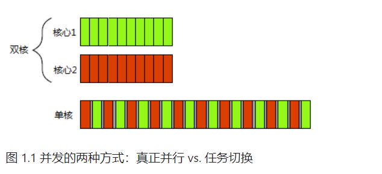
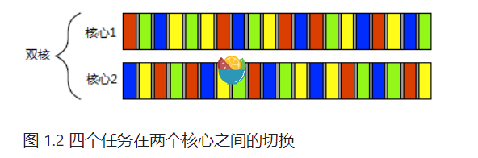
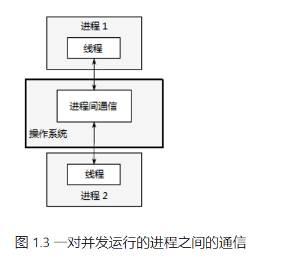
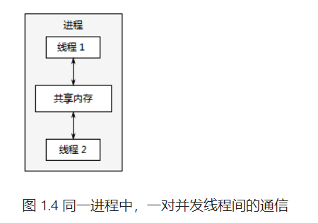

# C++并发编程实战


## 概念

### 并发：指在单个系统里同时执行多个独立的任务

- 软件并发：利用了计算机系统的时间片分配和多任务处理能力，通过在单个处理器或处理器核心上交替执行多个任务来实现并发
- 硬件并发：使用多个物理处理器或处理器核心来执行多个任务或指令，从而实现并行处理。硬件并发利用了计算机系统的并行性能，通过同时执行多个任务来提高系统的整体性能和效率。硬件并发可以在多个级别上实现，包括指**令级并行**、**数据级并行**和**任务级并行**





### 并发的方式

- 多进程并发：应用程序分为多个独立的进程同时运行

程间的通信通常非常复杂，或是速度很慢。这是因为操作系统会对进程进行保护，以避免一个进程去修改另一个进程的数据。还有一个缺点是运行多个进程的固定开销：需要时间启动进程，操作系统需要资源来管理进程等等。



- 多线程并发

在单进程中运行多个线程。线程很像轻量级的进程：每个线程相互独立运行，并且可以在不同的指令序列中运行。不过，进程中的所有线程都共享地址空间，并且能访问到大部分数据———全局变量仍然是全局的，指针、对象的引用或数据可以在线程之间传递。虽然，进程之间通常共享内存，但同一数据的内存地址在不同的进程中不相同，所以这种共享难以建立和管理。



此外，C++标准并未对进程通信提供原生支持，所以实现会依赖于平台相关的API。因此，本书只关注多线程的并发，之后所提到“并发”，均为多线程实现。

### 并发与并行

- 并发：指系统能够同时执行多个独立的任务或操作，而不是一次只能执行一个任务。在并发中，这些任务可以在时间上重叠执行，通过交替执行或者同时执行的方式来实现。并发可以提高系统的资源利用率和响应能力，允许多个任务并发执行，但并不一定需要同时进行（**同时处理多个任务的能力**）

- 并行：多个任务或操作在同一时刻同时执行，通过在多个处理单元（例如多个处理器、多核处理器等）上并发执行来实现。在并行中，多个任务可以同时进行，每个任务分配到不同的处理单元上执行，并且彼此之间相互独立。并行可以大幅提高系统的计算能力和处理速度，特别适用于需要大量计算和处理的任务（**同一时刻同时执行多个任务的能力**）


#### 使用并发

- 分离关注点：将相关的代码与无关的代码分离，可以使程序更容易理解和测试，从而减少出错的可能

- 提高性能，利用并行来解决更大的问题：
  - 将一个单个任务分成几部分并行运行，从而降低总运行时间，这就是**任务并行(task parallelism)**
  - 每个线程在不同的数据块上执行相同的操作(第二种方式)，后一种方法被称为**数据并行(data parallelism)**


#### 不使用并发

收益比不上成本

- 启动线程时存在固有开销，因为操作系统需要分配内核资源和堆栈空间，才能把新线程加入调度器中
- 线程的资源有限，运行越多的线程，操作系统就需要越多的上下文切换，每一次切换都需要耗费时间


##### 发展历程

- C++11标准的发布：C++标准库也扩展了：管理线程(参见第2章)、保护共享数据(参见第3章)、线程间同步操作(参见第4章)，以及原子操作(参见第5章)
- c++14和C++17：将整个标准库进行了补强，C++整合了一些底层工具（可直接控制单个位、字节、内部线程间的同步，以及对所有变化的可见性），标准库也提供了更高级别工具，使得编写多线程代码更加简单。
- 平台相关工具：
  - `native_handle()`：允许通过使用平台相关API直接操作底层实现


### 入门

**Hello Concurrent World.cpp**

```c++
#include <iostream>
#include <thread>

void hello(){
    std::cout<<"Hello Concurrent World.\n";
}


int main() {
    std::thread t(hello);
    if(t.joinable())
    t.join();
    return 0;
}

```

`<thread>`:管理线程的函数和类在`<thread>`中声明

线程在`std::thread`对象创建时启动，通常使用的是无参数无返回的函数。

## 线程管理

每个程序至少有一个执行main()函数的线程，其他线程与主线程同时运行。如main()函数执行完会退出一样，线程执行完函数也会退出。为线程创建`std::thread`对象后，需要等待这个线程结束。


### 启动新线程

#### 无参数无返回的函数

**一般函数**

```c++
void do_some_work();
std::thread my_thread(do_some_work);
```

线程在`std::thread`对象创建时启动，通常使用的是无参数无返回的函数。这种函数在执行完毕，线程也就结束了


**函数操作符类型的实例**

```c++
class background_task
{
public:
  void operator()() const
  {
    do_something();
    do_something_else();
  }
};

background_task f;
std::thread my_thread(f);
```

> 避免语法解析出错：
>
> 如果在创建线程对象时使用了函数名而没有提供参数，编译器会将其解释为函数声明而不是函数调用。为了避免这种歧义，可以使用额外的括号来明确指定它是一个函数调用或者使用统一的初始化语法、Lambda表达式。
>
> ```c++
> std::thread my_thread((background_task()));  // 1
> std::thread my_thread{background_task()};    // 2
> std::thread my_thread([]{                    //3
>   do_something();
>   do_something_else();
> });
> ```


### 等待与分离

线程启动后是要等待线程结束，还是让其自主运行。当`std::thread`对象销毁之前还没有做出决定，程序就会终止(`std::thread`的析构函数会调用`std::terminate()`)。因此，即便是有异常存在，也需要确保线程能够正确*汇入*(joined)或*分离*(detached)。

#### 分离

如果不等待线程汇入 ，就必须保证线程结束之前，访问数据的有效性：单线程代码中，对象销毁之后再去访问，会产生未定义行为。

```c++
struct func
{
  int& i;
  func(int& i_) : i(i_) {}
  void operator() ()
  {
    for (unsigned j=0 ; j<1000000 ; ++j)
    {
      do_something(i);           // 1 潜在访问隐患：空引用
    }
  }
};

void oops()
{
  int some_local_state=0;
  func my_func(some_local_state);
  std::thread my_thread(my_func);
  my_thread.detach();          // 2 不等待线程结束
}                              // 3 新线程可能还在运行
```

> **处理方法**：
>
> 将数据复制到线程中。如果使用一个可调用的对象作为线程函数，这个对象就会复制到线程中，而后原始对象会立即销毁。

使用detach()会让线程在后台运行，这就意味着与主线程不能直接交互。如果线程分离，就不可能有`std::thread`对象能引用它，分离线程的确在后台运行，所以分离的线程不能汇入。不过C++运行库保证，当线程退出时，相关资源的能够正确回收

不能对没有执行线程的`std::thread`对象使用detach()，并且要用同样的方式进行检查——当`std::thread`对象使用t.joinable()返回的是true，就可以使用t.detach()。


---

**分离线程通常称为*守护线程*(daemon threads)**

UNIX中守护线程，是指没有任何显式的接口，并在后台运行的线程，这种线程的特点就是长时间运行。线程的生命周期可能会从应用的起始到结束，可能会在后台监视文件系统，还有可能对缓存进行清理，亦或对数据结构进行优化。另外，分离线程只能确定线程什么时候结束，*发后即忘*(fire and forget)的任务使用到就是分离线程。

---


**使用分离线程处理文档**

让每个文档处理窗口拥有自己的线程，每个线程运行同样的的代码，并隔离不同窗口处理的数据。

```c++
void edit_document(std::string const& filename)
{
  open_document_and_display_gui(filename);
  while(!done_editing())
  {
    user_command cmd=get_user_input();
    if(cmd.type==open_new_document)
    {
      std::string const new_name=get_filename_from_user();
      std::thread t(edit_document,new_name);  // 1
      t.detach();  // 2
    }
    else
    {
       process_user_input(cmd);
    }
  }
}
```

如果用户选择打开一个新文档，需要启动一个新线程去打开新文档①，并分离线程②。


#### 等待

过join()函数来确保线程在主函数完成前结束。

```c++
struct func
{
  int& i;
  func(int& i_) : i(i_) {}
  void operator() ()
  {
    for (unsigned j=0 ; j<1000000 ; ++j)
    {
      do_something(i);           // 1 潜在访问隐患：空引用
    }
  }
};

void oops()
{
  int some_local_state=0;
  func my_func(some_local_state);
  std::thread my_thread(my_func);
  my_thread.join();            // 2 不等待线程结束
}                              // 3 新线程可能还在运行
```

**更灵活的控制**

- 看一下某个线程是否结束
- 只等待一段时间(超过时间就判定为超时)
- 调用`join()`函数可以等待线程执行完成，并清理与线程相关的资源和内存

```c++
void my_function() {
    // 线程的执行逻辑
}

std::thread my_thread(my_function);  // 创建线程对象

// 等待线程执行完成并清理资源
if (my_thread.joinable()) {
    my_thread.join();
}

// 可以安全地销毁或重新赋值 std::thread 对象
my_thread = std::thread();  // 清空线程对象

// 继续执行主线程的逻辑

```

> 1.确保线程执行完成
>
> 调用`join()`函数可以等待线程执行完成，确保线程中的任务被完全执行。这对于需要获取线程的执行结果或确保某些操作在主线程继续执行之前完成的情况非常有用。
>
> 2.清理线程资源
>
> 在调用`join()`函数后，`std::thread`对象与已经完成的线程不再有任何关联。这意味着可以安全地销毁或重新赋值`std::thread`对象，释放与线程相关的资源和内存。


#### 特殊情况下的等待

当在线程运行后产生的异常，会在join()调用之前抛出，这样就会跳过join()

**等待线程完成**

```c++
struct func; // 定义在代码2.1中
void f()
{
  int some_local_state=0;
  func my_func(some_local_state);
  std::thread t(my_func);
  try
  {
    do_something_in_current_thread();
  }
  catch(...)
  {
    t.join();  // 1
    throw;
  }
  t.join();  // 2
}
```

> 在给定的代码段中，`throw`语句的作用是将捕获的异常重新抛出。
>
> 在这段代码中，首先在`try`块中执行了`do_something_in_current_thread()`函数，它可能会引发异常。如果在执行期间发生异常，程序将跳转到`catch`块。
>
> 在`catch`块中，`t.join()`语句用于等待线程`t`执行完成。这是为了确保在线程`t`执行过程中发生的任何异常得到适当处理，并且不会在主线程中继续传播。
>
> 然后，`throw`语句重新抛出捕获的异常。这样做的目的是将异常传递给更高级别的异常处理机制，或者将其传递给调用方来进行进一步的处理。


**使用RAII等待线程完成**

---

**RAII**:

RAII（Resource Acquisition Is Initialization）是一种编程技术，用于管理资源的获取和释放。它是C++中的一种惯用法，通过对象的生命周期来管理资源，以确保资源在对象的构造函数中获得，并在对象的析构函数中释放。

RAII的核心思想是将资源的获取和释放与对象的生命周期绑定在一起。当对象被创建时，它负责获取所需的资源，例如打开文件、分配内存或建立网络连接。当对象被销毁时，它的析构函数被自动调用，负责释放之前获取的资源，确保资源的正确释放，无论是正常执行还是发生异常。

---

```c++
class thread_guard
{
  std::thread& t;
public:
  explicit thread_guard(std::thread& t_):
    t(t_)
  {}
  ~thread_guard()
  {
    if(t.joinable()) // 1
    {
      t.join();      // 2
    }
  }
  thread_guard(thread_guard const&)=delete;   // 3
  thread_guard& operator=(thread_guard const&)=delete;
};

struct func; // 定义在代码2.1中

void f()
{
  int some_local_state=0;
  func my_func(some_local_state);
  std::thread t(my_func);
  thread_guard g(t);
  do_something_in_current_thread();
}    // 4
```

> 1、在`thread_guard`的析构函数中，使用`joinable()`函数检查线程是否可加入（joinable），以确保只有在线程可加入时才调用`join()`函数。这是为了防止在创建线程但未启动它时调用`join()`，或者已经加入过线程的情况下再次调用`join()`。
>
> 2、如果线程可加入，即它正在运行或已经完成但尚未被加入，`join()`函数将会等待线程完成并进行加入操作。这样可以确保在函数`f()`的生命周期结束时，线程已经完成。
>
> 3、`thread_guard`的拷贝构造函数和赋值运算符被显式删除，防止通过拷贝或赋值创建新的`thread_guard`对象。这是为了确保每个`std::thread`对象只能由一个`thread_guard`对象管理。
>
> 4、通过创建一个`thread_guard`对象`g`来管理该线程的生命周期。
>
> 5、当函数`f()`执行完毕，`thread_guard`对象`g`超出作用域时，它的析构函数被调用。如果线程`t`仍然可加入（未完成或未被加入），`t.join()`将等待线程完成。


#### 传递参数

**将这些参数作为 `std::thread`构造函数的附加参数即可**

```c++
void f(int i, std::string const& s);
std::thread t(f, 3, "hello");
```


:warning:*指向自动变量的指针作为参数*

```c++
void f(int i,std::string const& s);
void oops(int some_param)
{
  char buffer[1024]; // 1
  sprintf(buffer, "%i",some_param);
  std::thread t(f,3,buffer); // 2
  t.detach();
}
```

> buffer①是一个指针变量，指向局部变量，然后此局部变量通过buffer传递到新线程中②。此时，函数`oops`可能会在buffer转换成`std::string`之前结束，从而导致未定义的行为。
>
> ```c++
> void f(int i,std::string const& s);
> void not_oops(int some_param)
> {
>   char buffer[1024];
>   sprintf(buffer,"%i",some_param);
>   std::thread t(f,3,std::string(buffer));  // 使用std::string，避免悬空指针
>   t.detach();
> }
> ```


> 相反的情形(期望传递一个非常量引用，但复制了整个对象)倒是不会出现，因为会出现编译错误。比如，尝试使用线程更新引用传递的数据结构
>
> 解决办法：使用`std::ref`将参数转换成引用的形式
>
> ```c++
> std::thread t(update_data_for_widget,w,std::ref(data));
> ```
>
> 

**注**：`std::thread`构造函数和`std::bind`的操作在标准库中以相同的机制进行定义

----

##### 传递一个成员函数指针作为线程函数.cpp

```c++
class X
{
public:
  void do_lengthy_work(int);
};
X my_x;
int num(0);
std::thread t(&X::do_lengthy_work, &my_x, num);
```

第三个参数就是成员函数的第一个参数，以此类推


***提供的参数仅支持移动(move)，不能拷贝***

当原对象是临时变量时，则自动进行移动操作，但当原对象是一个命名变量，转移的时候就需要使用`std::move()`进行显示移动

```c++
void process_big_object(std::unique_ptr<big_object>);

std::unique_ptr<big_object> p(new big_object);
p->prepare_data(42);
std::thread t(process_big_object,std::move(p));
```

通过在`std::thread`构造函数中执行`std::move(p)`，big_object 对象的所有权首先被转移到新创建线程的的内部存储中，之后再传递给process_big_object函数。

---

C++标准线程库中和`std::unique_ptr`在所属权上相似的类有好几种，`std::thread`为其中之一。虽然，`std::thread`不像`std::unique_ptr`能占有动态对象的所有权，但是它能占有其他资源：每个实例都负责管理一个线程。线程的所有权可以在多个`std::thread`实例中转移，这依赖于`std::thread`实例的*可移动*且*不可复制*性。


### 转移所有权

假设通过新线程返回的所有权去调用一个需要后台启动线程的函数，并需要在函数中转移线程的所有权。这些操作都要等待线程结束才能进行，并且需要线程的所有权能够进行转移。

```c++
void some_function();
void some_other_function();
std::thread t1(some_function);            // 1
std::thread t2=std::move(t1);            // 2
t1=std::thread(some_other_function);    // 3
std::thread t3;                            // 4
t3=std::move(t2);                        // 5
t1=std::move(t3);                        // 6 赋值操作将使程序崩溃
```

最后一个移动操作，将some_function线程的所有权转移⑥给t1。不过，t1已经有了一个关联的线程(执行some_other_function的线程)，所以这里系统直接调用`std::terminate()`终止程序继续运行。


- 线程的所有权可以在函数外进行转移

```c++
std::thread f()
{
  void some_function();
  return std::thread(some_function);
}

std::thread g()
{
  void some_other_function(int);
  std::thread t(some_other_function,42);
  return t;
}
```


- 在函数内部传递，就允许`std::thread`实例作为参数进行传递

```c++
void f(std::thread t);
void g()
{
  void some_function();
  f(std::thread(some_function));
  std::thread t(some_function);
  f(std::move(t));
}
```


为了确保线程在程序退出前完成，定义了scoped_thread类

```c++
class scoped_thread
{
  std::thread t;
public:
  explicit scoped_thread(std::thread t_): // 1
    t(std::move(t_))
  {
    if(!t.joinable())  // 2
      throw std::logic_error(“No thread”);
  }
  ~scoped_thread()
  {
    t.join(); // 3
  }
  scoped_thread(scoped_thread const&)=delete;
  scoped_thread& operator=(scoped_thread const&)=delete;
};

struct func; // 定义在代码2.1中

void f()
{
  int some_local_state;
  scoped_thread t(std::thread(func(some_local_state)));    // 4
  do_something_in_current_thread();
} // 5
```

当主线程到达f()末尾时⑤，scoped_thread对象就会销毁，然后在析构函数中完成汇入③


**c++17标准建议**：添加一个joining_thread的类型

```c++
class joining_thread{
    std::thread t;
public:
    joining_thread() noexcept=default;
    template<typename Callable,typename ... Args>
    explicit joining_thread(Callable&& func,Args&& ...args):
    t(std::forward<Callable&&>(func),std::forward<Args>(args)...)
    {}
    explicit  joining_thread(std::thread t_) noexcept:
    t(std::move(t_)){}

    joining_thread(joining_thread&& other) noexcept:
    t(std::move(other.t)){}

    joining_thread& operator=(joining_thread&& other)noexcept{
        if(t.joinable()){
            t.join();
        }
        t=std::move(other.t);
        return *this;
    }
    ~joining_thread(){
        if(t.joinable()){
            t.join();
        }
    }
    
    void swap(joining_thread& other) noexcept{
        t.swap(other.t);
    }
    
    std::thread::id get_id() const noexcept{
        return t.get_id();
    }
    
    bool joinable() const noexcept{
        return t.joinable();
    }
    
    void join(){
        t.join();
    }
    
    void detach(){
        t.detach();
    }
    
    std::thread& as_thread()noexcept{
        return t;
    }
    
    const std::thread& as_thread() const noexcept{
        return t;
    }
};
```

`std::thread`中对移动语义的支持，也适用于使用`std::thread`的**移动敏感**(move-aware)容器(比如，`std::vector<>`


**量产线程.cpp**

有时需要线程去分割一个算法的工作总量，所以在算法结束的之前，所有的线程必须结束，将`std::thread`放入`std::vector`是向线程自动化管理迈出的第一步：并非为这些线程创建独立的变量，而是把它们当做一个组。

```c++
void f(){
    std::vector<std::thread> threads;
    for(unsigned i=0;i<20;++i){
        threads.emplace_back(do_something,i);

    }
    for (auto & entry:threads){
        entry.join();
    }
}
```


### 确定线程数量

**std::thread::hardware_concurrency()**:返回并发线程的数量

多核系统中，返回值可以是CPU核芯的数量。返回值也仅仅是一个标识，当无法获取时，函数返回0。

**vector<线程>的案例.cpp**

```c++
template<typename  Iterator,typename T>
struct accumulate_block
{
    void operator()(Iterator first,Iterator last,T& result){
        result=std::accumulate(first,last);
    }
};

template<typename Iterator,typename T>
T parrallel_accumuate(Iterator first,Iterator last,T init){
    unsigned long const length=std::distance(first,last);
    if(!length){
        return init;
    }

    unsigned long const min_per_thread=25;
    unsigned long const max_threads=(length+min_per_thread-1)/min_per_thread;

    unsigned long const hardware_threads = std::thread::hardware_concurrency();
    unsigned long const num_threads=std::min(hardware_threads!=0?hardware_threads:2,max_threads);
    unsigned long const block_size=length/num_threads;
    std::vector<T> results(num_threads);
    std::vector<std::thread> threads(num_threads-1);

    Iterator block_start=first;
    for(unsigned  long i=0;i<(num_threads-1);++i){
        Iterator block_end=block_start;
        std::advance(block_end,block_size);
        threads[i]=std::thread(accumulate_block<Iterator,T>(),block_start,block_end,std::ref(results[i]));
        block_start=block_start;
    }
    accumulate_block<Iterator,T>()(block_start,last,results[num_threads-1]);
    for(auto& entry:threads){
        entry.join();
    }
    return std::accumulate(results.begin(),results.end(),init);
}
```


### 唯一标识符

线程标识为`std::thread::id`类型

---

**检索方式**

- 调用`std::thread`对象的成员函数`get_id()`来直接获取

> 如果`std::thread`对象没有与任何执行线程相关联，`get_id()`将返回`std::thread::type`默认构造值，这个值表示“无线程”

- 当前线程中调用`std::this_thread::get_id()`

---

标准库也提供`std::hash<std::thread::id>`容器，`std::thread::id`也可以作为无序容器的键值。


**检测线程是否需要进行一些操作.cpp**

```c++
std::thread::id master_thread;
void some_core_part_of_algorithm(){
    if(std::this_thread::get_id()==master_thread){
        do_master_thread_work();
    }
    do_common_work;
}
```

每个线程都要检查一下，其拥有的线程ID是否与初始线程的ID相同。


**作为线程和本地存储不适配的替代方案，线程ID在容器中可作为键值.cpp**

`std::thread::id`可以作为线程的通用标识符，当标识符只与语义相关(比如，数组的索引)时，就需要这个方案了。也可以使用输出流(`std::cout`)来记录一个`std::thread::id`对象的值。

```c++
std::cout<<std::this_thread::get_id();
```


## 线程间共享数据

### 共享数据的问题

**例子：从一个双链表中删除一个节点**

基本步骤：

- 找到要删除的节点N
- 更新前一个节点指向N的指针，让这个指针指向N的下一个节点
- 更新后一个节点指向N的指针，让这个指正指向N的前一个节点


**常见错误：条件竞争(race condition**)

恶性条件竞争通常发生于对多个数据块的修改，例如：对两个连接指针的修改(如图3.1)。操作要访问两个独立的数据块，独立的指令会对数据块将进行修改，并且其中一个线程可能正在进行修改，另一个线程就对数据块进行了访问。因为出现的概率低，很难查找，也很难复现。


**避免恶性条件竞争**

- 数据结构采用某种保护机制，确保只有修改线程才能看到不变量的中间状态
  - 互斥量
- 对数据结构和不变量进行修改，修改完的结构必须能完成一系列不可分割的变化，也就保证了每个不变量的状态，这就是所谓的无锁编程
- 使用事务的方式去处理数据结构的更新（所需的一些数据和读取都存储在事务日志中，然后将之前的操作进行合并，再进行提交，当数据结构被另一个线程修改后，或处理已经重启的情况下，提交就会无法进行，这称作为“软件事务内存”(software transactional memory (STM))）


---

**不变量**

在计算机科学中，不变量（Invariant）是指在某个特定的算法、数据结构或程序片段中保持不变的条件或性质。不变量是程序正确性的重要概念，它们定义了程序执行过程中的一些固定属性，并且在程序的每个阶段都应该保持不变。

不变量通常用于验证程序的正确性、推理程序的行为以及进行程序优化。它们可以是数学性质、逻辑条件、状态关系或程序断言等形式。通过正确定义和使用不变量，可以帮助开发人员理解程序的行为，并确保程序在执行过程中保持正确和一致的状态。

在程序设计中，不变量通常会在循环或递归算法中起到关键作用。它们可以用于检查循环的终止条件、确定循环中的边界条件、验证循环中每次迭代的正确性等。通过在程序中使用不变量，可以提高代码的可读性、可维护性和可靠性。

---


### 使用互斥保护数据

访问共享数据前，将数据锁住，在访问结束后，再将数据解锁。线程库需要保证，当线程使用互斥量锁住共享数据时，其他的线程都必须等到之前那个线程对数据进行解锁后，才能进行访问数据。


#### 互斥量

通过实例化`std::mutex`创建互斥量实例，成员函数lock()可对互斥量上锁，unlock()为解锁。

> 不推荐直接去调用成员函数，调用成员函数就意味着，必须在每个函数出口都要去调用unlock()(包括异常的情况)

C++标准库为互斥量提供了RAII模板类`std::lock_guard`，在构造时就能提供已锁的互斥量，并在析构时进行解锁，从而保证了互斥量能被正确解锁。

**使用互斥量保护列表.cpp**

```c++
std::list<int> some_list;
std::mutex some_mutex;

void add_to_list(int new_value){
    std::lock_guard<std::mutex> guard(some_mutex);
    some_list.push_back(new_value);
}

bool list_contains(int value_to_find){
    std::lock_guard<std::mutex> guard(some_mutex);
    return std::find(some_list.begin(),some_list.end(),value_to_find)!=some_list.end();
}
```

某些情况下使用全局变量没问题，但大多数情况下，互斥量通常会与需要保护的数据放在同一类中，而不是定义成全局变量。将其放在一个类中，就可让他们联系在一起，也可对类的功能进行封装，并进行数据保护。

```c++
class some_data{
    int a;
    std::string b;
public:
    void do_something();
};

class data_warpper{
private:
    some_data data;
    std::mutex m;
public:
    template<class function>
    void process_data(function func){
        std::lock_guard<some_data> guard(data);
        func(data);
    }
};

some_data* unprotected;

void malicious_function(some_data& protected_data){
    unprotected=&protected_data;
}

data_warpper x;
void foo(){
    x.process_data(malicious_function);
    unprotected->do_something();
}
```

这段代码的问题在于根本没有保护，只是将所有可访问的数据结构代码标记为互斥，只能由开发者使用正确的互斥锁来保护数据，切勿将受保护数据的指针或引用传递到互斥锁作用域之外。


C++17中添加了一个新特性，称为类模板的类模板参数推导，类似`std::lock_guard`这样简单的模板类型，其模板参数列表可以省略

---

**类模板的类模板参数推导**

类模板参数推导只适用于具有构造函数的类模板，并且构造函数必须是显式或隐式可转换的。

---


#### 接口间的条件竞争

其他问题

**std::stack容器的声明**

```c++
template<typename T,typename Container=std::deque<T> >
class stack
{
public:
  explicit stack(const Container&);
  explicit stack(Container&& = Container());
  template <class Alloc> explicit stack(const Alloc&);
  template <class Alloc> stack(const Container&, const Alloc&);
  template <class Alloc> stack(Container&&, const Alloc&);
  template <class Alloc> stack(stack&&, const Alloc&);
  
  bool empty() const;
  size_t size() const;
  T& top();
  T const& top() const;
  void push(T const&);
  void push(T&&);
  void pop();
  void swap(stack&&);
  template <class... Args> void emplace(Args&&... args); // C++14的新特性
};
```

*问题一*：虽然empty()和size()可能在返回时是正确的，但结果不可靠。

*解决办法*：

- 变更接口设计（即使empty()返回false的情况下，也需要进行异常捕获）

  - 使用同一互斥量来保护top()和pop()

  > 当这个系统处在重度负荷，或有严重的资源限制的情况下，这种内存分配就会失败，所以vector的拷贝构造函数可能会抛出一个`std::bad_alloc`异常。当vector中存有大量元素时，这种情况发生的可能性更大。执行`pop()`函数时，将栈顶的元素弹出并返回给调用函数。然而，如果在返回这个值之前发生异常，比如调用函数抛出了一个异常，那么栈的状态就会发生变化，元素并没有真正地被移除。这可能会导致一些潜在的问题，因为栈的状态与预期不符。
  >
  > *答案*：要弹出的数据将会丢失，它的确从栈上移出了，但是拷贝失败了！
  >
  > *解决办法*：
  >
  > - 传入一个引用
  >
  > ```c++
  > std::vector<int> result;
  > some_stack.pop(result);
  > ```
  >
  > - 无异常抛出的拷贝构造函数或移动构造函数
  >
  > `std::is_nothrow_copy_constructible`和`std::is_nothrow_move_constructible`，让拷贝或移动构造函数不抛出异常，但是这种方式的局限性太强,那些有抛出异常的拷贝构造函数，但没有移动构造函数的类型往往更多(这种情况会随着人们习惯于C++11中的右值引用而有所改变)
  >
  > - 返回指向弹出值的指针
  >
  > 使用`std::shared_ptr`是个不错的选择，不仅能避免内存泄露(因为当对象中指针销毁时，对象也会被销毁)，而且标准库能够完全控制内存分配方案，就不需要new和delete操作
  >
  > - “选项1 + 选项2”或 “选项1 + 选项3”
  >
  > 


**实现一个线程安全栈.cpp**

```c++
//定义一个空栈异常
struct empty_stack:std::exception{
    const char* what() const throw();
};

template<typename T>
class threadsafe_stack{
public:
    threadsafe_stack();
    threadsafe_stack(const threadsafe_stack<T>&);
    threadsafe_stack<T>& operator=(const threadsafe_stack<T>&) =delete;
    void push(T new_value);
    std::shared_ptr<T> pop();
    void pop(T& value);
    bool  empty() const;
};
```

削减接口可以获得最大程度的安全,甚至限制对栈的一些操作

当栈为空时，pop()函数会抛出一个empty_stack异常，所以在empty()函数被调用后，其他部件还能正常工作。


```c++
#include <exception>
#include <memory>
#include <mutex>
#include <stack>
//定义一个空栈异常
struct empty_stack:std::exception{
    //1.what()函数是std::exception类中的一个虚成员函数，用于返回异常的描述信息
    //2.throw()是一个异常说明（exception specification），它指定了该函数是否会抛出异常。
    // 在这里，throw()表示what()函数不会抛出任何异常。在C++11之后，throw()异常说明被替代为noexcept关键字。
    const char* what() const throw(){
        return "empty stack!\n";
    }
};

template<typename T>
class threadsafe_stack{
private:
    std::stack<T> data;
    mutable std::mutex m;
public:
    threadsafe_stack():data(std::stack<T>()){};
    threadsafe_stack(const threadsafe_stack<T>& other){
        std::lock_guard<std::mutex> guard(other.m);
        data=other.data;
    }
    threadsafe_stack<T>& operator=(const threadsafe_stack<T>&) =delete;

    void push(T new_value){
        std::lock_guard<std::mutex> guard(m);
        data.push(m);
    }
    std::shared_ptr<T> pop(){
        std::lock_guard<std::mutex> guard(m);
        if(data.empty()) throw empty_stack();
        std::shared_ptr<T> const ret(std::make_shared<T>(data.top()));
        data.pop();
        return ret;
    }
    void pop(T& value){
        std::lock_guard<std::mutex> guard(m);
        if(data.empty())throw empty_stack();
        value=data.top();
        data.pop();
    }
    bool  empty() const{
        std::lock_guard<std::mutex> guard(m);
        return data.empty();
    }
};
```

**对top()和pop()函数的讨论中，因为锁的粒度太小，恶性条件竞争已经出现，需要保护的操作并未全覆盖到。**

---

**锁的颗粒度过大同样会有问题**：抵消了并发带来的性能提升

第一版为多处理器系统设计Linux内核中，就使用了一个全局内核锁。这个锁能正常工作，但在双核处理系统（双核处理系统是指具有两个核心（CPU核心）的处理器。每个核心都可以执行指令并处理任务）的上的性能要比两个单核系统的性能差很多，四核系统就更不能提了。随后修正的Linux内核加入了一个细粒度锁方案，因为少了很多内核竞争，这时四核处理系统的性能就和单核处理的四倍差不多了

---


##### 死锁：问题描述及解决方案

一个给定操作需要两个或两个以上的互斥量时，另一个潜在的问题将出现：死锁

---

**死锁的条件**

- 互斥条件（Mutual Exclusion）：至少有一个资源被标记为排他性使用，即一次只能被一个进程占用。
- 请求与保持条件（Hold and Wait）：一个进程在持有一些资源的同时，可以继续请求其他资源。
- 不可剥夺条件（No Preemption）：已经被一个进程获取的资源不能被强行剥夺，只能在进程主动释放后才能被其他进程获取。
- 循环等待条件（Circular Wait）：存在一个进程资源的循环等待链，其中每个进程都在等待下一个进程所持有的资源。

---


解决的办法：`std::lock`——可以一次性锁住多个(两个以上)的互斥量，并且没有副作用(死锁风险)。

```c++
class some_big_object;
void swap(some_big_object& lhs,some_big_object& rhs);
class X{
private:
    some_big_object some_detail;
    std::mutex m;
public:
    X(some_big_object const& sd): some_detail(sd){};

    friend void swap(X &lhs,X &rhs){
        if(&lhs==&rhs)
            return;
        std::lock(lhs.m,rhs.m);
        std::lock_guard<std::mutex> lock_a(lhs.m,std::adopt_lock);
        std::lock_guard<std::mutex> lock_b(rhs.m,std::adopt_lock);
        swap(lhs,rhs);
    }
};
```

互斥量可以在同一线程上多次上锁，标准库中`std::recursive_mutex`提供这样的功能

然后，调用`std::lock()`①锁住两个互斥量，并且创建两个`std:lock_guard`实例②③。提供`std::adopt_lock`参数除了表示`std::lock_guard`可获取锁之外，还将锁交由`std::lock_guard`管理，就不需要`std::lock_guard`再去构建新的锁了。

`std::lock`要么将两个锁都锁住，要不一个都不锁


---

**c++17的扩展**

`std::scoped_lock<>`是一种新的RAII模板类型，与` std::lock_guard<>`的功能相同，这个新类型能接受不定数量的互斥量类型作为模板参数，以及相应的互斥量(数量和类型)作为构造参数。互斥量支持构造时上锁，与`std::lock`的用法相同，解锁在析构中进行。

```c++
friend void swap(X &lhs,X &rhs){
    if(&lhs==&rhs)
        return;
    std::scoped_lock guard(lhs.m,rhs.m);
    swap(lhs,rhs);
}
```

---


#### 避免死锁的进阶指导

- **避免嵌套锁**

每个线程只持有一个锁，就不会产生死锁。

- **避免在持有锁时调用外部代码**
- **使用固定顺序获取锁**
- **使用层次锁结构**

```c++
class hierarchical_mutex{
    std::mutex internal_mutex;
    unsigned long const hierarchy_value;
    unsigned long previous_hierarchy_value;
    //thread_local 是 C++11 引入的关键字，用于声明线程局部变量（thread-local variable）。
    static thread_local unsigned long this_thread_hierarchy_value;
    void check_for_hierarchy_violation(){
        if(this_thread_hierarchy_value<=hierarchy_value){
            throw std::logic_error("mutex hierarchy violated");
        }
    }

    void update_hierarchy_value(){
        previous_hierarchy_value=this_thread_hierarchy_value;
        this_thread_hierarchy_value=hierarchy_value;
    }

public:
    explicit hierarchical_mutex(unsigned long value):hierarchy_value(value),previous_hierarchy_value(0){}
    void lock(){
        check_for_hierarchy_violation();
        internal_mutex.lock();
        update_hierarchy_value();
    }

    void unlock(){
        if(this_thread_hierarchy_value!=hierarchy_value){
            throw std::logic_error("mutex hierarchy violated");
        }
        this_thread_hierarchy_value=previous_hierarchy_value;
        internal_mutex.unlock();
    }

    bool try_lock(){
        check_for_hierarchy_violation();
        if(!internal_mutex.try_lock()){
            return false;
        }
        update_hierarchy_value();
        return true;
    }

};


thread_local unsigned long hierarchical_mutex::this_thread_hierarchy_value(ULLONG_MAX);
/*使用thread_local关键字，可以将变量声明为线程本地存储的变量，每个线程都会拥有一份该变量的副本。
换句话说，thread_local修饰的变量对于每个线程而言是独立的，不同线程访问该变量时不会相互干扰。*/
hierarchical_mutex high_level_mutex(10000);
hierarchical_mutex low_level_mutex(5000);
hierarchical_mutex other_mutex(6000);

int do_low_level_stuff();

int low_level_func() {
    std::lock_guard<hierarchical_mutex> lk(low_level_mutex);
    return do_low_level_stuff();
}

void high_level_stuff(int some_param);

void high_level_func(){
    std::lock_guard<hierarchical_mutex> lk(high_level_mutex);
    high_level_stuff(low_level_func());
}

void thread_a(){
    high_level_func();
}

void do_other_stuff();

void other_stuff(){
    high_level_func();
    do_other_stuff();
}


void thread_b(){
    std::lock_guard<hierarchical_mutex> lk(other_mutex);
    other_stuff();
}

```

根据已经定义好的机制，如将一个hierarchical_mutex实例进行上锁，那么只能获取更低层级实例上的锁，这就会对代码进行一些限制。

**thread_a()遵守规则**

假设do_low_level_stuff不会对任何互斥量进行上锁，low_level_func为层级最低的函数，并且会对low_level_mutex进行上锁。high_level_func调用low_level_func的同时，也持有high_level_mutex上的锁，这也没什么问题，因为high_level_mutex(10000)要比low_level_mutex(5000)更高级。


**thread_b()无视规则，因此在运行时会失败**

首先，thread_b锁住了other_mutex，这个互斥量的层级值只有6000③。这就意味着，中层级的数据已被保护。当other_stuff()调用high_level_func()时，就违反了层级结构

---

**扩展**

死锁不仅仅会发生在锁之间，也会发生在同步构造中(可能会产生一个等待循环)

----


#### std::unqiue_lock

`std::unique_lock`实例不会总与互斥量的数据类型相关，使用起来要比`std:lock_guard`更加灵活。

- 将`std::adopt_lock`作为第二个参数传入构造函数，指示该互斥锁已经被锁住了

- 将`std::defer_lock`作为第二个参数传递进去， 对象时不立即对互斥锁进行加锁操作

  ```c++
  std::mutex mtx;
  
  // 使用 std::unique_lock 创建互斥锁对象，但延迟加锁操作
  std::unique_lock<std::mutex> uniqueLock(mtx, std::defer_lock);
  
  // 在这里，uniqueLock 管理着尚未加锁的互斥锁 mtx
  
  // 可以执行一些其他的操作，而无需对互斥锁进行加锁
  
  uniqueLock.lock(); // 手动对互斥锁进行加锁操作
  
  // 在这里，uniqueLock 管理着已经加锁的互斥锁 mtx
  
  // 在作用域结束时，uniqueLock 对象析构，会自动解锁互斥锁 mtx
  
  ```


```c++
class some_big_object;
void swap(some_big_object& lhs,some_big_object& rhs);
class X{
private:
    some_big_object some_detail;
    std::mutex m;
public:
    X(some_big_object const& sd): some_detail(sd){}
    
    friend void swap(X& lhs,X& rhs){
        if(&lhs==&rhs)
            return;
        std::unique_lock<std::mutex> lock_a(lhs.m,std::defer_lock);
        std::unique_lock<std::mutex> lock_b(rhs.m,std::defer_lock);
        std::lock(lhs.m,rhs.m);
        swap(lhs,rhs);
    }

};
```

std::unique_lock`支持lock(), try_lock()和unlock()成员函数，所以能将`std::unique_lock`对象传递到`std::lock()。std::unique_lock`支持lock(), try_lock()和unlock()成员函数，所以能将`std::unique_lock`对象传递到`std::lock()。这个标志可以通过owns_lock()成员变量进行查询。

如果想将`std::unique_lock`的所有权进行转让，最好使用C++17中提供的`std::scoped_lock`。

`std::unique_lock`实例的体积通常要比`std::lock_guard`实例大，当使用`std::unique_lock`替代`std::lock_guard`，会对标志进行更新或检查，就会有一些轻微的性能惩罚。当`std::lock_guard`已经能够满足需求时，建议继续使用。当需要更加灵活的锁时，最好选择`std::unique_lock`，因为它更适合于你的任务。


##### 不同域中互斥量的传递

`std::unique_lock`是可移动，但不可赋值的类型

- 直接返回(编译器负责调用移动构造函数)

用于已锁的互斥量，其依赖于当前程序的状态，或依赖于传入返回类型为`std::unique_lock`的函数(或以参数返回),类似查询是否已经锁定，在特定的代码分支对锁进行选择性释放。

```c++
std::unique_lock<std::mutex> get_lock(){
    extern std::mutex some_mutex;
    std::unique_lock<std::mutex> lk(some_mutex);
    prepare_data();
    return lk;
}

void process_data()
{
    std::unique_lock<std::mutex> lk(get_lock());
    do_something;
}
```


##### 锁的粒度

`std::unique_lock`调用unlock()时，代码不需要再访问共享数据。当再次需要对共享数据进行访问时，再调用lock()就可以了。

```c++
void get_and_process_data(){
    std::unique_lock<std::mutex> my_lock(the_mutex);
    some_class data_to_process=get_next_data_chunk();
    my_lock.unlock();
    result_type  result=process(data_to_process);
    my_lock.lock();
    write_result(data_to_process,result);
}
```


虽然锁只持有一次的操作能减少锁持有的时间(这样能消除死锁的可能性)，但这里有一个微妙的语义操作同时对两个锁住的值进行比较：当持有锁的时间没有达到整个操作时间，就会让自己处于条件竞争的状态。

```c++
class Y{
private:
    int some_detail;
    mutable std::mutex m;
    int get_detail() const{
        std::lock_guard<std::mutex> lock_a(m);
        return some_detail;
    }
public:
    Y(int sd):some_detail(sd){}
    friend  bool operator==(Y const&lhs,Y const&rhs){
        if(&lhs==&rhs)
            return true;
        int const lhs_value=lhs.get_detail();
        int const rhs_value=rhs.get_detail();
        return lhs==rhs;
            
    }
};
```


### 保护数据的替代方案

#### 保护共享数据的初始化过程

**延迟初始化(Lazy initialization).cpp**（单线程）

这样共享数据对于并发访问就是安全的

```c++
std::shared_ptr<some_resource> resource_ptr;
void foo(){
    if(!resource_ptr){
        resource_ptr.reset(new some_resource);
    }
    resource_ptr->do_something();
}

```


----

**多余的锁机制**

```c++
std::shared_ptr<some_resource> resource_ptr;
std::mutex resource_mutex;
void foo(){
    std::unique_lock<std::mutex> lk(resource_mutex);
    if(!resource_ptr){
        resource_ptr.reset(new some_resource);
    }
    lk.unlock();
    resource_ptr->do_something;
}
```

**双重检测锁.cpp**

```
void undefined_behaviour_with_double_checked_locking(){
    if(!resource_ptr){
        std::lock_guard<std::mutex> lk(resource_mutex);
        if(!resource_ptr){
            resource_ptr.reset(new some_resource);
        }
    }
    resource_ptr->do_something();
}
```

---


C++标准库提供了`std::once_flag`和`std::call_once`来处理这种情况,比起锁住互斥量并显式的检查指针，每个线程只需要使用`std::call_once`就可以，在`std::call_once`的结束时，就能安全的知晓指针已经被其他的线程初始化了。使用`std::call_once`比显式使用互斥量消耗的资源更少，特别是当初始化完成后。

```c++
std::shared_ptr<some_resource> resource_ptr;
std::once_flag resource_flag;

void init_resource(){
    resource_ptr.reset(new some_resource);
}

void foo(){
    std::call_once(resource_flag,init_resource);
    resource_ptr->do_something;
}
```

如同大多数在标准库中的函数一样，或作为函数被调用，或作为参数被传递，`std::call_once`可以和任何函数或可调用对象一起使用。


但`std::call_once()`可仅作为延迟初始化的类型成员

```c++
class X{
private:
    connection_info connection_details;
    connection_handle connection;
    std::once_flag connection_init_flag;

    void open_connection(){
        connection=connection_manager.open(connection_details);
    }
public:
    X(connection_info const& connection_details_):connection_details(connection_details_){}
    
    void send_data(data_packet const& data){
        std::call_once(connection_init_flag,&X::open_connection,this);
        connection.send_data(data);
    }
    
    data_packet receive_data(){
        std::call_once(connection_init_flag,&X::open_connection,this);
        return connection.receive_data();
    }
};
```

这段代码通过使用`std::once_flag`和`std::call_once`，在多线程环境中确保连接只会被打开一次，并且在每次调用`send_data`或`receive_data`时使用连接句柄进行数据传输。这种设计模式通常被称为"线程安全的延迟初始化"，它可以避免重复打开连接并提供线程安全性。

:warning:`std::mutex`和`std::once_flag`的实例不能拷贝和移动，需要通过显式定义相应的成员函数，对这些类成员进行操作。


##### 静态变量初始化

局部变量为static类型，这种变量的在声明后就已经完成初始化。对于多线程调用的函数，这就意味着这里有条件竞争。（C++11之前的标准）

```c++
class my_class;
my_class& get_my_class_instance()
{
  static my_class instance;  // 线程安全的初始化过程
  return instance;
}
```

**解决方法**:初始化及定义完全在一个线程中发生，并且没有其他线程可在初始化完成前对其进行处理，条件竞争终止于初始化阶段。静态局部变量在 C++11 标准中保证了线程安全的初始化过程，即使在多线程环境下也不会出现竞争条件。


##### 保护不常更新的数据结构

使用`std::mutex`来保护数据结构，感觉有些反应过度(因为在没有发生修改时，它将削减并发读取数据的可能性)，这里需要另一种不同的互斥量，这种互斥量常被称为“读者-作者锁”，因为其允许两种不同的使用方式：一个“作者”线程独占访问和共享访问，让多个“读者”线程并发访问。

- C++14只提供了`std::shared_timed_mutex`，并且在C++11中并未提供任何互斥量类型

- C++17标准库提供了两种非常好的互斥量——`std::shared_mutex`和`std::shared_timed_mutex`

**std::shared_timed_mutex**一个基本的读写锁，提供了两种操作：

- `lock_shared()` :用于共享读取访问，多个线程可以同时获得共享锁，只有在没有其他线程持有独占锁（通过 `lock()` 获取）的情况下才会成功获取共享锁。
-  `lock()`:用于独占写入访问，只有在没有其他线程持有共享锁的情况下才会成功获取独占锁。


**std::shared_timed_mutex**是在 `std::shared_mutex` 的基础上增加了超时功能

- try_lock_shared_for()
- try_lock_shared_until()
- try_lock_for()
- try_lock_until()

用于尝试在指定的时间段内获取共享锁或独占锁。这些函数在指定的超时时间内尝试获取锁，如果超时则返回失败，避免了长时间等待锁的情况。


**更新操作.cpp**

```c++
class dns_entry;
class dns_cache{
    std::map<std::string,dns_entry> entris;
    mutable std::shared_mutex entry_mutex;
public:
    dns_entry find_entry(std::string const& domain) const{
        std::shared_lock<std::shared_mutex> lk(entry_mutex);
        std::map<std::string,dns_entry>::const_reverse_iterator  const it=entris.find(domain);
        return (it==entris.end())?dns_entry():it->second;
    }

    void update_or_add_entry(std::string const&domain,dns_entry const& dns_details){
        std::lock_guard<std::shared_mutex> lk(entry_mutex);
        entris[domain]=dns_details;
    }
};
```

无需修改数据结构的线程，可以使用`std::shared_lock<std::shared_mutex>`获取访问权。


#### 嵌套锁

线程对已经获取的`std::mutex`(已经上锁)再次上锁是错误的，尝试这样做会导致未定义行为。在某些情况下，一个线程会尝试在释放一个互斥量前多次获取。因此，C++标准库提供了`std::recursive_mutex`类。除了可以在同一线程的单个实例上多次上锁，其他功能与`std::mutex`相同。有时成员函数会调用另一个成员函数，这种情况下，第二个成员函数也会试图锁住互斥量，这就会导致未定义行为的发生。“变通的”解决方案会将互斥量转为嵌套锁，第二个成员函数就能成功的进行上锁，并且函数能继续执行。但是这种方式过于草率和不合理，所以不推荐这样的使用方式。


## 同步并发操作

通常，线程会等待特定事件发生，或者等待某一条件达成。这可能需要定期检查“任务完成”标识，或将类似的东西放到共享数据中。像这种情况就需要在线程中进行同步，C++标准库提供了一些工具可用于同步，形式上表现为*条件变量*(condition variables)和future。

### 带有future的等待

#### 同步机制

- 当一个线程等待另一个线程完成时，可以持续的检查共享数据标志(用于做保护工作的互斥量)，直到另一线程完成工作时对这个标识进行重置

- 在等待线程在检查间隙

```c++
bool flag;
std::mutex m;

void wait_for_flag(){
    std::unique_lock<std::mutex> lk(m);
    while(!flag){
        lk.unlock();
        std::this_thread::sleep_for(std::chrono::microseconds(100));
        lk.lock();
    }
}
```

但很难确定正确的休眠时间。太短的休眠和没有一样，都会浪费执行时间。太长的休眠时间，可能会让任务等待时间过久。休眠时间过长比较少见，这会影响到程序的行为，在高节奏的游戏中，就意味着丢帧或错过了一个时间片。

- :heart:使用C++标准库提供的工具去等待事件的发生
  - 当某些线程被终止时，为了唤醒等待线程(允许等待线程继续执行)，终止线程将会向等待着的线程广播“条件达成”的信息
    - std::condition_variable
    - std::condition_variable_any


#### C++标准的实现机制

##### 条件变量

- std::condition_variable（**首选**）
- std::condition_variable_any:更加通用，不过在性能和系统资源的使用方面会有更多的开销。

> 包含在头文件<condition_variable>,需要与互斥量一起才能工作(互斥量是为了同步)，前者仅能与`std::mutex`一起工作，而后者可以和合适的互斥量一起工作，从而加上了`_any`的后缀

```c++
std::mutex mut;
std::queue<data_chunk> data_queue;
std::condition_variable data_cond;

void data_preparation_thread(){
    while(more_data_to_prepare()){
        data_chunk const data=prepare_data();
        std::lock_guard<std::mutex> lk(mut);
        data_queue.push(data);
        data_cond.notify_one();//对等待的线程进行通知
    }
}

void data_processing_thread(){
    while(true){
        std::unique_lock<std::mutex> lk(mut);
        data_cond.wait(lk,[]{return !data_queue.empty;});
        //等待条件:①锁 ②lamdba表达式
        //当收到通知后，进行锁的获取并判断是否满足条件
        data_chunk data=data_queue.front();
        data_queue.pop();
        lk.unlock();
        process(data);
        if(is_last_chunk(data))
            break;
    }
}
```

wait()会去检查这些条件(通过Lambda函数)，当条件满足(Lambda函数返回true)时返回。如果条件不满足(Lambda函数返回false)，wait()将解锁互斥量，并且将线程(处理数据的线程)置于阻塞或等待状态。当准备数据的线程调用notify_one()通知条件变量时，处理数据的线程从睡眠中苏醒，重新获取互斥锁，并且再次进行条件检查。在条件满足的情况下，从wait()返回并继续持有锁。当条件不满足时，线程将对互斥量解锁，并重新等待。

> - `notify_one()`: 这个函数通知等待在条件变量上的**单个**线程。如果有多个线程等待在条件变量上，那么只会唤醒其中的一个线程，具体唤醒哪个线程是不确定的。该函数会通知任意一个等待线程，并使其从等待状态返回，然后该线程会尝试重新获取互斥量，并继续执行。
> - `notify_all()`: 这个函数通知等待在条件变量上的**所有**线程。如果有多个线程等待在条件变量上，那么所有线程都会被唤醒。唤醒的线程会尝试重新获取互斥量，并开始竞争执行。


**用`std::unique_lock`而不使用`std::lock_guard`的原因**

等待中的线程必须在等待期间解锁互斥量，并对互斥量再次上锁，而`std::lock_guard`没有这么灵活。如果互斥量在线程休眠期间保持锁住状态，准备数据的线程将无法锁住互斥量，也无法添加数据到队列中。同样，等待线程也永远不会知道条件何时满足。


**wait()**

任意的函数和可调用对象都可以传入wait();当写好函数做为检查条件时，不一定非要放在一个Lambda表达式中，也可以直接将这个函数传入wait()。调用wait()的过程中，在互斥量锁定时，可能会去检查条件变量若干次，当提供测试条件的函数返回true就会立即返回。

---

**伪唤醒**

伪唤醒（spurious wakeup）指的是在多线程编程中，等待状态的线程在没有收到明确通知的情况下被唤醒。即使没有其他线程调用了条件变量的 `notify_one()` 或 `notify_all()` 函数，等待的线程也可能会在某些情况下被唤醒。

伪唤醒是由于操作系统或编译器的实现细节造成的，可能是由于中断、信号等原因导致线程唤醒。这是一种不确定的行为，不同的操作系统和编译器可能表现不同。

为了处理伪唤醒，通常在等待条件变量时会使用一个循环来检查条件是否满足。当线程被唤醒后，会再次检查条件，如果条件不满足，则继续等待。这样可以防止因伪唤醒而导致的错误行为。

在条件检查时，建议使用循环和合适的条件来保证只在条件满足时才继续执行，避免在伪唤醒时产生不正确的结果。

---


**优先.cpp**

```c++
template<typename  Predicate>
void minimal_wait(std::unique_lock<std::mutex>&lk,Predicate pred){
    while(!pred){
        lk.unlock();
        lk.lock();
    }
}
```

为wait()准备一个最小化实现，只需要notify_one()或notify_all()。


**构建现成安全的队列**

**接口实现.cpp**

```c++
template<class T,class Container=std::deque<T>>
class queue{
public:
    explicit queue(const Container&);
    explicit queue(Container&&=Container());
    //显式构造函数，接受一个分配器 Alloc 作为参数
    template<class Alloc> explicit queue(const Alloc&);
    template<class Alloc> queue(const Container&,const Alloc&);
    template<class Alloc> queue(Container&&,const Alloc&);
    template<class Alloc> queue(queue&&,const Alloc&);
    void swap(queue& q);
    bool empty()const;
    size_t size() const;
    T& front();
    const T& front()const;
    T& back();
    const T& back() const;
    void push(const T& x);
    void push(T&& x);
    void pop();
    template<class ... Args> void emplace(Args&&...args);
};
```


**线程安全的队列接口**

```
template <typename T>
class threadsafe_queue
{
public:
    threadsafe_queue();
    threadsafe_queue(const threadsafe_queue&);
    threadsafe_queue& operator=(const threadsafe_queue&) = delete;
    void push(T new_value);
    void try_pop(T& value);
    std::shared_ptr<T> try_pop();
    void wait_and_pop(T& value);
    std::shared_ptr<T> wait_and_pop();
    bool empty() const;
};
```

需要将front()和pop()合并成一个函数调用，就像之前在栈实现时合并top()和pop()一样。


**线程安全的实现**

```c++
template <typename T>
class threadsafe_queue
{
private:
    mutable std::mutex mut;
    std::queue<T> data_queue;
    std::condition_variable data_cond;
public:
    threadsafe_queue(){}
    threadsafe_queue(const threadsafe_queue& other){
        std::lock_guard<std::mutex> lk(other.mut);
        data_queue=other.data_queue;
    }
    threadsafe_queue& operator=(const threadsafe_queue&) = delete;
    void push(T new_value){
        std::lock_guard<std::mutex> lk(mut);
        data_queue.push(new_value);
        data_cond.notify_one();
    }
    bool try_pop(T& value){
        std::lock_guard<std::mutex> lk(mut);
        if(data_queue.empty()){
            return false;
        }
        value=data_queue.front();
        data_queue.pop();
        return true;
    }
    std::shared_ptr<T> try_pop(){
        std::lock_guard<std::mutex> lk(mut);
        if(data_queue.empty()){
            return std::shared_ptr<T>();
        }
        std::shared_ptr<T> ret(std::make_shared<T>(data_queue.front()));
        data_queue.pop();
        return ret;
    }

    void wait_and_pop(T& value){
        std::unique_lock<std::mutex> lk(mut);
        data_cond.wait(lk,[this]{return !data_queue.empty();});
        value=data_queue.front();
        data_queue.pop();
    }

    std::shared_ptr<T> wait_and_pop(){
        std::unique_lock<std::mutex> lk(mut);
        data_cond.wait(lk,[this]{return !data_queue.empty();});
        std::shared_ptr<T> ret(std::make_shared<T>(data_queue.front()));
        data_queue.pop();
        return ret;
    }


    bool empty() const{
        std::lock_guard<std::mutex> lk(mut);
        return data_queue.empty();
    }
};
```

当条件为true时，等待线程只等待一次，就不会再等待条件变量了[虚假唤醒（spurious wake-up）]，所以尤其是在等待一组可用的数据块时，一个条件变量并非同步操作最好的选择。条件变量在等待过程中可能会发生虚假唤醒（spurious wake-up），导致线程在条件尚未满足的情况下被唤醒。这可能会导致线程提前返回并尝试处理尚不可用的数据块。


#### future

C++标准库将这种事件称为future。当线程需要等待特定事件时，某种程度上来说就需要知道期望的结果。之后，线程会周期性(较短的周期)的等待或检查事件是否触发(检查信息板)，检查期间也会执行其他任务(品尝昂贵的咖啡)。另外，等待任务期间也可以先执行另外的任务，直到对应的任务触发，而后等待future的状态会变为就绪状态。future可能是和数据相关(比如，登机口编号)，也可能不是。当事件发生时(状态为就绪)，这个future就不能重置了。

**声明在`<future>`头文件中**

- unique future(`std::future<>`)
  - 代表一个异步操作的结果，并提供访问该结果的接口。
  - 只能被一个线程拥有，并且只能被该线程访问。
  - 不能被复制或移动，因此只能在具有所有权的线程中使用。
  - 通常用于表示一个异步任务的结果，并在主线程中获取操作的返回值。
- shared futures(`std::shared_future<>`)
  - 也代表一个异步操作的结果，提供对结果的访问接口。
  - 可以被多个线程共享，并且可以在多个线程中同时访问。
  - 可以被复制，因此可以在不同的线程之间传递和共享。
  - 通常用于表示多个线程共享一个异步操作的结果，并在多个线程中同时处理操作的返回值。

`std::future<>`和`std::shared_future<>`都是**只读的**，不能用于修改异步操作的结果。如果需要修改结果，可以使用其他同步机制来保证线程安全性，例如互斥量（`std::mutex`）和条件变量（`std::condition_variable`）等


**并行技术规范扩展**

- std:future<>
  - 代表一个异步操作的结果，并提供访问该结果的接口。
  - 只能被一个线程拥有，并且只能被该线程访问。
  - 不能被复制或移动，因此只能在具有所有权的线程中使用。
  - 需要包含 `<experimental/future>` 头文件，并使用命名空间 `std::experimental`。
- std::shared_future<> 
  - 也代表一个异步操作的结果，提供对结果的访问接口。
  - 可以被多个线程共享，并且可以在多个线程中同时访问。
  - 可以被复制，因此可以在不同的线程之间传递和共享。
  - 需要包含 `<experimental/future>` 头文件，并使用命名空间 `std::experimental`。

从C++17开始，已经成为标准的`std::future<>`和`std::shared_future<>`，推荐使用标准库中的版本。


**后台任务的返回值.cpp**

假设有一个需要长时间的运算，需要计算出一个有效值，但并不迫切需要这个值。你可以启动新线程来执行这个计算，你需要计算的结果，而`std::thread`并不提供直接接收返回值的机制。这里就需要`std::async`函数模板(也是在头文件`<future>`)。

```c++
int find_the_answer_to_ltuae();
void do_other_stuff();
int main(){
    std::future<int> the_answer=std::async(find_the_answer_to_ltuae());
    do_other_stuff();
    std::cout<<"The answer is "<<the_answer.get()<<std::endl;
}
```

当不着急让任务结果时，可以使用`std::async`启动一个异步任务。与`std::thread`对象等待的方式不同，`std::async`会返回一个`std::future`对象，这个对象持有最终计算出来的结果。当需要这个值时，只需要调用这个对象的get()成员函数，就会阻塞线程直到future为就绪为止，并返回计算结果。

`std::async`允许通过添加额外的调用参数，向函数传递额外的参数

- 第一个参数是指向成员函数的指针

- 第二个参数提供这个函数成员类的具体对象(是通过指针，也可以包装在`std::ref`中)

- 剩余的参数可作为函数的参数传入

和`std::thread`一样，当参数为右值时，拷贝操作将使用移动的方式转移原始数据，就可以使用“只移动”类型作为函数对象和参数。

```c++
struct X{
    void foo(int,std::string const&);
    std::string bar(std::string const&);
};

X x;
auto f1=std::async(&X::foo,&x,42,"hello");// 调用p->foo(42, "hello")，p是指向x的指针
auto f2=std::async(&X::bar,x,"goodbye");// 调用tmpx.bar("goodbye")， tmpx是x的拷贝副本

struct Y{
    double operator()(double);
};
Y y;
auto f3=std::async(Y(),3.141);// 调用tmpy(3.141)，tmpy通过Y的移动构造函数得到
auto f4=std::async(std::ref(y),2.718); // 调用y(2.718)
X baz(X&);
auto f5=std::async(baz, std::ref(x));// 调用baz(x)
class move_only{
public:
    move_only();
    move_only(move_only&&);
    move_only(move_only const&)=delete;
    move_only& operator=(move_only&&);
    move_only& operator=(move_only const&)=delete;
    void operator()();
};

auto f6=std::async(move_only());// 调用tmp()，tmp是通过std::move(move_only())构造得到
```

future的等待取决于`std::async`是否启动一个线程，或是否有任务在进行同步。大多数情况下，也可以在函数调用之前向`std::async`传递一个额外参数，这个参数的类型是`std::launch`，还可以是`std::launch::defered`，表明函数调用延迟到wait()或get()函数调用时才执行，`std::launch::async`表明函数必须在其所在的独立线程上执行，`std::launch::deferred | std::launch::async`表明实现可以选择这两种方式的一种。最后一个选项是默认的，当函数调用延迟，就可能不会再运行了

```c#
	 // 在新线程上执行
    std::future<double> f7 = std::async(std::launch::async, Y(), 1.2);
    // 在wait()或get()调用时执行
    auto f8 = std::async(std::launch::deferred, baz, std::ref(x));
    // 实现选择执行方式
    auto f9 = std::async(std::launch::deferred | std::launch::async, baz, std::ref(x));
    auto f10 = std::async(baz, std::ref(x));
    f7.wait();//  调用延迟函数
```


##### future与任务关联

- `std::packaged_task<>`会将future与函数或可调用对象进行绑定

当调用`std::packaged_task<>`对象时，就会调用相关函数或可调用对象，当future状态为就绪时，会存储返回值

> `std::packaged_task` 是 C++ 中与 `std::future` 相关的一个类模板，它用于将函数或可调用对象包装为一个可以异步执行的任务。它将一个函数或可调用对象与 `std::future` 结合起来，允许您以异步方式获取任务的结果。
>
> 当粒度较大的操作被分解为独立的子任务时，每个子任务都可以包含在`std::packaged_task<>`实例中，之后将实例传递到任务调度器或线程池中。对任务细节进行抽象，调度器仅处理`std::packaged_task<>`实例，而非处理单独的函数。
>
> 构造`std::packaged_task<>`实例时，就必须传入函数或可调用对象。这个函数或可调用的对象，需要能接收指定的参数和返回(可转换为指定返回类型的)值。类型可以不完全匹配，因为这里类型可以隐式转换，可以用int类型参数和返回float类型的函数，来构建`std::packaged_task<double(double)>`实例。

**`std::packaged_task<>`的偏特化**

```c++
template<>
class std::packaged_task<std::string(std::vector<char>*,int)>{
public:
    template<class Callable>
            explicit packaged_task(Callable&& f);//explicit packaged_task(Callable&& f): 构造函数，用于创建 std::packaged_task 对象。它接受一个可调用对象 f 作为参数，并将其包装在 std::packaged_task 中。
    std::future<std::string> get_future();
    void operator()(std::vector<char*>,int);
};
```


`std::packaged_task`是个可调用对象，可以封装在`std::function`对象中，从而作为线程函数传递到`std::thread`对象中，或作为可调用对象传递到另一个函数中或直接调用。当`std::packaged_task`作为函数调用时，实参将由函数调用操作符传递至底层函数，并且返回值作为异步结果存储在`std::future`中，并且可通过get_future()获取。因此可以用`std::packaged_task`对任务进行打包，并适时的取回future。当异步任务需要返回值时，可以等待future状态变为“就绪”。


**线程间传递任务.cpp**

```c++
#include <deque>
#include <mutex>
#include <future>
#include <thread>
#include <utility>

std::mutex m;
std::deque<std::packaged_task<void()> > tasks;

bool gui_shutdown_message_received();
void get_and_process_gui_message();

void gui_thread()  // 1
{
  while(!gui_shutdown_message_received())  // 2
  {
    get_and_process_gui_message();  // 3
    std::packaged_task<void()> task;
    {
      std::lock_guard<std::mutex> lk(m);
      if(tasks.empty())  // 4
        continue;
      task=std::move(tasks.front());  // 5
      tasks.pop_front();
    }
    task();  // 6
  }
}

std::thread gui_bg_thread(gui_thread);

template<typename Func>
std::future<void> post_task_for_gui_thread(Func f)
{
  std::packaged_task<void()> task(f);  // 7
  std::future<void> res=task.get_future();  // 8
  std::lock_guard<std::mutex> lk(m);
  tasks.push_back(std::move(task));  // 9
  return res; // 10
}
```

图形界面线程①循环直到收到一条关闭图形界面的信息后关闭界面②。关闭界面前，进行轮询界面消息处理③，例如：用户点击和执行在队列中的任务。当队列中没有任务④时，循环将继续。除非能在队列中提取出一个任务⑤，释放队列上的锁，并且执行任务⑥。这里future与任务相关，当任务执行完时，其状态会置为“就绪”。

将任务传入队列：提供的函数⑦可以提供一个打包好的任务，通过这个任务⑧调用get_future()成员函数获取future对象，并且在任务推入列表⑨之前，future将返回调用函数⑩。


例子中使用`std::packaged_task<void()>`创建任务，其中包含了一个无参数无返回值的函数或可调用对象(如果当这个调用有返回值时，返回值会被丢弃)


- 使用`std::promises`

**通过少数线程处理网络连接，每个线程同时处理多个连接，对需要处理大量网络连接的应用而言，这是一种比较普遍的做法。**future可以阻塞等待线程，提供数据的线程可以使用promise对相关值进行设置，并将future的状态置为“就绪”。

```c++
#include <future>

void process_connections(connection_set& connections)
{
  while(!done(connections))  // 1
  {
    for(connection_iterator  // 2
            connection=connections.begin(),end=connections.end();
          connection!=end;
          ++connection)
    {
      if(connection->has_incoming_data())  // 3
      {
        data_packet data=connection->incoming();
        std::promise<payload_type>& p=
            connection->get_promise(data.id);  // 4
        p.set_value(data.payload);
      }
      if(connection->has_outgoing_data())  // 5
      {
        outgoing_packet data=
            connection->top_of_outgoing_queue();
        connection->send(data.payload);
        data.promise.set_value(true);  // 6
      }
    }
  }
}
```

`while(!done(connections))`：这是一个循环语句，表示只要连接集合中的连接还没有完成，就一直执行循环体内的操作。

`data_packet data=connection->incoming();`：如果有传入的数据，使用 `incoming()` 函数从连接中获取数据包

`std::promise<payload_type>& p = connection->get_promise(data.id);`：根据数据包的 ID，从连接中获取对应的 `std::promise` 对象。`std::promise` 是一个用于异步操作的对象，可以设置异步操作的结果。

`p.set_value(data.payload);`：将数据包的有效载荷设置为异步操作的结果值。这将触发与该 `std::promise` 对象关联的 `std::future` 对象的异步结果获取。

```c++
#include <iostream>
#include <future>

// 函数用于计算给定数值的平方
int square(int x) {
    return x * x;
}

int main() {
    // 创建一个 promise 对象，用于产生一个将来的结果
    std::promise<int> promise;

    // 通过 promise 获取与之关联的 future 对象
    std::future<int> future = promise.get_future();

    // 在另一个线程中执行计算操作
    std::thread thread([&promise](){
        // 获取 future 对象的值
        int value = future.get();

        // 计算平方并将结果设置到 promise 对象中
        int result = square(value);
        promise.set_value(result);
    });

    // 在主线程中传递数据给另一个线程
    int value = 5;
    std::cout << "Main thread: Sending value " << value << " to the other thread." << std::endl;

    // 将值设置到 future 对象中
    promise.set_value(value);

    // 等待另一个线程计算并返回结果
    int result = future.get();
    std::cout << "Main thread: Received squared value: " << result << std::endl;

    // 等待另一个线程完成并加入
    thread.join();

    return 0;
}
```


- 将异常存与future中

```c++
extern std::promise<double> some_promise;
try
{
  some_promise.set_value(calculate_value());
}
catch(...)
{
  some_promise.set_exception(std::current_exception());
}
```

这里使用`std::current_exception()`来检索抛出的异常，可用`std::copy_exception()`作为替代方案，`std::copy_exception()`会直接存储新的异常而不抛出：

```c++
some_promise.set_exception(std::copy_exception(std::logic_error("foo ")));
```


没有调用promise上的任何设置函数前，或正在调用包装好的任务时，销毁与`std::promise`或`std::packaged_task`相关的future对象。任何情况下，当future的状态还不是“就绪”时，调用`std::promise`或`std::packaged_task`的析构函数，将会存储一个与`std::future_errc::broken_promise`错误状态相关的`std::future_error`异常。通过创建一个future，可以构造一个promise为其提供值或异常，也可以通过销毁值和异常源，去违背promise。这种情况下，编译器没有在future中存储任何东西，线程可能会永远的等下去。

不过`std::future`也有局限性。很多线程在等待的时候，只有一个线程能获取结果。当多个线程等待相同事件的结果时，就需要使用`std::shared_future`来替代`std::future`了。

- 多个线程的等待

`std::future`是只移动的，所以其所有权可以在不同的实例中互相传递，但只有一个实例可以获得特定的同步结果，而`std::shared_future`实例是可拷贝的，所以多个对象可以引用同一关联期望值的结果。


```c++
int test(){
    std::promise<int> p;
    std::future<int> f(p.get_future());
    assert(f.valid());
    std::shared_future<int> sf(std::move(f));
    assert(!f.valid());
    assert(sf.valid());
}
```

如其他可移动对象一样，转移所有权是对右值的隐式操作，所以可以通过`std::promise`对象的成员函数get_future()的返回值，直接构造一个`std::shared_future`对象.


`std::future`有一个share()成员函数，可用来创建新的`std::shared_future` ，并且可以直接转移future的所有权。这样也就能保存很多类型，并且使得代码易于修改:

```c++
std::promise< std::map< SomeIndexType, SomeDataType, SomeComparator,
     SomeAllocator>::iterator> p;
auto sf=p.get_future().share();
```


### 在有限时间内等待

---

**时钟**（头文件`<chrono>`）

- 当前时间：通过静态成员函数now()从获取，`std::chrono::system_clock::now()`会返回系统的当前时间
- 时间类型：特定的时间点可以通过time_point的typedef成员来指定，所以some_clock::now()的类型就是some_clock::time_point。
- 时钟节拍：时钟节拍被指定为1/x(x在不同硬件上有不同的值)秒，这是由时间周期所决定——一个时钟一秒有25个节拍，因此一个周期为`std::ratio<1, 25>`。
- 稳定时钟：当时钟节拍均匀分布(无论是否与周期匹配)，并且不可修改，这种时钟就称为稳定时钟。is_steady静态数据成员为true时，也表明这个时钟就是稳定的。通常情况下，因为`std::chrono::system_clock`可调，所以是不稳定的。这可调可能造成首次调用now()返回的时间要早于上次调用now()所返回的时间，这就违反了节拍频率的均匀分布。
  - C++标准库提供一个稳定时钟`std::chrono::steady_clock`
  - `std::chrono::system_clock`，代表了系统时钟的“实际时间”，并且提供了函数，可将时间点转化为time_t类型的值
  - `std::chrono::high_resolution_clock` 可能是标准库中提供的具有最小节拍周期(因此具有最高的精度)的时钟

---


处理持续时间的变量以`_for`作为后缀，处理绝对时间的变量以`_until`作为后缀

#### 时间段

需要指定一段时间(例如，30毫秒),`std::chrono::duration<>`函数模板能够对时间段进行处理

`std::chrono::duration<short, std::ratio<60, 1>>`，因为60秒是才是1分钟，所以第二个参数写成`std::ratio<60, 1>`。

- 第一个模板参数是一个类型表示
- 表示每一个单元所用秒数

```c++
std::chrono::duration<short,std::ratio<60,1>> n(0);
```

时间段变量提供一系列预定义类型：

- nanoseconds[纳秒]
- microseconds[微秒]
- milliseconds[毫秒]
- seconds[秒]
- minutes[分]
- hours[时]


```c++
int test(){
    using namespace std::chrono_literals;
    auto oneday=24h;
    auto half_an_hour=1h;
    auto max_time_between_message = 30ms;
}
```

> 使用整型字面符时，15ns和`std::chrono::nanoseconds(15)`就是等价的。不过，当使用浮点字面量时，且未指明表示类型时，数值上会对浮点时长进行适当的缩放。


当不要求截断值的情况下(时转换成秒是没问题，但是秒转换成时就不行)时间段的转换是隐式的，显示转换可以由`std::chrono::duration_cast<>`来完成。

```c++
using namespace std::chrono_literals;
std::chrono::milliseconds ms(54802);
std::chrono::seconds s=std::chrono::duration_cast<std::chrono::seconds>(ms);
```

这里的结果就是截断的，而不是进行了舍入，所以s最后的值为54。


**运算**：支持四则运算

- 对两个时间段进行加减
- 是对一个时间段乘除一个常数(

在时间段中可以通过count()成员函数获得单位时间的数量

`std::chrono::milliseconds(1234).count()`就是1234

```c++
std::future<int> f=std::async(some_task);
if(f.wait_for(std::chrono::milliseconds(35))==std::future_status::ready)
  do_something_with(f.get());
```

- 等待future时，超时时会返回`std::future_status::timeout`。
- 当future状态改变，则会返回`std::future_status::ready`
- 当与future相关的任务延迟了，则会返回`std::future_status::deferred`

基于时间段的等待使用稳定时钟来计时，所以这里的35毫秒不受任何影响。当然，系统调度的不确定性和不同操作系统的时钟精度意味着：线程调用和返回的实际时间间隔可能要比35毫秒长。


#### 时间点

指定一个时间点(例如，世界标准时间[UTC]17:30:15.045987023，2011年11月30日)


> 时间点就是时间戳，而时间戳是时钟的基本属性，不可以直接查询，其在C++标准中已经指定

**time_since_epoch()**:获取时间戳,该成员函数会返回一个数值，这个数值是指定时间点与UNIX时间戳的时间间隔，UNIX时间戳表示1970年1月1日 00:00。

---

`std::chrono::time_point<>`表示，第一个参数用来指定使用的时钟，第二个函数参数用来表示时间单位(特化的`std::chrono::duration<>`)

```c++
std::chrono::time_point<std::chrono::system_clock, std::chrono::minutes>
```

---


**操作**:

- 可以通过对`std::chrono::time_point<>`实例进行加/减，来获得一个新的时间点

```c++
std::chrono::hight_resolution_clock::now() + std::chrono::nanoseconds(500)
```

- 减去一个时间点(二者需要共享同一个时钟)，结果是两个时间点的时间差

```c++
using namespace std::chrono_literals;
auto start = std::chrono::high_resolution_clock::now();
// 执行一些操作
auto stop = std::chrono::high_resolution_clock::now();
std::cout << "do_something() took " <<    std::chrono::duration_cast<std::chrono::seconds>(std::chrono::duration<double>(start-stop)).count()
<< " seconds"<< std::endl;
// 或者使用 std::chrono::duration_cast 将时间转换为其他单位
auto duration = std::chrono::duration_cast<std::chrono::milliseconds>(stop - start);
std::cout << "do_something() took " << duration.count() << " milliseconds" << std::endl;
```


**时间点超时.cpp**

```c++
std::condition_variable cv;
bool done;
std::mutex m;
bool wait_loop(){
    auto const timeout = std::chrono::steady_clock::now()+std::chrono::milliseconds (500);
    std::unique_lock<std::mutex> lk(m);
    while(!done){
        if(cv.wait_until(lk,timeout)== std::cv_status::timeout){
            break;
        }
    }
    return done;
}
```

简化不会占用其他线程的处理时间的方法：**std::this_thread::sleep_for()**和**std::this_thread::sleep_until()**

- 休眠只是超时处理的一种形式

- 超时可以配合条件变量和future一起使用
- 超时可以在获取互斥锁时(当互斥量支持超时时)使用
  - `std::mutex`和`std::recursive_mutex`都不支持超时
  - `std::timed_mutex`和`std::recursive_timed_mutex`支持超时，这两种类型也有**try_lock_for()**和**try_lock_until()**成员函数，可以在一段时期内尝试获取锁，或在指定时间点前获取互斥锁

| 类型/命名空间                                                | 函数                                              | 返回值                                                 |
| ------------------------------------------------------------ | ------------------------------------------------- | ------------------------------------------------------ |
| std::this_thread 命名空间                                    | sleep_for(duration)                               | N/A                                                    |
| sleep_until(time_point)                                      |                                                   |                                                        |
| std::condition_variable 或 std::condition_variable_any       | wait_for(lock, duration)                          | std::cv_status::time_out 或 std::cv_status::no_timeout |
| wait_until(lock, time_point)                                 |                                                   |                                                        |
|                                                              | wait_for(lock, duration, predicate)               | bool —— 当唤醒时，返回谓词的结果                       |
| wait_until(lock, duration, predicate)                        |                                                   |                                                        |
| std::timed_mutex 或 std::recursive_timed_mutex               | try_lock_for(duration)                            | bool —— 获取锁时返回true，否则返回fasle                |
| try_lock_until(time_point)                                   |                                                   |                                                        |
| std::unique_lock<TimedLockable>                              | unique_lock(lockable, duration)                   | N/A —— 对新构建的对象调用owns_lock();                  |
| unique_lock(lockable, time_point)                            | 当获取锁时返回true，否则返回false                 |                                                        |
|                                                              | try_lock_for(duration)                            | bool —— 当获取锁时返回true，否则返回false              |
| try_lock_until(time_point)                                   |                                                   |                                                        |
| std::future<ValueType>或std::shared_future<ValueType>        | wait_for(duration)                                | 当等待超时，返回std::future_status::timeout            |
| wait_until(time_point)                                       | 当期望值准备就绪时，返回std::future_status::ready |                                                        |
| 当期望值持有一个为启动的延迟函数，返回std::future_status::deferred |                                                   |                                                        |


#### 相关函数

std::this_thread::sleep_for()

std::this_thread::sleep_until()


### 使用同步操作简化代码

#### future函数化编程

**快排算法.cpp**

```c++
template <typename T>
std::list<T> sequential_quicksort(std::list<T> input){
    if(input.empty()){
        return input;
    }
    std::list<T> result;
    result.splice(result.begin(),input,input.begin());
    T const& pivot=*result.begin();
    auto divide_point=std::partition(input.begin(),input.end(),[&](T const& t){return t<pivot;});
    std::list<T> lower_part;
    lower_part.splice(lower_part.end(),input,input.begin(),divide_point);
    auto new_lower(sequential_quicksort(lower_part));
    auto new_higher(sequential_quicksort((std::move(input))));
    result.splice(result.end(),new_higher);
    result.splice(result.begin(),new_lower);
    return result;
}
```


**多线程快排.cpp**

```c++
template <typename T>
std::list<T> parallel_quick_sort(std::list<T> input){
    if(input.empty()){
        return input;
    }
    std::list<T> result;
    result.splice(result.begin(),input,input.begin());
    T const& pivot=*result.begin();
    auto divide_point=std::partition(input.begin(),input.end(),[&](T const& t){return t<pivot;});
    std::list<T> lower_part;
    lower_part.splice(lower_part.end(),input,input.begin(),divide_point);
    std::future<std::list<T>> new_lower(std::async(parallel_quick_sort,std::move(lower_part)));
    auto new_higher(std::async(parallel_quick_sort,std::move(input)));
    result.splice(result.end(),new_higher);
    result.splice(result.begin(),new_lower.get());
    return result;
}
```

为了避免任务传递的开销，这些任务应该在使用get()获取结果的线程上运行，而不是在新线程上运行。这也符合`std::async`的行为，为每一个任务启动一个线程(甚至是在任务超额时，也就是在`std::launch::deferred`没有明确规定的情况下)，或为了同步执行所有任务(`std::launch::async`有明确规定的情况下)。当运行库自动裁剪线程时，建议去查看一下运行库的实现文档，了解一下将会有怎样的行为表现。


**进一步打包**

```c++
template<typename F,typename A>
std::future<std::result_of_t<F(A&&)>>
        spawn_task(F&& f,A&& a){
    typedef std::result_of_t<F(A&&)> result_type;
    std::packaged_task<result_type(A&&)> task(std::forward(f));
    std::future<result_type> res(task.get_futre());
    std::thread t(std::move(task),std::move(a));
    t.detach();
    return res;
}
```


#### 消息传递的同步操作

---

**CSP (Communicating Sequential Processes)** 

将并发系统抽象为一组独立的顺序进程，这些进程通过消息传递进行通信，而不是通过共享内存进行数据交换。每个进程都是独立运行的，并且它们通过发送和接收消息来进行通信，以实现协作和同步。

**基本概念**

1. 进程定义：通过定义顺序进程和并行组合操作符来描述并发系统中的进程。
2. 消息传递：通过发送和接收消息来实现进程之间的通信。消息是异步的，发送和接收操作是阻塞的。
3. 进程间同步：通过同步原语（如同步信号、条件变量等）来实现进程之间的同步和互斥。


**一台ATM机的状态机模型(简化)**


**ATM逻辑类的简单实现**

```c++
struct card_inserted
{
    std::string account;
};

class atm
{
    messaging::receiver incoming;
    messaging::sender bank;
    messaging::sender interface_hardware;
    void (atm::*state)();

    std::string account;
    std::string pin;

    void waiting_for_card()  // 1
    {
        interface_hardware.send(display_enter_card());  // 2
        incoming.wait().  // 3
                handle<card_inserted>(
                [&](card_inserted const& msg)  // 4
                {
                    account=msg.account;
                    pin="";
                    interface_hardware.send(display_enter_pin());
                    state=&atm::getting_pin;
                }
        );
    }
    void getting_pin();
public:
    void run()  // 5
    {
        state=&atm::waiting_for_card;  // 6
        try
        {
            for(;;)
            {
                (this->*state)();  // 7
            }
        }
        catch(messaging::close_queue const&)
        {
        }
    }
};
```


**简单ATM实现中的getting_pin状态函数**

```c++
void atm::getting_pin()
{
  incoming.wait()
    .handle<digit_pressed>(  // 1
      [&](digit_pressed const& msg)
      {
        unsigned const pin_length=4;
        pin+=msg.digit;
        if(pin.length()==pin_length)
        {
          bank.send(verify_pin(account,pin,incoming));
          state=&atm::verifying_pin;
        }
      }
      )
    .handle<clear_last_pressed>(  // 2
      [&](clear_last_pressed const& msg)
      {
        if(!pin.empty())
        {
          pin.resize(pin.length()-1);
        }
      }
      )
    .handle<cancel_pressed>(  // 3
      [&](cancel_pressed const& msg)
      {
        state=&atm::done_processing;
      }
      );
}
```


---


---

**扩展规范中的持续性并发**

持续性并发（Persistent Concurrency）是一种并发编程模型的扩展规范，旨在提供更高级别的抽象和工具，以简化并发程序的编写和管理。将并发任务的执行和调度抽象出来，并将它们与具体的线程和资源绑定分离。持续性并发提供了以下几个主要的扩展特性：

1. 异步任务：支持以异步方式执行并发任务，将任务提交给执行环境（如线程池、调度器）进行处理，而无需手动创建和管理线程。
2. 异步函数：支持以异步方式执行函数调用，并返回异步结果，避免阻塞主线程，提高并发性能和响应性。
3. 异步事件处理：提供一种基于事件和回调机制的编程模型，允许开发者通过事件监听和触发的方式处理并发事件。
4. 异步数据流：引入数据流编程的概念，支持以流式的方式处理数据，通过管道、过滤器等操作组合和转换数据。
5. 并发容器：提供线程安全的数据容器，简化多线程环境下的数据共享和访问控制。

---


#### 等待多个future

```c++
std::future<FinalResult> process_data(std::vector<MyData>& vec)
{
  size_t const chunk_size = whatever;
  std::vector<std::future<ChunkResult>> results;
  for (auto begin=vec.begin(), end=vec.end(); beg!=end;){
    size_t const remaining_size = end - begin;
    size_t const this_chunk_size = std::min(remaining_size, chunk_size);
    results.push_back(
      std::async(process_chunk, begin, begin+this_chunk_size));
    begin += this_chunk_size;
  }
  return std::async([all_results=std::move(results)](){
    std::vector<ChunkResult> v;
    v.reserve(all_results.size());
    for (auto& f : all_results)
    {
      v.push_back(f.get()); // 1      
    }
    return gather_results(v);
  });
}
```


#### 锁存器和栅栏

**锁存器**

`std::latch`是C++20中引入的一个同步原语，用于在多线程环境中进行线程同步。`std::latch`提供了一种等待一组线程完成的机制。它的工作方式类似于倒计时计数器，可以设置一个初始计数值，然后通过`count_down`函数递减计数值，直到计数值为0。当计数值变为0时，等待在`std::latch`上的线程将被唤醒。

```c++
#include <iostream>
#include <thread>
#include <latch>

void worker(std::latch& latch, int id) {
    std::cout << "Worker " << id << " started" << std::endl;
    // 模拟一些工作
    std::this_thread::sleep_for(std::chrono::seconds(id));
    std::cout << "Worker " << id << " finished" << std::endl;
    latch.count_down();  // 计数器减1
}

int main() {
    constexpr int NumWorkers = 5;
    std::latch latch(NumWorkers);  // 创建计数器，初始值为NumWorkers

    // 创建多个工作线程
    std::vector<std::thread> threads;
    for (int i = 0; i < NumWorkers; ++i) {
        threads.emplace_back(worker, std::ref(latch), i);
    }

    // 等待所有工作线程完成
    latch.wait();

    // 等待线程加入
    for (auto& thread : threads) {
        thread.join();
    }

    std::cout << "All workers finished" << std::endl;

    return 0;
}

```


**栅栏**

栅栏（Barrier）是一种同步原语，用于在多线程环境中协调线程的执行。栅栏可以让多个线程在某个点上等待，直到所有线程都到达该点后再一起继续执行。栅栏的作用类似于现实生活中的集结点，线程在此等待，直到所有线程都到达后才能一起继续向前执行。在C++中，标准库并没有提供原生的栅栏实现。但是，可以通过使用条件变量和互斥量等基本同步原语来构建自己的栅栏。


## C++内存模型和原子类型操作

### 内存模型

1. 每个变量都是对象，包括其成员变量的对象。
2. 每个对象至少占有一个内存位置。
3. 基本类型都有确定的内存位置(无论类型大小如何，即使他们是相邻的，或是数组的一部分)。
4. 相邻位域是相同内存中的一部分。

#### 原子操作

原子操作是个不可分割的操作。

##### 标准原子类型

头文件：`<atomic>`

标准原子类型的实现可能是这样的：它们(几乎)都有一个`is_lock_free()`成员函数，这个函数可以让用户查询某原子类型的操作是直接用的原子指令(`x.is_lock_free()`返回`true`)，还是内部用了一个锁结构(`x.is_lock_free()`返回`false`)。

标准库提供了一组宏，在编译时对各种整型原子操作是否无锁进行判别

- `ATOMIC_BOOL_LOCK_FREE` 
-  `ATOMIC_CHAR_LOCK_FREE` 
-  `ATOMIC_CHAR16_T_LOCK_FREE` 
- `ATOMIC_CHAR32_T_LOCK_FREE` 
- `ATOMIC_WCHAR_T_LOCK_FREE`
- ``ATOMIC_SHORT_LOCK_FREE` 
-  `ATOMIC_INT_LOCK_FREE` 
- `ATOMIC_LONG_LOCK_FREE` 
- `ATOMIC_LLONG_LOCK_FREE`
- ``ATOMIC_POINTER_LOCK_FREE`

它们指定了内置原子类型的无锁状态和无符号对应类型(LLONG对应long long，POINTER对应所有指针类型)。如果原子类型不是无锁结构，那么值为0。如果原子类型是无锁结构，那么值为2。如果原子类型的无锁状态在运行时才能确定，那么值为1。只有`std::atomic_flag`类型不提供 `is_lock_free()`。该类型是一个简单的布尔标志，并且在这种类型上的操作都是无锁的


#### 修改顺序

C++程序中的对象都有(由程序中的所有线程对象)在初始化开始阶段确定好修改顺序的，当不同线程在不同序列中访问同一个值时，可能就会遇到数据竞争或未定义行为。如果使用原子操作，编译器就有责任去做同步。所有线程都需要遵守程序中每个独立对象的修改顺序，但没有必要遵守在独立对象上的操作顺序。


---

**宽度为0的一个未命名位域**

未命名位域是通过将字段声明中的名称留空来创建的，例如`int : 0;`。它不会占用任何存储空间，仅作为一个占位符存在。它的存在告诉编译器在布局和对齐结构体时要注意相应的对齐方式。一个常见的用例是在结构体中使用未命名位域来确保后续字段按照正确的对齐方式排列。例如，如果一个结构体中的某个字段需要以4字节对齐，可以在该字段之后添加一个宽度为0的未命名位域，以确保后续字段从下一个4字节边界开始。需要注意的是，宽度为0的未命名位域的行为在不同的编译器和平台上可能会有所不同。因此，在使用宽度为0的未命名位域时，最好进行测试和验证以确保它们的行为符合预期，并与目标平台的特定规范保持一致。

---


## 基于锁的并发数据结构设计


## 无锁并发数据结构设计


## 并发代码设计


## 高级线程管理


## 并行算法


## 测试和调试多线程应用


