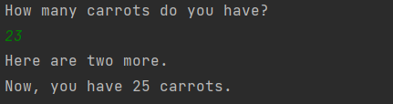
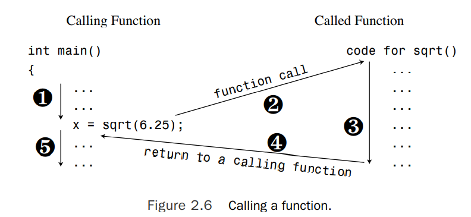
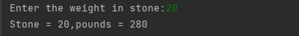

# C++项目入门

## 一个简单的项目

```c++
#include <iostream>

int main() {
    using namespace std;
    cout << "Come up and C++ me some time.";
    cout << endl;
    cout << "You won't regret it"<<endl;
    return 0;
}
```


**基本特性**

- 大小写敏感
- 注释，前缀为//
- 函数头
- using namespace指令
- 函数体{...}
- return

```c++
int main()//function head
{//function body
    statements;
    return 0;
}
```


[^分号]:标志一个命令的终止


#### 函数头

- 函数返回类型

  - <span style="color:green">省略（int)---C语言</span>
  - void == empty(C++)/empty=remaining silent(C)
  - main()的隐式返回：return 0;

- 函数名

- 参数列表

  

<span style="color:rgb(170, 0, 0)">**main()函数**</span>:正常独立程序需要main()

- DLL(dynamic link library): the code that other windows programs can use (doesn't need a main function)

- controller chip in a robot: not need a main()

  

#### 注释

**//**:C风格注释（C++可支持）

- C++注释
- 单行注释


**/* 内容 */:**

- 支持单行或多行注释


#### C++预处理和iostream文件

```c++
#include <iostream>//添加iostream文件的内容
using namespace std;
```


**预处理:**在编译之前处理源文件

- 处理#开头的指令
- 增加或替换内容


###### 头文件

.h扩展保留C程序头文件，C++头文件针对C头文件无扩展，前缀为c

> math.h 等价于cmath

iostream: 主要服务input/output


###### 命名空间

```c++
using namespace std;
```

使得iostream在项目中可访问


**using指令**

可以省略命名空间前缀

> **std::**cout


#### 输入输出

```c++
cout << "Come up and C++ me some time.";
```


"内容"：双引号包括的内容被认为字符串

<<：将内容传递给cout，位左移操作的重载

cout:预定义对象，展示各种类型（字符串、数字、单个字符等）

endl:开始新行


**新行字符**

- \n
- endl:保证输出已经被刷新


#### C++源文件格式

**声明语句和变量**

- 类型需要存储空间
- 获取存储的标签


1.定义声明：表明存在对变量的空间分配

```c++
int var;
```


2.引用声明：该变量已经被定义

```c++
printf("%d",var);
```


3.赋值语句：给分配的空间赋值,顺序为从左到右

```c++
var=24;
```


**cout技巧**:

- 打印变量所指向的值
- 将值转换为字符串输出


**cout的拼接**

该例子将四个输出语句拼接成一个


---

<center style="font-weight:bold">cout vs printf</center>

printf:对格式的精准控制和严格要求

cout:更具有可扩展性

---


###### 更多C++语句

example:

```c++
#include <iostream>

int main(){
    using namespace std;
    int carrots;
    cout<<"How many carrots do you have?"<<endl;
    cin>>carrots;
    cout<<"Here are two more."<<endl;
    carrots+=2;
    cout<<"Now, you have "<<carrots<<" carrots."<<endl;
    //隐式添加return 0;
}
```




- cin: 读取输入并赋值给carrots

- <<:插入字符到输出流  >>:提取输入字符（存在数据类型转换）

  

#### 类

**cin**和**cout**是类的一种，类是用户定义的数据类型

类与对象的关系等同于数据类型与变量的关系

- 描述数据组成格式

- 对数据执行的行为

  

cout：是ostream类的一个对象

- 操作行为

  - 插入数值、字符串到输出流

  

**cout打印信息的两种方式**：

1、复写<<操作

2、调用类方法


**cin**：是istream类的一个对象

---

**NOTE**

两个类都定义在iostream文件中，使用者可以随意调整【不建议】

---


#### 方法




#### 方法分类

- **有返回值**

  sqrt():返回一个数字的平方根

  ```c++
  x = sqrt(y);
  ```

  

  在C++编译器执行函数之前，它需要知道函数参数和返回值类型（函数原型语句）

  ```c++
  double sqrt(double );
  ```

  

  *实现方式*

  - 头文件
  - 源代码声明函数原型（sqrt函数的头文件cmath）

  函数定义：实现代码（标准库文件包含编译后的函数代码，头文件包含方法原型）


```c++
#include <iostream>
#include <cmath>

int main(){
    using namespace std;
    double area;
    cout<<"Enter the floor area,in square feet, of your home: ";
    cin >> area;
    double side;
    side = sqrt(area);
    cout<<"That's the equivalent of a square "<< side << " feet to the side."<<endl;
    cout<<"How fascinating!"<<endl;
}
```


>**使用库函数**
>
>C++库函数存储在库文件中，不同编译器对库文件的搜索方式不同，引入头文件不代表编译器能正确搜索对应的库文件，如果出现_sqrt is an undefined external类似的提醒，你需要自动链接指定库.
>
>g++ sqrt.C -lm（for library math）
>
>ps: main函数的返回值返回给操作系统
>
>通常情况下：0表示成功，非0表示失败


- **无返回值**

```c++
void bucks(double); 
```


#### 函数参数

函数需要多个参数则参数间通过'**,**'隔开

- 两个参数

> pow()
>
> double pow(double, double); 
>
> 需要两个参数作为输入，返回第一个参数的第二个参数次方幂

- 无参数

>rand()
>
>int rand(void); 
>
>返回随机int值


#### 关键词

程序语言的词汇，例如：int,void,return以及double

- 关键词不能作为变量名
- main不是关键词（为了避免带来未知的麻烦，最好不要这样做）
- cout不能同时作为变量名和方法在同一个函数中使用


#### 用户定义函数

标准C语言提供超过140预定义的方法

1.无返回值

```c++
#include <iostream>

void hello(std::string name);
int main(){
    hello("windy");
}

void hello(std::string name){
    std::cout<<"hello "<<name;
}
```


###### 函数格式

>type functionname(argument list)
>
>{
>
>​	statements;
>
>}

每个函数定义都是单独的，函数定义不能彼此嵌套


2.有返回值

```c++
#include <iostream>
int stonetolb(int);

int main(){
    using namespace std;
    int stone;
    cout<<"Enter the weight in stone:";
    cin>>stone;
    int pounds = stonetolb(stone);
    cout<<"Stone = "<<stone<<",pounds = " << pounds<<endl;

}

int stonetolb(int stone){
    return 14*stone;
}
```



具有返回值函数调用方式与其同类型常量使用方式相同

```c++
pounds=0;
pounds+= stonetolb(stone);
```


---

**using语句tips**

using namespace std;

- 放置在文件的函数定义语句上，所有的函数都能访问std namespace
- 放置在指定函数，只有该函数能访问std namespace的所有内容
- using std::cout,指定元素被访问
- 不使用using,完整声明前缀

---


- #### C++语句类型总结

  - 声明语句
  - 赋值语句
  - 信息语句：发送信息到一个对象，初始化某类行为
  - 方法调用
  - 方法原型
  - 返回语句
