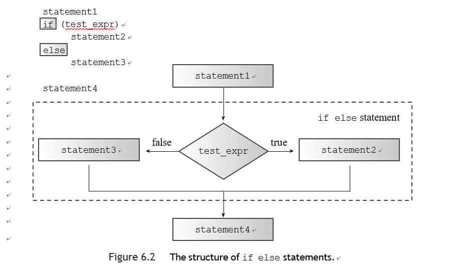
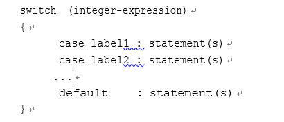
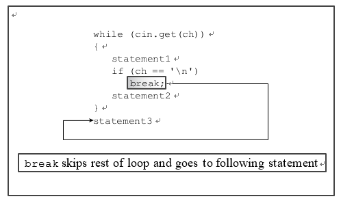

# 第六章

[TOC]

#### if语句

###### if模型

与循环测试条件一样，if 测试条件被类型转换为 bool 值，因此零变为假，非零变为真。整个 if 结构算作一个语句。


e.g.

```c++
int main() {
    using namespace std;
    string word;
    int cchar=0,cspace=0;
    int ch;
    while((ch=cin.get())!='.'){
        cchar++;
        if(ch==' ')
            cspace++;
    }
    cout<<cspace<<" spaces, "<<cchar<<" characters total in sentence\n";
    return 0;
}
```


###### if-else模型

如果测试条件为真，或为非零，程序将执行语句1，并跳过语句2。否则，当测试条件为假或为零时，程序将跳过语句1而执行语句2。



```c++
int main() {
    using namespace std;
    char ch;
    std::cout<<"Type and I shall repeat.\n";
    std::cin.get(ch);
    while(ch!='.'){
        if(ch=='\n'){
            std::cout<<ch;
        }else
            std::cout<<++ch;
        std::cin.get(ch);
    }
    std::cout<<"\nPlease excuse the slight confusion.\n";
    return 0;
}
```

:warning:将++ch改为ch+1有一个有趣的效果,由于计算机更擅长处理int型，会将char转换为int型+1，最后输出int的值


---

**编译错误**

```c++
if (ch == 'Z')

zorro++;   // if ends here

cout << "Another Zorro candidate\n"; else // wrong

dull++;

cout << "Not a Zorro candidate\n";

```

编译器认为它是一个简单的if语句，以zorro++;语句结束。然后有一个cout语句。但是有一个编译器认为是没有连接的else，这被标记为一个语法错误。


###### if-else-if模型

因为if else语句本身是一个单一的语句，它可以跟在else后面。

e.g 

```c++
const int Fave = 27;

int main() {
    using namespace std; int n;

    cout << "Enter a number in the range 1-100 to find "; cout << "my favorite number: ";
    do
    {
        cin >> n;
        if (n < Fave)
            cout << "Too low -- guess again: "; 
        else if (n > Fave)
            cout << "Too high -- guess again: ";
        else
            cout << Fave << " is right!\n";
    } while (n != Fave); 

    return 0;
}

```

---

**条件运算符和错误预防**

许多程序员将更直观的表达式variable == value反转为value == variable，以便捕捉那些被错误地输入为赋值操作的错误。

`if (3 == myNumber)`

如果你碰巧输入错误，编译器会产生一条错误信息，因为它认为你在试图给一个字面符号赋值（3总是等于3，不能再赋值）。

---


#### 逻辑表达式

C++提供了三个逻辑运算符来组合或修改现有的表达式,运算符是逻辑OR，写作||；逻辑AND，写作&&；逻辑NOT，写作！。


###### 逻辑或（||)

可以表示两个条件中的一个或两个都满足要求,该运算符将两个表达式合二为一。 如果原始表达式中的一个或两个为真或非零，则结果表达式的值为真。 否则，表达式的值为 false。因为 || 具有比关系运算符低的优先级，您不需要在这些表达式中使用括号。


|                | expr1 = true | expr1==false |
| :------------: | :----------: | :----------: |
| expr2 == true  |     true     |     true     |
| expr2 == false |     true     |    false     |

C++规定||运算符是一个序列点，任何在左边表示的数值变化都会在右边被评估之前发生,如果左边的表达式为真，C++ 也不会费心去计算右边的表达式，它只需要一个 真表达式使整个逻辑表达式为真。


e.g.

```c++

int main() {
    using namespace std;
    cout << "This program may reformat your hard disk\n"
            "and destroy all your data.\n"
            "Do you wish to continue? <y/n> ";
    char ch;
    cin >> ch;
    if (ch == 'y' || ch == 'Y')	// y or Y
        cout << "You were warned!\a\a\n";
    else if (ch == 'n' || ch == 'N')	// n or N
        cout << "A wise choice ... bye\n";
    else
    cout << "That wasn't a y or n! Apparently you " "can't follow\ninstructions, so "
            "I'll trash your disk anyway.\a\a\a\n";
    return 0;
}
```


###### 逻辑与运算符：&&

只有当两个原始表达式都为真时，结果表达式才具有值 true,因为 && 的优先级低于关系运算符，所以您不需要在这些表达式中使用括号,像||运算符一样，&&运算符作为一个序列点，所以左边被评估，任何副作用都在右边被评估之前被执行，如果左边是假的，那么整个逻辑表达式必须是假的，所以C++在这种情况下不需要评估右边。

|                | expr1 = true | expr1==false |
| :------------: | :----------: | :----------: |
| expr2 == true  |     true     |    false     |
| expr2 == false |    false     |    false     |


e.g.

```c++
const int ArSize = 6;

int main() {
    using namespace std;
    float naaq[ArSize];
    cout << "Enter the NAAQs (New Age Awareness Quotients) "
         << "of\nyour neighbors. Program terminates "
         << "when you make\n" << ArSize << " entries "
         << "or enter a negative value.\n";

    int i = 0;
    float temp;
    cout << "First value: ";
    cin >> temp;
    while (i < ArSize && temp >= 0) // 2 quitting criteria
    {
        naaq[i] = temp;
        ++i;
        if (i < ArSize)	// room left in the array,
        {
            cout << "Next value: ";
            cin >> temp;	// so get next value
        }
    }
    if (i == 0)
        cout << "No data--bye\n";
    else
    {
        cout << "Enter your NAAQ: ";
        float you;
        cin >> you; int count = 0;
        for (int j = 0; j < i; j++)
            if (naaq[j] > you)
                ++count;
        cout << count;
        cout << " of your neighbors have greater awareness of\n"
             << "the New Age than you do.\n";
    }

    return 0;
}
```


**使用 && 设置范围**

```c++
const char * qualify[4] =	// an array of pointers
        {	// to strings
                "10,000-meter race.\n", "mud tug-of-war.\n",
                "masters canoe jousting.\n", "pie-throwing festival.\n"
        };


int main() {
    using namespace std;
    int age;
    cout << "Enter your age in years: "; cin >> age;
    int index;

    if (age > 17 && age < 35) index = 0;
    else if (age >= 35 && age < 50) index = 1;
    else if (age >= 50 && age < 65) index = 2;
    else
        index = 3;

    cout << "You qualify for the " << qualify[index];
    return 0;
}
```

---

**Note**

`if (17 < age < 35)`

如果你犯了这个错误，编译器不会把它当作一个错误来抓，因为它仍然是有效的C++语法。<运算符从左到右关联，所以前面的表达式意味着以下内容。

`if ( (17 < age) < 35)`

但是17<age，要么是真的，或者是1，要么是假的，或者是0。在任何一种情况下，17<年龄的表达式都小于35，所以整个测试都是真的。


###### 逻辑上的NOT操作符：!

操作符"！"否定了它后面的表达式，或者说颠倒了它的真值,如果表达式为真，那么！表达式为假，反之亦然。

```c++
#include <climits>
bool is_int(double);

int main() {
    using namespace std;
    double num;
    cout<<"Yo, dude! Enter an integer value: ";
    cin>>num;
    while(!is_int(num)){
        cout << "Out of range -- please try again: ";
        cin >> num;
    }
    int val = int(num);
    cout << "You've entered the integer " << val << "\nBye\n";
    return 0;
}

bool is_int(double x)
{
    if(x<=INT_MAX&&x>=INT_MIN)
        return true;
    else
        return false;
}
```

:warning:！运算符的优先级高于任何关系或算术运算符。因此，要否定一个表达式，你应该用括号括住该表达式。逻辑AND运算符比逻辑OR运算符有更高的优先级。

---

**Note**

如果你在读取int类型的程序中输入一个过大的值，许多C++实现会简单地截断该值以适应，而不通知你数据丢失。

---


C++保证当程序评估一个逻辑表达式时，它从左到右进行评估，一旦知道答案是什么，就停止评估。

---

**替代性表示法**

并非所有的键盘都提供了用于逻辑运算符的所有符号，因此C++标准提供了替代表示法。标识符and、or和not是C++的保留词，意味着你不能用它们作为变量的名称等等。它们不被认为是关键字，因为它们是现有语言特性的替代表示。为操作符使用，只要程序包括iso646.h头文件。C++不要求使用头文件。

---


#### ctype库的字符函数

C++从C语言中继承了一个与字符有关的函数包，其原型在cctype头文件中。

[^isalpha(ch)]:ch是字母时返回一个非零值，否则返回一个零值
[^ispunct(ch)]:只在ch是一个标点符号，如逗号或句号时返回一个真值
[^isdigits()]:如果参数是十进制数字（0-9）
[^isspace()]:测试空白字符，如空格、formfeed、换行、回车、水平制表符、垂直制表符
[^ispunct()]:测试标点字符
[^isalnum()]:如果参数是字母数字（即一个字母或一个数字），该函数返回 true
[^isblank()]:如果参数是一个空格或一个水平制表符，该函数返回真
[^iscntrl()]:如果参数是一个控制字符，该函数返回真
[^isgraph()]:如果参数是除空格以外的任何打印字符，该函数返回true
[^islower()]:如果参数是一个小写字母，该函数返回真
[^isprint()]:如果参数是任何打印字符，包括空格，该函数返回真
[^isupper()]:如果参数是一个大写字母，该函数返回true
[^isxdigit()]:如果参数是一个十六进制数字字符（即0-9，a-f或A-F），这个函数返回真
[^tolower()]:如果参数是一个大写的字符，tolower()返回该字符的小写版本；否则，它返回参数，不作任何改动
[^toupper()]:如果参数是一个小写字符，toupper()返回该字符的大写版本；否则，返回的参数不做任何修改

:warning:这些函数的返回类型是int而不是bool，但是通常的bool转换允许你把它们当作bool类型。

---

**Note**

AND/OR形式假设A到Z的字符编码是连续的，没有其他字符的编码在这个范围内。这个假设对ASCII编码是真实的，但在一般情况下并不总是真实的。

---


e.g.

```c++
int main() {
    using namespace std;
    cout << "Enter text for analysis, and type @" " to terminate input.\n";
    char ch;
    int whitespace = 0;
    int digits = 0;
    int chars = 0;
    int punct = 0;
    int others = 0;
    while((ch=cin.get())!='@')
    {
        if(isspace(ch))whitespace++;
        else if(isdigit(ch))digits++;
        else if(isalpha(ch))chars++;
        else if(ispunct(ch))punct++;
        else others++;
    }
    cout << chars << " letters, "
         << whitespace << " whitespace, "
         << digits << " digits, "
         << punct << " punctuations, "
         << others << " others.\n";

    return 0;
}
```


#### ?:操作符

唯一需要三个操作数的 C++ 运算符

expression1 ? expression2 : expressio

如果表达式 1 为真，则整个条件表达式的值就是表达式 2 的值。 否则，整个表达式的值就是表达式 3 的值。


e.g.

```c++
#include <iostream>
int main()
{
using namespace std; int a, b;
cout << "Enter two integers: "; cin >> a >> b;
cout << "The larger of " << a << " and " << b;
int c = a > b ? a : b;	// c = a if a > b, else c = b cout << " is " << c << endl;
return 0;
}
```

为了隐藏代码的目的这一应受谴责的目标，人们最喜欢的一种技巧是将条件表达式相互嵌套

```c++
const char x[2] [20] = {"Jason ","at your service\n"}; const char * y = "Quillstone ";

for (int i = 0; i < 3; i++)
cout << ((i < 2)? !i ? x [i] : y : x[1]);

```


#### switch语句

但 C++ switch 语句更容易处理从扩展列表中选择一个选项，C++ switch 语句充当路由设备，告诉计算机接下来要执行哪一行代码。



每个标签必须是一个整数常数表达式，大多数情况下，标签是简单的int或char常量，如1或'q'，或枚举器。如果整数表达式与任何一个标签不匹配，程序就会跳到标有default的那一行。如果你省略了它，并且没有匹配，程序就会跳转到切换后的下一条语句


每个C++ case标签作为行标签，不是选择之间的界限,当程序跳转到switch中的某一行后，除非你有明确的指示，否则它会依次执行switch中该行之后的所有语句。执行不会在下一个案例中自动停止。要使执行在某一组语句的末尾停止，你必须使用break语句，这将使执行跳到switch后面的语句。

```c++
#include <iostream>
using namespace std;
void showmenu();	// function prototypes 
void report();
void comfort(); 
int main()
{
showmenu(); 
int choice; 
cin >> choice;
while (choice != 5)
{
switch(choice)
{
case 1 :	cout << "\a\n";
break; case 2 :	report();
break;
case 3 :	cout << "The boss was in all day.\n"; break;
case 4 :	comfort();
break;
default :	cout << "That's not a choice.\n";
}
showmenu(); cin >> choice;
}
cout << "Bye!\n"; return 0;
}

void showmenu()
{
cout << "Please enter 1, 2, 3, 4, or 5:\n"
"1) alarm	2) report\n"
"3) alibi	4) comfort\n"
"5) quit\n";
}
void report()
 
{
cout << "It's been an excellent week for business.\n" "Sales are up 120%. Expenses are down 35%.\n";
}
void comfort()
{
cout << "Your employees think you are the finest CEO\n" "in the industry. The board of directors think\n" "you are the finest CEO in the industry.\n";
}

```

:warning:某些硬件/操作系统组合将 \a 转义序列视为无提示,输入必须是整数才能使该程序正常工作。 例如，如果你输入一个字母，输入语句就会失败，循环将无限循环(读取无限次失败，choice永远为0)，直到你终止程序。


e.g.

```c++
char choice; cin >> choice;
while (choice != 'Q' && choice != 'q')
{
switch(choice)
{
case 'a':
case 'A': cout << "\a\n"; break;
case 'r':
case 'R': report();
break;
case 'l':
case 'L': cout << "The boss was in all day.\n"; break;
case 'c':
case 'C': comfort();
break;
default : cout << "That's not a choice.\n";
}
showmenu(); cin >> choice;
}

```

一般来说，cin无法识别枚举类型（它不能知道你如何定义它们），所以程序将choice读作int.当switch语句将int值与枚举器的case标签进行比较时，它将枚举器提升为int.同时在while循环测试条件中，枚举器也被提升为int类型。

###### 使用枚举器作为标签

e.g.

```c++
#include <iostream>
// create named constants for 0 - 6
enum {red, orange, yellow, green, blue, violet, indigo};

int main()
{
using namespace std;
cout << "Enter color code (0-6): "; int code;
cin >> code;
while (code >= red && code <= indigo)
{
switch (code)
{
    case red	: 
        cout << "Her lips were red.\n"; 
        break; 
    case orange : 
        cout << "Her hair was orange.\n"; 
        break; 
    case yellow : 
        cout << "Her shoes were yellow.\n"; 
        break; 
    case green	: 
        cout << "Her nails were green.\n"; 
        break;
case blue	: 
        cout << "Her sweatsuit was blue.\n"; 
        break; 
    case violet : 
        cout << "Her eyes were violet.\n"; 
        break; 
    case indigo : 
        cout << "Her mood was indigo.\n"; 
        break;
}
cout << "Enter color code (0-6): "; 
    cin >> code;
}
cout << "Bye\n"; return 0;
}

```

:warning:语句不能处理浮点测试。而且case标签值必须是一个常数。

---

**Note**

如果所有的选择都是整数常量，你可以使用switch或if else语句。从代码大小和执行速度来看，switch语句通常是更有效的选择。如果你可以使用if else if序列或switch语句，通常的做法是，如果你有三个或更多的选择，就使用switch。

---


#### break和continue语句

break和continue语句使程序能够跳过部分代码：

- 可以在 switch 语句和任何循环中使用 break 语句。 它使程序执行转到切换或循环之后的下一条语句
- continue语句用于循环中，使程序跳过循环主体的其余部分，然后开始一个新的循环周期




e.g.

```c++
#include <iostream>
const int ArSize = 80; int main()
{
using namespace std;
char line[ArSize]; int spaces = 0;

cout << "Enter a line of text:\n"; cin.get(line, ArSize);
cout << "Complete line:\n" << line << endl; cout << "Line through first period:\n";
for (int i = 0; line[i] != '\0'; i++)
{
cout << line[i];	// display character
if (line[i] == '.') // quit if it's a period 
    break;
if (line[i] != ' ') // skip rest of loop 
    continue;
spaces++;
}
cout << "\n" << spaces << " spaces\n"; cout << "Done.\n";
return 0;
}


```

:warning:尽管continue语句使程序跳过循环体的其余部分，但它并没有跳过循环的更新表达式。在 for 循环中，continue 语句使程序直接跳到更新表达式，然后跳到测试表达式。 然而，对于 while 循环，continue 使程序直接转到测试表达式。


#### 读数循环

假设您正在准备一个将一系列数字读入数组的程序。您希望为用户提供在填充数组之前终止输入的选项。

一个方法是利用cin的行为方式。

```c++
int n; 
cin >> n;
```

如果用户的反应是输入一个字符而不是一个数字，会发生什么？

- n的值保持不变。
- 不匹配的输入被留在输入队列中
- 在cin对象中设置一个错误标志，必须在程序可以读取更多输入之前重置该标志
- 对cin方法的调用，如果转换为bool类型，返回false，可以使用非数字输入来终止数字读取循环

[^clear()]:重置文件结束 (EOF) 条件，重置错误输入标志，错误的输入或 EOF 都可能导致 cin 返回假


```c++
const int Max=5;

int main() {
    using namespace std;
    double fishes[Max];
    int index=0;
    cout << "Please enter the weights of your fish.\n";
    cout << "You may enter up to " << Max<< " fish <q to terminate>.\n";
    cout << "fish #1: ";
    //That expression reads the next number from the standard input and stores that number in value.
    // The input operator returns its left operand, which in this case is std::cin.
    while(index<Max&&cin>>fishes[index]){
        index++;
        cout<<"fish #"<<index<<": ";
    }
    double total=0;
    for(int i=0;i<index;i++){
        total+=fishes[i];
    }

    if ( index == 0)
        cout << "No fish\n"; else
        cout << total / index << " = average weight of "
             << index << " fish\n";
    cout << "Done.\n";
    return 0;
}

```

更优雅的结果处理方式

```c++
if (!cin) // input terminated by non-numeric response
{
cin.clear(); // reset input cin.get();	// read q
}
cin.get();	// read end of line after last input cin.get();	// wait for user to press <Enter>

```


如果用户输入非数字输入，程序应该反对，坚持输入数字。

```c++
const int Max=5;

int main() {
    using namespace std;
    double fishes[Max];
    cout << "Please enter your golf scores.\n";
    cout << "You must enter " << Max << " rounds.\n";
    int index;
    for(index=0;index<Max; index++){
        cout<<"fish #"<<(index+1)<<": ";
        while(!(cin>>fishes[index])){
            cin.clear();
            while(cin.get()!='\n')
                continue;
            cout << "Please enter a number: ";
        }
    }
    double total=0;
    for(int i=0;i<index;i++){
        total+=fishes[i];
    }

    if ( index == 0)
        cout << "No fish\n"; else
        cout << total / index << " = average weight of "
             << index << " fish\n";
    cout << "Done.\n";
    return 0;
}

```


#### 简单文件输入输出

###### 文本 I/O 和文本文件

有的输入开始时都是文本，相当于控制台输入的文件是一个文本文件，本章讨论的文件I/O与控制台I/O并行，因此应与文本文件一起使用。为了创建输入的文本文件，你可以使用文本编辑器，如Windows的记事本，或Unix/Linux的vi或emacs。同样地，你可以使用文本编辑器来查看用文本输出创建的文件。

:warning: 不是所有的文件都是文本文件，数据库和电子表格以数字形式存储数字数据，即以二进制整数或二进制浮点形式。


文本I/O:当您使用 cin 进行输入时，程序将输入视为一系列字节，每个字节都被解释为一个字符代码。 无论目标数据类型是什么，输入都以字符数据开始——即文本数据，然后 cin 对象负责将文本转换为其他类型。


**输出**

在输出时，发生相反的转换。也就是说，整数被转换为数字字符序列，浮点数被转换为数字和其他字符的序列（例如，284.53或-1.587E+06），字符不需要翻译。

cout输出

- 必须包含iostream头文件
- iostream头文件定义了一个用于处理输出的ostream类
- iostream头文件声明了一个名为cout的ostream变量，或对象
- 使用using指令或std::前缀来表示cout和endl等元素
- 使用cout和<<操作符来读取各种数据类型，文件输出与此非常相似

文件输出

- 必须包括fstream头文件
- fstream头文件定义了一个用于处理输出的ofstream类
- 声明一个或多个ofstream变量或对象
- 使用using指令或std::前缀来表示ofstream等元素
- 把一个特定的ofstream对象和一个特定的文件联系起来（open()方法等）
- 完成了一个文件，使用close()方法来关闭该文件
- 可以使用一个带有<<操作符的ofstream对象来输出各种数据类型

```c++
    ofstream outFile;
    char filename[50];
    cin>>filename;
    outFile.open(filename);
```

open()方法需要一个C语言风格的字符串作为它的参数(字面字符串或存储在数组中的字符串)。


写入浮点数

```c++
double wt=125.8;
outFile<<wt;
```

所有的操作和方法 所有可用于cout的操作和方法，如<<、endl和setf()，也都可用于ofstream对象


e.g.

```c++
int main() {
    using namespace std;

    char automobile[50];
    int year;
    double a_price;
    double d_price;

    ofstream outFile;
    outFile.open("carinfo.txt");
    cout << "Enter the make and model of automobile: ";
    cin.getline(automobile, 50);
    cout << "Enter the model year: ";
    cin >> year;
    cout << "Enter the original asking price: ";
    cin >> a_price;
    d_price = 0.913 * a_price;

    cout<<fixed;
    cout.precision(2);
    cout.setf(ios_base::showpoint);
    cout << "Make and model: " << automobile << endl;
    cout << "Year: " << year << endl;
    cout << "Was asking $" << a_price << endl;
    cout << "Now asking $" << d_price << endl;

    outFile<<fixed;
    outFile.precision(2);
    outFile.setf(ios_base::showpoint);
    outFile<< "Make and model: " << automobile << endl;
    outFile << "Year: " << year << endl;
    outFile << "Was asking $" << a_price << endl;
    outFile<< "Now asking $" << d_price << endl;

    outFile.close();
    clock_t start = clock();
    clock_t delay = 6*CLOCKS_PER_SEC;
    while((clock()-start)<delay);
    return 0;
}
```

默认写入方式是完全覆盖

:warning:如果你忘记关闭一个文件，如果程序正常终止，程序会自动关闭它。

[^std::fixed]: 使用定点记数法编写:该值在十进制部分中表示的数字恰好与精度字段(precision)指定的数字相同，并且没有指数部分。
[^cout.setf(ios_base::showpoint);]: 在生成的浮点输出中无条件地生成一个小数点字符。
[^open()]: 文件不存在，open()方法以这个名字创建了一个全新的文件，当文件存在时，它把文件的长度减为零，丢弃当前的内容，打开失败（文件可能已经存在，并且访问受限）


**输入**

> 38.5 19.2

cin 在使用不同数据类型时如何处理这行输入：

```c++
char ch; 
cin >> ch;
```

第一个字符是数字 3，这个数字的字符代码（二进制）存储在 ch 中,输入和目标都是字符，因此不需要转换。


```c++
int n; 
cin >> n;
```

cin读到了第一个非数字字符,读到数字3和8，38的二进制代码被复制到n，留下了句号作为输入队列中的下一个字符。


```c++
double x; 
cin >> x;
```

cin 读取到第一个不属于浮点数的字符,读取38.5，38.5的二进制代码（浮点数格式）被复制到x，留下空格作为输入队列中的下一个字符。


```c++
char word[50]; 
cin >> word;
```

cin 读取到空白字符,它读取38.5，将空格作为输入队列中的下一个字符。然后cin将这四个字符的字符代码存储在数组word中，并添加一个结束的空字符。


```c++
char word[50]; 
cin.geline(word,50);
```

cin读到换行符（样本输入行少于50个字符）,所有到最后2的字符都存储在数组字中，并添加一个空字符，换行符被丢弃，而输入队列中的下一个字符将是下一行的第一个字符。


cin输入

- 包含iostream头文件
- iostream头文件定义了一个用于处理输入的istream类
- iostream头文件声明了一个名为cin的istream变量/对象
- 使用using指令或std::前缀来表示cin等元素
- 使用cin和>>操作符来读取各种数据类型
- 使用cin和get()方法来读取单个字符，也可以使用getline()方法，一次读取一行字符
- 将cin与eof()和fail()等方法一起使用，以监控输入尝试的成功
- 对象cin本身，当被用作测试条件时，如果最后一次读取尝试成功，则转换为布尔值true，否则为false。


文件输入

- 包括fstream头文件
- fstream头文件定义了一个用于处理输入的ifstream类
- 声明一个或多个ifstream变量或对象
- 使用using指令或std::前缀来表示ifstream等元素
- 一个特定的ifstream对象和一个特定的文件联系起来(open方法)
- 当完成了一个文件，使用close()方法来关闭该文件
- 使用ifstream对象和>>操作符来读取各种数据类型
- 用ifstream对象的get()方法来读取单个字符，用getline()方法来一次读取一行字符
- 使用ifstream对象的eof()和fail()等方法来监控输入尝试的成功与否
- 一个ifstream对象本身，当被用作测试条件时，如果最后一次读取尝试成功，将被转换为布尔值true，否则为false


```c++
double wt;
inFile >> wt;	// read a number from bowling.txt char line[81];
fin.getline(line, 81); // read a line of text
```

```c++
int main() {
    using namespace std;
    char filename[SIZE];
    cout << "Enter name of data file: ";
    cin>>filename;
    ifstream fin;
    fin.open(filename);
    if(!fin.is_open()){
        cout << "Could not open the file " << filename << endl;
        cout << "Program terminating.\n";
        exit(EXIT_FAILURE);
    }

    double value;
    double sum = 0.0;
    int count = 0; // number of items read

    fin >> value;  // get first value
    while(fin.good()){
        ++count;
        sum+=value;
        fin>>value;
    }
    if(fin.eof()){
        cout<<"End of file reached.\n";
    }else if(fin.fail()){
        cout << "Input terminated by data mismatch.\n";
    }else{
        cout << "Input terminated for unknown reason.\n";
    }

    if(count==0){
        cout << "No data processed.\n";
    }else{
        cout << "Items read: " << count << endl;
        cout << "Sum: " << sum << endl;
        cout << "Average: " << sum / count << endl;
    }

    fin.close();
    clock_t start = clock();
    clock_t delay = 6*CLOCKS_PER_SEC;
    while((clock()-start)<delay);
    return 0;
}
```

:warning:除非你的输入包括文件的路径名称，否则程序将在包含可执行文件的同一文件夹或目录中查找。

[^is_open()]:检查一个文件是否被成功打开,如果文件被成功打开，is_open()方法就会返回真
[^exit()]:exit()函数的原型在cstdlib头文件中,定义了EXIT_FAILURE作为与操作系统通信的参数值,exit()函数终止了程序
[^eof()]:如果最近一次试图读取数据时遇到EOF，eof()方法会返回true
[^fail()]:最近一次的读取尝试遇到了类型不匹配，fail()方法返回真(如果遇到EOF，该方法也会返回真)
[^bad()]:一些意想不到的事情可能会出错——例如，损坏的文件或硬件故障，如果最近的读取尝试遇到此类问题，bad() 方法将返回 true
[^good()]:报告的是最近一次读取输入的尝试,没有问题的情况下返回true

---

**Note**

一个Windows文本文件使用回车符和换行符来结束一行文本。通常的C++文本模式在读取文件时将这种组合翻译成换行符，而在向文件写入时则将这种翻译反过来。一些文本编辑器，如Metrowerks CodeWarrior IDE编辑器，不会自动在最后一行添加这个组合。因此，如果你使用这样的编辑器，你需要在输入最后的文字后和退出文件前按下回车键。

---


简化

```c++
while( fin >> value){
    ++count;
    sum+=value;
}
```
