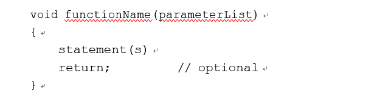
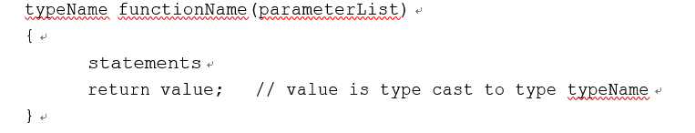
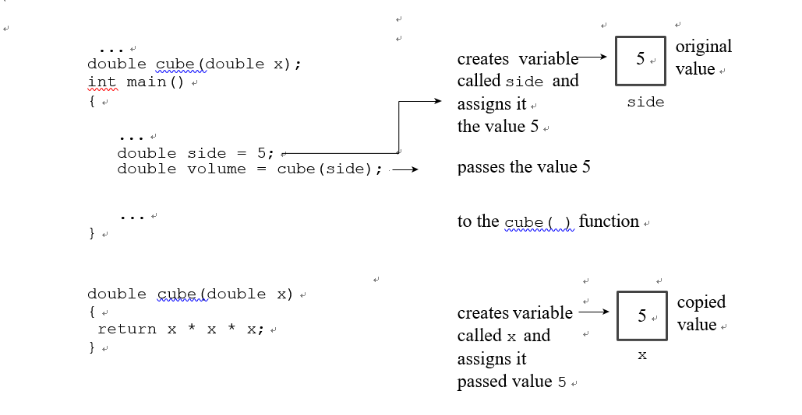
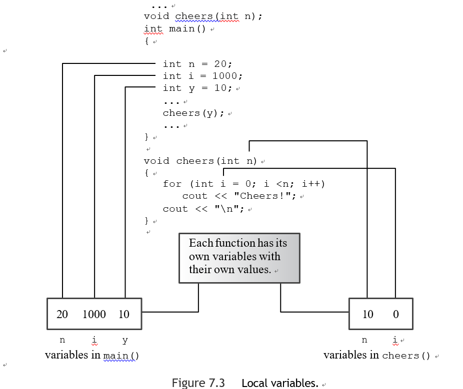
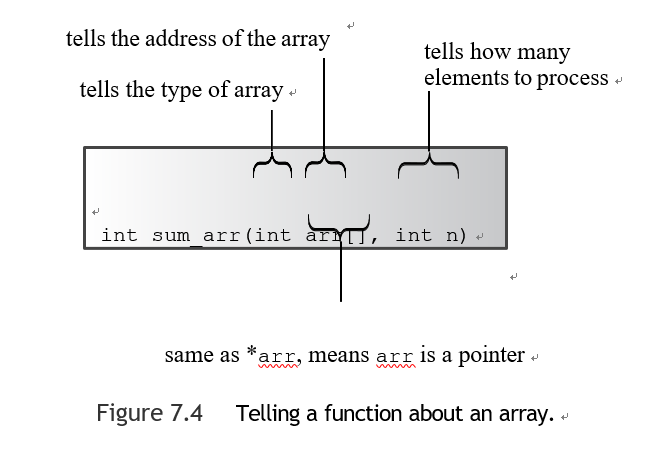
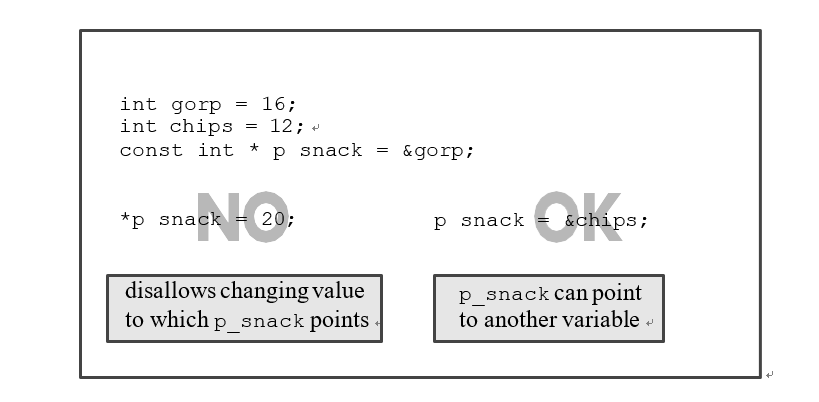
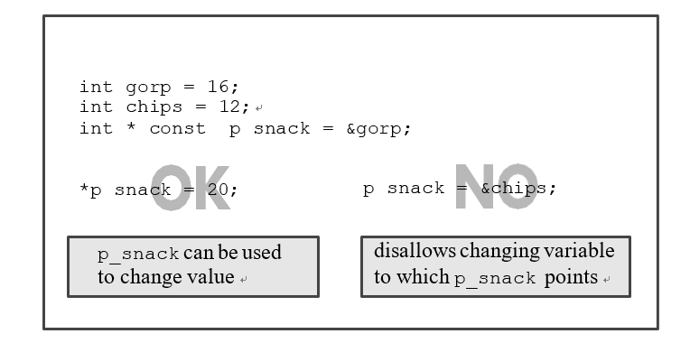
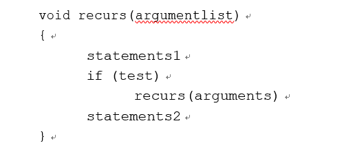
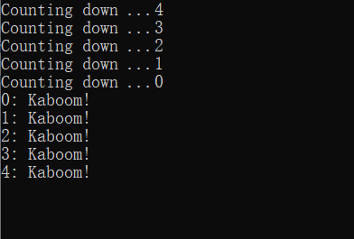
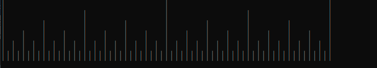

# 第七章

[TOC]

#### 函数回顾

要使用一个C++函数，你必须做以下事情。

- 提供一个函数定义
- 提供一个函数原型
- 调用该函数


e.g.

```c++
void simple();  // function prototype

int main() {
    using namespace std;
    cout << "main() will call the simple() function:\n";
    simple();  // function call
    cout << "main() is finished with the simple() function.\n";
// cin.get();
    clock_t start = clock();
    clock_t delay = 6*CLOCKS_PER_SEC;
    while((clock()-start)<delay);
    return 0;
}

// function definition void
void simple()
{
using namespace std;
cout << "I'm but a simple function.\n";
}
```


###### 定义函数

**无返回值**




**有返回值**



通常情况下，一个函数通过将返回值复制到指定的CPU寄存器或内存位置来返回一个值，然后调用程序检查该位置


:warning:C++确实对返回值的类型做了限制：返回值不能是一个数组,其他一切都有可能--整数、浮点数、指针，甚至是结构和对象。


###### 原型和调用函数

e.g.

```c++
void cheers(int);   // prototype: no return value
double cube(double x); // prototype: returns a double

int main() {
    using namespace std;
    cheers(5); // function call cout << "Give me a number: ";
    double side;
    cin >> side;
    double volume = cube(side);    // function call
    cout << "A " << side <<"-foot cube has a volume of ";
    cout << volume << " cubic feet.\n";
    cheers(cube(2));   // prototype protection at work
    return 0;
}

void cheers(int n)
{
    using namespace std;
    for (int i = 0; i < n; i++)
        cout << "Cheers! ";
    cout << endl;
}

double cube(double x)
{
    return x * x * x;
}
```


**函数原型**

获得原型的最简单方法是从函数定义中复制函数头并添加一个分号


:warning:函数原型并不要求你为变量提供名称,一个类型的列表就足够,原型中的变量名称只是作为占位符，所以如果你使用了名称，它们不一定要和函数定义中的名称一致。

---

**C++与ANSI C的原型设计**

ANSI C为了保持与经典C语言的兼容性，将原型设计作为可选项，而C++则将原型设计作为必选项。


原型验证是在*编译*时进行的，被称为*静态类型检查*，静态类型检查可以捕获许多在运行时更难捕获的错误。

```c++
void say_hi();
```

在C++中，将圆括号留空与在圆括号内使用关键字void是一样的

在ANSI C中，将圆括号留空意味着你拒绝说明参数是什么。

不识别参数列表的C++等同于使用一个省略号。

````c++
void say_bye(...); 
````

通常情况下，省略号的使用只需要与具有可变参数数量的C语言函数相连接，如printf()。


**假设你提供了一个参数，但它的类型是错误的**：

- 在C语言中，这可能会产生奇怪的错误：如果一个函数期望一个int类型的值（假设是16位），而你传递了一个double（假设是64位），那么这个函数只看64的前16位，并试图把它们解释为一个int值。

- C++会自动将你传递的值转换为原型中指定的类型，只要两者都是算术类型
- 

**自动类型转换并不能避免所有可能的错误**

例如，如果你将一个8.33E27的值传递给一个期望为int的函数，这样一个大的值就不能正确地转换为一个单纯的int。有些编译器会警告你，当有较大的类型自动转换为较小的类型时，可能会出现数据丢失。


**原型设计只在有意义的情况下才会进行类型转换**

例如，它不会将一个整数转换为一个结构或指针。

---


#### 函数参数和值传递

C++ 通常按值传递参数，参数的数值被传递给函数，在那里它被分配给一个新变量，一个用来接收传递的值的变量被称为形式参数或形式参数，传递给函数的值被称为实际参数或实际参数。

[^argument]:实参
[^parameter]:形参



在一个函数中声明的变量，包括参数，对该函数是私有的，当一个函数被调用时，计算机为这些变量分配所需的内存，当函数终止时，计算机将释放用于这些变量的内存，这样的变量被称为局部变量，样的变量也被称为自动变量，因为它们是在程序执行过程中自动分配和删除的。


###### 多参数



如果一个函数有两个相同类型的参数，你必须分别给出每个参数的类型。

```c++
void fifi(float a, float b) // declare each variable separately 
void fufu(float a, b)	// NOT acceptable
```


e.g.

```c++
using namespace std;
void n_chars(char, int);

int main() {
    using namespace std;
    int times;
    char ch;

    cout << "Enter a character: ";
    cin >> ch;
    while (ch != 'q')	// q to quit
    {
        cout << "Enter an integer: "; 
        cin >> times;
        n_chars(ch, times); // function with two arguments
        cout << "\nEnter another character or press the"
        " q-key to quit: ";
        cin >> ch;
    }
    cout << "The value of times is " << times << ".\n"; 
    cout << "Bye\n";

    clock_t start = clock();
    clock_t delay = 6*CLOCKS_PER_SEC;
    while((clock()-start)<delay);
    return 0;
}
void n_chars(char c, int n) // displays c n times
{
    while (n-- > 0)	// continue until n reaches 0
        cout << c;
}
```


交替乘除的策略可以防止计算溢出最大可能的浮点值

```c++
using namespace std;
long double probability(unsigned  numbers,unsigned picks);
int main() {
    using namespace std;
    double total,choices;
    cout<<"Enter the total number of choices on the game card and\n"
          "the number of picks allowed:\n";
    while ((cin >> total >> choices) && choices <= total){
        cout << "You have one chance in ";
        cout << probability(total, choices);   // compute the odds 
        cout << " of winning.\n";
        cout << "Next two numbers (q to quit): ";
    }
    cout << "bye\n";
    return 0;
}

long double probability(unsigned  numbers,unsigned picks){
    long double res = 1.0;
    long double n;
    unsigned p;
    for(n=numbers,p=picks;p>0;p--,numbers--)
        res=res/p*numbers;
    return res;
}
```


#### 函数和数组

e.g.

```c++
int sum_arr(int arr[],int n);
const int ArSize = 8;
int main() {
    using namespace std;
    int cookies[ArSize] = {1,2,4,8,16,32,64,128};
    int sum = sum_arr(cookies, ArSize);
    cout << "Total cookies eaten: " << sum << "\n";
    return 0;
}


int sum_arr(int arr[],int n){
    int sum=0;
    while(n>0){
        sum+=arr[--n];
    }
    return sum;
}
```

C++和C语言一样，在大多数情况下把数组的名称当作一个指针来处理,C++将数组名称解释为其第一个元素的地址。


**不同点**

- 数组声明使用数组名称来标记存储空间
- 对一个数组名称应用sizeof可以得到整个数组的大小，单位是字节
- 将地址操作符&应用于数组名称会返回整个数组的地址



e.g.

```c++
// arrfun2.cpp -- functions with an array argument #include <iostream>
const int ArSize = 8;
int sum_arr(int arr[], int n);
// use std:: instead of using directive int main()
{
int cookies[ArSize] = {1,2,4,8,16,32,64,128};
// some systems require preceding int with static to
// enable array initialization
 
std::cout << cookies << " = array address, ";
// some systems require a type cast: unsigned (cookies)

std::cout << sizeof cookies << " = sizeof cookies\n"; int sum = sum_arr(cookies, ArSize);
std::cout << "Total cookies eaten: " << sum << std::endl; sum = sum_arr(cookies, 3);	// a lie
std::cout << "First three eaters ate " << sum << " cookies.\n"; sum = sum_arr(cookies + 4, 4);	// another lie
std::cout << "Last four eaters ate " << sum << " cookies.\n"; return 0;
}

// return the sum of an integer array int sum_arr(int arr[], int n)
{
int total = 0;
std::cout << arr << " = arr, ";
// some systems require a type cast: unsigned (arr)

std::cout << sizeof arr << " = sizeof arr\n"; for (int i = 0; i < n; i++)
total = total + arr[i]; return total;
}

```


e.g. 数组填值

```c++
int fill_arr(double arr[],int limit){
    using namespace std;
    double temp;
    int i;
    for(i=0;i<limit;i++){
        cout << "Enter value #" << (i + 1) << ": ";
        cin>>temp;
        if(!cin){//bad input
            cin.clear();
            while(cin.get()!='\n'){
                continue;
            }
            cout << "Bad input; input process terminated.\n";
            break;
        }else if(temp<0)
            break;
        arr[i]=temp;
    }
    return i;
}
```

为了防止函数意外地改变数组参数的内容，你可以在声明形式参数时使用关键字const。

e.g.

```c++
void show_array(const double ar[], int n){
    using namespace std;
    for (int i = 0; i < n; i++)
    {
        cout << "Property #" << (i + 1) << ": $"; cout << ar[i] << endl;
    }
}
```


代码整合

e.g

```c++
int sum_arr(int arr[],int n);
int fill_arr(double arr[],int limit);
void show_array(const double ar[], int n);
void revalue(double r, double ar[], int n);
const int Max = 5;
int main() {
    using namespace std;
    double properties[Max];

    int size = fill_arr(properties, Max);
    show_array(properties, size);
    if (size > 0) {
        cout << "Enter revaluation factor: ";
        double factor;
        while(!(cin>>factor)){
            cin.clear();
            while(cin.get()!='\n')
                continue;
            cout << "Bad input; Please enter a number: ";
        }
        revalue(factor,properties,size);
        show_array(properties, size);
    }

    cout << "Done.\n";
    clock_t start = clock();
    clock_t delay = 6*CLOCKS_PER_SEC;
    while((clock()-start)<delay);
    return 0;
}


int sum_arr(int arr[],int n){
    int sum=0;
    while(n>0){
        sum+=arr[--n];
    }
    return sum;
}

int fill_arr(double arr[],int limit){
    using namespace std;
    double temp;
    int i;
    for(i=0;i<limit;i++){
        cout << "Enter value #" << (i + 1) << ": ";
        cin>>temp;
        if(!cin){//bad input
            cin.clear();
            while(cin.get()!='\n'){
                continue;
            }
            cout << "Bad input; input process terminated.\n";
            break;
        }else if(temp<0)
            break;
        arr[i]=temp;
    }
    return i;
}

void show_array(const double ar[], int n){
    using namespace std;
    for (int i = 0; i < n; i++)
    {
        cout << "Property #" << (i + 1) << ": $"; cout << ar[i] << endl;
    }
}

void revalue(double r, double ar[], int n)
{
    for (int i = 0; i < n; i++) ar[i] *= r;
}
```


###### 使用数组范围的函数

传递两个指针来完成——一个标识数组的开头，一个标识数组的结尾


`double elbuod[20];`

两个指针 elbuod 和 elbuod + 20 定义了范围。

e.g.

```c++
// arrfun4.cpp -- functions with an array range 
#include <iostream>
const int ArSize = 8;
int sum_arr(const int * begin, const int * end); 
int main()
{
using namespace std;
int cookies[ArSize] = {1,2,4,8,16,32,64,128};
// some systems require preceding int with static to
// enable array initialization

int sum = sum_arr(cookies, cookies + ArSize); 
    cout << "Total cookies eaten: " << sum << endl;
sum = sum_arr(cookies, cookies + 3);	// first 3 elements 
    cout << "First three eaters ate " << sum << " cookies.\n";
 
sum = sum_arr(cookies + 4, cookies + 8);	// last 4 elements 
    cout << "Last four eaters ate " << sum << " cookies.\n"; 
    return 0;
}

// return the sum of an integer array
int sum_arr(const int * begin, const int * end)
{
const int * pt; int total = 0;

for (pt = begin; pt != end; pt++) 
    total = total + *pt;
return total;
}

```


###### 指针和const

通过两种不同的方式对指针使用 const 关键字

- 使指针指向常量对象，这样可以防止您使用指针更改指向的值
  - 将 const 变量的地址分配给指向 const 的指针
  - 将 const 的地址分配给常规指针（不合法）

```c++
int age = 39;
const int * pt = &age;
```

该声明声明 pt 指向一个 const int，因此，不能使用 pt 更改该值。


**指向指针的指针**

```c++
int age = 39;	// age++ is a valid operation
int * pd = &age;	// *pd = 41 is a valid operation
const int * pt = pd;	// *pt = 42 is an invalid operation
```

可以将非常量地址或指针分配给常量指针的规则仅在只有一个间接级别时才有效

```c++
const int **pp2;
int *p1;
const int n = 13;
pp2 = &p1; // not allowed, but suppose it were
*pp2 = &n; // valid, both const, but sets p1 to point at n
*p1 = 10; // valid, but changes const n
```

:warning:不能使用非常量形式参数将数组名称作为参数传递给函数

---

**尽可能使用 const**

- 避免无意中更改数据的编程错误
- 使用const 允许函数处理const 和非常量实际参数，而在原型中省略const 的函数只能接受非常量数据

---

- 指针本身是常量

```c++
int sloth = 3;
const int * ps = &sloth;	// a pointer to const int 
int * const finger = &sloth; // a const pointer to int
```

这种形式的声明约束finger只能指向sloth


声明一个指向 const 对象的 const 指针

```c++
double trouble = 2.0E30;
const double * const stick = &trouble;
```





#### 函数和二维数组

假设二维数组如下：

```c++
int data[3][4] = {{1,2,3,4}, {9,8,7,6}, {2,4,6,8}};
```

sum参数则为：

```c++
int sum(int (*ar2)[4], int size);//注意与int* ar2[4]的区别
```

需要加括号是因为函数参数不能是一个数组


另一种格式，其含义与第一种原型完全相同

```c++
int sum(int ar2[][4], int size);
```

:warning:指针类型明确指出它指向四个ints的数组。因此，指针类型指定了列的数量，列的数量没有作为一个单独的函数参数传递。


假定参数 ar2 是指向数组的指针

1、将 ar2 当作二维数组的名称来使用

```c++
int sum(int ar2[][4], int size)
{
int total = 0;
for (int r = 0; r < size; r++) for (int c = 0; c < 4; c++)
total += ar2[r][c]; return total;
}
```

2、两次使用 * 运算符

```c++
ar2[r][c] == *(*(ar2 + r) + c) // same thing
```


#### 函数和 C 风格字符串

C 风格的字符串由一系列以空字符结尾的字符组成,在设计数组函数方面学到的很多知识也适用于字符串函数。


###### 带有 C 风格字符串参数的函数

将一个字符串作为参数传递给一个函数。你有三种表示字符串的选择：

- 字符数组
- 带引号的字符串常量（也称为字符串文字）
- 设置为字符串地址的字符指针


用类型 char * 作为 表示字符串的形式参数的类型,C 风格字符串和常规数组之间的一个重要区别是字符串具有内置的终止符，所以不必将字符串的大小作为参数传递。

e.g.

```c++
unsigned int c_in_str(const char* str,char ch){
    int count=0;
    while(*str){
        if(*(str++)==ch)
            count++;
    }
    return count;
}

```


###### 返回 C 风格字符串的函数

e.g.

```c++
char * buildstr(char c, int n); // prototype
int main() {
    using namespace std;

    int times;
    char ch;

    cout << "Enter a character: "; cin >> ch;
    cout << "Enter an integer: "; cin >> times;
    char *ps = buildstr(ch, times); cout << ps << endl;
    delete [] ps;  // free memory
    ps = buildstr('+', 20);    // reuse pointer
    cout << ps << "-DONE-" << ps << endl;
    delete [] ps;  // free memory
    return 0;
}

unsigned int c_in_str(const char* str,char ch){
    int count=0;
    while(*str){
        if(*(str++)==ch)
            count++;
    }
    return count;
}

char * buildstr(char c, int n){
    char* str = new char[n+1];
    str[n--]='\0';
    while(n>=0){
        str[n--]=c;
    }
    return str;
}
```

:warning:变量pstr是buildstr函数的本地变量，所以当该函数终止时，用于pstr的内存（但不是用于字符串）被释放了。但是由于该函数返回了pstr的值，程序能够通过main()中的ps指针访问新的字符串。


#### 函数和结构

结构的名称只是结构的名称，如果你想要它的地址，你必须使用&地址操作符。((C++和C都使用&符号来表示地址操作符。此外，C++还使用这个操作符来识别引用变量)


###### 传递和返回整个结构

e.g. 

```c++
struct travel_time
{
    int hours;
    int mins;
};

const int Mins_per_hr = 60;

travel_time sum(travel_time t1, travel_time t2);
void show_time(travel_time t);


int main() {
    using namespace std;

    travel_time day1 = {5, 45};    // 5 hrs, 45 min
    travel_time day2 = {4, 55};    // 4 hrs, 55 min

    travel_time trip = sum(day1, day2); cout << "Two-day total: "; show_time(trip);

    travel_time day3= {4, 32}; cout << "Three-day total: "; show_time(sum(trip, day3));
    return 0;
}


travel_time sum(travel_time t1, travel_time t2){
    travel_time t3;
    t3.mins=(t1.mins+t2.mins)%Mins_per_hr;
    t3.hours=t1.hours+t2.hours+(t1.mins+t2.mins)/Mins_per_hr;
    return t3;
}


void show_time(travel_time t){
    using namespace std;
    cout << t.hours << " hours, "
         << t.mins << " minutes\n";
}
```


e.g. 

```c++
#include <cmath>

struct rect{
    double x;
    double y;
};
// measured the angle counterclockwise from the positive horizontal
// assume that angles are in radians
struct polar{
    double distance;
    double angle;
};
void show_polar (polar dapos);
polar rect_to_polar(rect xypos);

int main() {
    using namespace std;

    rect rplace;
    polar pplace;

    cout << "Enter the x and y values: ";
    while (cin >> rplace.x >> rplace.y) // slick use of cin
    {
        pplace = rect_to_polar(rplace); show_polar(pplace);
        cout << "Next two numbers (q to quit): ";
    }
    cout << "Done.\n";
    return 0;
}


void show_polar (polar dapos)
{
using namespace std;
const double Rad_to_deg = 57.29577951;//converting angle to degrees

cout << "distance = " << dapos.distance;
cout << ", angle = " << dapos.angle * Rad_to_deg; cout << " degrees\n";
}

polar rect_to_polar(rect xypos){
    polar answer;
    answer.distance=sqrt(xypos.x*xypos.x+xypos.y*xypos.y);
    answer.angle=atan2(xypos.y,xypos.x);
    return answer;
}
```

[^atan2()]:计算出x和y值的角度


###### 传递结构地址


#### 函数和字符串类对象

字符串类对象与结构的关系比与数组的关系更密切

e.g.

```c++
using namespace std;
const int SIZE = 5;
void display(const string sa[],int n);

int main() {

    string list[SIZE];	// an array holding 5 string object
    cout << "Enter your " << SIZE << " favorite astronomical sights:\n";

    for (int i = 0; i < SIZE; i++)
    {
        cout << i + 1 << ": ";
        getline(cin,list[i]);
    }

    cout << "Your list:\n";
    display(list, SIZE);
    return 0;
}
void display(const string sa[],int n){
    for (int i = 0; i < n; i++)
        cout << i + 1 << ": " << sa[i] << endl;
}

```


#### 函数和数组对象

C++中的类对象是基于结构的，所以一些适用于结构的编程考虑也适用于类。

e.g. 

```c++
#include <iostream>
#include <array> #include <string>
// constant data
 
const int Seasons = 4;
const std::array<std::string, Seasons> Snames =
{"Spring", "Summer", "Fall", "Winter"};

// function to modify array object
void fill(std::array<double, Seasons> * pa);
// function that uses array object without modifying it void show(std::array<double, Seasons> da);

int main()
{
std::array<double, Seasons> expenses; 
    fill(&expenses);
show(expenses); 
    return 0;
}

void fill(std::array<double, Seasons> * pa)
{
using namespace std;
for (int i = 0; i < Seasons; i++)
{
cout << "Enter " << Snames[i] << " expenses: "; 
    cin >> (*pa)[i];
}
}

void show(std::array<double, Seasons> da)
{
using namespace std; double total = 0.0; 
    cout << "\nEXPENSES\n";
for (int i = 0; i < Seasons; i++)
{
cout << Snames[i] << ": $" << da[i] << endl; 
    total += da[i];
}
cout << "Total Expenses: $" << total << endl;
}

```


#### 递归

C++函数可以调用自己。(C++不允许main()自己调用自己)

###### 单一递归调用的递归




e.g.

```c++
void countdown(int n);

int main() {

    countdown(4);
    return 0;
}
void countdown(int n){
    using namespace std;
    cout<<"Counting down ..."<<n<<'\n';
    if(n>0){
        countdown(n-1);
    }
    cout << n << ": Kaboom!\n";
}
```




###### 递归与多个递归的调用

递归对于那些需要将一个任务反复细分为两个较小的、类似的任务的情况特别有用。

**考虑用这种方法来画一把尺子**

提示：标记两端，找到中点，并标记它。然后对尺子的左半部分应用同样的程序，然后再对右半部分应用。如果你想要更多的分区，就对当前的每个分区应用同样的程序。这种递归方法有时被称为分而治之策略

e.g.

```c++
const int Len = 66;
const int Divs = 6;
void subdivide(char ar[], int low, int high, int level);
int main() {
    char ruler[Len];
    int i;
    for(i=1;i<Len;i++){
        ruler[i]=' ';
    }
    ruler[Len-1]='\0';
    int max = Len-2;
    int min = 0;
    ruler[min]=ruler[max]='|';
    for(int i=1;i<=Divs;i++){
        subdivide(ruler,min,max,i);
        std::cout << ruler << std::endl;
        for (int j = 1; j < Len - 2; j++)
            ruler[j] = ' '; // reset to blank ruler
    }
    return 0;
}

void subdivide(char ar[], int low, int high, int level){
    if(level==0){
        return;
    }
    int mid=(high+low)/2;
    ar[mid]='|';
    subdivide(ar,low,mid,level-1);
    subdivide(ar,mid,high,level-1);
}
```




#### 指向函数的指针

函数，像数据项一样，有地址。一个函数的地址是存储在内存中的机器语言代码的开始地址。


###### 函数指针的基础知识

- 获取一个函数的地址

- 声明一个指向函数的指针

- 使用一个函数的指针来调用该函数

  

**获取函数的地址**

不带括号的函数名称:如果think()是一个函数，那么think就是该函数的地址。


**声明指向一个函数的指针**

声明应该确定函数的返回类型和函数的参数（它的参数列表）

e.g.

```c++
double pam(int); // prototype
double (*pf)(int);//pf points to a function that takes
pf = pam;	// pf now points to the pam() function
```

:warning:该声明需要*pf周围的括号来提供适当的运算符优先级

*\*pf(int) means pf() is a function that returns a pointer, whereas (\*pf)(int) means pf is a pointer to a function:*


编译器会拒绝不匹配的赋值

```c++
pf = ned;	// invalid -- mismatched signature
pf = ted;	// invalid -- mismatched return types
```


###### 使用指针来调用一个函数

(\*pf)的作用与函数名相同。因此，你所要做的就是使用(*pf)，就像它是一个函数名一样。

```c++
 double y = (*pf)(5); // call pam() using the pointer pf
```

 

C++还允许你使用pf，就像使用一个函数名一样。

```c++
double y = pf(5);	// also call pam() using the pointer pf
```

---

**Note:**两种逻辑自洽

1、名字即为地址

2、借引用即为函数

----


e.g.

```c++
double betsy(int);
double pam(int);
void estimate(int lines, double (*pf)(int));
int main() {
    using namespace std;
    double (*pf)(int);
    int code;
    cout << "How many lines of code do you need? ";
    cin >> code;
    cout << "Here's Betsy's estimate:\n";
    estimate(code, betsy);
    cout << "Here's Pam's estimate:\n";
    estimate(code, pam);
    return 0;
}

double betsy(int lns)
{
    return 0.05 * lns;
}

double pam(int lns)
{
    return 0.03 * lns + 0.0004 * lns * lns;
}
```


###### 其他

有了C++11的自动类型推导功能，你可以简化一些。

```c++
auto p2 = f2; // C++11 automatic type deduction
```


e.g.

```c++
cout << (*p1)(av,3) << ": " << *(*p1)(av,3) << endl; 
cout << p2(av,3) << ": " << *p2(av,3) << endl;
```

(*p1)(av,3)和p2(av,3)都代表以av和3为参数调用指向的函数


**函数指针的数组**

```c++
const double * (*pa[3])(const double *, int) = {f1,f2,f3};
const double * px = pa[0](av,3); 
const double * py = (*pb[1])(av,3);
double x = *pa[0](av,3); 
double y = *(*pb[1])(av,3);
const double *(*(*pd)[3])(const double *, int) = &pa;//函数调用的语法是(*pd)[i](av,3)，*(*pd)[i](av,3)将是返回指针指向的值
```

:warning:自动类型推导是对单个初始化值工作的，而不是对初始化列表工作的


从数值上看，pa和&pa可能有相同的值，但它们的类型不同。一个实际的区别是，pa+1是数组中下一个元素的地址，而&pa+1是pa数组之后下一个12字节块的地址(假设地址是4字节）。

```c++
**&pa == *pa == pa[0]
```


e.g. 函数指针训练

```c++
const double * f1(const double ar[], int n);
const double * f2(const double [], int);
const double * f3(const double *, int);
int main() {
    using namespace std;
    double av[3] = {1112.3,1542.6,2227.9};
    const double * (*p1)(const double *ar, int n)=f1;
    const double * (*p2)(const double [], int)=f2;
    const double * (*p3)(const double *, int)=f3;
    cout << "Using pointers to functions:\n";
    cout << "Address Value\n";
    cout << (*p1)(av,3)<<": "<<*(*p1)(av,3)<<'\n';
    cout << p2(av,3)<<" : "<<*p2(av,3)<<'\n';
    const double *(*pa[3])(const double*,int)={f1,f2,f3};
    auto pb=pa;
    cout << "\nUsing an array of pointers to functions:\n";
    cout << " Address Value\n";
    for(int i=0;i<3;i++){
        cout << pa[i](av,3)<<" : "<<*(pa[i](av,3))<<'\n';
    }
    cout << "\nUsing a pointer to a pointer to a function:\n";
    cout << " Address Value\n";

    for(int i=0;i<3;i++){
        cout <<(*pb[i])(av,3)<<" : "<<*(*pb[i])(av,3)<<'\n';
    }

    cout << "\nUsing pointers to an array of pointers:\n";
    cout << " Address Value\n";

    auto pc = &pa;
    cout<<(*pc)[0](av,3)<<": "<<*(*pc)[0](av,3)<<'\n';
    const double * (*(*pd)[3])(const double *, int)=&pa;
    const double *pdb = (*pd)[1](av,3);
    cout<< pdb<<": "<< *pdb<<'\n';
    cout <<(*(*pd)[2])(av,3)<<": "<<*(*(*pd)[2])(av,3)<<'\n';
    return 0;
}

const double * f1(const double * ar, int n)
{
    return ar;
}
const double * f2(const double ar[], int n)
{
    return ar+1;
}
const double * f3(const double ar[], int n)
{
    return ar+2;
}
```

---

**用typedef简化**

这个技巧是把别名当作一个标识符来声明，并在开头插入关键字typedef。

```c++
typedef const double *(*p_fun)(const double *, int); // p_fun now a type name p_fun p1 = f1; // p1 points to the f1() function

p_fun pa[3] = {f1,f2,f3}; // pa an array of 3 function pointers
p_fun (*pd)[3] = &pa;	// pd points to an array of 3 function pointers
```

typedef不仅为你节省了一些打字的时间，而且使编写的代码不容易出错，并使程序更容易理解。

---


