# 第八章

[TOC]

#### C++内联函数

内联函数是C++的一项增强功能，旨在**加速程序**。

编译过程的最终产品是一个可执行的程序，它由一组机器语言指令组成。当你启动一个程序时，操作系统会将这些指令加载到计算机的内存中，这样每条指令都有一个特定的内存地址。然后计算机会一步步地执行这些指令，有时，当您有循环或分支语句时，程序执行会跳过指令，向后或向前跳转到特定地址。

**普通函数调用**：涉及到让程序跳到另一个地址（函数的地址），然后在函数终止时跳回。

当程序到达函数调用指令时，程序会存储紧随函数调用的指令的内存地址，将函数参数复制到堆栈（为此保留的内存块），跳转到标志着函数开始的内存位置，执行函数代码（也许在寄存器中放置一个返回值），然后跳回它保存地址的指令。来回跳转和跟踪跳转位置意味着使用函数的时间开销很大。

**内联函数**：在内联函数中，编译后的代码与程序中的其他代码 "一致"。也就是说，编译器用相应的函数代码取代了函数调用。有了内联代码，程序就不必跳到另一个位置来执行代码，然后再跳回来。因此，内联函数的运行速度比普通函数要快一些，但它们会带来内存损失。

:warning: 如果一个程序在十个不同的地方调用一个内联函数，那么这个程序最终会在代码中插入十个函数的副本


你应该有选择地使用内联函数。如果执行函数代码所需的时间与处理函数调用机制所需的时间相比很长，那么节省的时间就是整个过程中相对较少的一部分。如果代码执行时间很短，那么内联调用可以节省非内联调用所用时间的很大一部分。另一方面，你现在节省的是一个相对较快的过程中的一大部分时间，所以除非该函数被频繁调用，否则节省的绝对时间可能不是那么大。


###### 内联函数调用

- 在函数声明前加上关键字inline
- 在函数定义前加上关键字inline

一个常见的做法是省略原型，将整个定义（指函数头和所有的函数代码）放在原型通常会出现的地方。

:warning:编译器不一定非要满足内联的要求，它可能认为这个函数太大，或者注意到它在调用自己（内联函数不允许递归，甚至不可能），或者这个功能在你的特定编译器中可能没有被打开或实现


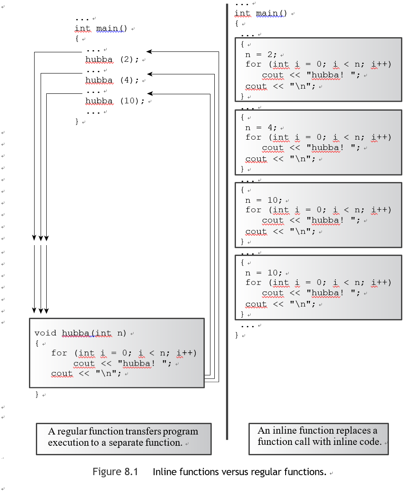

e.g.

```c++
inline double square(double x){return x*x;}

int main() {
    using std::cin,std::cout;
    double a,b;
    double c = 13.0;

    a = square(5.0);
    b = square(4.5+7.5);
    cout<<"a = "<<a<<",b="<<b<<"\n";
    cout<<"c = "<<c;
    cout<<", c squared = "<<square(c++)<<"\n";
    cout<<"Now c = "<<c<<"\n";
    return 0;
}
```

---

**内联与宏**

内联函数是C++的一个补充，C使用预处理器的#define语句来提供宏，这是内联代码的粗略实现。


`#define SQUARE(X) X*X`

这不是通过传递参数，而是通过文本替换，X作为 "参数 "的符号标签。

> a = SQUARE(5.0); is replaced by a = 5.0*5.0;
>
> b = SQUARE(4.5 + 7.5); is replaced by b = 4.5 + 7.5 * 4.5 + 7.5; 
>
> d = SQUARE(c++); is replaced by d = c++*c++;

 你可以通过括号来改善问题

`#define SQUARE(X) ((X)*(X))`

问题仍然存在，即宏不按值传递。即使有了这个新的定义，SQUARE(c++)也会使c递增两次，

建议，如果你一直使用C语言的宏来执行类似函数的服务，你应该考虑将它们转换为C++的内联函数。

---


#### 引用变量

C++在语言中增加了一个新的复合类型--引用变量。引用是一个作为先前定义的变量的别名或替代名称的名字。

**例如**，如果你把twain作为对clemens变量的引用，你可以交替使用twain和clemens来表示该变量。

引用变量的主要用途是作为一个函数的正式参数。如果你使用一个引用作为参数，函数就会使用原始数据而不是副本。引用为用函数处理大型结构提供了一个方便的替代指针的方法，而且它们对于设计类是至关重要的。


###### 创建一个引用变量

C++为&符号赋予了额外的含义，并将其用于声明引用。

```c++
    int rats;
    int &rodent = rats;
```

在这种情况下，&不是地址操作符。相反，它作为类型标识符的一部分,像声明中的char * 表示指向char的指针，int & 表示指向int的引用。

e.g.

```c++
int main() {
    using std::cin,std::cout;

    int rats=101;
    int &rodents = rats;
    cout << "rats = " << rats;
    cout << ", rodents = " << rodents <<'\n';
    rodents++;
    cout << "rats = " << rats;
    cout << ", rodents = " << rodents << '\n';
// some implementations require type casting the following
// addresses to type unsigned

    cout << "rats address = " << &rats;
    cout << ", rodents address = " << &rodents << '\n';

    return 0;
}
```


当你声明引用时，有必要对其进行初始化

```c++
int rat;
int & rodent;
rodent = rat;	// No, you can't do this.
```


当一个引用宣誓效忠于一个特定的变量时，它会坚持自己的承诺,引用rodents与表达式*pr的作用相同。

```c++
int & rodents = rats;
int * const pr = &rats;
```


e.g.

```c++
int main() {
    using std::cin,std::cout;

    using namespace std; int rats = 101;
    int & rodents = rats;  // rodents is a reference

    cout << "rats = " << rats;
    cout << ", rodents = " << rodents << endl;

    cout << "rats address = " << &rats;
    cout << ", rodents address = " << &rodents << endl;

    int bunnies = 50;
    rodents = bunnies; // can we change the reference? cout << "bunnies = " << bunnies;
    cout << ", rats = " << rats;
    cout << ", rodents = " << rodents << endl;

    cout << "bunnies address = " << &bunnies;
    cout << ", rodents address = " << &rodents << endl;

    return 0;
}
```

> 输出：
>
> rats = 101, rodents = 101
>
> rats address = 0x0065fd44, rodents address = 0x0065fd44 
>
> bunnies = 50, rats = 50, rodents = 50
>
> bunnies address = 0x0065fd48, rodents address = 0x0065fd4

因为rodents是rats的别名，这个赋值语句的真正含义与下面的相同，将bunnies变量的值赋给rat变量。

`rats = bunnies`


###### 作为函数参数的引用

引用被用作函数参数，使函数中的变量名成为调用程序中变量的别名，这种传递参数的方法被称为引用传递，通过引用传递允许被调用的函数访问调用函数中的变量。

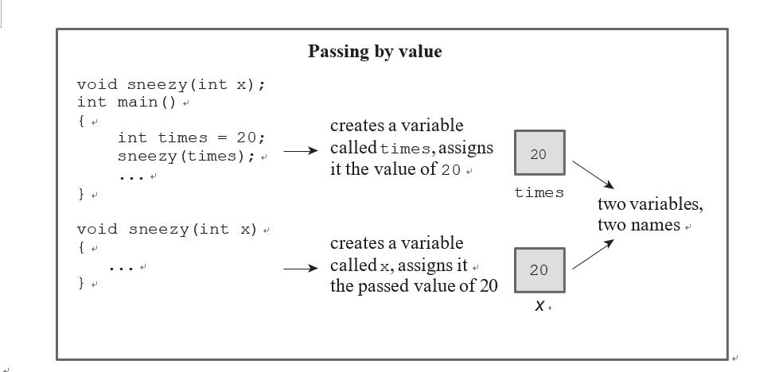

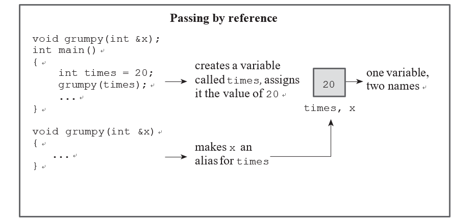

e.g.

```c++
void swapr(int &a,int &b);
void swapp(int *p,int *q);
void swapv(int a,int b);


int main() {
    using std::cin,std::cout;

    int wallet1 = 300; int wallet2 = 350;

    cout << "wallet1 = $" << wallet1;
    cout << " wallet2 = $" << wallet2 << '\n';

    cout << "Using references to swap contents:\n";
    swapr(wallet1, wallet2);   // pass variables
    cout << "wallet1 = $" << wallet1;
    cout << " wallet2 = $" << wallet2 << '\n';

    cout << "Using pointers to swap contents again:\n";
    swapp(&wallet1, &wallet2); // pass addresses of variables
    cout << "wallet1 = $" << wallet1;
    cout << " wallet2 = $" << wallet2 << '\n';

    cout << "Trying to use passing by value:\n";
    swapv(wallet1, wallet2);   // pass values of variables
    cout << "wallet1 = $" << wallet1;
    cout << " wallet2 = $" << wallet2 << '\n';

    clock_t start=clock();
    clock_t delay=6*CLOCKS_PER_SEC;
    while((clock()-start)<delay);
    return 0;
}
//下面的函数调用将形式参数a初始化为wallet1，形式参数b初始化为wallet2。
void swapr(int &a,int &b){
    int temp=a;
    a=b;
    b=temp;
}
void swapp(int *p,int *q){
    int temp=*p;
    *p=*q;
    *q = temp;
}
void swapv(int a,int b){
    int temp = a;
    a=b;
    b=temp;
}
```

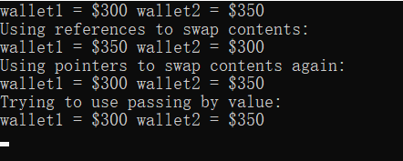


###### 引用属性的其他特性

e.g.

```c++
double cube(double a);
double refcube(double &ra);


int main() {
    using std::cin,std::cout;
    double x = 3.0;

    cout <<cube(x);
    cout<<" = cube of "<<x<<'\n';
    cout<<refcube(x);
    cout<<" = cube of "<<x<<'\n';


    clock_t start=clock();
    clock_t delay=6*CLOCKS_PER_SEC;
    while((clock()-start)<delay);
    return 0;
}

double cube(double a)
{
    a *= a * a; return a;
}

double refcube(double &ra)
{
    ra *= ra * ra; return ra;
}
```

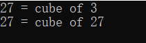

 参考参数对于较大的数据单位，如结构和类，变得非常有用,按值传递的函数，如cube()函数，可以使用许多种实际参数。

```c++
double z = cube(x + 2.0);	
// evaluate x + 2.0, pass value z = cube(8.0);	
// pass the value 8.0
int k = 10;
z = cube(k);	
// convert value of k to double, pass value double yo[3] = { 2.2, 3.3, 4.4};
z = cube (yo[2]);	
// pass the value 4.4
```

假设你为一个有引用参数的函数尝试类似的参数。看起来，传递一个引用应该是更有限制性的。毕竟，如果ra是一个变量的替代名称，那么实际参数应该是那个变量。像下面这种情况似乎没有意义，因为表达式x + 3.0不是一个变量。

```c++
double z = refcube(x + 3.0); // should not compile
```

在当代的C++中，这是一个错误，大多数编译器会这样告诉你,一些老的编译器会给你一个警告。在某些情况下，它仍然允许。发生的情况是，由于x + 3.0不是一个双变量类型，程序创建了一个临时的无名变量，将其初始化为表达式x + 3.0的值。


###### 临时变量、引用参数和const

如果实际参数与一个引用参数不匹配，C++可以生成一个临时变量。目前，只有当参数是一个const引用时，C++才允许这样做。只要引用参数是const，编译器在两种情况下会生成一个临时变量。

- 当实际参数是正确的类型，但不是一个左值时
- 当实际参数的类型不对，但它的类型可以被转化为正确的类型时

---

**左值**

一个属于左值的参数是一个可以通过地址引用的数据对象。例如，一个变量，一个数组元素，一个结构成员，一个引用，以及一个被解除引用的指针都是左值。常规变量为一个可修改的左值，而常量变量是一个不可修改的左值。

非左值：包括字面常量（除了引号字符串，它们用地址表示）和具有多个术语的表达式。

```c++

double refcube(const double &ra)
{
return ra * ra * ra;
}

double side = 3.0; 
double * pd = &side; 
double & rd = side; 
long edge = 5L;
double lens[4] = { 2.0, 5.0, 10.0, 12.0};
double c1 = refcube(side);	// ra is side 
double c2 = refcube(lens[2]);	// ra is lens[2] 
double c3 = refcube(rd);	// ra is rd is side
double c4 = refcube(*pd);	// ra is *pd is side
double c5 = refcube(edge);  // ra is temporary variable 
double c6 = refcube(7.0);  // ra is temporary variable 
double c7 = refcube(side + 10.0);  // ra is temporary variable

```

这些临时变量在函数调用期间持续存在，但随后编译器可以自由抛弃它们。

---


这种行为对常量引用来说是可以的，而其他则不行：

```c++
void swapr(int & a, int & b) // use references
{
int temp;
    temp = a;	// use a, b for values of variables
    a = b;
    b = temp;
}
long a = 3, b = 5; swapr(a, b);
```

**早期C++**:这里有一个类型不匹配，所以编译器会创建两个临时的int变量，将它们初始化为3和5，然后交换临时变量的内容，不改变a和b,违背非常量引用参数的初衷，解决办法是禁止在这些情况下创建临时变量，这就是**C++标准**现在所做的。

从本质上讲，一个具有const引用形式参数和不匹配的实际参数的C++函数模仿了传统的按值传递行为，保证了原始数据不被改变，并使用一个临时变量来保存值。


有三个强有力的理由可以将引用参数声明为对const数据的引用

- 使用const可以保护你免受不经意间改变数据的编程错误的影响
- 使用const允许一个函数同时处理const和非const的实际参数，而在原型中省略const的函数只能接受非const数据。
- 使用const引用允许函数生成并适当地使用一个临时变量


**C++11引入了第二种引用，称为右值引用**

使用&&来声明

```c++
double && rref = std::sqrt(36.00); // not allowed for double & 
double j = 15.0;
double && jref = 2.0* j + 18.5;	// not allowed for double & 
std::cout << rref << '\n';	// display 6.0
std::cout << jref << '\n';	// display 48.5;

```

引入右值引用主要是为了帮助库设计者为某些操作提供更有效的实现


###### 在结构中使用引用

```c++
struct free_throws{
    std::string name;
    int made;
    int attempts;
    float percent;
};

void display(const free_throws &ft);
void set_pc(free_throws &ft);
free_throws & accumulate(free_throws &target,const free_throws&source);

int main() {
    using std::cin,std::cout;
    // partial initializations – remaining members set to 0
    free_throws one = {"Ifelsa Branch", 13, 14};
    free_throws two = {"Andor Knott", 10, 16};
    free_throws three = {"Minnie Max", 7, 9};
    free_throws four = {"Whily Looper", 5, 9};
    free_throws five = {"Long Long", 6, 14};
    free_throws team = {"Throwgoods", 0, 0};

    free_throws dup;
    set_pc(one);
    display(one);

    accumulate(team, one);
    display(team);

    display(accumulate(team, two));
    accumulate(accumulate(team, three), four);
    display(team);
//把team中的值复制到dup中
    dup = accumulate(team,five);
    std::cout << "Displaying team:\n"; display(team);
    std::cout << "Displaying dup after assignment:\n"; display(dup);

    set_pc(four);
// ill-advised assignment
    //如果 accumulate() 按值返回，这段代码就不会被编译。
    accumulate(dup,five) = four;
    std::cout << "Displaying dup after ill-advised assignment:\n"; 
    display(dup);


    clock_t start = clock();
    clock_t delay = 6*CLOCKS_PER_SEC;
    while((clock()-start)<delay);
    return 0;
}

void display(const free_throws &ft){
    using std::cout;
    cout << "Name: " << ft.name << '\n';
    cout << " Made: " << ft.made << '\t';
    cout << "Attempts: " << ft.attempts << '\t';
    cout << "Percent: " << ft.percent << '\n';

}

void set_pc(free_throws &ft){
    if (ft.attempts != 0)
        ft.percent = 100.0f *float(ft.made)/float(ft.attempts);
    else
        ft.percent = 0;

}

free_throws & accumulate(free_throws &target,const free_throws&source){
    target.attempts += source.attempts;
    target.made += source.made;
    set_pc(target);
    return target;
}
```

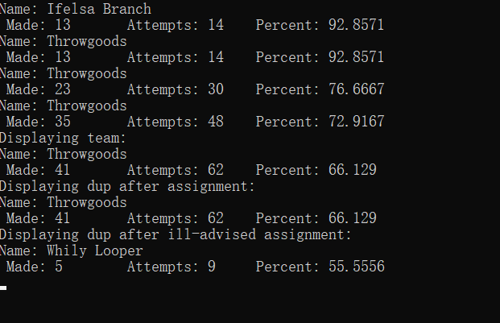

:warning:回顾一下，如果初始化数量少于成员的数量，剩下的成员（在本例中只是百分比成员）被设置为0。


```c++
dup = accumulate(team,five);
```

如果 accumulate() 返回一个结构，而不是一个结构的引用，这可能涉及到把整个结构复制到一个临时位置，然后再把这个副本复制到 dup。但在引用返回值的情况下，team 被直接复制到 dup，这是一个更有效的方法。

:warning:当返回一个引用时，要记住的最重要的一点是避免返回一个内存位置的引用，而这个内存位置在函数终止时就不存在了。你要避免的是类似这样的代码

- 返回一个作为参数传递给函数的引用
- 使用new来创建新的存储空间


**使用 const 与引用返回**

常规（非引用）返回类型是右值，即不能通过地址访问的值，右值的其他例子包括字面意义，如10.0，和表达式，如x + y。

假设你想使用一个引用的返回值，但又不想允许诸如给 accumulate() 赋值的行为，只要让返回类型成为一个常量引用就可以了。

```c++
const free_throws &
accumulate(free_throws & target, const free_throws & source);
```


###### 在类对象中使用引用

将类对象传递给函数的通常C++做法是使用引用，例如，你可以对以字符串、ostream、istream、ofstream和ifstream类的对象作为参数的函数使用引用参数。

```c++
using std::string;
string version1(const string & s1, const string & s2);
const string & version2(string & s1, const string & s2); // has side effect
const string & version3(string & s1, const string & s2); // bad design


int main() {
    using std::cin,std::cout;
    string input;
    string copy;
    string result;

    cout << "Enter a string: ";
    getline(cin, input);
    copy = input;
    cout << "Your string as entered: " << input << '\n';
    result = version1(input, "***");
    cout << "Your string enhanced: " << result <<'\n';
    cout << "Your original string: " << input << '\n';

    result = version2(input, "###");
    cout << "Your string enhanced: " << result << '\n';
    cout << "Your original string: " << input << '\n';

    cout << "Resetting original string.\n";
    input = copy;
    result = version3(input, "@@@");
    cout << "Your string enhanced: " << result << '\n';
    cout << "Your original string: " << input << '\n';


    clock_t start = clock();
    clock_t delay = 6*CLOCKS_PER_SEC;
    while((clock()-start)<delay);
    return 0;
}

string version1(const string & s1, const string & s2){
    string temp;
    temp = s2+s1+s2;
    return temp;

}
const string & version2(string & s1, const string & s2) {
    s1 = s2+s1+s2;
    return s1;
}

const string & version3(string & s1, const string & s2) {
    string temp;

    temp = s2 + s1 + s2;
// 返回本地变量的引用是不安全的
  return temp;

}//这个函数可以编译（有警告），但在试图执行该函数时，程序崩溃了。
```


---

**将 C 样式字符串参数传递给字符串对象引用参数**

`version1(input, "***");`

实际的参数（input和 "***"）分别是字符串和const char *类型

- 字符串类定义了char *-to-string的转换，这使得将字符串对象初始化为一个C风格的字符串成为可能
- const引用形式参数的一个属性,假设实际参数类型与引用参数类型不一致，但可以转换为引用类型。然后程序创建一个正确类型的临时变量，将其初始化为转换后的值，并传递给临时变量一个引用。

---


###### 对象、继承和引用

ofstream类型的对象可以使用ostream方法，允许文件输入/输出使用与控制台输入/输出相同的形式。使功能从一个类传递到另一个类的语言特性被称为继承。ostream被称为基类（因为ofstream类是基于它的），ofstream被称为派生类（因为它是从ostream派生的）。派生类继承基类的方法，这意味着ofstream对象可以使用基类的功能，如recision()和setf()格式化方法。


基类引用可以引用派生类对象，而不需要进行类型转换。你可以定义一个具有基类引用参数的函数，并且该函数可以用于基类对象，也可以用于派生对象。

例如，一个具有ostream &参数类型的函数可以接受一个ostream对象，如cout，或一个ofstream对象，如你可能声明的对象，同样可以。

e.g

```c++
#include <iostream>
#include <ctime>
#include <cstring>
#include <array>
#include <string>
#include <climits>
#include <cctype>
#include <fstream>
#include <cmath>
using namespace std;

void file_it(ostream &os,double fo,const double fe[],int n);
const int LIMIT=5;


int main() {
    using std::cin,std::cout;
    ofstream fout;
    const char* fn="ep-data.txt";
    fout.open(fn);
    if(!fout.is_open()){
        cout << "Can't open " << fn << ". Bye.\n";
        exit(EXIT_FAILURE);
    }
    double objective;
    cout << "Enter the focal length of your telescope objective in mm: ";
    cin>>objective;

    double eps[LIMIT];
    cout << "Enter the focal lengths, in mm, of " << LIMIT
         << " eyepieces:\n";
    for (int i = 0; i < LIMIT; i++)
    {
        cout << "Eyepiece #" << i + 1 << ": ";
        cin >> eps[i];
    }
    file_it(fout, objective, eps, LIMIT);
    file_it(cout, objective, eps, LIMIT);
    cout << "Done\n";


    clock_t start = clock();
    clock_t delay = 6*CLOCKS_PER_SEC;
    while((clock()-start)<delay);
    return 0;
}
void file_it(ostream &os,double fo,const double fe[],int n){
    //Bitmask type to represent stream format flags.
    ios_base::fmtflags initial;
    initial=os.setf(ios_base::fixed);
    os.precision(0);
    os << "Focal length of objective: " << fo << " mm\n";
    os.setf(ios::showpoint);
    os.precision(1);
    os.width(12);
    os << "f.l. eyepiece";
    os.width(15);
    os << "magnification\n" ;
    for (int i = 0; i < n; i++)
    {
        os.width(12);
        os << fe[i];
        os.width(15);
        os << int (fo/fe[i] + 0.5) << '\n';
    }
    os.setf(initial);
}
```

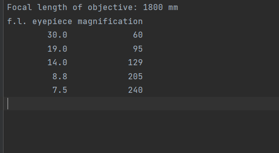

[^setf()]:设置各种格式化状态，返回一份在调用前有效的所有格式化设置的副本
[^setf(ios_base::fixed) ]:将一个对象置于使用固定小数点符号的模式
[^setf(ios_base:showpoint)]:将一个对象置于显示尾部小数点的模式中，即使后面的数字是0.
[^precision()]:指出了显示在小数点右边的数字数
[^ width()]:设置了下一个输出动作所使用的字段宽度,这个设置只适用于显示一个值，然后恢复到默认值。(默认的是字段宽度为0，然后被扩展到刚好适合实际显示的数量)。
[^ios_base::fmtflags]:存储这些信息所需类型的花名

:warning:每个对象都存储自己的格式化设置


###### 什么时候使用引用参数

- 允许你在调用函数中改变一个数据对象
- 通过传递一个引用而不是整个数据对象来加快程序的速度


**参数指南**

(不修改数据)

- 如果数据对象很小，比如一个内置的数据类型或一个小structure，就用值来传递它。
- 如果数据对象是一个数组，使用一个指针，因为这是你唯一的选择。让指针成为指向常量的指针。
- 如果数据对象是一个大小适中的结构，使用const指针或const引用来提高程序效率。你可以节省复制一个structure或一个类设计所需的时间和空间。使指针或引用成为常数。
- 如果数据对象是一个类对象，就使用常数引用。类设计的语义经常需要使用引用，这是C++添加这一特性的主要原因。因此，传递类对象参数的标准方式是引用。

（修改数据）

- 如果数据对象是一个内置的数据类型，就使用一个指针。
- 如果数据对象是一个数组，使用你唯一的选择：一个指针。
- 如果数据对象是一个结构，使用一个引用或一个指针。
- 如果数据对象是一个类对象，使用一个引用。


#### 默认参数

默认参数是指如果你在函数调用中省略了相应的实际参数，就会自动使用的一个值。

该方法是为原型中的参数赋值：

```c++
char * left(const char * str, int n = 1);
```

默认参数值是一个初始化值，前面的原型将 n 初始化为值 1。如果你不理会 n，它的值为 1，但如果你传递一个参数，新值将覆盖 1。当你使用带有参数列表的函数时，你必须从右到左添加默认值，也就是说，你不能为某个参数提供默认值，除非你也为其右边的所有参数提供默认值。


e.g. 只有原型表示默认参数，函数的定义与没有默认参数的情况下是一样的。

```c++
const int ArSize = 80;
char* left(const char* str,int n=1);

int main() {
    using std::cin,std::cout;
    char sample[ArSize];
    cout << "Enter a string:\n";
    cin>>sample;
    char* ps = left(sample,4);
    cout << ps << '\n';
    delete [] ps;  // free old string

   ps = left(sample);
    cout << ps << '\n';
    delete [] ps;  // free old string
    return 0;
}

char* left(const char* str,int n){
   if(n<0)
       n=0;
   char* p = new char[n+1];
   int i=0;
   for(;i<n&&str[i];i++){
       p[i]=str[i];
   }
   while(i<=n){
       p[i++]='\0';
   }
   return p;
}
```

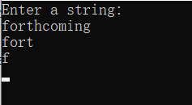

**代码优化**：时间换空间

```c++
int m = 0;
while (m <= n && str[m] != '\0') m++;
char * p = new char[m+1]:
```


#### 函数重载

函数多态性是C++对C语言能力的一个整洁的补充。默认参数让你通过使用不同数量的参数来调用同一个函数，而函数多态性，也叫函数重载，让你使用共享同一个名称的多个函数。多态这个词意味着有多种形式，所以函数多态让一个函数有多种形式。

你可以使用函数重载来设计一个函数系列，这些函数基本上做同样的事情，但使用不同的参数列表。函数重载的关键是一个函数的参数列表，也叫函数签名。如果两个函数以相同的顺序使用相同数量和类型的参数，它们就有相同的签名，变量名称并不重要。**C++允许你用相同的名字定义两个函数，只要这些函数有不同的签名**，签名可以在参数的数量或参数的类型上有所不同，或者两者都有。

```c++
oid print(const char * str, int width); // #1 
void print(double d, int width);	// #2
void print(long l, int width);	// #3
void print(int i, int width);	// #4
void print(const char *str);	// #5
```

当你使用print()函数时，编译器会将你的使用与具有相同签名的原型匹配。


当你使用重载函数时，你需要确保在函数调用中使用适当的参数类型。

```c++
unsigned int year = 3210;
print(year, 6);	// ambiguous call
```

没有匹配的原型并不能自动排除使用其中一个函数，因为C++会尝试使用标准的类型转换来强制匹配。如果说，唯一的print()原型是#2，那么函数调用print(year, 6)将把year值转换为double类型。但是在前面的代码中，有三个原型将数字作为第一个参数，提供了三种不同的转换year的选择。面对这种模棱两可的情况，C++将函数调用作为一个错误拒绝。


**一些看起来彼此不同的签名却不能共存**

```c++
double cube(double x); 
double cube(double & x);
cout << cube(x);
```

x参数同时符合double x原型和double &x原型，编译器没有办法知道要使用哪个函数。当它检查函数签名时，编译器认为对一个类型的引用和该类型本身是同一个签名。


**函数匹配过程确实区分了常量变量和非常量变量**

```c++
void dribble(char * bits);	// overloaded 
void dribble (const char *cbits);	// overloaded 
void dabble(char * bits);	// not overloaded 
void drivel(const char * bits);	// not overloaded
```

> const char p1[20] = "How's the weather?"; 
>
> char p2[20] = "How's business?"; 
>
> dribble(p1); // dribble(const char *); 
>
> dribble(p2); // dribble(char *); 
>
> dabble(p1);   // no match
>
> dabble(p2);   // dabble(char *); 
>
> drivel(p1); // drivel(const char *); 
>
> drivel(p2);  // drivel(const char *);

编译器根据实际参数是否为 const 选择一个或另一个函数原型


````
long gronk(int n, float m);	// same signatures, 
double gronk(int n, float m);	// hence not allowed
````

你可以有不同的返回类型，但前提是签名也不同。


###### 重载引用参数

```c++
void sink(double & r1);	// matches modifiable lvalue
void sank(const double & r2); // matches modifiable or const lvalue, rvalue 
void sunk(double && r3);	// matches rvalue
```

- 左值引用参数r1匹配一个可修改的左值参数，比如一个double
- const 左值引用参数r2匹配一个可修改的左值参数，一个const 左值参数，和一个右值参数，例如两个double的总和
- 右值引用r3匹配一个右值

*规则：进行更精确的匹配*


e.g.

```c++
const int ArSize = 80;
char* left(const char* str,int n=1);
unsigned long left(unsigned long num,unsigned n);


int main() {
    using std::cin,std::cout;
    char * trip = "Hawaii!!"; // test value
    unsigned long n = 12345678; // test value
    int i;
    char * temp;

    for (i = 1; i < 10; i++)
    {
        cout << left(n, i) << '\n';
        temp = left(trip,i);
        cout << temp << '\n';
        delete [] temp; // point to temporary storage
    }

    clock_t start = clock();
    clock_t delay = 6*CLOCKS_PER_SEC;
    while((clock()-start)<delay);
    return 0;
}

char* left(const char* str,int n){
   if(n<0)
       n=0;
   char* p = new char[n+1];
   int i=0;
   for(;i<n&&str[i];i++){
       p[i]=str[i];
   }
   p[i]='\0';
   return p;
}

unsigned long left(unsigned long num,unsigned n){
    int temp=num;
    unsigned digs=1;
    while((temp/=10)){
        digs++;
    }
    n=n>digs?digs:n;
    char* res=new char[n+1];
/*    res[n]='\0';*/
    while(digs-->n){
        num/=10;
    }
/*    while(n-->0){
        res[n]='0'+num%10;
        num/=10;
    }
```


**何时使用函数重载**

把函数重载保留给那些执行基本相同任务但数据形式不同的函数

---

**名称装饰**

C++如何跟踪哪个重载函数是哪个？它为这些函数中的每一个分配了一个秘密身份。当你使用C++开发工具的编辑器来编写和编译程序时，你的C++编译器代表你执行了一点技巧，即所谓的名称装饰，通过它，每个函数的名称都被加密了，基于函数原型中指定的形式参数类型。

```c++
long MyFunctionFoo(int, float);
```

为了自己的使用，编译器通过将名称转化为具有更难看的外观的内部表示来记录这个接口，也许像这样。

`MyFunctionFoo@@YAXH`编码参数的数量和类型。不同的函数签名会导致一组不同的符号被添加，不同的编译器会使用不同的约定来进行装饰。

---


#### 函数模板

一个函数模板是一个通用的函数描述；也就是说，它用一个通用的类型来定义一个函数，可以用一个特定的类型，如int或double，进行替换。通过将一个类型作为参数传递给模板，你使编译器为该特定类型生成一个函数。因为模板让你用通用类型而不是特定类型来编程，这个过程有时被称为通用编程。因为类型是由参数表示的，所以模板功能有时被称为参数化类型。

```c++
template <typename AnyType>
void Swap(AnyType &a, AnyType &b)
{
AnyType temp; temp = a;
a = b;
b = temp;
}
```

第一行指定你正在设置一个模板，并且你正在命名这个任意类型AnyType，除了可以用关键字class代替tyename外，关键字template和tyename是必须的。你还必须使用角括号。模板没有创建任何函数。相反，它为编译器提供了关于如何定义一个函数的指导。如果你想用一个函数来交换 int，那么编译器就会按照模板模式创建一个函数，用int代替AnyType。

:warning:类型名称（AnyType，在这个例子中）是你的选择，只要你遵循通常的C++命名规则；许多程序员使用简单的名称，如T

---

**Note**

在C++98标准将关键字tyename添加到语言中之前，C++在这个特定的环境中使用关键字class。在这种情况下，C++标准对这两个关键字的处理是相同的。

```c++
template <class AnyType>
void Swap(AnyType &a, AnyType &b)
{
AnyType temp; temp = a;
a = b;
b = temp;
}
```

---


为了让编译器知道你需要一个特定形式的交换函数，你只需在程序中使用一个叫做Swap()的函数。编译器会检查你使用的参数类型，然后生成相应的函数。

e.g.

```c++
template <typename T>
void Swap(T &a,T &b);
int main() {
    using std::cin,std::cout;
    int i = 10; int j = 20;
    cout << "i, j = " << i << ", " << j << ".\n";
    cout << "Using compiler-generated int swapper:\n";
    Swap(i,j); // generates void Swap(int &, int &)
    cout << "Now i, j = " << i << ", " << j << ".\n";

    double x = 24.5; double y = 81.7;
    cout << "x, y = " << x << ", " << y << ".\n";
    cout << "Using compiler-generated double swapper:\n";
    Swap(x,y); // generates void Swap(double &, double &)
    cout << "Now x, y = " << x << ", " << y << ".\n";


    clock_t start = clock();
    clock_t delay = 6*CLOCKS_PER_SEC;
    while((clock()-start)<delay);
    return 0;
}

template <typename T>
void Swap(T &a,T &b){
    T temp=a;
    a=b;
    b=temp;
}
```

:warning:函数模板不会使可执行程序变短。 您仍然得到两个单独的函数定义，就像您手动定义每个函数一样。 最终代码不包含任何模板，它只包含为程序生成的实际函数，模板的好处是它们使生成多个函数定义更简单、更可靠。


###### 重载模板

可能不是所有的类型都会使用相同的算法。为了处理这种可能性，你可以重载模板定义，就像你重载普通函数定义一样。

```c++
template <typename T>
void Swap(T &a,T &b);
template <typename T>
void Swap(T [],T[],int);
void Show(int a[]);
const int Lim = 8;
int main() {
    using std::cin,std::cout;
    int i = 10, j = 20;
    cout << "i, j = " << i << ", " << j << ".\n";
    cout << "Using compiler-generated int swapper:\n"; Swap(i,j);  // matches original template
    cout << "Now i, j = " << i << ", " << j << ".\n";

    int d1[Lim] = {0,7,0,4,1,7,7,6};
    int d2[Lim] = {0,7,2,0,1,9,6,9};
    cout << "Original arrays:\n"; Show(d1);
    Show(d2);
    Swap(d1,d2,Lim);   // matches new template
    cout << "Swapped arrays:\n";
    Show(d1);
    Show(d2);
    return 0;
}

template <typename T>
void Swap(T &a,T &b){
    T temp=a;
    a=b;
    b=temp;
}
template <typename T>
void Swap(T a[],T b[],int num){
    if(num>0){
        T temp;
        while(num-->0){
            temp=a[num];
            a[num]=b[num];
            b[num]=temp;
        }
    }
}
```

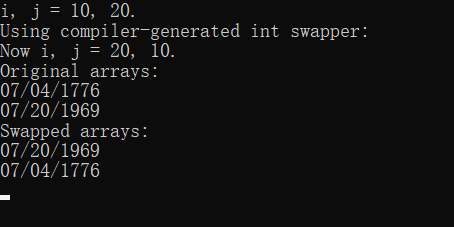

:warning: 不是所有的模板参数都必须是模板参数类型。


###### 模板的局限性

假设你有一个模板函数

```c++
template <class T>	// or template <typename T> void f(T a, T b)
{...}
```

通常情况下，代码会对该类型可能进行的操作做出假设。例如，下面的语句假设赋值被定义，如果类型T是一个内置的数组类型，这就不是真的了。

`a = b;`

下面的假设是>被定义了，如果T是一个普通的structure，这就不是真的。

`if (a > b)`

:warning:同样，>运算符也是为数组名定义的，但由于数组名是地址，它比较的是数组的地址，这可能不是你所想的。


简而言之，写一个不能处理某些类型的模板函数是很容易的，有时泛化是有意义的，即使普通的C++语法不允许这样做。

**例如**，添加包含位置坐标的结构可能是有意义的，尽管+运算符并没有为结构定义。

- 一个需要使用+运算符的模板可以处理一个有重载+运算符的结构
- 为特定类型提供专门的模板定义

```c++
struct job
{
char name[40]; 
double salary; 
int floor;
};

```

你可以提供一个专门的函数定义，称为显式专门化，与所需的代码一起，如果编译器找到一个与函数调用完全匹配的专用定义，它就会使用该定义，而无需寻找模板。


**第三代Specialization （ISO/ANSI C++标准）**

C++98标准确定了这种方法：

- 对于一个给定的函数名称，你可以有一个非模板函数、一个模板函数和一个明确的特殊化模板函数，以及所有这些的重载版本
- 显式特殊化的原型和定义应该在前面加上 template <>，并且应该提到专用类型的名称
- 特殊化重载常规模板，而非模板函数则重载两者。

```c++
// non template function prototype 
void Swap(job &, job &);

// template prototype 
template <typename T> 
void Swap(T &, T &);

// explicit specialization for the job type 
template <> 
void Swap<job>(job &, job &);


```

Swap<job>中的<job>是可选的，因为函数参数类型表明这是对job的一种特殊化

因此，原型也可以这样写:

```c++
template <> void Swap(job &, job &);	// simpler form
```

e.g.

```c++
template <typename T>
void Swap(T &a,T &b);

struct job
{
    char name[40];
    double salary;
    int floor;
};
template <>
void Swap<job>(job &,job &);


const int Lim = 8;
void Show(job &j);

int main() {
    using std::cin,std::cout,std::ios;
    cout.precision(2);
    cout.setf(ios::fixed, ios::floatfield);
    int i = 10, j = 20;
    cout << "i, j = " << i << ", " << j << ".\n";
    cout << "Using compiler-generated int swapper:\n";
    Swap(i,j); // generates void Swap(int &, int &)
    cout << "Now i, j = " << i << ", " << j << ".\n";

    job sue = {"Susan Yaffee", 73000.60, 7};
    job sidney = {"Sidney Taffee", 78060.72, 9};
    cout << "Before job swapping:\n";
    Show(sue);
    Show(sidney);
    Swap(sue, sidney); // uses void Swap(job &, job &)
    cout << "After job swapping:\n";
    Show(sue);
    Show(sidney);
// cin.get();
    return 0;
}

template <typename T>
void Swap(T &a,T &b){
    T temp=a;
    a=b;
    b=temp;
}


template <>
void Swap<job>(job &j1,job &j2){
    double t1;
    int t2;
    t1 = j1.salary;
    j1.salary = j2.salary;
    j2.salary = t1;

    t2 = j1.floor;
    j1.floor = j2.floor;
    j2.floor = t2;


}

void Show(job &j){
    using namespace std;
    cout << j.name << ": $" << j.salary
         << " on floor " << j.floor << endl;
}
```

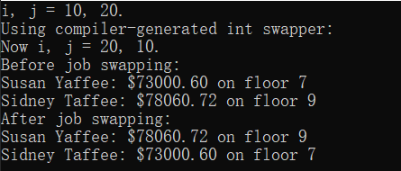

| flag value  | equivalent to             |
| :---------- | :------------------------ |
| adjustfield | left \| right \| internal |
| basefield   | dec \| oct \| hex         |
| floatfield  | scientific \| fixed       |


###### 实例化和特殊化

记住，在你的代码中包括一个函数模板本身并不产生一个函数定义，它只是一个生成函数定义的计划，但具体的实例化是一个函数定义。

**实例化**：当编译器使用模板为一个特定的类型生成一个函数定义时，其结果被称为模板的实例化。

这种类型的实例化被称为*隐式实例化*，因为编译器通过注意到程序使用了一个带int参数的Swap()函数而推断出制作该定义的必要性。

最初，使用隐式实例化是编译器从模板中生成函数定义的唯一方法，但现在C++允许显式实例化。这意味着你可以指示编译器直接创建一个特定的实例。使用 <>符号来表示类型，并在声明前加上关键字template。

```c++
template void Swap<int>(int&, int&);//显示实例化
```

实现了这个特性的编译器在看到这个声明时，会使用Swap()模板来生成一个实例，使用int类型。


**明确的实例化也可以通过在程序中使用该函数来创建**

```c++
template <class T>
T Add(T a, T b)	// pass by value
{
return a + b;
}
...
cout << Add<double>(x, m) << endl; // explicit instantiation
```

模板将无法匹配函数调用Add(x, m)，因为模板期望两个函数参数都是同一类型。但是使用Add<double>(x, m)强制进行double类型的实例化，并且参数m被类型转换为double类型，以匹配Add<double>(double, double)函数的第二个参数。


**如果你用Swap()做类似的事情**

```c++
int m = 5;
double x = 14.3;
Swap<double>(m, x); // almost works
```

这将产生一个显式的double类型的实例化。不幸的是，在这种情况下，代码不会工作，因为第一个形式参数，即double &类型，不能指代int类型的变量m。


```c++
template <> void Swap<int>(int &, int &); // explicit specialization 
template <> void Swap(int &, int &);	// explicit specialization
```

将显式实例化与显式特殊化进行对比，不同的是，这最后两个声明意味着 "不要使用Swap()模板来生成一个函数定义，相反，使用一个单独的、为int类型明确定义的专门的函数定义。"这些原型必须与它们自己的函数定义结合起来。明确的专门化声明在关键字template后面有<>，而明确的实例化则省略了<>。

:warning:在同一个文件中，或者更广泛地说，在同一个翻译元件中，对同一个类型同时使用显式实例化和显式特殊化，是一个错误。


**隐式实例化、显式实例化和显式特殊化统称为特殊化。它们的共同点是，它们代表了一个使用特定类型的函数定义，而不是一个通用描述。**

e.g. 总结

```c++
template <class T>
void Swap (T &, T &); // template prototype

template <> void Swap<job>(job &, job &);	// explicit specialization for job 

int main(void)
{
template void Swap<char>(char &, char &); // explicit instantiation for char 
    short a, b;
...
Swap(a,b);	// implicit template instantiation for short 
    job n, m;
...
Swap(n, m);	// use explicit specialization for job 
    char g, h;
...
Swap(g, h); // use explicit template instantiation for char
...
}

```

---

**编译器会选择哪个函数版本**

- 阶段1：组织一个候选函数列表，这些函数和模板函数的名称与被调用函数相同。
- 阶段2：从候选函数中，汇集一个可行的函数列表。这些函数具有正确的参数数量，并且有一个隐含的转换序列，其中包括每个实际参数类型与相应的形式参数类型完全匹配的情况。
- 第3阶段：确定是否有一个最佳可行的函数，如果存在，就使用那个函数。否则，该函数调用是一个错误。


e.g.

```c++
may('B');	// actual argument is type char
```

编译器**对适合的函数和函数模板进行归类**，即名称为 may()的函数，然后找出那些可以用一个参数调用的函数。

```c++
void may(int);	// #1
float may(float, float = 3);	// #2
void may(char);	// #3
char * may(const char *);	// #4
char may(const char &);	// #5 
template<class T> void may(const T &); // #6 
template<class T> void may(T *);   // #7
```

:warning:我们只考虑了签名，而没有考虑返回类型

:thought_balloon:（#4和#7）是不可行的，因为整型不能隐式转换为指针类型。

*这就留下了五个可行的函数，如果它是唯一被声明的函数，每个都可以被使用*


编译器**确定哪个可行的函数是最好的**

它看的是使函数调用参数与可行的候选人的参数相匹配所需的转换，一般来说，从最佳到最差的排名是这样的。

- 完全匹配，正则函数优于模板
- 提升转换（例如，char和short自动转换为int，float自动转换为double）
- 通过标准转换进行转换（例如，将int转换为char\long转换为double)
- 用户定义的转换，例如在类声明中定义的转换

> 5,3>6>1>2

:warning:通常情况下，就像这个例子一样，两个完全匹配是一个错误,但有几个特殊情况是这个规则的例外。


###### 完全匹配和最佳匹配

在进行精确匹配时，C++允许一些 "微不足道的转换"


从实际参数到正式参数的精确匹配所允许的微小转换 

|         实参         |          形参           |
| :------------------: | :---------------------: |
|         Type         |         Type &          |
|        Type &        |          Type           |
|       Type []        |         * Type          |
| Type (argument-list) | Type (*)(argument-list) |
|         Type         |       const Type        |
|         Type         |      volatile Type      |
|        Type *        |      const Type *       |
|        Type *        |     volatile Type *     |

Type (argument-list)条目意味着作为实际参数的函数名与作为形式参数的函数指针相匹配，只要两者具有相同的返回类型和参数列表。


正如你所期望的，有几个匹配的原型的结果是编译器不能完成重载解析过程。没有最好的可行的函数，编译器会产生一个错误信息，然而，有时即使两个函数是完全匹配的，也可以进行重载解析。

- 非常量数据的指针和引用优先与非常量指针和引用参数相匹配（然而，这种对const和non-const的区分只适用于由指针和引用数据）
- 当一个函数是一个非模板函数而另一个不是时。在这种情况下，非模板被认为比模板更好，包括明确的特殊化。
- 如果你有两个完全匹配的函数都是模板函数，那么更专业的模板函数，如果有的话，就是更好的函数。这意味着，例如，显式特殊化被选择，而不是从模板模式隐式生成的。

​                 

最专门化这个词不一定意味着明确的专门，更一般地说，它表示当编译器推断出要使用什么类型时，发生的转换较少，寻找最专业的模板的规则被称为函数模板的部分排序规则，和显式实例化一样，它们是C++98对C++语言的补充。

e.g.

```c++
template <typename T>
void ShowArray(T arr[],int n);
template <typename T>//<class T> is backward compatible
void ShowArray(T* arr[],int n);

struct debts{
    char name[50];
    double amount;
};

int main() {
    using std::cin,std::cout,std::ios;
    int things[6] = {13, 31, 103, 301, 310, 130};
    debts mr_E[3]={
            {"Ima Wolfe", 2400.0},
            {"Ura Foxe", 1300.0},
            {"Iby Stout", 1800.0}

    };

    double* pd[3];
    for (int i = 0; i < 3; i++)
        pd[i] = &mr_E[i].amount;

    cout << "Listing Mr. E's counts of things:\n";
    ShowArray(things,6);
    cout << "Listing Mr. E's debts:\n";
    ShowArray(pd,3);


    clock_t start = clock();
    clock_t delay = 6*CLOCKS_PER_SEC;
    while((clock()-start)<delay);
    return 0;
}
template <typename T>
void ShowArray(T arr[],int n){
    using namespace std;
    cout << "template A\n";
    for (int i = 0; i < n; i++)
        cout << arr[i] << ' ';
    cout << '\n';

}
template <typename T>//<class T> is backward compatible
void ShowArray(T* arr[],int n){
    using namespace std;
    cout << "template B\n";
    for (int i = 0; i < n; i++)
        cout << *arr[i] << ' ';
    cout << '\n';

}
```

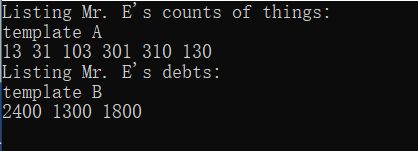            

​          

**总结**

重载解析过程会寻找一个最匹配的函数。如果只有一个，则选择该函数。如果一个以上的函数在其他情况下并列，但只有一个是非模板函数，则选择该非模板函数。如果有一个以上的函数是相同的，并且都是模板函数，但是有一个模板比其他的更专业，那么就选择这个模板。如果有两个或更多同样好的非模板函数，或者有两个或更多同样好的模板函数，但其中没有一个比其他的更专业，那么这个函数的调用是模糊的，是一个错误。当然，如果没有匹配的调用，那也是一个错误。


###### 做出你自己的选择

在某些情况下，你可以通过适当地编写函数调用来引导编译器做出你想要的选择。


e.g.与普通函数一样，如果模板函数定义出现在函数被使用之前，它可以作为自己的原型

```c++
template <typename T>
T lesser(T a,T b){
    return a<b?a:b;
}

int lesser(int a,int b){
    a=a<0?-a:a;
    b=b<0?-b:b;
    return a<b?a:b;
}


int main() {
    using std::cin,std::cout,std::ios;
    int m = 20;
    int n = -30;
    double x = 15.5;
    double y = 25.9;

    cout << lesser(m, n) << '\n';  // use #2
    cout << lesser(x, y) << '\n';  // use #1 with double
    cout << lesser<>(m, n) << '\n';    // use #1 with int
    cout << lesser<int>(x, y) << '\n'; // use #1 with int

    return 0;
}
```

:warning:

- 最后的函数调用将 double 转换为 int，一些编译器会对此发出警告
- 如果一个函数定义出现在它的第一次使用之前，那么这个定义就充当了一个原型，所以这个例子省略了原型。

```c++
cout << lesser<>(m, n) << endl;	// use #1 with int
```

lesser<>(m, n)中角括号的存在表明编译器应该选择一个模板函数而不是一个非模板函数，编译器注意到实际的参数是int类型，就用int来实例化T这个模板。


```c++
cout << lesser<int>(x, y) << endl; // use #1 with int
```

这里我们有一个请求，要求用int来表示T的显式实例化，这就是被使用的函数。x和y的值被类型转换为int类型，该函数返回一个int值，这就是为什么程序显示15而不是15.5。


###### 具有多个类型参数的函数

真正涉及到问题的地方是，当一个有多个参数的函数调用被匹配到有多个类型参数的原型时，编译器必须查看所有参数的匹配。如果它能找到一个比其他所有可行的函数更好的函数，它就被选中。一个函数要比另一个函数好，它必须为所有参数提供至少同样好的匹配，并且至少为一个参数提供更好的匹配。


###### 模板函数的演变

**那是什么类型？**

一个问题是，当你写一个模板函数时，在C++98中并不总是能够知道在声明中使用什么类型。

```c++
template<class T1, class T2> void ft(T1 x, T2 y)
{
...
?type? xpy = x + y;
...
}

```

xpy的类型应该是什么？我们事先不知道ft()会被如何使用。

正确的类型可能是T1或T2或其他类型。

例如，T1可能是double，T2可能是int，在这种情况下，和的类型是double。或者T1可能是短，T2可能是int，在这种情况下，和的类型是int。或者假设T1是short，T2是char.那么加法就会调用自动整数晋升，结果类型是int。另外，+运算符可以为结构和类重载，使选项进一步复杂化。**因此，在C++98中，对于xpy的类型没有明显的选择。**


**decltype关键字（C++11）**

```c++
int x;
decltype(x) y;	// make y the same type as x
```

decltype的参数可以是一个表达式，所以在ft()的例子中，我们可以使用这样的代码。
```c++
decltype(x + y) xpy; // make xpy the same type as x + y xpy = x + y;
```


decltype工具比从这些例子中看到的要复杂一些。编译器必须通过一个检查表来决定类型。

```c++
decltype(expression) var;
```

- 如果 expression 是未加括号的标识符（即没有额外的括号），则 var 与标识符属于同一类型，包括 const 等限定符

````c++
double x = 5.5; double y = 7.9; double &rx = x; const double * pd;
decltype(x) w;	// w is type double 
decltype(rx) u = y; // u is type double & 
decltype(pd) v;	// v is type const double *
````

- 如果 expression 是函数调用，则 var 具有函数返回类型的类型

```c++
long indeed(int);
decltype (indeed(3)) m; // m is type int
```

- 如果 expression 是左值，则 var 是对表达式类型的引用,表达式不能是未加括号的标识符。 那它会是什么呢？ 一个明显的可能性是带括号的标识符

```c++
double xx = 4.4;
decltype ((xx)) r2 = xx; // r2 is double &
decltype(xx) w = xx;	// w is double (Stage 1 match)
```

- 如果上述特殊情况均不适用，则 var 与 expression 属于同一类型

```c++
int j = 3; 
int &k = j; 
int &n = j;
decltype(j+6) i1;	// i1 type int 
decltype(100L) i2; // i2 type long 
decltype(k+n) i3;	// i3 type int;

```

:warning:请注意，虽然 k 和 n 是引用，但表达式 k+n 不是引用,它只是两个int的总和，因此是一个int。


###### 可选函数语法（C++11 尾随返回类型）

decltype 机制本身留下了另一个未解决的相关问题，考虑这个不完整的模板函数：

```c++
template<class T1, class T2>
?type? gt(T1 x, T2 y)
{
...
return x + y;
}
```

同样，我们事先并不知道将 x 和 y 相加后的结果是什么类型，看起来我们可以使用 decltype(x + y) 作为返回类型。 不幸的是，此时在代码中，参数 x 和 y 尚未声明，因此它们不在范围内（对编译器可见和可用）。

decltype 说明符必须在参数声明之后出现。为了实现这一点，C++11 允许使用新的语法来声明和定义函数。 这是使用内置类型的工作原理。

原型 `double h(int x, float y);`可以用这种替代语法编写：`auto h(int x, float y) -> double;`这会将返回类型移动到参数声明之后，组合 -> double 称为尾随返回类型。在这里，auto是尾随返回类型提供的类型的占位符。


相同的形式将用于函数定义

```c++
auto h(int x, float y) -> double
{/* function body */};
```


将此语法与 decltype 结合使用可得出以下解决方案，用于指定 gt() 的返回类型：

```c++
template<class T1, class T2>
auto gt(T1 x, T2 y) -> decltype(x + y)
{
...
return x + y;
}
```

现在 decltype 出现在参数声明之后，因此 x 和 y 在范围内并且可以使用。


