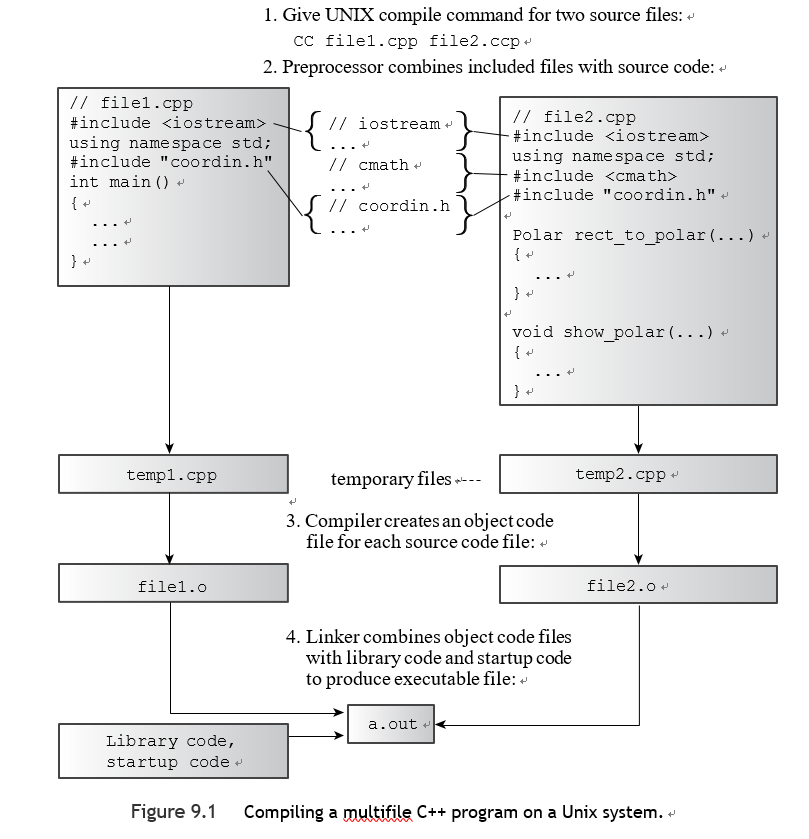
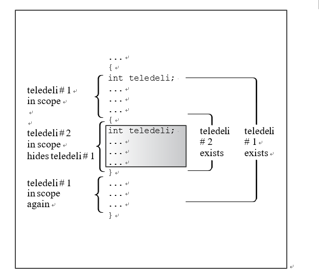
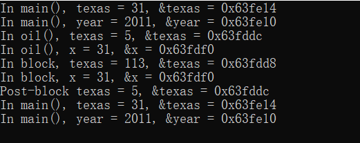
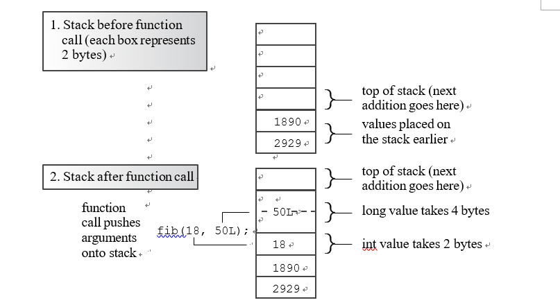
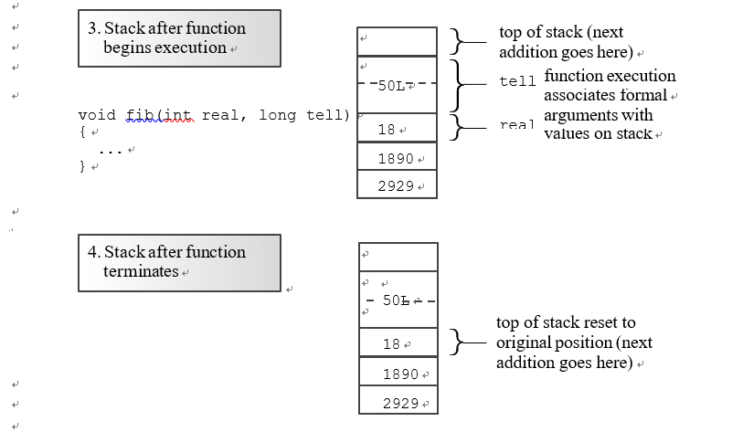
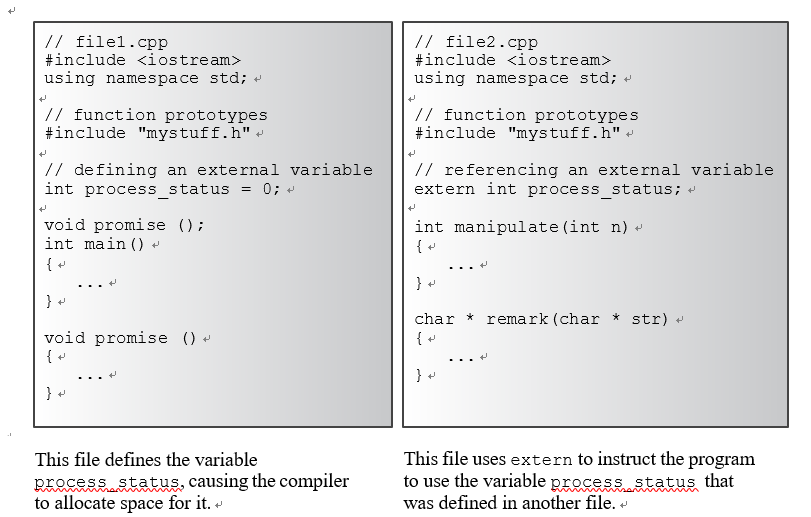
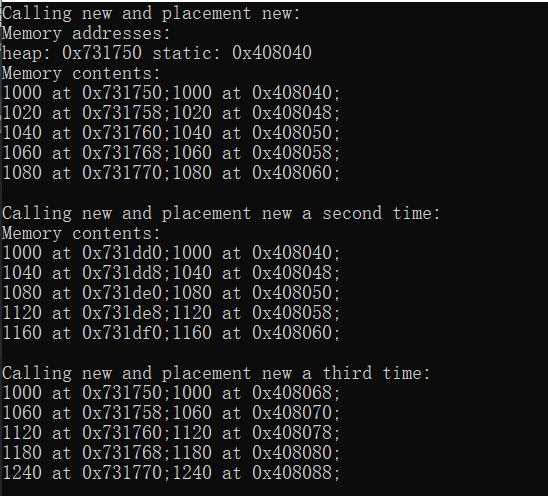
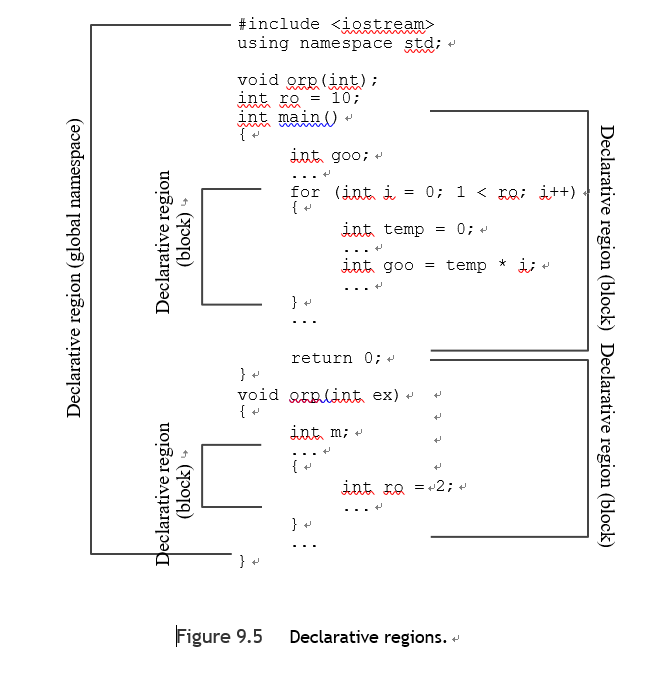
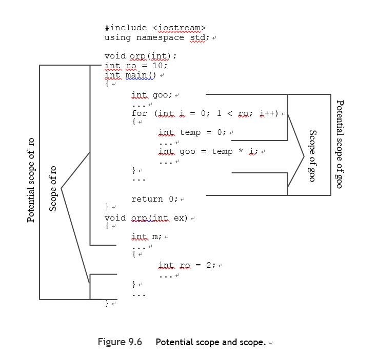
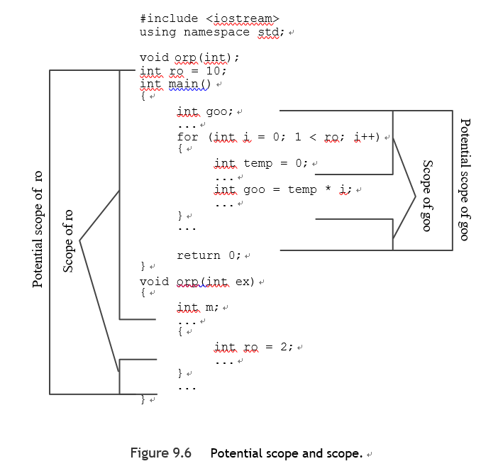

# 第九章

[TOC]

#### 单独编译

像C语言一样，C++允许甚至鼓励你将一个程序的组成功能放在不同的文件中。如果你只修改了一个文件，你可以只重新编译这一个文件，然后把它和其他文件的先前编译版本连接起来。这个设施使管理大型程序更加容易。


e.g. 你决定将listing 7.12(矩形坐标转换为极坐标，然后显示结果)中的程序拆开，将两个支持性函数放在一个单独的文件中。

1.main()和其他两个函数使用相同的结构声明，所以你需要把声明放在两个文件中[**Error**]

2.与其将结构声明放在每个文件中，你可以将它们放在头文件中，然后在每个源代码文件中包含该头文件。


因此，你可以将原始程序分为三个部分

- 一个头文件，包含结构声明和使用这些结构的函数的原型
- 一个包含结构相关函数代码的源代码文件
- 一个包含调用结构相关函数的代码的源代码文件。


最好不**要将函数定义或变量声明放入头文件**中。这可能适用于简单的设置，但通常会导致麻烦。将结构声明放在头文件中是可以的，因为它们不会创建变量； 当您在源代码文件中声明一个结构变量时，它们只是告诉编译器如何创建一个结构变量。 同样，模板声明不是要编译的代码； 它们是对编译器的说明，说明如何生成函数定义以匹配源代码中的函数调用。

例如，如果您在头文件中有一个函数定义，然后将头文件包含在作为单个程序一部分的另外两个文件中，那么您最终会在一个程序中得到同一函数的两个定义，即 错误，除非该函数是内联的。


头文件中常见的一些内容：

■ 函数原型
■ 使用#define 或const 定义的符号常量
■ 结构声明
■ 类声明
■ 模板声明
■ 内联函数

coordin.h

```c++
#ifndef LEARNING_COORDIN_H//只有当 LEARNING_COORDIN_H这个名字没有被预处理器的#define指令定义过时，才会处理#ifndef和#endif之间的语句
#define LEARNING_COORDIN_H
struct polar{
    double distance;
    double angle;
};

struct rect{
    double x;
    double y;
};

polar rect_to_polar(rect xypos);
void show_polar(polar dappos);

#endif //LEARNING_COORDIN_H
```


###### 多个文件编译



1、编译指令

2、预处理

3、生成目标文件

4、链接生成可执行文件

---

**头文件管理**

- 在一个文件中只包含一次头文件

  `#ifndef（for if not defined）指令`

- 使用#define语句来创建符号常量

  ```c++
  #define MAXIMUM 4096
  ```

  

  ---

main.cpp

```c++
#include "coordin.h"
int main() {
    using std::cin,std::cout,std::ios;
    rect rplace;
    polar pplace;

    cout << "Enter the x and y values: ";
    while (cin >> rplace.x >> rplace.y) // slick use of cin
    {
        pplace = rect_to_polar(rplace);
        show_polar(pplace);
        cout << "Next two numbers (q to quit): ";
    }
    cout << "Bye!\n";

    clock_t start = clock();
    clock_t delay = 6*CLOCKS_PER_SEC;
    while((clock()-start)<delay);
    return 0;
}
```


coordin.cpp

```c++
//
// Created by student on 2023/3/23.
//
#include "coordin.h"
#include <cmath>
#include <iostream>
polar rect_to_polar(rect xypos){
    using namespace std; polar answer;
    answer.distance =
            sqrt( xypos.x * xypos.x + xypos.y * xypos.y); answer.angle = atan2(xypos.y, xypos.x);
    return answer; // returns a polar structure


}
void show_polar(polar dapos){
    using namespace std;
    const double Rad_to_deg = 57.29577951;

    cout << "distance = " << dapos.distance;
    cout << ", angle = " << dapos.angle * Rad_to_deg; cout << " degrees\n";


}
```


###### 多库链接

C++标准允许每个编译器设计者按其认为合适的方式实现名称装饰或混用，用不同的编译器创建的二进制模块（目标代码文件），很可能无法正常链接。两个编译器将为同一个函数生成不同的装饰名称。这种名称的差异将阻止链接器将一个编译器生成的函数调用与第二个编译器生成的函数定义相匹配。当试图链接已编译的模块时，你应该确保每个对象文件或库是用同一个编译器生成的。如果你得到了源代码，你通常可以通过用你的编译器重新编译源代码来解决链接错误。


#### 存储期限、范围和链接

> **第四章回顾**
>
> - **自动存储期限**[在函数定义中声明的变量]
>
> 它们在程序执行进入定义它们的函数或块时被创建，当执行离开该函数或块时，用于它们的内存被释放，C++有两种自动存储期限的变量。
>
> - **静态存储期限**[在函数定义之外或通过使用关键字static定义的变量]
>
> 它们在程序运行的整个过程中一直存在，C++有三种静态存储期限的变量。
>
> - **线程存储期限**(C++11)[thread_local关键字声明的变量]
>
> 只要包含的线程持续存在就会持续存在
>
> - **动态存储时间**[由new操作符分配的内存]
>
> 内存一直存在，直到它被删除操作符释放或程序结束，以先到者为准。这种内存具有动态存储时间，有时被称为自由存储或堆。


###### 范围和链接

范围描述了一个名字在一个文件（翻译单元）中的可见度。

e.g. 在一个函数中定义的变量可以在该函数中使用，但不能在另一个函数中使用，而在函数定义之上的文件中定义的变量可以在所有函数中使用。

链接描述了一个名字如何在不同的翻译单位中共享。

e.g. 一个具有外部联系的名字可以在不同的文件中共享，一个具有内部联系的名字可以在一个文件中由函数共享。自动变量的名称没有联系，因为它们没有被共享。


一个C++变量可以有几个作用域

- 局部作用域（也称为块作用域）:只能在定义它的块中被知道
- 局作用域（也称为文件作用域）:在定义它的地方之后，整个文件都知道。


>自动变量有局部作用域，而静态变量可以有两种作用域，这取决于它的定义方式。
>
>在函数原型范围内使用的名字只是在包围参数列表的圆括号内知道。
>
>在类中声明的成员有类的作用域。
>
>在命名空间中声明的变量具有命名空间范围（全局范围已经成为命名空间范围的一个特殊情况）
>
>C++函数可以有类范围或命名空间范围，包括全局范围，但它们不能有局部范围。(因为一个函数不能被定义在一个块内，如果一个函数有局部作用域，它只能被自己知道，因此不能被其他函数调用。这样的函数就不能发挥作用了）。


**自动存储时间**

函数参数和在函数中声明的变量，默认情况下具有自动存储期限。它们也有局部范围，没有链接。

>  如果你在main()中声明了一个名为texas的变量，并在一个名为oil()的函数中声明了另一个同名的变量，你就创建了两个独立的变量，每个变量只在定义它的函数中知道。

:warning:注意，变量是在执行进入程序块时分配的，但范围只在声明点之后开始。

```c++
int main()
{
int teledeli = 5;
{	// websight allocated
cout << "Hello\n";
int websight = -2;	// websight scope begins cout << websight << ' ' << teledeli << endl;
}	// websight expires
cout << teledeli << endl;
...
} // teledeli expires

```



```c++
void oil(int x);
int main() {
    using std::cin,std::cout,std::ios,std::endl;
    int texas = 31; int year = 2011;
    cout << "In main(), texas = " << texas << ", &texas = "; cout << &texas << endl;
    cout << "In main(), year = " << year << ", &year = "; cout << &year << endl;
    oil(texas);
    cout << "In main(), texas = " << texas << ", &texas = "; cout << &texas << endl;
    cout << "In main(), year = " << year << ", &year = "; cout << &year << endl;

    clock_t start = clock();
    clock_t delay = 6*CLOCKS_PER_SEC;
    while((clock()-start)<delay);
    return 0;
}

void oil(int x)
{
    using namespace std; int texas = 5;

    cout << "In oil(), texas = " << texas << ", &texas = "; cout << &texas << endl;
    cout << "In oil(), x = " << x << ", &x = "; cout << &x << endl;
    {	// start a block
        int texas = 113;
        cout << "In block, texas = " << texas;
        cout << ", &texas = " << &texas << endl;
        cout << "In block, x = " << x << ", &x = ";
        cout << &x << endl;
    }	// end a block
    cout << "Post-block texas = " << texas; cout << ", &texas = " << &texas << endl;
}

```



---

**C++11中对auto的改变**

在C++11中，关键字aut用于自动类型推导,但在C语言和以前的C++版本中，auto有完全不同的含义。它被用来明确标识一个变量是自动存储。

```c++
int froob(int n)
{
auto float ford; // ford has automatic storage
...
}

```


**自动变量的初始化**

你可以用任何表达式来初始化自动变量，当这些表达式的值在声明时将是已知的。


**自动变量和堆栈**

通常的方法是留出一部分内存，将其作为栈，用于管理变量的流动和消退。栈的默认大小取决于实现，但编译器通常提供改变大小的选项。程序通过使用两个指针来跟踪堆栈的情况。一个指向堆栈的底层，即为堆栈预留的内存开始的地方，一个指向堆栈的顶层，即下一个空闲的内存位置。当一个函数被调用时，其自动变量被添加到堆栈中，顶层的指针指向变量之后的下一个空闲空间。当函数终止时，顶部指针被重置为函数调用前的值，有效地释放了被用于新变量的内存。该设计简化了参数传递。函数调用将其参数值放在堆栈顶部，并重置顶部指针。被调用的函数使用其形式参数的描述来确定每个参数的地址。






**寄存器变量**

C最初引入了寄存器关键字，建议编译器使用一个CPU寄存器来存储一个自动变量。

```c++
register int count_fast; // request for a register variable
```

这个想法是，这将允许更快地访问变量，在C++11之前，C++以同样的方式使用该关键字，只是随着硬件和编译器的发展，该提示被概括为意味着该变量被大量使用，也许编译器可以提供某种特殊待遇，在C++11中，即使是这种提示也被废弃了，只剩下register作为一种明确标识变量为自动变量的方式。


**静态持续时间变量**

提供静态存储期限的变量有三种链接：

- 外部链接（可跨文件访问）
- 内部链接（可在单个文件中的函数中访问）
- 无链接（仅可在一个函数或一个函数中的一个块中访问）

所有这三种都在程序的持续时间内持续存在，因为静态变量的数量不会随着程序的运行而改变，所以程序不需要一个特殊的设备，如堆栈来管理它们。相反，编译器分配了一个固定的内存块来存放所有的静态变量，只要程序执行，这些变量就一直存在。同样，如果你没有明确地初始化一个静态变量，编译器会将其设置为0。静态数组和结构的每个元素或成员的所有位默认设置为0。

:warning:经典的K&R C不允许你初始化自动数组和结构，但它确实允许你初始化静态数组和结构。ANSI C和C++允许你初始化这两种类型。但是一些老的C++翻译器使用的C编译器并不完全符合ANSI C的要求。如果你使用这样的实现，你可能需要使用三种静态存储类中的一种来初始化数组和结构。


要创建一个具有外部联系的静态持续时间变量，你要在任何块之外声明它。

要创建一个具有内部联系的静态持续时间变量，你要在任何区块之外声明它，并使用static 修饰符声明。

要创建没有链接的静态持续时间变量，您可以在块内使用 static 修饰符声明它。

```c++
int global = 1000;  // static duration, external linkage 
static int one_file = 50; // static duration, internal linkage int main()
{
...
}
void funct1(int n)
{
 


...
}
 
static int count = 0; // static duration, no linkage int llama = 0;
 
void funct2(int q)
{
...
}
```


**五种可变的存储方式**

|           存储描述           | 持续时间  | 范围 |    链接    |            如何声明            |
| :--------------------------: | :-------: | :--: | :--------: | :----------------------------: |
|          Automatic           | Automatic | 区块 |     无     |          在一个区块中          |
|           Register           | Automatic | 区块 |     无     |  在区块总带有关键字 register   |
|    Static with no linkage    |  static   | 区块 |     无     |   在区块总带有关键字 static    |
| Static with external linkage |  static   | 文件 | 有外部联系 |         在所有函数之外         |
| Static with internal linkage |  static   | 文件 | 有内部联系 | 在所有函数之外并带关键字static |


###### 初始化静态变量

静态变量可以被零初始化，可以进行常量表达式初始化，也可以进行动态初始化，对于标量类型，零被类型转换为适当的类型。

- 空指针，在C++代码中用0表示，可能有一个非零的内部表示，所以一个指针变量将被初始化为这个值。
- 结构成员是零初始化的，任何填充位都被设置为零。

> 零初始化和常量表达式初始化统称为静态初始化，这意味着变量在编译器处理文件（或翻译单元）时被初始化，动态初始化是指变量在以后被初始化。

[^标量类型]:标量类型：保存定义范围内的单个值的类型。 标量包括算术类型（整数或浮点值）、枚举类型成员、指针类型、指向成员的指针类型和 std::nullptr_t， 基本类型通常是标量类型。


**什么决定了哪种形式的初始化发生**

-  所有的静态变量都是零初始化的，无论是否有任何初始化的指示。
- 如果变量使用常量表达式进行初始化，编译器可以仅从文件内容（包括包含的头文件）中进行推导，则执行常量表达式初始化。
- 如果需要，编译器将进行简单的计算。如果这时没有足够的信息，变量将被动态初始化。

```c++
#include <cmath>
int x;	// zero-initialization
int y = 5;	// constant-expression initialization
long z = 13 * 13;	// constant-expression initialization 
const double pi = 4.0 * atan(1.0); // dynamic initialization
```

首先，x、y、z和pi是零初始化的。然后编译器评估常量表达式，将y和z分别初始化为5和169。但是初始化π需要调用atan()函数，而这必须等到该函数被连接和程序执行时才能进行。

---

**常量表达式不限于使用字面常量的算术表达式**

例如，它可以使用sizeof操作符

````c++
int enough = 2 * sizeof (long) + 1; // constant expression initialization
````

C++11引入了一个新的关键字constexpr，以扩大创建常量表达式的选项

---


###### 静态持续时间，外部链接

具有外部链接的变量通常被简单地称为外部变量。它们必然具有静态存储期限和文件范围。外部变量被定义在外部，因此也被定义在任何函数之外。你可以在文件中外部变量定义之后的任何函数中使用外部变量。因此，外部变量也被称为全局变量，与自动变量相反，后者是局部变量。


**一个定义规则**

一方面，一个外部变量必须在每个使用该变量的文件中声明，另一方面，C++有 "一个定义规则"（也被称为odr），它规定一个变量只能有一个定义。为了满足这些要求，C++有两种变量声明。一种是定义性声明，它导致变量的存储空间被分配。第二种是引用声明，它不会导致存储空间被分配，因为它指的是一个现有的变量。


一个引用声明使用关键字extern，并且不提供初始化。否则，一个声明就是一个定义，并导致存储空间被分配：

```c++
double up;	// definition, up is 0 
extern int blem;	// blem defined elsewhere
extern char gr = 'z'; // definition because initialized
```



尽管一个程序可以有不同的同名变量，但每个版本只能有一个定义。

e.g

main.cpp

```c++
using namespace std;
double warming = 0.3;
void update(double dt);
void local();

int main() {
    using std::cin,std::cout,std::ios,std::endl;
    cout << "Global warming is " << warming << " degrees.\n";
    update(0.1);   // call function to change warming
    cout << "Global warming is " << warming << " degrees.\n";
    local();   // call function with local warming
    cout << "Global warming is " << warming << " degrees.\n";

    clock_t start = clock();
    clock_t delay = 6*CLOCKS_PER_SEC;
    while((clock()-start)<delay);
    return 0;
}
```


support.cpp

```c++
#include <iostream>

extern double warming;//在其他地方使用外部定义的warming变量。
void update(double dt);
void local();

void update(double dt){
    using std::cout;
    extern double warming;//使用前面在外部定义的这个名字的变量
    warming+=dt;
    cout << "Updating global warming to " << warming;
    cout << " degrees.\n";
}

void local(){
    using std::cout;
    double warming = 0.8;
    cout << "Local warming = " << warming << " degrees.\n";
    cout << "But global warming = " << ::warming;
    cout << " degrees.\n";
}
```

:warning:因为如果你省略了warming声明，update()也会这样做，这个声明是可选的。

C++比C更进一步，提供了范围分辨率运算符（::），当它在一个变量的名称前缀时，这个运算符意味着使用该变量的全局版本。


###### 全局变量与局部变量

全局变量有一种诱人的吸引力--因为所有的函数都可以访问全局变量，你不必费力地传递参数。但是这种简单的访问有一个沉重的代价：不可靠的程序。计算经验表明，你的程序在隔离数据和不必要的访问方面做得越好，程序在保护数据的完整性方面做得就越好。

**大多数情况下**，你应该使用局部变量，并在需要了解的基础上将数据传递给函数，而不是通过使用全局变量不加区分地提供数据。全局变量确实有其用途。例如，你可能有一个数据块要被几个函数使用。


###### 静态持续时间，内部链接

将静态修饰符应用于文件范围的变量使其具有内部链接。内部链接和外部链接的区别在多文件程序中变得有意义。在这种情况下，具有内部链接的变量对于包含它的文件是本地的。 但是常规外部变量具有外部链接，可以在不同的文件中使用。

```c++
 
// file1
int errors = 20;	// external declaration
...

// file2
int errors = 5;	// ??known to file2 only?? 
void froobish()
{
cout << errors;	// fails
}
```

违反一个定义的规则


如果一个文件声明的静态外部变量与另一个文件中声明的普通外部变量名称相同，那么静态版本就是该文件的范围：

```c++
// file1
int errors = 20;	// external declaration
...

// file2
static int errors = 5; // known to file2 only void froobish()
{
cout << errors;	// uses errors defined in file2
}
```

 关键字static确定了标识符错误具有内部联系，所以没有尝试引入外部定义。


e.g

main.cpp

```c++
using namespace std;
int tom=3;
int dick=30;
static int harry = 300;

void remote_access();

int main() {
    using std::cin,std::cout,std::ios,std::endl;
    cout << "main() reports the following addresses:\n"; cout << &tom << " = &tom, " << &dick << " = &dick, "; cout << &harry << " = &harry\n";
    remote_access();
    clock_t start = clock();
    clock_t delay = 6*CLOCKS_PER_SEC;
    while((clock()-start)<delay);
    return 0;
}
```


other.cpp

```c++
#include <iostream>

extern int tom;
static int dick=10;
int harry = 200;

void remote_access(){
    using std::cout;
    cout << "remote_access() reports the following addresses:\n";
    cout << &tom << " = &tom, " << &dick << " = &dick, ";
    cout << &harry << " = &harry\n";

}
```


###### 静态持续时间，无链接

当你在一个区块内使用它时，静态使局部变量具有静态存储时间。这意味着即使该变量在该区块内是已知的，它甚至在区块不活动时也存在。因此静态局部变量可以在函数调用之间保持其值。如果你初始化了一个静态局部变量，程序就会在程序启动时初始化该变量一次。随后对该函数的调用不会像对自动变量那样重新初始化该变量。

```c++
const int ArSize = 10;
void strcount(const char * str);


int main() {
    using std::cin,std::cout,std::ios,std::endl;
    char input[ArSize];
    char next;

    cout << "Enter a line:\n";
    cin.get(input, ArSize);
    while (cin)
    {
        cin.get(next);
        while (next != '\n')	// string didn't fit!
              cin.get(next);	// dispose of remainder
        strcount(input);
        cout << "Enter next line (empty line to quit):\n";
        cin.get(input, ArSize);
    }
    cout << "Bye\n";
    clock_t start = clock();
    clock_t delay = 6*CLOCKS_PER_SEC;
    while((clock()-start)<delay);
    return 0;
}

void strcount(const char * str)
{
    using namespace std;
    static int total = 0;	// static local variable
    int count = 0;	// automatic local variable

    cout << "\"" << str <<"\" contains ";
    while (*str++)	// go to end of string
        count++;
        total += count;
    cout << count << " characters\n";
    cout << total << " characters total\n";
}

```

[^cin.get(input,ArSize) ]:读取到行尾或最多 ArSize - 1 个字符，以先到者为准。 它将换行符留在输入队列中。

---

**说明符和限定符**

某些 C++ 关键字（存储类描述符和 cv 限定符）提供有关存储的附加信息。

**存储类描述符**

- auto (在 C++11 中作为说明符被淘汰）：在 C++11 之前，可以在声明中使用关键字 auto 来记录该变量是一个自动变量（在 C++11 中，auto 用于自动类型推导）。
- register：在声明中使用关键字 register 来指示寄存器存储类，在 C++11 中，这只是一种明确表示变量是自动的方式。
- static
- extern
- thread_local (由 C++11 添加）：关键字 thread_local 表示的变量持续时间即包含它的线程的持续时间，thread_local 变量之于线程，就像常规静态变量之于整个程序一样。
-  mutable：关键字 mutable 是根据 const 来解释的

除了 thread_local 可以与 static 或 extern 一起使用外，您在单个声明中不能使用它们中的一个以上。


**cv 限定符**（你可能已经猜到了，cv是const和volatile的缩写）

- const :它表示内存在初始化后不应被程序更改
- volatile：即使程序代码中没有任何内容修改，内存位置中的值也可以被改变，这个关键词的目的是为了提高编译器的优化能力。

> 假设编译器注意到一个程序在几条语句中两次使用一个特定变量的值。 编译器可能会将该值缓存在一个寄存器中，而不是让程序查找两次该值。如果你不把一个变量声明为易失性，那么编译器就可以随意进行这种优化。如果你将一个变量声明为易失性，你就告诉编译器不要做这种优化。


###### mutable

可以用它来表示一个结构（或类）的特定成员可以被改变，即使一个特定的结构（或类）变量是一个常量。

e.g.

```c++
struct data
{
char name[30]; mutable int accesses;
...
};
const data veep = {"Claybourne Clodde", 0, ... }; 
strcpy(veep.name, "Joye Joux");	// not allowed 
veep.accesses++;	// allowed

```

---

**关于const的更多信息**

在C++中（但不是C），const修饰符稍微改变了默认的存储类别，全局变量默认有外部链接，而const全局变量默认有内部链接。C++处理一个全局性的常量定义，例如在下面的代码中片段，就像使用了static描述符一样：

```c++
const int fingers = 10;	// same as static const int fingers = 10; 
int main(void)
{
...
```


e.g.你有一组常量要放在头文件中，并在同一程序中的多个文件中使用这个头文件。

在预处理器将头文件的内容包含在每个源文件中后，每个源文件将包含像这样的定义：

```c++
const int fingers = 10；
const char * warning = "Wak!"；
```

如果全局常量声明像普通变量一样有外部链接，这将是一个错误，因为有一个定义规则。也就是说，只有一个文件可以包含前面的声明，而其他文件必须使用extern关键字提供引用声明。此外，只有没有extern关键字的声明才能够初始化值。

main.cpp

```c++
\\如果你想让一个常量具有外部链接，你可以使用 extern 关键字来覆盖默认的内部链接
extern const int fingers =3 ;
```

other.cpp

```c++
\\你必须在所有使用该常量的文件中使用extern关键字来声明该常量。
extern const int fingers;
```


当你在一个函数或块中声明一个常量时，它具有块的范围，这意味着常量只在程序执行块中的代码时才能使用。

---


###### 函数与链接

像变量一样，函数也有链接属性，尽管选择比变量更有限。像C语言一样，C++不允许你在另一个函数中定义一个函数，所以所有的函数都自动具有静态存储时间，这意味着只要程序在运行，它们就都存在。默认情况下，函数具有外部链接，这意味着它们可以在不同的文件中共享。事实上，你可以在函数原型中使用关键字extern来表示该函数在另一个文件中定义，但这是可选的。


你也可以使用关键字static来赋予一个函数内部链接，将其使用限制在一个文件中。

e.g. 

```c++
static int private(double x);
...
static int private(double x)
{
...
}
```

该函数只在该文件中被知道。这也意味着你可以在不同的文件中为另一个函数使用相同的名称。


静态函数覆盖了包含静态声明的文件的外部定义，因此包含静态函数定义的文件将使用该版本的函数，即使有一个具有相同名称的函数的外部定义。

一个定义的规则也延伸到了非内联函数，因此，每个程序都应该只包含每个非内联函数的一个定义。对于有外部链接的函数，这意味着在一个多文件程序中只有一个文件可以包含函数定义(这个文件可以是一个库文件，而不是你提供的文件)。然而，每个使用该函数的文件都应该有该函数的原型。

:warning:内联函数被排除在这一规则之外，因此允许你在头文件中放置内联函数定义，并且，C++确实要求一个特定函数的所有内联定义都是相同的。


###### C++在哪里找到函数

e.g. 假设你在程序中的某个文件中调用了一个函数

如果该文件中的函数原型表明该函数是静态的，编译器只在该文件中寻找函数定义，否则，编译器会在所有的程序文件中寻找。

- 如果它找到了两个定义，编译器会向你发送一条错误信息，因为你对一个外部函数只能有一个定义。
- 如果在文件中找不到任何定义，该函数就会在库中搜索(一些编译器链接器需要明确的指令来确定要搜索哪些库)。

> 如果你定义了一个与库函数同名的函数，编译器会使用你的版本而不是库的版本。


###### 语言链接

另一种形式的链接，称为语言链接，会影响到函数。链接器需要为每个不同的函数提供一个不同的符号名称。在C语言中，这很容易实现，因为一个给定的名字只能有一个C函数。因此，为了内部的目的，C语言编译器可能会把一个C语言的函数名称如spiff翻译成\_spiff，C语言的方法被称为C语言链接。然而，C++可以有几个具有相同C++名称的函数，它们必须被翻译成不同的符号名称。因此，C++编译器沉迷于名称混杂或名称装饰的过程，为重载函数生成不同的符号名称。例如，它可以将spiff(int)转换为例如_spiff_i，而spiff(double, double)转换为 _spiff_d_d。C++的方法是C++语言链接。


e.g.

```c++
spiff(22); // want spiff(int) from a C library
```

它在C库文件中的假设符号名是\_spiff，但是对于我们假设的链接器来说，C++的查找惯例是查找符号名_spiff_i.为了解决这个问题，你可以使用函数原型来表明使用哪种协议。

```c++
extern "C" void spiff(int);	// use C protocol for name look-up 
extern void spoff(int);	// use C++ protocol for name look-up 
extern "C++" void spaff(int); // use C++ protocol for name look-up
```

> C和C++语言链接是C++标准所唯一要求的指定器，但是实现者可以选择提供额外的语言链接指定器。


###### 存储方案和动态分配

你已经看到了C++用来分配变量（包括数组和结构）的内存的五种方案[auto\register\static\extern\mutable]，其中不包括线程内存。它们不适用于通过使用C++的new操作符（或通过使用旧的C malloc()函数）分配的内存（动态内存），动态内存由new和delete操作符控制，而不是由范围和链接规则控制（自动存储（auto\register），静态存储（static\extern））。动态内存是由new和delete操作符控制的，因此，动态内存可以从一个函数中分配，从另一个函数中释放。与自动内存不同，动态内存不是后进先出的，分配和释放的顺序取决于何时以及如何使用new和delete操作符。

**通常情况下，编译器使用三个独立的内存块：一个用于静态变量（这个块可能被细分），一个用于自动变量，一个用于动态存储。**尽管存储方案的概念并不适用于动态内存，但它们确实适用于用于跟踪动态内存的自动变量和静态指针变量。

e.g.

```c++
float * p_fees = new float [20];
```

new分配的80字节（假设一个float是4字节）的内存仍然在内存中，直到删除操作符释放它。但是，当程序执行退出包含该声明的块时，p_fees指针将不复存在。如果你想让另一个函数使用这80字节的分配的内存，你需要把它的地址传递或返回给那个函数。另一方面，如果你用外部链接声明p_fees，p_fees的指针将对文件中该声明之后的所有函数可用。而通过在第二个文件中使用下面的内容，你可以使这个同样的指针在第二个文件中可用。

```c++
extern float * p_fees；
```


---

**Note**

由new分配的内存通常在程序终止时被释放。然而，这并不总是真的。例如，在一些不太健全的操作系统下，在某些情况下，对一个大的内存块的请求可能会导致程序终止时没有自动删除的内存块。最好的做法是使用delete来释放new分配的内存。

---


###### 用new操作符进行初始化

如果你想创建和初始化一个标量内置类型，如int或double的存储，你可以这样做，在所需类型后面加上括号内的初始化值，小括号语法也可以用于具有合适构造函数的类。

```c++
int *pi = new int (6);	// *pi set to 6
double * pd = new double (99.99); // *pd set to 99.99
```


然而，要初始化一个普通的结构或数组，你需要C++11和使用大括号的列表初始化。

```c++
struct where 
{
    double x; 
    double y; 
    double z;
}; 
where * one = new where {2.5, 5.3, 7.2};	// C++11
int * ar = new int[4] {2,4,6,7};
```


在C++11中，你也可以对单值变量使用大括号初始化：

```c++
int *pin = new int {6};
double * pdo = new double {99.99}; // *pd set to 99.99
```


**当new失败时**

可能是new找不到所需的内存量。在最初的十年里，C++通过让new返回一个空指针来处理这种情况。然而目前，new会抛出一个std::bad_alloc异常。


**new：操作符、函数和替换函数**

new和new[]操作符调用了两个函数，这些被称为分配函数，它们是全局命名空间的一部分。

```c++
void * operator new(std::size_t);	// used by new 
void * operator new[](std::size_t);	// used by new[]
```

类似地，还有delete和delete[]使用的去分配函数：

```c++
void operator delete(void *); 
void operator delete[](void *);
```

std::size_t是某个合适的整数类型的类型化定义。

带有new操作符的语句也可以提供初始化值，所以，一般来说，使用new操作符可能不仅仅是调用new()函数。

```c++
int * pi = new int;
int * pi = new(sizeof(int));
int * pa = new int[40];
int * pa = new(40 * sizeof(int));
```


调用了`delete (pi);`

```c++
delete pi;
```


有趣的是，C++规定这些函数是可替换的，这意味着如果你有足够的专业知识和愿望，你可以为new和delete提供替换函数，并对其进行定制以满足你的特定要求。例如，一种选择是定义具有类范围的替换函数，这样就可以根据特定类的分配需求进行定制。你的代码会像往常一样使用new操作符，但new操作符会调用替换的new()函数。


**放置new操作符**

通常，new操作符有责任在堆中找到一个足够大的内存块来处理你所要求的内存量，new操作符有一个变体，叫做放置new，它允许你指定要使用的位置。程序员可能会使用这个特性来设置他或她自己的内存管理程序，或处理通过特定地址访问的硬件，或在特定内存位置构造对象。


使用放置 new的功能的步骤：

- include new头文件,它为new的这个版本提供了一个原型。

- 然后使用带有预期地址参数的 new，除了这个参数之外，放置new的语法和普通的new是一样的，你可以使用不带括号或带括号的放置new。

```c++
#include <new>

struct chaff{
    char dross[20];
    int slag;
};

char buffer1[50];
char buffer2[500];

int main() {
    using std::cin,std::cout,std::ios,std::endl;
    chaff *p1,*p2;
    int *p3,*p4;
    //一般的new形式
    p1 = new chaff;
    p3 = new int[20];
    //placement new的形式
    p2 = new (buffer1) chaff;//将结构体存放在buffer1中
    p4 = new (buffer2) int[20];//将int存放在buffer2中
    clock_t start = clock();
    clock_t delay = 6*CLOCKS_PER_SEC;
    while((clock()-start)<delay);
    return 0;
}
```

这个例子使用了两个静态数组来提供放置new的内存空间，因此，这段代码为在buffer1中为chaff结构体分配空间并在buffer2中为20个int数组分配了空间。


e.g.

```c++
#include <new>

const int BUF = 512;//内部链接
const int N=5;//内部链接
char buffer[BUF];

int main() {
    using std::cin,std::cout,std::ios,std::endl;
    double *pd1,*pd2;
    int i;
    cout << "Calling new and placement new:\n";
    pd1 = new double[N];//堆
    pd2 = new(buffer) double[N];//buffer数组
    for(i=0;i<N;i++){
        pd2[i]=pd1[i]=1000+20.0*i;
    }
    cout << "Memory addresses:\n" << "heap: " << pd1
         << " static: " << (void *) buffer <<endl;
    cout << "Memory contents:\n";
    for(i=0;i<N;i++){
        cout<<pd1[i]<<" at "<<&pd1[i]<<";";
        cout<<pd2[i]<<" at "<<&pd2[i]<<";\n";
    }

    cout << "\nCalling new and placement new a second time:\n";
    double *pd3,*pd4;
    pd3 = new double[N];
    pd4 = new(buffer) double[N];
    pd3= new double[N];
    pd4 = new(buffer) double[N];
    for(i=0;i<N;i++){
        pd4[i]=pd3[i]=1000+40.0*i;
    }
    cout << "Memory contents:\n";
    for(i=0;i<N;i++){
        cout<<pd3[i]<<" at "<<&pd3[i]<<";";
        cout<<pd4[i]<<" at "<<&pd4[i]<<";\n";
    }

    cout << "\nCalling new and placement new a third time:\n";
    delete[] pd1;
    pd1 = new double[N];
    pd2 = new(buffer+N*sizeof(double)) double[N];
    for(i=0;i<N;i++){
        pd1[i]=pd2[i]=1000+60.0*i;
    }

    for(i=0;i<N;i++){
        cout<<pd1[i]<<" at "<<&pd1[i]<<";";
        cout<<pd2[i]<<" at "<<&pd2[i]<<";\n";
    }
    delete[] pd1;
    delete[] pd3;

    clock_t start = clock();
    clock_t delay = 6*CLOCKS_PER_SEC;
    while((clock()-start)<delay);
    return 0;
}

```



首先要注意的是，放置new确实将p2数组放置在缓冲区数组中，然而，它们的类型是不同的，p1是指向double的指针，而buffer是指向字符的指针(这就是为什么程序对buffer使用了`(void *)`转换；否则，cout会试图显示一个字符串)。常规的new将p1数组定位在相当远的内存中，位置为0x731750，这是动态管理堆的一部分。

第二点要注意的是，第二次调用常规new的结果是new找到一个新的内存块,从00731dd0开始，但是第二次调用放置new的结果和之前相同。放置new只是使用传递给它的地址，它不跟踪该位置是否已经被使用，也不在块中搜索未使用的内存。例如，对放置new的第三次调用提供了一个缓冲区阵列的偏移量，以便使用新的内存。

```c++
pd2 = new (buffer + N * sizeof(double)) double[N]; // offset of 40 bytes
```

第三点是关于使用和不使用delete的问题。对于普通的new，下面的语句释放了从0x731750开始的内存块，因此，对new的下一次调用能够重新使用该内存块：

```c++
delete [] pd1;
```

程序没有使用delete来释放放置new所使用的内存。事实上，在这种情况下，它不能这样做,缓冲区指定的内存是静态内存，而delete只能与常规new分配的堆内存指针一起使用。如果你首先使用常规new来创建一个缓冲区，你就可以使用常规delete来释放整个块。缓冲区队列不在delete的管辖范围内，下面的语句会产生一个运行时错误。

```c++
delete [] pd2;	// won't work
```

另一种使用放置new的方法是将其与new初始化结合起来，将信息放置在一个特定的硬件地址上。

> 放置new的原理：
>
> 它除了返回传递给它的地址外，什么也不做，将其类型转换为void *，这样它就可以被分配给任何指针类型。但这是默认的置位new。C++允许程序员重载放置new。


###### 放置new的其他形式

就像普通的new调用一个有一个参数的新函数一样，标准的放置 new 调用一个有两个参数的新函数

```c++
int * pi = new int;	// invokes new(sizeof(int))
int * p2 = new(buffer) int;	// invokes new(sizeof(int), buffer) 
int * p3 = new(buffer) int[40]; // invokes new(40*sizeof(int), buffer)
```

放置new函数是不可替换的，但它可以被重载，它至少需要两个参数，其中第一个总是一个std::size_t参数，指定要求的字节数。任何这样的重载函数都被称为放置新函数，即使附加参数没有指定位置。


#### 命名空间

C++中的名字可以指代变量、函数、结构、枚举、类以及类和结构成员。你可能想要一个库中的List类，而另一个库中的Tree类，而且每个库都可能期望有自己的Node版本。这种冲突被称为命名空间问题。


###### 传统的C++命名空间

**声明范围**



**潜在范围与范围**



[^声明性区域]:声明性区域是一个可以进行声明的区域。
[^潜在范围]:一个变量的潜在范围从它的声明点开始，一直延伸到其声明区域的末端。

例如，你可以在任何函数之外声明一个全局变量，该变量的声明区域是声明它的文件。如果你在一个函数中声明一个变量，它的声明区域就是它被声明的最内层块。


###### 新的命名空间功能

C++现在增加了通过定义一种新的声明性区域来创建命名空间的能力，这种区域的主要目的是提供一个声明名称的区域。一个命名空间中的名称不会与其他命名空间中声明的相同名称发生冲突，而且有一些机制可以让程序的其他部分使用命名空间中声明的项目。


e.g.

```c++
namespace  Jack{
    double pail;   // variable declaration
    void fetch();  // function prototype
    int pal;   // variable declaration
    struct Well { ... };   // structure declaration
}

namespace Jill{
    double bucket(double n) { ... }    // function definition double fetch;   // variable declaration
    int pal;   // variable declaration
    struct Hill { ... };   // structure declaration
}
```

命名空间可以位于全局级别或其他命名空间内，但它们不能放在块中。因此，在名字空间中声明的名字默认有外部链接（除非它指的是一个常量）。除了用户定义的命名空间外，还有一个命名空间，即全局命名空间。这与文件级声明区域相对应，所以过去被称为全局变量的东西现在被描述为全局命名空间的一部分。任何一个名字空间中的名字都不会与另一个名字空间中的名字冲突。管理命名空间中的声明和定义的规则与全局声明和定义的规则相同。

**声明范围**


**潜在范围与范围**




名称空间是开放的，这意味着你可以将名称添加到现有的名称空间。

e.g.

```c++
namespace Jill{
   char* goose(const char*);
}

namespace Jill{
    char* goose2(const char*);
}
```


当然，你需要一种方法来访问给定名称空间中的名称。最简单的方法是使用::，范围解析操作符，用名称空间来限定一个名称：

```c++
Jack::pail = 12.34; // use a variable
Jill::Hill mole;	// create a type Hill structure 
Jack::fetch();	// use a functionJack::pail=23.4;
```

一个未经修饰的名字，如pail，被称为非限定的名字，而一个带有命名空间的名字，如Jack::pail，被称为限定的名字。


###### using声明和using指令

每次使用名称时都要对其进行限定并不总是一个吸引人的前景，因此C++提供了两种机制--using声明和using指令，以简化使用命名空间的名称。using声明让你使特定的标识符可用，而using指令使整个命名空间可用。

using声明包括在限定的名字前面加上关键字using，using声明将一个特定的名字添加到它所出现的声明性区域中。

```c++

namespace Jill {
    double bucket(double n) { ... } 
    double fetch;
    struct Hill { ... };
}

char fetch; 
int main()
{
using Jill::fetch;	// put fetch into local namespace 
    double fetch;	// Error! Already have a local fetch 
    cin >> fetch;	// read a value into Jill::fetch
    cin >> ::fetch;	// read a value into global fetch
...
}

```


将using声明放在外部级别，可以将名称添加到全局命名空间：

```c++
void other(); 

namespace Jill {
    double bucket(double n) { ... } 
    double fetch;
    struct Hill { ... };
}


using Jill::fetch;	// put fetch into global namespace 

int main()
{
 ....
}
 
cin >> fetch;	// read a value into Jill::fetch other()
 

void other()
{
cout << fetch;	// display Jill::fetch
...
}

```


using指令包括在命名空间名称前面加上关键字using namespace，它使命名空间中的所有名称都可以使用，而不需要使用范围分辨率运算符，将using指令放在全局级别，可以使名字空间的名字在全局范围内可用，将using指令放在一个特定的函数中，使得这些名字只在该函数中可用。

```c++
#include <iostream>	// places names in namespace std 
using namespace std;	// make names available globally

int main()
{
using namespace jack; // make names available in vorn()
...
}
```


###### using指令与using声明的区别

使用using指令从一个名字空间批发导入所有的名字与使用多个using声明是不一样的，它更像是范围解析操作符的大规模应用。当你使用using声明时，就好像名字是在using声明的位置上声明的一样。如果一个特定的名字已经在一个函数中声明了，你就不能用using声明导入相同的名字。然而，当你使用using指令时，名称解析会发生，就像你在包含using声明和命名空间本身的最小的声明区域中声明名称一样。

e.g.

```c++

namespace Jill {
    double bucket(double n) { ... } 
    double fetch;
    struct Hill { ... };
}

char fetch;	// global namespace 

int main()
{
    using namespace Jill;	// import all namespace names
    Hill Thrill;	// create a type Jill::Hill  structure 
    double water = bucket(2); // use Jill::bucket();
    double fetch;	// not an error; hides Jill::fetch
    cin >> fetch;	// read a value into the local fetch
    cin >> ::fetch;	// read a value into global fetch 
    cin >> Jill::fetch;	// read a value into Jill::fetch
...
}

int foom()
{
Hill top;	// ERROR
Jill::Hill crest;	// valid
}
```

> 在这里，在main()中，Jill::fetch这个名字被放在本地命名空间中。它没有本地范围，所以它没有覆盖全局的fetch。但是本地声明的fetch同时隐藏了Jill::fetch和全局fetch。还有一点需要注意的是，尽管函数中的using指令将命名空间的名字视为在函数之外声明的，但它并没有使这些名字对文件中的其他函数可用。因此，在前面的例子中，foom()函数不能使用未限定的Hill标识符。
>
> 假设一个名字空间和一个声明性区域都定义了相同的名字。如果你试图使用using声明将命名空间的名字带入声明性区域，这两个名字会发生冲突，你会得到一个错误。如果你使用using指令将命名空间名称带入声明区域，那么该名称的本地版本会隐藏命名空间版本。
>
> 一般来说，使用using声明比using指令更安全，因为它准确地显示了你要提供的名字。如果名称与本地名称冲突，编译器会让你知道。using指令添加了所有的名称，即使是你可能不需要的。如果本地名称发生冲突，它将覆盖命名空间的版本，而你不会被警告。另外，命名空间的开放性意味着一个命名空间中的完整名称列表可能分散在几个地方，因此很难知道你到底添加了哪些名称。
>
> 命名空间的支持者希望你能更有选择性地使用范围解析操作符或using声明，也就是说，你不应该使用下面的内容：
> using namespace std; // 避免使用，因为它太滥了。

你可以使用嵌套的命名空间，创建一个持有你常用的使用声明的命名空间。


###### 更多命名空间功能

你可以嵌套命名空间的声明，像这样：

```c++
namespace elements
{
    namespace fire
    {
        int flame;
        ...
    }
    float water;
}
```


你也可以在命名空间内使用使用指令和使用声明，像这样：

```c++
namespace myth
{
    using Jill::fetch;
    using namespace elements; 
    using std::cout;
    using std::cin;
}
```

假设你想访问Jill::fetch。因为Jill::fetch现在是属于 myth 命名空间的一部分，在那里它可以被称为 fetch，你可以这样访问它：

```c++
std::cin >> myth::fetch；
```


或者你可以这样做，只要没有局部变量冲突：

```c++
cin >> fetch;	// really std::cin and Jill::fetch
```

考虑对myth命名空间应用一个using指令。using指令是传递性的。我们说一个操作op是传递性的，如果A op B和B op C意味着A op C(例如，>操作是传递性的,也就是说，A比B大，B比C大意味着A比C大)。


**你可以为一个命名空间创建一个别名**

例如，假设你有一个定义如下的命名空间,你可以通过使用以下语句使mvft成为my_very_favorite_things的别名：

```c++
namespace my_very_favorite_things { ... };
namespace mvft = my_very_favorite_things;
```


你可以使用这种技术来简化使用嵌套命名空间：

```c++
namespace MEF = myth::elements::fire; 
using MEF::flame;
```


###### 未命名的名称空间

你可以通过省略命名空间的名字来创建一个未命名的命名空间，这段代码的行为就像它后面有一个using指令一样，也就是说，在这个命名空间中声明的名字在这个名字空间中声明的名字在潜在范围内，直到包含未命名名字空间的声明区域结束。

```c++
namespace name:
namespace	// unnamed namespace
{
int ice;
int bandycoot;
}
```

这段代码的行为就像它后面有一个using指令一样；也就是说，在这个名字空间中声明的名字在潜在范围内，直到包含未命名的名字空间的声明区域结束。在这方面，未命名的名字空间中的名字就像全局变量。然而，如果一个命名空间没有名字，你就不能明确地使用using指令或using声明来使这些名字在其他地方可用。特别是，你不能在包含命名空间声明的文件以外的文件中使用未命名的命名空间的名字，这就为使用内部链接的静态变量提供了一种选择。

```c++
static int counts;	// static storage, internal linkage int other();
int main()
{
...
}

int other()
{
...
}
//----------------

namespace
{
    int counts;	// static storage, internal linkage
}
int other(); 
int main()
{
    ...
}

int other()
{
    ...
}

```


e.g.

main.cpp

```c++
#include "support.h"
void other(void);
void another(void);
int main() {
    using debts::Debt;
    using debts::showDebt;
    Debt golf = {{"Benny", "Goatsniff"}, 120.0};
    showDebt(golf);
    other();
    another();

    clock_t start = clock();
    clock_t delay = 6*CLOCKS_PER_SEC;
    while((clock()-start)<delay);
    return 0;
}
void other(void)
{
    using std::cout; using std::endl;
    using namespace debts;
    Person dg = {"Doodles", "Glister"};
    showPerson(dg);
    cout << endl;
    Debt zippy[3];
    int i;
    for (i = 0; i < 3; i++)
        getDebt(zippy[i]);

    for (i = 0; i < 3; i++)
        showDebt(zippy[i]);
    cout << "Total debt: $" << sumDebts(zippy, 3) << endl;
    return;
}

void another(void)
{
    using pers::Person;
    Person collector = { "Milo", "Rightshift" };
    pers::showPerson(collector);
    std::cout << std::endl;
}
```


support.h

```c++
#include <string>
namespace pers{
    struct Person{
        std::string fname;
        std::string lname;
    };
    void getPerson(Person&);
    void showPerson(const Person&);
}

namespace debts{
    using namespace pers;
    struct Debt{
        Person name;
        double amount;
    };
    void getDebt(Debt&);
    void showDebt(const Debt&);
    double sumDebts(const Debt ar[],int n);
}
```


support.cpp

```c++
#include "support.h"
#include <iostream>

namespace pers{
    using std::cout;
    using std::cin;
    void getPerson(Person& rp){
        cout<<"Enter first name:";
        cin>>rp.fname;
        cout<<"Enter last name:";
        cin>>rp.lname;
    }
    void showPerson(const Person &rp){
        std::cout<<rp.lname<<", "<<rp.fname;
    }
}


namespace debts{
    void getDebt(Debt& rd){
        getPerson(rd.name);
        std::cout<<"Enter debt:";
        std::cin>>rd.amount;
    }

    void showDebt(const Debt&rd){
        showPerson(rd.name);
        std::cout <<": $" << rd.amount << std::endl;
    }

    double sumDebts(const Debt ar[],int n){
        double total=0;
        for(int i=0;i<n;i++){
            total+=ar[i].amount;
        }
        return total;
    }
}
```

> 请注意，使用声明只是使用名称，例如，这里的第二个例子没有描述 showDebt 的返回类型或函数签名，它只是给出了名称(因此，如果一个函数被重载，一个使用声明将导入所有的版本）。


###### 命名空间和未来

以下是目前的一些准则：

- 在命名的名字空间中使用变量，而不是使用外部全局变量
- 在未命名的名字空间中使用变量，而不是使用静态全局变量
- 如果你开发了一个函数或类库，就把它们放在一个命名空间里，事实上，C++目前已经要求将标准库函数放在一个叫做std的命名空间中，这也延伸到了从C语言带来的函数。

> 例如，与C语言兼容的math.c头文件不使用命名空间，但C++的cmath头文件应该把各种数学库函数放在std命名空间中。

- 使用using指令仅作为将旧代码转换为命名空间使用的临时手段
- 不要在头文件中使用using指令
  - 这样做会掩盖哪些名字是可用的
  - 头文件的排序可能会影响行为
  - 如果你使用using指令，请把它放在所有预处理程序的#include指令之后
- 优先通过使用范围解析操作符或使用声明来导入名称
- 在使用声明时，优先使用局部范围而不是全局范围。

> 请记住，使用命名空间的主要动机是为了简化大型编程项目的管理。对于简单的、只有一个文件的程序，使用using指令并不是什么大罪。如前所述，头文件名称的变化反映了命名空间的变化。老式的头文件，如iostream.h，不使用命名空间，但较新的iostream头文件应使用std命名空间。


