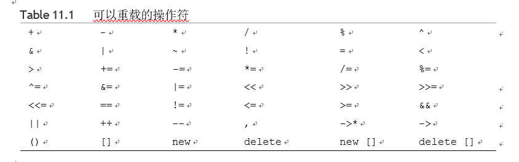
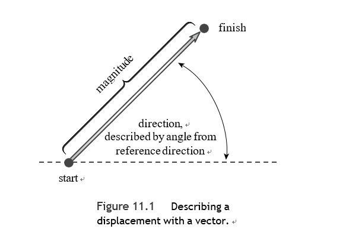
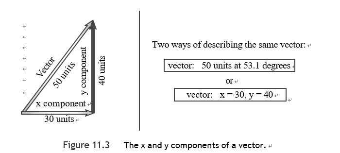

# 第十一章

#### 运算符重载

操作符重载将重载概念扩展到操作符上，让你为C++操作符分配多种含义，实际上，许多C++（和C）运算符已经被重载了，C++使用操作数和操作数的类型来决定采取何种操作。

例如

- *运算符，当应用于一个地址时，产生存储在该地址的值。
- 但是将*应用于两个数字时，会产生两个值的乘积。

C++允许你将运算符重载扩展到用户定义的类型，允许你，比如说，使用+符号来增加两个对象。同样，编译器使用操作数和操作数的类型来决定使用哪种加法的定义。重载运算符通常可以使代码看起来更自然。

> 这种简单的加法符号掩盖了机械性的东西，强调了本质的东西，这也是OOP的另一个目标。


为了重载一个运算符，你要使用一种特殊的函数形式，称为运算符函数，其中op是被重载的运算符的符号，运算符op必须是一个有效的C++运算符；你不能随便编造一个新的符号。：

operatorop(参数列表)

e.g. operator+()重载了+运算符，operator\*()重载了*运算符。

:warning:你不能有一个operator@()函数，因为C++没有@运算符


编译器认识到操作数属于销售人员类，就用相应的操作函数替换操作数

e.g.

```c++
//如果district2、sid和sara都是销售人员类的对象
district2 = sid + sara;
district2 = sid.operator+(sara);
```


####  时间在我们手中：开发一个运算符

e.g. 

Time.hpp

```c++
class Time{
    int hours;
    int minutes;
public:
    Time();
    Time(int h,int m=0);
    void AddMin(int m);
    void AddHr(int h);
    void Reset(int h=0,int m=0);
    Time Sum(const Time&t);
    void Show() const;
};
```

Time.cpp

```c++

void Time::Show() const {
    std::cout << hours << " hours, " << minutes << " minutes";
}

void Time::AddHr(int h) {
    hours+=h;
}

void Time::AddMin(int m) {
    minutes+=m;
    hours+=minutes/60;
    minutes%=60;
}

void Time::Reset(int h, int m) {
    hours=h;
    minutes=m;
}

Time Time::Sum(const Time &t) {
    Time sum;
    sum.minutes=t.minutes+minutes;
    sum.hours=t.hours+hours+sum.minutes/60;
    sum.minutes%=60;
    return sum;
}

Time::Time() {
    hours=minutes=0;
}

Time::Time(int h, int m) {
    hours=h;
    minutes=m;
}
```

> 然而，使用Time返回类型，意味着程序在销毁sum之前构造了一个sum的副本，而调用函数得到了这个副本。

main.cpp

```c++
int main() {
    using std::cout;
    using std::endl;
    Time planning;
    Time coding(2,40);
    Time fixing(5,55);
    Time total;

    cout << "planning time = ";
    planning.Show();
    cout << endl;

    cout << "coding time = ";
    coding.Show();
    cout << endl;

    cout << "fixing time = ";
    fixing.Show();
    cout << endl;


    total=coding.Sum(fixing);
    cout << "coding.Sum(fixing) = ";
    total.Show();
    cout<<endl;


    return 0;
}
```


**添加一个加法运算符**,

你只需将Sum()的名字改为看起来比较奇怪的operator+()，你只需在操作符的末尾加上操作符的符号（本例中为+）。这是一个你可以在标识符名称中使用字母、数字或下划线以外的字符的地方，但是将方法命名为operator+()也可以让你使用运算符符号：

```c++
total=coding.operator+(fixing);
total = coding + fixing;	// operator notation
```


请注意，在运算符符号中，运算符左边的对象是调用的对象，右边的对象是作为参数传递的对象。

main.cpp

```c++
int main() {
    using std::cout;
    using std::endl;
    Time planning;
    Time coding(2,40);
    Time fixing(5,55);
    Time total;

    cout << "planning time = ";
    planning.Show();
    cout << endl;

    cout << "coding time = ";
    coding.Show();
    cout << endl;

    cout << "fixing time = ";
    fixing.Show();
    cout << endl;


    total=coding+fixing;
    cout << "coding + fixing = ";
    total.Show();
    cout<<endl;

    Time morefixing(3,28);
    cout << "more fixing time = ";
    morefixing.Show();
    cout << endl;

    total = morefixing.operator+(total);
    cout << "morefixing.operator+(total) = ";
    total.Show();
    cout << endl;
    return 0;
}
```


编译器根据操作数类型来计算该怎么做：

e.g.

```c++
int a, b, c;
Time A, B, C;
c = a + b;	// use int addition
C = A + B;	// use addition as defined for Time objects
```


你可以添加两个以上的对象吗？例如，如果t1, t2, t3, 和t4都是Time对象，你能做以下事情吗？

```c++
t4 = t1 + t2 + t3;	// valid?
```

因为加法是一个从左到右的运算符，所以该语句首先被翻译成这样：

```
t4 = t1.operator+(t2 + t3);	// valid?
t4 = t1.operator+(t2.operator+(t3));	// valid? YES
```

---

**重载的限制**

大多数C++运算符可以按照上一节所述的方式进行重载。

- 重载运算符（有一些例外）不一定是成员函数。然而，至少有一个操作数必须是用户定义的类型，这可以防止你为标准类型重载运算符，这个限制保留了程序的合理性，尽管它可能会阻碍创造性的计算。
- 不能以违反原始运算符的语法规则的方式使用一个运算符。

> 你不能重载模数运算符（%），使得它只用于一个操作数。

- 不能改变运算符的优先级
- 不能创建新的运算符符号
- 不能重载以下运算符

|      运算符      |        描述        |
| :--------------: | :----------------: |
|      sizeof      |   操作符 sizeof    |
|        .         |     成员操作符     |
|        .*        | 指针到成员的操作符 |
|        ::        |  范围分辨率运算符  |
|        ?:        |     条件运算符     |
|      typeid      |   一个RTTI操作符   |
|    const_cast    | 一个类型转换操作符 |
|   dynamic_cast   | 一个类型转换操作符 |
| reinterpret_cast | 一个类型转换操作符 |
|   static_cast    | 一个类型转换操作符 |

- 大多数操作符都可以通过使用成员函数或非成员函数来重载。然而，你只能使用成员函数来重载以下的操作符

  | 操作符 |           描述           |
  | :----: | :----------------------: |
  |   =    |        赋值运算符        |
  |   ()   |      函数调用操作符      |
  |   []   |        下标运算符        |
  |   ->   | 通过指针操作符访问类成员 |




---


**更多重载运算符**

Time.hpp

```c++
class Time{
    int hours;
    int minutes;
public:
    Time();
    Time(int h,int m=0);
    void AddMin(int m);
    void AddHr(int h);
    void Reset(int h=0,int m=0);
    Time operator+(const Time&t) const;
    Time operator*(const double mult) const;
    Time operator-(const Time&t) const;
    void Show() const;
};
```

Time.cpp

```c++
void Time::Show() const {
    std::cout << hours << " hours, " << minutes << " minutes";
}

void Time::AddHr(int h) {
    hours+=h;
}

void Time::AddMin(int m) {
    minutes+=m;
    hours+=minutes/60;
    minutes%=60;
}

void Time::Reset(int h, int m) {
    hours=h;
    minutes=m;
}

Time Time::operator+(const Time &t) const{
    Time sum;
    sum.minutes=t.minutes+minutes;
    sum.hours=t.hours+hours+sum.minutes/60;
    sum.minutes%=60;
    return sum;
}

Time::Time() {
    hours=minutes=0;
}

Time::Time(int h, int m) {
    hours=h;
    minutes=m;
}

Time Time::operator*(double mult) const{
    Time result;
    long totalminutes=hours*mult*60+minutes*mult;
    result.minutes=totalminutes%60;
    result.hours=totalminutes/60;
    return result;
}

Time Time::operator-(const Time &t) const {
    Time diff;
    int tot1,tot2;
    tot1=hours*60+minutes;
    tot2=t.hours*60+t.minutes;
    diff.minutes=(tot1-tot2)%60;
    diff.hours=(tot1-tot2)/60;
    return diff;
}
```

mian.cpp

```c++

int main() {
    using std::cout;
    using std::endl;
    Time weeding(4, 35);
    Time waxing(2, 47); Time total;
    Time diff;
    Time adjusted;

    cout << "weeding time = "; weeding.Show();
    cout << endl;

    cout << "waxing time = "; waxing.Show();
    cout << endl;

    cout << "total work time = ";
    total = weeding + waxing;	// use operator+()
    total.Show();
    cout << endl;

    diff = weeding - waxing;	// use operator-()
    cout << "weeding time - waxing time = ";
    diff.Show();
    cout << endl;

    adjusted = total * 1.5;	// use operator+()
    cout << "adjusted work time = ";
    adjusted.Show();
    cout << endl;
    return 0;
}

```

> weeding time = 4 hours, 35 minutes                                                                                     
>
>  waxing time = 2 hours, 47 minutes                                                                                      
>
>  total work time = 7 hours, 22 minutes                                                                                  
>
>  weeding time - waxing time = 1 hours, 48 minutes                                                                        
>
> adjusted work time = 11 hours, 3 minutes                                                                                                                          


#### 介绍友元

C++控制对一个类对象的私有部分的访问，公共类方法是唯一的访问途径，但有时这种限制过于僵硬，无法适应特定的编程问题。在这种情况下，C++提供了另一种形式的访问：友元。

友元有三种变体：

- 友元函数
- 友元类
- 友元成员函数

通过使一个函数成为一个类的好友，你允许该函数拥有与该类的成员函数相同的访问权限。

为一个类重载一个二元运算符（即一个有两个参数的运算符）会产生对友元的需求。

e.g.在前面的时间类例子中，重载的乘法运算符与其他两个重载运算符不同，因为它结合了两种不同的类型，这限制了运算符的使用方式。

:spiral_notepad:记住，左边的操作数是调用的对象、

```
A = B * 2.75;//A = B.operator*(2.75);
A = 2.75 * B;	// cannot correspond to a member function
```

从概念上讲，2.75 * B应该与B * 2.75相同，但是第一个表达式不能对应于一个成员函数，因为2.75不是一个Time类型的对象。

**使用非成员函数**:非成员函数不是由一个对象调用的，相反，它使用的任何值，包括对象，都是显式参数。

```c++
Time operator*(double m, const Time & t);
```

在非成员重载的operator函数中，operator表达式的左边操作数对应于operator函数的第一个参数，而右边操作数对应于第二个参数。


使用非成员函数解决了按所需顺序获取操作数的问题（先是double，然后是Time），但它引起了一个新的问题：非成员函数不能直接访问类中的私有数据。好吧，至少普通的非成员函数缺乏访问权。但是有一类特殊的非成员函数，叫做friends，它可以访问类中的私有成员。


**创建友元**

创建友方函数的第一步是在类声明中放置一个原型，并在声明前加上关键字friend：

```c++
friend Time operator*(double m, const Time & t); // goes in class declaration
```

因为它不是一个成员函数，所以你不使用Time::限定符。你也不要在定义中使用friend关键字。定义应该是这样的：

```c++
Time operator*(double mult,const Time &t){
    Time result;
    long tom=t.hours*60*mult+t.minutes*mult;
    result.minutes=tom%60;
    result.hours=tom/60;
    return result;
}
```

简而言之，一个类的友方函数是一个非成员函数，具有与成员函数相同的访问权限。

---

**友好函数是否不符合OOP？**

乍一看，友元函数似乎违反了数据隐藏的OOP原则，因为友元函数机制允许非成员函数访问私有数据。然而，这是个过于狭隘的观点。相反，你应该把友元函数看作是类的扩展接口的一部分。同时请记住，只有类的声明才能决定哪些函数是friends，所以类的声明仍然控制着哪些函数访问私有数据。简而言之，类方法和好友只是表达类接口的两种不同机制。

---

实际上，你可以把这个特殊的友方函数写成非友方函数，方法是改变定义，使其在乘法中改变到达的值的先后顺序：

```c++
Time operator*(double m, const Time & t)
{
return t * m;	// use t.operator*(m)
}
```

尽管如此，我们也有理由把这个版本作为友元函数：

- 它将函数作为官方类接口的一部分与之相连
- 如果你后来发现需要该函数直接访问私有数据，你只需要改变函数的定义，而不是类的原型。


**一种常见的友元函数： 重载<<操作符**

类的一个非常有用的特性是你可以重载<<操作符，这样你就可以用它和cout一起显示一个对象的内容。

在其最基本的化身中，<<操作符是C和C++的位操作符之一，它对一个值进行左移位，但是ostream类对该操作符进行了重载，将其转换为一个输出工具。cout是一个ostream对象，而且它足够聪明，能够识别所有基本的C++类型。这是因为ostream类的声明包括了每个基本类型的重载运算符<<()定义。


为了教会Time类使用cout，你可以使用一个友元函数。

- 因为像下面这样的语句使用了两个对象，首先是ostream类对象（cout）：

```c++
cout << trip;
```

如果你使用一个Time成员函数来重载<<，那么Time对象会排在第一位,这意味着你必须这样使用<<操作符：

```c++
trip << cout;
```

e.g. 定义和实现

```c++
friend void operator<<(std::ostream& os,Time& t);
    void operator<<(std::ostream& os,Time& t){
    os<<t.hours << " hours, " << t.minutes << " minutes";
}

```


<span style="color: #5F9EA0">这个函数，虽然对 ostream 类不是有害的，但不是那个类的友元</span>

operator<<()函数接受一个ostream参数和一个Time参数，所以看起来这个函数必须是两个类的友元。然而，如果你看一下该函数的代码，你会发现该函数访问了时间对象的个别成员，但只使用了整体的ostream对象。调用cout << trip应该使用cout对象本身，而不是一个副本，所以函数将对象作为引用而不是通过值传递。

[^cerr]:将输出路由到标准错误流，默认情况下，标准错误流就是显示器。但在Unix、Linux和Windows的命令行环境中，你可以将标准错误流重定向到一个文件。


e.g. 改进后的版本

```c++
friend std::ostream& operator<<(std::ostream& os,Time& t);
std::ostream& operator<<(std::ostream& os,Time& t){
    os<<t.hours << " hours, " << t.minutes << " minutes";
    return os;
}
```

---

**Note**

一般来说，为了重载<<操作符来显示一个c_name类的对象，你可以使用一个友元函数，其定义是这样的：

```c++
ostream & operator<<(ostream & os, const c_name & obj)
{
os << ... ; // display object contents return os;
}
```


e.g. 

Time.hpp

```c++
using std::string;
class Time{
    int hours;
    int minutes;
public:
    Time();
    Time(int h,int m=0);
    void AddMin(int m);
    void AddHr(int h);
    void Reset(int h=0,int m=0);
    Time operator+(const Time&t) const;
    Time operator*(double mult) const;
    Time operator-(const Time&t) const;
    friend std::ostream& operator<<(std::ostream& os,const Time& t);
    friend  Time operator*(double mult,const Time &t){
        return t*mult;
    }

};

```


Time.cpp

```c++
void Time::AddHr(int h) {
    hours+=h;
}

void Time::AddMin(int m) {
    minutes+=m;
    hours+=minutes/60;
    minutes%=60;
}

void Time::Reset(int h, int m) {
    hours=h;
    minutes=m;
}

Time Time::operator+(const Time &t) const{
    Time sum;
    sum.minutes=t.minutes+minutes;
    sum.hours=t.hours+hours+sum.minutes/60;
    sum.minutes%=60;
    return sum;
}

Time::Time() {
    hours=minutes=0;
}

Time::Time(int h, int m) {
    hours=h;
    minutes=m;
}

Time Time::operator*(double mult) const{
    Time result;
    long totalminutes=hours*mult*60+minutes*mult;
    result.minutes=totalminutes%60;
    result.hours=totalminutes/60;
    return result;
}

Time Time::operator-(const Time &t) const {
    Time diff;
    int tot1,tot2;
    tot1=hours*60+minutes;
    tot2=t.hours*60+t.minutes;
    diff.minutes=(tot1-tot2)%60;
    diff.hours=(tot1-tot2)/60;
    return diff;
}


std::ostream& operator<<(std::ostream& os,const Time& t){
    os<<t.hours << " hours, " << t.minutes << " minutes";
    return os;
}

```

:warning:你只在类声明中的原型中使用friend关键字。你不能在函数定义中使用它，除非该定义也是原型。


main.cpp

```c++
int main() {
    using std::cout;
    using std::endl;
    Time aida(3, 35);
    Time tosca(2, 48); 
    Time temp;

    cout << "Aida and Tosca:\n";
    cout << aida<<"; " << tosca << endl; 
    temp = aida + tosca;  // operator+()
    cout << "Aida + Tosca: " << temp << endl; 
    temp = aida* 1.17; // member operator*()
    cout << "Aida * 1.17: " << temp << endl;
    cout << "10.0 * Tosca: "<< 10.0 * tosca << endl;
    return 0;
}
```


####   重载运算符：成员函数与非成员函数

一个非成员版本的重载运算符函数需要的形式参数与运算符的操作数一样多，同一运算符的成员版本需要一个较少的参数，因为一个操作数是作为调用对象隐式传递的。

```c++
T1 = T2 + T3；
```

也就是说，编译器可以将语句T1 = T2 + T3; 转换为以下任何一种：
```c++
T1 = T2.operator+(T3); // 成员函数
T1 = operator+(T2, T3); // 非成员函数
```

:warning:请记住，在定义一个给定的运算符时，你必须选择一种或另一种形式，但不能同时选择。因为这两种形式都能匹配同一个表达式，定义这两种形式是一个歧义性错误，会导致编译错误。

**最好使用哪种形式呢？**

如前所述，对于某些运算符，成员函数是唯一有效的选择。否则，它往往不会有太大的区别。有时，根据类的设计，非成员版本可能会有优势，特别是当你为该类定义了类型转换时。


####  更多重载：一个向量类

在工程和物理学中，矢量这个术语是一个既有大小又有方向的量。

**表示位置变化的向量称为位移向量**




**将两个向量相加有一个简单的几何学解释**

从第一个向量的起点到第二个向量的端点画一个向量。这第三个向量代表前两个向量的总和



:warning:和的长度可以小于单个长度的总和

vector.hpp

```c++
namespace VECTOR
{
    class Vector{
    public:
        enum Mode{RECT,POL};
    private:
        Mode mode;
        double x;
        double y;
        double mag;
        double ang;
        void set_mag();
        void set_ang();
        void set_x();
        void set_y();
    public:
        Vector();
        Vector(double n1, double n2, Mode form = RECT);
        void reset(double n1, double n2, Mode form = RECT);
        ~Vector();
        double xval() const {return x;}    // report x value
        double yval() const {return y;}    // report y value
        double magval() const {return mag;}    // report magnitude
        double angval() const {return ang;}    // report angle
        void polar_mode(); // set mode to POL
        void rect_mode();  // set mode to RECT
// operator overloading
        Vector operator+(const Vector & b) const;
        Vector operator-(const Vector & b) const;
        Vector operator-() const;
        Vector operator*(double n) const;
// friends
        friend Vector operator*(double n, const Vector & a);
        friend std::ostream & operator<<(std::ostream & os, const Vector & v);
    };
}
```


vector.cpp

```c++

namespace VECTOR{
    using std::cout;
    const double PI_2_Deg=180/3.14159267;
    void Vector::reset(double n1, double n2, VECTOR::Vector::Mode form) {
        mode=form;
        if(form==RECT){
             y=n1;
             x=n2;
             set_mag();
             set_ang();
        }else if(form==POL){
            mag=n1;
            ang=n2/PI_2_Deg;
            set_y();
            set_x();
        }else{
            cout << "Incorrect 3rd argument to Vector() -- ";
            cout << "vector set to 0\n";
            x = y = mag = ang = 0.0;
            mode = RECT;
        }
    }


    void Vector::polar_mode() {
        mode=POL;
    }

    void Vector::rect_mode() {
        mode=RECT;
    }

    void Vector::set_ang() {
        if(x==0&&y==0){
            ang=0;
        }else{
            ang= atan2(y,x);
        }
    }

    void Vector::set_mag() {
        mag= sqrt(x*x+y*y);
    }

    void Vector::set_x() {
        x=mag*cos(ang);
    }

    void Vector::set_y() {
       y=mag*sin(ang);
    }

    Vector::Vector() {
        x=y=ang=mag=0;
        mode=RECT;
    }

    Vector::Vector(double n1, double n2, VECTOR::Vector::Mode form) {
        reset(n1,n2,form);
    }

    Vector::~Vector() {

    }

    Vector Vector::operator-() const {
        return Vector(-x, -y);
    }

    Vector Vector::operator-(const VECTOR::Vector &b) const {
       return Vector(x-b.x,y-b.y);
    }

    Vector Vector::operator*(double n) const {
        return Vector(x*n,y*n);
    }

    Vector Vector::operator+(const VECTOR::Vector &b) const {
        return Vector(x+b.x,y+b.y);
    }

    Vector operator*(double n, const Vector & a){
        return a*n;
    }

    std::ostream & operator<<(std::ostream & os, const Vector & v){
        if (v.mode == Vector::RECT)
            os << "(x,y) = (" << v.x << ", " << v.y << ")";
        else if (v.mode == Vector::POL)
        {
            os << "(m,a) = (" << v.mag << ", "
               << v.ang * PI_2_Deg<< ")";

        }
        else os << "Vector object mode is invalid";
        return os;

    }
}
```

[^atan2]:求笛卡尔平面上从原点到点 (x, y) 的射线与 x 轴之间的夹角。

---

**Tips**

如果一个方法需要计算一个新的类对象，你应该看看是否可以使用一个类构造函数来完成这项工作。这不仅可以省去你的麻烦，还可以确保新对象是以正确的方式构造的。

---


e.g. 一个使用修订后的Vector类的简短程序，它模拟了著名的 "醉汉散步 "问题。

这个想法是，你把一个人放在一个灯柱上。这个人开始行走，但每一步的方向都与前一步的方向随机变化。这个问题的一种表述方式是这样的： 这个随机行走的人要走多少步才能离开灯柱，比如说，50英尺远？

```c++
int main() {
    using std::cout;
    using std::endl;
    using std::cin;
    using VECTOR::Vector;
    srand(time(0));
    double direction;
    Vector step;
    Vector result(0,0);
    unsigned long steps=0;
    double target;
    double dstep;
    cout << "Enter target distance (q to quit): ";
    while (cin >> target)
    {
        cout << "Enter step length: ";
        if (!(cin >> dstep))
            break;
        while (result.magval() < target)
        {
            direction = rand() % 360;
            step.reset(dstep, direction, Vector::POL);
            result = result + step;
            steps++;
        }
        cout << "After " << steps << " steps, the subject " "has the following location:\n";
        cout << result << endl;
        result.polar_mode();
        cout << " or\n" << result << endl;
        cout << "Average outward distance per step = "
             << result.magval()/steps << endl;
        steps = 0;
        result.reset(0.0, 0.0);
        cout << "Enter target distance (q to quit): ";
    }
    cout << "Bye!\n";
    cin.clear();
    while (cin.get() != '\n')
        continue;
    return 0;
}
```


概率论认为，平均而言，达到D的净距离所需的长度为s的步骤数（N）由以下公式给出：
$$
N = (D/S)^{2}
$$

---

**Note**

标准的ANSI C库，也是C++自带的，包括一个rand()函数，可以返回一个从0到某个与实际执行有关的值范围内的随机整数。


[^srand]: srand是一个为rand()函数所使用的随机数发生器设置种子值的函数。
[^time(0)]: 返回当前时间，即自1970年1月1日起经过的秒数，time()接收一个类型为time_t的变量的地址，将时间放入该变量并返回，使用0作为地址参数，就不需要其他不需要的time_t变量。
[^rand()]:将一个算法应用于初始种子值，得到一个随机值。该值被用作下一个函数调用的种子，以此类推。这些数字实际上是伪随机的，因为连续调用10次通常会产生同一组10个随机数。

cstdlib头文件（以前是stdlib.h）包含srand()和rand()的原型，而ctime（以前是time.h）包含time()原型。(C++11通过随机头文件支持的函数提供了更广泛的随机数支持。)

---


####  类的自动转换和类型转换

当你做一个语句将一个标准类型的值分配给另一个标准类型的变量时，C++会自动将该值转换为与接收变量相同的类型，只要这两种类型是一致的。

```c++
long count = 8; // int值8转换为long类型 
double time = 11; // int值11转换为 double类型
int side = 3.33; // double值3.33转换为int 3类型
```

这些赋值是有效的，因为C++认识到不同的数字类型都代表相同的基本事物--数字，而且C++包含了用于进行转换的内置规则。


C++语言不会自动转换不兼容的类型。

例如，下面的语句失败了，因为左边是一个指针类型，而右边是一个数字：

```c++
int * p = 10; // type clash
```

尽管计算机可能在内部用整数表示一个地址，但整数和指针在概念上是完全不同的。


然而，当自动转换失败时，你可以使用一个类型转换:

```c++
int * p = (int *) 10; // ok, p and (int *) 10 both pointers
```

这就通过将10的类型转换为指针到int的类型（即int *）来设置一个指向地址10的指针。这个赋值是否有意义是另一回事。


你可能会定义一个与基本类型或另一个类有足够关系的类，以至于从一种形式转换到另一种形式是有意义的。在这种情况下，你可以告诉C++如何自动地进行这种转换，或者，也许，通过一个类型的转换。

- 设计一个合适的类型：要用两种方式来表示一件事

> enum提供了一种方便的方式来定义特定于类的常量，只要它们是整数。或者你可以使用下面的替代方法：
>
> ```c++
> static const int Lbs_per_stn = 14;
> ```

e.g.

stonewt.hpp

```c++
class Stonewt{
private:
    enum{Lbs_per_stn = 14};
    int stone;
    double pds_left;
    double pounds;//entire weight in pounds;

public:
    Stonewt(double lbs);
    Stonewt(int stn,double lbs);
    Stonewt();
    ~Stonewt();
    void show_lbs() const;
    void show_stn() const;
};
```


stonewt.cpp

```c++
using std::cout;
void Stonewt::show_lbs() const {
    cout<<pounds<<" pounds.\n";
}

void Stonewt::show_stn() const {
    cout<<stone<<" stone, "<<pds_left<<" pounds.\n";
}

Stonewt::Stonewt() {
    pds_left=pounds=pds_left=0;
}

Stonewt::Stonewt(double lbs) {
    pounds=lbs;
    stone=lbs/Lbs_per_stn;
    pds_left=lbs-Lbs_per_stn*stone;
}


Stonewt::Stonewt(int stn, double lbs) {
    stone=stn;
    pds_left=lbs;
    pounds=lbs+Lbs_per_stn*stn;
}

Stonewt::~Stonewt() {

}
```


在C++中，任何接受单一参数的构造函数都可以作为将该参数类型的值转换为该类类型的蓝图。

```c++
myCat = 19.6; // 使用Stonewt(double)将19.6转换为Stonewt。
//该程序使用Stonewt(double)构造函数来构造一个临时的Stonewt对象，使用19.6作为初始化值。然后成员式赋值将临时对象的内容复制到myCat中。
```

**这个过程被称为隐式转换，因为它是自动发生的，不需要明确的类型转换。**只有只用一个参数的构造函数才能作为转换函数使用。如果它为第二个参数提供了一个默认值，那么它将作为int转换的指南：

```c++
Stonewt(int stn, double lbs=0); // not a conversion function
```


让构造函数作为一个自动类型转换函数来工作似乎是一个很好的功能。然而，随着程序员获得更多使用C++的经验，他们发现自动方面并不总是可取的，因为它可能导致意外的转换。所以C++增加了一个新的关键字，explicit，用来关闭自动方面的功能。

```c++
explicit Stonewt(double lbs);	// no implicit conversions allowed

myCat = 19.6;	// not valid if Stonewt(double) is declared as explicit 
mycat = Stonewt(19.6); // ok, an explicit conversion
mycat = (Stonewt) 19.6; // ok, old form for explicit typecast
```

---

**Note**

一个包含一个参数的C++构造函数定义了一个从参数类型到类别类型的类型转换。如果构造函数用关键字explicit限定，则该构造函数仅用于显式转换；否则，它也用于隐式转换。

用于以下隐式转换：

- 当你将一个Stonewt对象初始化为一个双倍类型的值时
- 当你向一个Stonewt对象分配一个double类型的值时
- 当你把一个double类型的值传递给一个期望有一个Stonewt参数的函数时
- 当一个被声明为返回Stonewt值的函数试图返回一个double
- 当前面的任何一种情况使用一个可以明确转换为double类型的内置类型时

```c++
Stonewt Jumbo(7000);	// uses Stonewt(double), converting int to double 
Jumbo = 7300;	// uses Stonewt(double), converting int to double
```

这个两步转换过程只有在有明确选择的情况下才有效，如果这个类还定义了一个Stonewt(long)构造函数，编译器会拒绝这些语句，可能会指出int可以转换为long或double，所以这个调用是模糊的。

main.cpp

```c++
void display(const Stonewt & st, int n);
int main() {
    using std::cout;
    using std::endl;
    using std::cin;
    Stonewt incognito = 275; // uses constructor to initialize
    Stonewt wolfe(285.7); // same as Stonewt wolfe = 285.7;
    Stonewt taft(21, 8);

    cout << "The celebrity weighed ";
    incognito.show_stn();
    cout << "The detective weighed ";
    wolfe.show_stn();
    cout << "The President weighed ";
    taft.show_lbs();
    incognito = 276.8; // uses constructor for conversion
    taft = 325;    // same as taft = Stonewt(325);
    cout << "After dinner, the celebrity weighed ";
    incognito.show_stn();
    cout << "After dinner, the President weighed ";
    taft.show_lbs();
    display(taft, 2);
    cout << "The wrestler weighed even more.\n";
    display(422, 2);
    cout << "No stone left unearned\n";


    _mywait();
    return 0;
}

void display(const Stonewt & st, int n)
{
    for (int i = 0; i < n; i++)
    {
        std::cout << "Wow! ";
        st.show_stn();
    }
}
```


###### 转换函数

你能将一个Stonewt对象转换为一个double值，就像下面这样吗？

```c++
Stonewt wolfe(285.7)；
double host = wolfe; // ??可能 ?
```

你可以这样做--但不是通过使用构造函数。构造函数只提供了将另一个类型转换为类的类型。要做相反的事情，你必须使用C++运算符函数的一种特殊形式，称为转换函数。


转换函数是用户定义的类型转换，你可以以使用类型转换的方式使用它们。如果你定义了一个Stonewt到double的转换函数，你可以使用以下转换：

```c++
Stonewt wolfe(285.7);
double host = double (wolfe);	// syntax #1 
double thinker = (double) wolfe;	// syntax #2
```

或者你可以让编译器来计算该怎么做：

```c++
Stonewt wells(20, 3)；
double star = wells; //隐含地使用了转换函数
```

编译器注意到右边的类型是Stonewt，左边的类型是double，就会查看你是否定义了一个符合这个描述的转换函数。(如果找不到这样的定义，编译器就会产生一条错误信息，大意是它不能将一个Stonewt分配给一个double数）。

要转换到typeName类型，你可以使用这种形式的转换函数：

- 转换函数必须是一个类方法。

- 转换函数不能指定一个返回类型
- 转换函数必须没有参数

```c++
operator typeName();
```


e.g.

 hpp文件

```c++
class Stonewt{
private:
    enum{Lbs_per_stn = 14};
    int stone;
    double pds_left;
    double pounds;//entire weight in pounds;

public:
    Stonewt(double lbs);
    Stonewt(int stn,double lbs);
    Stonewt();
    ~Stonewt();
    void show_lbs() const;
    void show_stn() const;
    operator double() const;
    operator int() const;
};
```


源代码文件

```c++
//
// Created by student on 2023/3/23.
//
#include <cmath>
#include <iostream>
#include "support.h"

using std::cout;
void Stonewt::show_lbs() const {
    cout<<pounds<<" pounds.\n";
}

void Stonewt::show_stn() const {
    cout<<stone<<" stone, "<<pds_left<<" pounds.\n";
}

Stonewt::Stonewt() {
    pds_left=pounds=pds_left=0;
}

Stonewt::Stonewt(double lbs) {
    pounds=lbs;
    stone=lbs/Lbs_per_stn;
    pds_left=lbs-Lbs_per_stn*stone;
}


Stonewt::Stonewt(int stn, double lbs) {
    stone=stn;
    pds_left=lbs;
    pounds=lbs+Lbs_per_stn*stn;
}

Stonewt::~Stonewt() {

}

Stonewt::operator double() const{
    return pounds;
}

Stonewt::operator int() const{
    return int(pounds+0.5);
}
```


main.cpp

```c++
int main() {
    using std::cout;
    using std::endl;
    using std::cin;
    Stonewt poppins(9,2.8); // 9 stone, 2.8 pounds
    double p_wt = poppins; // implicit conversion
    cout << "Convert to double => ";
    cout << "Poppins: " << p_wt << " pounds.\n";
    cout << "Convert to int => ";
    cout << "Poppins: " << int (poppins) << " pounds.\n";
    
    _mywait();
    return 0;
}
```

---

**自动应用类型转换**

使用int (poppins)和cout。假设它省略了明确的类型转换：

```c++
cout << "Poppins： " << poppins << " pounds.\n"；
```

该程序是否会使用隐式转换，如下面的语句？

```c++
double p_wt = poppins；
```

**答案是否定的**

在p_wt的例子中，上下文表明poppins应该被转换为double类型。但是在cout的例子中，没有任何信息表明转换应该是转为int还是转为double。面对这种信息的缺乏，编译器会抱怨说你在使用一种模糊的转换。语句中没有任何内容表明应该使用什么类型。

有趣的是，如果这个类只定义了双倍转换函数，编译器就会接受这个语句。这是因为只有一种转换是可能的，就不存在模糊性，你可以在赋值方面遇到类似的情况。

---


就像转换构造函数一样，转换函数可能是一把双刃剑。提供自动隐式转换的函数的问题在于它们可能在您不希望进行转换时进行转换。

:warning:在C++98中，关键字显式不能用于转换函数，但C++11取消了这个限制。所以在C++11中，你可以将转换操作符声明为显式，你应该谨慎地使用隐式转换函数。通常一个只能显式调用的函数是最好的选择。


**C++为类提供了以下类型转换**：

- 一个只有一个参数的类构造函数可以作为一个指令，将参数类型的值转换为类的类型。然而，在构造函数声明中使用显式消除了隐式转换，只允许显式转换。
- 一个特殊的类成员操作函数被称为转换函数，作为将类对象转换为其他类型的指令。转换函数是一个类成员，没有声明的返回类型，没有参数，并被称为操作符typeName()，其中typeName是对象要被转换的类型。当你将一个类对象分配给该类型的变量或使用类型转换操作符到该类型时，这个转换函数会自动调用。


###### 转换和友元

转换发生在成员函数的参数上，而不是成员函数的调用者上。加法定义为友元使程序更容易适应自动类型转换。原因是两个操作数都成为函数参数，所以函数原型对两个操作数都起作用。

> **这里的教训是，将加法定义为友元使程序更容易适应自动类型转换。原因是两个操作数都成为函数参数，所以函数原型对两个操作数都起作用。**


**实现加法的选择**

考虑到你想将double添加到Stonewt量中，你有几个选择:

- 将以下内容定义为友元函数，并让Stonewt(double)构造函数处理double类型参数到Stonewt类型参数的转换：

```c++
operator+(const Stonewt &, const Stonewt &)
```

- 明确使用一个double类型参数的函数来进一步重载加法运算符

```c++
Stonewt operator+(double x); // member function friend Stonewt 
```

第一个选择（依靠隐式转换）导致程序更短，因为你定义的函数更少，这也意味着你的工作更少，搞砸的机会也更少，缺点是在需要转换时调用转换构造函数所需的时间和内存的开销更大。

第二种选择（明确匹配类型的附加函数），然而，是一个镜像。它使程序更长，你的工作更多，但它运行得更快一些。


