# 第十二章

[TOC]

#### 动态内存和类

e.g.

stringbad.hpp

```c++
#include <iostream>
#ifndef STRNGBAD_H_ #define STRNGBAD_H_ class StringBad
{
private:
    char * str;	// pointer to string
    int len;	// length of string static int num_strings;	// number of objects
public:
    StringBad(const char * s); // constructor 
    StringBad();	// default constructor
    ~StringBad();	// destructor
    // friend function
    friend std::ostream & operator<<(std::ostream & os,
    const StringBad & st);
};
#endif
```

- 它使用了一个指向字符的指针，而不是一个char数组来表示一个名字

> 首先，它使用了一个指向字符的指针，而不是一个char数组来表示一个名字。这意味着这个类的声明并没有为字符串本身分配存储空间。相反，它在构造函数中使用new来分配字符串的空间。这种安排避免了用预定义的字符串大小限制来束缚类的声明。

- 该定义将num_strings成员声明为属于静态存储类

> 一个程序只创建一个静态类变量的副本，而不考虑创建对象的数量。也就是说，一个静态成员在该类的所有对象中共享，就像一个电话号码可能在一个家庭的所有成员中共享。例如，num_strings成员是用来记录创建的对象的数量。

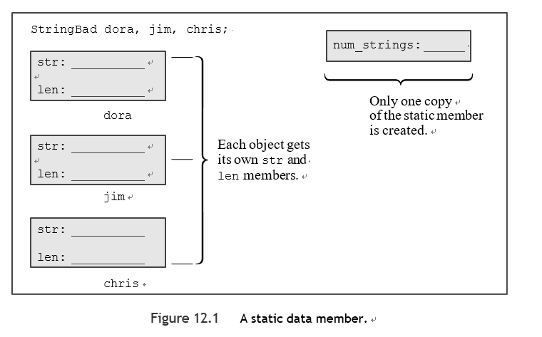


stringbad.cpp

```c++
using std::cout;
int StringBad::num_strings=0;

StringBad::StringBad() {
    len=4;
    str=new char[4];
    std::strcpy(str,"C++");
    num_strings++;
    cout<<num_strings<<":\""<<str<<"\"default object created\n";
}

StringBad::StringBad(const char *s) {
    len = std::strlen(s);
    str=new char[len+1];
    std::strcpy(str,s);
    num_strings++;
    cout<<num_strings<<":\""<<str<<"\"default object created\n";
}

StringBad::~StringBad(){
    cout<< "\"" << str << "\" object deleted, ";
    num_strings--;
    cout << num_strings << " left\n";
    delete []str;
}

std::ostream & operator<<(std::ostream & os,
                          const StringBad & st){
    os<<st.str;
    return os;
}
```

---

**Note**

你不能在类声明中初始化静态成员变量。这是因为声明是对如何分配内存的描述，但它并不分配内存。你通过使用该格式创建一个对象来分配和初始化内存。

在静态类成员的情况下，你要独立地初始化静态成员，在类声明之外用一个单独的语句。这是因为静态类成员是单独存储的，而不是作为对象的一部分。注意，初始化语句给出了类型并使用了范围操作符，但它没有使用static关键字。

这个初始化是在方法文件中，而不是在类声明文件中。这是因为类声明是在头文件中，而一个程序可能在其他几个文件中包含一个头文件，这将导致初始化语句的多份拷贝，这是一个错误。在类声明中不初始化静态数据成员的例外情况是，静态数据成员是一个常量整型或枚举类型的常量。

静态数据成员在类声明中被声明，并在包含类方法的文件中被初始化。在初始化中使用范围操作符来指示静态成员属于哪个类。然而，如果静态成员是一个常量整型或一个枚举类型，它可以在类声明中被初始化。

---

[^strlen()]:返回字符串的长度，不包括结束时的空字符

:warning:字符串并没有存储在对象中。字符串被单独存储在堆内存中，而对象只是存储信息，告诉你在哪里可以找到字符串。

```c++
str = s;//这只是存储了地址，而没有对字符串进行复制。
```


删除一个对象可以释放对象本身占用的内存，但是它不会自动释放对象成员的指针指向的内存。对于这一点，你必须使用析构器。通过在析构器中放置删除语句，你可以确保构造函数用new分配的内存在对象过期时被释放。

只要你在构造函数中使用new来分配内存，你就应该在相应的析构函数中使用delete来释放这些内存。如果你使用new []（带括号），那么你应该使用delete []（带括号）。


main.cpp

```c++
void callme1(StringBad & rsb);
void callme2(StringBad sb);

int main() {
    using std::cout;
    using std::endl;
    using std::cin;
    {
        cout << "Starting an inner block.\n";
        StringBad headline1("Celery Stalks at Midnight");
        StringBad headline2("Lettuce Prey");
        StringBad sports("Spinach Leaves Bowl for Dollars");
        cout << "headline1: " << headline1 << endl;
        cout << "headline2: " << headline2 << endl;
        cout << "sports: " << sports << endl;
        callme1(headline1);
        cout << "headline1: " << headline1 << endl;
        callme2(headline2);
        cout << "headline2: " << headline2 << endl;
        cout << "Initialize one object to another:\n";
        StringBad sailor = sports;
        cout << "sailor: " << sailor << endl;
        cout << "Assign one object to another:\n";
        StringBad knot;
        knot = headline1;
        cout << "knot: " << knot << endl;
        cout << "Exiting the block.\n";
    }
    cout << "End of main()\n";
    return 0;
}

void callme1(StringBad & rsb)
{
    std::cout << "String passed by reference:\n";
    std::cout << " \"" << rsb << "\"\n";
}

void callme2(StringBad sb)

{
    std::cout << "String passed by value:\n";
    std::cout << " \"" << sb << "\"\n";
}
```

> Starting an inner block.                                                                                               
>
>  1:"Celery Stalks at Midnight"default object created                                                                     
>
> 2:"Lettuce Prey"default object created                                                                                 
>
>  3:"Spinach Leaves Bowl for Dollars"default object created                                                               
>
> headline1: Celery Stalks at Midnight                                                                                   
>
>  headline2: Lettuce Prey                                                                                                 
>
> sports: Spinach Leaves Bowl for Dollars                                                                                 
>
> String passed by reference:                                                                                                     
>
> ​	"Celery Stalks at Midnight"                                                                                    
>
>  headline1: Celery Stalks at Midnight                                                                                   
>
>  String passed by value:                                                                                                         
>
> ​	"Lettuce Prey"                                                                                                 
>
>  "Lettuce Prey" object deleted, 2 left                                                                                   
>
> headline2: Lettuce Prey                                                                                                 
>
> Initialize one object to another:                                                                                       
>
> sailor: Spinach Leaves Bowl for Dollars                                                                                 
>
> Assign one object to another:                                                                                           
>
> 3:"C++"default object created                                                                                          
>
>  knot: Celery Stalks at Midnight                                                                                         
>
> Exiting the block.                                                                                                      
>
> "Celery Stalks at Midnight" object deleted, 2 left                                                                     
>
>  "Spinach Leaves Bowl for Dollars" object deleted, 1 left                                                                
>
> "Spinach Leaves Bowl for Dollars" object deleted, 0 left                                                                
>
> "Lettuce Prey" object deleted, -1 left                                                                                  
>
> "Celery Stalks at Midnight" object deleted, -2 left                                                                     
>
> End of main()   

- 输出中出现的各种非标准字符会因系统而异；它们是StringBad值得被称为坏的标志之一
- 另一个迹象是负的对象计数。较新的编译器/操作系统组合通常会在显示剩余-1个对象的行前中止程序，其中一些会报告一个一般保护故障（GPF）

<span style="color: #708090">GPF表明程序试图访问一个被禁止的内存位置；这是另一个不好的信号。</span>


在这之前，代码似乎能正常运行，但随后程序执行了以下代码：

```c++
callme2(headline2);//cout << "headline2: " << headline2 << endl;
```

在这里，callme2()通过值而不是通过引用来传递headline2，结果表明有一个严重的问题：

- 将headline2作为一个函数参数传递，不知为何会导致析构器被调用。
- 尽管按值传递是为了保护原始参数不被改变，但这个函数把原始字符串弄得面目全非，一些非标准的字符被显示出来(显示的确切文本将取决于内存中的情况）。


 输出的结尾，当析构器被自动调用时，先前创建的每个对象都会被调用：
    因为自动存储对象的删除顺序与它们被创建的顺序相反，前三个被删除的对象是knots、sailor和sport。knots和sailor的删除看起来没有问题，但是对于sport，Dollar变成了Doll8。程序对sport做的唯一一件事是用它来初始化sailor，但这个行为似乎改变了sport.而最后删除的两个对象，headline2和headline1，是无法识别的。在这些字符串被删除之前，有东西把它们弄乱了。此外，计数也很奇怪。怎么可能还有-2个对象？
    实际上，这个奇怪的计数是一个线索。每个对象都被构造一次，销毁一次，所以构造器的调用次数应该等于销毁器的调用次数。因为对象计数（num_strings）的递减量比递增量多两次，所以不递增num_strings的构造函数一定是在创建两个对象。类的定义声明并定义了两个构造函数（都是递增num_strings），但事实证明，程序使用了三个构造函数 

考虑这一行：

```c++
StringBad sailor = sports;
```

使用这种形式的初始化是以下的另一种语法：

```c++
StringBad sailor = StringBad(sports); //constructor using sports
```

因为sports是StringBad类型，一个匹配的构造函数可以有这样的原型：
```c++
StringBad(const StringBad &)；
```

而事实证明，如果你将一个对象初始化为另一个对象，编译器会自动生成这个构造函数（称为复制构造函数，因为它对一个对象进行了复制）。自动版本不会知道更新num_strings静态变量，所以会搞乱计数方案。事实上，这个例子所表现出的所有问题都来自于编译器自动生成的成员函数。


###### 特殊成员函数

StringBad类的问题来自于特殊成员函数。这些是自动定义的成员函数。在StringBad的例子中，这些成员函数的行为对这个特殊的类的设计是不合适的。特别是，C++自动提供了以下成员函数：

- 如果你没有定义构造函数，则有一个默认的构造函数
- 如果你没有定义一个默认的析构器，那么就有一个默认的析构器
- 如果你没有定义一个拷贝构造函数，则提供一个拷贝构造函数
- 如果你没有定义一个赋值运算符，那么就是一个赋值运算符
- 如果你没有定义一个地址运算符，那么就有一个地址运算符。

<div style='box-shadow: rgba(0, 0, 0, 0.15) 1.95px 1.95px 2.6px;border-radius: 4px; padding:0.7em;background-color:#D3D3D3;'>
更确切地说，如果程序使用对象的方式需要后面三者的定义，编译器就会为后三个生成定义。   </div>
<span style="color: #DB7093">C++11又提供了两个特殊的成员函数--移动构造函数和移动赋值运算符。</span>

事实证明，隐式拷贝构造器和隐式赋值运算符导致了StringBad类的问题。


**默认构造函数**

如果你完全没有提供任何构造函数，C++会给你提供一个默认的构造函数。假设你定义了一个Klunk类并省略了任何构造函数。在这种情况下，编译器会提供下面的默认方法：

```c++
Klunk::Klunk() { } // 隐式默认构造函数

```

也就是说，它提供了一个构造函数（默认的默认构造函数），不需要任何参数，也不做任何事情。之所以需要它，是因为创建一个对象总是会调用一个构造函数.

```c++
Klunk lunk; //调用默认构造函数
```

在你定义了任何构造函数之后，C++都不会去定义一个默认的构造函数。如果你想创建没有明确初始化的对象，那么你就必须明确定义一个默认构造函数。这是一个没有参数的构造函数，但你可以用它来设置特定的值。

如果一个有参数的构造函数的所有参数都有默认值，那么它仍然可以是一个默认构造函数。然而，你只能有一个默认的构造函数。


**拷贝构造函数**

拷贝构造函数用于将一个对象拷贝到一个新创建的对象中。也就是说，它是在初始化过程中使用的，包括按值传递函数参数，而不是在普通的赋值过程。一个类的复制构造函数通常有这样的原型：

```c++
Class_name(const Class_name &);
```

请注意，它需要一个对类对象的常数引用作为其参数。

必须知道关于复制构造函数的两件事：

- <span style="color:#FF6347">何时被使用</span>

  - 当一个新的对象被创建并初始化为一个现有的同类对象时

  ```c++
  StringBad ditto(motto); // calls StringBad(const StringBad &) 
  StringBad metoo = motto; // calls StringBad(const StringBad &) 
  StringBad also = StringBad(motto);// calls StringBad(const StringBad &)
  StringBad * pStringBad = new StringBad(motto); // calls StringBad(const StringBad &)
  ```

  根据不同的实现，中间的两个声明可能直接使用复制构造函数来创建metoo和also，或者它们可能使用复制构造函数来生成临时对象，然后将其内容分配给metoo和also。

  - 不太明显的是，当程序生成一个对象的副本时，编译器会使用复制构造函数

  特别是，当一个函数按值传递一个对象或一个函数返回一个对象时，它就会被使用。记住，按值传递意味着创建一个原始变量的副本。

  - 编译器在生成临时对象时也会使用复制结构器

  例如，一个编译器可能会生成一个临时的Vector对象，以保存在添加三个Vector对象时的中间结果。编译器在生成临时对象的时机上有所不同，但所有的编译器在按值传递对象和返回对象时都会调用一个拷贝构造函数

- <span style="color:#FF6347">作用</span>：默认复制构造函数对非静态成员进行逐个复制（成员复制，有时也称为浅层复制）,每个成员都是按值复制的。如果一个成员本身是一个类对象，该类的复制构造函数被用来将一个成员对象复制到另一个，静态成员，如num_strings，不受影响，因为它们属于整个类而不是单个对象。

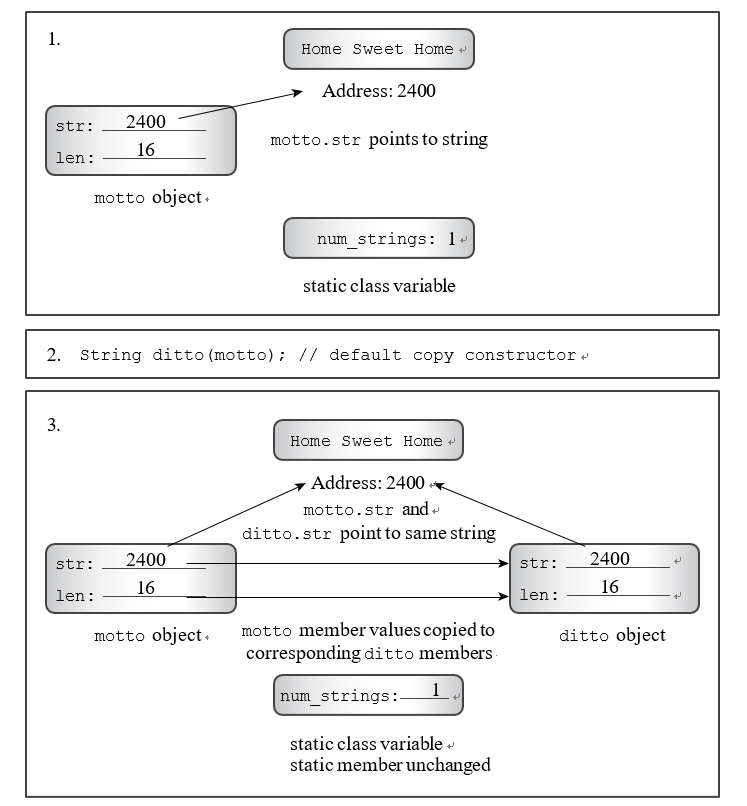

:warning:如果你的类有一个静态数据成员，其值在新对象创建时发生变化，你应该提供一个显式拷贝构造函数来处理这个问题

```c++
StringBad::StringBad(const StringBad &s) {
    len=s.len;
    str=new char[len+1];
    std::strcpy(str,s.str);
    num_strings++;
    cout<<num_strings<<":\""<<str<<"\"default object created\n";
}
```

如果一个类包含的成员是由new初始化的指针，你应该定义一个拷贝构造函数，拷贝指向的数据而不是拷贝指针本身。这就是所谓的深度拷贝。另一种复制形式（成员式复制，或浅层复制）只是复制指针值。浅层拷贝就是这样--浅层的 "刮掉 "指针信息进行拷贝，而不是更深入的 "挖掘 "来拷贝指针所指的结构。

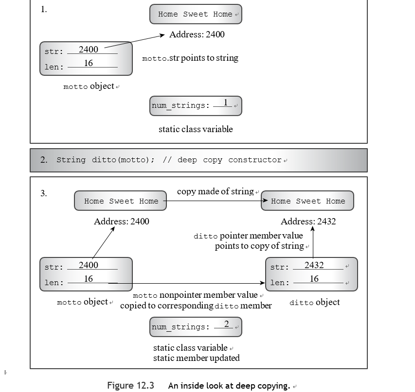

就像ANSI C允许结构赋值一样，C++允许类对象赋值。它通过自动重载一个类的赋值操作符来实现。这个操作符的原型如下

```c++
Class_name & Class_name::operator=(const Class_name &);
```

<span style="color:#FF6347">什么时候使用赋值运算符</span>:当你把一个对象分配给另一个存在的对象时，就会用到重载的赋值运算符

```c++
knot = headline1; // 调用赋值运算符
```

---

**NOTE**

在初始化一个对象时，不一定要使用赋值运算符：

```c++
StringBad metoo = knot; // 使用复制构造函数，也可能使用赋值。
```

这里metoo是一个新创建的对象，被初始化为knot的值；因此，使用了复制构造函数。然而，如前所述，实现可以选择分两步来处理这个语句：使用拷贝构造函数来创建一个临时对象，然后使用赋值来将值拷贝到新对象中。也就是说，初始化总是调用拷贝构造函数，使用=操作符的形式也可能调用赋值操作符。

一个隐含的赋值运算符的实现形成了一个成员到成员的拷贝。如果一个成员本身是某个类的对象，程序会使用为该类定义的赋值运算符来完成对该特定成员的复制。静态数据成员不受影响。

---

<span style="color:#FF6347">它的作用</span>：赋值


对于不恰当的默认赋值运算符所产生的问题的解决方案是提供你自己的赋值运算符定义，一个可以进行深度复制的赋值运算符。实现方式与复制构造函数类似，但有一些不同：

- 因为目标对象可能已经引用了以前分配的数据，该函数应该使用delete []来释放以前的义务。
- 该函数应该防止将一个对象分配给自己；否则，前面描述的释放内存可能会在对象被重新分配之前擦除其内容。
- 该函数返回一个对调用对象的引用。

```c++
StringBad &StringBad::operator=(const StringBad &s) {
    if(&s==this){
        return *this;
    }
    len=s.len;
    delete[] str;
    str=new char[len+1];
    std::strcpy(str,s.str);
    return  *this;
}
```


#### 新的、改进的字符串类

新的默认构造函数值得注意。它看起来像这样：

```c++

String::String(const String &s) {
    len=s.len;
    str=new char[len+1];
    str[0]='\0';
    num_strings++;
}
```

你可能想知道为什么代码中使用

```c++
str = new char[1];
```

而不是这样：

```c++
str = new char；
```

两种形式都分配了相同数量的内存。区别在于，第一种形式与类的析构器兼容，而第二种则不兼容。

:warning:使用delete []与使用new []初始化的指针和null指针兼容。


因此，另一种可能性是替换为

```c++
str = new char[1]；
str[0] = '\0'; // 默认字符串
```

换成这样：

```c++
str = 0; // 将str设为空指针。
```

在任何其他方式初始化的指针上使用delete []的效果是未定义的。

---

**C++11的空指针**

**在C++98中**，字面意义0有两种含义--它可以是数字值0，也可以是空指针--因此使读者和编译器很难区分这两种情况。有时程序员使用（void *）0来识别指针的版本。(空指针本身可能有一个非零的内部表示。) 其他程序员使用NULL，一个定义为代表空指针的C宏。然而，这被证明是一个不完整的解决方案。

C++11通过引入一个新的关键字nullptr来表示空指针，提供了一个更好的解决方案。你仍然可以像以前一样使用0--否则大量的现有代码就会失效--但从现在开始，建议使用nullptr来代替：

```c++
str = nullptr; // C++11的空指针符号
```

---


**比较函数**

```c++
bool operator<(const String &st, const String &st2){
    return std::strcmp(st.str,st2.str)<0;
}
bool operator>(const String &st1, const String &st2){
    return std::strcmp(st1.str,st2.str)>0;
}
bool operator==(const String &st, const String &st2){
    return std::strcmp(st.str,st2.str)==0;
}
```


**通过使用括号符号访问字符**

在C++中，两个括号符号构成了一个运算符，即括号运算符，你可以通过使用一个叫做operator\[]()的方法来重载这个运算符。通常，一个二元C++运算符（有两个操作数的运算符）将运算符放在两个操作数之间，如2+5，但括号运算符将一个操作数放在第一个括号的前面，另一个操作数放在两个括号之间。

因此，在表达式city[0]中，city是第一个操作数，[]是运算符，而0是第二个操作数。

```c++
char &String::operator[](int i) {
    return str[i];
}
```


假设你有一个常量对象：

```c++
const char &String::operator[](int i) const {
    return str[i];
}
```


**静态类成员函数**

我们可以将一个成员函数声明为静态的。(关键字static应该出现在函数声明中，而不是在函数定义中，如果后者是分离的）

```c++
static int HowMany() { return num_strings; }
```

这有两个重要的后果

- 静态成员函数不需要被一个对象调用，事实上，它甚至没有一个this指针可以使用。如果静态成员函数被声明在public部分，它可以被使用类名和范围解析操作符来调用。

```c++
int count = String::HowMany();
```

- 由于静态成员函数没有与特定的对象相关联，它能使用的唯一数据成员是静态数据成员。


**进一步的赋值运算符重载**

```c++
String name; 
char temp[40];
cin.getline(temp, 40);
name = temp; // use constructor to convert type
```

1.	该程序使用String(const char *)构造函数来构造一个临时的String对象，其中包含存储在temp中的字符串的副本。一个只有一个参数的构造函数可以作为一个转换函数。
2.	在本章后面的清单12.6中，程序使用String & String::operator=(const String &)函数将信息从临时对象复制到名称对象。
3.	程序调用~String()析构函数来删除临时对象。

使这个过程更有效率的最简单的方法是重载赋值运算符，使其直接与普通字符串一起工作。这就去除了创建和销毁临时对象的额外步骤。

```c++
String &String::operator=(const char* s) {
    if(str==s){
        return *this;
    }
    len=strlen(s);
    delete[] str;
    str=new char[len+1];
    std::strcpy(str,s);
    return  *this;
}
```


**用于新的字符串的内存**

String.hpp

```c++
class String
{
private:
    char * str;    // pointer to string
    int len;   // length of string
    static int num_strings;    // number of objects
    static const int CINLIM=80;//cin input limit
public:
    String(const char * s); // constructor
    String();  // default constructor
    ~String(); // destructor
    String(const String& s);
    String& operator=(const String&);
    String& operator=(const char* s);
// friend function
    friend std::ostream & operator<<(std::ostream & os,
                                     const String & st);
    int length () const { return len; }
    friend bool operator<(const String &st, const String &st2);
    friend bool operator>(const String &st1, const String &st2);
    friend bool operator==(const String &st, const String &st2);
    friend std::ostream & operator<<(std::ostream & os, const String & st);
    friend std::istream& operator>>(std::istream & is, String & st);
    char & operator[](int i);
    const char & operator[](int i) const;
    static int HowMany();
};
```


String.cpp

```c++
using std::cout;
int String::num_strings=0;

String::String() {
    len=1;
    str=new char[1];
    std::strcpy(str,"");
    num_strings++;
}

String::String(const char *s) {
    len = std::strlen(s);
    str=new char[len+1];
    std::strcpy(str,s);
    num_strings++;
}

String::~String(){
    num_strings--;
    delete []str;
}

std::ostream & operator<<(std::ostream & os,
                          const String & st){
    os<<st.str;
    return os;
}

String::String(const String &s) {
    len=s.len;
    str=new char[len+1];
    str[0]='\0';
    num_strings++;
}

String &String::operator=(const char* s) {
    if(str==s){
        return *this;
    }
    len=strlen(s);
    delete[] str;
    str=new char[len+1];
    std::strcpy(str,s);
    return  *this;
}

int String::HowMany() {
    return num_strings;
}

char &String::operator[](int i) {
    return str[i];
}

const char &String::operator[](int i) const {
    return str[i];
}

bool operator<(const String &st, const String &st2){
    return std::strcmp(st.str,st2.str)<0;
}
bool operator>(const String &st1, const String &st2){
    return std::strcmp(st1.str,st2.str)>0;
}
bool operator==(const String &st, const String &st2){
    return std::strcmp(st.str,st2.str)==0;
}
std::istream& operator>>(std::istream & is, String & st){
    char temp[String::CINLIM];
    is.get(temp,String::CINLIM);
    if(is){
        st=temp;
    }
    while(is&&is.get()!='\n'){
        continue;
    }
    return is;
}


String& String::operator=(const String &s) {
    if(this==&s){
        return *this;
    }
    len=s.len;
    delete[] str;
    str=new char[len+1];
    strcpy(str,s.str);
    return *this;
}
```

:warning:旧版本的get(char *, int)在读取空行时不会评估为false。然而，对于这些版本，如果输入了一个空行，字符串中的第一个字符就是一个空字符。

```c++
const int ArSize = 10;
const int MaxLen =81;
int main()
    {
        using std::cout;
        using std::cin;
        using std::endl; String name;

        cout <<"Hi, what's your name?\n>> ";
        cin >> name;

        cout << name << ", please enter up to " << ArSize
             << " short sayings <empty line to quit>:\n";
        String sayings[ArSize];    // array of objects
        char temp[MaxLen]; // temporary string storage
        int i;
        for (i = 0; i < ArSize; i++)
        {
            cout << i+1 << ": ";
            cin.get(temp, MaxLen);
            while (cin && cin.get() != '\n')
                continue;
            if (!cin || temp[0] == '\0')   // empty line?
               break;  // i not incremented
            else sayings[i] = temp; // overloaded assignment
        }
        int total = i; // total # of lines read

        if ( total > 0)
        {
            cout << "Here are your sayings:\n";
            for (i = 0; i < total; i++)
                cout << sayings[i][0] << ": " << sayings[i] << endl;

            int shortest = 0;
            int first = 0;
            for (i = 1; i < total; i++)
            {
                if (sayings[i].length() < sayings[shortest].length()) shortest = i;
                if (sayings[i] < sayings[first])
                    first = i;
            }
            cout << "Shortest saying:\n" << sayings[shortest] << endl;
            cout << "First alphabetically:\n" << sayings[first] << endl;
            cout << "This program used "<< String::HowMany()<< " String objects. Bye.\n";
        }
        else
            cout << "No input! Bye.\n";
    return 0;
}
```


#### 在构造函数中使用new时应注意的事项

- 如果你在构造函数中使用new来初始化一个指针成员，你应该在析构函数中使用delete。
- new和delete的使用应该是兼容的，你应该把new和delete搭配在一起 和new [] 与delete [] 。
- 如果有多个构造函数，所有的构造函数都应该以同样的方式使用new--要么都带括号，要么都不带括号。只有一个析构函数，所以所有的构造函数都必须与该析构函数兼容。然而，允许在一个构造函数中用new初始化一个指针，而在另一个构造函数中用空指针（0，或者，在C++11中，nullptr），因为对空指针应用删除操作（带或不带括号）是可以的。
- 你应该定义一个拷贝构造函数，通过做深度拷贝将一个对象初始化为另一个对象。
- 你应该定义一个赋值运算符，通过做深度复制将一个对象复制到另一个对象。

特别是，该方法应该检查自我分配；它应该释放成员指针所指向的内存；它应该复制数据，而不仅仅是数据的地址；它应该返回一个对调用对象的引用。

- 

---

NULL或0或nullptr？

空指针可以用0或NULL来表示，NULL是一个符号常数，在一些头文件中被定义为0。C语言程序员经常使用NULL代替0，以直观地提醒这个值是一个指针值，就像他们用'\0'代替0表示空字符，以直观地提醒这个值是一个字符。然而，C++的传统倾向于使用简单的0而不是等价的NULL。而且，正如前面提到的，C++11提供了nullptr关键字作为一个更好的选择。

---


**对有类成员的类进行成员式复制**

假设你使用String类，或者，标准的字符串类作为类成员的类型：
```c++
class Magazine
{
private:
    String title; 
    string publisher;
    ...
};
```

默认的成员式复制和赋值行为确实有一些智能。如果你把一个Magazine对象复制或赋值给另一个，成员式复制会使用为成员类型定义的复制构造函数和赋值运算符。也就是说，字符串复制构造函数将被用来把title成员从一个Magazine对象复制到另一个，字符串赋值运算符将被用来把一个Magazine对象的title成员赋值给另一个，等等。


###### 关于返回对象的观察

当一个成员函数或独立函数返回一个对象时，你有一些选择。该函数可以返回一个对象的引用，一个对象的常数引用，一个对象，或一个常数对象。


**返回对一个常量对象的引用**

使用常量引用的通常原因是效率，但在什么时候可以使用这种选择是有限制的。

如果一个函数返回一个被传递给它的对象，无论是通过对象调用还是作为方法参数，你可以通过让它返回一个引用来提高方法的效率。

- 返回一个对象会调用复制构造函数，而返回一个引用则不会这样做。
- 引用应该是调用函数执行时存在的一个对象。
- v1和v2都被声明为常量引用，所以返回类型必须是常量才行。


**返回一个非常量对象的引用**

重载赋值运算，重载<<运算。


**返回一个对象**

如果被返回的对象是被调用函数的本地对象，那么它不应该通过引用返回，因为本地对象在函数终止时被调用了它的析构器。因此，当控制权返回到调用函数时，没有对象可以被引用。在这种情况下，你应该返回一个对象，而不是一个引用。

通常情况下，重载的算术运算符就属于这种情况。


**返回一个常量对象**

 Vector::operator+()的定义有一个奇异的属性。

预期的用途是这样的：

```c++
net = force1 + force2;	// 1: three Vector objects
```

然而，该定义也允许你使用以下方式：

```c++
force1 + force2 = net; // 2: dyslectic编程 
cout << (force1 + force2 = net).magval() << endl; // 3: 痴呆的编程
```

首先，写这样的代码没有合理的理由，但不是所有的代码都是出于合理的理由。人们，甚至是程序员，都会犯错误。

其次，这段代码是可能的，因为复制构造函数构造了一个临时对象来表示返回值。所以在前面的代码中，表达式 force1 + force2 代表了那个临时对象。在语句1中，这个临时对象被分配给net。在语句2和3中，net被分配给临时对象。

第三，临时对象被使用，然后被丢弃。例如，在语句2中，程序计算力1和力2的总和，将答案复制到临时返回对象中，用net的内容覆盖其内容，然后丢弃临时对象，原始向量都没有改变。

如果你担心这种行为所产生的潜在的误用和滥用，你有一个简单的补救措施： 将返回类型声明为一个常量对象。例如，如果Vector::operator+()被声明为返回类型为const Vector，那么语句1仍然被允许，但语句2和3就无效了。

<div style='box-shadow: rgba(0, 0, 0, 0.15) 1.95px 1.95px 2.6px;border-radius: 4px; padding:0.7em;background-color:#D3D3D3;'>总之，如果一个方法或函数返回一个本地对象，它应该返回一个对象，而不是一个引用。在这个例子中，程序使用复制构造函数来生成返回的对象。如果一个方法或函数返回一个没有公共拷贝构造函数的类的对象，如ostream类，它必须返回一个对象的引用。最后，一些方法和函数，如重载的赋值运算符，可以返回一个对象或一个对象的引用。在这个例子中，由于效率的原因，引用是首选。</div>


#### 使用指向对象的指针

```c++
int main()
    {
        using std::cout;
        using std::cin;
        using std::endl; String name;

        cout <<"Hi, what's your name?\n>> ";
        cin >> name;

        cout << name << ", please enter up to " << ArSize
             << " short sayings <empty line to quit>:\n";
        String sayings[ArSize];    // array of objects
        char temp[MaxLen]; // temporary string storage
        int i;
        for (i = 0; i < ArSize; i++)
        {
            cout << i+1 << ": ";
            cin.get(temp, MaxLen);
            while (cin && cin.get() != '\n')
                continue;
            if (!cin || temp[0] == '\0')   // empty line?
               break;  // i not incremented
            else sayings[i] = temp; // overloaded assignment
        }
        int total = i; // total # of lines read

        if ( total > 0)
        {
            cout << "Here are your sayings:\n";
            for (i = 0; i < total; i++)
                cout << sayings[i] << "\n";

            String* shortest = &sayings[0];
            String* first = &sayings[0];
            for (i = 1; i < total; i++)
            {
                if (sayings[i].length() < shortest->length()) shortest = &sayings[i];
                if (sayings[i] < *first)
                    first = &sayings[i];
            }
            cout << "Shortest saying:\n" << *shortest << endl;
            cout << "First alphabetically:\n" << *first << endl;
            srand(time(0));
            int choice=rand()%total;
            String* favorite = new String(sayings[choice]);
            cout<<"My favorite saying:\n"<<*favorite<<'\n';
            delete  favorite;
        }
        else
            cout << "Not much to say, eh?\n";
        cout << "Bye.\n";
    return 0;
}
```

---

**用new进行对象初始化**

一般来说，如果Class_name是一个类，如果value是Type_name类型的，那么语句

```c++
Class_name * pclass = new Class_name(value); 
```

调用这个构造函数：

```c++
Class_name(Type_name);
```

可能会有一些琐碎的转换，比如说这样的转换：

```c++
Class_name(const Type_name &)；
```

还有由原型匹配调用的通常的转换，比如从int到double，只要没有歧义就会发生。

以下形式的初始化调用了默认的构造函数：

```c++
Class_name * ptr = new Class_name;
```


**在下列情况下会调用析构器**

- 如果一个对象是一个自动变量，当程序退出定义该对象的块时，该对象的析构器就会被调用。
- 如果一个对象是静态变量（外部、静态、静态外部或来自命名空间），它的析构器在程序终止时被调用。
- 如果一个对象是由new创建的，那么它的析构器只有在你明确使用

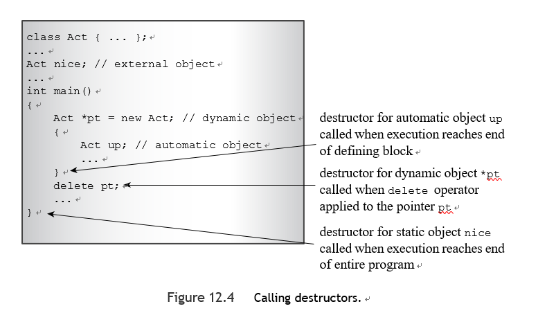


**你应该注意到关于使用对象的指针的几个要点**

- 你通过使用通常的符号来声明一个指向对象的指针

```c++
String * glamour;
```

- 你可以初始化一个指针，使其指向一个现有的对象
- 你可以通过使用new来初始化一个指针
- 在一个类中使用new会调用相应的类构造函数来初始化新创建的对象

```c++
//调用默认构造函数 
String * gleep = new String；

//调用String(char *)构造函数 
String * glop = new String("my my my")；
 
//调用String(const String &)构造函数 
String * favorite = new String(sayings[choice])；
```

- 你使用->操作符来通过指针访问一个类方法
- 你将解除引用操作符（*）应用于一个对象的指针，以获得一个对象

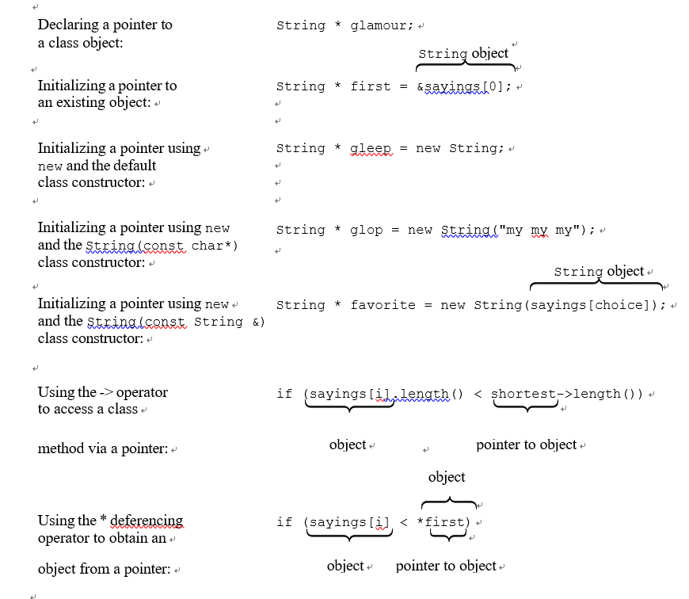


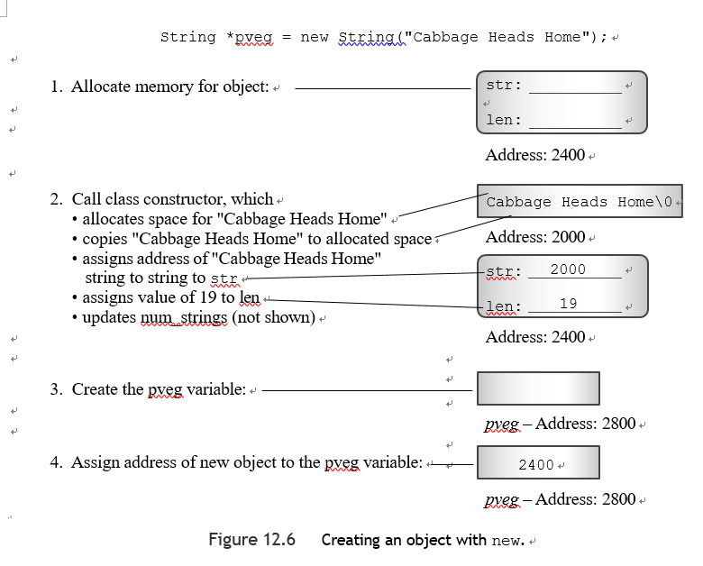

**回顾定位new**

回顾一下，放置new允许你指定用于分配内存的内存位置。在对象中使用定位new，会有一些新的变化。

```c++
class JustTesting{
private:
    string words;
    int number;
public:
    JustTesting(const string& s="Just Testing",int n=0)
    {
        words=s;
        number=n;
        cout << words << " constructed\n";
    }
    ~JustTesting(){
        cout << words << " destroyed\n";
    }

    void show() const
    {
        cout<<words<<","<<number<<endl;
    }
};

int main(){
    char* buffer=new char[BUF];
    JustTesting *pc1,*pc2;
    pc1=new(buffer)JustTesting;
    pc2=new JustTesting("Heap1",20);

    cout << "Memory block addresses:\n" << "buffer: "
         << (void *) buffer << "   heap: " << pc2 <<endl;
    cout << "Memory contents:\n";
    cout << pc1 << ": ";
    pc1->show();
    cout << pc2 << ": ";
    pc2->show();

    JustTesting *pc3,*pc4;
    pc3 = new(buffer)JustTesting("Bad Idea",6);
    pc4 = new JustTesting("Heap2",10);
    cout << "Memory contents:\n";
    cout << pc3 << ": ";
    pc3->show();
    cout << pc4 << ": ";
    pc4->show();

    delete pc2;
    delete pc4;
    delete[] buffer;
    cout << "Done\n";
    return 0;
}
```

> Just Testing constructed
> Heapl constructed
> Memory block addresses:buffer: 0xd9lac0
> heap: 0xd91750
> Memory contents:
> )xd9lac0: Just Testing,00xd91750: Heap1,20
> Bad Idea constructed
> Heap2 constructed
> Memory contents:
> 0xd9lac0: Bad Idea,6
> 0xd91cd0: Heap2,10
> destroyed
> Heapl
> Heap2
> destroyed
> Done

使用的placement new有几个问题:

- 当创建第二个对象时，placement new简单地用一个新的对象覆盖了用于第一个对象的相同位置。

如果这个类对其成员使用动态内存分配，就会产生真正的问题。

- 在 pc2 和 pc4 中使用 delete 会自动调用 pc2 和 pc4 所指向的两个对象的析构器。但是在buffer中使用delete []并不会调用用place new创建的对象的析构器。

```c++
pc1 = new (buffer) JustTesting;
pc3 = new (buffer + sizeof (JustTesting)) JustTesting("Better Idea", 6);
```

<div style='box-shadow: rgba(0, 0, 0, 0.15) 1.95px 1.95px 2.6px;border-radius: 4px; padding:0.7em;background-color:#D3D3D3;'>这取决于你如何管理放置new填充的缓冲区中的内存位置。
要使用两个不同的位置，你要在缓冲区内提供两个不同的地址，确保这些位置不会重叠。如果你使用place new来存储对象，你需要安排它们的析构器被调用</div>

```c++
delete pc1;	// delete object pointed to by pc1? NO! 
delete pc3;	// delete object pointed to by pc3? NO!
```

:warning:delete 与 new 一起工作，但与 placement new 不一样

> 指针pc3没有收到new返回的地址，所以delete pc3会抛出一个运行时错误。另一方面，指针pc1的数值与buffer相同，但buffer是用new []初始化的，所以它是用delete []释放的，而不是delete。即使buffer是用new而不是new []初始化的，delete pc1也会释放buffer而不是pc1。
>
> 这是因为new/delete系统知道被分配的256字节的块，但它不知道任何关于放置new对该块的作用。
> 

```c++
 delete [] buffer; 
```

删除new分配的整个内存块。但它并没有调用任何在该块中放置new结构体的对象的析构器。


**解决这个难题的方法是，你必须为任何通过放置new创建的对象明确地调用析构器。**

通常情况下，析构器是自动调用的；这是需要显式调用的少数情况之一。明确调用一个析构器需要确定要销毁的对象。

```c++
pc3->~JustTesting(); // destroy object pointed to by pc3 
pc1->~JustTesting(); // destroy object pointed to by pc1
```


main.cpp

```c++
class JustTesting{
private:
    string words;
    int number;
public:
    JustTesting(const string& s="Just Testing",int n=0)
    {
        words=s;
        number=n;
        cout << words << " constructed\n";
    }
    ~JustTesting(){
        cout << words << " destroyed\n";
    }

    void show() const
    {
        cout<<words<<","<<number<<endl;
    }
};

int main(){
    char* buffer=new char[BUF];
    JustTesting *pc1,*pc2;
    pc1=new(buffer)JustTesting;
    pc2=new JustTesting("Heap1",20);

    cout << "Memory block addresses:\n" << "buffer: "
         << (void *) buffer << "   heap: " << pc2 <<endl;
    cout << "Memory contents:\n";
    cout << pc1 << ": ";
    pc1->show();
    cout << pc2 << ": ";
    pc2->show();

    JustTesting *pc3,*pc4;
    pc3 = new(buffer+sizeof(JustTesting))JustTesting("Bad Idea",6);
    pc4 = new JustTesting("Heap2",10);
    cout << "Memory contents:\n";
    cout << pc3 << ": ";
    pc3->show();
    cout << pc4 << ": ";
    pc4->show();

    pc3->~JustTesting();
    delete pc2;
    pc1->~JustTesting();
    delete pc4;

    delete[] buffer;
    cout << "Done\n";
    _mywait();
    return 0;
}
```


#### 回顾技术

###### 重载<<操作符

```c++
ostream & operator<<(ostream & os, const c_name & obj)
{
os << ... ; // display object contents return os;
}
```

这里c_name代表类的名称。如果该类提供了返回所需内容的公共方法，你可以在operator函数中使用这些方法，并省去好友状态。


###### 转换函数

为了将一个单一的值转换为一个类的类型，你创建了一个类的构造函数，其原型如下：

```c++
c_name(type_name value)；
```

这里c_name代表类的名称，type_name代表你要转换的类型的名称。


为了将一个类的类型转换为其他类型，你可以创建一个类成员函数，其原型如下：

```c++
operator type_name();
```

尽管这个函数没有声明的返回类型，但它应该返回一个所需类型的值。 记住要小心使用转换函数。你可以在声明构造函数时使用关键字 explicit 来防止它被用于隐式转换。


###### 构造函数使用new的类

在设计使用new操作符分配类成员指向的内存的类时，你需要采取几项预防措施：

- 任何指向由new分配的内存的类成员都应该在类的description中应用delete 操作符。这将释放分配的内存。
- 如果一个析构器通过对作为类成员的指针应用delete来释放内存，那么该类的每个构造函数都应该初始化该指针，要么使用new，要么将该指针设置为空指针。
- 如果构造函数使用new []，那么析构函数应该使用delete []，如果构造函数使用new，那么它应该使用delete。
- 你应该定义一个复制构造函数，分配新的内存，而不是复制一个指向现有内存的指针。这使得程序可以将一个类对象初始化为另一个类对象。构造函数通常应该有以下原型：

```c++
className(const className &)
```

- 你应该定义一个类的成员函数，该函数重载了赋值运算符，并且有一个具有如下原型的函数定义

```c++
c_name & c_name::operator=(const c_name & cn)
{
if (this == & cn)
    return *this;	// done if self-assignment 
delete [] c_pointer;
// set size number of type_name units to be copied 
    c_pointer = new type_name[size];
// then copy data pointed to by cn.c_pointer to
// location pointed to by c_pointer
...
return *this;
}

```


#### 一个队列的模拟

队列是一个抽象的数据类型（ADT），它持有一个有序的项目序列。新的项目被添加到队列的后面，而项目可以从前面删除。队列有点像堆栈，只是堆栈的添加和删除在同一端。这使得堆栈是后进先出（LIFO）结构，而队列是先进先出（FIFO）结构。

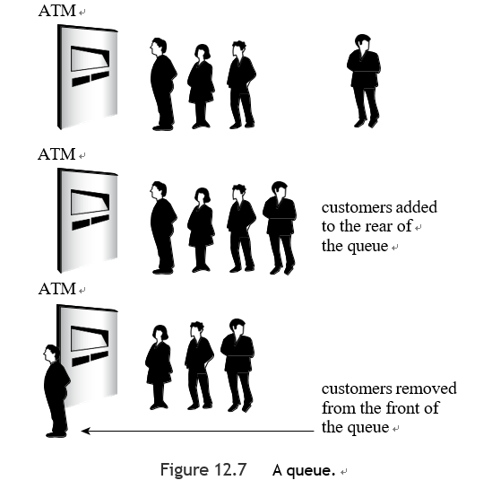

```c++
typedef int Item;
struct Node{
    Item item;
    Node* next;
    Node(Item i):item(i),next(nullptr){}
};
class Queue
{
    enum {Q_SIZE = 10};
private:
// private representation to be developed later
public:
    Queue(int qs = Q_SIZE); // create queue with a qs limit
    ~Queue();
    bool isempty() const;
    bool isfull() const;
    int queuecount() const;
    bool enqueue(const Item &item); // add item to end
    bool dequeue(Item &item);  // remove item from front
};
```

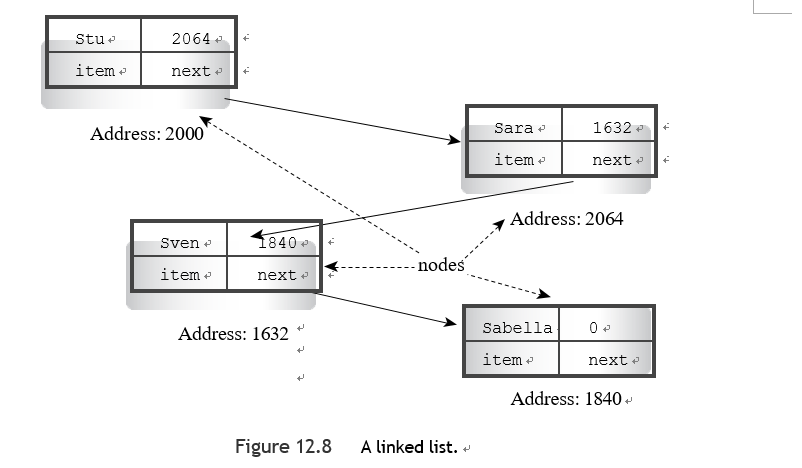

在图12.8中展示的例子被称为单链表，因为每个节点只有一个指向另一个节点的指针。如果你有第一个节点的地址，你可以通过指针依次访问每个后续节点。通常，链表中最后一个节点的指针设置为NULL（或等价地，0），表示没有更多的节点。在C++11中，应该使用新的nullptr关键字。

该声明使用了C++的能力，在一个类内嵌套一个结构或类的声明。通过将 Node 声明放在 Queue 类中，你给了它一个类的范围。也就是说，Node 是一个类型，你可以用它来声明类成员，并在类方法中作为一个类型名，但这个类型只限于类。这样一来，你就不必担心Node的这个声明与一些全局声明或在其他类中声明的Node发生冲突。一些过时的编译器不支持嵌套结构和类。如果你的编译器不支持，那么你就必须全局地定义一个Node结构，给它一个文件范围。


**嵌套结构和类**

在类声明中声明的结构、类或枚举被称为嵌套在该类中。它具有类的范围。这样的声明并不创建一个数据对象。相反，它指定了一个可以在类内部使用的类型。如果声明是在类的私有部分进行的，那么声明的类型只能在该类中使用。如果声明是在公共部分进行的，那么声明的类型也可以在类外使用，通过使用范围解析操作符。

e.g.，如果 Node 是在 Queue 类的公共部分中声明的，那么你可以在 Queue 类之外声明 Queue::Node 类型的变量。

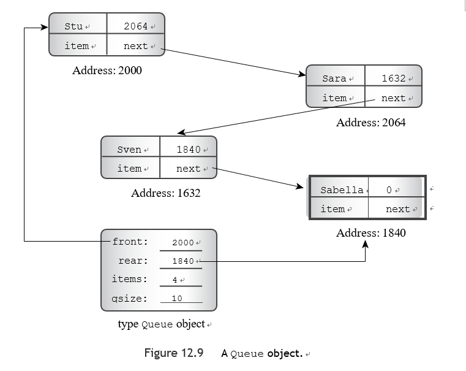

从概念上讲，调用构造函数是在执行括号内的代码之前创建一个对象。因此，调用Queue(int qs)构造函数导致程序首先为四个成员变量分配空间。然后，程序流进入构造函数大括号，并使用普通赋值将值放入分配的空间。因此，如果你想初始化一个常量数据成员，你必须在执行到构造函数的主体之前创建对象时这样做。C++提供了一种特殊的语法来做到这一点，它被称为成员初始化器列表。成员初始化器列表由逗号分隔的初始化器列表组成，前面有一个冒号，它被放在参数列表的小括号之后和函数主体的括号之前。

```c++
Queue::Queue(int qs):qsize(qs) {
    front=rear= nullptr;
    items=0;
}
```


该技术不限于初始化常量，你也可以这样写Queue的构造函数：

```c++
Queue::Queue(int qs):qsize(qs),front(nullptr),rear(nullptr),items(0) {
}
```

<span style="color:#FF6347">只有构造函数可以使用这种初始化器列表的语法,你也必须对被声明为引用的类成员使用这种语法。</span>这是因为引用，像const数据一样，只有在创建时才能被初始化。对于简单的数据成员，如front和items，使用成员初始化器列表或在函数体中使用赋值并无太大区别。对于本身是类对象的成员，使用成员初始化器列表更有效率。


**成员初始化器列表的语法**

- 这种形式只能在构造函数中使用。
- 必须（至少在C++11之前）使用这种形式来初始化一个非静态的常量数据成员。
- 必须使用这种形式来初始化一个引用数据成员。

数据成员的初始化是按照它们在类声明中出现的顺序进行的，而不是按照初始化器的排列顺序。

---

**Note**

在成员初始化器列表中使用的括号形式也可以在普通初始化中使用。

如果你愿意，你可以替换如下代码

```c++
int games = 162; double talk = 2.71828;
```

替换为

```c++
int games(162); double talk(2.71828)；
```

这允许初始化内置类型看起来像初始化类对象。


**C++11成员类内初始化**

C++11允许你做那些看起来很直观的事情：

```c++
class Classy
{
int mem1 = 10;	// in-class initialization 
const int mem2 = 20;  // in-class initialization
//...
};
```

这相当于在构造函数中使用一个成员初始化列表，成员mem1和mem2分别被初始化为10和20，除非使用成员初始化列表的构造函数被调用。然后实际的列表会覆盖这些默认的初始化：


```c++
bool Queue::enqueue(const Item &item) {
    if(isfull()){
        return false;
    }else{
        items++;
        if(isempty()){
            front=new Node(item);
            rear=front;
        }else{
            rear->next=new Node(item);
            rear=rear->next;
        }
        return true;
    }
}

```

该方法经历了以下阶段:

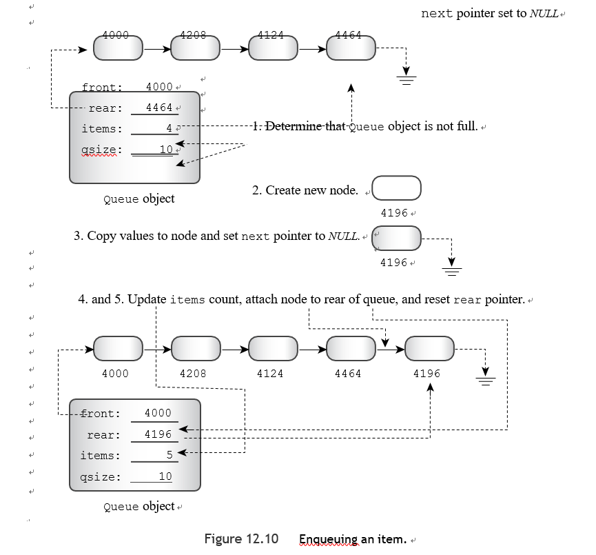

1. 如果队列已经满了就终止。
2. 创建一个新的节点。如果new不能这样做，它会抛出一个异常，实际的结果是，除非人们提供额外的程序来处理这个异常，否则程序就会终止。
3. 将适当的值放入节点。在这种情况下，代码将一个Item值复制到节点的数据部分，并将节点的下一个指针设置为NULL（或0，或者在C++11中，nullptr）.这就为节点成为队列中的最后一个item做好了准备。
4. 将item数（items）增加一个。
5. 将节点附加到队列的后部。

```c++
bool Queue::dequeue(Item &item) {
    if(isempty()){
        return false;
    }else{
        items--;
        item=front->item;
        Node* temp=front;
        front=front->next;
        if(isempty()){
            rear= nullptr;
        }
        delete temp;
        return true;
    }
}
```

简而言之，该方法经历了以下阶段：

1. 如果队列已经为空，则终止。
2. 向调用函数提供队列中的第一个item。这是通过将当前前面节点的数据部分复制到传递给该方法的引用变量中来完成的。
3. 将item数（items）减少一个。
4. 保存前面节点的位置以便以后删除
5. 将节点从队列中移除
6. 为了节省内存，删除以前的第一个节点
7. 如果列表现在是空的，把 rear 设置为 NULL

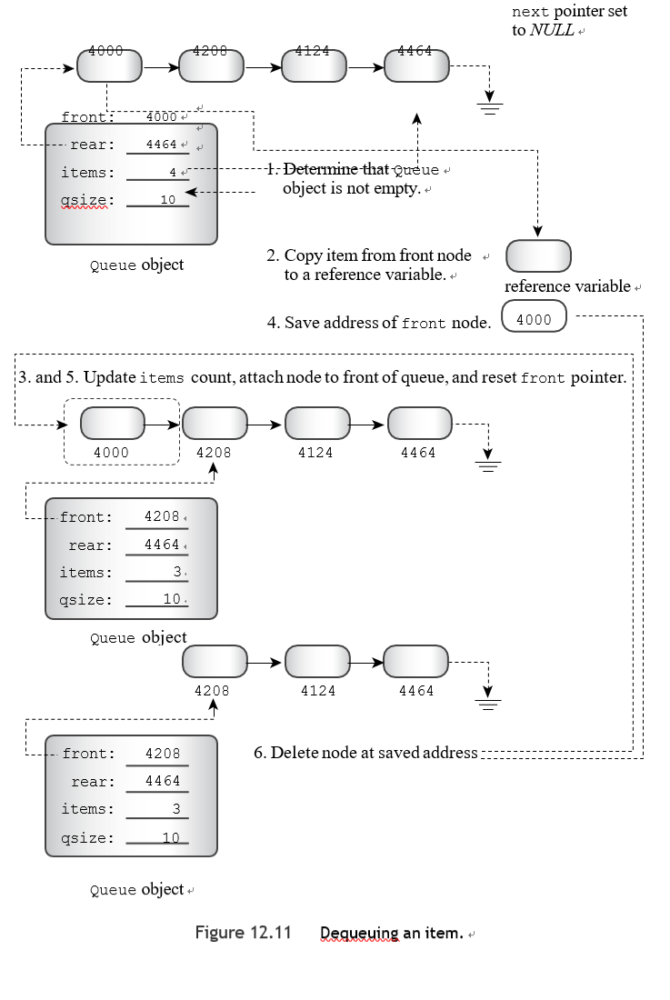


```c++
Queue::~Queue() {
    Node* temp;
    while(front!= nullptr){
        temp=front;
        front=front->next;
        delete temp;
    }
}
```


克隆或复制队列需要提供一个复制构造函数和一个赋值构造函数来进行深度复制，有一个偷偷摸摸的方法可以避免做这些额外的工作，同时还可以防止未来的程序崩溃。这个想法是把所需的方法定义为假的私有方法：

```c++
class Queue
{
private:
Queue(const Queue & q) : qsize(0) { }	// preemptive definition 
Queue & operator=(const Queue & q) { return *this;}
//...
};
```

这有两个效果：

- 它覆盖了默认的方法定义，否则会自动生成
- 因为这些方法是私有的，所以它们不能被整个世界使用

因此，你将得到一个更容易追踪的编译器错误，说明这些方法不可访问，而不是在将来面临神秘的运行时故障。另外，当你定义一个对象确实不应该被复制的类时，这个技巧也很有用。

:warning:C++11提供了另一种方法，通过使用关键字delete来禁用一个方法


Customer类

我们需要设计一个客户类。一般来说，一个ATM客户有很多属性，如姓名、账号和账户余额。

然而，你在模拟中需要的唯一属性是客户何时加入队列和客户交易所需的时间。当模拟产生一个新的客户时，程序应该创建一个新的客户对象，在其中存储客户的到达时间和随机产生的交易时间值。当客户到达队列前面时，程序应该记下时间并减去加入队列的时间，得到客户的等待时间。

```c++
class Customer
{
private:
    long arrive;	// arrival time for customer 
    int processtime;	// processing time for customer
 
public:
    Customer() { arrive = processtime = 0; } 
    void set(long when);
    long when() const { return arrive; }
    int ptime() const { return processtime; }
};

void Customer::set(long when)
{
    processtime = std::rand() % 3 + 1; arrive = when;
}

```


头文件

```c++
typedef int Item;

class Queue
{
    enum {Q_SIZE = 10};
private:
// private representation to be developed later
// class scope definitions
    struct Node{
        Item item;
        Node* next;
        Node(Item i):item(i),next(nullptr){}
    };
// Node is a nested structure definition local to this class struct Node { Item item; struct Node * next;};
// private class members
    Node * front;  // pointer to front of Queue
    Node * rear;   // pointer to rear of Queue
    int items; // current number of items in Queue
    const int qsize;   // maximum number of items in Queue
    Queue(const Queue & q) : qsize(0) { }  // preemptive definition
    Queue & operator=(const Queue & q) { return *this;}
public:
    Queue(int qs = Q_SIZE); // create queue with a qs limit
    ~Queue();
    bool isempty() const;
    bool isfull() const;
    int queuecount() const;
    bool enqueue(const Item &item); // add item to end
    bool dequeue(Item &item);  // remove item from front
};

class Customer
{
private:
    long arrive;   // arrival time for customer
    int processtime;   // processing time for customer

public:
    Customer() { arrive = processtime = 0; }
    void set(long when);
    long when() const { return arrive; }
    int ptime() const { return processtime; }
};
```


源代码文件

```c++
bool Queue::isempty() const {
    return items==0;
}

bool Queue::isfull() const {
    return items==qsize;
}

bool Queue::dequeue(Item &item) {
    if(isempty()){
        return false;
    }else{
        items--;
        item=front->item;
        Node* temp=front;
        front=front->next;
        if(isempty()){
            rear= nullptr;
        }
        delete temp;
        return true;
    }
}

bool Queue::enqueue(const Item &item) {
    if(isfull()){
        return false;
    }else{
        if(isempty()){
            front=new Node(item);
            rear=front;
        }else{
            rear->next=new Node(item);
            rear=rear->next;
        }
        items++;
        return true;
    }
}

int Queue::queuecount() const {
    return items;
}

Queue::~Queue() {
    Node* temp;
    while(front!= nullptr){
        temp=front;
        front=front->next;
        delete temp;
    }
}

Queue::Queue(int qs):qsize(qs),front(nullptr),rear(nullptr),items(0) {

}

void Customer::set(long when)
{
    processtime = std::rand() % 3 + 1;
    arrive = when;
}


```


自动取款机模拟

你现在有了ATM模拟所需的工具，该程序应允许用户输入三个数量：最大队列规模、程序将模拟的小时数以及每小时的平均客户数。该程序应使用一个循环，每个循环代表一分钟。

在每分钟的循环中，程序应做以下工作：

- 判断是否有新的顾客到来。如果是，如果有空间，就把顾客加入队列；否则，就把顾客赶走。
- 如果没有人被处理，从队列中取出第一个人。确定这个人已经等了多长时间，并将wait_time计数器设置为新顾客需要的处理时间。
- 如果有顾客正在被处理，则将wait_time计数器递减1分钟。
- 跟踪各种数量，如服务的顾客数量、被拒绝的顾客数量、排队等待的累计时间和累计队列长度。

当模拟周期结束后，程序应该报告各种统计结果

程序用这个函数来确定一个顾客是否在一个周期内出现：

```c++
bool newcustomer(double x)
{
return (std::rand() * x / RAND_MAX < 1);
}
```


main.cpp

```
const int MIN_PER_HR=60;
using std::string;
bool newcustomer(double x);
using std::vector;

int main(){
    using std::cin;
    using std::cout;
    using std::ios_base;
    std::srand(time(0));
    cout<<"Case Study:Bank of Heather Automatic Teller\n";
    cout<<"Enter maximum size of queue:";
    int qs;
    cin>>qs;
    Queue line(qs);
    cout<<"Enter the number of simulation hours:";
    int hours;
    cin>>hours;
    long cyclelimit = MIN_PER_HR*hours;
    cout<<"Enter the average number of customers per hour:";
    double perhour;
    cin>>perhour;
    double min_per_cust;
    min_per_cust=MIN_PER_HR/perhour;
    Item temp;
    long turnaways = 0;
    long customers = 0;
    long served = 0;
    long sum_line = 0;
    int wait_time=0;
    long line_wait=0;
    for(int cycle=0;cycle<cyclelimit;cycle++){
        if(newcustomer(min_per_cust)){
            if(line.isfull()){
                turnaways++;
            }else{
                customers++;
                temp.set(cycle);
                line.enqueue(temp);
            }
        }
        if(wait_time<=0&&!line.isempty()){
            line.dequeue(temp);
            wait_time=temp.ptime();
            line_wait+=cycle-temp.when();
            served++;
        }
        if(wait_time>0)
            wait_time--;
        sum_line+=line.queuecount();
    }

    if(customers>0){
        cout << "customers accepted: " << customers << '\n';
        cout << " customers served: " << served << '\n';
        cout << "  turnaways: " << turnaways << '\n';
        cout << "average queue size: ";
        cout.precision(2);
        cout.setf(ios_base::fixed, ios_base::floatfield);
        cout<<(double)sum_line/cyclelimit<<'\n';
        cout << " average wait time: "<< (double) line_wait / served << " minutes\n";
    }else
        cout << "No customers!\n";
    cout << "Done!\n";
    return 0;
}

bool newcustomer(double x){
    return (std::rand()*x/RAND_MAX<1);
}
```


