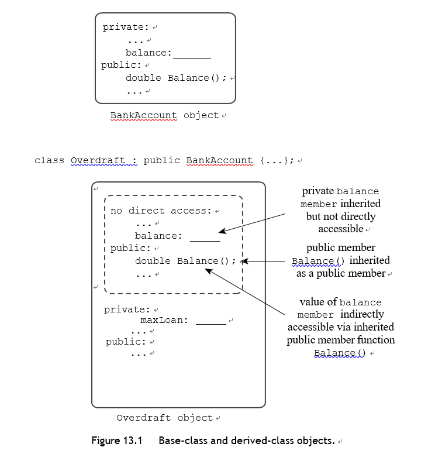
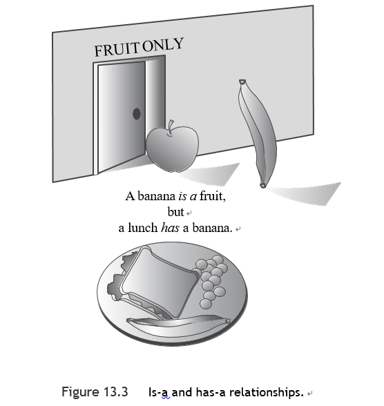
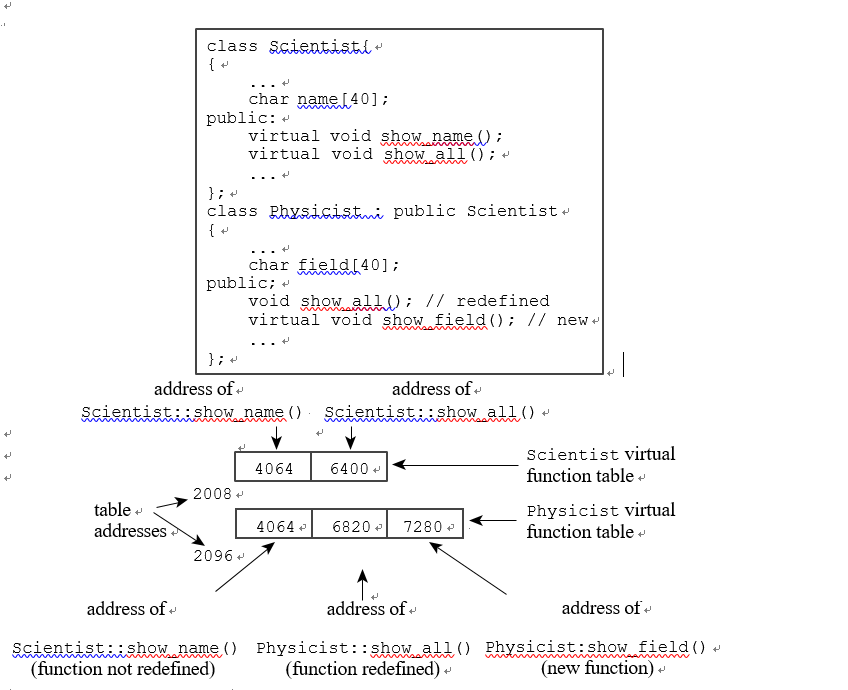
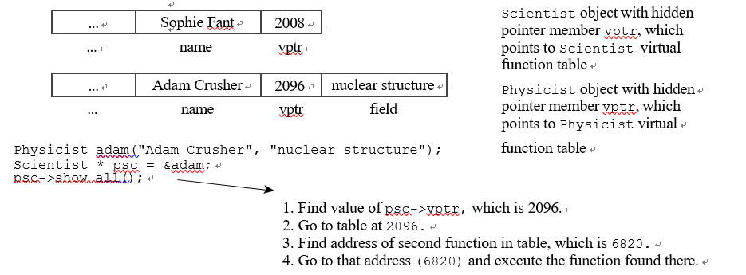

# 第十三章

[TOC]

#### 从SimpleBase类开始

面向对象编程的主要目标之一是提供可重用的代码。当你开发一个新的项目时，特别是在项目规模较大的情况下，能够重复使用已经验证过的代码而不是重新实现。

---

**Note**

**传统的C函数库**通过预定义的、预编译的函数，如strlen()和rand()，提供可重用性。许多供应商提供专门的C库，提供标准C库以外的功能。

<div style='box-shadow: rgba(0, 0, 0, 0.15) 1.95px 1.95px 2.6px;border-radius: 4px; padding:0.7em;background-color:#D3D3D3;'>例如，你可以购买数据库管理函数和屏幕控制函数库:<br>
功能库有一个限制： 除非供应商提供其库函数的源代码（通常它不提供），否则你不能扩展或修改这些函数以满足你的特殊需要。相反，你必须修改你的程序来满足库的工作原理，即使供应商提供了源代码，你也有可能无意中修改了部分函数的工作方式，或者在你添加改动时改变了库函数之间的关系。</div>


**C++类**带来了更高层次的可重用性，许多供应商现在提供类库，它由类的声明和实现组成。由于类将数据表示与类方法结合在一起，它比函数库提供了一个更为整体的包。

---


在扩展和修改类方面，C++有一种比代码修改更好的方法，这种方法叫做类的继承，让你从旧的类中派生出新的类，派生的类继承旧的类（称为基类）的属性，包括方法。

这里有一些可以用继承做的事情：

- 向现有的类添加功能
- 增加一个类所代表的数据

如，给定一个基本的字符串类，你可以派生出一个类，增加一个代表颜色的数据成员，以便在显示字符串时使用。

- 修改一个类方法的行为方式


继承机制允许你通过提供新的功能来进行。你甚至不需要访问源代码来派生一个类。因此，如果你购买了一个只提供头文件和类方法的编译代码的类库，你仍然可以在类库的基础上派生新的类。相反，你可以把你自己的类分发给其他人，对你的部分实现进行保密，但仍然让你的客户可以选择为你的类添加功能。

当一个类继承自另一个类时，原类被称为基类，而继承类被称为派生类。

e.g.Webtown社交俱乐部对打乒乓球的会员进行跟踪

头文件

```c++
using std::string;

class TableTennisPlayer{
private:
    string firstname;
    string lastname;
    bool hasTable;
public:
    TableTennisPlayer(const string& fn="none",const string &ln="none",bool ht= false);
    void Name() const;
    bool HasTable() const{return hasTable;}
    void ResetTable(bool v){hasTable=v;};
};
```

源代码文件

```c++
TableTennisPlayer::TableTennisPlayer(const std::string &fn, const std::string &ln, bool ht):
firstname(fn),lastname(ln),hasTable(ht) {}

void TableTennisPlayer::Name() const {
    std::cout<<lastname<<","<<firstname<<'\n';
}
```


造函数使用了第12章中介绍的成员初始化器列表语法，你也可以这样：

```c++
TableTennisPlayer::TableTennisPlayer (const string & fn,
const string & ln, bool ht)
{
firstname = fn; lastname = ln; hasTable = ht;
}
```

然而，这种方法的效果是首先为firstname调用默认的字符串构造函数，然后调用字符串赋值运算符将firstname重置为fn。 但成员初始化器列表语法节省了一个步骤，只需使用字符串复制构造函数将firstname初始化为fn。

main.cpp

```c++
int main() {
    using std::cout;
    TableTennisPlayer player1("Chunk","Blizzard", true);
    TableTennisPlayer player2("Tara","Boomdea", false);
    player1.Name();
    if(player1.HasTable()){
        cout<<":has a table.\n";
    }else{
        cout<<":hasn't a table.\n";
    }
    player2.Name();
    if(player2.HasTable()){
        cout<<":has a table.\n";
    }else{
        cout<<":hasn't a table.\n";
    }

    return 0;
}
```

该程序使用了具有C语言风格的字符串参数的构造函数：

```c++
TableTennisPlayer player1("Chuck", "Blizzard", true)； 
TableTennisPlayer player2("Tara", "Boomdea", false)；
```


但是构造函数的形式参数被声明为 const string & 类型。这是一个类型不匹配，但是字符串类有一个带有 const char * 参数的构造函数，该构造函数被自动用来创建一个由 C 型字符串初始化的字符串对象。


###### 派生一个类

Webtown 社交俱乐部的一些成员参加过当地的乒乓球比赛，他们要求有一个包括他们通过比赛获得的积分等级的类。与其从头开始，不如从 TableTennisPlayer 类派生出一个类。

```c++
class RatedPlayer:public TableTennisPlayer{
    
};

```

冒号表示 RatedPlayer 类是基于 TableTennisPlayer 类的，这个特殊的头部表示 TableTennisPlayer 是一个公共基类，这被称为公共派生。一个派生类的对象包含了一个基类对象。 通过公共派生，基类的公共成员成为派生类的公共成员。基类的私有部分成为派生类的一部分，但它们只能**通过基类的public和protected方法来访问**。

- 派生类型的对象在其内部存储了基类型的数据成员。(派生类继承了基类的实现）
- 派生类型的一个对象可以使用基类型的方法。(派生类继承了基类的接口）
- 派生类需要自己的构造函数
- 派生类可以根据需要增加额外的数据成员和成员函数



```c++
class RatedPlayer:public TableTennisPlayer{
private:
    unsigned int rating;
public:
    RatedPlayer(unsigned int r=0,const string &fn="none",const string& ln="none",bool ht= false);
    RatedPlayer(unsigned int r,const TableTennisPlayer &tp);
    unsigned int Rating() const{return rating;};
    void ResetRating(unsigned int r){rating=r;};
};
```


**构造函数： 访问方面的考虑**

派生类不能直接访问基类的私有成员，它必须通过基类的方法工作。他们必须使用公共基类方法来访问私有基类成员。特别是，派生类的构造函数必须使用基类的构造函数。

当一个程序构造一个派生类对象时，它首先构造基类对象。从概念上讲，这意味着基类对象应该在程序进入派生类构造函数的主体之前被构造出来，C++使用成员初始化器列表语法来实现这一点：

```c++
RatedPlayer::RatedPlayer(unsigned int r, const std::string &fn, const std::string &ln, bool ht):TableTennisPlayer(fn,ln,ht)//这是可执行代码，它调用了TableTennisPlayer构造函数
        {
            rating=r;
        }
```


必须先创建基类对象，所以如果你省略了对基类构造函数的调用，程序就会使用默认的基类构造函数。

```c++
RatedPlayer::RatedPlayer(unsigned int r, const string & fn, const string & ln, bool ht) // : TableTennisPlayer()
{
rating = r;
}
```

来看看第二个构造函数的代码：

```c++
RatedPlayer::RatedPlayer(unsigned int r, const TableTennisPlayer &tp):
        TableTennisPlayer(tp){
    rating=r;
}
```

因为tp是const TableTennisPlayer &的类型，这个调用调用了基类的拷贝构造函数。基类没有定义拷贝构造函数，但是回顾第12章，如果需要拷贝构造函数而你还没有定义的话，编译器会自动生成一个拷贝构造函数。在这种情况下，隐含的拷贝构造函数可以进行内存拷贝，因为该类并不直接使用动态内存分配。(字符串成员确实使用了动态内存分配，但是，回顾一下，成员复制将使用字符串类的复制构造函数来复制字符串成员。)

如果你愿意，你也可以对派生类的成员使用成员初始化器列表语法：

```c++
// alternative version
RatedPlayer::RatedPlayer(unsigned int r, const TableTennisPlayer & tp)
: TableTennisPlayer(tp), rating(r)
{}

```

这些是关于派生类的构造函数的关键点：

- 基类对象首先被构造
- 派生类构造函数应该通过一个成员初始化器列表将基类信息传递给基类构造函数
- 派生类构造函数应该初始化被添加到派生类中的数据成员

这个例子没有提供显式**析构函数**，所以使用了隐式析构函数。销毁一个对象的顺序与构造一个对象的顺序相反。也就是说，派生类的析构器的主体首先被执行，然后基类的析构器被自动调用。

该类可以使用同样的机制将信息传回给它的直接基类，以此类推。如果你没有在成员初始化器列表中提供一个基类的构造函数，程序会使用默认的基类构造函数。成员初始化器列表只能在构造函数中使用。

:warning:虚拟基类只能把值传回给它的直接基类


要使用一个派生类，程序需要访问基类的声明，你可以给每个类提供自己的头文件，但由于这两个类是相关的，将类的声明放在一起更有组织意义。

头文件

```c++
using std::string;

class TableTennisPlayer{
private:
    string firstname;
    string lastname;
    bool hasTable;
public:
    TableTennisPlayer(const string& fn="none",const string &ln="none",bool ht= false);
    void Name() const;
    bool HasTable() const{return hasTable;}
    void ResetTable(bool v){hasTable=v;};
};


class RatedPlayer:public TableTennisPlayer{
private:
    unsigned int rating;
public:
    RatedPlayer(unsigned int r=0,const string &fn="none",const string& ln="none",bool ht= false);
    RatedPlayer(unsigned int r,const TableTennisPlayer &tp);
    unsigned int Rating() const{return rating;};
    void ResetRating(unsigned int r){rating=r;};
};
```

你可以使用单独的文件，但把方法定义放在一起更简单。

源代码文件

```c++
TableTennisPlayer::TableTennisPlayer(const std::string &fn, const std::string &ln, bool ht):
firstname(fn),lastname(ln),hasTable(ht) {}

void TableTennisPlayer::Name() const {
    std::cout<<lastname<<","<<firstname;
}

RatedPlayer::RatedPlayer(unsigned int r, const TableTennisPlayer &tp):
        TableTennisPlayer(tp){
    rating=r;
}

RatedPlayer::RatedPlayer(unsigned int r, const std::string &fn, const std::string &ln, bool ht):
        TableTennisPlayer(fn,ln,ht){
    rating=r;
}
```

main.cpp

```
int main() {
    using std::cout;
    TableTennisPlayer player1("Tara","Boomdea", false);
    RatedPlayer rplayer1(1140,"Mallory","Duck",true);
    rplayer1.Name();
    if(rplayer1.HasTable()){
        cout<<": has a table.\n";
    }else{
        cout<<": hasn't a table.\n";
    }
    player1.Name();
    if(player1.HasTable()){
        cout<<": has a table.\n";
    }else{
        cout<<": hasn't a table.\n";
    }
    cout<<"Name: ";
    rplayer1.Name();
    cout<<";\nRating: "<<rplayer1.Rating()<<'\n';
    RatedPlayer rplayer2(1212,player1);
    cout<<"Name: ";
    rplayer2.Name();
    cout<<";\nRating: "<<rplayer2.Rating()<<'\n';
    return 0;
}
```


###### 派生类和基类之间的特殊关系

1.派生类对象可以使用基类的方法，只要这些方法不是私有的

2.基类指针可以指向派生类对象而不需要明确的类型转换

3.基类引用可以指向派生类对象而不需要明确的类型转换

```c++
RatedPlayer rplayer1(1140, "Mallory", "Duck", true); 
TableTennisPlayer & rt = rplayer;
TableTennisPlayer * pt = &rplayer; 
rt.Name();	// invoke Name() with reference 
pt->Name(); // invoke Name() with pointer
```

然而，基类的指针或引用只能调用基类的方法，所以你不能用rt或pt来调用，比如，派生类的ResetRanking()方法。

通常情况下，C++要求引用和指针类型与分配的类型相匹配，但这一规则在继承中被放松了。然而，这个规则的放松只是在一个方向上。你不能把基类对象和地址分配给派生类的引用和指针。

基类引用和指针可以引用派生类对象的事实有一些有趣的后果：

1.用基类引用或指针参数定义的函数可以用于基类或派生类对象

```c++
void Show(const TableTennisPlayer & rt)
{
    using std::cout; 
    cout << "Name: "; 
    rt.Name();
    cout << "\nTable: "; 
    if (rt.HasTable())
        cout << "yes\n"; 
    else
        cout << "no\n";
}
```

```c++
TableTennisPlayer player1("Tara", "Boomdea", false); 
RatedPlayer rplayer1(1140, "Mallory", "Duck", true); 
Show(player1);	// works with TableTennisPlayer argument 
Show(rplayer1); // works with RatedPlayer argument
```

引用兼容性属性也允许你**用派生类初始化基类**，尽管有些间接:

```c++
RatedPlayer olaf1(1840, "Olaf", "Loaf", true); 
TableTennisPlayer olaf2(olaf1);
```

初始化 olaf2 的精确匹配是一个具有此原型的构造函数：

```c++
TableTennisPlayer(const RatedPlayer &); // 并不存在
```

类的定义不包括这个构造函数，但是有一个隐式拷贝构造函数：

```c++
// implicit copy constructor 
TableTennisPlayer(const TableTennisPlayer &);
```

形式参数是对基类型的引用，所以它可以引用派生类型，它将嵌入在RatedPlayer对象olaf1中的TableTennisPlayer对象初始化为olaf2。


**一个派生类对象赋值给一个基类对象**：

```c++
RatedPlayer olaf1(1840, "Olaf", "Loaf", true); 
TableTennisPlayer winner;
winner = olaf1; // assign derived to base object
```

在这种情况下，程序使用了隐式重载赋值运算符：

```c++
TableTennisPlayer & operator=(const TableTennisPlayer &) const;
```


#### 继承：一种关系

派生类和基类之间的特殊关系是基于C++继承的基础模型。实际上，C++有三种类型的继承：公共的(public)、受保护的(protected)和私有的(private)

公有继承是最常见的形式，它建立了一种is-a的关系：这是一种简略的说法，即派生类的对象也应该是基类的一个对象，你对基类对象所做的任何事情，你都应该能够对派生类对象进行处理。因为派生类可以添加特征，所以将这种关系描述为is-a-kind-of关系可能更准确，但is-a是常用的术语。

为了澄清is-a关系，让我们看看一些不符合这种模式的例子：

**公共继承并没有建立一个has-a关系的模型**

例如，一个午餐可能包含一个水果。但一般来说，午餐不是水果。因此，你不应该从水果类派生出一个午餐类，以试图将水果放入午餐中,处理将水果放入午餐的正确方法是将此事视为一种has-a关系： 一个午餐有一个水果。



**公共继承并没有建立一个is-like a关系的模型**

也就是说，它不做比喻，人们经常指出，律师就像鲨鱼。但从字面上看，律师是鲨鱼并不是真的，例如，鲨鱼可以生活在水下，因此，你不应该从鲨鱼类派生出一个律师类。继承可以给基类增加属性，但不能从基类中删除属性，在某些情况下，共享特性可以通过设计一个包含这些特性的类来处理，然后用这个类，无论是以is-a还是has-a的关系，来定义相关的类。


**公共继承并不模拟一种 is-implemente-as-a的关系**

例如，你可以通过使用一个数组来实现一个堆栈。然而，从一个数组类派生出一个堆栈类是不合适的。堆栈不是一个数组。例如，数组的索引不是一个堆栈的属性。另外，堆栈也可以通过其他方式实现，比如使用一个链接列表。一个正确的方法是通过给堆栈一个私有的Array对象成员来隐藏数组的实现。


**公共继承并不模拟use-a关系**

例如，一台计算机可以使用一台激光打印机，但从计算机类派生出一个打印机类是没有意义的，反之亦然。不过，你可以设计一些友好函数或类来处理打印机对象和计算机对象之间的通信。

<div style='box-shadow: rgba(0, 0, 0, 0.15) 1.95px 1.95px 2.6px;border-radius: 4px; padding:0.7em;background-color:#D3D3D3;'>在C++语言中，没有任何东西可以阻止你使用公共继承来建立have-a、is-implemented-as-a或uses-a关系的模型。然而，这样做通常会导致编程问题。所以让我们坚持使用is-a关系。</div>


#### 公共继承的多态

但是你可能会遇到这样的情况：你希望一个方法在派生类中的表现与在基类中的表现不同。

也就是说，一个特定方法的行为方式可能取决于调用它的对象。这种更复杂的行为被称为多态性（"有多种形式"），因为你可以根据上下文为一个方法提供多种行为。

有两种关键机制可以实现多态性的公共继承：

- 在派生类中重新定义基类方法
- 使用虚拟方法

你利用你在Webtown社交俱乐部的经验，成为Pontoon国家银行的首席程序员。

银行要求你做的第一件事是开发两个类：

- 一个类将代表其基本支票计划，即 Brass 账户
- 第二个类将代表 Brass Plus 支票帐户，该帐户添加了透支保护功能：也就是说，如果用户开出的支票大于（但不能太大）他或她的余额，银行将支付该支票，向用户收取超出的款项并增加附加费。

首先，以下是黄铜账户支票计划的信息：

- 客户姓名
- 帐户号码
- 当前余额

下面是要表示的操作：

- 创建一个账户
- 将钱存入账户
- 从账户中取款
- 显示账户信息


对于Brass Plus账户支票计划，Pontoon国家银行希望获得Brass账户的所有功能，以及以下额外的信息项目：

- 透支保护的上限
- 透支贷款的利率
- 目前欠银行的透支金额

不需要额外的操作，但有两项操作需要以不同的方式实施：

- 提款操作必须包括黄铜附加账户的透支保护
- 显示操作必须显示Brass Plus账户所需的额外信息


开发黄铜和黄铜Plus类

黄铜账户类的信息是很直接的，但银行还没有告诉你关于透支系统如何运作的足够细节。在回答你关于进一步信息的要求时，友好的Pontoon国家银行代表告诉你如下：

- Brass Plus账户限制了银行借给你多少钱来支付透支。默认值是500美元，但有些客户开始时可能有不同的限额
- 银行可以改变客户的透支限额
- Brass Plus账户对贷款收取利息。默认值为11.125%，但有些客户开始时可能有不同的利率
- 银行可以改变客户的利率
- 录了客户欠银行的金额（透支贷款加利息）
- 用户不能通过定期存款或从其他账户转账来偿还这笔款项。相反，他或她必须用现金支付给一个特殊的银行官员，如果有必要，他将寻找客户，当债务被支付后，该账户可以将欠款金额重置为0。

最后一个特征对于银行来说是一种不寻常的经营方式，但它有一个幸运的副作用，那就是使编程问题更简单。

这个列表表明，新类需要提供账户信息的构造函数，包括默认值为500美元的债务限额和默认值为11.125%的利率。

```c++
class Brass{
private:
    std::string fullName;
    long acctNum;
    double balance;
public:
    Brass(const std::string& s="Nullbody",long an=-1,double bal=0.0);
    void deposit(double amt);
    virtual void withdraw(double amt);
    double Balance() const;
    virtual void ViewAcct() const;
    virtual ~Brass(){};
};

class BrassPlus:public Brass{
private:
    double maxLoan;
    double rate;
    double owesBank;
public:
    BrassPlus(const std::string s="Nullbody",long an=-1,
              double bal=0.0,double ml=500,double rt=0.11125);
    BrassPlus(const Brass & ba, double ml=500, double rt=0.11125);
    virtual void ViewAcct() const override;
    virtual void withdraw(double amt) override;
    void ResetMax(double m){maxLoan=m;};
    void ResetRate(double r){rate=r;};
    void ResetOwes(double o){owesBank=o;}
};

```

如果你不使用关键字virtual，程序会根据引用类型或指针类型选择一个方法。如果你使用了关键字virtual、 程序就会根据引用或指针所指的对象类型来选择方法。

```c++
// 非虚拟的ViewAcct()的行为
//根据引用类型选择的方法 
Brass dom("Dominic Banker", 11224, 4183.45)；
BrassPlus dot("Dorothy Banker", 12118, 2592.00)； 
Brass & b1_ref = dom；
Brass & b2_ref = dot；
b1_ref.ViewAcct(); // 使用 Brass::ViewAcct() 
b2_ref.ViewAcct(); // 使用Brass::ViewAcct()

```

引用变量是Brass类型，所以选择Brass::ViewAccount()。使用指向Brass的指针而不是引用，会产生类似的行为。

```c++
// 使用虚拟ViewAcct()的行为
//根据对象类型选择方法 Brass dom("Dominic Banker", 11224, 4183.45)；
BrassPlus dot("Dorothy Banker", 12118, 2592.00); Brass & b1_ref = dom；
Brass & b2_ref = dot；
b1_ref.ViewAcct(); // 使用 Brass::ViewAcct() 
b2_ref.ViewAcct(); // 使用BrassPlus::ViewAcct()
```

在这种情况下，两个引用都是Brass类型的，但b2_ref指的是一个BrassPlus对象，所以BrassPlus::ViewAcct()被用于它。使用指向Brass的指针而不是引用，会产生类似的行为。


当一个方法在基类中被声明为虚拟时，它在派生类中就会自动成为虚拟的，但在派生类的声明中使用关键字virtual来记录哪些函数是虚拟的，这是一个好主意。

---

**Note**

如果你在派生类中重新定义了一个基类方法，通常的做法是将基类方法声明为虚。这使得程序根据对象类型而不是引用或指针的类型来选择方法的版本。通常的做法也是为基类声明一个虚拟的析构器。

---


实现

```c++
using std::cout;
typedef std::ios_base::fmtflags format;
typedef std::streamsize precis;
format setFormat();
void restore(format f,precis p);

Brass::Brass(const std::string &s, long an, double bal) {
    fullName=s;
    acctNum=an;
    balance=bal;
}
void Brass::deposit(double amt) {
    if(amt<0){
        cout << "Negative deposit not allowed; "
             << "deposit is cancelled.\n";
    }else{
        balance+=amt;
    }
}

void Brass::withdraw(double amt) {
    format initialState = setFormat();
    precis prec = cout.precision(2);
    if(amt<0){
        cout << "Withdrawal amount must be positive; "
                << "withdrawal canceled.\n";
    }else if(amt>balance){
        cout << "Withdrawal amount of $" << amt
             << " exceeds your balance.\n"
             << "Withdrawal canceled.\n";
    }else{
        amt-=balance;
    }
    restore(initialState, prec);
}

double Brass::Balance() const {
    return balance;
}

void Brass::ViewAcct() const {
    format initialState=setFormat();
    precis  prec=cout.precision(2);
    cout << "Client: " << fullName << '\n';
    cout << "Account Number: " << acctNum << '\n';
    cout << "Balance: $" << balance << '\n';
    restore(initialState,prec);
}

void BrassPlus::ViewAcct() const {
    format initialState=setFormat();
    precis  prec=cout.precision(2);
    Brass::ViewAcct();	// display base portion
    cout << "Maximum loan: $" << maxLoan << '\n';
    cout << "Owed to bank: $" << owesBank << '\n';
    cout.precision(3); // ###.### format
    cout << "Loan Rate: " << 100 * rate << "%\n";
    restore(initialState,prec);
}

void BrassPlus::withdraw(double amt) {
    format initialState = setFormat();
    precis prec = cout.precision(2);
    double bal=Balance();
    if(amt<bal){
        Brass::withdraw(amt);
    }else if(amt<bal+maxLoan-owesBank){
        double advance=amt-bal;
        owesBank+=advance*(1.0+rate);
        cout << "Bank advance: $" << advance << '\n';
        cout << "Finance charge: $" << advance * rate << '\n';
        deposit(advance);
        Brass::withdraw(amt);
    }else{
        cout << "Credit limit exceeded. Transaction cancelled.\n";
    }
    restore(initialState,prec);
}

BrassPlus::BrassPlus(const std::string s,  long an, double bal, double ml, double rt): Brass(s,an,bal){
    maxLoan=ml;
    rate=rt;
    owesBank=0.0;
}

BrassPlus::BrassPlus(const Brass &ba, double ml, double rt): Brass(ba) {
    maxLoan=ml;
    rate=rt;
    owesBank=0.0;
}

format setFormat(){
    return cout.setf(std::ios_base::fixed,
                     std::ios_base::floatfield);
}

void restore(format f,precis p){
    cout.setf(f, std::ios_base::floatfield);
    cout.precision(p);
}
```

:warning:请记住，派生类不能直接访问基类的私有数据；派生类必须使用基类的公共方法来访问这些数据。


main.cpp

```c++
int main() {
    using std::cout;
    Brass Piggy("Porcelot Pigg", 381299, 4000.00);
    BrassPlus Hoggy("Horatio Hogg", 382288, 3000.00);
    Piggy.ViewAcct();
    cout << '\n';

    Hoggy.ViewAcct();
    cout <<'\n';
    cout << "Depositing $1000 into the Hogg Account:\n";
    Hoggy.deposit(1000.00);
    cout << "New balance: $" << Hoggy.Balance() << '\n';
    cout << "Withdrawing $4200 from the Pigg Account:\n";
    Piggy.withdraw(4200.00);
    cout << "Pigg account balance: $" << Piggy.Balance() << '\n';
    cout << "Withdrawing $4200 from the Hogg Account:\n";
    Hoggy.withdraw(4200.00);
    Hoggy.ViewAcct();
    _mywait();
    return 0;
}
```


e.g. 运行虚函数

main.cpp

```c++
using std::stack;
const int CLIENTS = 4;
using std::string;
using std::vector;
int main() {
    using std::cout;
    using std::cin;
    Brass * p_clients[CLIENTS];
    std::string temp;
    long tempnum;
    double tempbal;
    char kind;

    for (int i = 0; i < CLIENTS; i++)
    {
        cout << "Enter client's name: ";
        getline(cin,temp);
        cout << "Enter client's account number: ";
        cin >> tempnum;
        cout << "Enter opening balance: $";
        cin >> tempbal;
        cout << "Enter 1 for Brass Account or "
             << "2 for BrassPlus Account: ";
        while (cin >> kind && (kind != '1' && kind != '2'))
            cout <<"Enter either 1 or 2: ";

        if (kind == '1')
        p_clients[i] = new Brass(temp, tempnum, tempbal);
        else
        {
            double tmax, trate;
            cout << "Enter the overdraft limit: $";
            cin >> tmax;
            cout << "Enter the interest rate "
                 << "as a decimal fraction: ";
            cin >> trate;
            p_clients[i] = new BrassPlus(temp, tempnum, tempbal,
                                         tmax, trate);
        }
        while (cin.get() != '\n') continue;
    }
    cout << '\n';
    for (int i = 0; i < CLIENTS; i++)
    {
        p_clients[i]->ViewAcct();
        cout << '\n';
    }

    for (int i = 0; i < CLIENTS; i++)
    {
        delete p_clients[i]; // free memory
    }
    cout << "Done.\n";
    return 0;
}
```


---

**虚拟析构器的必要性**

代码中使用delete来释放new分配的对象说明了为什么基类应该有一个虚拟的析构器，即使看起来不需要析构器。如果析构器不是虚拟的，那么只有与指针类型相对应的析构器被调用。这意味着只有Brass的析构器被调用，即使指针指向BrassPlus对象。如果析构器是虚拟的，就会调用与对象类型相对应的析构器。因此，如果一个指针指向一个BrassPlus对象，BrassPlus的析构器就会被调用。当BrassPlus的析构器完成时，它会自动调用基类的构造函数。因此，使用虚拟析构器可以确保正确的析构器顺序被调用。做什么的析构器，那么Brass就必须有一个虚拟的析构器，即使它什么都不做。

---


#### 静态和动态绑定

当一个程序调用一个函数时，哪块可执行代码会被使用？编译器有责任回答这个问题。将源代码中的一个函数调用解释为执行一个特定的函数代码块，被称为绑定函数名。

在编译过程中发生的绑定被称为**静态绑定（或早期绑定）**：在C语言中，这个任务很简单，因为每个函数名都对应着一个不同的函数。编译器必须查看函数参数和函数名称，以确定要使用哪个函数。尽管如此，这种绑定是C或C++编译器在编译过程中可以执行的任务。

**动态绑定（或后期绑定）**：虚拟函数使工作更加困难。在编译时不能决定使用哪个函数，因为编译器不知道用户将选择哪种对象。因此，编译器必须生成代码，允许在程序运行时选择正确的虚拟方法。


###### 指针和参考类型的兼容性

C++中的动态绑定与指针和引用所调用的方法有关，这部分是由继承过程所决定的。公共继承对is-a关系进行建模的一种方式是它如何处理对象的指针和引用。通常情况下，C++不允许你把一种类型的地址分配给另一种类型的指针。 它也不允许一种类型的引用指向另一种类型：

```c++
double x = 2.5；
int * pi = &x; // 无效赋值，指针类型不匹配 
long & rl = x; //无效的赋值，不匹配的引用类型
```

然而，正如你所看到的，一个基类的引用或指针可以引用一个派生类对象，而不需要使用明确的类型转换。

将派生类的引用或指针转换为基类的引用或指针被称为**向上转型**，它总是被允许用于公共继承，而不需要显式的类型转换。这个规则是表达is-a关系的一部分。向上转型是**可传递的**。也就是说，如果您从BrassPlus派生了一个BrassPlusPlus类，那么Brass指针或引用可以引用一个Brass对象、一个BrassPlus对象或一个BrassPlusPlus对象。

相反的过程，将基类的指针或引用转换为派生类的指针或引用，被称为**向下转型**，没有明确的类型转换是不允许的。这个限制的原因是，一般来说，is-a关系不是对称的。

- 对于以基类引用或指针作为参数的函数调用，也会发生向上转型

```c++
void fr(Brass & rb); // uses rb.ViewAcct() 
void fp(Brass * pb); // uses pb->ViewAcct() 
void fv(Brass b);	// uses b.ViewAcct() 
int main()
{
Brass b("Billy Bee", 123432, 10000.0);
BrassPlus bp("Betty Beep", 232313, 12345.0); 
fr(b); // uses Brass::ViewAcct()
fr(bp); // uses BrassPlus::ViewAcct() 
fp(b); // uses Brass::ViewAcct() 
fp(bp); // uses BrassPlus::ViewAcct()
fv(b); // uses Brass::ViewAcct() 
fv(bp); // uses Brass::ViewAcct()
...
}
```

 按值传递只导致BrassPlus对象的Brass部分被传递给fv()函数。但引用和指针的隐式上传会导致fr()和fp()函数对Brass对象使用Brass::ViewAcct()，对BrassPlus对象使用BrassPlus::ViewAcct()。

隐式上传使基类指针或引用有可能指向基类对象或派生类对象，这就产生了动态绑定的需要。虚拟成员函数是C++对这种需要的回答。


###### 虚拟成员函数和动态绑定

编译器对虚拟方法使用动态绑定。

**为什么有两种绑定，为什么默认是静态的？**

如果动态绑定允许你重新定义类的方法，但静态绑定却让它部分失效，那为什么还要有静态绑定呢？

有两个原因：效率和一个概念模型。

效率：

为了使程序能够在运行时做出决定，它必须有某种方法来跟踪基类指针或引用所指向的对象的种类，而这需要一些额外的处理费用。例如，如果你设计的类不会被用作继承的基类，你就不需要动态绑定。同样地，如果你有一个派生类，比如 RatedPlayer 的例子，它不重新定义任何方法，你也不需要动态绑定。在这些情况下，使用静态绑定是有意义的，可以获得一点效率。静态绑定的效率更高，这也是它成为C++默认选择的原因。Stroustrup说，C++的指导原则之一是，你不应该为你不使用的功能付出代价（在内存使用或处理时间上）。因此，只有在程序设计需要时，你才应该去使用虚拟函数。

概念模型：

当你设计一个类时，你可能有一些成员函数不希望在派生类中重新定义。例如，Brass::Balance()函数用于返回账户余额，似乎是一个不应该被重新定义的函数。通过使这个函数非虚拟化，你完成了两件事。首先，你使它更有效率。第二，你宣布你的意图是这个函数不被重新定义。这表明虚拟标签只保留给你期望被重新定义的方法。

**虚函数如何工作**

C++规定了虚拟函数的行为方式，但它把实现方法留给了编译器编写者。你不需要知道使用虚拟函数的实现方法，但看到它是如何实现的可能会帮助你更好地理解这些概念。

编译器处理虚拟函数的通常方法是为每个对象添加一个隐藏成员。隐藏成员持有一个指向函数地址数组的指针。这样的数组通常被称为虚拟函数表（vtbl）。vtbl持有为该类对象声明的虚拟函数的地址。

例如，一个基类的对象包含一个指向该类所有虚拟函数地址表的指针。一个派生类的对象包含一个指向独立地址表的指针。如果派生类提供了一个新的虚拟函数的定义，vtbl持有新函数的地址。

如果派生类没有重新定义虚函数，vtbl持有该函数的原始版本的地址。如果派生类定义了一个新的函数并使其成为虚拟函数，那么它的地址就会被添加到vtbl中 注意，无论你为一个类定义了1个还是10个虚拟函数，你都只是为一个对象添加了一个地址成员，不同的是表的大小。

```c++
class Scientist{
{
...
    char name[40]; public:
    virtual void show_name(); 
    virtual void show_all();
...
};
class Physicist : public Scientist
{
...
    char field[40]; 
public:
    void show_all(); // redefined 
    virtual void show_field(); // new
...
};

```





当你调用一个虚拟函数时，程序会查看存储在一个对象中的vtbl地址，并转到相应的函数地址表。如果你使用类声明中定义的第一个虚拟函数，程序会使用数组中的第一个函数地址并执行具有该地址的函数。如果你使用类声明中的第三个虚拟函数，程序就会使用地址在数组中第三个元素的函数。
简而言之，使用虚拟函数在内存和执行速度方面有以下适度的代价：

- 每个对象的大小都增加了容纳一个地址所需的数量。
- 对于每个类，编译器会创建一个虚拟函数地址表（一个数组）。
- 对于每个函数的调用，都有一个额外的步骤，那就是到表中去查找地址。

请记住，尽管非虚拟函数比虚拟函数的效率略高，但它们并不提供动态绑定。


**构造函数**
构造函数不能是虚拟的。 创建派生对象调用的是派生类的构造函数，而不是基类的构造函数。派生类的构造函数再调用基类的构造函数，但这个顺序与继承机制不同。因此，派生类不继承 基类构造函数，所以通常没有太多意义让它们成为虚拟的，无论如何。


**析构函数**
析构函数应该是虚拟的，除非一个类不被用作基类。


**友元**

友元函数不能是虚函数，因为友元函数不是类成员，只有成员可以是虚函数。 如果这对设计造成问题，您可以通过让友元函数在内部使用虚拟成员函数来回避它。


**没有重新定义**
如果派生类无法重新定义函数（无论是否为虚函数），该类将使用该函数的基类版本。 如果派生类是一长串派生链的一部分，它将使用最近定义的函数版本。

例外情况是基础版本被隐藏，如下所述

```c++
class Dwelling
{
public:
	virtual void showperks(int a) const;
...
};

class Hovel : public Dwelling
{
public:
	virtual void showperks() const;
...
};

```

:warning:这会导致问题。您可能会收到类似于以下内容的编译器警告：Hovel::showperks(void) 隐藏了 Dwelling::showperks(int)

```c++
Hovel trump;
trump.showperks();	// valid trump.showperks(5);	// invalid
```


简而言之，重新定义继承的方法不是重载的变体。 如果您在派生类中重新定义一个函数，它不仅会覆盖具有相同函数签名的基类声明。 相反，它隐藏所有同名的基类方法，而不管参数签名如何。

这个生活事实导致了一些经验法则。 

首先，如果你重新定义一个继承的方法，你需要确保你与原来的原型完全匹配。 

该规则的一个相对较新的例外是作为基类引用或指针的返回类型可以由指向派生类的引用或指针替换。此功能称为返回类型的协变，因为允许返回类型 与类类型并行变化，请注意，此异常仅适用于返回值，不适用于参数：

```c++
class Dwelling
{
public:
// a base method
	virtual Dwelling & build(int n);
...
};

class Hovel : public Dwelling
{
public:
// a derived method with a covariant return type
	virtual Hovel & build(int n); // same function signature
...
};

```


其次，如果基类声明重载，则需要在派生类中重新定义所有基类版本

```c++
class Dwelling
{
public:
// three overloaded showperks()
	virtual void showperks(int a) const; 
    virtual void showperks(double x) const; 
    virtual void showperks() const;
...
};
class Hovel : public Dwelling
{
public:
// three redefined showperks()
	virtual void showperks(int a) const; 
    virtual void showperks(double x) const; 
    virtual void showperks() const;
...
};

```

如果您只重新定义一个版本，其他两个版本将被隐藏并且不能被派生类的对象使用。 请注意，如果不需要更改，重新定义可以简单地调用基类版本：

```c++
void Hovel::showperks() const {
    Dwelling::showperks();
}
```


#### 访问控制：protected

到目前为止，本书中的类示例都使用了关键字public和private来控制类成员的访问。还有一种访问类别，用关键字protected表示。

protected 关键字类似于 private，因为外部世界只能通过使用公共类成员来访问受保护部分中的类成员。private 和 protected 之间的区别仅在从基类派生的类中发挥作用。 派生类的成员可以直接访问基类的受保护成员，但不能直接访问基类的私有成员。 因此，就外部世界而言，受保护类别中的成员表现得像私有成员，但就派生类而言，表现得像公共成员。


```c++
class Brass
{
protected:
double balance;
...
};
```

在这种情况下，BrassPlus 类可以直接访问余额，而无需使用 Brass 方法。

受保护的访问控制对于成员函数可能非常有用，它允许派生类访问不公开的内部函数。


#### 抽象基类

有时应用 is-a 规则并不像看起来那么简单。 例如，假设您正在开发一个图形程序，该程序应该表示圆和椭圆等。 圆是椭圆的一个特例：它是一个长轴和短轴相同的椭圆。因此，所有的圆都是椭圆，从一个 Ellipse 类派生一个 Circle 类是很诱人的。 但是当你深入细节时，你可能会发现问题。

首先考虑可能将哪些内容作为 Ellipse 类的一部分。 数据成员可以包括椭圆中心的坐标、半长轴（长径的一半）、短半轴（短径的一半）以及给出从水平坐标轴到半长轴的角度的方向角 . 该类还可以包括移动椭圆、返回椭圆面积、旋转椭圆以及缩放半长轴和半短轴的方法：

```c++
class Ellipse
{
private:
	double x; // x-coordinate of the ellipse's center 
    double y; // y-coordinate of the ellipse's center 
    double a;  // semimajor axis
	double b;	// semiminor axis
	double angle; // orientation angle in degrees
...
public:
...
	void Move(int nx, ny) { x = nx; y = ny; }
	virtual double Area() const { return 3.14159 * a * b; } 
    virtual void Rotate(double nang) { angle += nang; }
	virtual void Scale(double sa, double sb) { a *= sa; b *= sb; }
...
};

```

现在，假设你从椭圆类派生出一个圆形类：

```c++
class Circle : public Ellipse
{
...
};
```

但总的来说，不使用继承来定义一个Circle类似乎更简单：

```c++
class Circle	// no inheritance
{
private:
	double x; // x-coordinate of the circle's center 
    double y; // y-coordinate of the circle's center 
    double r;  // radius
...
public:
...
	void Move(int nx, ny) { x = nx; y = ny; } 
    double Area() const { return 3.14159 * r * r; } 
    void Scale(double sr) { r *= sr; }
...
};

```

还有一个解决方案：你可以从椭圆和圆类中抽象出它们的共同点，并将这些特征放在一个ABC中。接下来，你从ABC中派生出圆和椭圆两个类。

C++有一种方法可以通过使用纯虚函数来提供一个未实现的函数。纯虚函数在其声明的末尾有=0：

```c++
class BaseEllipse // abstract base class
{
private:
	double x;	// x-coordinate of center 
    double y;	// y-coordinate of center
...
public:
	BaseEllipse(double x0 = 0, double y0 = 0) : x(x0),y(y0) {} 
    virtual ~BaseEllipse() {}
	void Move(int nx, ny) { x = nx; y = ny; }
	virtual double Area() const = 0; // a pure virtual function
...
}

```

当一个类的声明中包含一个纯虚函数时，你就不能创建该类的对象。这个想法是，具有纯虚函数的类只作为基类而存在。要使一个类成为真正的ABC，它必须至少有一个纯虚函数。正是原型中的=0使一个虚拟函数成为纯虚拟函数。

在Area()方法的例子中，该函数没有定义，但C++允许即使是一个纯虚函数也有定义。例如，也许所有的基方法都像Move()一样，可以为基类定义，但你仍然需要使类成为抽象的.然后你可以使原型成为虚函数：

```c++
void Move(int nx, ny) = 0;
```

这使得基类成为抽象的。但这样你还是可以在实现文件中提供一个定义：

```c++
void BaseEllipse::Move(int nx, ny) { x = nx; y = ny; }
```

简而言之，原型中的=0表示该类是一个抽象的基类，该类不一定要定义该函数。
现在你可以从BaseEllipse类派生出椭圆类和圆类，添加完成每个类所需的成员。需要注意的一点是，Circle类总是表示圆，而Ellipse类表示也可以是圆的椭圆。然而，椭圆类的圆可以被重新缩放为非圆，而圆类的圆必须保持为圆。

一个使用这些类的程序将能够创建椭圆对象和圆对象，但不能创建BaseEllipse对象。因为Circle和Ellipse对象有相同的基类，所以可以用一个BaseEllipse指针数组来管理这些对象的集合。像Circle和Ellipse这样的类有时被称为具体类，表示你可以创建这些类型的对象。

简而言之，ABC描述了一个使用至少一个纯虚函数的接口，而从ABC派生的类使用常规的虚函数来实现特定派生类属性的接口。

头文件.hpp

```c++
class AcctABC{
private:
    std::string fullName;
    long acctNum;
    double balance;
protected:
    struct Formatting
    {
        std::ios_base::fmtflags flag;
        std::streamsize pr;
    };

    const std::string & FullName() const{return fullName;}
    long AcctNum()const{return acctNum;}
    Formatting setFormat() const;
    void Restore(Formatting& f)const;
public:
    AcctABC(const std::string& s="Nullbody",long an=-1,double bal=0.0);
    void Deposit(double amt);
    virtual void Withdraw(double amt)=0;
    double Balance()const{return balance;}
    virtual void ViewAcct() const=0;
    virtual ~AcctABC(){};
};

class Brass:public AcctABC{
private:
    std::string fullName;
    long acctNum;
    double balance;
public:
    Brass(const std::string& s="Nullbody",long an=-1,double bal=0.0): AcctABC(s,an,bal){};
    virtual void Withdraw(double amt) override;
    virtual void ViewAcct() const override;
    virtual ~Brass(){};
};

class BrassPlus:public AcctABC{
private:
    double maxLoan;
    double rate;
    double owesBank;
public:
    BrassPlus(const std::string s="Nullbody",long an=-1,
              double bal=0.0,double ml=500,double rt=0.11125);
    BrassPlus(const Brass & ba, double ml=500, double rt=0.11125);
    virtual void ViewAcct() const override;
    virtual void Withdraw(double amt) override;
    void ResetMax(double m){maxLoan=m;};
    void ResetRate(double r){rate=r;};
    void ResetOwes(double o){owesBank=o;}
};
```


源代码文件.cpp

```c++
using std::cout;
typedef std::ios_base::fmtflags format;
typedef std::streamsize precis;
format setFormat();
void restore(format f,precis p);

void AcctABC::Deposit(double amt) {
    if(amt<0){
        cout << "Negative deposit not allowed; "
             << "deposit is cancelled.\n";
    }else{
        balance+=amt;
    }
}

void AcctABC::Withdraw(double amt) {
    balance-=amt;
}

AcctABC::Formatting AcctABC::setFormat() const {
    Formatting f;
    f.flag=cout.setf(std::ios_base::fixed,std::ios::floatfield);
    f.pr=cout.precision(2);
    return f;
}

void AcctABC::Restore(AcctABC::Formatting &f) const {
    cout.setf(f.flag,std::ios_base::floatfield);
    cout.precision(f.pr);
}

AcctABC::AcctABC(const std::string &s, long an, double bal) {
    fullName=s;
    acctNum=an;
    balance=bal;
}

void Brass::Withdraw(double amt) {
    if(amt<0){
        cout << "Withdrawal amount must be positive; "
                << "withdrawal canceled.\n";
    }else if(amt>balance){
        cout << "Withdrawal amount of $" << amt
             << " exceeds your balance.\n"
             << "Withdrawal canceled.\n";
    }else{
        AcctABC::Withdraw(amt);
    }
}


void Brass::ViewAcct() const {
    Formatting f=setFormat();
    cout << "Client: " << fullName << '\n';
    cout << "Account Number: " << acctNum << '\n';
    cout << "Balance: $" << balance << '\n';
    Restore(f);
}


void BrassPlus::ViewAcct() const {
    Formatting f= setFormat();
    cout << "BrassPlus Client: " << FullName() << '\n';
    cout << "Account Number: " << AcctNum() << '\n';
    cout << "Balance: $" << Balance() << '\n';
    cout << "Maximum loan: $" << maxLoan << '\n';
    cout << "Owed to bank: $" << owesBank << '\n';
    cout.precision(3);
    cout << "Loan Rate: " << 100 * rate << "%\n";
    Restore(f);

}

void BrassPlus::Withdraw(double amt) {
    Formatting f=setFormat();
    double bal=Balance();
    if(amt<bal){
        AcctABC::Withdraw(amt);
    }else if(amt<bal+maxLoan-owesBank){
        double advance=amt-bal;
        owesBank+=advance*(1.0+rate);
        cout << "Bank advance: $" << advance << '\n';
        cout << "Finance charge: $" << advance * rate << '\n';
        Deposit(advance);
        AcctABC::Withdraw(amt);
    }else{
        cout << "Credit limit exceeded. Transaction cancelled.\n";
    }
    Restore(f);
}

BrassPlus::BrassPlus(const std::string s,  long an, double bal, double ml, double rt): AcctABC(s,an,bal){
    maxLoan=ml;
    rate=rt;
    owesBank=0.0;
}

BrassPlus::BrassPlus(const Brass &ba, double ml, double rt): AcctABC(ba) {
    maxLoan=ml;
    rate=rt;
    owesBank=0.0;
}
```


main.cpp

```c++
const int CLIENTS = 4;
using std::string;
using std::vector;

int main() {
    using std::cin;
    using std::cout;
    using std::endl;

    AcctABC * p_clients[CLIENTS];
    std::string temp;
    long tempnum;
    double tempbal;
    char kind;

    for (int i = 0; i < CLIENTS; i++)
    {
        cout << "Enter client's name: ";
        getline(cin,temp);
        cout << "Enter client's account number: ";
        cin >> tempnum;
        cout << "Enter opening balance: $";
        cin >> tempbal;
        cout << "Enter 1 for Brass Account or "
             << "2 for BrassPlus Account: ";

        while (cin >> kind && (kind != '1' && kind != '2'))
            cout <<"Enter either 1 or 2: ";
        if (kind == '1')
            p_clients[i] = new Brass(temp, tempnum, tempbal);
        else
        {
            double tmax, trate;
            cout << "Enter the overdraft limit: $";
            cin >> tmax;
            cout << "Enter the interest rate "
                 << "as a decimal fraction: ";
            cin >> trate;
            p_clients[i] = new BrassPlus(temp, tempnum, tempbal,
                                         tmax, trate);
        }
        while (cin.get() != '\n')
            continue;
    }
    cout << endl;
    for (int i = 0; i < CLIENTS; i++)
    {
        p_clients[i]->ViewAcct();
        cout << endl;
    }

    for (int i = 0; i < CLIENTS; i++)
    {
        delete p_clients[i]; // free memory
    }
    cout << "Done.\n";
    return 0;
}
```


---

**ABC哲学**
与 RatedPlayer 例子所使用的那种临时性的、一时兴起的方法相比，ABC 方法是一种更系统、更有规律的继承方式。在设计ABC之前，你首先要建立一个模型，说明需要哪些类来表示一个编程问题，以及它们之间的关系如何。有一个学派认为，如果你设计了一个类的继承层次，那么唯一的具体类应该是那些从未作为基类的类。这种方法倾向于产生更简洁的设计，减少复杂的情况。

思考ABC的一种方式是把它们看作是接口的执行。一个ABC要求它的纯虚函数在任何具体的派生类中被覆盖--迫使派生类服从ABC设定的接口规则。这种模式在基于组件的编程模式中很常见，在这种模式中，ABC的使用允许组件设计者创建一个 "接口合同"，所有从ABC派生的组件都保证至少坚持ABC所规定的共同功能。

---


#### 继承和动态内存分配

继承与动态内存分配（new和delete的使用）是如何互动的？例如，如果一个基类使用了动态内存分配并重新定义了赋值和复制构造函数，这对派生类的实现有什么影响？答案取决于派生类的性质。如果派生类本身不使用动态内存分配，你就不需要采取任何特殊措施。如果派生类也使用动态内存分配，那么就需要学习一些新的技巧。


**案例1：派生类不使用new**

假设你从下面这个使用动态内存分配的基类开始：

```c++
// Base Class Using DMA class baseDMA
{
private:
	char * label; 
    int rating;

public:
	baseDMA(const char * l = "null", int r = 0); 
    baseDMA(const baseDMA & rs);
	virtual ~baseDMA();
	baseDMA & operator=(const baseDMA & rs);
...
};

```

该声明包含了构造函数使用时需要的特殊方法 new时需要的特殊方法：一个析构器、一个复制构造器和一个重载赋值运算符。

现在假设你从 baseDMA 派生出一个 lackDMA 类，并且这个 lackDMA 没有使用 new，也没有其他需要特别处理的不寻常的设计特征：

```c++
// derived class without DMA class lacksDMA :public baseDMA
{
private:
	char color[40];
 
public:
	...
};

```

你现在必须为 lackDMA 类定义一个显式的析构器、拷贝构造器和赋值操作符吗？答案是否定的。

成员式复制使用的是为相关数据类型定义的复制形式。因此，将一个长字符串复制到一个长字符串是使用普通赋值完成的。但是复制一个类的成员或继承类的组件是使用该类的复制构造函数完成的。因此，lacksDMA类的默认复制构造函数使用显式的baseDMA复制构造函数来复制一个lacksDMA对象的baseDMA部分。所以默认的复制构造函数对新的lacksDMA成员来说是好的、 也可以用于继承的baseDMA对象。

基本上，赋值的情况也是如此。一个类的默认赋值操作符会自动使用基类的赋值操作符来处理基类组件。


**案例2：派生类使用new**

```c++
// 带有DMA的派生类 
class hasDMA :public baseDMA
{
private：
	char * style; // 在构造函数中使用new public：
...
};
```

当然，在这种情况下，你必须为派生类定义一个显式的析构器、拷贝构造器和赋值操作符。

- 析构函数

派生类的析构器会自动调用基类的析构器，所以它自己的责任是在派生类构造器所做的事情之后进行清理。因此，hasDMA析构器必须释放style指针所管理的内存，并且可以依靠baseDMA析构器来释放label指针所管理的内存：

```c++
baseDMA::~baseDMA() // takes care of baseDMA stuff
{
	delete [] label;
}

hasDMA::~hasDMA()	// takes care of hasDMA stuff
{
	delete [] style;
}
```


- 复制构造函数

baseDMA的复制构造函数遵循char数组的通常模式。也就是说，它们使用strlen()来找到容纳C风格字符串所需的长度，分配足够的内存（字符数加上空字符的一个字节），并使用strcpy()函数将原始字符串复制到目标上：

```c++
baseDMA::baseDMA(const baseDMA & rs)
{
    label = new char[std::strlen(rs.label) + 1]; 
    std::strcpy(label, rs.label);
    rating = rs.rating;
}
```

hasDMA拷贝构造函数只能访问hasDMA数据，所以它必须调用 baseDMA拷贝构造函数来处理数据的baseDMA份额：

```c++
hasDMA::hasDMA(const hasDMA & hs): baseDMA(hs)
{
    style = new char[std::strlen(hs.style) + 1]; 
    std::strcpy(style, hs.style);
}
```

需要注意的是，成员初始化器列表将一个hasDMA引用传递给一个baseDMA构造函数.没有一个baseDMA构造函数带有类型hasDMA引用参数，但也不需要.这是因为baseDMA拷贝构造函数有一个baseDMA引用参数，而基类引用可以引用派生类型.因此，baseDMA拷贝构造函数使用hasDMA参数的baseDMA部分来构造新对象的baseDMA部分。

- 赋值操作符

baseDMA的赋值运算符遵循通常的模式：

```c++
baseDMA & baseDMA::operator=(const baseDMA & rs)
{
    if (this == &rs) 
        return *this;
    delete [] label;
    label = new char[std::strlen(rs.label) + 1]; 
    std::strcpy(label, rs.label);
	rating = rs.rating; 
    return *this;
}
```

因为hasDMA也使用了动态内存分配，所以它也需要一个显式赋值操作符。作为一个hasDMA方法，它只能直接访问hasDMA数据。尽管如此，派生类的显式赋值操作符也必须处理继承的基类baseDMA对象的赋值问题。你可以通过显式调用基类赋值操作符来实现这一点:

```c++
hasDMA & hasDMA::operator=(const hasDMA & hs)
{
	if (this == &hs) 
    	return *this;
	baseDMA::operator=(hs); // copy base portion 
    delete [] style;	// prepare for new style 
    style = new char[std::strlen(hs.style) + 1]; 
    std::strcpy(style, hs.style);
    return *this;
}
```

使用函数符号而不是运算符符号可以让你使用范围分辨率运算符。

实际上，该语句的意思如下：

```c++
*this = hs; // use baseDMA::operator=()
```

但是，当然，编译器会忽略注释，所以如果你使用后面的代码，编译器会使用hasDMA::operator=()来代替，并创建一个递归调用。使用函数符号可以得到正确的赋值运算符的调用。

总之，当基类和派生类都使用动态内存分配时，派生类的析构器、复制构造器和赋值运算符都必须使用基类的对应程序来处理基类的组件。这个共同的要求以三种不同的方式完成。
对于一个析构器，它是自动完成的。
对于构造函数，它是通过调用成员初始化列表中的基类拷贝构造函数来完成的，或者自动调用缺省构造函数。
对于赋值操作符，它是通过在基类赋值操作符的显式调用中使用范围解析操作符来完成的。


**带有动态内存分配和友元函数的继承实例**

头文件.hpp

```c++
#include <iostream>
class baseDMA{
private:
    char* label;
    int rating;
public:
    baseDMA(const char* l="null",int r=0);
    baseDMA(const baseDMA& rs);

    virtual ~baseDMA();
    baseDMA & operator=(const baseDMA& rs);
    friend std::ostream & operator<<(std::ostream &os,const baseDMA& rs);
};

class lacksDMA:public baseDMA{
private:
    enum {COL_LEN=40};
    char color[COL_LEN];
public:
    lacksDMA(const char* c="blank",const char* l="null",int r=0);
    lacksDMA(const char* c,const baseDMA& rs);
    friend std::ostream &operator<<(std::ostream& os,const lacksDMA& rs);
    
};

class hasDMA:public baseDMA{
private:
    char* style;
public:
    hasDMA(const char* s="none",const char* l="null",int r=0);
    hasDMA(const char* s,const baseDMA& rs);
    hasDMA(const hasDMA& rs);//拷贝复制函数
    ~hasDMA();
    hasDMA& operator=(const hasDMA& rs);
    friend std::ostream & operator<<(std::ostream& os,const hasDMA& rs);
};
```


源代码

```c++
lacksDMA::lacksDMA(const char *c, const baseDMA &rs): baseDMA(rs) {
    strncpy(color,c,COL_LEN-1);
    color[COL_LEN-1]='\0';
}

lacksDMA::lacksDMA(const char *c, const char *l, int r): baseDMA(l,r) {
    strncpy(color,c,COL_LEN-1);
    color[COL_LEN-1]='\0';
}

std::ostream &operator<<(std::ostream& os,const lacksDMA& rs){
    os<<(baseDMA&)rs;
    os<<"Color:"<<rs.color<<'\n';
}

hasDMA::hasDMA(const hasDMA &rs): baseDMA(rs) {
    style=new char[sizeof(rs.style)+1];
    strcpy(style,rs.style);
}

hasDMA::hasDMA(const char *s, const baseDMA &rs): baseDMA(rs) {
    style=new char[sizeof(s)+1];
    strcpy(style,s);
}

hasDMA::hasDMA(const char *s, const char *l, int r): baseDMA(l,r) {
    style=new char[sizeof(s)+1];
    strcpy(style,s);
}

hasDMA::~hasDMA() noexcept {
    delete[] style;
}

hasDMA &hasDMA::operator=(const hasDMA &rs) {
    if(this==&rs){
        return *this;
    }
    baseDMA::operator=(rs);
    if(style){
        delete[] style;
    }
    style=new char[sizeof(rs.style)+1];
    strcpy(style,rs.style);
    return *this;
}

std::ostream & operator<<(std::ostream& os,const hasDMA& rs){
    os<<(baseDMA&) rs;
    os<<"Style:"<<rs.style<<'\n';
    return os;
}

baseDMA &baseDMA::operator=(const baseDMA &rs) {
    if(&rs == this){
        return *this;
    }else{
        if(label){
            delete[] label;
        }
        label=new char[sizeof(rs.label)+1];
        strcpy(label,rs.label);
        rating=rs.rating;
        return *this;
    }
}

baseDMA::baseDMA(const baseDMA &rs) {
    rating=rs.rating;
    label= new char[sizeof(rs.label)+1];
    strcpy(label,rs.label);
}

baseDMA::baseDMA(const char *l, int r) {
    rating=r;
    label = new char[sizeof(l)+1];
    strcpy(label,l);
}

baseDMA::~baseDMA() noexcept {
    delete[] label;
}

std::ostream & operator<<(std::ostream &os,const baseDMA& rs){
    os<<"Label:"<<rs.label<<'\n';
    os<<"Rating:"<<rs.rating<<'\n';
    return os;
}
```


main.cpp

```c++
int main() {
    using std::cout;
    using std::endl;

    baseDMA shirt("Portabelly", 8);
    lacksDMA balloon("red", "Blimpo", 4);
    hasDMA map("Mercator", "Buffalo Keys", 5);
    cout << "Displaying baseDMA object:\n";
    cout << shirt << endl;
    cout << "Displaying lacksDMA object:\n";
    cout << balloon << endl;
    cout << "Displaying hasDMA object:\n";
    cout << map << endl;
    lacksDMA balloon2(balloon);
    cout << "Result of lacksDMA copy:\n";
    cout << balloon2 << endl;
    hasDMA map2; map2 = map;
    cout << "Result of hasDMA assignment:\n";
    cout << map2 << endl;
    return 0;
}
```


#### 类设计回顾

###### 编译器为你生成的成员函数

编译器会自动生成某些公共成员函数，称为特殊成员函数。它这样做的事实表明，这些特殊成员函数特别重要。


**缺省构造函数**

默认构造函数是一个没有参数的构造函数，否则就是一个所有参数都是默认参数的构造函数。如果你没有定义任何构造函数，编译器会为你定义一个默认的构造函数。它的存在使你可以创建对象。另外，如果你写了一个派生类的构造函数而没有在成员初始化器列表中明确调用基类的构造函数，编译器会使用基类的默认构造函数来构造新对象的基类部分。如果没有基类的默认构造函数，在这种情况下你会得到一个编译时错误。

如果你定义了一个任何类型的构造函数，编译器不会为你定义一个默认的构造函数。在这种情况下，如果需要的话，就由你来提供一个默认的构造函数。请注意，拥有构造函数的动机之一是为了确保对象总是被正确地初始化。同样，如果一个类有任何指针成员，它们当然也应该被初始化。因此，提供一个显式的默认构造函数，将所有的类数据成员初始化为合理的值，是个好主意。


**拷贝构造函数**

一个类的复制构造函数是一个以该类类型的对象为参数的构造函数。通常，声明的参数是对该类类型的常数引用。
例如，Star类的复制构造函数的原型是这样的：

```c++
Star(const Star &);
```

类的复制构造函数在以下情况下使用：

- 当一个新的对象被初始化为同一类的一个对象时
- 当一个对象被按值传递给一个函数时
- 当一个函数按值返回一个对象时
- 当编译器生成了一个临时对象时

如果一个程序不使用拷贝构造函数（显式或隐式），编译器会提供一个原型，但不提供函数定义。否则，程序会定义一个拷贝构造函数，执行成员式初始化。也就是说，新对象的每个成员都被初始化为原始对象的相应成员的值。如果一个成员本身是一个类对象，那么成员式初始化使用为该特定类定义的复制构造函数。在某些情况下，成员的初始化是不可取的。例如，用new初始化的成员指针通常需要你进行深度复制，就像baseDMA类的例子那样。或者一个类可能有一个需要被修改的静态变量。在这种情况下，你需要定义你自己的复制构造函数。


**赋值操作**

一个默认的赋值运算符处理将一个对象赋值给同一类别的另一个对象。不要把赋值和初始化混为一谈。如果一个语句创建了一个新的对象，它就是在使用初始化，如果一个语句改变了一个现有对象的值，它就是赋值：

```c++
Star sirius;
Star alpha = sirius;	// initialization (one notation) Star dogstar;
dogstar = sirius;	// assignment
```

默认赋值使用成员式赋值。如果一个成员本身是一个类对象，那么默认的成员式赋值使用为该特定类定义的赋值运算符。如果你需要明确地定义一个复制构造函数，出于同样的原因，你也需要明确地定义赋值运算符。

Star类的赋值运算符的原型是这样的：

```c++
Star & Star::operator=(const Star &);
```

假设你希望能够将一个字符串分配给一个Star对象。

- 一种方法是明确地定义这样一个操作符：

```c++
Star & Star::operator=(const char *) {...}
```

- 第二种方法是依靠转换函数,将字符串转换为Star对象，并使用Star到Star的赋值函数。

第一种方法运行更快，但需要更多的代码。转换函数的方法可能会导致编译器混淆的情况。


**其他类方法的考虑**

- 构造器的考虑

构造函数与其他类方法不同，因为它们创建新的对象，而其他方法是由现有对象调用的。继承意味着派生对象可以使用基类方法，但对于构造函数来说，在构造函数完成其工作之前，对象并不存在。

- 解构器的注意事项

您需要记得在类的构造函数中定义显式析构函数，以删除通过构造函数分配的任何内存，并处理销毁类对象所需的任何其他特殊簿记。即使类不需要析构函数，如果将其用作基类，您也应该提供一个虚拟析构函数。

- 转换函数的考虑因素

任何可以用一个参数调用的构造函数都定义了从参数类型到类类型的转换。

例如，考虑以下Star类的构造函数原型：

```c++
Star(const char *);	// converts char * to Star
Star(const Spectral &, int members = 1); // converts Spectral to Star
```

例如，当一个可转换的类型被传递给一个被定义为接受类参数的函数时，就会使用转换构造函数。

```c++
Star north;
north = "polaris";
```

第二条语句将调用Star::operator=(const Star &)函数，使用Star::Star(const char *)生成一个Star对象，作为赋值运算符函数的参数。这假定你没有定义一个(char *)-to-Star赋值运算符。

在一个单参数构造函数的原型中使用显式，可以禁用隐式转换，但仍然允许显式转换：

```c++
class Star
{
...
public:
    explicit Star(const char *);
...
};
```

```c++
Star north;
north = "polaris";	// not allowed 
north = Star("polaris"); // allowed
```


为了从一个类对象转换到其他类型，你定义一个转换函数。

转换函数是一个没有参数或声明返回类型的类成员函数，它有要转换的类型的名称。尽管没有声明的返回类型，该函数应该返回所需的转换值。你应该明智地使用这些函数，只有在它们有意义的情况下才使用它们。另外，对于某些类的设计，拥有转换函数会增加写出含糊不清的代码的可能性。

C++11提供了在转换函数中使用显式关键字的选项。与构造函数一样，显式允许使用类型转换进行显式转换，但不允许隐式转换。


**通过值传递对象与传递引用的区别**

一般来说，如果你写一个使用对象参数的函数，你应该通过引用而不是通过值传递对象。这样做的一个原因是效率。通过值传递对象涉及到生成一个临时拷贝，这意味着调用拷贝构造函数，然后再调用析构函数。调用这些函数需要时间，而且复制一个大的对象可能比传递一个引用要慢很多。如果函数不修改对象，你应该把参数声明为一个常量引用。

通过引用传递对象的另一个原因是，在使用虚拟函数进行继承的情况下，定义为接受基类引用参数的函数也可以成功地用于派生类，正如你在本章前面看到的那样。
返回一个对象和返回一个引用


**返回一个对象和返回一个引用**

你可能已经注意到，有些成员直接返回对象，而有些则返回引用。有时一个方法必须返回一个对象，但如果没有必要，你应该使用一个引用来代替。

接下来，你应该返回一个引用而不是一个对象的原因是，返回一个对象需要生成一个返回对象的临时拷贝。因此，返回对象涉及到调用拷贝构造器来生成拷贝的时间成本，以及调用析构器来摆脱拷贝的时间成本。

返回一个引用可以节省时间和内存使用。直接返回一个对象类似于通过值传递一个对象： 这两个过程都会产生临时拷贝。同样地，返回一个引用类似于通过引用传递一个对象： 调用和被调用的函数都在同一个对象上操作。

然而，并不总是可以返回一个引用。一个函数不应该返回一个在函数中创建的临时对象的引用，因为当函数终止和对象消失时，该引用会变得无效。在这种情况下，代码应该返回一个对象，以便生成一个副本，供调用程序使用。

作为一个经验法则，如果一个函数返回一个在函数中创建的临时对象，你不应该使用一个引用。例如，下面的方法使用构造函数来创建一个新的对象，然后它返回该对象的一个副本：

```c++
Vector Vector::operator+(const Vector & b) const
{
return Vector(x + b.x, y + b.y);
}
```

如果一个函数返回一个通过引用或指针传递给它的对象，你应该通过引用来返回对象。

例如，下面的代码通过引用返回调用该函数的对象或作为参数传递的对象：

```c++
const Stock & Stock::topval(const Stock & s) const
{
    if (s.total_val > total_val)
    return s;	// argument object else
    return *this;	// invoking object
}
```


**使用const**

你需要警惕使用const的机会。你可以用它来保证一个方法不修改一个参数


**公共继承的考虑**

**is-a关系考虑**

你应该以is-a关系为指导。如果你提议的派生类不是基类的一个特定种类，你就不应该使用公共派生。请记住，is-a关系的一种表达方式是基类指针可以指向派生类对象，基类引用可以引用派生类对象而不需要明确的类型转换。还要记住，反之亦然；因此，你不能让一个派生类指针或引用在没有显式类型转换的情况下指向一个基类对象。根据类的声明，这种显式的类型转换（向下转换）可能有意义，也可能没有意义。


**什么是不继承的**

构造函数是不继承的。也就是说，创建一个派生对象需要调用一个派生类的构造函数。然而，派生类构造函数通常使用成员初始化器列表语法来调用基类构造函数来构造派生对象的基类部分。如果派生类构造函数没有通过使用成员初始化器列表语法明确地调用基类构造函数，它就会使用基类的默认构造函数。在一个继承链中，每个类都可以使用成员初始化器列表将信息传回给它的直接基类。C++11增加了一种机制，使构造函数的继承成为可能。然而，默认行为仍然是构造函数不被继承。


解构器也不被继承。然而，当一个对象被销毁时，程序首先调用派生的析构器，然后再调用基类的析构器。如果有一个默认的基类析构器，编译器会生成一个默认的派生类析构器。一般来说，如果一个类作为基类，它的析构器应该是虚拟的。


赋值运算符是不能继承的。原因很简单。一个继承的方法在派生类中的函数签名与在基类中的函数签名相同。然而，一个赋值运算符的函数签名在不同的类中是不同的，因为它有一个形式上的参数，是类的类型。赋值运算符确实有一些有趣的属性，我们接下来会看一下。


**赋值运算符的考虑**

如果编译器检测到一个程序将一个对象分配给同一类的另一个对象，它会自动为该类提供一个赋值运算符。这个运算符的默认或隐含版本使用成员赋值，目标对象的每个成员被分配源对象的相应成员的值。

然而，如果该对象属于一个派生类，编译器会使用基类赋值运算符来处理派生类对象的基类部分的赋值。如果你已经明确地为基类提供了一个赋值运算符，那么这个运算符将被使用。同样地，如果一个类包含一个成员是另一个类的对象，那么该类的赋值运算符将被用于该成员。

正如你已经多次看到的，如果类的构造函数使用new来初始化指针，你需要提供一个显式赋值运算符。因为C++对派生对象的基数部分使用基类赋值运算符，你不需要为派生类重新定义赋值运算符，除非它增加了需要特别注意的数据成员。然而，假设一个派生类确实使用了new，你必须提供一个显式的赋值操作符。这个操作符必须提供给类的每个成员，而不仅仅是new成员：


**私有成员与受保护成员**

请记住，就派生类而言，受保护的成员就像公共成员，但对整个世界来说，它们就像私有成员。派生类可以直接访问基类的受保护成员，但它只能通过基类成员函数访问私有成员。因此，使基类成员成为私有成员可以提供更多的安全性，而使它们成为受保护成员可以简化编码并加快访问速度。Strous-trup在他的《C++的设计与演变》一书中指出，使用私有数据成员比使用受保护的数据成员更好，但受保护的方法是有用的。

当你设计一个基类时，你必须决定是否让类的方法变成虚拟的。如果你想让一个派生类能够重新定义一个方法，你就在基类中把这个方法定义为虚拟。如果你不希望这个方法被重新定义，你就不要把它变成虚拟的。这并不妨碍别人重新定义这个方法，但它应该被理解为你不希望它被重新定义。


**虚拟方法的考虑**

- 解构器的考虑

如前所述，基类的析构器应该是虚拟的。这样，当你通过基类指针或对象的引用删除派生对象时，程序会使用派生类的析构器和基类的析构器，而不是只使用基类析构器。

- 友元函数考虑

因为友元函数实际上不是一个类成员，所以它不被继承。然而，你可能仍然希望派生类的友元能够使用基类的友元。实现这一目的的方法是将派生类的引用或指针类型转换为基类的等价物，然后使用类型转换后的引用或指针来调用基类的友元：

```c++
ostream & operator<<(ostream & os, const hasDMA & hs)
{
// type cast to match operator<<(ostream & , const baseDMA &) 
    os << (const baseDMA &) hs;
	os << "Style: " << hs.style << endl; 
    return os;
}
```

你也可以使用 dynamic_cast<> 操作符,这将是类型转换的首选形式。


**关于使用基类方法的观察**

公共派生对象可以在许多方面使用基类方法：

- 如果派生类没有重新定义方法，派生对象会自动使用继承的基类方法。
- 派生类的析构函数会自动调用基类的构造函数。
- 如果你没有在成员初始化列表中指定另一个构造器，派生类的构造器会自动调用基类的默认构造器。
- 派生类构造函数明确地调用在成员初始化列表中指定的基类构造函数。
- 派生类方法可以使用范围解析操作符来调用公共和受保护的基类方法。
- 派生类的好友可以将派生类的引用或指针类型转换为基类的引用或指针，然后使用该引用或指针来调用基类的好友。


**类函数总结**

在表中，符号op=代表形式为+=、*=等的赋值运算符，op=运算符的属性与 "其他运算符 "类别的属性没有区别。之所以单独列出op=，是为了指出这些运算符的行为与=运算符不同。

| Function        | Inherited | Member or Friend | Generated by Default | Can Be Virtual | Can Have a Return Type |
| --------------- | --------- | ---------------- | -------------------- | -------------- | ---------------------- |
| Constructor     | No        | Member           | Yes                  | No             | No                     |
| Destructor      | No        | Member           | Yes                  | Yes            | No                     |
| `=`             | No        | Member           | Yes                  | Yes            | Yes                    |
| `&`             | Yes       | Either           | Yes                  | Yes            | Yes                    |
| Conversion      | Yes       | Member           | No                   | Yes            | No                     |
| `()`            | Yes       | Member           | No                   | Yes            | Yes                    |
| `[]`            | Yes       | Member           | No                   | Yes            | Yes                    |
| `->`            | Yes       | Member           | No                   | Yes            | Yes                    |
| `op=`           | Yes       | Either           | No                   | Yes            | Yes                    |
| `new`           | Yes       | Static member    | No                   | No             | void *                 |
| `delete`        | Yes       | Static member    | No                   | No             | void                   |
| Other operators | Yes       | Either           | No                   | Yes            | Yes                    |
| Other members   | Yes       | Member           | No                   | Yes            | Yes                    |
| Friends         | No        | Friend           | No                   | No             | Yes                    |
