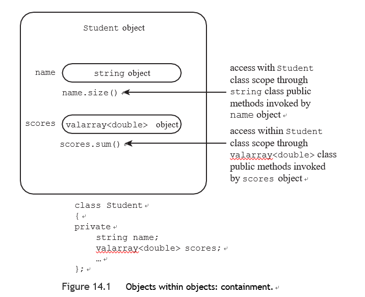
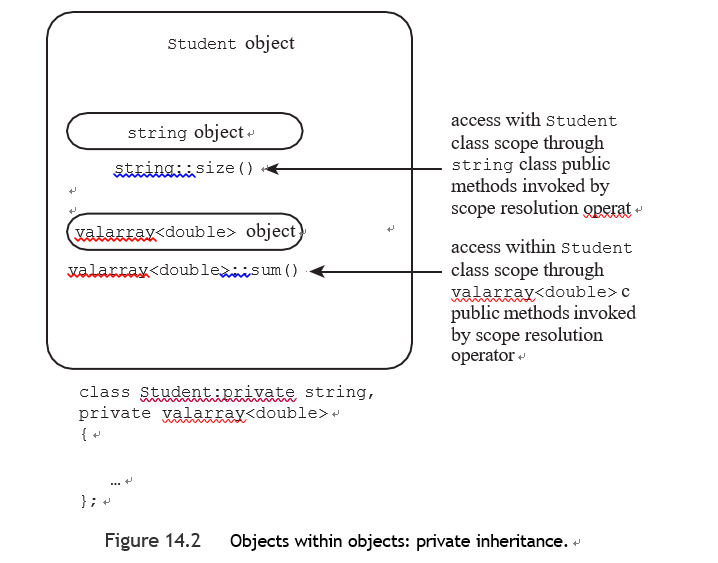
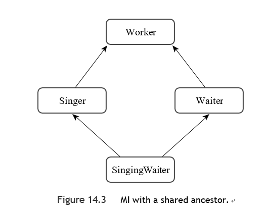
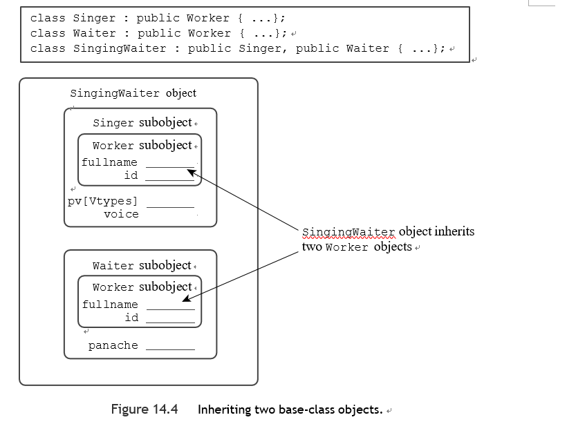
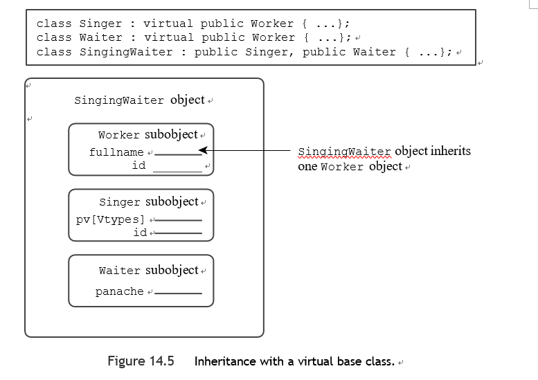

# 十四章

[TOC]

包含、私有继承和受保护继承通常用于实现has-a关系--即新类拥有另一个类的对象的关系。

#### 带有对象成员的类

将一个学生简化为一个名字和一组测验分数，建议使用一个有两个成员的类：一个代表名字，一个代表分数。

---

**valvarry类**

valarray类是由valarray头文件支持的。正如它的名字所示，该类的目标是处理数值（或具有类似属性的类），因此它支持对内容进行求和以及寻找数组中最大和最小的数值等操作。为了使它能够处理不同的数据类型，valarray被定义为一个模板类。

模板方面意味着你在声明一个对象时必须提供一个特定的类型。要做到这一点，在声明一个对象时，你要在标识符valarray后面加上包含所需类型的角括号：

```c++
valarray<int> q_values; // an array of int 
valarray<double> weights;  // an array of double
```


几个使用一些构造函数的例子：

```c++
double gpa[5] = {3.1, 3.5, 3.8, 2.9, 3.3};
valarray<double> v1;  // an array of double, size 0 
valarray<int> v2(8);  // an array of 8 int elements 
valarray<int> v3(10,8);  // an array of 8 int elements,
// each set to 10 
valarray<double> v4(gpa, 4); // an array of 4 elements
// initialized to the first 4 elements of gpa
```


在C++11中，你还可以使用一个初始化器列表：

```c++
valarray<int> v5 = {20, 32, 17, 9}; // C++11
```


一些方法：

- Operator[]()方法提供了对单个元素的访问
- size()方法返回元素的数量
- sum()方法返回元素的总和
- max()方法返回最大的元素
- min()方法返回最小的元素

----

###### 学生类的设计

学生类的设计方案是用一个字符串对象来表示名字，用一个valarray\<double>对象来表示测验分数。 一个学生有一个名字，一个学生有一个测验分数的数组。通常C++的技术是使用组成或包含关系来建模，也就是说，创建一个由另一个类的成员组成或包含这些成员的类。

通过公共继承，一个类继承了一个接口，也许还有一个实现。(基类中的纯虚拟函数可以提供一个接口而不需要一个实现)。获得接口是is-a关系的一部分。另一方面，通过组合，一个类获得了实现而没有接口。不继承接口是 "has-a"关系的一部分。



**接口和实现**

```c++
class Student
{
private:
    typedef std::valarray<double> ArrayDb;
    std::string name;  // contained object
    ArrayDb scores;    // contained object
// private method for scores output
    std::ostream & arr_out(std::ostream & os) const;
public:
    Student() : name("Null Student"), scores() {}
    explicit Student(const std::string & s)
            : name(s), scores() {}
    explicit Student(int n) : name("Nully"), scores(n) {}
    Student(const std::string & s, int n)
            : name(s), scores(n) {}
    Student(const std::string & s, const ArrayDb & a)
            : name(s), scores(a) {}
    Student(const char * str, const double * pd, int n)
            : name(str), scores(pd, n) {}
    ~Student() {}
    double Average() const;
    const std::string & Name() const;
    double & operator[](int i);
    double operator[](int i) const;
// friends
// input
    friend std::istream & operator>>(std::istream & is,
            Student & stu); // 1 word
    friend std::istream & getline(std::istream & is,
    Student & stu);    // 1 line
// output
    friend std::ostream & operator<<(std::ostream & os,
                                     const Student & stu);
};
```


```c++
    typedef std::valarray<double> ArrayDb;
```

为了简化符号，类型定义std::valarray<double> ArrayDb； 这使得剩下的代码可以使用更方便的符号ArrayDb。因此，成员函数和友元函数可以引用ArrayDb类型。 将这个类型定义放在类定义的私有部分，意味着它可以在学生类实现内部使用，但不能被学生类的外部用户使用。


注意关键字 explicit 的使用：

```c++
    explicit Student(int n) : name("Nully"), scores(n) {}
```

回顾一下，一个可以用一个参数调用的构造函数作为一个隐含的转换函数，从参数类型到类的类型。这通常不是一个好主意。第一个参数代表数组中的元素数量，而不是数组的值，所以让构造函数作为一个int-to-Student的转换函数并没有意义，使用explicit可以关闭隐式转换。

---

**C++和约束条件**

C++有很多功能，允许程序员将程序性构造约束在一定的范围内--显式是为了消除单参数构造函数的隐式转换，const是为了约束使用方法来修改数据，等等。其基本动机是这样的： 编译时的错误要比运行时的错误好。

---


**初始化所包含的对象**

对于继承的对象，构造函数使用成员初始化器列表中的类名来调用特定的基类构造函数。对于成员对象，构造函数使用成员名称。

```c++
Student(const char * str, const double * pd, int n)
: name(str), scores(pd, n) {}
```

因为它初始化的是成员对象，而不是继承对象，这个构造函数在初始化列表中使用的是成员名称，而不是类的名称。这个初始化列表中的每一项都调用匹配的构造函数。也就是说，name(str)调用字符串(const char *)构造函数，scores(pd, n)调用ArrayDb(const double *, int)构造函数，由于类型定义的关系，它实际上是valarray\<double>(const double *, int)构造函数。


**初始化顺序**

当你的成员初始化器列表初始化了一个以上的项目时，这些项目是按照它们被声明的顺序来初始化的，而不是按照它们在初始化器列表中出现的顺序。


student.cpp

```c++
const std::string &Student::Name() const {
    return name;
}

double Student::Average() const {
    if(scores.size()>0){
        return scores.sum()/scores.size();
    }else{
        return 0;
    }
}

double &Student::operator[](int i) {
    return scores[i];
}

double Student::operator[](int i) const {
    return scores[i];
}

std::ostream &Student::arr_out(std::ostream &os) const {
    int i;
    int lim=scores.size();
    if(lim>0){
        for(i=0;i<lim;i++){
           os<<scores[i]<<" ";
           if(i%5==4){
               os<<'\n';
           }
        }
        if(i%5!=0){
            os<<'\n';
        }
    }else{
        os<<"empty array\n";
    }
    return os;
}

std::istream & operator>>(std::istream & is,
                                 Student & stu) {
    is>>stu.name;
    return is;
}

std::istream & getline(std::istream & is,
                              Student & stu) {
    getline(is,stu.name);
    return is;
}
// output


std::ostream & operator<<(std::ostream & os,
                                 const Student & stu){
    os<<"Scores for "<<stu.name<<":\n";
    stu.arr_out(os);
    return os;
}
```


main.cpp

```c++
void set(Student & sa, int n);

const int pupils = 3;
const int quizzes = 5;


int main() {
    using std::cout;
    using std::endl;
    using std::cin;
    Student ada[pupils] =
            {Student(quizzes), Student(quizzes), Student(quizzes)};

    int i;
    for (i = 0; i < pupils; ++i)
        set(ada[i], quizzes);
    cout << "\nStudent List:\n";
    for (i = 0; i < pupils; ++i)
        cout << ada[i].Name() << endl;
    cout << "\nResults:";
    for (i = 0; i < pupils; ++i)
    {
        cout << endl << ada[i];
        cout << "average: " << ada[i].Average() << endl;
    }
    cout << "Done.\n";
    return 0;
}

void set(Student& sa,int n){
    std::cout << "Please enter the student's name: ";
    getline(std::cin, sa);
    std::cout << "Please enter " << n << " quiz scores:\n";
    for (int i = 0; i < n; i++)
        std::cin >> sa[i];
    while (std::cin.get() != '\n')
        continue;
}
```


#### 私有继承 

C++有第二种实现has-a关系的方法：私有继承。通过私有继承，基类的公共和受保护成员变成派生类的私有成员。这意味着基类的方法不会成为派生对象的公共接口的一部分。然而，在派生类的成员函数内部，它们是可以使用的。

**公共继承**，基类的公共方法成为派生类的公共方法。简而言之，派生类继承了基类的接口。这就是is-a关系的一部分。

**私有继承**，基类的公共方法成为派生类的私有方法。简而言之，派生类并不继承基类的接口。正如你所看到的包含对象，这种缺乏继承性的情况是 "has-a "关系的一部分，通过私有继承，一个类确实继承了实现。


包含将一个对象作为命名的成员对象添加到一个类中，而私有继承将一个对象作为未命名的继承对象添加到一个类中。本书使用术语子对象来表示通过继承或包含添加的对象。

那么，私有继承提供了与包含相同的功能： 获得实现，而不是获得接口。因此，它也可以被用来实现has-a关系。事实上，你可以产生一个使用私有继承的学生类，它的公共接口与包含版本相同。因此这两种方法之间的差异影响的是实现，而不是接口。

###### 学生类的新版本示例

拥有一个以上的基类被称为多重继承（MI）。一般来说，MI，特别是公共MI，会导致一些问题，必须用额外的语法规则来解决。

- 新类不需要私有数据。这是因为两个继承的基类已经提供了所有需要的数据成员。这个例子的包含版本提供了两个明确命名的对象作为成员。然而，私有继承提供了两个无名的子对象作为继承的成员。

- 使用隐式继承的组件而不是成员对象会影响这个例子的编码，因为你不能再使用名称和分数来描述对象。相反，你必须回到你用于公共继承的技术。例如，考虑构造函数。一定要注意，成员初始化器列表中使用的术语 是std::string(str)


**头文件**

```c++
class Student:private string ,private valarray<double>
{
private:
    typedef valarray<double> ArrayDb;
    std::ostream & arr_out(std::ostream & os) const;
public:
    Student() : string("Null Student"), ArrayDb() {}
    explicit Student(const std::string & s)
            : string(s), ArrayDb() {}
    explicit Student(int n) : string(), ArrayDb(n){}
    Student(const std::string & s, int n)
            : string(s), ArrayDb(n) {}
    Student(const std::string & s, const ArrayDb & a)
            : string(s), ArrayDb(a) {}
    Student(const char * str, const double * pd, int n)
            : string(str), ArrayDb(pd, n) {}
    ~Student() {}
    double Average() const;
    const std::string & Name() const;
    double & operator[](int i);
    double operator[](int i) const;
// friends
// input
    friend std::istream & operator>>(std::istream & is,
            Student & stu); // 1 word
    friend std::istream & getline(std::istream & is,
    Student & stu);    // 1 line
// output
    friend std::ostream & operator<<(std::ostream & os,
                                     const Student & stu);
};
```


**访问基类方法**




**访问基类对象**

答案是使用类型转换，因为Student是从string派生的，所以可以将Student对象类型转换为string对象，结果是继承的string对象。

```c++
const std::string &Student::Name() const {
    return(const string&)*this;
}

double Student::Average() const {
    if(ArrayDb::size()>0){
        return ArrayDb::sum()/ArrayDb::size();
    }else{
        return 0;
    }
}

double &Student::operator[](int i) {
    return ArrayDb::operator[](i);
}

double Student::operator[](int i) const {
    return ArrayDb::operator[](i);;
}

std::ostream &Student::arr_out(std::ostream &os) const {
    int i;
    int lim=ArrayDb::size();
    if(lim>0){
        for(i=0;i<lim;i++){
           os<<ArrayDb::operator[](i)<<" ";
           if(i%5==4){
               os<<'\n';
           }
        }
        if(i%5!=0){
            os<<'\n';
        }
    }else{
        os<<"empty array\n";
    }
    return os;
}

std::istream & operator>>(std::istream & is,
                                 Student & stu) {
    is>>(string&)stu;
    return is;
}

std::istream & getline(std::istream & is,
                              Student & stu) {
    getline(is,(string&)stu);
    return is;
}
// output


std::ostream & operator<<(std::ostream & os,
                                 const Student & stu){
    os<<"Scores for "<<(const string&)stu<<":\n";
    stu.arr_out(os);
    return os;
}
```

引用stu不会被自动转换为字符串引用。根本原因是，在私有继承中，如果没有显式类型转换，基类的引用或指针不能被分配为派生类的引用或指针。

>  包含方法使用对象名称来调用方法，而私有继承则使用类名和范围解析操作符来代替。


```c++
std::ostream & operator<<(std::ostream & os,
                                 const Student & stu){
    os<<"Scores for "<<(const string&)stu<<":\n";
    stu.arr_out(os);
    return os;
}
```

即使这个例子使用公有继承，它也必须使用显式类型转换。一个原因是，如果没有类型转换，像下面这样的代码就会与友方函数原型相匹配，从而导致递归调用：
```c++
os << stu；
```

第二个原因是，由于该类使用了MI，如果两个基类恰好都提供了operator<<()函数，编译器就无法判断应该转换到哪个基类。


main.cpp

```c++
void set(Student & sa, int n);

const int pupils = 3;
const int quizzes = 5;


int main() {
    using std::cout;
    using std::endl;
    using std::cin;
    Student ada[pupils] =
            {Student(quizzes), Student(quizzes), Student(quizzes)};

    int i;
    for (i = 0; i < pupils; ++i)
        set(ada[i], quizzes);
    cout << "\nStudent List:\n";
    for (i = 0; i < pupils; ++i)
        cout << ada[i].Name() << endl;
    cout << "\nResults:";
    for (i = 0; i < pupils; ++i)
    {
        cout << endl << ada[i];
        cout << "average: " << ada[i].Average() << endl;
    }
    cout << "Done.\n";
    return 0;
}

void set(Student& sa,int n){
    std::cout << "Please enter the student's name: ";
    getline(std::cin, sa);
    std::cout << "Please enter " << n << " quiz scores:\n";
    for (int i = 0; i < n; i++)
        std::cin >> sa[i];
    while (std::cin.get() != '\n')
        continue;
}
```


###### 包含或私有继承？

鉴于你可以用包含式或私有继承来模拟has-a关系，你应该使用哪一种？

**大多数C++程序员更喜欢包含式**

- 它更容易理解
- 继承可能会引起问题

特别是当一个类继承自一个以上的基类时。你可能不得不处理一些问题，比如不同的基类有相同名称的方法，或者不同的基类有一个共同的祖先。

- 包含法允许你包含同一个类的多个子对象，但继承将你限制在一个单一的对象上


**私有继承确实提供了超越包含所提供的功能**

例如，假设一个类有受保护的成员，这些成员可以是数据成员或成员函数。这样的成员对派生类来说是可用的，但对整个世界来说不是。如果你使用组合方式将这样的类包含在另一个类中，新的类是整个世界的一部分，而不是派生类。因此它不能访问受保护的成员。但使用继承会使新类成为派生类，所以它可以访问受保护的成员。

另一种需要使用私有继承的情况是，如果你想重新定义虚拟函数。同样，这是赋予派生类的特权，但不是赋予包含类的特权。使用私有继承，重新定义的函数只能在类内使用，不能公开使用。

:warning:你应该使用包含来建立一个有关系的模型。如果新类需要访问原类中受保护的成员，或者需要重新定义虚拟函数，就应该使用优先继承。


###### protected继承

保护性继承是私有继承的一个变种。它在列出基类时使用关键字protected：

```c++
class Student: protected std::string,
protected std::valarray<double>
{
    ...
};
```

通过保护性继承，基类的公共成员和受保护成员成为派生类的受保护成员。和私有继承一样，基类的接口对派生类是可用的，但对外部世界是无效的。私有继承和保护继承的主要区别发生在你从派生类派生出另一个类时。这是因为在派生类中公共的基类方法变成了私有的，而私有的成员和方法不能被下一级派生类直接访问。通过保护性继承，公共的基类方法在第二代中变成了保护性的，因此可以在内部被下一级派生类使用。


**隐式upcasting**：指你可以让基类指针或引用引用到派生类对象，而不使用显式类型转换。

| Property           | Public Inheritance                   | Protected Inheritance                   | Private Inheritance                    |
| ------------------ | ------------------------------------ | --------------------------------------- | -------------------------------------- |
| Public members     | Public members of the derived class  | Protected members of the derived class  | Private members of the derived class   |
| Protected members  | Protected members                    | Protected members of  the derived class | Protected members of the derived class |
| Private members    | Private members of the derived class | Private members of the derived class    | Private membersof the derived class    |
| Implicit upcasting | Yes                                  | Yes (but only within the derived class) | No                                     |


---

**用using重新定义访问**

当你使用protected或private派生时，基类的公共成员会变成protected或private。假设你想让一个特定的基类方法在派生类中公开可用。一种选择是定义一个使用基类方法的派生类方法。

例如，假设你想让Student类能够使用valarray sum()方法。你可以在类声明中声明一个sum()方法，然后这样定义该方法：

```c++
double Student::sum() const	// public Student method
{
return std::valarray<double>::sum(); // use privately-inherited method
}
```

除了用一个函数调用包装另一个函数外，还有一个替代方法：使用using声明来宣布某个基类成员可以被派生类使用，尽管派生是私有的。

例如，假设你想在学生类中使用Valarray的min()和max()方法。

你可以在public部分添加using声明:

```c++
class Student:private std::string,private std::valarray<double>
{
    ...
    public:
    	using std::valarray<double>::min; using std::valarray<double>::max;
    ...
    
}
```

using声明使valarray\<double>::min()和valarray\<double>::max()方法可用，就像它们是公共的学生方法一样。

:warning:请注意，using声明只是使用成员的名字--没有括号，没有函数签名，没有返回类型。


例如，为了使学生类可以使用数组operator[]()方法，你需要在学生类声明的public部分放置以下using声明：

```c++
using std::valarray<double>::operator[];
```

这将使两个版本（const和none-const）都可用

:warning:使用声明的方法只对继承有效，对包含无效。


有一种更古老的方法可以在一个私有派生类中重新声明基类方法：

你把方法的名字放在派生类的公共部分。

```c++
class Student : private std::string, private std::valarray<double>
{
public:
std::valarray<double>::operator[]; // redeclare as public, just use name
...

};
```

这看起来像一个没有using关键字的using声明。

:warning:这种方法已经被淘汰了，也就是说，我们的目的是要逐步淘汰它。所以如果你的编译器支持using声明，你可以用它来使一个私有基类的方法对派生类可用。

---


#### 多重继承

多重继承（MI）可以让你创建继承自两个或多个基类的类，并结合它们的功能。多重继承描述了一个拥有多个直接基类的类，和单继承一样，公共多重继承应该表达一种is-a关系。

例如，如果你有一个Waiter类和一个Singer类，你可以从这两个类中派生出一个SingingWaiter类：

```c++
class SingingWaiter : public Waiter, public Singer 
{
    ...
};
```


注意，你必须用关键字public来修饰每个基类。这是因为编译器假定私有派生，除非另有指示.

```c++
class SingingWaiter : public Waiter, Singer 
{
    ...
}; // Singer is a private base
```


**多重继承会给程序员带来新的问题**

两个主要的问题是：

- 从两个不同的基类中继承不同的同名方法
- 通过两个或多个相关的直接基类继承一个类的多个实例。



头文件

```c++
class Worker{
private:
    std::string fullname;
    long id;
public:
    Worker():fullname("no one"),id(0L){}
    Worker(const std::string& s,long n):fullname(s),id(n){}
    virtual ~Worker()=0;
    virtual void Set();
    virtual void Show() const;
};

class Waiter:public Worker
{
private:
    int panache;
public:
    Waiter():Worker(),panache(0){}
    Waiter(const std::string & s,long n,int p=0):Worker(s,n),panache(p){}
    Waiter(const Worker&wk,int p=0):Worker(wk),panache(p){}
    void Set();
    void Show() const;
};

class Singer:public Worker{
protected:
    enum{other,alto,contralto,soprano,bass,baritone,tenor};
    enum{Vtypes=7};
private:
    static char* pv[Vtypes];
    int voice;
public:
    Singer():Worker(),voice(other){};
    Singer(const std::string &s,long n,int v=other):Worker(s,n),voice(v){};
    Singer(const Worker& wk,int v=other):Worker(wk),voice(v){};
    void Set();
    void Show() const;
};
```


源代码文件

```c++
using std::cout;
using std::cin;

Worker::~Worker() throw() {}

void Worker::Set() {
    cout<<"Enter worker's name:";
    getline(cin,fullname);
    cout<<"Enter worker's ID:";
    cin>>id;
    while(cin.get()!='\n');
}

void Worker::Show() const {
    cout << "Name: " << fullname << "\n";
    cout << "Employee ID: " << id << "\n";
}

void Waiter::Set() {
    Worker::Set();
    cout<<"Enter waiter's panache rating:";
    cin>>panache;
    while(cin.get()!='\n');
}

void Waiter::Show() const {
    cout << "Category: waiter\n";
    Worker::Show();
    cout << "Panache rating: " << panache << "\n";
}

char* Singer::pv[]= {"other", "alto", "contralto",
                     "soprano", "bass", "baritone", "tenor"};
void Singer::Set() {
    Worker::Set();
    cout << "Enter number for singer's vocal range:\n";
    int i;
    for(i=0;i<Vtypes;i++){
        cout << i << ": " << pv[i] << "    ";
        if(i%4==3){
            cout<<'\n';
        }
    }
    if(i%4!=0){
        cout<<'\n';
    }

    while(cin>>voice&&(voice<0||voice>=Vtypes)){
        cout << "Please enter a value >= 0 and < " << Vtypes << '\n';
    }

    while(cin.get()!='\n');
}

void::Singer::Show() const{
    cout << "Category: singer\n"; Worker::Show();
    cout << "Vocal range: " << pv[voice] << '\n';
}
```


main函数

```c++
int main() {
    using std::cout;
    using std::endl;
    using std::cin;
    Waiter bob("Bob Apple", 314L, 5);
    Singer bev("Beverly Hills", 522L, 3);
    Waiter w_temp;
    Singer s_temp;
    Worker * pw[LIM] = {&bob, &bev, &w_temp, &s_temp};
    int i;
    for (i = 2; i < LIM; i++)
        pw[i]->Set();

    for (i = 0; i < LIM; i++)
    {
        pw[i]->Show();
        std::cout << std::endl;
    }

    return 0;
}
```


**有多少个工人？**

假设你首先从Singer和Waiter公开派生出SingingWaiter：

```c++
class SingingWaiter: public Singer, public Waiter 
{	
    ...
};
```

因为Singer和Waiter都继承了一个Worker组件，所以SingingWaiter最终会有两个Worker组件



正如你所想的，这引起了一些问题

- 例如，通常你可以将一个派生类对象的地址分配给一个基类指针，但现在这变得很模糊

你可以通过使用类型转换来指定哪个对象：

```c++
Worker * pw1 = (Waiter *) &ed;	// the Worker in Waiter 
Worker * pw2 = (Singer *) &ed;	// the Worker in Singer
```

这无疑使使用基类指针阵列来引用各种对象（多态性）的技术变得复杂。

一个Worker对象有两份拷贝也会引起其他问题。然而，真正的问题是，你为什么要有两份工作对象的副本？

一个唱歌的服务员，像其他工人一样，应该只有一个名字和一个ID。当C++把MI加入到它的技巧袋中时，它增加了一个虚拟基类来实现这一点。


###### 虚拟基类

虚拟基类允许一个从多个基类派生出来的对象，而这些基类本身有一个共同的基点，只继承该共享基类的一个对象。

 在这个例子中，你可以通过在类的声明中使用关键字virtual，使Worker成为Singer和Waiter的虚拟基类（virtual和public可以以任一顺序出现）：

```c++
class Singer : virtual public Worker 
{
    ...
}; 

class Waiter : public virtual Worker 
{
    ...
};
```

然后你会像之前那样定义SingingWaiter：

现在，一个SingingWaiter对象将包含一个Worker对象的单一副本。实质上，继承的Singer和Waiter对象共享一个共同的Worker对象，而不是各自带来自己的副本，因为SingingWaiter现在包含一个Worker子对象，你可以再次使用多态性。




**让我们来看看你可能有的一些问题：**

- 为什么使用virtual这个术语？

首先，为什么使用虚拟这个术语？毕竟，虚拟函数和虚拟基类的概念之间似乎没有明显的联系。C++社区有强大的压力来抵制引入新的关键字。例如，如果一个新的关键字与一个主要程序中的某些重要函数或变量的名称相对应，那就很尴尬了。因此，C++仅仅为新的设施回收了关键字virtual--一种关键字的重载。

- 为什么我们不把基类声明为虚拟，而让虚拟行为成为多重继承的标准？

我们为什么不声明基类为虚拟，而让虚拟行为成为多重继承的规范？首先，在有些情况下，你可能需要一个基类的多个副本。第二，使基类虚拟需要程序做一些额外的核算，如果你不需要的话，你不应该为这种设施付费。 第三，还有下一段中介绍的缺点。

- 有什么需要注意的地方吗?

 是的。使虚拟基类工作需要对C++规则进行调整，你必须以不同的方式编码一些东西。另外，使用虚拟基类可能涉及到改变现有的代码。

例如，将 SingingWaiter 类添加到 层次结构中，你需要回去将虚拟关键字添加到Singer 和Waiter类。


**新的构造函数规则**

```c++
class A
{
int a; public:
A(int n = 0) : a(n) {}
...
};
class B: public A
{
int b; public:
B(int m = 0, int n = 0) : A(n), b(m) {}
...
};
class C : public B
{
int c; public:
C(int q = 0, int m = 0, int n = 0) : B(m, n), c(q) {}
...
};
```

C类的构造函数只能调用B类的构造函数，B类的构造函数可以 只能调用A类的构造函数。

如果Worker是一个虚拟基类，这种自动传递信息的方式就不起作用。

例如，考虑多重继承例子的以下可能的构造函数：

```c++
SingingWaiter(const Worker & wk, int p = 0, int v = Singer::other)
: Waiter(wk,p), Singer(wk,v) {} // flawed
```

问题是，信息的自动传递会通过两个不同的路径（Waiter和Singer）将wk传递给Worker对象。为了避免这种潜在的冲突，如果基类是虚拟的，**C++会禁止通过中间类向基类自动传递信息**。

因此，前面的构造函数将初始化panache和voice成员，但wk参数中的信息不会到达Waiter子对象。然而，编译器必须在构造派生对象之前构造一个基对象组件；在这种情况下，它将使用默认的Worker构造函数。

如果你想为一个虚拟基类使用默认构造函数以外的东西，你需要明确地调用相应的基类构造函数。

```c++
SingingWaiter(const Worker & wk, int p = 0, int v = Singer::other)
: Worker(wk), Waiter(wk,p), Singer(wk,v) {}
```

:warning:请注意，这种用法是合法的，而且对于虚拟基类来说往往是必要的，而对于非虚拟基类来说是非法的


---

**Note**

如果一个类有一个间接的虚拟基类，该类的构造函数应该明确地调用虚拟基类的构造函数，除非所需要的只是虚拟基类的默认构造函数。

---


**哪种方法？**

除了引入类构造函数规则的变化外，多重继承还经常需要其他代码调整。考虑一下向SingingWaiter类扩展Show()方法的问题。因为SingingWaiter对象没有新的数据成员，你可能认为该类可以直接使用继承的方法。这带来了第一个问题。

假设你确实省略了Show()的新版本，并试图使用一个SingingWaiter对象来调用一个继承的Show()方法：

```c++
SingingWaiter newhire("Elise Hawks", 2005, 6, soprano); 
newhire.Show(); // ambiguous
```

在单继承中，如果没有重新定义Show()，就会使用最新的祖先定义。在这种情况下，每个直接的祖先都有一个Show()函数，这使得这个调用变得模糊不清。

你可以使用范围-分辨率运算符来澄清你的意思：

```c++
SingingWaiter newhire("Elise Hawks", 2005, 6, soprano); 
newhire.Singer::Show(); // use Singer version
```

然而，更好的方法是为SingingWaiter重新定义Show()，并让它指定使用哪个Show()。

例如，如果你想让一个SingingWaiter对象使用Singer版本，你可以这样使用：

```c++
void SingingWaiter::Show()
{
Singer::Show();
}
```


```c++
void Worker::Show() const
{
cout << "Name: " << fullname << "\n"; cout << "Employee ID: " << id << "\n";
}

void Waiter::Show() const
{
Worker::Show();
cout << "Panache rating: " << panache << "\n";
}
void HeadWaiter::Show() const
{
Waiter::Show();
cout << "Presence rating: " << presence << "\n";
}
```

然而，这种递增的方法在SingingWaiter的情况下失败了，因为它忽略了Waiter组件：

```c++
void SingingWaiter::Show()
{
Singer::Show();
}
```

你可以通过同时调用Waiter版本来补救：

```c++
void SingingWaiter::Show()
{
Singer::Show();
Waiter::Show();
}
```

然而，这显示了一个人的名字和ID两次，因为Singer::Show()和与Waiter::Show()都调用Worker::Show()。


你怎样才能解决这个问题呢？

- 一种方法是使用模块化方法而不是增量方法

也就是说，你可以提供一个只显示worker组件的方法，另一个只显示服务员组件的方法，还有一个只显示歌手组件的方法。

然后 SingingWaiter::Show() 方法可以把这些组件放在一起.

```c++
void Worker::Data() const
{
cout << "Name: " << fullname << "\n"; 
cout << "Employee ID: " << id << "\n";
}

void Waiter::Data() const
{
cout << "Panache rating: " << panache << "\n";
}

void Singer::Data() const
{
cout << "Vocal range: " << pv[voice] << "\n";
}

void SingingWaiter::Data() const
{
Singer::Data();
Waiter::Data();
}

void SingingWaiter::Show() const
{
cout << "Category: singing waiter\n"; 
    Worker::Data();
    Data();
}
```

另一方面，Data()方法应该是类的内部方法；它们应该是用于促进公共接口的辅助方法，然而，让Data()方法成为私有的会阻止，例如，Waiter的代码使用Worker::Data()。

- 让所有类方法都为protected

这就是受保护的访问类有用的那种情况：

 如果Data()方法是被保护的，那么它们可以被层次结构中的所有类内部使用，而不被外界发现。另一种方法是让所有的数据组件都成为受保护的，而不是私有的，但是使用受保护的方法而不是受保护的数据，可以对允许的数据访问进行更严格的控制。

Set()方法是为设置对象的值而征求数据的，这也是一个类似的问题。

例如，SingingWaiter::Set()应该询问一次工人信息，而不是两次

用于Show()的解决方案也是可行的

你可以提供受保护的Get()方法，只为一个单一的类索取信息，然后你可以把使用Get()方法作为构建模块的Set()方法放在一起。

简而言之，用共享祖先引入多重继承需要引入虚拟基类，改变构造函数初始化列表的规则，如果在编写类时考虑到多重继承的话，可能还要重新编码。


```c++
while (strchr("wstq", choice) == NULL)
```

[^strchr]:这个函数返回选择字符值在字符串 "wstq "中第一次出现的地址；如果没有找到该字符，该函数返回NULL指针。


头文件

```c++
class Worker{
private:
    std::string fullname;
    long id;
public:
    Worker():fullname("no one"),id(0L){}
    Worker(const std::string& s,long n):fullname(s),id(n){}
    virtual ~Worker()=0;
    virtual void Set();
    virtual void Show() const;
protected:
    void Data() const;
    void Get();
};

class Waiter:virtual public Worker
{
private:
    int panache;
protected:
    void Data()const;
    void Get();
public:
    Waiter():Worker(),panache(0){}
    Waiter(const std::string & s,long n,int p=0):Worker(s,n),panache(p){}
    Waiter(const Worker&wk,int p=0):Worker(wk),panache(p){}
    void Set();
    void Show() const;
};

class Singer:virtual public Worker{
protected:
    enum{other,alto,contralto,soprano,bass,baritone,tenor};
    enum{Vtypes=7};
    void Data() const;
    void Get();
private:
    static char* pv[Vtypes];
    int voice;
public:
    Singer():Worker(),voice(other){};
    Singer(const std::string &s,long n,int v=other):Worker(s,n),voice(v){};
    Singer(const Worker& wk,int v=other):Worker(wk),voice(v){};
    void Set();
    void Show() const;
};


class SingingWaiter:public Singer,public Waiter
{
protected:
    void Data() const;
    void Get();
public:
    SingingWaiter(){};
    SingingWaiter(const std::string&s, long n,int p=0,int v=other):
    Worker(s,n),Waiter(s,n,p),Singer(s,n,v){}
    SingingWaiter(const Worker &wk,int p=0,int v=other):
    Worker(wk),Waiter(wk,p),Singer(wk,v){};
    SingingWaiter(const Waiter&wt,int v=other):
    Worker(wt),Waiter(wt),Singer(wt,v){};
    SingingWaiter(const Singer&s,int p):
    Worker(s),Waiter(s,p),Singer(s){};
    void Set();
    void Show() const;
};
```


源代码文件

```c++
Worker::~Worker() throw() {}

void Worker::Data() const {
    cout << "Name: " << fullname << '\n';
    cout << "Employee ID: " << id << '\n';
}

void Worker::Get() {
    getline(cin,fullname);
    cout<<"Enter worker's ID:";
    cin>>id;
    while(cin.get()!='\n');
}

void Worker::Set() {
    cout<<"Enter worker's name:";
    getline(cin,fullname);
    cout<<"Enter worker's ID:";
    cin>>id;
    while(cin.get()!='\n');
}

void Worker::Show() const {
    cout << "Name: " << fullname << "\n";
    cout << "Employee ID: " << id << "\n";
}

void Waiter::Set() {
    Worker::Set();
    cout<<"Enter waiter's panache rating:";
    cin>>panache;
    while(cin.get()!='\n');
}

void Waiter::Show() const {
    cout << "Category: waiter\n";
    Worker::Show();
    cout << "Panache rating: " << panache << "\n";
}

void Waiter::Data() const {
    cout << "Panache rating: " << panache << "\n";
}

void Waiter::Get() {
    cout<<"Enter waiter's panache rating:";
    cin>>panache;
    while(cin.get()!='\n');
}

char* Singer::pv[]= {"other", "alto", "contralto",
                     "soprano", "bass", "baritone", "tenor"};
void Singer::Set() {
    Worker::Set();
    cout << "Enter number for singer's vocal range:\n";
    int i;
    for(i=0;i<Vtypes;i++){
        cout << i << ": " << pv[i] << "    ";
        if(i%4==3){
            cout<<'\n';
        }
    }
    if(i%4!=0){
        cout<<'\n';
    }

    while(cin>>voice&&(voice<0||voice>=Vtypes)){
        cout << "Please enter a value >= 0 and < " << Vtypes << '\n';
    }

    while(cin.get()!='\n');
}

void::Singer::Show() const{
    cout << "Category: singer\n";
    Worker::Show();
    cout << "Vocal range: " << pv[voice] << '\n';
}

void Singer::Data() const {
    cout << "Vocal range: " << pv[voice] << '\n';
}

void Singer::Get() {
    cout << "Enter number for singer's vocal range:\n";
    int i;
    for(i=0;i<Vtypes;i++){
        cout << i << ": " << pv[i] << "    ";
        if(i%4==3){
            cout<<'\n';
        }
    }
    if(i%4!=0){
        cout<<'\n';
    }

    while(cin>>voice&&(voice<0||voice>=Vtypes)){
        cout << "Please enter a value >= 0 and < " << Vtypes << '\n';
    }

    while(cin.get()!='\n');
}

void SingingWaiter::Set() {
    cout << "Enter singing waiter's name: ";
    Worker::Get();
    Get();
}

void SingingWaiter::Show() const {
    cout << "Category: singing waiter\n";
    Worker::Data();
    Data();
}

void SingingWaiter::Data() const {
    Waiter::Data();
    Singer::Data();
}

void SingingWaiter::Get() {
    Waiter::Get();
    Singer::Get();
}
```


main.cpp

```c++
const int SIZE = 5;

int main() {
    using std::cin; using std::cout; using std::endl; using std::strchr;
    Worker * lolas[SIZE];

    int ct;
    for (ct = 0; ct < SIZE; ct++)
    {
        char choice;
        cout << "Enter the employee category:\n"
             << "w: waiter s: singer "
             << "t: singing waiter q: quit\n";
        cin >> choice;

        while (strchr("wstq", choice) == NULL)
        {
            cout << "Please enter a w, s, t, or q: ";
            cin >> choice;
        }

        if (choice == 'q')
            break;
        switch(choice)
        {
            case 'w':
                lolas[ct] = new Waiter;
                break;
            case 's':
                lolas[ct] = new Singer;
                break;
            case 't':
                lolas[ct] = new SingingWaiter;
                break;
        }
        cin.get();
        lolas[ct]->Set();
    }

    cout << "\nHere is your staff:\n";
    int i;
    for (i = 0; i < ct; i++)
    {
        cout << endl;
        lolas[i]->Show();
    }
    for (i = 0; i < ct; i++)
        delete lolas[i];
    cout << "Bye.\n";
    return 0;
}
```


###### 混合虚拟和非虚拟的基类

让我们再次考虑一个派生类通过不止一种途径继承基类的情况。如果基类是虚拟的，派生类包含基类的一个子对象。如果基类不是虚拟的，派生类就包含多个子对象。

如果有一个混合物呢？例如，假设B类是C类和D类的虚拟基类，是X类和Y类的非虚拟基类。此外，假设M类是从C、D、X和Y派生出来的。所以，总的来说，它将包含三个B类子对象。

<div style='box-shadow: rgba(0, 0, 0, 0.15) 1.95px 1.95px 2.6px;border-radius: 4px; padding:0.7em;background-color:#D3D3D3;'>当一个类通过几个虚拟路径和几个非虚拟路径继承一个特定的基类时，该类有一个基类子对象来代表所有的虚拟路径，有一个单独的基类子对象来代表每个非虚拟路径。</div>


**虚拟基类和支配权**

使用虚拟基类改变了C++解决歧义的方式。对于非虚拟基类，规则很简单。如果一个类从不同的类中继承了两个或更多具有相同名称的成员（数据或方法），那么使用这个名称而不以类的名称来限定它就是含糊的。然而，如果涉及到虚拟基类，这种使用可能是模糊的，也可能不是。在这种情况下，如果一个名字支配了所有其他的名字，那么它就可以在没有限定符的情况下被明确地使用。

那么，一个成员的名字如何支配另一个呢？派生类中的一个名称支配任何祖先类中的相同名称，无论是直接还是间接的。

例如，考虑下面的定义：

```c++
class B
{
public:
short q();
...
 
};

class C : virtual public B
{
public:
    long q(); 
    int omg()
...
};

class D : public C
{
...
};

class E : virtual public B
{
private:
int omg();
...
};

class F: public D, public E
{
...
};
```

这里C类中q()的定义主导了B类中的定义，因为C是由B派生的，因此，F中的方法可以使用q()来表示C::q()。

omg()的定义都没有支配对方，因为C和E都不是对方的基类，因此，如果F试图使用一个没有限定的omg()，就会产生歧义。

**虚拟歧义规则不关注访问规则**

即使E::omg()是私有的，因此不能直接访问类F，使用omg()也是歧义的。

同样地，即使C::q()是私有的，它也会支配D::q()。在这种情况下，你可以在F类中调用B::q()，但不指定的q()会指向不可访问的C::q()。


###### 多重继承概要

- 没有需要类时：

如果一个类继承了两个名字相同但来自不同类的成员，你需要在派生类中使用类限定符来区分这两个成员。如果一个类通过一个以上的途径从一个非虚拟的基类继承，那么这个类为基类的每个非虚拟实例继承一个基类对象。

- 加入虚拟类：

主要的变化，也是虚拟基类的原因，是一个继承自一个或多个虚拟基类实例的类，只继承一个基类对象。

1. 具有间接虚拟基类的派生类应该让其构造函数直接调用间接基类的构造函数，这对于间接非虚拟基类是不合法的。
2. 名称的模糊性是通过支配规则来解决的

多重继承可以引入编程的复杂性。然而，当一个派生类通过一个以上的途径从同一个基类继承时，这些复杂性大多会出现。如果你避免这种情况，大约你唯一需要注意的是在必要时限定继承的名字。


#### 类模板

类模板让你以通用术语定义一个类。然后你可以使用模板来创建为特定类型定义的特定类。例如，你可以定义一个通用的堆栈模板，然后使用模板创建一个代表int值堆栈的类和另一个代表double值堆栈的类，你甚至可以生成一个代表堆栈的类。

第十章，通过typedef的方式解决了类定义的通用性，但仍存在部分问题：

- 必须在每次改变类型时编辑头文件
- 可以使用该技术在每个程序中只生成一种堆栈


C++的类模板提供了一种更好的方法来生成通用类声明，模板提供了参数化的类型--也就是说，它们能够将一个类型名称作为参数传递给构建类或函数的配方。

通过将类型名int到Queue模板，例如，你可以让编译器构造一个 Queue类来排列int

###### 定义一个类的模板

让我们把第10章中的Stack类作为一个模型来建立一个模板。

头文件

```c++
template <typename T>
class Stack{
private:
    enum {MAX = 10};	// constant specific to class
    T items[MAX];	// holds stack items
    int top;	// index for top stack item 
public:
    Stack();
    bool isempty();
    bool isfull();
    bool push(const T& item); // add item to stack
    bool pop(T & item);	// pop top into item
};
template <class T>
Stack<T>::Stack() {
    top=0;
}

template <class T>
bool Stack<T>::isfull() {
   return top==MAX;
}

template <class T>
bool Stack<T>::push(const T &item) {
    if(isfull()){
        return false;
    }else{
        items[top++]=item;
        return true;
    }
}

template <class T>
bool Stack<T>::isempty() {
    return top==0;
}

template <class T>
bool Stack<T>::pop(T &item) {
    if(isempty()){
        return false;
    }else{
        item=items[--top];
        return true;
    }
}

```


###### 使用模板类

仅仅在程序中包含一个模板并不能生成一个模板类。你必须要求实例化。要做到这一点，你要声明一个模板类类型的对象，用你想要的特定类型取代通用类型名称。

```c++
Stack<int> kernels;	// create a stack of ints 
Stack<string> colonels; // create a stack of string objects
```

看到这两个声明，编译器将按照Stack\<Type>模板生成两个独立的类声明和两套独立的类方法。Stack<int>类声明将全程用int替换Type，而Stack\<string>类声明将全程用string替换Type。


**你使用的算法必须与类型一致**

例如，Stack类假设你可以将一个项目赋值给另一个项目。这个假设对于基本类型、结构和类来说是正确的（除非你将赋值运算符设为私有），但对于数组来说不是。

通用的类型标识符，如例子中的T，被称为类型参数，意思是它们的作用类似于变量，但你不是给类型参数分配一个数值，而是给它分配一个类型。

----

**Note**

:warning:请注意，你必须明确地提供所需的类型，这与普通的函数模板不同，对于普通的函数模板，编译器可以使用函数的参数类型来计算出要生成什么样的函数

```c++
template <class T>
void simple(T t) { cout << t << '\n';}
...
simple(2);	// generate void simple(int) 
simple("two");	// generate void simple(const char *)
```


main.cpp

```c++
int main() {
    using std::cout;
    using std::cin;
    Stack<std::string> st; // create an empty stack
    char ch;
    std::string po;
    cout << "Please enter A to add a purchase order,\n"
         << "P to process a PO, or Q to quit.\n";
    while (cin >> ch && std::toupper(ch) != 'Q')
    {
        while (cin.get() != '\n')
            continue;

        if (!std::isalpha(ch))
        {
            cout << '\a';
            continue;
        }


        switch(ch)
        {
            case 'A':
            case 'a':
                cout << "Enter a PO number to add: ";
                cin >> po;
                if (st.isfull())
                    cout << "stack already full\n"; else
                    st.push(po); break;
            case 'P':
            case 'p': if (st.isempty())
                    cout << "stack already empty\n";

                else {
                    st.pop(po);
                    cout << "PO #" << po << " popped\n"; break;
                }
        }
        cout << "Please enter A to add a purchase order,\n"
             << "P to process a PO, or Q to quit.\n";
    }
    cout << "Bye\n";
    return 0;
}
```

你可以使用一个内置类型或一个类对象作为Stack<T>类模板的类型。

那么指针呢？

>  例如，你可以使用一个char的指针而不是一个字符串对象。毕竟，这种指针是处理C风格字符串的内置方式。答案是，你可以创建一个指针堆栈，但如果不对程序进行重大修改，它就不能很好地工作。


**不正确地使用堆栈的指针**

version 01

```c++
Stack<char *> st; // create a stack for pointers-to-char
...
char * po;//替换string
```

这种方法马上就会失败，因为仅仅创建一个指针并不能创造空间来存放输入的字符串。(程序会被编译，但在cin试图将输入存储在某个不合适的位置时，它很可能会崩溃）。


version 02

```c++
Stack<char *> st; // create a stack for pointers-to-char
...
char  po[40];//替换string
```

这为一个输入字符串分配了空间。此外，po是char *类型的，所以它可以被放在堆栈中。但是一个数组与pop()方法的假设有根本性的冲突：

```c++
template <class T>
bool Stack<T>::pop(T &item) {
    if(isempty()){
        return false;
    }else{
        item=items[--top];
        return true;
    }
}
```

- 参考变量项必须是指某种lvalue，而不是指一个数组的名称。
- 这段代码假设你可以赋值给item。即使item可以指代一个数组，你也不能赋值给一个数组名。所以这个方法也失败了


version 03

```c++
char * po = new char[40];
```

然而，在这里，你遇到了一个最基本的问题：只有一个po变量，而且它总是指向同一个内存位置。的确，每次读取一个新的字符串时，内存的内容都会发生变化，但是每次推送操作都会把相同的地址放到堆栈里。因此，当你弹出堆栈时，你总是得到相同的地址，而且它总是指最后读入内存的字符串。特别是，堆栈并不是在每个新的字符串进来的时候单独存储，它没有任何有用的作用。


**正确使用堆栈的指针**

使用指针堆栈的一种方法是让调用程序提供一个指针数组，每个指针指向一个不同的字符串,将这些指针放在堆栈中是有意义的，因为每个指针都会指向不同的字符串。

头文件

```c++
template <typename T>
class Stack{
private:
    enum {SIZE = 10};  // constant specific to class
    int stacksize;
    T* items;
    int top;   // index for top stack item
public:
    explicit Stack(int ss=SIZE);
    Stack(const Stack& st);
    ~Stack(){delete[] items;}
    Stack();
    bool isempty();
    bool isfull();
    bool push(const T& item); // add item to stack
    bool pop(T & item);    // pop top into item
    Stack& operator=(const Stack& st);
};

template <class T>
Stack<T>::Stack(const Stack<T> &st) {
    stacksize=st.stacksize;
    top=st.top;
    items=new T[stacksize];
    for(int i=0;i<top;i++){
        items[i]=st.items[i];
    }
}

template <class T>
Stack<T>& Stack<T>::operator=(const Stack<T> &st) {
    if(this==&st){
        return *this;
    }else{
        delete[] items;
        stacksize=st.stacksize;
        items=new T[stacksize];
        top=st.top;
        for(int i=0;i<top;i++){
            items[i]=st.items[i];
        }
        return *this;
    }
}

template <class T>
Stack<T>::Stack(int ss):stacksize(ss),top(0) {
    items=new T[stacksize];
}

template <class T>
Stack<T>::Stack() {
    top=0;
}

template <class T>
bool Stack<T>::isfull() {
    return top==stacksize;
}

template <class T>
bool Stack<T>::push(const T &item) {
    if(isfull()){
        return false;
    }else{
        items[top++]=item;
        return true;
    }
}

template <class T>
bool Stack<T>::isempty() {
    return top==0;
}

template <class T>
bool Stack<T>::pop(T &item) {
    if(isempty()){
        return false;
    }else{
        item=items[--top];
        return true;
    }
}
```

:warning:注意，原型声明赋值运算符函数的返回类型是对Stack的引用，而实际的模板函数定义将该类型标识为Stack\<Type>。前者是后者的缩写，但它只能在类的范围内使用。类型时，你需要使用完整的 Stack\<Type>形式。

```c++
const int Num=10;

int main() {
    using std::cout;
    using std::cin;
    std::srand(std::time(0));
    std::cout << "Please enter stack size: ";
    int stacksize;
    std::cin >> stacksize;
// create an empty stack with stacksize slots
    Stack<const char *> st(stacksize);
    const char * in[Num] = {
            " 1: Hank Gilgamesh", " 2: Kiki Ishtar", " 3: Betty Rocker", " 4: Ian Flagranti", " 5: Wolfgang Kibble", " 6: Portia Koop", " 7: Joy Almondo", " 8: Xaverie Paprika", " 9: Juan Moore", "10: Misha Mache"
    };
    const char* out[Num];
    int processed=0;
    int nextin=0;
    while(processed<Num){
        if(st.isempty()){
            st.push(in[nextin++]);
        }else if(st.isfull()){
            st.pop(out[processed++]);
        }else if(rand()%2==0&&nextin<Num){
            st.push(in[nextin++]);
        }else{
            st.pop(out[processed++]);
        }
    }

    for(int i=0;i<Num;i++){
        std::cout<<out[i]<<'\n';
    }

    std::cout << "Bye\n";
    return 0;
```

堆栈析构器对字符串有什么影响？没有。类的构造函数使用new来创建一个用于存放指针的数组。类的析构器消除了该数组，而不是数组元素所指向的字符串。


###### 一个数组模板的例子和非类型参数

让我们来看一下非类型参数（表达式参数）以及使用数组处理继承关系的情况。

让我们从一个简单的数组模板开始，该模板允许您指定数组的大小。

- 使用类内的动态数组和构造函数参数来提供元素的数量
- 使用模板参数来为常规数组提供大小，这就是新的 C++11 数组模板所做的

```c++
template <class T,int n>
class ArrayTp
{
private:
    T ar[n];
public:
    ArrayTp(){};
    explicit  ArrayTp(const T &v);
    virtual T& operator[](int i);
    virtual T operator[](int i) const;
};

template <class T,int n>
ArrayTp<T,n>::ArrayTp(const T &v) {
    for(int i=0;i<n;i++){
        ar[i]=v;
    }
}

template <class T,int n>
T &ArrayTp<T, n>::operator[](int i) {
    if(i<0||i>n){
        std::cerr << "Error in array limits: " << i
                  << " is out of range\n";
        std::exit(EXIT_FAILURE);
    }
    return ar[i];
}

template <class T,int n>
T ArrayTp<T, n>::operator[](int i) const {
    if (i < 0 || i >= n)
    {
        std::cerr << "Error in array limits: " << i
                  << " is out of range\n"; 
        std::exit(EXIT_FAILURE);
    }
    return  ar[i];
}
```


```c++
template <class T, int n>
```

关键字class（或者，在这里等同于tyename）将T标识为一个类型参数，或者类型参数。 int将n标识为一个int类型。这第二种参数，一个指定特定类型而不是作为一个类型的通用名称的参数，被称为非类型，或者表达式参数。


**表达式参数有一些限制**:达式参数可以是一个整数类型、一个枚举类型、一个引用或一个指针，模板代码不能改变参数的值或获取其地址。因此，在ArrayTP模板中，不允许使用n++或&n这样的表达式。另外，当你实例化一个模板时，用于表达式参数的值应该是一个常量表达式。


这种确定数组大小的方法比Stack中使用的构造器方法有一个**优势**：

构造器方法使用由new和delete管理的堆内存，而表达式参数方法使用为自动变量维护的内存堆。这提供了更快的执行时间，特别是当你有很多小数组的时候。


表达式参数方法的主要**缺点**：

每个数组大小都会产生自己的模板，也就是说，下面的声明会产生两个独立的类声明：

```c++
ArrayTP<double, 12> eggweights;
ArrayTP<double, 13> donuts;
```


但是下面的声明只产生一个类的声明，而且大小信息被传递给该类的构造函数：

```c++
Stack<int> eggs(12); 
Stack<int> dunkers(13);
```

另一个区别是，构造函数的方法更加通用，因为数组的大小是作为一个类成员存储的，而不是硬编码在定义中。这使得它有可能，例如，定义从一个大小的数组到另一个大小的数组的赋值，或者建立一个允许可调整大小的数组的类。


###### 模板的多功能性

- 你可以将同样的技术应用于模板类，就像你应用于普通类一样。
- 模板类可以作为基类，它们也可以是组件类。
- 它们本身也可以成为其他模板的类型参数。

例如，你可以通过使用一个数组模板来实现一个堆栈模板，或者你可以有一个数组模板，用来构造一个数组，其元素是基于堆栈模板的堆栈。

```c++
template <typename T>	// or <class T> 
class Array
{
private:
    T entry;
    ...
};

template <typename Type>
class GrowArray : public Array<Type> 
{
    ...
}; // inheritance

template <typename Tp> 
class Stack
{
Array<Tp> ar;	// use an Array<> as a component
...
 
};
...
Array < Stack<int> > asi; // an array of stacks of int

```

:warning:在最后一条语句中，C++98要求将两个>符号至少用一个空白字符隔开，以避免与>>操作符相混淆。C++11取消了这个要求。


###### 递归地使用一个模板

模板通用性的另一个例子是，你可以递归地使用模板。

```c++
ArrayTP< ArrayTP<int,5>, 10> twodee;
```

这使得twodee成为一个有10个元素的数组，每个元素都是5个int的数组。

同等的普通数组会有这样的声明：

```c++
int twodee[10][5]；
```


main.cpp

```c++
int main() {
    using std::cout;
    using std::endl;
    ArrayTp<int,10> sums;
    ArrayTp<double,10> aves;
    ArrayTp<ArrayTp<int,5>,10> twodee;

    int i,j;
    for(int i=0;i<10;i++){
        sums[i]=0;
        for(j=0;j<5;j++){
            twodee[i][j] = (i + 1) * (j + 1);
            sums[i] += twodee[i][j];
        }
        aves[i]=(double)sums[i]/5;
    }

    for(i=0;i<10;i++){
        for(j=0;j<5;j++){
            cout.width(2);
            cout<<twodee[i][j]<<' ';
        }
        cout<<": sum= ";
        cout.width(3);
        cout<<sums[i]<<", average = "<<aves[i]<<'\n';
    }
    cout<<"Done.\n";
    return 0;
}
```

>  1  2  3  4  5 : sum=  15, average = 3                                                                                  
>
>  2  4  6  8 10 : sum=  30, average = 6                                                                                   
>
> 3  6  9 12 15 : sum=  45, average = 9                                                                                   
>
> 4  8 12 16 20 : sum=  60, average = 12                                                                                  
>
> 5 10 15 20 25 : sum=  75, average = 15                                                                                  
>
> 6 12 18 24 30 : sum=  90, average = 18                                                                                 
>
>  7 14 21 28 35 : sum= 105, average = 21                                                                                  
>
> 8 16 24 32 40 : sum= 120, average = 24                                                                                  
>
> 9 18 27 36 45 : sum= 135, average = 27                                                                                 
>
> 10 20 30 40 50 : sum= 150, average = 30                                                                                 
>
> Done.                                                                                                                            


**使用多于一个的类型参数**

你可以有一个带有多个类型参数的模板

例如，假设你想要一个持有两种值的类。你可以创建并使用一个Pair模板类来持有两个不同的值。(顺便说一下，STL提供了一个类似的模板，叫做pair)

pair.hpp

```c++
template<class T1,class T2>
class Pair
{
private:
    T1 a;
    T2 b;
public:
    T1& first();
    T2& second();
    T1 first() const{return a;}
    T2 second() const{return b;}
    Pair(const T1 &aval,const T2 &bval):a(aval),b(bval){}
    Pair(){};
};

template<class T1,class T2>
T1 &Pair<T1,T2>::first() {
    return a;
}

template<class T1,class T2>
T2 &Pair<T1, T2>::second() {
    return b;
}
```


main.cpp

```c++
int main() {
    using std::cout;
    using std::endl;
    using std::string;
    Pair<string, int> ratings[4] =
            {
                    Pair<string, int>("The Purpled Duck", 5),
                            Pair<string, int>("Jaquie's Frisco Al Fresco", 4),
                                    Pair<string, int>("Cafe Souffle", 5),
                                            Pair<string, int>("Bertie's Eats", 3)
            };
    int joints = sizeof(ratings) / sizeof (Pair<string, int>);
    cout << "Rating:\t Eatery\n";
    for (int i = 0; i < joints; i++)
        cout << ratings[i].second() << ":\t "
             << ratings[i].first() << endl;
    cout << "Oops! Revised rating:\n";
    ratings[3].first() = "Bertie's Fab Eats";
    ratings[3].second() = 6;
    cout << ratings[3].second() << ":\t "
         << ratings[3].first() << endl;
    return 0;
}
```


###### 默认的类型模板参数

另一个新的类模板特征是，你可以为类型参数提供默认值：

```c++
template <class T1, class T2 = int> class Topo 
{
    ...
};
```

如果省略了T2的值，这将导致编译器对T2类型使用int

```c++
Topo<double, double> m1; // T1 is double, T2 is double 
Topo<double> m2;	// T1 is double, T2 is int
```

STL经常使用这个功能，默认类型是一个类。尽管你可以为类模板的类型参数提供默认值，但你不能为函数模板参数提供默认值。然而，你可以为类和函数模板的非类型参数提供默认值。


###### 模板的特殊化

类模板和函数模板一样，你可以有隐式实例、显式实例和显式特殊化，统称为特殊化。 模板用一般的类型来描述一个类，而专业化是通过使用特定的类型来生成一个类声明。


**隐式实例化**

 他们声明一个或多个表示所需类型的对象，编译器使用一般模板提供的配方，生成一个专门的类定义

```c++
ArrayTP<int, 100> stuff; // implicit instantiation
```

编译器直到需要一个对象时才会生成一个隐式实例的类：

```c++
ArrayTP<double, 30> * pt;	// a pointer, no object needed yet 
pt = new ArrayTP<double, 30>; // now an object is needed
```


**显式实例化**

当你通过使用关键字模板声明一个类并指出所需的类型时，编译器会生成一个类声明的显式实例，该声明应与模板定义处于同一命名空间。

例如，下面的声明将ArrayTP<string, 100>声明为一个类：

```c++
template class ArrayTP<string, 100>; // generate ArrayTP<string, 100> class
```

在这种情况下，编译器会生成类的定义，包括方法定义，即使该类的对象还没有被创建或提及。就像隐式实例化一样，一般的模板被用作生成特殊化的指南。


**显式特化**

显式特化是对一个或多个特定类型的定义，它将被用来代替一般模板。有时你可能需要或想要修改模板，使其在实例化为特定类型时表现不同；在这种情况下，你可以创建一个显式的特殊化。


```c++
template <typename T> 
class SortedArray
{
...// details omitted
};
```

另外，假设模板使用>操作符来比较数值。数字。如果T代表一个类的类型，只要你定义了一个T::operator>()方法，它也能工作。但是如果T是一个由const char *类型表示的字符串，它就不起作用了。实际上，模板可以工作，但是字符串会按地址而不是按字母排序。需要的是一个使用strcmp()而不是>的类定义。在这种情况下，你可以提供一个显式的模板专门化。当面临一个专门化的模板和一个一般的模板都符合实例化请求时，编译器使用专门化的版本。

一个专门的类模板定义有如下形式：

```c++
template <> class Classname<specialized-type-name> { ... };
```

旧的编译器可能只识别旧的形式，它省去了
模板<>的前缀：

```c++
class Classname<specialized-type-name> { ... };
```


**部分特殊化**

C++允许部分专用化，它部分地限制了模板的通用性。

例如，部分专业化可以为其中的一个类型参数提供一个特定的类型：

```c++
// general template
template <class T1, class T2> class Pair {...};

// specialization with T2 set to int
template <class T1> class Pair<T1, int> {...};
```


关键字template后面的<>声明的是仍未专业化的类型参数。所以第二个声明将T2特化为int，但将T1通用。注意，指定所有的类型会导致一个空括号对和一个完整的显式专业化

```c++
// 将T1和T2设置为int的专业化
 template <> class Pair<int, int> {...};
```

如果有选择的话，编译器会使用最专业化的模板。

下面是提供上面三个模板会发生的情况：

```c++
Pair<double, double> p1; // use general Pair template
Pair<double, int> p2;	// use Pair<T1, int> partial specialization 
Pair<int, int> p3;	// use Pair<int, int> explicit specialization
```


或者你可以通过为指针提供一个特殊的版本来部分专业化一个现有的模板

```c++
template<class T>	// general version 
class Feeb { ... };
template<class T*>	// pointer partial specialization 
class Feeb { ... };	// modified code
```

如果你提供一个非指针类型，编译器会使用一般的版本；如果你提供一个指针，编译器会使用指针的特殊化

```c++
Feeb<char> fb1;	// use general Feeb template, T is char 
Feeb<char *> fb2;	// use Feeb T* specialization, T is char
```


部分专业化的特点允许做出各种限制

例如，你可以使用以下方式：

```c++
// general template
template <class T1, class T2, class T3> class Trio{...};
// specialization with T3 set to T2
template <class T1, class T2> class Trio<T1, T2, T2> {...};
// specialization with T3 and T2 set to T1*
template <class T1> class Trio<T1, T1*, T1*> {...};
```

鉴于这些声明，编译器会做出如下选择：

```c++
Trio<int, short, char *> t1; // use general template 
Trio<int, short> t2; // use Trio<T1, T2, T2> 
Trio<char, char *, char *> t3; use Trio<T1, T1*, T1*>
```


###### 成员Templates

一个模板可以是一个结构、类或模板类的成员

头文件

```c++
template <typename T>
class beta
{
private:
    template<typename V>
    class hold{
    private:
        V val;
    public:
        hold(V v=0):val(v){}
        void show() const { std::cout << val << '\n'; }
        V Value() const { return val; }
    };
    hold<T> q;
    hold<int> n;
public:
    beta(T t,int i):q(t),n(i){}
    template<class U>
    U blab(U u,T t){return (n.Value()+q.Value())*u/t;}
    void Show() const{q.show();n.show();}
};
```


main.cpp

```c++
int main() {
    using std::cout;
    beta<double> guy(3.5, 3);
    cout << "T was set to double\n";
    guy.Show();
    cout << "V was set to T, which is double, then V was set to int\n";
    cout << guy.blab(10, 2.3) << '\n';
    cout << "U was set to int\n";
    cout << guy.blab(10.0, 2.3) << '\n';
    cout << "U was set to double\n";
    cout << "Done\n";
    return 0;
}
```

> T was set to double                                                                                                     
>
> 3.5                                                                                                                     
>
> 3                                                                                                                       
>
> V was set to T, which is double, then V was set to int                                                                  
>
> 28                                                                                                                      
>
> U was set to int                                                                                                        
>
> 28.2609                                                                                                                 
>
> U was set to double                                                                                                     
>
> Done 

n是一个基于int类型的持有对象，而q成员是一个基于T类型（beta模板参数）的持有对象

blab()方法有一个类型（U），由方法被调用时的参数值隐含地决定，还有一个类型（T），由对象的实例化类型决定。在这个例子中，guy的声明将T设置为double类型，下面的方法调用中的第一个参数将U设置为int类型，匹配值为10

请注意，在调用guy.blab()时用10.0替换了10，导致U被设置为 double，使得返回类型为double，这反映在28.2609的显示上。

你可以在 beta 模板中声明 hold 类和 blah 方法，并在 beta 模板之外定义它们。然而，很多老编译器根本不接受模板成员，其他接受模板成员的编译器（如上所示），也不接受在类外的定义。然而，如果你的编译器愿意并且能够，下面是在 beta 模板之外定义模板方法的情况：

```c++
template <typename T>

class beta
{
private:
    template <typename V> // declaration
    class hold;
    hold<T> q;
    hold<int> n;
public:
    beta( T t, int i) : q(t), n(i) {};
    template<typename U>	// declaration
    U blab(U u, T t);
    void Show() const { q.show(); n.show();}
};

// member definition
template <typename T>
template<typename V>
class beta<T>::hold
{
private:
    V val;
public:
    hold(V v = 0) : val(v) {}
    void show() const { std::cout << val << std::endl; }
    V Value() const { return val; }
};

// member definition
template <typename T>
template <typename U>
U beta<T>::blab(U u, T t)
{
    return (n.Value() + q.Value()) * u / t;
}

```

这些定义必须确定T、V和U为模板参数。因为模板是嵌套的，你必须使用

```c++
template <typename T> template <typename V>
```

而不是这种：

```c++
template<typename T, typename V>
```

这些定义还必须指出 hold 和 blab 是 beta\<T> 类的成员，它们使用范围解析操作符来做到这一点。


###### 模板作为参数

模板还可以具有一个作为模板的参数。这些参数是实现STL（标准模板库）所使用的另一个模板特性的增强。

```c++
template <template <typename T> class Thing> class Crab
```

模板参数是template\<typename T> class Thing.。

这里template\<typename T> class是类型，Thing是参数。

```c++
Crab<King> legs;
```

为了使这一点被接受，模板参数King必须是一个模板类，其声明与模板参数Thing的声明一致

```c++
template <typename T> class King {...};
```


Crab类的声明对Thing所代表的模板类做了三个进一步的假设：

- 

头文件

```c++
template <template<typename T>class Thing>class Crab{
private:
    Thing<int> s1;
    Thing<double> s2;
public:
    Crab(){};
    bool push(int a,double x){return s1.push(a)&&s2.push(x);}
    bool pop(int &a,double &x){return s1.pop(a)&&s2.pop(x);}
};

template <typename T>
class Stack{
private:
    enum {MAX = 10};   // constant specific to class
    T items[MAX];  // holds stack items
    int top;   // index for top stack item
public:
    Stack();
    bool isempty();
    bool isfull();
    bool push(const T& item); // add item to stack
    bool pop(T & item);    // pop top into item
};

template <class T>
Stack<T>::Stack() {
    top=0;
}

template <class T>
bool Stack<T>::isfull() {
    return top==MAX;
}

template <class T>
bool Stack<T>::push(const T &item) {
    if(isfull()){
        return false;
    }else{
        items[top++]=item;
        return true;
    }
}

template <class T>
bool Stack<T>::isempty() {
    return top==0;
}

template <class T>
bool Stack<T>::pop(T &item) {
    if(isempty()){
        return false;
    }else{
        item=items[--top];
        return true;
    }
}
```


main.cpp

```c++
int main() {
    using std::cout;
    using std::cin;
    using std::endl;
    Crab<Stack> nebula;
    // Stack must match template <typename T> class thing
    int ni;
    double nb;
    cout << "Enter int double pairs, such as 4 3.5 (0 0 to end):\n";
    while (cin>> ni >> nb && ni > 0 && nb > 0)
    {
        if (!nebula.push(ni, nb))
            break;
    }

    while (nebula.pop(ni, nb))
        cout << ni << ", " << nb << endl;
    cout << "Done.\n";
    return 0;
}
```


你可以把模板参数和常规参数混在一起。

例如，Crab类的声明可以这样开始：

```c++
template <template <typename T> class Thing, typename U, typename V> class Crab
 
{
private:
Thing<U> s1;
Thing<V> s2;
...
}
```

现在要存储在成员s1和s2中的类型是通用类型，而不是硬编码的类型。

这就需要在程序中把nebula的声明改成这样：

```c++
Crab<Stack, int, double> nebula; // T=Stack, U=int, V=double
```

模板参数T代表一个模板类型，而类型参数U和V 代表非模板类型。


###### 模板类和友元

模板类声明也可以有友元，你可以把模板的友元分为三类：

- 非模板友元

- 绑定的模板友元，意味着当类被实例化时，友元的类型由类的类型决定

- 非绑定的模板友元，意味着好友的所有特化都是类的每个特化的好友

**非模板友元**

```c++
template <class T> class HasFriend
{
public:
friend void counts();	// friend to all HasFriend instantiations
...
};
```

这个声明使counts()函数成为该模板所有可能的实例的友元。

那么它是如何访问一个HasFriend对象的呢？

> 有几种可能性：
>
> 它可以访问一个全局对象；它可以通过使用一个全局指针来访问非全局对象；它可以创建自己的对象；它可以访问模板类的静态数据内存，这些内存与对象分开存在。


假设你想为一个友元函数提供一个模板类的参数：

```c++
friend void report(HasFriend &);	// possible?
```

答案是否定的。原因是不存在一个HasFriend对象。那么，为了提供一个模板类的参数，你必须指出一个特殊化。

例如，你可以使用这个： 

```c++
template <class T> class HasFriend {
friend void report(HasFriend<T> &); // bound template friend
...
}.
```

也就是说，带有HasFriend\<int>参数的report()成为HasFriend\<int>类的友元。类似地，带有HasFriend\<double>参数的report()是report()的重载版本，是HasFriend\<double>类的友元。

:warning:注意，report()本身不是一个模板函数；它只是有一个参数是模板。这意味着你必须为你打算使用的友元定义明确的特殊化：

```c++
void report(HasFriend<short> &) {...} ; // explicit specialization for short 
void report(HasFriend<int> &) {...} ; // explicit specialization for int
```


头文件：

```c++
using std::cout;

template<typename T> void counts();
template<typename T> void report(T&);

template <typename T>
class HasFriend{
private:
    T item;
    static int ct;
public:
    HasFriend(const T& i):item(i){ct++;}
    ~HasFriend(){ct--;}
    friend void counts<T>();
    friend void report<>(HasFriend<T> &);
};

template<typename T>
int HasFriendT<T>::ct=0;


void counts(){
    cout<<"template size:"<<sizeof(HasFriend<double>)<<";";
    cout<<"template counts():"<<HasFriend<int>::ct<<'\n';
}

void report(HasFriend<double>& hf){
    cout<<"template size:"<<hf.item<<"\n";
}

void report(HasFriend<int>& hf){
    cout<<"template size:"<<hf.item<<"\n";
}

int main(){
    cout << "No objects declared: ";
    counts();
    HasFriend<int> hfi1(10);
    cout << "After hfi1 declared: ";
    counts();
    HasFriend<int> hfi2(20);
    cout << "After hfi2 declared: ";
    counts();
    HasFriend<double> hfdb(10.5);
    cout << "After hfdb declared: ";
    counts();
    reports(hfi1);
    reports(hfi2);
    reports(hfdb);
    return 0;
}
```

HasFriend模板有一个静态成员ct.注意，这意味着该类的每个特定的专业化都有自己的静态成员。

counts()方法是所有HasFriend特殊化的朋友，它报告两个特殊化的ct的值： HasFriend\<int> 和HasFriend\<double>.

该程序还提供了两个report()函数，每个函数都是一个特定的HasFriend特殊化的友元。

> No objects declared: int count: 0; double count: 0                                                                      
>
> After hfi1 declared: int count: 1; double count: 0                                                                      
>
> After hfi2 declared: int count: 2; double count: 0                                                                      
>
> After hfdb declared: int count: 2; double count: 1                                                                      HasFriend\<double>: 10                                                                                                   
>
> HasFriend\<double>: 20                                                                                                   H
>
> asFriend\<double>: 10.5 


**将模板的友元函数绑定到模板类上**

你可以为绑定的模板友元设置东西，所以一个类的每个特殊化都会得到一个匹配的特殊化的朋友。这个技术比非模板朋友要复杂一些，包括三个步骤。

- 在类定义之前声明每个模板函数

```c++
template <typename T> void counts(); 
template <typename T> void report(T &);
```

- 接下来，你在类内部再次声明模板为友方。

```c++
template <typename TT> class HasFriendT
{
...
friend void counts<TT>();
friend void report<>(HasFriendT<TT> &);
};
```

<>在这些声明中标识它们为模板特化（template specializations）。在report()的情况下，<>可以为空，因为模板类型参数可以从函数参数中推导出来：HasFriendT\<TT>。但是，你可以使用以下形式： 

```c++
report<HasFriendT<TT> >(HasFriendT<TT> &)
```

然而，counts()函数没有参数，因此必须使用模板参数语法（\<TT>）来指示其特化。

- 为这些友元提供模板定义

```c++
template <typename T> void counts();
template <typename T> void report(T&);


template <typename T> class HasFriendT
{
private:
    T item;
    static int ct;
public:
    explicit HasFriendT(const T & i) : item(i) {ct++;}
    ~HasFriendT() {ct--; }
    friend void counts<T>();
    friend void report<>(HasFriendT<T> &); // template parameter
};

// each specialization has its own static data member
template <typename T>
int HasFriendT<T>::ct = 0;


template <typename T>
void counts()
{
    cout << "template size: " << sizeof(HasFriendT<T>) << "; ";
    cout << "template counts(): " << HasFriendT<T>::ct << endl;
}


template <typename T>
void report(T& hf)
{
    cout << hf.item << endl;
}


int main() {
    counts<int>();
    HasFriendT<int> hfi1(10);
    HasFriendT<int> hfi2(20);
    HasFriendT<double> hfdb(10.5);
    report(hfi1); // generate report(HasFriendT<int> &)
    report(hfi2); // generate report(HasFriendT<int> &)
    report(hfdb); // generate report(HasFriendT<double> &)
    cout << "counts<int>() output:\n";
    counts<int>();

    cout << "counts<double>() output:\n"; counts<double>();

    return 0;

}
```


**模板友元函数与模板类的非绑定**

上一节中的绑定模板友元函数是在类外声明的模板的模板特殊化。一个int类的特殊化得到一个int函数的特殊化，以此类推。通过在类内声明模板，你可以创建非绑定的友元函数，其中每个函数的特殊化都是每个类特殊化的友元，对于非绑定的好友，友元模板的类型参数与模板类的类型参数不同：

```c++
template <typename T> class ManyFriend
{
...
template <typename C, typename D> friend void show2(C &, D &);
};

```

调用show2(hfi1, hfi2)会被匹配到以下特殊化：

```c++
void show2<ManyFriend<int> &, ManyFriend<int> &> (ManyFriend<int> & c, ManyFriend<int> & d);
```

因为它是ManyFriend所有专业的友元函数，这个函数可以访问所有专业的项目成员。但它只使用对ManyFriend\<int>对象的访问。

```c++
template <typename T> class ManyFriend
{
private:
    T item;
public:
    ManyFriend(const T& i):item(i){}
    template<typename C,typename D> friend void show2(C& c,D& d);
};

template <typename C,typename D> void show2(C& c,D& d){
    cout << c.item << ", " << d.item << endl;
}


int main() {
    ManyFriend<int> hfi1(10);
    ManyFriend<int> hfi2(20);
    ManyFriend<double> hfdb(10.5);
    cout << "hfi1, hfi2: ";
    show2(hfi1, hfi2);
    cout << "hfdb, hfi2: ";
    show2(hfdb, hfi2);
    return 0;

}

```


###### 模板别名 (C++11)

特别是在模板设计中，为类型创建别名是很方便的。你可以使用typedef来为模板的特殊化创建别名

```c++
// define three typedef aliases 
typedef std::array<double, 12> arrd; 
typedef std::array<int, 12> arri;
typedef std::array<std::string, 12> arrst;
arrd gallons; // gallons is type std::array<double, 12> 
arri days;	// days is type std::array<int, 12>
arrst months; // months is type std::array<std::string, 12>

```

C++11提供了一个以前没有的功能--使用模板来提供一系列别名的方法。下面是这种方法的样子：

```c++
template<typename T>
using arrtype = std::array<T,12>; // template to create multiple aliases
```

这使得arrtype成为一个模板别名，可以作为一个类型使用

```c++
arrtype<double> gallons;	// gallons is type std::array<double, 12>
arrtype<int> days;	// days is type std::array<int, 12> 
arrtype<std::string> months; // months is type std::array<std::string, 12>
```

简而言之，arrtype\<T>意味着类型std::array<T,12>。


C++11将using = 语法也扩展到了非模板

在这种情况下，它就等同于一个普通的typedef:

```c++
typedef const char * pc1;  // typedef syntax 
using pc2 = const char *;  // using = syntax 
typedef const int *(*pa1)[10]; // typedef syntax 
using pa2 = const int *(*)[10]; // using = syntax
```

当你习惯了它，你可能会发现新的形式更易读，因为它将类型名称和类型信息更清楚地分开。 C++11对模板的另一个补充是variadic模板，它允许你定义一个模板类或函数，可以接受可变数量的初始化器。
