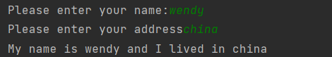
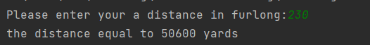
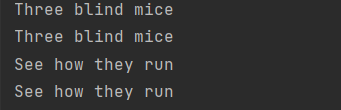
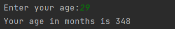
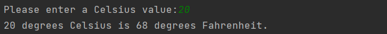
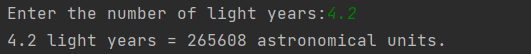

## 第二章练习

#### 问答

- What are the modules of C++ programs called?

class


- What does the following preprocessor directive do? #include 

引用标准库函数头文件


- What does the following statement do?

` using namespace std;`

使用std命名空间


- What statement would you use to print the phrase “Hello, world” and then start a new line?

`cout<<"Hello,world"<<endl;`


- What statement would you use to create an integer variable with the name cheeses?

`int cheeses;`


- What statement would you use to assign the value 32 to the variable cheeses?

`cheeses = 32;`


- What statement would you use to read a value from keyboard input into the variable cheeses?

`cin>>cheeses;`


- What statement would you use to print “We have X varieties of cheese,” where the current value of the cheeses variable replaces X?

`cout<<"We have "<<X<< " varieties of cheese";`


- What do the following function prototypes tell you about the functions?

  int froop(double t); 

  void rattle(int n); 

  int prune(void);


- When do you not have to use the keyword return when you define a function?

`void functionName(argument lsit);`


- Suppose your main() function has the following line: 

  `cout << “Please enter your PIN: “; `

  And suppose the compiler complains that cout is an unknown identifier.What is the likely cause of this complaint,and what are three ways to fix the problem?

问题可能是问声明使用`using std namespace;`

1\声明`using std namespace;`

2\声明 `using std::cout`

3\直接使用`std::cout << “Please enter your PIN: “; `


## 编程

1.Write a C++ program that displays your name and address (or if you value your privacy,a fictitious name and address).

```c++
#include <iostream>

void show_yourself(std::string name,std::string address);

int main(){
    using namespace std;
    string name,address;
    cout<<"Please enter your name:";
    cin>>name;
    cout<<"Please enter your address";
    cin>>address;
    show_yourself(name,address);
    return 0;
}

void show_yourself(std::string name,std::string address){
    std::cout<<"My name is "<<name<<" and I lived in "<<address;
}
```




2.Write a C++ program that asks for a distance in furlongs and converts it to yards. (One furlong is 220 yards.)

```c++
#include <iostream>
int fl2yd(int furlong);

int main(){
    using namespace std;
    int distance;
    cout<<"Please enter your a distance in furlong:";
    cin>>distance;
    int yards = fl2yd(distance);
    cout<<"the distance equal to "<<yards<<" yards";
    return 0;
}

int fl2yd(int furlong){
    return furlong*220;
}
```




3.Write a C++ program that uses three user-defined functions (counting main() as one) and produces the following output

```
Three blind mice 
Three blind mice 
See how they run
See how they run
```

One function, called two times, should produce the first two lines,and the remaining function,also called twice, should produce the remaining output. 

```c++
#include <iostream>
using namespace std;
void show_object();
void show_action();

int main(){
    show_object();
    show_object();
    show_action();
    show_action();
    return 0;
}

void show_object(){
    cout<<"Three blind mice"<<endl;
}
void show_action(){
    cout<<"See how they run"<<endl;
}
```




4.Write a program that asks the user to enter his or her age.The program then should display the age in months:

 **Enter your age: 29 Your age in months is 384.** 

```c++
#include <iostream>
using namespace std;
int Year2Month(int year);

int main(){
    int age;
    cout<<"Enter your age:";
    cin>>age;
    int month = Year2Month(age);
    cout<<"Your age in months is "<<month;
    return 0;
}

int Year2Month(int year){
    if(year>=0)
    return year*12;
    else return 0;
}
```




5.Write a program that has main() call a user-defined function that takes a Celsius temperature value as an argument and then returns the equivalent Fahrenheit value. The program should request the Celsius value as input from the user and display the result,as shown in the following code: 

`Please enter a Celsius value: 20` 

`20 degrees Celsius is 68 degrees Fahrenheit.` 

For reference, here is the formula for making the conversion: *Fahrenheit = 1.8 × degrees Celsius + 32.0* 

```c++
#include <iostream>
using namespace std;
int Celsius2Fahrenheit(int Celsius);

int main(){
    cout<<"Please enter a Celsius value:";
    double Celsius;
    cin>>Celsius;
    double Fahrenheit = Celsius2Fahrenheit(Celsius);
    cout<<Celsius<<" degrees Celsius is "<<Fahrenheit<<" degrees Fahrenheit.";
    return 0;
}

int Celsius2Fahrenheit(int Celsius){
    return 1.8*Celsius+32.0;
}
```




6.Write a program that has main() call a user-defined function that takes a distance in light years as an argument and then returns the distance in astronomical units. The program should request the light year value as input from the user and display the result,as shown in the following code: 

`Enter the number of light years: 4.2` 

`4.2 light years = 265608 astronomical units.` 

An astronomical unit is the average distance from the earth to the sun (about 150,000,000 km or 93,000,000 miles),and a light year is the distance light travels in a year (about 10 trillion kilometers or 6 trillion miles). (The nearest star after the sun is about 4.2 light years away.) Use type double (as in Listing 2.4) and this conversion factor: 

1 light year = 63,240 astronomical units 

```c++
#include <iostream>
using namespace std;
int ly2au(double lightYear);

int main(){
    cout<<"Enter the number of light years:";
    double lightYear;
    cin>>lightYear;
    double au = ly2au(lightYear);
    cout<<lightYear<<" light years = "<<au<<" astronomical units.";
    return 0;
}

int ly2au(double lightYear){
    return 63240*lightYear;
}
```




7.Write a program that asks the user to enter an hour value and a minute value.The main() function should then pass these two values to a type void function that displays the two values in the format shown in the following sample run: **Enter the number of hours: 9** 

**Enter the number of minutes: 28** 

**Time: 9:28**

```c++
#include <iostream>
using namespace std;
int ly2au(double lightYear);

int main(){
    cout<<"Enter the number of hours:";
    int hours;
    cin>>hours;
    cout<<"Enter the number minutes:";
    int minutes;
    cin>> minutes;
    cout<<"Time:"<<hours<<":"<<minutes;
    return 0;
}
```

