# 深入理解计算机系统笔记

[TOC]


## chapter01 信息

定义：信息就是位+上下文（进程执行的环境），基本单位bit,1byte=8bit

| C类型         | 32位(字节) | 64位（字节） |
| ------------- | ---------- | ------------ |
| char          | 1          | 1            |
| short         | 2          | 2            |
| int           | 4          | 4            |
| long int      | 4          | 4            |
| long long int | 8          | 8            |
| char*         | 4          | 8            |
| float         | 4          | 4            |
| double        | 8          | 8            |


#### 程序的历程

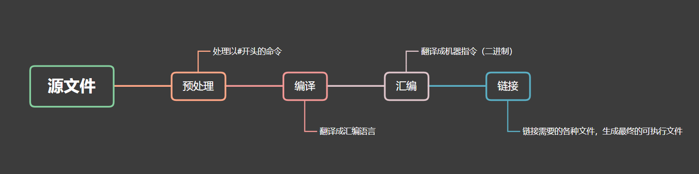

- 预处理：处理以#开头的命令

- 编译：翻译成汇编语言

  - **扫描（词法分析）**：**编译器**将源代码转换为一个个标记（tokens），标记是源代码中的基本单元，如**关键字、变量名、操作符**等。扫描器会根据词法规则将源代码划分为标记，并生成标记流以供后续分析使用。

  - **语法分析**：语法分析器将记号（Token）产生语法树（Syntax Tree）语法分析器会验证代码是否符合语法规则，同时构建AST以便后续的分析和优化

  - **语义分析**：静态语义（在编译器可以确定的语义）、动态语义（只能在运行期才能确定的语义）

    > 类型检查、作用域分析、符号解析、检查变量的类型是否匹配、函数调用是否合法以及是否存在未声明的标识符等问题

  - **源代码优化**：源代码优化器(Source Code Optimizer)，将整个语法书转化为中间代码（Intermediate Code）（中间代码是与目标机器和运行环境无关的）。中间代码使得编译器被分为前端和后端。编译器前端负责产生机器无关的中间代码；编译器后端将中间代码转化为目标机器代码。

  - **代码生成**：代码生成器(Code Generator).

  - **目标代码优化**：目标代码优化器(Target Code Optimizer

  > 寄存器分配、指令调度、内存访问优化

- 汇编：翻译成机器指令（二进制）

- 链接：链接需要的各种文件，生成最终的可执行文件


###### cmake和makefile

1. **语言和平台独立性**：
   - CMake：CMake是一个**跨平台**的元构建工具，它使用一种类似于脚本的CMakeLists.txt文件来描述项目的构建过程。C**Make会生成适用于不同构建工具（如Makefile、Visual Studio项目文件等）的配置文件，从而使项目能够在不同的操作系统和编译器上构建**。
   - Makefile：Makefile通常是特定于Unix/Linux操作系统的构建脚本，虽然可以在其他平台上使用，但需要进行适当的调整。
2. **可移植性**：
   - CMake：由于CMake的跨平台性质，它使项目更容易移植到不同的操作系统和编译器上。
   - Makefile：Makefile通常需要根据不同的操作系统和编译器进行修改，以确保项目能够在各种环境下正常构建。
3. **配置和生成**：
   - CMake：CMake的主要任务是配置项目，**并生成与构建工具相关的配置文件（如Makefile）**。用户可以使用CMake来配置不同的构建选项，如编译器、编译器标志、目标平台等。
   - Makefile：Makefile是一种构建脚本，通常需要手动编写，并且较难以配置不同的构建选项。
4. **可扩展性**：
   - CMake：CMake支持通过插件和模块进行扩展，可以轻松地添加自定义构建规则和逻辑。
   - Makefile：Makefile的可扩展性相对较差，较复杂的项目可能需要编写大量的Makefile代码。
5. **项目管理**：
   - CMake：CMake提供了更高级别的项目管理功能，可以轻松处理多个子项目、依赖项管理等。
   - Makefile：Makefile通常需要**手动编写**更多的代码来管理复杂项目的结构和依赖项。


**example**: hello.c

1. 执行预处理命令，生成hello.i

```shell
gcc -E -o hello.i hello.c
```


2. 执行编译命令，生成hello.s

```sh
gcc -S -o hello.s hello.i
```


3.执行汇编命令，生成hello.o

```sh
gcc -c hello.s -o hello.o
```


4.执行链接命令，生成hello文件

```sh
 gcc -o hello hello.o
```


#### 相关设备

##### shell

一般指在操作系统中，提供访问内核的接口


##### 硬件

- 总线：连接各个硬件、传输信息
- I/O设备：输入输出，键盘鼠标显示器磁盘等
- 主存
  - 高速缓存：速度比主存更快，存储容量小
- 处理器

----

**Cache为什么有那么多级？为什么一级比一级大？是不是Cache越大越好？**

Cache 有多级的设计是为了在处理器和内存之间建立一个层次结构，**以提高访问速度和系统性能**。每一级 Cache 都有其特定的设计目标和权衡，因此大小和层次结构的设计会受到多种因素的影响。

下面是关于为什么 Cache 有多级以及为什么一级比一级大的一些原因：

1. 访问速度和成本：**较小的 Cache 通常比较大的 Cache 更接近处理器，因此访问速度更快，可以更快地提供数据**。但较大的 Cache 成本更高，因此通过设计多级 Cache，可以在保持较小的高速 Cache 的同时，利用较大但稍慢的 Cache 提供更多的存储空间。
2. **局部性原理**：程序中存在着局部性原理，即程序往往倾向于频繁访问相邻的内存地址。多级 Cache 结构可以利用这种局部性，**较小的一级 Cache 作为较快的缓存来缓存最常用的数据**，而较大的一级 Cache 则作为更大的缓存来缓存更多的数据。
3. 空间和功耗：较大的 Cache 需要更多的存储空间和更高的功耗。为了平衡性能和成本，设计者将 Cache 分成多级，使得较小的一级 Cache 可以在更快的速度下提供高速缓存，而较大的一级 Cache 可以提供更多的存储空间。

总的来说，并非 Cache 越大越好。Cache 的设计需要考虑多个因素，包括成本、访问速度、空间、功耗等。根据应用程序的访问模式和需求，选择合适的 Cache 大小和层次结构可以提供更好的性能和效率。

此外，还要注意，Cache 的设计是一个动态的过程，随着处理器和内存技术的发展，Cache 的层次结构和大小也可能会发生变化，以适应不断增长的数据和性能需求。

---


#### 软件

- 操作系统
  - 进程：处理器、主存和I/O设备的抽象
  - 线程
  - 虚拟内存：对主存和磁盘的抽象
    - 内存管理： 程序代码和数据、堆、共享库、栈、内核虚拟内存
  - 文件
    - 对I/O设备的抽象

---

**虚拟内存**

虚拟内存是计算机操作系统中的一种技术，它将计算机的物理内存（RAM）和磁盘上的存储空间结合起来，为每个进程提供了一种假象，使得每个进程都拥有一个连续且私有的地址空间。

在使用虚拟内存的系统中，每个进程都被分配了一个虚拟地址空间，这个地址空间通常很大，远远超过了物理内存的容量。进程中的程序可以使用虚拟地址进行读写操作，而不需要直接关心物理内存的细节。

虚拟内存的实现方式是通过使用页表（Page Table）来实现虚拟地址到物理地址的映射。页表是一个数据结构，它存储了虚拟页面和物理页面之间的映射关系。当进程访问虚拟地址时，操作系统会根据页表将虚拟地址转换为对应的物理地址，然后进行实际的读写操作。

虚拟内存的主要优势包括：

1. **更大的地址空间：** 每个进程都可以拥有一个巨大的虚拟地址空间，远远超过了物理内存的限制。这样，即使系统的物理内存有限，每个进程仍然可以运行大型程序。
2. **内存隔离和保护：** 每个进程的虚拟地址空间是私有的，不同进程之间无法直接访问彼此的内存。这提供了进程之间的内存隔离和保护，确保一个进程无法破坏其他进程的内存数据。
3. **虚拟内存扩展：** 虚拟内存可以使用磁盘空间作为辅助存储，当物理内存不足时，操作系统可以将一部分不常用的数据从物理内存移出到磁盘上，从而释放出物理内存供其他进程使用。这样，虚拟内存可以扩展系统的内存容量。
4. **内存共享：** 虚拟内存可以实现内存共享的机制，多个进程可以将相同的物理页面映射到各自的虚拟地址空间中，从而实现数据共享和通信的效果。

总之，虚拟内存是一种操作系统的重要功能，它通过将物理内存和磁盘上的存储空间结合起来，提供了更大的地址空间、内存隔离和保护、虚拟内存扩展以及内存共享等优势，使得操作系统能够更高效地管理内存。

---


#### 指令集

RISC（Reduced Instruction Set Computer）和CISC（Complex Instruction Set Computer）是两种不同的计算机指令集架构。

**RISC指令集**架构是一种设计原则简单、指令集精简的计算机架构。RISC处理器的设计目标是通过使用少量的简单指令来提高执行速度和性能。


经典的RISC架构包括MIPS（Microprocessor without Interlocked Pipeline Stages）和ARM（Advanced RISC Machine）等。

1. **精简的指令集：** RISC架构的指令集非常精简，每个指令的功能单一、操作简单。这样可以简化处理器的设计和实现，提高指令执行的效率。
2. **寄存器为中心：** RISC架构鼓励广泛使用寄存器进行操作，将数据存储在寄存器中而不是内存中。这样可以减少内存访问的次数，提高指令执行的速度。
3. **流水线优化：** RISC架构适合实现流水线处理，**指令之间的依赖关系较少**，可以充分利用流水线的并行性来提高指令的吞吐量。
4. **简化的地址模式：** RISC架构通常使用简化的地址模式，例如，**将内存访问限制为基于寄存器的操作，而不使用复杂的内存寻址模式**。

经典的RISC架构包括MIPS（Microprocessor without Interlocked Pipeline Stages）和ARM（Advanced RISC Machine）等。


**CISC指令集**架构是一种设计原则复杂、指令集丰富的计算机架构。CISC处理器的设计目标是通过提供丰富的高级指令来减少编程工作量，允许用更少的指令完成复杂的操作。CISC指令集的特点包括：

1. **丰富的指令集：** CISC架构提供了大量复杂的指令，这些指令可以执行复杂的操作，并且一个指令可以完成多个低级操作。
2. **复杂的地址模式：** CISC架构**支持多样化和灵活的内存寻址模式，可以直接在指令中指定操作数的位置**。
3. **变长指令：** CISC指令集中的指令长度可以变化，指令的长度和格式不固定，可能会占用不同数量的字节。
4. **微码解码：** CISC处理器通常使用微码（Microcode）来解码指令，并且需要复杂的硬件设计来支持微码的解析。

经典的CISC架构包括x86架构，如Intel的x86处理器系列。


**基于栈的指令集和基于寄存器的指令集**

**基于栈的指令集**：基于栈的指令集使用栈作为主要的数据操作区域。指令通常包括将数据压入栈、从栈中弹出数据以及对栈顶数据进行操作的指令。基于栈的指令集没有专门的寄存器用于存储数据，而是通过操作栈来传递参数和保存临时数据。例如，Java虚拟机就采用了基于栈的指令集。

**基于寄存器的指令集**：基于寄存器的指令集使用寄存器作为主要的数据操作区域。指令通常包括将数据加载到寄存器、在寄存器之间进行操作以及将结果存储回内存的指令。基于寄存器的指令集使用寄存器来保存数据，以提高指令的执行速度和效率。例如，x86架构的处理器采用了基于寄存器的指令集。


**在进程的虚拟地址空间中，有用户栈，运行时堆等区域，如果一个进程运行了多个线程，用户栈是怎么使用的？**

在进程的虚拟地址空间中，每个线程都有自己的栈（stack），用于存储函数调用、局部变量和临时数据等。当一个进程运行多个线程时，每个线程都会有自己独立的栈空间。在进程的虚拟地址空间中，用户栈用于存储每个线程的栈帧和局部变量。当一个进程运行多个线程时，每个线程都会拥有自己的栈帧和栈空间。每个线程的栈帧会在用户栈中分配一块连续的内存区域，用于存储该线程的函数调用信息、局部变量以及其他与函数执行相关的数据。在多线程环境下，每个线程都会有自己的栈指针（stack pointer），它指向线程的栈帧顶部。当一个线程执行函数调用时，它的栈指针会移动到栈帧的顶部，并将函数的参数和返回地址压入栈中。线程执行函数时，函数内部的局部变量和临时变量也会存储在栈中。通过使用独立的栈帧和栈空间，每个线程可以独立地管理自己的函数调用、参数和局部变量，实现线程之间的隔离。


**南桥和北桥在什么位置？有什么作用？**

南桥（Southbridge）和北桥（Northbridge）是计算机主板上两个芯片组的名称，它们位于不同的位置并具有不同的功能。

**北桥**：北桥位于主板上靠近处理器的位置，主要负责**处理器和内存之间的数据传输和协调**。它通常包含**内存控制器，用于管理主存储器（RAM）的访问和数据传输**。此外，**北桥还处理与高速组件的通信**，如图形卡接口（如PCI Express），以及连接处理器和其他高性能外围设备的**总线**（如Front Side Bus）。北桥的功能主要**涉及处理器和系统内存之间的数据交换和通信**。

**keyword**:内存、高速组件、总线

**南桥**：南桥位于主板上靠近其他外部设备的位置，主要负责**连接和控制外部设备**。它提供了与较低速度外设的连接，如硬盘**驱动器（SATA/IDE）、USB（通用串行总线）端口、网络控制器、音频设备、PCI总线**等。南桥通常还**包含一些管理和控制功能，如系统时钟、电源管理和接口控制**。


## chapter02 信息处理

对于内存，访问任意一个地址，访问时间是相同的

### 虚拟内存

**使得应用程序认为它拥有连续的可用的内存（一个连续完整的地址空间）**，而实际上，它通常是被分割成多个物理内存碎片，还有部分暂时存储在外部磁盘存储器上，在需要时进行数据交换。虚拟内存将主存看成一个磁盘的高速缓存，主存中只保存活动区域，并根据需要在磁盘和主存之间来回传送数据。**虚拟内存的地址和磁盘的地址之间建立映射关系**。磁盘上活动的数组内容被缓存在主存中。在存储器层次结构中，磁盘的数据被分割成块，这些块作为磁盘和主存之间的存储单元。

#### 寻址空间和寻址能力

**寻址空间**：一般指CPU对于内存寻址的能力，就是能最多**用到多少内存**

**寻址能力**：CPU最大能**查找**多大范围的地址，以字节为单位，取决于系统**地址总线**和**地址寄存器**的宽度（位数一般相同）

[地址总线]:计算机系统中的一组物理线路，用于传输内存地址。地址总线的宽度决定了计算机可以寻址的内存空间的大小
[地址寄存器]:地址寄存器是CPU内部的一种寄存器，用于存储指令或数据的内存地址。它通常用于指示下一条要执行的指令或读取/写入数据的内存位置。


---

**x86**

一种cpu架构，因为intel的8086，286，386-586而得名，amd开发的大部分cpu也是基于x86架构。x86架构的特点是cpu的寄存器是32位的，基于32位cpu开发的操作系统就叫32位操作系统，32位操作系统也通常被成为x86系统。 **X86架构采用CISC（复杂指令集）**，而**ARM采用RISC（精简指令集）**。ARM处理器非常适用于移动通信领域，具有低成本、高性能和低电耗的特性。

---


#### 寻址和字节顺序

##### 大端和小端

小端：内存中按照从最低有效字节到最高有效字节的顺序存储对象

大端：按照从最高有效字节到最低有效字节的顺序存储对象

**判断大小端.cpp**

```c++
bool isBigendian(){
    int num=0x1234;
    char* str=reinterpret_cast<char*>(&num);
    return str[0]==0x1;
}
```


---

**可移植性**

不同的机器类型使用不同的且不兼容的指令和编码方法。即使是完全一样的进程，运行在不同的操作系统上也会有不同的编码规则，因此二进制代码是不兼容的。二进制代码很少能在不同机器和操作系统组合之间移植。

---

#### Unicode

- **ASCII 码**

上个世纪60年代，美国制定了一套字符编码，对英语字符与二进制位之间的关系，做了统一规定。这被称为 **ASCII 码**，一直沿用至今。

- **非 ASCII 编码**

> 中文编码的问题需要专文讨论，虽然都是用多个字节表示一个符号，但是GB类的汉字编码与后文的 Unicode 和 UTF-8 是毫无关系的。

Unicode 是一个很大的集合，现在的规模可以容纳100多万个符号。每个符号的编码都不一样，比如，`U+0639`表示阿拉伯字母`Ain`，`U+0041`表示英语的大写字母`A`，`U+4E25`表示汉字`严`。具体的符号对应表，可以查询[unicode.org](http://www.unicode.org/)，或者专门的[汉字对应表](http://www.chi2ko.com/tool/CJK.htm)。

1）出现了 Unicode 的多种存储方式，也就是说有许多种不同的二进制格式，可以用来表示 Unicode。

2）Unicode 在很长一段时间内无法推广，直到互联网的出现。

- **UTF-8**

UTF-8 就是在互联网上使用最广的一种 Unicode 的实现方式。其他实现方式还包括 UTF-16（字符用两个字节或四个字节表示）和 UTF-32（字符用四个字节表示），不过在互联网上基本不用。**重复一遍，这里的关系是，UTF-8 是 Unicode 的实现方式之一。**UTF-8 最大的一个特点，就是它是一种变长的编码方式。它可以使用1~4个字节表示一个符号，根据不同的符号而变化字节长度。

1. 对于单字节的符号，字节的第一位设为`0`，后面7位为这个符号的 Unicode 码。因此对于英语字母，UTF-8 编码和 ASCII 码是相同的。
2. 对于`n`字节的符号（`n > 1`），第一个字节的前`n`位都设为`1`，第`n + 1`位设为`0`，后面字节的前两位一律设为`10`。剩下的没有提及的二进制位，全部为这个符号的 Unicode 码。

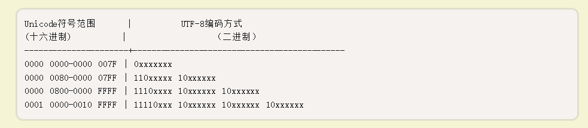


#### 运算

- 逻辑左移：补零
- 算术左移：补零
- 逻辑右移：补零
- 算术右移：看符号

**加减法的优先级比移位运算符要高，拿不准的话记得加括号**


#### 有符号数和无符号数

- **原码**：原码是指将最高位作为符号位（0表示正，1表示负），其他数字位代表数值本身的绝对值的数字表示方式。
- **反码**：如果是正数，则表示方法和原码一样，如果是负数，符号位不变，其余各位取反
- **补码**：如果是正数，则表示方法和原码一样，如果是负数，则将数字的反码加上1


**有符号数和无符号数的转换**：**数值**可能会改变，但是**位模式不变**。

当数据类型转换时，同时需要在不同数据大小以及无符号数和有符号数之间转换。C语言标准要求先进行**数据大小的转换**，之后再进行无符号和有符号之间的转换。


**定点数：**

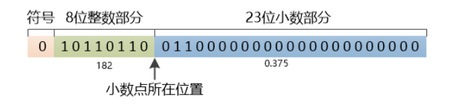

**浮点数**：

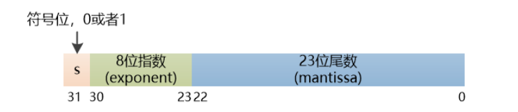


## chapter03  程序机器级表示

### 机器级编程

**抽象**

- **指令集体系结构或指令集架构**来定义机器级程序的格式和行为，它定义了处理器状态、指令的格式，以及每条指令对状态的影响
- 机器级程序使用的**内存地址是虚拟地址**，提供的内存模型看上去是一个非常大的字节数组


#### 数据格式

- movb(传送字节)
- movw(传送字)
- movl(传送双字)
- movq(传送四字)


#### 信息访问

一个`x86-64`的中央处理单元包含一组16个存储64位值的**通用目的寄存器**。这些寄存器用来存储整型数据和指针。16个寄存器，他们的**名字都是%r开头**。

**访问方式**：

1. 立即数，用来表示常数
2. 寄存器，表示某个寄存器的内容
3. 内存引用，它会根据计算出来的地址访问某个内存位置

```c++
long exchange(long *xp, long y)
{
    long x = *xp;
    *xp = y;
    return x;
}
```

C代码转成汇编后

```assembly
long exchange(long *xp, long y)
xp in %rdi, y in %rsi
exchange:
    movq      (%rdi), %rax
    movq      %rsi, (%rdi)
    ret
```


**指令**

- 加载有效地址：加载有效地址（load effective address）指令是一种计算机指令，它实际上是 movl 指令的变形。它的指令形式表面上是从内存读数据到寄存器，但实际上它没有引用内存，它的第一个操作数看上去是一个内存引用，但该指令并不是从指定的位置读入数据，而是将有效地址写入到目的操作数
- 一元操作
- 二元操作
- 移位


#### 控制

**条件码**

- CF:进位
  - 检查无符号操作额溢出
- ZF:置零
- SF:符号位
- OF:溢出标志
  - 补码溢出———正溢出或副溢出

**跳转指令**

- 无条件
  - JMP：无条件跳转到指定的标签或内存地址。
  - CALL：无条件跳转到指定的过程或子程序，并将返回地址入栈。
  - RET：返回到调用者的位置，通常与CALL指令一起使用。
- 有条件
  - JZ / JE：等于零时跳转。
  - JNZ / JNE：不等于零时跳转。
  - JC：进位时跳转。
  - JNC：无进位时跳转。
  - JO：溢出时跳转。
  - JNO：无溢出时跳转。
  - JS：负数时跳转。
  - JNS：非负数时跳转。
  - JP / JPE：偶数个1时跳转。
  - JNP / JPO：奇数个1时跳转。
  - JL / JNGE：小于时跳转。
  - JLE / JNG：小于等于时跳转。
  - JG / JNLE：大于时跳转。
  - JGE / JNL：大于等于时跳转。
- 循环指令
  - LOOP：根据计数寄存器的值进行循环。
  - LOOPZ / LOOPE：根据计数寄存器的值进行循环，直到计数为零或零标志位为1。
  - LOOPNZ / LOOPNE：根据计数寄存器的值进行循环，直到计数为零或零标志位为0。
- 其他指令
  - INT：触发软件中断，跳转到中断处理程序。
  - HLT：停机指令，使处理器暂停执行。


**do-while循环**

```assembly
loop:
    body-statement
    t = test-expr;
    if (t):
        goto loop;
```


**while循环**

```assembly
    goto test;
loop:
    body-statement
test:
    t = test-expr;
    if (t)
        goto loop;
```


#### 过程

**程序栈**

程序栈由一系列栈帧构成，这些**栈帧每一个都对应一个过程**，而且每一个帧指针+4的位置都存储着函数的返回地址。帧指针（Frame Pointer）是一个特殊的寄存器，它指向当前函数的栈帧（Stack Frame）,栈帧是用于存储函数的局部变量、参数以及其他相关信息的一块内存区域。**每一个帧指针指向的存储器位置当中都备份着调用者的帧指针**。每一个栈帧都建立在调用者的下方（也就是地址递减的方向），当被调用者执行完毕时，这一段栈帧会被释放。

**%ebp**通常用于建立一个稳定的参考点，指向当前函数的栈帧的底部。栈帧的底部通常是存储参数、局部变量和其他相关信息的位置。%ebp的值在函数执行过程中保持不变，因此可以用作访问这些数据的基准。

**%esp**是栈指针寄存器，它指向栈帧的顶部，即栈的当前位置。%esp的值在函数执行过程中会动态地变化，随着栈的分配和释放而移动。当新的局部变量被分配或函数调用发生时，%esp会向下移动；当局部变量被释放或函数返回时，%esp会向上移动。

在访问存储器时，通常会使用%ebp作为参考点，并结合偏移量来定位特定的局部变量、参数和其他存储器位置。这种方式可以确保在栈指针移动的情况下仍能准确地访问所需的存储器位置。


#### 程序的机器级表示

程序的机器级表示是指将高级编程语言（如C、Java）编写的源代码转换为特定机器体系结构的机器码表示的过程。机器级表示是计算机硬件和操作系统所理解的指令序列，用于直接在计算机上执行程序。

例子

C

```c
#include <stdio.h>

int main() {
   int a = 5;
   int b = 10;
   int sum = a + b;
   printf("The sum is: %d\n", sum);
   return 0;
}

```

汇编语言

```assembly
section .data//一个指令，用于定义数据段（Data Segment）
   format db "The sum is: %d", 10, 0//format 是一个标签（Label），它可以作为字符串的引用点。db 是"define byte"的缩写，用于定义一个字节序列

section .text//用于定义代码段（Text Segment）或文本段
   global _start//global _start 是一个指令用于声明一个全局符号 _start，表示程序的入口点。在x86汇编中，程序的执行通常从标记为 _start 的位置开始。

_start:
   ; 分配栈空间
   sub esp, 12

   ; 设置局部变量 a 和 b 的值
   mov dword [esp], 5
   mov dword [esp+4], 10

   ; 计算和并存储在局部变量 sum 中
   mov eax, [esp]
   add eax, [esp+4]
   mov [esp+8], eax

   ; 调用 printf 函数打印结果
   push dword format
   push dword [esp+8]
   call printf
   add esp, 8

   ; 返回 0
   xor eax, eax
   ; 释放栈空间
   add esp, 12

   ; 退出程序
   mov ebx, 0//将立即数0（常量）存储到寄存器ebx中。在这个特定的上下文中，ebx寄存器通常用作系统调用的参数
   int 0x80//通过将0存储在ebx寄存器中，并触发int 0x80中断

```


#### 缓冲区溢出

**原因**：

- 缺陷的程序设计

**安全危机**：

- 向缓冲区写入超过其容量的数据来覆盖相邻的内存区域，从而改变程序的行为
  - 制造缓冲区溢出：攻击者向缓冲区输入超过其容量的数据，覆盖相邻的内存区域。
  - 改变程序行为：通过溢出的数据，攻击者可以修改函数返回地址（Return Address），使其指向攻击者控制的代码区域，通常是恶意注入的代码。
  - 执行恶意代码：一旦程序执行了恶意注入的代码，攻击者就可以利用这个漏洞来运行任意指令，例如执行Shell命令，获取系统权限，访问敏感数据等。


## chapter04 处理器体系结构

### Y86-64指令集体系结构

- 状态单元
- 指令集及其编码
- 编程规范
- 异常事件处理


#### 状态单元

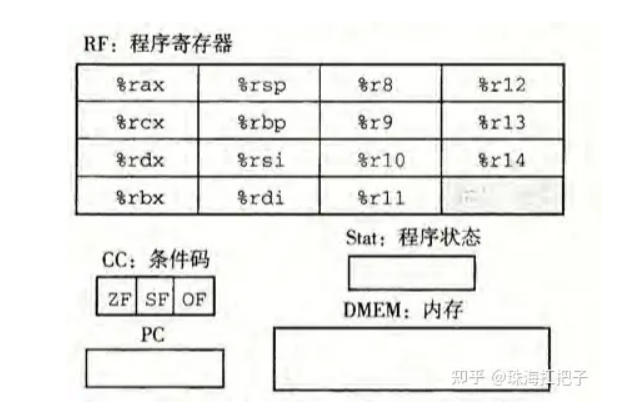

- 15个**寄存器**；除 %rsp 作为栈指针，其他寄存器没有固定含义和固定值,在硬件中，寄存器直接将它的输入和输出线连接到电路的其他部分。
- 3个1位的**条件码**，保存最近的算术或逻辑指令造成的影响
- 程序计数器（**PC**）存放当前指令的地址
- **内存**：一个很大的字节数组，保存程序和数据；用虚拟地址来引用内存位置
- 状态码**stat**：程序执行的总体状态，正常运行还是某种异常


#### 指令及其编码

**指令**

- irmovq, rrmovq, mrmovq, rmmovq：第1个字母指明了源的类型，第2个字母表明了目的的类型；源可以是立即数(i)，寄存器(r)或内存(m)；目的可以是 r 和 m；
- OPq：整数操作指令；
- JXX：转跳指令；
- cmovXX：条件传送指令；
- call：将返回地址入栈，然后跳到目的地址；
- pushq，popq：入栈，出栈；
- halt：停止指令的执行；

每条指令的第1个字节表明指令的类型，该字节前4位是代码，后四位是功能

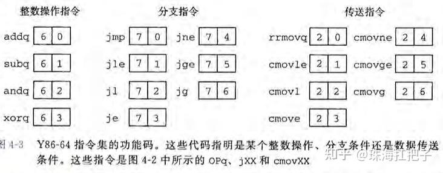

**编码**

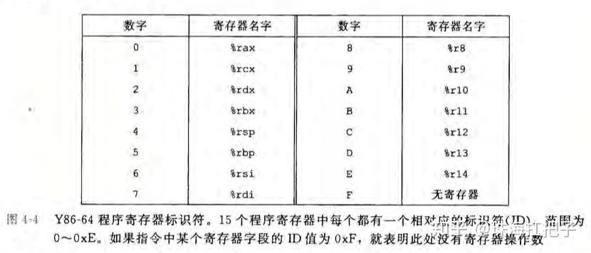


寄存器

- 15个寄存器各有一个0~0xE之间的**寄存器标识符（register ID）**，程序寄存器存储在CPU中的寄存器文件中，这是一个以寄存器ID作为地址的随机访问存储器，当不访问任何寄存器时，用0xF表示

演示过程

> 1. 指令：rmmovq %rsp, 0x123456789abcd(%rdx)
> 2. 第1个字节为 40；%rsp 位于 rA；%rdx 位于 rB (42)；
> 3. 0x123456789abcd 填充上0变为8个字节的字节序列，00 01 23 45 67 89 ab cd；反序得到cd ab 89 67 45 23 01 00；
> 4. 最后得到：4042cdab896745230100；


### 逻辑设计和硬件控制语言（HCL

数字系统的三大组合部分：

- 对位操作函数的组合逻辑
- 存储位的存储单元
- 控制存储器更新的时钟信号


#### 逻辑门

**基本计算单元**，只对单个位的数进行计算

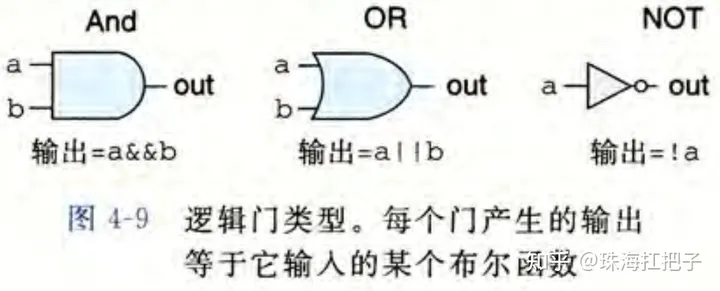


#### 组合电路

很多的逻辑门组合在一起，构成了计算块（computational block），称为**组合电路（combinational circuits）**

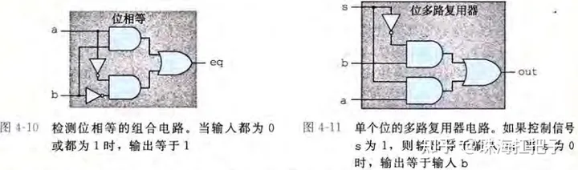

---

**字级的组合电路**

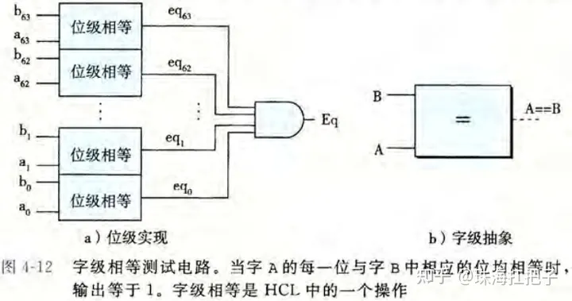

---


#### 存储器和时钟

##### 时序电路（sequential circuit）

时序电路（Sequential Circuit）是数字电路的一种，与组合电路（Combinational Circuit）相对。时序电路是一种具有存储功能的电路，其输出不仅取决于当前的输入，还取决于过去的输入和内部状态。时序电路包含时钟信号和存储元件，可以实现记忆、状态转换和时间控制等功能。

时序电路中最基本的存储元件是触发器（Flip-Flop），它可以存储一位二进制数据，并在时钟信号的边沿触发时更新数据。

- SR触发器
- D触发器
- JK触发器


触发方式：

- 同步时序电路：所有的存储元件都与相同的时钟信号相连，通过时钟边沿触发数据的更新。同步时序电路的操作是同步的，依赖于时钟信号的周期和边沿。

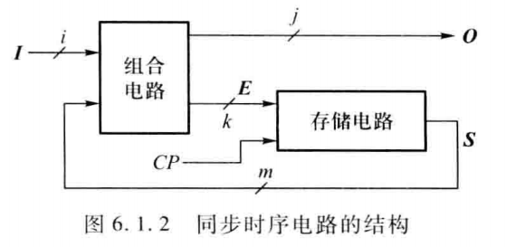

- 异步时序电路：异步时序电路中的存储元件可以根据异步信号的条件进行数据更新，而不仅仅依赖于时钟信号，**步时序电路与同步时序电路的主要区别在于电路中没有统一的时钟脉冲，因而各存储电路不是同时更新状态，状态之间没有准确的时间分界**。
  - 分析状态转换时必须考虑各触发器的时钟信号作用情况（不共用时钟信号）
  - 每一次状态转换必须从输入信号所能触发的第一个触发器开始逐级确定
  - 每一次状态转换都有一定的时间延迟


- **时钟（clock）**控制存储设备产生时序电路，时钟是周期性信号，决定何时把新值加载到设备中。

- **存储器**

  - 时钟寄存器：存储和跟踪系统时钟的信息，时钟寄存器的值会随着系统时钟的节拍而递增。

  - 随机访问存储器（内存）

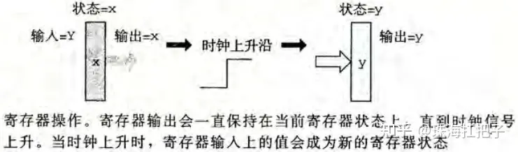


### 处理器顺序实现

#### 组织成阶段

在一个时钟周期上，处理器执行完一条完整指令所需的所有步骤。

1. **取指（fetch）**：从内存读取指令字节，地址为程序计数器（PC）的值；
2. 译码（decode）：从寄存器读入最多两个操作数；
3. 执行（execute）：**算术逻辑单元（ALU）执行指令的操作**，计算内存引用的有效**地址**；或增加或减少**栈指针**；
4. 访存（memory）：将数据写入内存，或从内存读出数据；
5. 写回（write back）：把结果写入寄存器文件；
6. **更新PC**（PC update）：将PC设置成下一条指令的地址；


#### 硬件结构

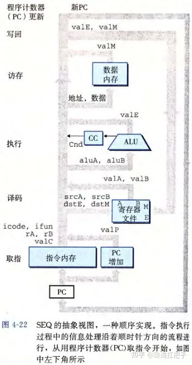


#### 流水线

在流水线系统中，待执行的任务被划分成若干个相互独立的阶段。

**三段流水线时序**

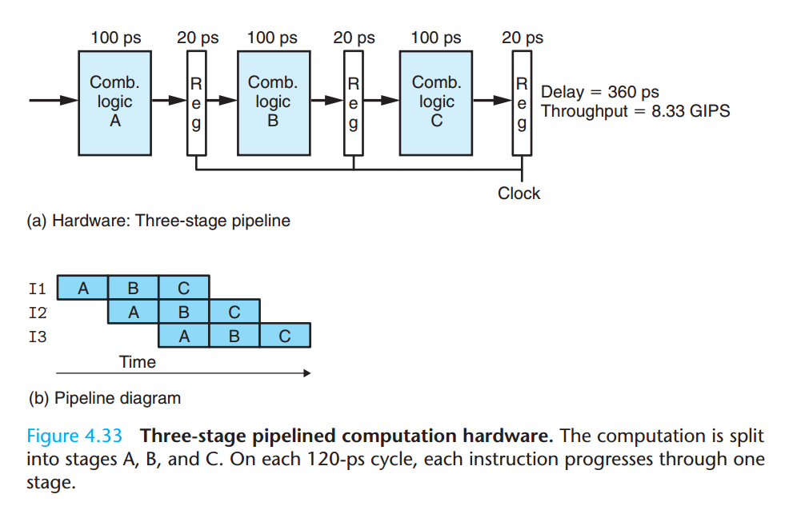

**局限性**：

- 不一致的划分
- 流水线过深，收益反而下降（由寄存器延迟造成的）


**带反馈的流水线系统**

- 数据相关
- 顺序相关
- 控制相关


#### 实现

- 在SEQ+的各个阶段之间插入流水线寄存器，并对信号重新做排列
- 在流水线化的设计中，对应正在进过系统的各个指令，对指令中处理的值进行重新排列和标号
- 预测下一个PC
- 数据相关和控制相关导致的流水线产生的计算错误，成为冒险（hazard）。同样，冒险也分为数据冒险和控制冒险两大部分。
- 暂停时，处理器会停止流水线中一条或多条指令，知道冒险不再满足
- 用转发来避免数据冒险


## chapter05 优化程序性能

https://www.liuin.cn/categories/%E8%AF%BB%E4%B9%A6%E7%AC%94%E8%AE%B0/page/5/


## chapter06 存储器层次结构

https://www.liuin.cn/categories/%E8%AF%BB%E4%B9%A6%E7%AC%94%E8%AE%B0/page/5/


## chapter07 链接

https://www.liuin.cn/categories/%E8%AF%BB%E4%B9%A6%E7%AC%94%E8%AE%B0/page/5/

## chapter08 异常控制流


## chapter09 虚拟存储器


## chapter10 系统级I/O


##  chapter11 网络编程


## chapter 12 并发编程


