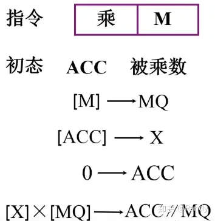
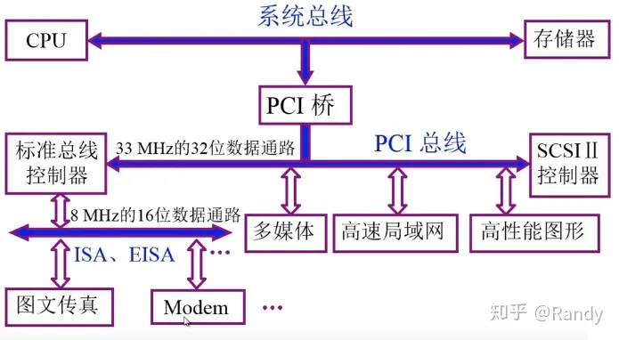
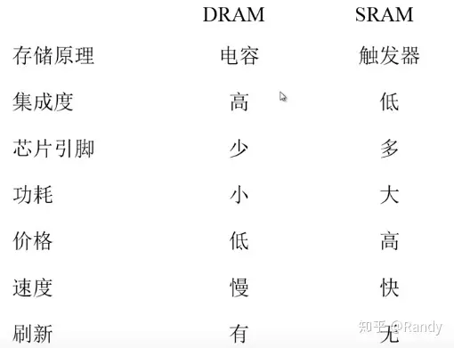
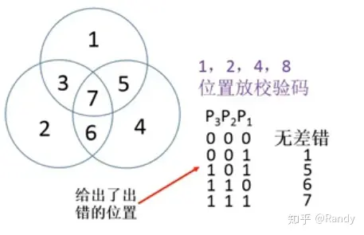
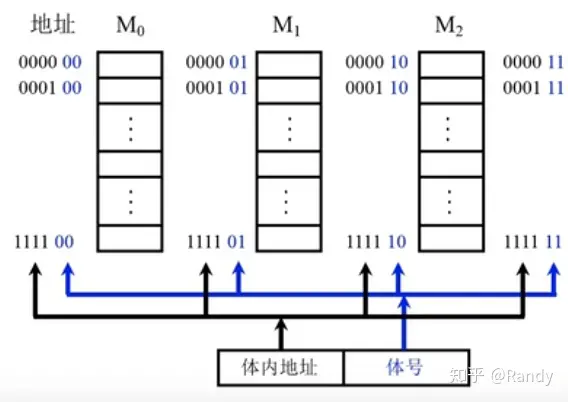
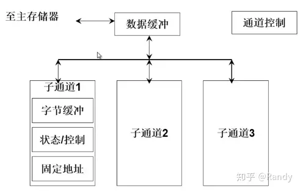
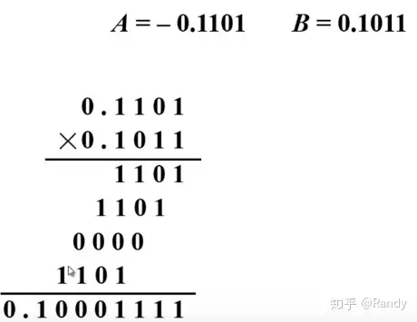
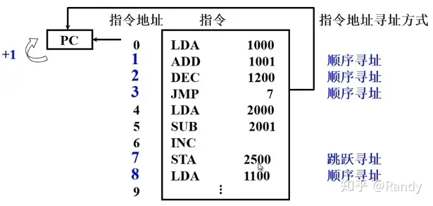
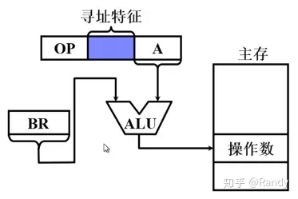
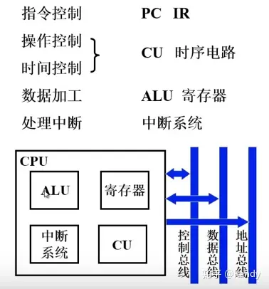

# 计算机组成原理

[参考资料1]:https://zhuanlan.zhihu.com/p/118673379
[TOC]

## 概述

### 计算机的发展

#### 第一台计算机

1946年美国宾夕法尼亚大学研制的ENIAC是世界上第一台通用计算机，ENIAC是之前提到的EDVAC的原型，冯·诺伊曼结构的计算机正是基于这台计算机的研究成果总结和提出的

#### IBM system/360

IBM System/360是IBM在1964年推出的大、中、小一些列机型的总称，这一些列计算机是世界上最先出现的，可兼容指令计算机,System/360另一个最为主要贡献是在研制过程中，提出了计算机体系结构的概念，首次明确定义了计算机软硬件的交界面标准，联系了硬件和软件的设计者，以此为基础诞生了之后的其它系列机型，兼容机型

#### 微处理器与微型计算机的出现与发展

微处理器是指一片高度集成化的电路，包含控制器，运算器，所构成的处理核心，也就是我们平时所说的CPU.

**摩尔定律**

CPU发展过程中，新一代的CPU约每隔18-24个月就会发布，其包含的晶体管数量便会较上一代增加一倍，性能也会提升一倍，从而1美元能够购买到的算力每18-24个月便会增长一倍

### 软件+硬件

- **计算机组成原理**是计算机硬件的最上层
- **计算机系统/体系结构**是软硬件之间的协调交界，研究的是计算机软硬件的功能分配，软件与硬件之间的交互接口（API/指令集）
- **计算机操作系统**则是计算机软件的底层

**算力单位**：Flops(floating point operations per second)

### 计算机的基本结构

#### 冯·诺伊曼结构（**储存程序计算机**）

- 运算器：按指令对数据进行运算处理，**以运算器为运行中心**
  - 程序指令和数据共用同一个存储器，进行**等位存储**，可以**按地址寻访**，指令和数据均**以二进制表示**
  - **指令由操作码和地址码组成**，操作码反应了该指令的具体操作，地址码反映了操作需要应用到的操作数据所在的地址
- 控制器：控制程序指令的读取和执行
- 存储器：存储程序指令和数据
- 输入设备：对接用户，输入程序指令和数据到存储器
- 输出设备：显示运算结果

:warning:**运算器很容易成为结构中的瓶颈**

#### 哈佛结构

区分了**程序指令和数据的存储器**，分别使用两套地址/数据总线进行读写，**改进型哈佛结构**则**对地址/数据总线进行了统一**，现代处理器虽然外部依然是冯·诺伊曼结构，但其内部的Cache是按照改进型哈佛结构，分为**数据Cache**和**指令Cache**进行组织的

#### 改进体系

**以存储器为核心的改进体系结构**

将存储器作为核心，输入输出设备直接与存储器进行数据交换，运算器只读取需要的数据进行运算处理，从而提高了工作效率。

#### 现代计算机

### 可计算

明确问题的可计算性后，我们需要**设计计算模型**，并进行**编程**对计算模型进行表述，从而形成一套**指令集**，按照指令集中的步骤进行执行就能计算得到问题的答案

### 存储器

**存储体**

- 包含多个**存储单元**
  - 每个存储单元能够独立保存一串二进制代码（**存储字**）
    - 存储字具有特定的**存储字长**，这个长度是存储单元保存的二进制代码的位数，也是存储单元所包含的存储元件数量
  - 存储单元又由多个**存储元件**构成
    - 每个存储元件保存一个基本进制位上的0/1

**接口寄存器**

MAR和MDR是存储器联系外部的窗口，或称**接口寄存器**

**MDR**:存储器数据寄存器**，MDR就是存储单元保存数据的地方，**MDR的长度就是存储字长

**MAR**:存储器地址寄存器，MAR的长度反应了存储体中**存储单元的数量**

**读取操作**：

- 将地址传入MAR中
- MAR会根据地址在CU的控制下，找到存储体中对应的存储单元并将数据拷贝到MDR中
- 随后MDR在CU的控制下将数据拷贝到外部需要的位置

**写入操作**：

- 将地址传入MAR中（MAR会将地址传递给存储体，告知存储器接下来要往地址对应的存储单元写入数据）
- 将数据拷贝至MDR（先传递给MDR）
- MDR将数据传递给存储体

### 运算器

它的核心是一个能够实现多种算数运算和逻辑运算的组合逻辑电路---ALU(arithmetic and logic unit)，又称为**算术逻辑单元**

#### 寄存器

**ACC寄存器**：保存一个操作数和运算的结果

**X寄存器**：保存输入的一个操作数

**MQ寄存器（乘商寄存器）**：会在乘法和除法操作中参与运算，并辅助ACC进行结果的保存

#### 运算操作

**加法**

**减法**

**乘法**

**除法**

#### 控制器

控制每条程序指令和硬件操作的**有序执行**，包括对指令进行的读取，解析，执行，保存结果这一系列过程

**基本步骤**

- 从存储器中**读取指令**
- 操作码部分送达控制单元**解析指令**
- **控制单元CU**控制相应的部件**完成指令**

**寄存器**

- **PC寄存器**：**保存当前执行指令地址**的寄存器，**完成指令读取后**PC寄存器的地址值就会**自加1**（增加1条指令存储字），从而指向下一条指令的地址
- **IR寄存器**：将指令的**操作码部分传递给CU**，由CU完成对操作码的解析，并对相应的部件发出控制信号

####  完成指令的具体过程

##### 取数指令：将存储器中某个地址处的数据读取到累加器（ACC）中

初始状态下PC中已经保存了取数指令的地址

##### 取指&解析：

- PC将地址传入MAR中
- MAR在CU的控制下，将传入地址传递给储存体，找到指令代码对应的储存单元
- 存储体在CU的控制下，将对应存储单元中的指令代码拷贝到MDR中
- MDR在CU的控制下，将指令代码传入到IR中
- IR将指令的操作码（OP）传入到CU中

##### 执行指令

- CU解析指令操作码后，将IR中的地址码（AD），传入MAR中
- MAR在CU的控制下，将传入地址传递给储存体，找到需要读取的数据对应的储存单元
- 存储体在CU的控制下，将对应存储单元中的数据拷贝到MDR中
- MDR在CU的控制下将数据传入到ACC中

----

##### 存储指令过程

存数指令：将ACC中的某个数据保存到存储体中的某个地址下

##### 取指&解析

- PC将地址传入MAR中
- MAR在CU的控制下，将传入地址传递给储存体，找到指令代码对应的储存单元
- 存储体在CU的控制下，将对应存储单元中的指令代码拷贝到MDR中
- MDR在CU的控制下，将指令代码传入到IR中
- IR将指令的操作码（OP）传入到CU中

##### 执行指令

- CU解析操作码后，将IR中的地址码传入MAR中
- MAR将存数地址传入到存储体，存储体找到对应的存储单元，准备向这个单元写入数据
- ACC在CU的控制下，将数据传入到MDR中
- MDR在CU的控制下，将数据传给存储体，存储体将数据写入到之前准备好的存储单元中

PC寄存器**在每次完成读取指令代码到IR寄存器后**地址值就会自加1，指向下一条指令的地址，从而程序指令会逐条，有序的执行，直到遇到**停机指令**，结束程序的运行

### 性能指标

#### 机器字长

机器字长指CPU一次能处理的数据位数，与CPU的寄存器位数有关（通常相等），我们常说的32位 64位CPU就是指机器字长

#### 运算速度指标

- **主频**：CPU时钟周期的频率，CPU的指令操作是在时钟信号控制下，每周期逐步完成的，因而主频在一定程度上能够反应CPU的运算速度
- **核心数**：CPU中每个核心都是能够独立执行某个程序/线程的处理器
- **吉普森法**：实际程序中每条指令的运行时间，相对于每条指令的出现频率进行加权平均，得到的计算机执行程序指令的平均时间，能够反应计算机硬件执行指令的快慢
  - 静态频率：根据程序清单的进行计算
  - 动态频率：根据程序的实际运行进行计算
- **CPI**:执行一条指令需要的执行周期，同样是根据指令的出现频率，得到的加权平均指，能够反应计算机运行时，在离散的时钟周期下指令的执行效率
- **IPC**:一个时钟周期下能够运行的最大指令数量
- **IPS**:每秒能够完成的指令数量
- **FLOPS**:每秒能完成的的浮点运算次数

#### 存储容量

- **主存**：存储单元数量×存储字长来表示（MAR长度×MDR长度）
- **辅存**：通常直接用字节数表示，一般容量尺度是 1GB

实际厂家制造内存/硬盘时常以1000进制换算，并且标注1GB/1TB的内存/硬盘，实际能够使用的容量也达不到1GB/1TB，往往只有90%，900MB/900GB左右的实际可用容量

### 系统总线

**总线**（Bus）是计算机各种功能部件之间传送信息的**公共通信干线**，是各个设备共享的传输介质，其本质是信号的公共传输线，**同一条总线上，同一时间只允许一对设备进行相互通信**。

**信道**：传输一位二进制数据的通路

**传输方式**

- 串行传输：只**使用一条信道**，逐位发送一串二进制数来传递数据（中长距下具有速度优势）
- 并行传输：**使用多条信道**同时发送多位二进制数据（短距下具有速度优势）

信号的传输需要遵循一定的**频率**（把电流变化曲线按频率切割根据高低判断0/1），在频率相等的情况下并行传输的速度要快于串行传输，但并行传输存在信号的干扰（电磁学），尤其是在**高频率/长距离**下，过强的信号干扰会导致无法正确的传输0/1数据

#### 分类

- **片内总线**：实现的是**单块芯片内部**各部件之间的传输通信
- **系统总线**：实现**芯片与芯片之间**，之前提到的计算机**各个组成部件之间**的信息传输
  - **数据总线**：双向的，其信道宽度与机器字长，存储字长有关（通常小于）
  - **地址总线**：单向的，其信道宽度与存储地址长度，I/O地址长度有关（通常相等）
  - **控制总线**：双向的，需要传输来自CPU的控制信号，来自设备的状态反馈，总线的使用许可，中断请求等等信息
- **通信总线**：计算机与计算机之间，计算机与其它设备进行**跨设备信息传输交换**的总线

##### 总线特性

- 机械特性：尺寸构造，针脚排列规范
- 电气特性：传输方向，电平的高低范围
- 功能特性：在传输信息/信号类型上的针对性分类
- 时间特性：总线信号间的时序关系

##### 总线性能

- **总线宽度**（传输带宽）：等同于总线中数据线/信道的数量，决定了总线能够同时传输的数据位数
- **标准传输率**：以每秒传输的最大字节数（MBps）来衡量
- **时钟特性**：同步进行，还是非同步进行（异步为非同步的一种），以及使用怎样的时钟频率进行数据的收发
- **复用性**：只能单一传输一种类型的数据（数据，地址）还是能够传输多种类型的数据
- **信号线数**：各功能类型总线的综合
- **控制方式**：突发，自动，逻辑，仲裁，计数
- **其他**：如负载能力等等

##### 总线标准

- ISA：工业标准数据总线
- PCI：外设标准总线，它与外部设备构成了一种中介缓冲器模式，用于对内外时钟频率差异的进行适配，从而外部可以对设备进行任意的添加而不影响CPU的工作，导致计算机性能降低
- AGP：点对点局部传输总线，主要用于连接CPU（控制芯片）和GPU（显卡）
- RS-232：串行接口总线标准
- USB：串行接口总线标准

### 总线结构

#### 单总线结构

**将所有设备都联接到一条总线上**，但由于单总线**同一时间，只允许一对设备进行传输交互**，其它设备需要传输时就需要等待正在使用总线的设备释放总线，这种设计会导致系统中存在总线资源的抢占问题，容易成为**系统的瓶颈**

#### 双总线结构

##### 以CPU为核心的双总线结构

以CPU为核心的系统结构中，以CPU中心发出两条总线

- **I/O总线**：一条专用于与**I/O设备传输数据**
- **M总线**：一条专用于与**主存传输数据**

##### 以存储器为核心的双总线结构

- **存储总线**：系统总线用于连接主存和其它部件（也包括CPU），存储总线专用于连接CPU
- **系统总线**

主存依然无法同时使用两条总线进行数据交换，现代的双口存储器依然需要使用**分时机制**来完成分别完成两条总线上的数据交换

##### 通道连接的主存总线与I/O总线结构

通过通道连接I/O总线，实现I/O设备与CPU和主存之间的通信，通道是一种特殊的，结构简单的处理器，其程序**由操作系统进行编写**，并可独立运行

#### 三总线结构

##### CPU为核心扩展DMA总线

在以CPU为核心双总线结构的基础上扩展出一条DMA（直接存储器访问）总线：

**用于高速I/O设备与主存之间的高速数据交换**

##### Cache三总线结构

- 扩展总线：外设
- 系统总线
- 局部总线：cache与cpu

#### 四总线结构

由Cache桥扩展出高速总线，实现**高速外设与CPU**的数据交换(外设-cache)

#### 实际总线结构

##### 传统微型计算机总线结构

系统总线连接CPU和主存，扩展出标准总线控制器，I/O总线，连接其它设备

##### VL-BUS总线结构

系统总线扩展出VL-BUS高速总线，连接高速设备（例如图形设备）,VL-BUL总线再扩展出总线控制器，ISA/EISA总线连接低速设备

##### PCI总线结构

系统总线扩展出PCI桥和PCI总线连接高速设备，再由PCI总线扩展出标准总线控制器和ISA/EISA总线连接低速设备，**PCI总线结构的缺点是当PCI总线上连接设备过多时，总线带宽不够，导致总体性能下降**

**多层PCI结构**

### 总线控制

**同一时间只允许一对设备使用总线进行相互通信**，因而设备在需要通信时会向总线发出**占用申请**，在得到占用许可后通过总线完成数据交换

**总线传输周期**

- 申请分配：主模块申请，总线仲裁决定
- 寻址阶段：主模块向从模块给出地址和命令
- 传数阶段：主模块和从模块交换数据
- 结束阶段：主模块撤消有关信息

#### 判优控制

当多个设备发送占用申请时，如何合理的分配总线资源

**总线设备**

- **主设备**：通信的**主导方**，能发送总线占用申请，在占用总线后对总线，及从设备的通信具有控制权
- **从设备**：通信的**被动方**，只能相应主设备的通信请求，完成通信

> 一些设备既可以作为主设备也可以作为从设备
>
> 有的总线只允许有一个主设备，有的总线允许有多个主设备

##### 集中式:由一个部件（CPU）完成

**链式查询**

数据线和地址线完成总线的数据传输功能，此外还有3条控制线传递控制信息

- BR(bus request)总线请求信号线,所有设备都使用这条线路来发出总线占用请求
- BS(bus busy)总线忙信号线，用于获得占用许可的设备向控制部件反馈/设置通信控制信息
- BG(bus grant)总线占用许可信号线，用于链式查询发出总线占用信息的设备，**按照优先级来布置BG线的寻访顺序**

> 首先I/O设备从BR线向控制部件发送占用申请，之后控制部件通过BG线传输授权许可，**许可信号会链式寻访每个I/O设备**，轮询是否需要占用总线，当遇到需要占用总线的设备时，该设备**截取**控制权，BG线信息不再向后传输，获得控制权的设备通过BS线反馈通信信息，展开通信

**优先**：**结构简单**，**设备易扩展**等优点

**缺点**：

- **对电路故障敏感**，尤其是BG线，一旦线路或是某个接口出现故障，导致信号传输中断，之后的I/O设备占用申请将永无应答
  - 可以通过增加BG/BS信号线条数，来**快速实现可靠性的增强**
- 当连接设备过多时BG线容易成为瓶颈，降低整体运行效能

**计数器定时查询**

**控制线**

- **BS(总线忙)**
- **BR(总线占用请求)**
- **设备地址信号线**

总线控制部件内部有一个**计数器**（计数器定时查询模式中**寻访逻辑可编程**），当设备通过BR线向总线控制部件提出占用请求后，计数器下标会进行初始化，随后按一定方式进行递推，总线控制部件将根据计数器下标寻访对应的I/O设备

例子：固定初始化为K来提升K位置及之后的I/O设备优先级，使用上一次相应的值从而循环优先级，或使用一个数组来安排优先级顺序

**独立请求**

为每个I/O接口链接了专属的BR和BG线，从而可以进行独立的占用请求发送和应答，总线控制部件根据BR线的来源就能获知发送占用请求的设备，优先级的排序通过总线控制部件内部**排队器**这一特殊的集中电路完成，其逻辑也可以进行编程控制。

##### 分布式:多个部件协调处理

#### 通信控制

获得占用总线许可后，主从设备将展开通信，在此过程中需要**总线通信控制**来协调双方的数据交换过程，保证收发数据的有序准确。

##### 四种通信控制模式

- **同步通信**：按照CPU时钟的高低电频形成的**时钟频率**，作为统一时标，主从设备会根据时钟频率来同步每个时段内需要完成的工作
- **异步通信**：主设备发送请求，从设备发送应答信号，之后进行相应的命令执行和数据传输
- **半同步通信**：结合同步和异步，解决不同运行速度的设备之间的通信
- **分离式通信**：最为高效且复杂的模式，能够充分挖掘系统总线每一瞬间的潜力

**同步通信**

**周期**：

- 始于上一周期末尾的低电平变为高电平时的**上升沿**
- 结束于下一周期开始前的上升沿

同步方式要求主从设备强制按照时钟进行操作/运行同步，因而会受到**短板效应**的影响，*在高速设备和低速设备之间的通信中，必须按低速设备的频率来设计通信流程*，高速设备的效能会有所降低

> 多用于设备之间存取速度相近时的通信控制

案例

- T1周期上升沿之前，主设备要通过地址线**给出**需要读取数据的**地址**
- 在T1周期内，T2周期上升沿之前，主设备需要**给出读命令信号**
- T2周期，T3周期上升沿之前，从设备需要将要**读取的数据拷贝至接口寄存器并给出数据信号**
- T3周期，T4周期上升沿之前，主从设备**完成数据的发送和接受**，同时**读命令信号撤销**
- T4周期，T5周期上升沿之前，**地址信号被撤销**

**异步通信**

采用**请求&应答模式**，不设置统一的时标来同步进程，设备之间独立进行运作，何时接受到命令/数据，何时执行相应的操作

分类

- **不互锁(左)**：由主设备发送请求信号，从设备接受到请求信号后进行应答，一段时间后主设备和从设备的请求/应答信号自动撤销（不管对方是否有接收），不互锁模式可靠性较低
- **半互锁(中)**：要求主设备**必须得到应答才撤销请求信号**，但从设备应答信号依然经过一段时间就自行撤销，半互锁较为可靠，**由于从设备不检测主设备是否成功接收应答，可能导致长时间的请求**

- **全互锁(右)**：要求从设备必须确认主设备撤销请求（主设备收到了应答信息），才会撤销应答信号，全互锁能够完成最可靠的异步通信

> 如果主设备接收数据发现有误，半互锁和全互锁下，主设备可以要求从设备再次发送数据

**半同步通信**

主设备使用**时钟前沿发送信号**，从设备使用**时钟后沿判断识别信号**，反馈响应,半同步通信不要求主从设备必须在某个时钟周期中共同完成固定的工作，而是按照自己的运行速度，独立运行

> 当主设备于T1周期发送完指令后，在T2周期结束前，若从设备无法完成相应的指令，发送反馈信号/提供数据，从设备会在T2周期内发送**WAIT信号**（以WAIT信号线低电平表示），主设备会在T3周期到来前一刻，检测WAIT信号，若为低电平则主设备于T3周期等待从设备完成工作
>
> 从设备如果未在n个周期内完成工作将一直发送WAIT信号，主设备在此期间可以执行其它任务，直到从设备在n+1个周期结束前完成准备工作取消WATI信号并发送反馈，主设备会在n+2个周期与从设备进行数据的收发，同时撤销命令信号，n+3个周期主设备撤销地址信号

**分离式通信**

步骤

- 主设备发送地址和指令信号（使用总线）
- 从设备准备数据（不使用总线）
- 主从设备完成数据收发（使用总线）

而分离式通信正是在过程2时，让主从设备放弃总线占用，让其它真正需要使用总线收发数据的设备来占用总线，**避免占而不用的情况**，从而挖掘总线每一瞬间的潜能，当从设备准备好数据来到过程3时，将**由从设备发出占用总线请求**（变为主设备），占用总线后将数据发送给主设备（变为从设备）

### 存储器

#### 分类

**存储介质**

- **半导体存储器**（大部分为**易失型**存储器(RAM)，需要持续供电来维持数据保存，断电后数据丢失）

  - TTL(Transistor-Transistor-Logic)晶体管-晶体管逻辑型存储器:集成度低功耗高但速度快
  - MOS(Metal-Oxide-Semiconductor Field-Effect Transistor, MOSFET)金属氧化物半导体效应场管型存储器:MOS型存储器集成度高功耗低(现代计算机存储器)

- **磁介质存储器**：**非易失型**(ROM)

  磁介质存储器在读取数据时需要通过**磁头**移动寻找扇区，并判别磁道不同位置的磁化方向/或施加相应的磁化从而完成数据的读写

  - 磁盘
  - 磁带

- **磁芯存储器**：**非易失型**(ROM)

  计算机芯片内部的存储器

  - 横纵导线磁环构成

- **光盘存储器**：**非易失型**(ROM)

  采用激光和磁光材料，进行数据的存储和读写

**存取方式**

- **随机访问**存储器
  - 随机存储器(程序执行中可读可写)
  - 只读存储器(用于存放系统参数等只读常量)
- **串行访问**存储器：存取时间与物理地址有关，根据地址的不同存取时间会有所差异，需要针对物理地址位置进行一定的调整才能完成数据的读写，例如磁盘，磁带
  - 顺序存取存储器：磁带
  - 直接存取存储器：磁盘，可以在任意指定位置读写数据，但磁头需要根据物理位置进行一定的调整

**作用**

- 主存储器
  - **RAM**:易失性存储器，这意味着它在断电时会丢失其中的数据
    - **静态RAM(静态随机存取存储器)**： 由六个晶体管组成，这些晶体管构成了每个存储单元的触发器， 具有较快的读写速度，因为它的存储单元是由触发器直接实现的，而不需要周期性地刷新数据。 SRAM 的构造比较复杂，它比 DRAM 更昂贵，通常用于 **CPU 缓存**和其他高性能要求的存储器，**静态RAM**通常需要发挥其**高速的优势**，因而**一般不会分别传输行/列地址**，封装度/集成度较低，容量不足，静态RAM工作时，实际有三管需要一直保持导通，因而一直处于漏电状态，导致**静态RAM功耗高于动态RAM**【cache】
    - **动态RAM(动态随机存取存储器)**：由一个电容和一个访问晶体管构成，每个存储单元可以存储一个比特的数据，由于电容的特性，DRAM 需要周期性地刷新数据，以防止数据丢失。这种刷新操作是 DRAM 的一个特点，也是与 SRAM 不同的地方，由于 DRAM 的**构造相对简单**，它比 SRAM 更便宜，通常用于计算机的**主存储器**（RAM），动态RAM可以**分别传输行/列地址**，地址线条数可以减为一半，从而减少DRAM的芯片引脚数，提高封装程度，提高集成度，扩大容量【主存】
    
  - **ROM**:非易失性存储器，这意味着即使断电，其中的数据也会保持不变，ROM 保存数据的方式是通过在制造过程中对其存储单元进行特定的编程操作，将数据写入其中。
  
    - **Mask ROM**：最早期的ROM类型，数据内容是在ROM芯片制造过程中通过硅掩膜来定义的，因此也被称为硅掩膜ROM。一旦制造完成，数据内容就无法更改。它适用于大批量生产，但不适用于小规模定制。
  
    - **PROM（Programmable Read-Only Memory）**：允许用户通过特殊的编程设备一次性编程数据内容，之后内容不可修改。
  
      PROM通过设置熔丝，将数据写入的权力交给了用户用户可进行一次性破环性的数据写入，0/1通过熔丝的熔断情况体现，熔丝熔断表示0，熔丝保留表示1
  
    - **EPROM（Erasable Programmable Read-Only Memory**）：擦除需要使用紫外线辐射或电子擦除器，因此擦除操作并不是实时的，通常需要将EPROM取出进行擦除，再放回进行编程。
  
    - **EEPROM（Electrically Erasable Programmable Read-Only Memory**）：它允许在特定电压和电流条件下直接擦除和编程数据。EEPROM可以多次擦写和编程，而不需要取出芯片。
  
    - **Flash Memory**：Flash是一种特殊类型的EEPROM，它可以进行块擦除和编程，而不需要单个字节的擦写。Flash被广泛用于存储固件、操作系统、固定数据等。
  
- 辅助存储器：辅助存储器是指光盘，磁盘，磁带一类外部低速存储器

- 闪存：非易失性存储器，一些高性能的微型计算机可能直接将闪存作为硬盘使用，就是所谓的**固态硬盘（SSD）**，闪存不能像**RAM那样以字节为单位改写数据**，因而不能取代RAM

**读写方式**

- 破坏性读：读取数据的过程中，读取操作会破坏其中的数据，使得之后的读取操作无法获得相同的原始数据

  -  DRAM（动态随机存取存储器）：数据是存储在电容中的，电容需要周期性地刷新以保持数据的有效性。当读取 DRAM 中的数据时，读取操作会导致电容中的电荷消耗，这可能导致数据丢失或变得不可靠

  

  使用电容的充放来保存1和0，**读出信息与原存信息相反**，**写入信息与输入相同**

- 非破坏性读：

  - SRAM（静态随机存取存储器）

其芯片内部的单个存储元件能够保存1bit(0/1)的数据，构成一个64bit*64bit=4096 容量的存储矩阵，为了实现1K 4bit 地址输出位的效果，芯片内部的地址译码也采用了和存储器重合法相同的行列布置思路

---

**动态RAM刷新**

1. 刷新周期：DRAM内部有一个定时器或计数器，它负责跟踪时间，并在规定的时间间隔内执行刷新操作。这个时间间隔称为刷新周期。
2. 行选读操作：当刷新周期到达时，DRAM会通过行选读操作来选择每个存储行，从而启用该行上的所有存储单元。行选读操作意味着DRAM会依次选择每一行，并读取该行上的数据（实际上，这个过程中读取的数据并不被用到，只是为了启用该行）。
3. 刷新电容：当DRAM通过行选读操作选择了某一行时，该行上的所有电容都会得到刷新。这是因为行选读操作会激活每个存储单元的电路，导致电容的电荷重新充满，从而防止电荷泄漏。
4. 完成刷新：当所有行都被选择并刷新时，刷新操作就完成了。DRAM会等待下一个刷新周期，以继续执行刷新操作。

> 刷新操作是DRAM控制器（内存控制器）的功能，由计算机系统硬件自动处理，对于操作系统和应用程序而言，无需直接干预刷新过程。

**刷新操作通过行选读出时启用刷新放大器来完成**，每次刷新一单行的所有电容，从而**刷新单行的时间和存取周期时间相同**

- 集中刷新：每隔固定时间会逐行刷新全部电容

以128*128存储矩阵，存取周期 0.5$us$,刷新时间 2ms ，集中刷新为例

刷新消耗掉的时间中，存储体无法进行对外信息交换，称之为**死区**

死区时间占比为 128/4000=3.2% 称之为**死时间率**

在死区时间提交的I/O请求必须等待刷新完成

- 分散刷新，每进行一次读/写后，就按需刷新一行电容，通过过渡的刷新，避免死区的出现，但也延长了存取周期

- 异步刷新：集中刷新和分散刷新的结合，我们要求每隔2ms都会对整个矩阵完成一次刷新（刷新周期）

  但并不是集中在一起完成，而将128行逐行刷新平分到2ms中

---

#### 层次结构

##### 寄存器

是直接部署在某一硬件部件内部的容量低，但速度极快的存储器，是硬件运行时能直接访问到的，直接进行处理的数据，除了CPU，I/O设备中也会布置寄存器

**R0~R3**：常用的通用寄存器，程序员可以在编程中自由使用它们

**C**：指示进位标志（Carry Flag）

**D**：指示方向标志（Direction Flag）

**SP**：SP 是一个指向堆栈（Stack）顶部的寄存器，堆栈是一种后进先出（LIFO）的数据结构

**PSW**：程序状态字或标志寄存器，进位标志（Carry Flag）、零标志（Zero Flag）、溢出标志（Overflow Flag）、符号标志（Sign Flag）等。

程序员可以修改的寄存器：

- 通用寄存器
- 索引寄存器
- 栈寄存器
- PC
- PSW

##### 缓存---主存---辅存

因而主存---辅存之间会通过硬件接口和软件适配结合的方式，完成数据的传递交换，构成一个存储整体，称之为**虚拟存储器**

- 缓存通过每次CPU访问主存后，对访问附近位置的数据进行预取加载，利用程序的**时间局部性**和**空间局部性**，从而在之后CPU需要访问主存时就可能出现“缓存命中”，从而直接获取预加载好的缓存数据。
- 即便数据被预加载到缓存中，其地址仍表示为主存地址，从而CPU在访问时按主存地址寻访即可，若**相应主存地址处的数据已经预加载到了缓存中**，则优先获取缓存中预加载的数据到CPU寄存器中

- 数据总线
- 地址总线
- 控制总线
  - 读
  - 写

最小的寻址单元则是1字(word)，根据环境的不同，1字长可能是4字节，也可能是8字节

**读取模式**：读写控制线可以由一线 WE 控制，低电平写入，高电平读出；也可以由 OE和WE 两线控制，OE低电平读出，WE低电平写入

- 大端：按从高到低的顺序，存储int32的数据，以高位字节的地址，作为字地址
- 小端：按从低到高的顺序，进行数据存储，并以低位字节地址作字地址

**译码驱动电路**连接地址线，负责解译地址信号，定位存储矩阵的对应位置。

- **线选法**：地址译码器连接地址总线，同时对连接n组存储芯片对应的n条片选总线，硬件实现的译码方式，通过组合逻辑电路直接实现指令操作码到操作或控制信号的转换，缺点是需要较多的硬件电路，特别是对于复杂的指令集体系结构，译码器可能会非常庞大。

- **重合法**：使用微指令（Microcode）的译码方式，将指令操作码映射到微指令存储器中的相应微指令，微指令地址，该地址用于访问微指令存储器，获取相应的微指令。

**片选线信号**

- 芯片选择 CS(chip select)
- 芯片启动/芯片使能 CE(chip enable)

#### 存储器与CPU的连接

##### 存储扩展

- **位扩展**

读写时，会根据数据线宽分配，在不同存储芯片同一地址位置处读出/写入数据

- **字扩展**

  需要使用1条地址线的0/1作为片选信号，选中对应的芯片，并将芯片地址线统一接入剩余的地址线即可

- **字、位扩展**：更普遍

先位后字

---

**更复杂的情况**

1、RAM与ROM的合理选择与混连

2、片选线的连接，低位送入存储芯片作为寻址信号，高位参与片选信号的译码

3、MREQ信号参与片选，MREQ是访存控制信号，低电平表示CPU要访问存储器，给出了存储器对应的地址，高电平表示CPU要访问I/O端口

4、存储芯片与CPU之间的时序，负载关系，芯片与CPU时序要能相互配合，且芯片数量不超过CPU的最大负载

---

##### 存储器的校验

规定一定的**合法代码集合**，以便在存储数据发生改变时知道数据出错(检错)，并进行矫正(纠错)

合法代码集合的二进制最小差异位数，又称之为**编码的最小距离**

编码最小距离与检错纠错能力有如下关系

- **奇偶检验**：奇偶校验通常结合分组使用，简单的分组方法就是继续细分代码段，每段都加入一个校验位从而进行更细致的检错/纠错
- **汉明码**：通过在原始数据中添加一定数量的校验位（冗余位）来构造编码后的数据。这些校验位的位置在二进制表示中是2的幂次位置（1，2，4，8，...），也就是第1位、第2位、第4位、第8位等。将原始数据的每个冗余位位置上的值设置为奇偶校验（或其他校验方式）来确保原始数据和冗余位的总数中1的个数是偶数或奇数，校验是若满足奇偶约定，则输出0，不满足输出1，依次排列P3P2P1的检测位，若结果为000则没有差错，否则这**三个检测位组成的二进制位数就是出错的位置**，校验码是1，或者是0，使得校验码所在的组的1的个数是偶数。

$$
2^{k}\geq n+k+1
$$

k：检查位

n：数据位

1：没有错误

##### 主存结构的调整

- **单体多字系统**：CPU每次读取时，会将4字数据一次性读入到寄存器中，再从寄存器中获取每字的指令/数据进行处理
  - 由于CPU数据字长小于存储字长，需要特殊的硬件逻辑来处理这种差异
  - 加速效果视情况而定

- 多体并行系统：多个存储体都是独立接入总线与CPU相连接的，因而本身**具有并行访存的潜力**，但由于使用了高位交叉顺序编址，导致CPU经常只**单独访问**某个存储芯片/存储体，**并没有将并行的潜力发挥出来**

**低位交叉各体轮流编址**：以低位作为体号(片选信号)，从而在地址上顺序存放的程序指令/数据，实际被交叉存放在了不同的存储芯片/存储体中

**四体低位交叉存储器**

$$
T+(4-1)t
$$

#### 技术指标

**存储速度**：

- 存取时间：从CPU给出地址信号，到获得稳定的数据输出（**读出时间**），或CPU给出地址信号，到存储器反馈写入完成（**写入时间**）
- 存取周期：两次独立的读/写操作，从第一次开始到第二次开始，之间的最小时间间隔，也分为读周期/写周期

**带宽**：单位时间内能够读/写的数据量,bit/s,byte/s

#### 高性能存储芯片

##### SDRAM(同步DRAM)

SDRAM是一种同步存储器，它在读写数据时与系统时钟同步，因此具有更高的工作效率，CPU无须等待

##### RDRAM

由Rambus公司开发的一种高速存储器技术，旨在提供更高的数据传输速率和带宽。

##### 带Cache 的DRAM

带Cache的DRAM是结合了DRAM和Cache技术的一种存储器，DRAM芯片内集成了一个由SRAM组成的Cache高速缓存，其**容量与芯片行容量相同**，CPU初次读取时，会在读取行列对应位置数据的同时，将这一行的数据加载到Cache中

原理：

- **时间局部性**：当前使用到的指令/数据，在未来有很大的概率会被再次使用
- **空间局部性**：当前使用到的指令/数据，在未来有很大概率使用与之相邻的指令/数据

在发生初次读取后，我们就可以将读取位置附近**D块容量范围(D<C)**的数据整体传送到Cache中，**Cache内地址对程序员来说是完全透明的**

**命中与未命中**

相同条件下命中率越高，对访存速度的提升越大

- **容量**：Cache容量与主存**容量的比例**，比值越大，Cache容量越接近主存容量，预读数据多，范围广，自然命中率越大
- **块长**：单块长度配置，**块长需要做到合适**

一般块长一个存取周期内能从主存调出的信息长度，主存的多体交叉布置有关

**访问效率**：并行访问 [1,tc/tm]

- $e=\frac{访问cache时间}{平均访问时间}*100%$

- $e=\frac{t_{c}}{h*t_{c}+(1-h)*t_{m}}*100%$

串行访问[1,tc/(tc+tm)]

Cache-主存之间有**片内直连通路**，进行缓存的调入(读取)

**读操作**

**写操作**

- **写直达法/写通过**：在CPU对缓存位置进行写入时，**先将数据写入主存，之后主存将数据写入Cache**，保证了**Cache和主存数据始终一致**，但当CPU对某个缓存位置频繁写入时，会造成Cache和主存的频繁数据交换
- **写回法**：对缓存位置进行写入时，只写入Cache中，当Cache块判定牺牲，退出时，再将数据写回到主存，写操作的时间就是访问Cache的时间，在多处理器，多核心的情况下，每个处理器/核心都有自己私有的Cache时，无法保证各个Cache副本数据的一致性，需要特殊的处理（并行体系结构计算机）

**映射**

- **直接映射**：一个主存块只对应唯一一个Cache块，直接映射是将M个主存块分为若干区，每区包含C块等同于Cache块数量，**将区号记录到标记**，在CPU访存时，会根据区内块号，查找相应**Cache块中所标记的区号与地址解码区号是否相同**

- **全相联映射**：需要**遍历Cache的所有块，轮询标记**的块号与地址解码块号是否相同

  

- **组相联映射**：对Cache进行分组，每组可包含2块，4块，8块不等（设有Q组），根据Cache的分组数量，对主存进行分区，**每区包含的块数量等同于Cache的组数**

组相联映射电路结构比直接相连复杂，但比全相联映射简单的多，实现比较容易，查找速度较快，Cache命中率较高，是现代计算机Cache-主存普遍使用的一种映射方法

Cache-主存的映射方法在Cache的层次结构中，需要**根据与CPU的距离选择**

- **最靠CPU的Cache层次，要求尽可能高速**，可采用直接相联映射，或路数较少的组相联(2路 4路)
- 中间层次的Cache，可采用2路 4路 8路组相联
- **最远离CPU的Cache层次，对速度要求低，对Cache空间利用率要求较高**，可采用全相联

##### Cache的替换算法

- 先进先出
- 最近最久未使用策略(LRU)：在多帧进行大批量的访问时，由于调入缓存数量过多，以至于超出Cache(缓存容量)范围，并发生了抖动(Thrashing)，这种情况下LRU将会变为一种很不好的策略，为应对这种情况**Camack**提出了MRU策略，在LRU的基础上增加一个**交换检查**，**如果发现抖动就切换到MRU策略**，将最近保存的/最近命中的替换出（相当于是LRU的反逻辑）
- **最近使用策略(MRU)**
- **LFU（最不经常使用）**
- **MFU（最常使用）**

#### 辅助存储器

用于长期保存计算机的程序/数据/文档/资料等等不经常被使用数据，一般断电后仍能保存数据，硬盘、U盘、光盘都是辅助存储器

- 不直接与CPU交换信息
- 需要将信息调入到主存(内存)中，CPU才能读取到指令/数据

##### 磁表面存储器

技术指标

- 记录密度

  - 道密度：每单位径向长度上分布的磁道数量
  - 位密度：每单位长度磁道上的二进制信息数量

- 存储容量

  - $C=n*k*s$

  n:盘面

  k:磁道

  s:平均每磁道保存的二进制信息量

- 平均寻址时间

  - 平均寻址时间=寻道时间+等待时间
    - 寻道时间：移动磁头的磁表面存储器，磁头寻找磁道的平均时间
    - 等待时间：磁头来到指定磁道上方后，等待相应扇区旋转定位的时间

- 数据传输率：单位时间能读出/写入的数据数量

  - 密度乘磁盘读/写时的平均线速度

- 误码率

  - 读取时出错信息位数和总数的比值

通过线圈电流方向的不同，决定磁头产生的磁场不同，从而对磁表面进行不同方向的磁化

切割磁感线在读现圈上产生的电势变化曲线，来确定保存的是0/1

##### 硬盘存储器

笔记本使用flash memory作为硬盘，就是所谓的固态硬盘，但磁盘仍以其**使用寿命长，数据不易损毁，可恢复性强**的特点，作为部分计算机的硬盘，或是长期保存数据的介质。

**分类**

- **固定磁头**硬盘：固定磁头硬盘会在每一圈磁道上布置一个磁头，读取速度块
- **移动磁头**硬盘：通过机械臂/插车控制其径向移动，寻址时需要先移动磁头定位磁道，再等待扇区旋转到位，读取速度较慢
- 可换盘磁盘
- 固定盘磁盘：固定盘对盘片的**工作环境要求苛刻，读写速度快**，一旦取出盘片破坏真空环境或占到灰尘后，就无法再续写数据

**结构**

##### 软盘存储器

##### 光盘存储器

采用**光存储技术**，通过激光进行写入和写出

- 第一代：光存储技术，采用非磁性介质，**热作用烧刻**进行一次性写入，不可擦写，只能读出数据
- 第二代：光存储技术，采用磁性介质(磁光材料)，通过**热磁效应**实现反复擦写

## I/O系统

I/O设备是能够被接入到计算机上运行的一切外部设备的总称

### 发展

- **早期**：I/O设备与计算机采用专用线路分散连接，**程序查询方式**，**串行工作**，要求I/O设备运行输入输出时，CPU必须同步运行响应的程序
- **后期**：使CPU与I/O设备真正独立并行，**逐渐将I/O设备的输入输出处理从主机中独立出来**，出现了具有**通道**结构的I/O接口

### 通道

具有专用运算处理器功能的**DMA控制器**，具有自己的指令集，能够独立**运行通道程序**，它可以对I/O设备的输入输出数据进行处理，控制连接在通道上的I/O设备直接与主机进行数据交换，通道之后，又出现了**I/O处理机**的理念，采用专用的微处理器连接控制I/O设备并完成数据处理

#### 通道和I/O处理机

通道：

- 用于连接主 CPU、主存储器和多个 I/O 设备的高速数据传输通道
- 理解为一个控制器，它负责协调和管理多个 I/O 设备的数据传输，减少 CPU 的干预。

I/O处理机：

- 专门用于处理输入输出操作的处理器，它独立于主 CPU
- 处理输入输出设备和主存储器之间的数据传输和控制操作，它可以处理多个 I/O 设备同时进行数据传输，减轻主 CPU 的负担，提高整体系统性能。
- I/O 处理机通常**具有专门的 I/O 总线或通道与 I/O 设备和主存储器连接。**

---

**I/O指令**

上层应用程序员在应用程序中编入的I/O指令都是**广义I/O指令**，由**操作系统**，根据广义I/O指令，**使用通道指令编写通道程序**，将程序加载到内存或是通道自身的存储器中，启动通道运行程序，**来实现广义I/O指令**

CPU的访问指令

- 操作码：指示处理器要执行的操作，例如加法、减法、乘法、逻辑运算等
- 命令码：计算机处理器会将操作码和其他参数转换为相应的命令码，然后执行这些命令码来完成指令的功能
- 设备码：用于识别计算机系统中的输入输出设备的标识符或编码。每个输入输出设备都有一个唯一的设备码，用于在系统中标识该设备，以便进行数据传输和控制操作。

**I/O硬件**

输入、输出设备以及接口

- 通道
  - 子通道
    - 设备控制器
      - 接口
        - 外设

----

#### I/O设备编址

##### 统一编址

**将CPU地址总线宽度的一部分直接作为I/O设备的地址**，CPU可以直接使用取数、存数指令的指令码对I/O设备进行访问，**不需要单独的I/O指令**，CPU指令集相对简单

##### 不统一

此时就需要使用操作码标识**专用的I/O指令**对I/O设备进行访问

#### 响应方式

##### 立即响应方式

对于结构简单，工作单一，状态数量少，的外部设备，可以采取直接响应的方式在接收到CPU控制信号后立即执行相应的工作，例如LED灯的亮灭

##### 异步工作方式

对于结构复杂，需要对收发数据进行一定的转换，准备的设备可以采用异步工作方式

- **并行**：采用应答信号来控制工作

- **串行**：采用应答信号来控制工作

在起始和终止时发送特定的命令信号，在中间传输需要的数据流

##### 同步工作

#### 信息传送控制方式

##### 程序查询

CPU在现行程序中遇到I/O设备读取命令时，向I/O设备发送读指令，在接到读指令后，I/O设备需要一定时间进行自身的准备工作，在此期间CPU会不断的查询I/O设备是否准备完成（**原地踏步等待**），直到I/O设备完成准备前CPU不进行任何其它工作，准备完成后I/O设备将状态触发器标识置为准备完成，CPU与I/O设备进行数据传输，先将数据读入CPU的寄存器中，再由CPU写入到内存中（**CPU一拖二**）

##### 程序中断

程序中断方式中将I/O设备的工作分为自身准备阶段和数据传输阶段，在CPU发出读/写命令后，I/O设备进入自身准备阶段时，CPU将继续执行其它工作（并行工作），直到I/O设备准备完成，CPU将中断当前程序进程，跳转执行中断服务程序与I/O设备完成信息交换，之后再转回原来的程序进程

##### DMA

通过DMA处理器来完成对I/O设备传输数据的处理，实现了I/O设备与主存之间的直接联系，从而将CPU真正解放出来

**CPU向DMA控制器发送启动I/O的信号**并继续执行其它工作，I/O设备在DMA控制器的控制下完成准备工作，随后DMA控制器向CPU发送DMA请求，CPU接到请求后，会让出一个或数个存取周期，系统总线的占用权限（周期挪用），在此期间CPU不能使用系统总线，不能访问内存

其他：

通道方式、I/O处理机

### I/O设备

分类

- 人机交互设备
- 信息存储设备
- 机-机通信设备

**输入设备**

键盘，键盘按键编制为一个行列矩阵，不断循环查询是否有键位被摁下，并将摁下键位对应的行列计数器信息转换为相应键位的ASCII码，输出到一块ROM中再传递计算机(CPU)

**输出设备**

显示器

#### I/O接口

不仅用于程序和程序之间，更用于硬件和硬件之间，接口旨在制定一种控制/命令/传输的标准来统一不同的硬件/软件的实例

**功能与组成**

- 选址/设备选择功能：对主机设备选择线上传递的I/O设备码/端口码进行判断匹配，控制I/O设备的启用与否
- 命令传送功能：需要命令寄存器、译码器
- 数据传输功能：数据缓冲寄存器，通过数据缓冲实现I/O设备与主机之间的传输速度匹配，还需要实现 串 - 并 格式转换
- 反应设备的状态：
  - 完成触发器D
  - 工作触发器B
  - 中断请求触发器INTR
  - 屏蔽触发器 MASK：当主机进行高优先级的任务时通过屏蔽触发器来屏蔽中断信号，禁止I/O设备占用总线
- 电平转换

##### 分类

- 数据传送方式
  - 并行接口 Intel 8255
  - 串行接口 Intel 8251
- 功能选择
  - 可编程接口Intel 8255、Intel 8251
  - 不可编程接口Intel 8212
- 通用性
  - 通用接口 Intel 8255、Intel 8251
  - 专用接口 Intel 8279、Intel 8275
- 数据传送控制方式
  - 中断接口：**开中断指令**将其置1，**关中断指令**将其置0，也可以由硬件自动复位
  - DMA接口

#### 程序查询

如果检测到数据准备完成，转移至交换数据操作，使用 传送指令/数据交换指令 开启I/O设备与主机之间的数据传递。

**多个设备**：采取遍历的方式进行查询，直到查询到某个设备准备完成

#### 传输

由于CPU寄存器容量有限，每单次传输后CPU需要将寄存器中的内容写入到主存中，再进行下一次传输

##### 程序查询方式的接口电路

以从I/O设备中读取数据的输入操作为例，电路流程如下：

1.地址线/设备选择线路 上给出I/O设备的地址码/设备码，由I/O接口中的设备选择电路完成比对，输出选择信号并与启动信号过与门。选择设备并获得CPU启动指令的I/O接口，将完成状态触发器D置0，工作状态触发器B置1

2.I/O设备控制器获得工作命令，响应工作状态/设备忙状态，开始准备数据

3.I/O设备准备好数据并传输到DBR数据缓存中，设备通过状态线向接口反馈工作结束信号

4.I/O接口获得设备工作结束信号后，完成状态触发器D置1，工作状态触发器B置0

5.CPU循环查询到完成状态触发器D置1，寻找时机开启数据交换

6.CPU通过数据总线从DBR中读取数据

#### 程序中断

CPU需要对当前程序运行的断点进行记录，并跳转执行中断服务程序，在程序中断控制方式中，CPU需要作为I/O设备向主机传递数据的处理器，所运行的中断服务程序便针对于此，当中断服务程序执行完成后，CPU会根据之前记录的程序断点，返回到原来执行的程序断点，继续向下运行原有程序。

**程序中断方式的接口电路**

中断请求只有在I/O设备完成准备工作，完成状态触发器D置1，且屏蔽触发器未被置1（置0未屏蔽）时才能发出中断请求，将INTR输出端置1，CPU会在指令周期结束前，发出中断查询信号，检测I/O接口是否产生中断请求信号。

##### 排队机制

- **软中断**：通过软件指令触发的，通常用于特定的系统调用或异常处理，软中断是同步的，即它在执行指令序列中的特定位置被显式地触发，而不是由外部事件驱动。例如，程序可以通过软中断指令（如INT指令）来触发软中断。软中断的处理方式与硬中断类似，当软中断被触发时，CPU会立即暂停当前的任务，并转而执行软中断处理程序。**软中断处理程序由操作系统提供，并根据不同的软中断号来执行相应的功能，如系统调用、异常处理**等。

- **硬中断**：由计算机硬件发出的中断信号，**通常是来自外部设备的事件，例如硬件故障、定时器事件、I/O 完成等，当硬中断发生时**，CPU会立即暂停当前正在执行的任务，转而去执行硬中断处理程序（也称为中断服务例程）。这是通过硬件级别的机制来实现的，因此硬中断是异步的，即硬件设备在任意时刻都可以发出中断信号。硬中断处理程序通常是预先注册的，**操作系统或驱动程序会将中断处理程序的地址与硬件中断向量**关联起来。当硬中断发生时，**CPU根据中断向量找到对应的处理程序并执行**。

当没有请求时，所有的INTR输出都为0，经过非门后最终输出均转为1，当高优先级的INTR置1表示有请求后后，!INTR就会为0，使查询链上其它低优先级I/O接口的查询值都置0

**中断向量地址形成部件**

在完成了中断请求的**提出，排队，确认**了，每种中断类型都对应一个唯一的中断向量，这个中断向量是一个地址，指向中断处理程序的入口。中断向量的获取可以通过查找一个**中断向量表**来实现，这个表中存储了各个中断类型对应的中断向量地址。

软件：**查表**

硬件：将排队器输出值输入到一个**设备编码器**中（**中断向量地址形成部件**），根据输入值，中断编号，等信息产生一个解码后的，中断向量值输出，中断向量包含了中断服务程序的段地址，偏移地址，从而指向内存中的某一条指令（该指令是中断服务程序的首指令，或跳转到中断服务程序的指令），也包含了执行中断服务程序时的一些状态信息（参数）

CPU发送中断查询信号后会将所有I/O接口中的INTR输出信号初始化(置1)，设备向触发器设置中断请求信号，之后使用排队器进行排队，向CPU发送被选中的中断请求信号，CPU发送响应中断请求信号INTA给设备编码器，之后获取编码器输出的向量地址

**中断隐指令(操作)**：

- 首先CPU需要**保护现场**，对中断返回之后需要执行的下一条指令位置进行保存（程序断点）

- 保存程序的运行状态（不能由之后的指令复现的对当前程序执行有用的状态信息）

  这两步保存操作完成由硬件自动完成。

如果在中断程序的运行中，需要占用**体系结构寄存器**，也需要先保存寄存器中的内容，以便程序返回后复现，可以通过压栈的方式存储，也可以写入到内存的某一位置，或是转存入其它寄存器中，这需要编写编写中断服务程序的**程序员自行维护**，非体系结构寄存器在中断服务中数据的保存和复现会由**中断隐指令**自动完成

---

体系结构寄存器

1. **通用寄存器**：通用寄存器用于存储数据和临时结果。它们用于进行算术和逻辑运算，以及在程序执行过程中存储和处理数据。通常有累加器（accumulator）、数据寄存器（data register）、地址寄存器（address register）等。
2. **程序计数器（Program Counter，PC）**：程序计数器是一个特殊的寄存器，用于存储当前正在执行的指令的地址。它指示了下一条要执行的指令的位置，帮助控制程序的执行流程。
3. **指令寄存器（Instruction Register，IR）**：指令寄存器用于存储当前正在执行的指令。它从内存中读取指令，并将其提供给CPU进行解码和执行。

非体系结构寄存器

1. **控制寄存器（Control Registers）**：用于控制CPU和计算机系统的操作。例如，控制寄存器可以用于设置处理器模式、启用或禁用中断等。
2. **状态寄存器（Status Registers）**：用于存储处理器的状态信息，例如条件码、标志位等。状态寄存器记录先前算术运算的结果，用于条件分支和跳转指令。
3. **中断寄存器（Interrupt Registers）**：用于管理中断处理和中断请求。
4. **页表寄存器（Page Table Registers）**：用于虚拟内存管理，记录页表的信息。
5. **MMU 寄存器（Memory Management Unit Registers）**：用于内存管理单元的配置和操作。

#### 单中断和多中断

##### 单中断

单中断指CPU在运行中断服务程序时，不能中断现行的中断服务

##### 多中断

而多中断中，允许级别更高的中断源中断现行的中断服务程序，跳转执行更高优先级别的中断服务程序，从而形成**中断的多重嵌套**

#### DMA方式

##### 接口的功能和组成

**功能**

- 向CPU提出总线占用申请
- 处理总线控制权的转交
- 获得控制权后，管理系统总线，控制数据传输，确定传输的首地址和长度，记录传输的字长并累加传输地址，保证传输的有序完成
- 传输结束时，给出操作完成信号移交总线控制权

**组成**

AR存储器：**传输的目标地址**

WC存储器：**传输的字长度**

BR存储器：**缓存外部设备需要传输的数据**

DAR存储器：存**DMA接口自身的地址**，用于设备选择时进行比对，此外DAR存储器中还需要保存**外部存储设备的相关地址参数**，例如连接外部磁盘时保存磁道号，扇区号

> 中断机构在传输过程中，接收来自WC的溢出信号（传输完成），向CPU发出传输中断请求，交还总线占用权，并进行传输后处理

将CPU从数据传输处理器的角色中解放出来，进一步实现了外部设备数据传输的独立性

- 停止CPU访问主存

当DMA接口控制I/O设备与主存进行数据传输期间，CPU完全放弃对系统总线的占用（不能访问主存）,适用于I/O设备与主存有大批量数据传输，但I/O设备与主存的逐字数据传输过程中存在**时间间隔**，间隔时间甚至可能大过存取周期，但DMA控制器仍占用总线权限，CPU对主存的利用率未能充分发挥。

- 周期挪用（周期窃取）

  - 若CPU此时不访存，会挪用一个或数个存取周期给 I/O设备-DMA接口-主存 用于完程数据交换
  - 若CPU与DMA同时请求访存，通常优先给予DMA总线权限
  - 若CPU正在访存，则需要等待CPU访存结束后再获得总线占用权

  

- DMA与CPU交替访问（实用性不强）

  通过时钟频率划分CPU访存和DMA访存，CPU与DMA在各自的交替周期内自然获得总线的占用权限，并需要在周期内完成访存操作

  

##### 工作过程

- 预处理：由CPU启动I/O设备时，运行相应的指令完成，运行相应的指令完成，包括对DMA控制逻辑设置传送方向，对DAR设置设备地址，AR设置主存地址，WC设置传送字数
- 数据传送：DMA控制I/O设备，在挪用的访存周期内完成，期间CPU可继续执行主程序
- 后处理：DMA接口会发送中断请求，**由CPU运行中断服务程序进行后处理**
  - 校验写入主存的数据是否正确
  - 是否需要继续使用DMA进行数据传输，或是结束传输
  - 测试传送过程是否正确，若不正确转入诊断程序

**数据从外部设备写入到主存**

1.CPU进行预处理，启动传输后，外部设备将一定批量的数据缓入BR存储器中

2.达到BR存储器容量上限，或已缓入所有数据，外部设备向DMA控制发出DREQ信号表示准备工作完成，请求传输

3.DMA控制逻辑通过总线向CPU发出HRQ信号申请总线占用申请

4.CPU响应申请，发出HLDA应答信号

5.AR存储器通过地址总线将传输目标地址置入主存，主存准备好写入

6.DMA控制逻辑向设备发出DACK信号，表示开始进行传输

7.通过数据线将BR中缓入的数据写入主存，并在写入完成后对AR地址和WC传输字长+1

8.单次传输已完成，根据WC存储器累加后值判断传输是否完成，若未完成，设备会再次缓入数据到BR中，并再次申请总线占用，传输数据，若完成，中断机构向CPU发出中断请求，CPU运行中断服务程序进行后处理

**数据从主存写入外部设备**

1.BR存储器将缓存的全部数据传输给外部设备，完成写入

2.BR存储器全部设备写入完成后，设备向DMA控制逻辑发出DREQ信号，表示传输完成

3.DMA控制逻辑通过总线向CPU发出HRQ信号申请总线占用申请

4.CPU响应申请，发出HLDA应答信号

5.AR存储器通过地址总线将传输目标地址置入主存，主存准备好读出

6.DMA控制逻辑向设备发出DACK信号，表示开始进行主存数据读出

7.通过数据线将主存中的数据读出到BR存储器中，并对AR和WC+1

8.单次写入完成，根据WC判断是否已完成写入，是否需要继续循环，或是发出中断请求

#### DMA接口类型

- 选择型：CPU在预处理阶段会对DMA接口进行设置，选定需要启动访存的设备

- 多路型

物理上连接多个设备，逻辑上允许多个设备同时进行数据的准备工作，但同一时间只能有一个设备与主存数据传输

多路型的DMA接口，可以通过通道实现，每个子通道都相当于一个独立的DMA接口，能够连接外设，控制完成数据传输，CPU可以启动多个子通道对于的设备开启访存，同一时间会有多个子通道控制外设进行数据准备，之后主通道需要排队所有子通道在准备完成后的传输请求，向CPU提出占用请求，当子通道同时发出申请时，**优先响应高速设备的请求**

## 计算机运算

### 数据的表示

#### 分类

- 定点表示
  - 无符号数
  - 有符号数
  - 定点小数
- 浮点表示
  - 浮点小数

#### 表示方法

##### 定点数表示

- 原码：**保存其直接转为二进制的数据**作为数据位，再使用1bit二进制做符号位，从而构成机器数
  - 纯小数：利用了**小数点前一定是0，因此0可以不存**节省位数的性质

> 通常认为正0为真正的0

- 反码：原码取反，符号位不变
- 补码：**正数而言，补数即为其原码本身**，负数反码+1

> **对于纯小数来说，-0补码将对应数值-1,**规定-0补码-1,0000去对应真值-16

- 移码：**浮点数的阶码部分，采用移码保存**

##### 浮点数表示

科学计数法：

$N=S*r^{j}$

- S：尾数
- j：阶码
- r：基值（2,4,8,16）

**尾数**会采用**小数点前0不存**，或是**小数点前1不存**的约定保存形式，**采用原码保存**，并增添1bit符号位

阶码可以设符号位，也可以通过移码来保存以对应正负，如果阶码未说明表示形式，通常按原码/反码范围，但如果阶码明确使用移码/补码表示，则按照标准的有符号整形范围

最小负数\最大正数：尾数部为全1，$1-2^{-n}$

最大负数\最小正数：尾数最后一位为1,$2^{-n}$

**尾数规格化**

通过左/右移尾数，同时减/增阶码，实现浮点数的规格化，又称**尾数规格化**

##### 机器零

当尾数部分全为0时，无论阶码，按机器零处理，**当阶码部分所需值小于阶码最小值时（下溢），按机器零处理，机器零的规定有利于硬件实现浮点数的判“0”逻辑**

##### IEEE 754

- 基值以2的约定形式给出
- 阶码采用移码的方式存储
- 尾数必须规格化，且采用原码存储

三种标准规定的精度形式

### 数字运算

#### 定点运算

**算术位移规则（移位算术逻辑实现）**有符号数的移位

**硬件实现**

**加减运算**

只需写出AB的补码，并**连同符号位一起累加，溢出在符号位后**，就能得到A+B的补码即结果

求补控制逻辑负责负则在减法时，对X寄存器中存放的操作数B补码，转为-B补码，对于加1的操作，在全加器的实现中，只需将末尾的进位置1即可

**溢出判断**

- 若产生溢出（超出表示范围），则无法得到正确的运算结果

$最高有效位的进位\oplus 符号位的进位=0/1$

数据位最高位不产生进位也是0（异或结果为0），若数据位产生进位1（异或结果为1）则发生了溢出

**多位符号位**:

此时为正，符号位全是0，为负符号位全是1,当符号位数值有不同时（通过异或判断），必然是数据位产生溢出的影响，此时**最高位的符号位代表其真正的符号**

**乘法运算**

竖式乘法计算

首先对于**符号位需要单独处理**，分析逻辑我们可以使用**异或**来得到积的符号位

改进：

乘数B我们会放入X寄存器中一直保存，另一个乘数放置于MQ寄存器中同时辅助保存低位，而ACC中保存积的高位

**Booth**

**竖式除法**

一般情况下除法操作无法除尽，因而需要设置**运算的位数上限**

**原码除法**

符号位异或得到，先对被除数和除数判0处理，除数为0则出错，被除数为0直接输出商为0，均不为0再进行一般除法运算

**恢复余数法**

**以定点纯小数为例（定点整型同理）**，符号位通过异或得到

对于纯小数而言，根据我们的约定，**第一次上商必然是0，对应小数点前第一位的0**

**整型除法中，则是进行n次上商，取前n位为数据位**（此时MQ寄存器可以只有n位）

**加减交替法**

##### 浮点运算

**对阶**：**对阶会采用增加阶码，尾数右移，即小阶位向大阶位对齐的方式进行**

我们会通过阶码（移码），翻转符号位得到补码，再用补码减法得到阶位的差值，从而决定调整的位数

**规格化**

尾数按补码加减的方式得到结果尾数补码，要注意尾数存储的是原码，而计算时对负数需要转为补码计算

补码的规格化判断中，**符号位和尾数高位若相同，则未进行规格化（但存在-0.5的特例）**

- 左规：若发现**符号位和尾数位高位相同**，**且不等于-0.5**，就需要进行左归，尾数左移1位阶码减1，直到数符和第一位数不同位置
- 右规：**在左归之前，我们应先判断右规的情况**，右规是发现两位符号位不同时（尾数计算溢出），此时固定右规1位，阶码+1，高符号位自复制填补即可

**舍入**

1.0舍1入法，如果被丢弃数据最高位是0那么不进行处理，高位是1那么需要对末位加1

2.恒置1法，只要发生丢弃，末位恒置为1

**溢出判断**

通过阶码的双阶符异或判定溢出，若发现是01则发生上溢，应转置错误处理（通常置为NAN），若发现是10则发生下溢，此时置为机器0。

### 运算逻辑单元

ALU的特点是一个**组合逻辑电路**，在Ai和Bi输入端有信号下，由Ki控制进行的运算逻辑，并产生Fi输出结果

#### 加法器

全加器

$di=A_{i}B_{i}$ 本地进位

$t_{i}=(A_{i}+B_{i})$传送条件

##### 串行进位链

将全加器中传送进位的电路独立出，该电路就是对t传送条件向下一位传递的电路,设**与非门**延迟为ty，如图4位全加器进位链产生进位的全部时间为8ty，若有n位时间位2nty

##### 并行进位链（先行进位/跳跃进位）

若**与非门**延迟1ty，与**或非门**延迟1.5ty，那么当di ti形成后经过2.5ty延迟就能产生所有进位

##### 单重分组跳跃进位链

结合串行和并行进位，我们将n位全加器的进位链分层若干小组

以16位全加器，4位一组为例

第一组内需要2.5ty产生进位输出

获得第一组的进位输出后，第二组需要再使用2.5ty产生进位输出，以此类推

总共四组就需要10ty产生全部进位输出

##### 双重分组跳跃进位链

**小组内采用并行链接**（同单重分组），**大组内各小组也采用并行链接**，**大组之间采用串行链接**

以16bit，1大组，4小组，每组4位为例

首先所有小组在最开始的2.5ty中，所有小组一重进位链都会产生D和T输出，在下一个2.5ty中，大组的二重进位链会通过所有D和T输入，以及第8小组的进位输出C3产生其它三个小组需要的进位输入，在最后的2.5ty中，三个小组接到大组的进位输入，产生了小组内的进位输出，三个小组接到大组的进位输入，产生了小组内的进位输出。

以n=32，2大组，每组4小组，每组4位为例

首先第一个2.5ty，全部小组都产生D和T输出，但只有右侧接收进位输入的第8小组还产生了全部的进位输出

第二个2.5ty，第二大组二重进位链产生5、6、7小组所需输入，**同时也产生了给第4小组，和第一大组二重进位链的输入C15**

第三个2.5ty中5、6、7小组产生全部输出，同时4小组产生全部输出，第一大组产生1、2、3所需输入

第四个2.5ty中，1、2、3小组产生全部输出

总共需要10ty

## 指令系统

### 机器指令

机器指令是计算机软件的最底层，是完全面向硬件的，**能够被计算机硬件（CPU）直接识别和执行的指令**，机器指令完由0/1代码构成，并且不同的硬件都有自己的一套指令代码（指令集）

#### 指令格式

操作码+地址码

**操作码**：

**操作码**通常采用长度固定的形式，有利于**精简指令集/简化译码电路**，例如IBM370中就采用了长度固定形式，也可采用长度可变的形式，例如我们常见的x86计算机其指令长度**就是可变的**

**扩展操作码**：为了实现可变长度形式的操作码，就需要使用扩展操作码技术

**短指令的操作码，不作为长指令的前缀**，因此称保留码点

**地址码**：

**四地址**：

- A1是第一操作数地址
- A2是第二操作数地址
- A3是结果需要保存的地址
- A4是下一条指令的地址地址

**三地址**：

**二地址**：

**一地址**：

**零地址**：堆栈型设备，围绕堆栈的指令也可以是零地址的，例如取栈顶两数加和结果入栈

> 如果指令的操作数，保存位置，下一条指令都位于寄存器中，那么执行指令的过程中甚至可以做到不访存

#### 操作数

**类型**：操作数类型即计算机需要进行处理的数据类型

- 地址
- 数字，包括定点数，浮点数
- 字符
- 逻辑数

> 在一些系统中，存储字长可能会大于**机器字长**。例如，处理器可能是 32 位的，但系统采用 64 位的**存储字长**，这意味着处理器一次只能处理 32 位的数据，但内存中的数据是以 64 位为单位进行存储。

数据存储方式：

**始终从一个存储字（通常指的是计算机中存储器中的一个基本单位）的起始位置开始存储**

**边界对齐法**

将数据存储在内存地址是数据长度的整数倍的位置上，这样做可以确保处理器一次访问就可以获取整个数据，而不需要多次访问

##### 操作类型

- 数据传送（move)：完成寄存器/存储器之间数据的交换，访存指令是数据传送指令的一类，清0，置1寄存器/存储器也可以用特殊的数据传送指令

- 算术逻辑操作：定点数/浮点数加减乘除，自增自减，求补，与，或，非，异或，取反，位清除等等
- 移位操作
  - 算术移位
  - 逻辑移位
  - 循环移位（带进位或不带进位）
- 转移/跳转
  - 无条件跳转JMP，可以让程序立即跳转执行目标地址下的指令
  - 条件跳转即分支指令
  - 跳过下一条指令SKP是比较常见的一种条件跳转
- 调用和返回
- 陷阱：陷阱指令时一种底层的直接由硬件实现的异常处理指令，当程序运行时发生意外事故的中断（主要是底层实现的算术逻辑运算异常），例如操作数非法，操作数越界，除数为0，会启用陷阱指令跳转至异常处理程序
- 输入输出：完成CPU寄存器和I/O端口之间的数据交换
  - 如果I/O端口作为**内存编址空间的一部分**，那么只需要通过访存指令就可以完成输入输出操作
  - 如果I/O端口有自己**独立的编址空间**，就需要有输入/输出指令，来明确指令给出的地址针对某个端口

##### 寻址方法

- 指令寻址
  - **顺序寻址**：通过PC自加1来完成顺序寻址，这里的1累加的是1指令字长
  - **跳跃寻址**：根据跳转指令，跳转到指定的地址位置，从该位置开始继续顺序向下执行程序指令

- 数据寻址

  

  - **寻址特征码**
  - **形式地址码**

  形式地址并不一定是真实的内存地址，需要根据寻址特征，进行一定的运算转为真实的内存地址（**有效地址**），或是通过其它运算操作，从而**通过形式地址获取操作数**

  - 立即寻址/立即数:**形式地址A本身就是操作数**（立即数），可以通过原码/补码形式给出，可以是定点数/浮点数，亦需要**寻址特征码指明立即数的形式**
  - 直接寻址：形式地址A本身就是真实的内存地址（有效地址），通过形式地址进行访存就能获取操作数
  - 隐含寻址：围绕硬件资源（ACC）进行的操作，操作数的位置可以通过隐含的形式给出

  

- 间接寻址：形式地址也是真实的内存地址，但该地址下内存中的数据并不是操作数，通过间接寻址，可以**扩大寻址范围**

  

- 寄存器寻址：形式地址给出的是寄存器地址（寄存器编号）

- 寄存器间接寻址

- 基址寻址：**采用专用寄存器作为基址寄存器**，这种情况下形式地址A就是一个**累加值/偏移量**，将基值寄存器中的地址累加形式地址A，即可得到操作数的真实内存地址，**采用通用寄存器作为基址寄存器**，这种情况下形式地址是两部分，一部分是作为基址寄存器的编号，另一部分是累加值/偏移量

- **变址寻址**：通过一个**专用变址寄存器**的或通用寄存器作为变址寄存器，累加寄存器内容和形式地址A给出的偏移量获取操作数的真实内存地址，与基址寻址不同的是，IX变址寄存器中的内容可以由用户指定，并在程序执行过程中动态修改，变址寻址有利于实现数组的循环处理程序

- 相对寻址：即相对于**PC的值**，累加形式地址给出的偏移量获得操作数地址

- 堆栈寻址：栈是从高地址向低地址生长的，先进后出，堆是从低地址向高地址生长的，先进先出
  - 专用的堆栈寄存器（硬堆栈）：栈顶地址由SP指出，进栈操作SP--，出栈操作SP++
  - 程序编码中将部分寄存器/内存作为堆栈使用（软堆栈）

##### 设计指令

- 向后兼容
- 指令个数
  - 操作类型、频率
  - 操作数据

**IBM 360指令格式**

寄存器不超过16个，只需4位字长编码，指令采用不固定长度，地址长度可扩展，**操作码固定8位**，不扩展操作码

RR格式：寄存器和寄存器之间的数据传递

RX格式：寄存器和存储器之间的数据交换

- X是变址寄存器
- B是基址寄存器

RS格式

SI格式：立即数与内存操作

SS格式：存储器与存储器之间的数据传递

**Intel 8086**

### RISC与CISC

#### RISC精简指令集计算机

实际上层程序中80%的语句，只对应指令集中20%的指令（80-20规律），在CISC的影响下，实际经常被用到的20%指令反而运行缓慢，由此便提出了RISC技术

- 选用使用频率较高的简单指令，和少数频率不高但必要的指令，对于复杂的功能由简单指令组合实现
- 指令长度固定，格式种类少，寻址方式单一，译码简单
- 只有LOAD/SRTORE指令访存
- CPU中有多个通用寄存器
- 采用流水技术，一个时钟周期来完成一条指令
- 采用**组合逻辑实现控制器**

#### CISC复杂指令集计算机

在计算机发展的早期，为了面向目标程序/操作系统进行优化，计算机体系结构/指令集的设计人员，将上层程序编码中常见的一些操作，转为硬件实现，使指令集趋于复杂，形成了CISC

- 指令系统庞大复杂，各种指令使用频度相差较大
- 指令长度不固定，各种种类多，寻址方式多样
- 访存指令不受限制
- CPU没有专用寄存器
- 大多数指令需要多个时钟周期完成
- CISC采用微程序控制器，将一条指令使用多条保存在控制器寄存器中的**微指令**组成的微程序实现

---

**微程序控制器与组合逻辑之间的区别**

**微程序控制器（Microprogram Controller）**

微程序控制器是一种基于微指令（microinstructions）的控制方式。微指令是一系列较低级别的指令，它们直接控制硬件电路的操作。微指令的序列被称为微程序，它们定义了计算机中的各种操作，例如算术逻辑单元（ALU）的操作、存储器读写等。微程序控制器允许计算机的控制逻辑在微级别上进行编程，这使得控制逻辑变得灵活且易于修改。

**组合逻辑（Combinational Logic)**

组合逻辑是一种硬件电路，它的输出仅取决于当前的输入，而不考虑任何先前的状态。它通过使用逻辑门（例如AND、OR、NOT门）来执行布尔逻辑运算。组合逻辑电路不具有状态，因此无法用于存储和控制复杂的操作序列。它主要用于执行一些固定的、不需要状态信息的计算任务。

## CPU

### 结构和功能

- 控制器
  - 从内存单元中**读取指令**
  - **解码指令**
  - **执行指令**，**发出各种操作命令**，控制相应的部件有序完成指令操作
  - 控制程序**输入、结果的输出**
  - **总线**管理
  - 处理**异常**情况和特殊请求
- 运算器
  - 算术/逻辑运算

#### 功能

- **指令**控制：读取解码有序执行指令，指令的控制需要**PC控制电路**控制指令有序读取、解码、指令，以及**IR寄存器**保存读入的指令

- 操作控制：有序的发出各种控制信号控制相应的部件完成质量操作【CU时序电路】

- 时序控制：**指令的有序执行，操作信号的有序发出**【CU时序电路】

  > 对于RISC，CU可采用硬连线组合逻辑实现，而对于CISC，CU可采用微程序的方式实现

- 处理中断：处理**异常情况和特殊请求**

- 数据加工：完成由硬件实现的基础算术/逻辑运算

- 外连控制总线：控制总线为双向

- 数据总线：双向

- 地址总线：由CPU解码指令后发出地址信号，进行外部寻址

##### 寄存器

- 用户可见的寄存器：
  - **通用寄存器**：可通过上层机器语言编程，存放指定信息的寄存器，可以保存操作数/中间结果，可作为某种寻址方式所需的专用寄存器
  - **数据寄存器**：存放操作数的寄存器，用户可读写寄存器中的数据，数据寄存器对于定点/浮点数有针对性的特化，两个数据寄存器可以拼接在一起保存双倍字长的数据（例如乘法运算中的**ACC+MQ**）
  - **地址寄存器**：专用于存放地址的寄存器，这类寄存器会连接外部地址总线，向外部发送寻址信号，其位数应满足地址范围，，例如8086中的**段基址，栈指针寄存器**
  - **条件码寄存器**：存放运算的中间结果，运算的状态信息（例如正、负、零、溢出、进位），这类寄存器会连接逻辑判断电路，作为程序分支的控制依据

- 用户不可见寄存器：专用于硬件之间的互联/调配/隐操作的寄存器

  - **控制寄存器**

  

  MAR、MDR、IR 都是用户不可见的寄存器，而PC是用户可见的寄存器

  - **状态寄存器**：条件码寄存器是状态寄存器的一类，是用户可见的，在程序中断，保存程序断点的隐指令操作中，保存硬件/软件信息的**PSW程序状态字寄存器**是另一类状态寄存器，PSW是由计算机硬件设计者，将大量的，各类硬件/软件信息进行统一集中存储用的寄存器，是用户不可见的

  

### 指令周期

指令周期是完成一条指令的全部时间

- **取指阶段**（读取指令，解码分析）
- **执行阶段**（发出控制信号，控制相应部件完成指令操作）

> 各阶段周期长度，受时序控制，均是最短时钟周期的整数倍

**取指周期长度固定，所有指令都具有取指周期**

- 一些指令可能**不具有执行周期**，例如NOP空指令
- 一些指令**取指周期和执行周期等长**，例如加法指令
- 一些指令**执行阶段**可能**需要更长的时轴周期**，例如乘法指令

- 此外对于间接寻址的指令，需要多次访存才能读取操作数，因而可以在取指周期后加入一个**间址周期，用于读取/寻找操作数的地址**

- 指令中断的支持，我们需要在指令周期末尾加入中断周期，来检测是否有中断请求，是否需要相应中断，并保存程序断点

##### CPU工作周期的标值

- 取指令
  - PC中保存了下一条要取的指令地址，PC将地址送入MAR，传输到地址总线上
  - 存储器获取地址信号，在CU读取信号控制下，读取相应内存单元中的指令，经数据总线送入MDR中
  - MDR再将指令送入IR中进行解码，CU控制PC自加1指向下一条指令地址

- 取地址
  - MDR将地址码送入MAR（也可由IR送入）MAR接受地址码后，将地址信号送入地址总线，存储器接收地址信号再经CU读控制信号，将操作数的地址数据，经地址总线送入MDR中
- 执行
- 中断（隐指令）
  - 中断相应
  - PC入栈
    - 将地址填入MAR，经地址总线送入存储器，同时CU发出写操作命令
    - PC将指令地址送入MDR，经数据总线写入存储单元
  - 关中断
  - 形成中断程序入口地址
  - 保存现成

### 指令流水

并发：同一时刻只能处理一个事件，但通过高速切换实现多个事件在同时段内处理效果的是并发

并行：真正能在同一时刻处理多个事件

**二级流水**

**六级流水**

FI（取指令）DI（指令译码）CO（间址寻址）FO（取操作数）EI（执行指令）WO（结果写回）

#### 影响指令流水的因素

- **执行时间>取指时间**

**指令预取技术**，如果取指完成（读入MDR后），执行部件未执行完上一条指令，可以将取指送入缓冲区（Cache）中，待执行部件空闲时，再到缓冲区中读入指令进行执行

- **条件转移指令/控制相关**

条件转移指令，必须等待上一条指令运行结果，进行判定才能确定下一条指令的地址，为此便会造成损失

解决方法：

1.全部流水的暂停，转为串行，等待结果，判定转移

2.分支预测

- **结构相关**

同一周期内，不同指令的执行阶段**争用同一 功能部件/资源 产生冲突**

解决办法：

1、加入停顿/气泡，发生争用时高优先级阶段获得资源低优先级被迫等待，到下一周期再继续执行

2、针对访存冲突，我们可以**将指令存储器和数据存储器分离（哈佛结构）**，如果取指令访存周期较短，可结合缓存采用**指令预取技术**，在空闲时读入多条指令到缓存中待用

- **数据相关**

旁路技术/相关专用公路/前项通道：在运算结果生成传入MDR即将写入时，针对RAW相关可直接将MDR中的结果送入下一条指令的操作数输入,实际**只有RAW在读/写次序改变时，会影响运算结果**。

#### 流水线性能描述

设m段的流水线各段时间为$\bigtriangleup t$

**吞吐量**：

- 最大吞吐：$T_{pmax}=\frac{1}{\bigtriangleup t}$
- 实际吞吐: $T_{p}=\frac{n}{m\bigtriangleup t+(n-1)\bigtriangleup t}$

**加速比**：流水线速度与等功能的非流水线的速度之比

$\frac{nm}{m+(n-1)}$

**效率**：各功能的利用率

$效率=\frac{各段处于工作时间的时空区}{各段总时空区}$

$=\frac{mn}{m(m+n-1)}$

#### 提升技术

**超标量**：布置多条流水线，在一个时钟周期内，可以有多条指令进入到不同的流水线中执行

**超流水**：可以将一个时钟周期/一个流水段**再进行细分**，从而**一个流水内同一个功能部件可多次被使用**，也能达到同一周期并发多条指令的效果

在流水线的设计中，我们需要**在各阶段间加入锁存器，将上一阶段执行的结果锁存，作为下一流水段执行时的输入数据/控制信号**，而超流水技术中，一个周期内的细分段之间不会使用锁存器，因此一个关键的技术是保证处于统一阶段中的不同指令，不发生信号的叠加

**超长指令字**：将多条指令操作组合为一条超长的（可达几百字节）指令字

## 中断系统

多个INTR触发器就组成了**中断请求标记寄存器**，触发器的每一位都对应一种异常

### 中断判优

#### 中断源

1. **外部设备中断**：
   - **时钟中断**：由计算机的系统**时钟产生**，用于定期触发操作系统的调度和时间相关任务。
   - **输入/输出设备中断**：由外部设备（如键盘、鼠标、磁盘驱动器、网络接口等）发出，以通知计算机有数据可用或需要处理。
   - **硬件故障中断**：由硬件故障（如内存错误、电源问题、硬盘故障等）引发，通常需要处理和记录以确保系统的可靠性。
2. **软件中断**：
   - **系统调用**：由应用程序请求执行操作系统提供的服务时，会触发系统调用中断，例如文件操作、进程管理等。
   - **异常中断**：由程序执行期间的异常事件引发，如除零操作、访问非法内存、保护性故障等。
   - **陷阱中断**：类似于**系统调用**，但是在程序中被显式触发，通常用于调试或执行特定的指令。
3. **内部事件中断**：
   - **时钟周期中断**：在计算机的时钟周期结束时触发，用于同步操作系统和硬件。
   - **任务切换中断**：用于操作系统进行多任务管理时，触发任务切换。
   - **缺页中断**：在虚拟内存系统中，当访问不存在于物理内存中的页面时触发，需要进行页面调度和磁盘访问。
4. **网络中断**：
   - 在计算机网络中，网络事件（如数据包到达、连接建立或断开）可以触发网络中断，通常用于处理网络通信。

#### 实现

- 通过**硬件排队电路**实现

> 判优电路逻辑

- 程序查询（软件）

### 程序入口地址

- **硬件向量法**，**对排队器输出解码生成向量地址**，我们在向量对应的内存单元中存放一条指向中断服务程序入口的跳转指令，也可以直接存放入口地址数据，取出后送往PC中并开启程序执行

> 硬件向量法速度快，但受到解码限制，必须要在特定的内存单元存放跳转指令/入口地址

**x86 架构（Intel/AMD）**：在x86架构中，中断向量表的存储地址通常是0x0000:0000 到 0xFFFF:FFFF之间，其中包括了**中断描述符表（IDT，Interrupt Descriptor Table）和全局描述符表（GDT，Global Descriptor Table）**等。**中断向量表（IVT，Interrupt Vector Table）**通常位于IDT内的前32个中断描述符中。

**ARM 架构**：ARM架构中，存储地址和中断向量表的布局会依赖于具体的操作系统和硬件平台。在ARM Cortex-M微控制器中，**通常有一个位于地址0x0000:0000处的中断向量表**，而在ARM Linux系统中，**中断向量表（IVT，Interrupt Vector Table）**的位置和管理方式可能有所不同。

- **软件查询法**

### 中断响应

CPU中会使用**EINT允许中断触发器**标记当前是否能接受中断请求，对于只允许单中断的系统，CPU会在进入中断服务程序后，**硬件关中断**，将EINT恒置0，在正常执行程序中，指令周期的末尾CPU才会发出查询信号，**将INTR输出端置1**，所有INTR输出由排队电路判优，决定是否有中断请求，**需要响应的最高优先中断请求**。

**中断隐指令**：

1.保护程序断点，将PC中原先下一条将要执行的指令地址写入到存储器某个特定的地址下（单中断），或是通过压栈的方式保存（多中断）

2.寻找服务程序入口地址，前面已经详细讲到了

3.硬件关中断，将EINT触发器置0，不再接受中断请求，单中断将在从中断服务程序返回前恒置0，而多中断系统会在进入中断服务程序后重置1允许更高优先级中断源再次中断形成嵌套

#### 保护现成和恢复现场

程序断点的保存/隐寄存器内容的保存都有中断隐指令自动完成

而对于上层可见寄存器的内容，如果中断服务程序中需要使用这些寄存器，则需要由**中断服务程序**在开始时先保存原因内容

- 多重中断：允许响应更高优先级的中断源，从而形成中断服务程序的嵌套

#### **中断屏蔽**

可以通过设置中断屏蔽字，屏蔽掉特定的中断源，改变中断响应的优先级，从而提高中断系统设计的灵活性

**中断屏蔽触发器**

MASK置1时，INTR D端输入恒为0，导致CPU查询信号不会查询到中断请求

**屏蔽字**：

屏蔽字置1代表不允许发送中断请求，多重中断时默认按照**硬件排队电路**的响应顺序，比较高低优先级，形成了原屏蔽字，硬件排队电路对应的响应优先级，原屏蔽字是上层机器语言编写者不能改变的，可以在进入某个**中断服务程序**后，通过设置新屏蔽字，来改变**处理优先级**

> 主程序按照响应优先级先开启A中断服务，并且A屏蔽字设置同原屏蔽字，BCD无法打断
>
> 处理完成后返回主程序，按响应优先开启B，B设置新屏蔽字，C处理优先级高，打断B，开启C
>
> C再设置新屏蔽字，D处理优先级高，打断C，开启D（此时形成三重嵌套）
>
> D处理完成后返回C，C处理完成返回B，B处理完成返回主程序

**多重中断，加入屏蔽字设置，中断服务程序总进程顺序如图**

## 控制单元

### 周期

#### 取指周期

PC-->MAR-->地址总线-->存储器(MAR) 

存储器(MDR)-->数据总线-->MDR-->IR 读取到CPU中

CU控制IR将操作码传递给自己，进行操作译码

PC=PC+1

#### 间址周期

操作数地址经过 **IR/MDR**-->MAR-->地址总线-->存储器(MAR) 的传递

存储器接收，CU通过控制总线发出读命令

**操作数**地址数据再经过 存储器(MDR)-->数据总线-->MDR-->IR(Ad)【获取地址部分】

从而最终IR获取到操作数的地址

#### 执行周期

##### 非访存类型

一般是对ACC的直接操作，由CU控制完成

> 例如清0指令就是CU将0写入到ACC的所有位
>
> 左移右移取反由CU启用ACC连接的对应电路完成

##### 访存类型(一地址指令为例)

- 加法指令（ADD X）
- 存数指令（STA X)
- 取数指令（LOD X):存储器(MAR)-->数据总线-->MDR-->ACC 
- 转移指令:将指令中的地址码直接作为跳转目标的地址,将程序计数器（PC，存储下一条要执行的指令的地址）设置为转移指令中给出的地址码，从而实现跳转到指定地址的操作。
  - 无条件转移
  - 条件转移

#### 中断周期

硬件隐指令：

- 保存程序断点

  - 压栈：

  > 

  - 写入到内存中的“0”地址（特定地址）

  > LOAD R1, data    ; 将要写入的数据加载到寄存器 R1
  > SET MAR, 0       ; 将内存地址 0 设置到 MAR
  > SET MDR, R1      ; 将寄存器 R1 中的数据设置到 MDR
  > WRITE_MEMORY     ; 执行写入内存操作，将 MDR 中的数据写入 MAR 所指定的内存地址

- 形成中断入口地址：通过硬件向量法，或是执行查询程序，**形成中断服务程序地址送入到PC中**

- 关中断：**将EINT触发器置0**

### 控制单元

发出各种命令/微指令，控制CPU内部以及整个计算机系统，能够协调稳定正确连续的运行

控制信号需要在时钟信号的调制下，每个时钟周期内完成相应的操作

#### 输入信号

1.**时钟信号** CU受时钟信号调制，在一个时钟脉冲中发出一个或一组特定的操作命令

2.**指令寄存器 OP（IR**）会将指令的**操作码**送往CU解码指向

3.**标志** 逻辑判断的结果作为标志信号送往CU

4.**外来信号** 指来自CPU外部计算机系统中的其它信号 例如 INTR中断请求 HRQ总线请求

#### 输出信号

1.**CPU内部的各种控制信号**

包括各种部件之间的数据传输，PC自加1，控制ALU进行算术/逻辑运算，启用ACC的左移右移，取反操作

2.**送往控制总线的信号**

用于控制计算机系统中的其它部件，例如存储器读写控制，I/O访问，中断响应，总线响应

#### 控制链路

CU通过控制数据通路上的门开关来控制数据传输，每个门开关都对应了CU的一条输出信号线路

#### 时序系统

##### 多级时序系统

**机器周期/CPU周期**

若指令字长等同于存储字长，可默认**取指周期**等于机器周期

**时钟周期/时钟节拍**

计算机内部最基本的离散时间单元，是控制计算机操作的最小时间单位，每个微操作的执行最少需要一个时钟周期，多则数个时钟周期

**时钟脉冲CLK**是由CPU内部统一发出的，并通过总线发送至整个计算机系统（CPU外部使用的时钟频率称外频，内部的时钟频率称主频，由于电路的延迟，外频要慢于主频）,不同的部件会通过时钟脉冲，产生不同的时轴节拍信号，来控制机器周期内，微操作的执行的先后时机。

**主频**：

1s内所经历的时钟周期/时钟脉冲的次数，机器的平均执行速度之比，等于时钟周期反比，等于主频之比

##### 控制方式

**同步方式**

> 同步控制是基于固定的时序和时钟信号来进行操作的。所有的操作都依赖于一个共同的时钟信号，这样处理器内部的不同部件可以在统一的时序下工作

- 定长机器周期：按照最长的微操作序列（通常是访存操作相关）所需的时钟/节拍次数来确定所有机器周期的长度
- 不定长机器周期：允许不同的子阶段/机器周期内包含不同的节拍数量

> 一般会有最低节拍数量标准，如果操作复杂可在此基础上延长相应的节拍数

- 中央控制与局部控制相结合

1. **中央控制单元（CU）**：这是CPU内部的一个组件，负责协调整个指令执行的流程。CU会从主存储器中取出指令，解码指令并控制其他部件的操作，确保指令按照正确的顺序和时序执行。
2. **局部控制**：在指令的执行阶段，不同的指令需要执行不同的操作。这些操作可能涉及到不同的功能部件，比如算术逻辑单元（ALU）用于算术和逻辑操作，存储器单元用于读写数据等。每个功能部件都可以有自己的控制逻辑，负责局部的操作和控制。

**异步方式**

采用请求&应答/握手的方式进行控制

**联合控制方式**

即对于大部分操作时间/反馈时间较为固定的微操作，在机器周期内采用时钟频率调制，同步控制，保证控制的信号有序发出和操作的定时完成，而对于部分操作/反馈时间不确定（通常是访存类）的微操作，机器周期内采用异步控制的方式

**人工控制方式**

通常用于程序调试，例如清0重置，单步运行，终止停机

# 控制单元设计

###  输入信号

节拍、IR操作码送入译码器译码、来自逻辑运算得到的各种标志信号

### 输出信号

一个或多个可以并行执行的控制信号

## 微操作的节拍/时序的安排

假设采用同步控制的方式，一个机器周期内3个节拍，CPU内部采用非总线连接方式为例

### 原则

原则一，微操作的先后顺序不得随意修改

原则二，对于不同对象，能够并行执行的不同微操作，尽量安排在一个节拍内完成

原则三，占用时间较短的多个微操作尽量按序组合在一个节拍内完成

### 取指

### 间址

### 执行

#### 零地址指令

**ACC清0（CLA）**

**ACC按位取反（COM）**

**右移操作（SHR）**

将寄存器 AC（累加器）中的内容向右移动一位，同时最高位的值被移出丢弃。

**循环右移（CSL）**

**停机（STG）**

#### 一地址访存

**累加X与ACC（ADD X）**

**保存ACC结果到指定地址（STA X）**

**读取操作数到ACC（LOD X）**

**跳转到给定的指令地址（JMP X）**

**条件跳转（BAN X）**

### 中断

## 组合逻辑的设计步骤

### 取指

### 间址

### 执行

通过组合逻辑设计实现控制器，每一个**微操作控制信号**都需要单独的电路设计

## 微程序的设计

微程序设计的思路则是将控制器所需发出的所有控制信号线路，按位排列起来形成“**操作控制字**”，通过二进制的0代表低电平，1代表高电平，从而将不同命令不同周期不同节拍下对应控制信号，以一串二进制代码（**微指令**）的形式保存在存储元件中（ROM），在相应的时机，控制器会根据**指令的操作码**，获取微指令代码，并根据0/1发出相应的控制信号

一个机器周期内，不同节拍下需要**按先后次序**运行的多条微指令构成了一个**微程序**,控制器的每个机器周期都是在运行相应的微程序，通过**取指、间址、执行**阶段相应的微程序运行实现每条指令的运行，进而实现整个程序的运行

#### 微程序控制单元

- **指令操作码**进入微地址形成部件，会产生**执行阶段对应的微程序首地址**，以及是否需要间址周期等其它信息，送入顺序逻辑单元

- 顺序逻辑单元，根据标志信息（逻辑标志，机器周期标志），时钟频率/节拍，以及微地址形成信号，产生当前需要执行的微指令地址，送入CMAR寄存器
- CMAR地址译码后，从控制存储器（ROM）中读出相应的微指令代码，包括操作控制码和下一条指令代码
- CU按照操作控制码发出相应的控制信号，下地址送入顺序逻辑中，参与生成下一条微指令地址

> 取指周期末指令的下地址是**终止符**，是否进入某个微指令对应的**执行周期微程序**，或是**进入间址周期**，需要**微地址形成部件**给出
>
> 执行周期/中断周期末指令的下地址，均是取指周期的首地址，用于开启下一个指令周期

### 微指令操作控制的编码方式

- 直接编码

每一位1/0代表是否发出一个控制信号/微操作命令

- 字段直接编码方式/显式编码

将微指令的控制字分成若干段，每段字长n位二进制的所有状态，就可映射为2^n种控制信号/微操作命令的哪一种需要被发出，**缩短了微指令的字长**

- 字段间接编码方式/隐式编码

字段之间的译码会相互影响

- 混合编码

常用的微操作指令采用直接编码，对于对于不常用的采用显式/隐式编码

#### 微指令格式

- **水平微指令**

使用直接编码、显式编码、隐式编码，与一次性需要发出的控制型号直接相关，能执行多个并行操作

- **垂直微指令**

类似机器指令操作码的方式，需要复杂的译码操作，执行速度慢，但指令的功能更强，指令字长短，微程序结构长

#### 微指令序列地址

- 微指令码的下地址字段指出下一条指令的地址
- 多数情况下可使用增量计数器在首地址上不断加1得到，从而可省略下地址字段
- 机器指令的操作码，经过微地址形成部件译码得到执行阶段对应微程序的首地址
- 分支转移时，给出转移方式（判定的标志条件），及满足条件时的转入地址

- 测试网络，另一种条件转移的方法，将低位地址（测试地址）与转移条件标识进行运算变换，得到的结果与高位（非测试地址）组合，从而形成下一条微指令的地址

- 由硬件产生微程序入口地址，（开机后）第一条微指令的地址由专门的硬件产生

> 但实际实现中我们可以**省略CMAR**，直接将多路选择器的输出结构送入到控制存储器的地址线，也无需再使用微指令控制CMAR-->存储器的地址数据传输

### 静态微程序设计和动态微程序设计

- 静态微程序即固定的，无需改变的，一次设计完成，写入ROM

- 动态微程序可通过改变微指令/微程序，从而改变机器指令，有利于仿真/测试，采用EPROM存储微程序

#### 毫微程序设计

再用一套毫微指令/毫微程序来解析执行复杂的微指令

> 使用毫微程序时，微指令会采用垂直格式，读取微指令后，再解码生成毫微指令的地址，运行毫微程序来完成微指令所对应的功能

#### 串行微程序/并行微程序控制

