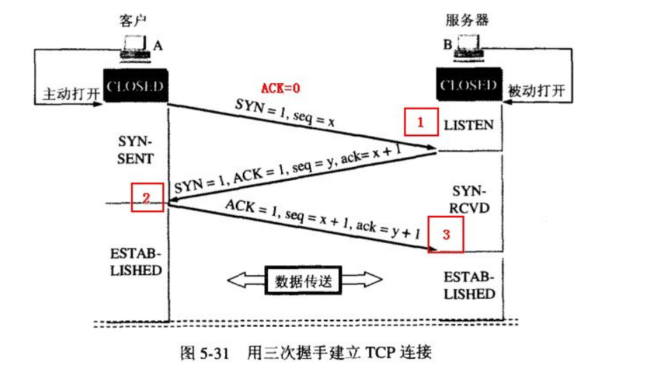

# 计算机网络 自顶向下方法

[TOC]

# 计算机网络和因特网

## 专有名词

**扇入**：是指直接调用该模块的上级模块的个数。扇入大表示模块的复用程序高。

**扇出**：是指该模块直接调用的下级模块的个数。扇出大表示模块的复杂度高，需要控制和协调过多的下级模块；但扇出过小（例如总是1）也不好。扇出过大一般是因为缺乏中间层次，应该适当增加中间层次的模块。扇出太小时可以把下级模块进一步分解成若干个子功能模块，或者合并到它的上级模块中去。

## 因特网

### 网络边缘

接入网络的设备（网络边缘）

**端系统**=主机

- 主机
- 服务器

#### 通信链路-接入网

**接入网**：将端系统物理连接到其**边缘路由器**（端系统到任何其他远程端系统的路径上的第一台路由器）的网络

- 媒介：同轴电缆、铜线、光纤、无线电频谱
- 传输速率：带宽bps

**家庭接入**：DSL、电缆、FTTH、拨号和卫星

- **数字用户线**（digital subscriber line，**DSL**）： 利用**电话线路**接入网络。其中 **ADSL**是非对称的数字用户线，基本都用ADSL，因为一般下行的数据量都远大于上行的数据量，所以要设计成非平衡的链路。

**独占**的**频分多路复用**

| 频段   | 传输信号     |
| :----- | :----------- |
| 0~4K   | 电话语音线路 |
| 4K~50K | 上行信号     |
| 50K~1M | 下行信号     |

- **电缆因特网接入**（cable Internet access）

采用**共享**的**频分多路复用**来传输。

- **混合光纤同轴电缆**（**HFC**）

**不对称**的**竞争式协议**

**企业（家庭）接入**：以太网和WiFi

- **以太网**：使用**双绞铜线**与一台**以太网交换机**相连，速率可达到**100Mbps、1Gbps、10Gbps**。
- **WiFi**：IEEE802.11技术无线LAN，范围在几十米内。

### 网络核心

由端系统的分组交换机和链路构成的网状网络

> 标亮部分即网络核心

#### 交换方式

- 报文交换（很少使用）

- **分组交换**

  > 端系统之间彼此传输报文，分组交换中，将长报文划分为分组，分组再通过通信链路和分组交换机（分为路由器和链路层交换机）传送。

  - 存储转发传输

   分组交换和报文交换都采用了存储转发的传输形式。但分组交换的存储转发以分组为单位，即交换机接收到整个分组后才能输出该分组的数据；而报文交换的存储转发单位为报文，需要交换机接收到整个报文后才能输出。

  - 排队时延和分组丢失

  - **转发表**（Forwarding Table）和**路由选择协议**（Routing Protocol）
    - 路由：路由是指确定数据从源节点到目标节点的路径的过程
    - 转发：将数据包从一个接口接收并发送到另一个接口的过程

- **电路交换**

 **端到端连接**（end- to-end connection）：在发送数据之前，必须先在发送和接收两端建立端到端连接，并预留一部分带宽。而分组交换不预留，所以会造成排队和丢包。

##### 频分多路复用（FDM）

 链路中的每条连接专用一个频段。

##### 时分多路复用（TDM）

 TDM在时域上被划分为固定的**帧**（frame），每帧又被划分为固定数量的**时隙**（slot），链路中的每条连接专用一个时隙。

### 网络结构

- ISP:ISP分为许多层级
  - **第一层ISP**（tier-1 ISP）
  - **区域ISP**（regional ISP）
  - **接入ISP**（access ISP）

> 因特网交换点（Internet Exchange Point，**IXP**）：由第三方公司创建，IXP是一个汇合点，多个ISP在此处对等。

### 协议

控制发送、接收信息。比如，TCP, IP, HTTP等等。每个层次有每个层次的协议。

协议三大要素：

- 语法（Syntax）：每一段内容符合一定规则的格式，比如一个报文前8位是原地址，后八个是目的地址（只是举例，不要当真）之类。
- 语义（Semantics）：每一段内容需要代表某种意义，比如原地址部分的二进制到底是指哪个地址。
- 同步（Timing）：通信的过程，即每一段任务的执行顺序

## 五层因特网协议栈

下层为上层提供服务。越下面的层，越靠近硬件；越上面的层，越靠近用户。

### OSI模型

 OSI模型由7层组成：应用层、表示层、会话层、传输层、网络层、数据链路层、物理层。

- 物理层：底层**数据传输**，如网线；网卡标准。【比特流】
- 数据链路层：定义数据的**基本格式**，如何传输，如何标识；如网卡**MAC地址**。【帧】
- 网络层：定义**IP编址**，定义**路由功能**；如不同设备的数据转发。【包】
- 传输层：端到端**传输数据的基本功能**；如 TCP、UDP。【段】
- 会话层：控制应用程序之间**会话能力**；如不同软件数据分发给不同软件。
- 表示层：数据格式标识，基本压缩**加密功能**。
- 应用层：各种**应用软件**，包括Web 应用。【报文】

### 应用层

支持网络应用，应用协议仅仅是网络应用的一个组成部分，运行在不同主机上的进程则使用应用层协议进行通信。

**封装**：**应用层报文**（application-layer message）M

#### DHCP协议

每⼀个⼦⽹络中，有⼀台计算机负责管理本⽹络的所有IP地址，它叫做"DHCP服务器"。 新的计算机加⼊⽹络，必须向"DHCP服务器"发送⼀个"DHCP请求"数据包，申请IP地址和相关的⽹络参数。

应⽤层协议，建⽴在UDP协议之上

（1）最前⾯的"以太⽹标头"，设置**发出⽅（本机）的MAC地址**和**接收⽅（DHCP服务器）的MAC地址**。 前者就是本机⽹卡的MAC地址，后者这时不知道，就填⼊⼀个⼴播地址：**FF-FF-FF-FF-FF-FF**。 

（2）后⾯的"IP标头"，设置发出⽅的IP地址和接收⽅的IP地址。这时，对于这两者，本机都不知道。于 是，发出⽅的IP地址就设为**0.0.0.0**，接收⽅的IP地址设为**255.255.255.255**。 

（3）最后的"UDP标头"，设置发出⽅的端⼝和接收⽅的端⼝。这⼀部分**是DHCP协议规定好的，发出⽅ 是68端⼝，接收⽅是67端⼝**。

> DHCP服务器读出这个包的数据内容，分配好IP地址，发送回去⼀个"**DHCP响应**"数据包。这个 响应包的结构也是类似的，以太⽹标头的MAC地址是双⽅的⽹卡地址，IP标头的IP地址是**DHCP服务器 的IP地址**（发出⽅）和**255.255.255.255（接收⽅**），UDP标头的端⼝是**67（发出⽅）和68（接收⽅）**，分配给**请求端的IP地址和本⽹络的具体参数则包含在Data部分**

#### HTTP协议

客户向服务器请求服务时，只需传送**请求方法**和**路径**。

**请求方法**常用的有**GET、HEAD、POST**。每种方法规定了客户与服务器联系的类型不同。由于HTTP协议简单，使得HTTP服务器的程序规模小，因而通信速度很快。

HTTP允许传输任意类型的数据对象。正在传输的类型由**Content-Type**加以标记。

**无连接**

无连接的含义是限制每次连接只处理一个请求。服务器处理完客户的请求，并收到客户的应答后，即断开连接。采用这种方式可以节省传输时间。

**无状态**

HTTP协议是无状态协议。无状态是指协议对于事务处理没有记忆能力。缺少状态意味着如果后续处理需要前面的信息，则它必须重传，这样可能导致每次连接传送的数据量增大。另一方面，在服务器不需要先前信息时它的应答就较快。

**支持B/S及C/S模式**

---

B/S（Browser/Server）和C/S（Client/Server）是两种常见的软件应用架构模式，它们用于描述客户端与服务器之间的交互方式和应用程序组织方式。

**B/S模式**的主要特点是客户端使用标准的Web浏览器，而不需要安装专用客户端应用程序。这种模式允许应用程序在各种不同的操作系统和设备上运行，只要它们支持标准的Web浏览器。

**C/S模式**强调了客户端和服务器之间的直接交互，客户端应用程序通常需要专门的开发，不像B/S模式那样可以通过Web浏览器来访问。

---

**默认端口80**

**基于TCP协议**

**HTTP过程概述**

HTTP协议采用了**请求/响应模型**。客户端向服务器发送一个请求报文，请求报文包含**请求的方法、URL、协议版本、请求头部和请求数据**。服务器以一个状态行作为响应，响应的内容包括**协议的版本、成功或者错误代码、服务器信息、响应头部和响应数据**。

1）客户端连接到Web服务器

一个HTTP客户端，通常是浏览器，与Web服务器的HTTP端口（默认为80）建立一个TCP套接字连接。例如，[http://www.baidu.com](http://www.baidu.com/)。

（2）发送HTTP请求

通过TCP套接字，客户端向Web服务器发送一个文本的请求报文，一个请求报文由**请求行**、**请求头部**、空行和**请求体**4部分组成。

（3）服务器接受请求并返回HTTP响应

Web服务器解析请求，定位请求资源。服务器将**资源复本写到TCP套接字**，由客户端读取。一个响应由**状态行、响应头部**、空行和**响应数据**4部分组成。

（4）释放连接TCP连接

若connection 模式为close，则服务器主动关闭TCP连接，客户端被动关闭连接，释放TCP连接;若connection 模式为keepalive，则该连接会保持一段时间，在该时间内可以继续接收请求。

（5）客户端浏览器解析HTML内容

客户端浏览器首先解析状态行，查看表明请求是否成功的状态代码。然后解析每一个响应头，响应头告知以下为**若干字节的HTML文档和文档的字符集**。客户端浏览器读取响应数据HTML，根据HTML的语法对其进行格式化，并在浏览器窗口中显示。

:o:**Get和post的区别**

**1、概括**

**GET**方式的请求，**浏览器**通常会主动缓存GET请求的响应，以提高性能并减少对服务器的重复请求。这意味着如果浏览器之前已经请求了相同URL的资源，并且服务器响应包含了适当的缓存标头（例如`Cache-Control`和`Expires`），浏览器可能会直接从缓存中获取响应，而不会向服务器发出新的GET请求。【浏览器会把http header和data一并发送出去，服务器响应200（返回数据）】

**POST**请求的特点是不会被主动缓存，因为其语义是向服务器**发送数据**，而不是请求某个资源。浏览器通常不会缓存POST请求的响应。【*而对于POST，浏览器先发送header，服务器响应100 continue，浏览器再发送data，服务器响应200 ok（返回数据）*】

**2、区别**：

（1）get参数通过**url传递**，post放在**request body**中。

（2）get请求在url中传递的参数是有**长度限制**的，而post没有。

（3）get比post更不安全，因为参数直接暴露在url中，所以不能用来传递敏感信息。

（4）get请求只能进行**url编码**，而post支持**多种编码方式**。

（5）get请求会浏览器**主动cache**，get请求参数会被完整保留在浏览历史记录里，而post中的参数不会被保留。

（7）GET和POST本质上就是TCP链接，并无差别。但是由于HTTP的规定和浏览器/服务器的限制，导致他们在应用过程中体现出一些不同。

###### 返回码

1xx：**指示信息**--表示**请求已接收**，继续处理。

2xx：**成功**--表示**请求已被成功接收、理解、接受**。

3xx：**重定向**--要完成请求必须进行更进一步的操作。

4xx：**客户端错误**--请求有语法错误或请求无法实现。

5xx：**服务器端错误**--服务器未能实现合法的请求。

| 状态码 | 含义                                                         |
| :----: | :----------------------------------------------------------- |
|  100   | 客户端应当**继续发送请求**。这个临时响应是用来通知客户端它的部分请求已经被服务器接收，且仍未被拒绝。客户端应当继续发送请求的剩余部分，或者如果请求已经完成，忽略这个响应。 |
|  200   | 请求已成功，请求所希望的响应头或数据体将随此响应返回。       |
|  302   | 请求重定向                                                   |
|  304   | 请求资源没有改变，访问本地缓存                               |
|  400   | 1、语义有误，当前请求无法被服务器理解。除非进行修改，否则客户端不应该重复提交这个请求。 2、请求参数有误。 |
|  403   | Forbidden，服务器收到请求，但是拒绝提供服务                  |
|  404   | 请求资源不存在。通常是用户路径编写错误，也可能是服务器资源已删除 |
|  500   | **服务器内部错误**。通常程序抛异常                           |
|  503   | 服务器当前不能处理客户端的请求，一段时间后可能恢复正常       |

###### 版本

1. **HTTP/0.9**：
   - 最早的HTTP版本，用于1990年代初的早期Web。
   - 只支持**GET请求，不支持头部信息或状态码**。
   - 没有正式规范，非常简单。
2. **HTTP/1.0**：
   - 1996年发布的HTTP版本。
   - 引入了多种HTTP方法，如**GET、POST、HEAD、PUT**等。
   - 支持HTT**P头部，允许传输元数据**。
   - 使用**明文传输，不支持持久连接**。
3. **HTTP/1.1**：
   - 1999年发布的HTTP版本。
   - 引入了**持久连接**，减少了多次建立TCP连接的开销。
   - 引入了管道（Pipeline）机制，**允许多个请求一次性发送**。
   - 支持虚拟主机（Virtual Hosting）和HTTP**缓存**。
   - 引入了块传输编码（Chunked Transfer Encoding）以支持流式传输。
4. **HTTP/2**：
   - 2015年发布的HTTP版本。
   - 引入了**多路复用（Multiplexing）**，允许多个请求和响应在一个连接上同时传输，提高性能。
   - 支持**头部压缩**，减少了数据传输的开销。
   - 引入了服务器推送（Server Push）功能，可以提前发送资源给客户端。
   - 更安全，支持**加密传输**（TLS是强制的）。
5. **HTTP/3**：
   - 2018年发布的HTTP版本。
   - 基于**QUIC协议**，使用UDP而不是TCP，旨在减少网络延迟。
   - 引入了**0-RTT（零往返时间）连接**，进一步提高性能。
   - 支持多路复用、头部压缩和服务器推送等HTTP/2特性。

#### HTTPS

**端口号**443

    客户端向服务器发送一个**加密套件列表，包括支持的加密算法和协议版本**。

    服务器从客户端提供的加密套件列表中选择一个**加密算法和协议版本，并发送自己的数字证书给客户端**。

> **数字证书**：采用HTTPS协议的服务器必须要有一套数字证书，可以自己制作，也可以向组织申请，区别就是自己颁发的证书需要客户端验证通过，才可以继续访问，而使用受信任的公司申请的证书则不会弹出提示页面(startssl就是个不错的选择，有1年的免费服务)。采用HTTPS协议的服务器必须要有一套数字证书，可以自己制作，也可以向组织申请，区别就是自己颁发的证书需要客户端验证通过，才可以继续访问，而使用受信任的公司申请的证书则不会弹出提示页面(startssl就是个不错的选择，有1年的免费服务)。
> 这套证书其实就是一对**公钥和私钥**，如果对公钥和私钥不太理解，可以想象成一把**钥匙**和一个**锁头**，只是全世界只有你一个人有这把钥匙，你可以把锁头给别人，别人可以用这个锁把重要的东西锁起来，然后发给你，因为只有你一个人有这把钥匙，所以只有你才能看到被这把锁锁起来的东西。这套证书其实就是一对公钥和私钥，如果对公钥和私钥不太理解，可以想象成一把钥匙和一个锁头，只是全世界只有你一个人有这把钥匙，你可以把锁头给别人，别人可以用这个锁把重要的东西锁起来，然后发给你，因为只有你一个人有这把钥匙，所以只有你才能看到被这把锁锁起来的东西.

**公钥（Public Key）：** 公钥是一种密钥，用于**加密信息或验证数字签名**。它是公开可见的，任何人都可以获得。公钥通常用于**加密数据**，确保只有持有相应私钥的实体可以解密并阅读信息。对于**数字签名**，*公钥用于验证签名，以确认信息的完整性和真实性*。如果信息可以使用**私钥生成的公钥解密或验证，那么它必须是由私钥持有者生成的。**

**私钥（Private Key）：** 私钥是一种密钥，它与公钥形成密钥对，并保持在加密通信或数字签名的实体的安全处。私钥是秘密的，只有密钥的持有者知道它。私钥用于解密通过公钥加密的数据，或生成数字签名以确认信息的来源和完整性。私钥的安全性对于加密通信和数字签名的有效性至关重要。

    这部分工作是有客户端的TLS来完成的，首先会验证公钥是否有效，比如颁发机构，过期时间等等，如果发现异常，则会弹出一个警告框，提示证书存在问题。如果证书没有问题，那么就**生成一个随机值，然后用证书对该随机值进行加密**，就好像上面说的，把随机值用锁头锁起来，这样除非有钥匙，不然看不到被锁住的内容。

    这部分传送的是用证书加密后的随机值，目的就是让服务端得到这个**随机值**（私钥)，以后客户端和服务端的通信就可以通过这个随机值来进行加密解密了。服务器使用自己的**私钥解密客户端发送的密钥，并与客户端协商加密套件和密钥**，确保双方都使用相同的加密参数。服务端用私钥解密后，得到了客户端传过来的随机值(私钥)，然后把内容通过该值进行对称加密，所谓对称加密就是，将信息和私钥通过某种算法混合在一起，这样除非知道私钥，不然无法获取内容，而正好客户端和服务端都知道这个私钥，所以只要加密算法够彪悍，私钥够复杂，数据就够安全。

    握手完成后，客户端和服务器之间的通信就可以使用协商的加密算法和密钥进行加密和解密。

>**对称加密**：
>
>1. **密钥**：对称加密使用相同的密钥（称为加密密钥）来加密和解密数据。这意味着发送方和接收方都必须拥有相同的密钥。
>2. **加密过程**：在对称加密中，原始数据和密钥传递给加密算法，该算法使用密钥将数据转换为密文。只有拥有相同密钥的接收方才能解密密文并还原为原始数据。
>3. **速度**：对称加密通常较快，因为加密和解密使用相同的密钥，且算法通常较简单。
>
>**非对称加密**：
>
>1. **密钥对**：非对称加密使用一对密钥，其中一个是**公钥（用于加密）**，另一个是**私钥（用于解密）**。公钥可以自由分发，而私钥必须保密。
>2. **加密过程**：发送方使用接收方的公钥来加密数据，只有接收方拥有私钥可以解密数据。因此，即使公钥被泄露，攻击者也无法解密数据，因为他们没有私钥。
>3. **安全性**：非对称加密提供更高的安全性，因为密钥分为公钥和私钥，攻击者需要私钥才能解密数据。

###### 对称加密

**DES**

DES 算法是一种分组密码算法，它将 64 位的明文分成两个 32 位的分组，然后进行 16 轮的变换，每轮都使用一个 48 位的子密钥，最后将两个分组重新组合成 64 位的密文。

**AES**

AES加密算法是一种高级加密标准，它是一种分组密码算法，将128位的明文分成16个字节的矩阵，然后进行10轮的变换，每轮都使用一个由密钥扩展得到的子密钥。它的变换包括字节代换、行移位、列混合和轮密钥加。

**RC4**

RC4加密算法是一种**流密码算法**，它使用一个可变长度的密钥生成一个伪随机的密钥流，然后将密钥流和明文进行异或运算得到密文。它的生成过程包括密钥调度算法和伪随机生成算法，使用一个256字节的S盒和两个指针i和j来产生密钥流。

###### 非对称加密

非对称加密算法是指加密和解密使用不同的密钥的算法，它的优点是安全性高，不需要传输密钥，但缺点是速度慢，适合小量数据的加密。

**RSA**

RSA 算法是一种基于大数分解难题的非对称加密算法，它使用一对公钥和私钥来进行加密和解密。

**ECC**

ECC是椭圆曲线密码学的简称，它是一种基于椭圆曲线的非对称加密算法，它可以用更短的密钥达到相同的安全级别，节省了计算资源和存储空间

**DH**

DH是迪菲-赫尔曼密钥交换协议的简称，它是一种用于在不安全的通道上协商共享密钥的方法，它可以**保证通信双方不需要事先知道对方的密钥，也不需要传输密钥。**

#### FTP

> tcp

用于在客户端和服务器之间传输文件，支持上传和下载文件

#### SMTP

> tcp

**发送**电子邮件消息，通常由电子邮件客户端与邮件服务器之间使用

#### POP3

> tcp

从邮件服务器**下载**电子邮件到本地设备的协议

#### IMAP

> tcp

邮件服务器和邮件客户端之间同步电子邮件的协议，支持在多个设备上访问电子邮件

#### DNS

> udp

#### DHCP

> udp

#### SNMP（Simple Network Management Protocol）

> UDP

**SNMP**的主要目的是允许网络管理员监视网络设备的状态、性能和其他相关信息，以便进行网络故障排除、性能优化和资源管理。

**组成**：

- **管理系统（Manager）**：这是网络管理的**中心**，通常是一台计算机或服务器，用于监视和管理网络中的设备。
- **代理（Agent）**：代理是嵌入在网络设备（如路由器、交换机、服务器等）中的软件模块，负责**收集设备信息**并将其提供给管理系统。
- **MIB（Management Information Base）**：MIB是一个层次结构数据库，它包含了关于网络设备的信息，以树形结构的OID（Object Identifier）来组织。
- **SNMP协议**：SNMP协议定义了管理系统和代理之间的**通信规则**，包括获取（Get）、设置（Set）和陷阱（Trap）等操作。

SNMP的工作原理涉及管理系统和代理之间的消息传递。通常，管理系统会向代理发送SNMP请求，如获取特定MIB对象的值。代理将响应管理系统的请求，返回所请求的信息。代理还可以自发地向管理系统发送陷阱消息，以报告特定事件。

**MIB：**是SNMP中的核心概念，它定义了*网络设备上可用的所有信息，以树形结构的OID来组织*。MIB包括标准MIB（如RFC 1213）和供应商特定MIB。

**操作：**

- **Get操作**：用于从代理获取特定MIB对象的值。
- **Set操作**：用于向代理设置特定MIB对象的值。
- **GetNext操作**：用于获取下一个MIB对象的值。
- **GetBulk操作**：允许管理系统一次获取多个MIB对象的值。
- **Trap操作**：代理向管理系统发送通知消息，以报告事件。

**安全：**

SNMPv1和SNMPv2c的安全性较低，传输的信息未加密。SNMPv3引入了用户身份验证和数据加密，提高了安全性。

#### TFTP

用于在网络上传输文件的协议，通常用于引导过程中的固件更新

### 传输层

负责为**信源**和**信宿**提供**应用程序进程间的数据传输服务**，这一层上主要定义了两个传输协议，传输控制协议即TCP和用户数据报协议UDP

**封装**：接收报文M，附上传输层首部信息Ht（包括**差错检测位信息**等），构成 **传输层报文段**（transport-layer segment），将其传递给网络层

#### TCP

面向连接的运输层协议；所谓面向连接就是双方传输数据之前，必须先建立一条通道，TCP提供可靠的传输服务。传送的数据无差错、不丢失、不重复、按序到达，面向字节流

#### 三次握手

> 三次握手可以防止已经失效的连接请求报文突然又传输到服务器端导致的**服务器资源浪费**（**通过seq序列号**）
>
> 在二次握手的前提下，服务器端会认为这是客户端发起的又一次请求，然后发送SYN ，并且在服务器端创建socket套接字，一直等待客户端发送数据。但是由于客户端并没有发起新的请求，所以会丢弃服务端的SYN 。此时服务器会一直等待客户端发送数据从而造成资源浪费。

(**刚开始客户端处于 closed 的状态，服务端处于 listen 状态**)

1、第一次握手：客户端给服务器发送一个 **SYN 报文**。(**SYN_Send** 状态)

2、第二次握手：服务器收到 SYN 报文之后，会应答一个 **SYN+ACK 报文**。(**SYN_RCVD** )

3、第三次握手：客户端收到 SYN+ACK 报文之后，会回应一个 **ACK 报文**。( **established** )

4、服务器收到 ACK 报文之后，三次握手建立完成。( **established** )

第三次握手的时候，是可以携带数据的

> ISN 是动态生成的

---

**半连接状态**

服务器第一次收到客户端的 SYN 之后，就会处于 SYN_RCVD 状态，此时双方还没有完全建立其连接，服务器会把此种状态下请求连接放在一个队列里，我们把这种队列称之为**半连接队列**。当然还有一个**全连接队列**，就是已经完成三次握手，建立起连接的就会放在全连接队列中。如果队列满了就有可能会出现丢包现象。

服务器发送完SYN－ACK包，如果未收到客户确认包，服务器进行首次重传，等待一段时间仍未收到客户确认包，进行**第二次重传**，如果重传次数超 过系统规定的最大重传次数，系统将该连接信息从半连接队列中删除。注意，每次重传等待的时间不一定相同，一般会是**指数增长**，例如间隔时间为 1s, 2s, 4s, 8s,

---

#### 四次挥手

> 由于连接的关闭控制权在应用层，所以被动关闭的一方在接收到FIN包时，TCP协议栈会直接发送一个ACK确认包，优先关闭一端的通信。然后通知应用层，由应用层决定什么时候发送FIN包。应用层可以使用系统调用函数read==0来判断对端是否关闭连接。`read` 函数通常用于从套接字中读取数据。当调用 `read` 函数时，它会返回读取的字节数，如果连接已关闭，则返回值为0。这是因为当对端关闭连接时，不再有数据可供读取。

刚开始双方都处于 establised 状态，假如是客户端先发起关闭请求，则：

1、第一次挥手：客户端发送一个 **FIN 报文**，报文中会**指定一个序列号**。此时客户端处于**FIN_WAIT1**状态。

2、第二次挥手：服务端收到 FIN 之后，会发送 ACK 报文，且把客户端的序列号值 + 1 作为 ACK 报文的序列号值，表明已经收到客户端的报文了，此时服务端处于 **CLOSE_WAIT**状态。

3、第三次挥手：如果服务端也想断开连接了，和客户端的第一次挥手一样，发给 **FIN 报文**，且指定一个序列号，此时服务端处于 **LAST_ACK** 的状态。

4、第四次挥手：客户端收到 FIN 之后，一样发送一个 **ACK 报文**作为应答，且把服务端的序列号值 + 1 作为自己 ACK 报文的序列号值，此时客户端处于 **TIME_WAIT** 状态。需要过一阵子以确保服务端收到自己的 ACK 报文之后才会进入 CLOSED 状态

> 要确保服务器是否已经收到了我们的 ACK 报文，**如果没有收到的话，服务器会重新发 FIN 报文给客户端**，客户端再次收到 FIN 报文之后，就知道之前的 ACK 报文丢失了，然后再次发送 ACK 报文。

5、服务端收到 ACK 报文之后，就处于关闭连接了，处于 **CLOSED 状态。**

**2MSL意义：**

> 1、保证最后一次握手报文能到对方，能进行超时重传。
>
> 2、2MSL后，这次连接的所有报文都会消失，不会影响下一次连接。
>
> MSL是一个**最大报文寿命（Maximum Segment Lifetime）**的缩写，表示在网络中数据报文的最长存活时间。

**CLOSED：**初始状态，表示TCP连接是“关闭着的”或“未打开的”。

**LISTEN ：**表示服务器端的某个SOCKET处于监听状态，可以接受客户端的连接。

**SYN_RCVD ：**表示服务器接收到了来自客户端请求连接的SYN报文。在正常情况下，这个状态是服务器端的SOCKET在建立TCP连接时的三次握手会话过程中的一个中间状态，很短暂，基本上用netstat很难看到这种状态，除非故意写一个监测程序，将三次TCP握手过程中最后一个ACK报文不予发送。当TCP连接处于此状态时，再收到客户端的ACK报文，它就会进入到ESTABLISHED 状态。

**SYN_SENT ：**这个状态与SYN_RCVD 状态相呼应，当客户端SOCKET执行connect()进行连接时，它首先发送SYN报文，然后随即进入到SYN_SENT 状态，并等待服务端的发送三次握手中的第2个报文。SYN_SENT 状态表示客户端已发送SYN报文。

**ESTABLISHED ：**表示TCP连接已经成功建立。

**FIN_WAIT_1 ：**这个状态得好好解释一下，其实FIN_WAIT_1 和FIN_WAIT_2 两种状态的真正含义都是表示**等待对方的FIN报文**。而这两种状态的区别是：FIN_WAIT_1状态实际上是当SOCKET在ESTABLISHED状态时，它想主动关闭连接，向对方发送了FIN报文，此时该SOCKET进入到FIN_WAIT_1 状态。而当对方回应ACK报文后，则进入到FIN_WAIT_2 状态。当然在实际的正常情况下，无论对方处于任何种情况下，都应该马上回应ACK报文，所以FIN_WAIT_1 状态一般是比较难见到的，而FIN_WAIT_2 状态有时仍可以用netstat看到。

**FIN_WAIT_2 ：**上面已经解释了这种状态的由来，实际上FIN_WAIT_2状态下的SOCKET表示半连接，即有一方调用close()主动要求关闭连接。注意：FIN_WAIT_2 是没有超时的（不像TIME_WAIT 状态），这种状态下如果对方不关闭（不配合完成4次挥手过程），那这个 FIN_WAIT_2 状态将一直保持到系统重启，越来越多的FIN_WAIT_2 状态会导致内核crash。

**TIME_WAIT ：**表示收到了对方的FIN报文，并发送出了ACK报文。 TIME_WAIT状态下的TCP连接会等待**2*MSL（Max Segment Lifetime，最大分段生存期，指一个TCP报文在Internet上的最长生存时间。每个具体的TCP协议实现都必须选择一个确定的MSL值**，RFC 1122建议是2分钟，但BSD传统实现采用了30秒，Linux可以cat /proc/sys/net/ipv4/tcp_fin_timeout看到本机的这个值），然后即可回到CLOSED 可用状态了。如果FIN_WAIT_1状态下，收到了对方同时带FIN标志和ACK标志的报文时，可以直接进入到TIME_WAIT状态，而无须经过FIN_WAIT_2状态。（这种情况应该就是四次挥手变成三次挥手的那种情况）

**CLOSING ：**这种状态在实际情况中应该很少见，属于一种比较罕见的例外状态。正常情况下，当一方发送FIN报文后，按理来说是应该先收到（或同时收到）对方的ACK报文，再收到对方的FIN报文。但是CLOSING 状态表示一方发送FIN报文后，并没有收到对方的ACK报文，反而却也收到了对方的FIN报文。什么情况下会出现此种情况呢？那就是**当双方几乎在同时close()一个SOCKET的话，就出现了双方同时发送FIN报文的情况**，这是就会出现CLOSING 状态，表示双方都正在关闭SOCKET连接。产生的原因是客户端和服务端同时关闭。

**CLOSE_WAIT ：**表示正在等待关闭。怎么理解呢？当对方close()一个SOCKET后发送FIN报文给自己，你的系统毫无疑问地将会回应一个ACK报文给对方，此时TCP连接则进入到CLOSE_WAIT状态。接下来呢，你需要检查自己是否还有数据要发送给对方，如果没有的话，那你也就可以close()这个SOCKET并发送FIN报文给对方，即关闭自己到对方这个方向的连接。有数据的话则看程序的策略，继续发送或丢弃。简单地说，当你处于CLOSE_WAIT 状态下，需要完成的事情是等待你去关闭连接。

**LAST_ACK ：**当被动关闭的一方在发送FIN报文后，等待对方的ACK报文的时候，就处于LAST_ACK 状态。当收到对方的ACK报文后，也就可以进入到CLOSED 可用状态了。

#### **选择重传**（SR）

在选择重传传中，接收⽅收到失序的分组时，会把它缓存起 来，直到拼凑到分组按序，才把分组传输给上⼀层。⽽发送⽅会**为每个分组设置⼀个定时器**，这样，只 需要重传传那些没有被接收⽅正确接收的分组就可以了。直到所有丢失的分组全部被收到为⽌，再把这批分组按序交付给上⼀层。 

#### 拥塞控制

**慢启动**-**拥塞避免**-**快速重传和快恢复**

A 与 B 建⽴连接之后，就可以向B发送数据了，然⽽这个时候 A 并不知道此时的⽹络拥塞情况如何，也 就是说，A 不知道⼀次性连续发送多少个数据包好，我们也把 **A ⼀次性连续发送多少个数据包称之为拥塞窗⼝**，⽤ N 代表此时拥塞窗⼝的大小吧

**前期指数增⻓，到达阈值之后，就以⼀个⼀个线性的速度来增⻓**

**指数增⻓**阶段称之为**慢启动**，**线性增⻓**阶段称之为**拥塞避免**

> 当出现超时事件 时，我们就认为此时⽹络出现了拥塞了，不能再继续增⻓了。我们就把这个时候的N的值称之为瓶颈值 吧，⽤MAX 这个字⺟来代替吧，即最⼤值

当达到最⼤值MAX之后,就**回到最初的最初的状态**，也就是说从1，2，4，8.....开始,不过这个时候我们还会把ssthresh调 ⼩，调为MAX值的⼀半，即**ssthresh = MAX / 2**

图中阈值为8，瓶颈值是14；超时事件发⽣后，阈值为14 / 2 = 7

**快速重传**

接收方每次收到一个失序的报文段后就立即发出重复确认，发送方只要连续收到三个重复确认就立即重传（尽早重传未被确认的报文段）。

**冗余 ACK**：

当A连续收到了三个确认M2的ACK，且M3超时事件还没发⽣。A就知道M3可能丢失了，这个时候A就不 必等待M3设置的计时器到期了，⽽是快速重传M3，并且把ssthresh设置为MAX的⼀半，即ssthresh = MAX/2，但是这个时候并⾮把控制窗⼝N设置为1，⽽是让N = ssthresh，N在⼀个⼀个增⻓

**采用慢开始和拥塞避免算法的时候：**

1、一旦cwnd>慢开始门限，就采用拥塞避免算法，减慢增长速度

2、**一旦出现丢包的情况**(超时)，就重新进行**慢开始，减慢增长速度**

**采用快恢复和快重传算法的时候：**

1、 一旦cwnd>慢开始门限，就采用拥塞避免算法，减慢增长速度

\2. 一旦发送方连续收到了三个重复确认，就采用拥塞避免算法，减慢增长速度

#### **流量控制**

双⽅在通信的时候，发送⽅的速率与接收⽅的速率是不⼀定相等，如果发送⽅的发送速率太快，会导致 接收⽅处理不过来，这时候接收⽅只能把处理不过来的数据存在缓存区⾥（失序的数据包也会被存放在缓存区⾥），对**发送⽅发送速率的控制**，我们称之为**流量控制**

> 接收⽅每次收到数据包，可以在发送确定报⽂的时候，同时告诉发送⽅⾃⼰的**缓存区**还剩余多少是空闲 的，我们也把缓存区的剩余⼤⼩称之为接收窗⼝⼤⼩，⽤变量 win 来表示接收窗⼝的⼤⼩。发送⽅收到之后，便会调整⾃⼰的发送速率，也就是调整⾃⼰发送窗⼝的⼤⼩，当发送⽅收到接收窗⼝的⼤⼩为0时，发送⽅就会停⽌发送数据，防⽌出现⼤量丢包情况的发⽣。当发送⽅收到接受窗⼝ win = 0 时，这时发送⽅停⽌发 送报⽂，并且同时开启⼀个定时器，每隔⼀段时间就发个测试报⽂去询问接收⽅，打听是否可以继续发 送数据了，如果可以，接收⽅就告诉他此时接受窗⼝的⼤⼩；如果接受窗⼝⼤⼩还是为0，则发送⽅再 次刷新启动定时器

由于TCP/IP⽀持**全双⼯传输**，因此通信的双⽅都拥有**两个滑动窗⼝**，⼀个⽤于接受数据，称之为**接收窗⼝**；⼀个⽤于发送数据，称之为**拥塞窗⼝(即发送窗⼝)**，指出接收**窗⼝⼤⼩的通知我们称之为窗⼝通告**。

**接收窗口**

接受窗⼝的⼤⼩是根据某种算法动态调整的，⼀般情况下接收窗⼝ >= 发送窗⼝

**发送窗口**

> HTTP、HTTPS、FTP、TELNET、SMTP(简单邮件传输协议)协议基于可靠的TCP协议

#### UDP

无连接的传输层协议，面向报文的，对应用层交下来的报文，不合并，不拆分，保留原报文的边界，）UDP支持一对一　一对多　多对多的交互通信，UDP的首部开销小，只有８字节

> DNS、DHCP、TFTP、SNMP(简单网络管理协议)、RIP基于不可靠的UDP协议

### 网络层

> **IP地址**：逻辑地址，以此来屏蔽物理地址的差异。

将**数据报**独立地从信源发送到信宿，主要解决路由选择、拥塞控制和网络互联等问题

**封装**：接收传输层报文段，附上网络层首部信息Hn（包括**源和目的地址**等），构成 **网络层数据段**（network-layer datagram），将其传递给链路层

> 假如两台计算机的IP不是处于同⼀个⼦⽹之中，这个时候，我们就会把数据包发送给⽹关，然后让⽹关 让我们进⾏转发传送

#### IP协议

⼀部分代表**⽹络部分**，⼀部分代表**主机部分**（⼦⽹掩码）

**静态IP地址**：

(1) 本机的IP地址

 (2) 子⽹掩码 

(3) ⽹关的IP地址 

(4) DNS的IP地址

**区分udp和tcp**:IP层只负责传递数据给目标机器，IP报文里面的TCP/UDP报文里有应用的目标端口号，通过该目标端口号来确定应用程序。IP头中有协议标识字段，17是udp，6是tcp。

**动态IP地址**：

计算机开机后，会⾃动分配到⼀个IP地址，不⽤⼈为设定。它使⽤的协议叫做 DHCP协议

#### **ARP协议**

ARP协议也是通过⼴播的形式给同⼀个⼦⽹中的每台电脑发送⼀个数据包(当然，这个数据包会包含接收 ⽅的IP地址)。对⽅收到这个数据包之后，会取出IP地址与⾃身的对⽐，如果相同，则把⾃⼰的MAC地址 回复给对⽅，否则就丢弃这个数据包。这样，计算机A就能知道计算机B的MAC地址了，获取mac地址。

#### ICMP协议

#### 网络地址

##### 私网地址

用于内部网络通信的IP地址，不在公共互联网上可路由。

**IPv4 私网地址**：

- **10.0.0.0 到 10.255.255.255**（CIDR表示为10.0.0.0/8）：10.0.0.0/8 子网用于私有网络。
- **172.16.0.0 到 172.31.255.255**（CIDR表示为172.16.0.0/12）：172.16.0.0/12 子网用于私有网络。
- **192.168.0.0 到 192.168.255.255**（CIDR表示为192.168.0.0/16）：192.168.0.0/16 子网用于私有网络。

##### 公网地址

##### 保留地址

- **0.0.0.0**：通常用于表示未分配或未知地址。在特定上下文中，它还可用于表示"任何"地址。
- **127.0.0.1**：这是回环地址，用于计算机上的本地主机。它通常用于自我测试和网络诊断。
- **255.255.255.255**：这是广播地址，通常用于在一个网络上广播数据包。

##### 多播地址

多播地址用于将数据包传输到一组计算机，而不是所有计算机。多播地址范围从**224.0.0.0**到**239.255.255.255。**

#### 路由器

连接不同子网（网络段）并在它们之间传输数据的设备。它具有多个网络接口，能够根据目标 IP 地址将数据包从一个网络发送到另一个网络。

主要功能：

- IP 数据包的转发和路由。
- 网络隔离和分割，增强网络安全性。
- **NAT（网络地址转换，NAT 是一种网络协议和技术，用于将内部私有网络和外部公共网络之间的 IP 地址进行转换。）**。
  - 隐藏内部网络的结构和 IP 地址，增加网络安全性。
  - 允许多个内部设备使用同一个公共 IP 地址。
  - 支持端口映射，使不同端口的请求可以映射到内部不同的设备。
- 负载均衡和流量控制。

**HSRP（Hot Standby Router Protocol）**是一种Cisco开发的用于冗余路由器的协议。

HSRP允许设置两台或多台路由器，其中一台处于活动状态，而其他路由器则处于备用状态。活动路由器处理网络流量，而备用路由器仅在活动路由器故障时接管。

**虚拟IP地址**：HSRP创建一个虚拟IP地址，它是网络上的默认网关。所有主机或设备都将这个虚拟IP地址设置为其默认网关。这样，主机将所有流向互联网或其他网络的数据包发送到活动路由器。

**状态切换**：HSRP路由器之间定期通信，以确保活动路由器处于正常状态。如果活动路由器故障，备用路由器将接管虚拟IP地址，并成为新的活动路由器。这个状态切换是无缝的，对网络中的主机几乎是透明的。

**优先级设置**：HSRP允许为每个路由器设置优先级，通常默认为100。较高优先级的路由器将成为活动路由器。这允许管理员手动控制活动路由器的选择。

**组号**：每个HSRP组都有一个组号，它用于标识一组活动和备用路由器。这对于在同一网络上配置多个HSRP组非常有用。

**STP（Spanning Tree Protocol）**是一个网络协议，旨在**防止以太网局域网中出现环路**，以确保数据包可以在网络中稳定地传输。STP的核心思想是**通过标识和禁用冗余路径**来创建一个无环路的拓扑结构。以下是STP的详细解释：

**STP算法**：STP使用一种分布式算法来计算生成树。它涉及所有网络设备之间的协商和信息交换，以确定哪个设备将成为根桥（Root Bridge），以及从根桥到其他设备的最佳路径。这个算法考虑每个连接的路径成本（通常是端口带宽），并选择最低成本路径。每个设备都计算出与根桥的最佳路径，以确定生成树。

**端口状态**：STP定义了不同状态的端口，包括：

- **Blocking（阻塞）**：端口处于此状态，不传输数据包，但仍接收BPDU以确定生成树。
- **Listening（监听）**：端口接收BPDU并准备切换到学习状态。
- **Learning（学习）**：端口接收BPDU，并开始学习网络设备的MAC地址。
- **Forwarding（转发）**：端口在此状态下传输数据包，并处于活动状态。

**失效安全性**：STP具有失效安全性，即当网络拓扑发生变化时，它可以重新计算生成树，确保网络的稳定性。

**VRRP（Virtual Router Redundancy Protocol）**是一种网络协议，用于提供基于路由器冗余的高可用性解决方案。VRRP允许多个路由器共享一个虚拟IP地址和MAC地址，从而实现无缝故障切换。

**虚拟路由器**：VRRP引入了“虚拟路由器”的概念。虚拟路由器是一组路由器，它们一起工作以提供冗余路由功能。这组路由器中的一个被选为虚拟路由器的主要路由器，其余的是备份路由器。

**VRRP消息**：虚拟路由器中的主要路由器发送VRRP消息，以通知其他路由器其状态和虚拟IP地址。这些消息包括VRRP广告、VRRP请求等。备份路由器接收这些消息，并在必要时接管虚拟IP地址。

**三层交换机（Layer 3 Switch）**：

三层交换机是网络设备，同时具备交换机和路由器的功能。它可以在数据链路层（第二层）和网络层（第三层）之间进行转发和路由。与普通交换机相比，三层交换机更智能，能够根据目标 IP 地址进行路由决策，从而提高局域网内部的数据传输效率。

- 高性能的数据包转发。
- VLAN 支持和隔离。
- 路由功能，使不同 VLAN 或子网之间可以互相通信。
- QoS（服务质量）支持。

### 链路层

> **MAC地址**：**硬件地址**，用来定义网络设备的位置，主要由数据链路层负责

将**IP数据报**封装成合适在物理网络上传输的**帧**格式并传输，或将从物理网络接收到的帧解封，取出IP数据报交给网络层

**封装**：接收网络层数据段，附上链路层首部信息Hl，构成 **链路层帧**（link-layer frame），将其传递给物理层

**使有差错的物理线路变为无差错的数据链路，即提供可靠的通过物理介质传输数据的方法，为网络层提供服务、链路管理、帧定界、帧同步与透明传输、流量控制和差错控制**

- **差错控制**：传输中的差错一般是由噪声引起的，噪声分为**随机热噪声**和**冲击噪声**，前者可以通过提高信噪比来减少干扰，后者通过编码技术来进行差错控制。

  - 检错编码：
    - 奇偶校验码
    - 冗余校验码（CRC）
    - 海明码
  - 纠错编码

  

- **流量控制**

  - **停止-等待协议**

    

  - **后退N帧协议**

  

  累计确认，如果正确收到n号帧，并且按序，那么接收方为n帧发送一个ACK，并将该帧中的数据部分交付给上层。

  - 选择重传协议
    - $滑动窗口大小 = WRmax = 2^{(n - 1 )}$
    - 采用累计确认大方法，并且接收窗口Wr 不应该超过发送窗口Wt 

#### 以太网协议

⼀组电信号构成⼀个数据包，我们把这个数据包称之为帧。每⼀个桢由**标头(Head)**和 **数据(Data)**两部分组成

**帧**的⼤⼩⼀般为 **64 - 1518 个字节**

**MAC地址**：

连⼊⽹络的每⼀个计算机都会有⽹卡接⼝，每⼀个⽹卡都会有⼀个唯⼀的地址，这个地址就叫做 MAC 地址，MAC地址 由 48 个字节所构成，在⽹卡⽣产时就被唯⼀标识。

#### 广播

在同⼀个⼦⽹中，计算机 A 要向计算机 B 发送⼀个数据包，这个数据包会包含接收者的 MAC 地址。当 发送时，计算机 A 是通过⼴播的⽅式发送的，这时同⼀个⼦⽹中的计算机 C, D 也会收到这个数据包 的，然后收到这个数据包的计算机，会把数据包的 MAC 地址取出来，与⾃身的 MAC 地址对⽐，如果两 者相同，则接受这个数据包，否则就丢弃这个数据包。

#### VLAN

#### PPP

#### MAC

### 物理层

将**比特流**在结点间传输，即负责物理传输,实现比特流的透明传输。

> 在两个物理媒体间进行比特流传输，上层都是逻辑链接，只有物理层是实际的物理连接

#### 目标

- 保证发送信号“0”和“1”的**正确性**以及发送和接收的**一致性**；
- 比特流传输的**模式、速度**、持续时间和**信号失真**；
- 接口设计：引脚数目、功能等等；
- 信号传输的时序：如何安排传输过程和事件次序。

#### 基本特性

- **机械特性**：指明接口所用接线器的**形状和尺寸**、引线数目和排列、固定和锁定装置等；

- **电气特性**：指明**传输模式、电压范围、编码、阻抗匹配、传输速率**以及传输距离等等；

- **功能特性**：指明各条物理线路的**功能**，比如某条线上出现的某一电平的电压表示何种意义，

  物理接口信号线按功能分为四类：**数据线、控制线、定时线和地线**；

- **规程特性**：指明各物理线路工作规程和**时序**的关系，比如对于不同功能的各种可能事件的出现顺序，

信号传输的模式：

- 单工（仅单向通行）
- 半双工（双方通，但一个时刻仅一方通）
- 全双工（双方随时通）。

#### 基本通信原理

- 数据（data）：对于客观事实描述的物理符号，包括数字、文本、语言、图像等等；
- 信息（information）：**数据的集合**；
- 信号（signal）：数据传输中的**表现形式**，比如模拟信号、数字信号；
- 信道（channel）：往固定方向传输信息的**媒介**

| 传输方式 | 优点             | 缺点           |
| :------- | :--------------- | :------------- |
| 模拟     | 对信道有高利用率 | 不抗噪         |
| 数字     | 信号不易失真     | 需要更宽的带宽 |

> 模拟信道只能传输模拟信号，数字信道只能传输数字信号。

- **模拟传输**：传输连续变化的**模拟信号**，适用于模拟通信系统。
- **数字传输**：将模拟信号转换为**离散的数字信号**，适用于数字通信系统、计算机网络等。
- **模拟信号**：连续变化的信号，在时间和幅度上都可以连续变化。
- **数字信号**：离散的信号，由一系列离散的数值表示。

#### 调制解调器

 数字/模拟信号 经过 **调制** 变成 **模拟信号**，如此可在 模拟信道 上传输，再经过 **解调** 变成 数字/模拟信号。

**调制**

- **调幅**（Amplitude Modulation，**AM**）：把数字信号转化成不同幅度的正弦信号

- **调频**（Frequency Modulation，**FM**）

把数字信号转化成不同频率的正弦信号

- **调相**（Phase Modulation，**PM**）：把数字信号转化成不同相位的正弦信号

##### 脉码调制（Pulse Code Modulation, PCM）

模拟信号变成数字信号

- 采样：采样频率是信号频率的两倍，则可不失真地恢复原始信号。
- 量化：取整
- 编码：量化后的信号编码成二进制

#### 编码解码器

 数字/模拟信号 经过 **编码** 变成 **数字信号**，如此可在 数字信道 上传输，再经过 **解码** 变成 数字/模拟信号

**编码**：

- 

**信道特性**

- **码元**（Symbol）：承载信息量的基本信号单位。

> 马原分级数 N 与所需bit位数 n 的关系

- **波特率**（Baud rate）：传输码元的速率。
- **比特率**（Bit rate）：传输比特的速率
- **信道容量**（Channel capacity）：在一个信道中能够可靠地传送信息时可达速率的**最小上界**，单位 bps。
- **频带宽度**（Frequency bandwidth）：信道允许的信号频率范围，单位 Hz。
- **传输延迟**（Transmission delay）：包括发送到接受的处理事件、电信号的响应时间、中间介质的传输时间。

**奈奎斯特定理**（Nyquist’s Law）

1. 对于理想的**低通信号**(频率范围位于低频段内的信号，用于传输或处理低频成分较大的信号)，在一个频带宽度为 W 的信道，其码元的最大传输速率 = 2W Baud
2. 对于理想的**带通信号**(频率范围位于一定频带内的信号，用于传输或处理特定频率范围的信号)，在一个频带宽度为 W 的信道，其码元的最大传输速率 = W Baud

**香农定理**（Shannon’s Formula）

信道的信息传输速率C（单位：bps）

- W - 带宽，单位 Hz

- S - 信道的**平均信号功率**

- N - 信道的**高斯噪声功率**

- S/N - 信号功率与噪声功率之比（也可以叫信噪比）

  一般情况下，信噪比不用 $S/N$ 表示，而是 $10log_{10}S/N$ ，单位为dB。

## CDN（内容分发网络）介绍

**基本思路**：尽可能避开互联网上有可能影响数据传输速度和稳定性的瓶颈和环节，使内容传输的更快、更稳定。通过在网络各处放置节点服务器所构成的在现有的互联网基础之上的一层**智能虚拟网络**，CDN系统能够实时地根据网络流量和各节点的连接、负载状况以及到用户的距离和响应时间等综合信息**将用户的请求重新导向离用户最近的服务节点上**。

**目的**：

解决因分布、带宽、服务器性能带来的访问延迟问题，适用于**站点加速、点播、直播**等场景。使用户可就近取得所需内容，解决Internet网络拥挤的状况，提高用户访问网站的响应速度和成功率。

> A记录（将**域名映射到IPv4**地址)
>
> AAAA记录（将域名映射到IPv6地址)
>
> CNAME记录（用于**别名**指向）
>
> MX记录（邮件服务器指向）
>
> TXT记录（用于存储文本信息)

**基础架构**:

由**一个DNS服务器**和**几台缓存服务器**组成:

- 当用户点击网站页面上的**内容URL**，经过**本地DNS**系统解析，DNS系统会最终将域名的解析权交给CNAME指向的CDN专用**DNS服务器**。
- CDN的DNS服务器将**CDN的全局负载均衡设备IP**地址返回用户。
- 用户向CDN的全局负载均衡设备发起**内容URL**访问请求。
- CDN全局负载均衡设备根据用户IP地址，以及用户请求的**内容URL**，选择一台用户所属区域的**区域负载均衡设备**，**告诉用户向这台设备发起请求**。
- **区域负载均衡设备**会为用户选择一台合适的**缓存服务器提供服务**，选择的依据包括:根据用户IP地址，判断哪一台服务器距用户最近根据用户所请求的URL中携带的内容名称，判断哪一台服务器上有用户所需内容，查询各个服务器当前的负载情况，判断哪一台服务器尚有服务能力。基于以上这些条件的综合分析之后，区域负载均衡设备会向全局负载均衡设备返回**一台缓存服务器的IP地址**。全局负载均衡设备把服务器的IP地址返回给用户。
- 用户向缓存服务器**发起请求**，缓存服务器响应用户请求，将用户所需内容传送到用户终端。如果这台缓存服务器上**并没有用户想要的内容**，而区域均衡设备依然将它分配给了用户，那么这台服务器就要向它的**上一级缓存服务器**请求内容，直至追溯到**网站的源服务器**将内容拉到本地。

**服务模式**:
简单地说，CDN是一个经策略性部署的整体系统，包括分布式存储、负载均衡、网络请求的重定向和内容管理4个要件，而内容管理和全局的网络流量管理(Traffic Management)是CDN的核心所在。
通过用户就近性和服务器负载的判断，CDN确保内容以一种极为高效的方式为用户的请求提供服

### 问答

*CDN加速是对网站所在服务器加速，还是对其**域名加速**?*
CDN是只对网站的某一个具体的域名加速。如果同一个网站有多个域名，则访客访问加入CDN的域名获得加速效果，访问未加入CDN的域名，或者直接访问IP地址，则无法获得CDN效果。

*为什么我的网站更新后，通过CDN后看到网页还是旧网页，如何解决?*
由于CDN采用各节点缓存的机制，网站的静态网页和图片修改后，如果CDN缓存没有做相应更新，则看到的还是旧的网页。为了解决这个问题，CDN管理面板中提供了**URL推送服务，来通知CDN各节点刷新自己的缓存**。在URL推送地址栏中，输入具体的网址或者图片地址，则各节点中的缓存内容即被统一删除，并且当即生效。如果需要推送的网址和图片太多，可以选择目录推送，输入 kkk.com/news 即可以对网站下news目录下所有网页和图片进行了刷新。

## 场景题

### 访问⽹⻚

#### 发送请求：

**DNS协议**（UDP协议）：DNS协议可以帮助我们，将这个⽹址转换成IP地址。已知DNS服务器为8.8.8.8，于是我们向这个地址发 送⼀个DNS数据包（53端⼝）【递归、迭代】

**HTTP协议**:构造请求数据包，构造报文

**TCP协议**：**设置端口号**，接收⽅（Google）的HTTP端⼝默认是80，发送⽅（本机）的端⼝是⼀个随 机⽣成的1024-65535之间的整数，假定为51775。 TCP数据包的标头⻓度为**20字节**，加上嵌⼊HTTP的数据包，总⻓度变为4980字节（**三次握手**）

**IP协议**：设置双⽅的IP地址，路由、转发和交付

**以太⽹协议**：设置双⽅的MAC地址，发送⽅为本机的⽹卡MAC 地址，接收⽅为⽹关192.168.1.1的MAC地址（**ARP协议**），以太⽹数据包的数据部分，最⼤⻓度为1500字节

#### 响应请求

根据IP标头的序号，Google将四个包拼起来，取出完整的TCP数据包，然后读出⾥⾯的"HTTP请求"，接着做出"HTTP响应"，再⽤TCP协议发回来。

## 网络编程

**1、服务器端程序**

（1）创建一个**socket**，用函数socket()

（2）绑定**IP地址、端口**等信息到socket上，用函数bind()

（3）设置允许的最大连接数，用函数listen()

（4）接收客户端上来的连接，用函数accept()

（5）收发数据，用函数send()和recv()，或者read()和write()

（6）关闭网络连接

### 数字证书

**1、概念**

数字证书是数字证书在**一个身份和该身份的持有者**所拥有的公/私钥对之间建立了一种联系，由**认证中心（CA）**或者认证中心的下级认证中心颁发的。证书是认证中心与用户建立信任关系的基础。在用户**使用数字证书之前必须首先下载和安装**。

认证中心是一家能向用户**签发数字证书**以确认用户身份的管理机构。为了防止数字凭证的伪造，认证中心的公共密钥必须是可靠的，认证中心必须公布其**公共密钥**或由更高级别的认证中心提供一个电子凭证来证明其公共密钥的有效性，后一种方法导致了多级别认证中心的出现。

**2、数字证书颁发过程**

数字证书颁发过程如下：用户产生了自己的**密钥对**，并将**公共密钥及部分个人身份信息**传送给一家认证中心。认证中心在核实身份后，将执行一些必要的步骤，以确信请求确实由用户发送而来，然后，认证中心将发给用户一个**数字证书**，该证书内附了**用户和他的密钥等信息**，同时还附有对认证中心公共密钥加以确认的数字证书。当用户想**证明其公开密钥的合法性时，就可以提供这一数字证书**。

**3、内容**

数字证书的格式普遍采用的是X.509V3国际标准，一个标准的X.509数字证书包含以下一些内容：

* 证书的版本信息；

* 证书的序列号，每个证书都有一个唯一的证书序列号；

* 证书所使用的签名算法；

* 证书的发行机构名称，命名规则一般采用X.500格式；

* 证书的有效期，通用的证书一般采用UTC时间格式；

* 证书所有人的名称，命名规则一般采用X.500格式；

* 证书所有人的公开密钥；

* 证书发行者对证书的签名。

