# 设计模式

## 创建者模式

### 简单方法模式

#### 简单工厂模式

可以根据参数的不同返回不同类的实例


```c++
class abstractProduct{

};

class concreteProductA:public abstractProduct{

};

class concreteProductB:public abstractProduct{

};


class SimpleFactory{
    template<typename ...Args>
    abstractProduct*  CreateProduct(Args...args){

    }

    template<typename T>
    concreteProductA*  CreateProduct(T t){

    }

    template<typename T>
    concreteProductB*  CreateProduct(T t1,T t2){

    }

};
```

**优点**：一定程度提高系统的灵活性

**缺点**：

- 工厂类集中了所有产品创建逻辑，一旦不能正常工作，整个系统都要受到影响
- 一旦添加新产品就不得不修改工厂逻辑，在产品类型较多时，有可能造成工厂逻辑过于复杂，不利于系统的扩展和维护。（违背开放封闭原则）

**应用场景**：

- 工厂类负责创建的对象比较少

- 调用者知道传入工厂类的参数，对于如何创建对象不关心


### 工厂方法模式

工厂方法模式定义了一个**创建对象的接口**，将**实际创建对象的责任交给了具体的子类工厂**。

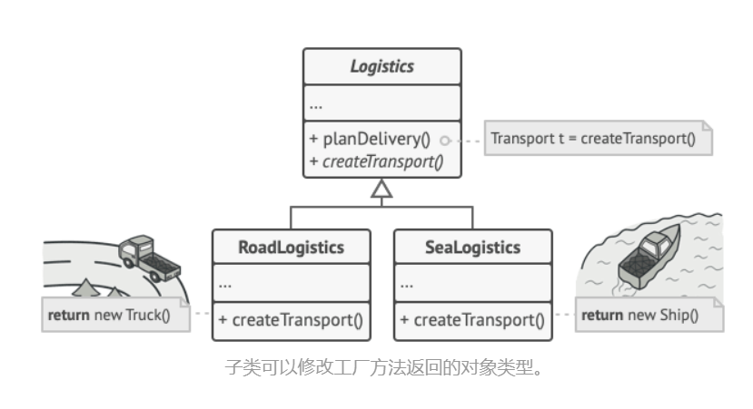

```c++
class abstractProduct{

};

class concreteProductA:public abstractProduct{

};

class concreteProductB:public abstractProduct{

};


class SimpleFactory{
    virtual abstractProduct* createProduct()=0;
};

class FactoryA:public SimpleFactory{
    abstractProduct* createProduct(){
        
    }
};

class FactoryB:public SimpleFactory{
    abstractProduct* createProduct(){

    }
};
```

**优点：**

- 在系统中加入新产品时，无须修改抽象工厂和抽象产品提供的接口，无须修改客户端，也无须修改其他的具体工厂和具体产品，而只要添加一个具体工厂和具体产品就可以

**缺点：** 需要引入**抽象层**，在客户端代码中均使用抽象层进行定义，增加了系统的抽象性和理解难度

**应用场景**：当你在编写代码的过程中， 如果无法预知对象确切类别及其依赖关系时， 可使用工厂方法。


### 抽象工厂模式

创建一系列相关的对象， 而无需指定其具体类,抽象工厂模式建议为系列中的每件产品明确声明接口。


```c++
class abstractProduct{

};

class concreteProductA1:public abstractProduct{

};

class concreteProductA2:public abstractProduct{

};


class concreteProductB1:public abstractProduct{

};

class concreteProductB2:public abstractProduct{

};


class AbstractFactory{
    virtual abstractProduct* createProductA()=0;
    virtual abstractProduct* createProductB()=0;
};

class FactoryA:public AbstractFactory{
    concreteProductA1* createProductA(){
    }

    concreteProductB1* createProductB(){
    }
};

class FactoryB:public AbstractFactory{
    concreteProductA2* createProductA(){
    }

    concreteProductB2* createProductB(){
    }
};
```

**优点**：确保同一工厂生成的产品相互匹配。

**缺点：** 由于采用该模式需要向应用中引入众多接口和类， 代码可能会比之前更加复杂。

**应用场景：**

 如果代码需要与多个不同系列的相关产品交互， 但是由于无法提前获取相关信息， 或者出于对未来扩展性的考虑， 你不希望代码基于产品的具体类进行构建， 在这种情况下， 你可以使用抽象工厂。


### 生成器模式

分步骤创建复杂对象

> class的设计


```c++
#include <iostream>

// 产品接口
class Product {
public:
    virtual void display() = 0;
};

// 具体产品A
class ConcreteProductA : public Product {
public:
    void display() override {
        std::cout << "ConcreteProductA" << std::endl;
    }
};

// 具体产品B
class ConcreteProductB : public Product {
public:
    void display() override {
        std::cout << "ConcreteProductB" << std::endl;
    }
};

// 抽象生成器接口
class Builder {
public:
    virtual ~Builder() {}
    virtual void buildPartA() = 0;
    virtual void buildPartB() = 0;
    virtual Product* getProduct() = 0;
};

// 具体生成器A
class ConcreteBuilderA : public Builder {
private:
    Product *product;

public:
    ConcreteBuilderA() : product(new ConcreteProductA()) {}

    ~ConcreteBuilderA() { delete product; }

    void buildPartA() override { product->display(); }

    void buildPartB() override {}

    Product* getProduct() override { return product; }
};

// 具体生成器B
class ConcreteBuilderB : public Builder {
private:
    Product *product;

public:
    ConcreteBuilderB() : product(new ConcreteProductB()) {}

    ~ConcreteBuilderB() { delete product; }

    void buildPartA() override {}

    void buildPartB() override { product->display(); }

    Product* getProduct() override { return product; }
};

// 指挥者角色
class Director {
private:
    Builder *builder;
    Product* product;
public:
    Director(Builder *builder) : builder(builder) {}

    Product* construct() {
        builder->buildPartA();
        builder->buildPartB();
        return product=builder->getProduct();
    }
};

int main() {
    // 创建生成器并构建产品
    ConcreteBuilderA ca;
    Director director(&ca);
    director.construct();

    // 获取并显示产品
    Product *product = director.construct();
    product->display();
    return 0;
}
```

**优点**：分步创建对象， 暂缓创建步骤或递归运行创建步骤。

**缺点**：代码整体复杂程度会有所增加。

**应用场景**：清晰地定义通用步骤， 确保它们可以制造所有形式的产品。 否则你将无法进一步实施该模式。


### 原型模式

允许我们通过克隆现有的实例来创建新的对象

> 拷贝复制函数

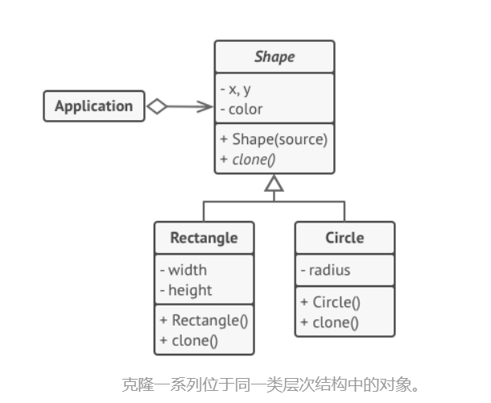

```c++
class Product{
public:
    Product(){};
    virtual ~Product()=default;
    virtual Product* Clone(Product* p)=0;
};

class ConcreteProduct:Product{
    ~ConcreteProduct()=default;
    Product* Clone(Product* p){
        Product* ret=new ConcreteProduct();
        return ret;
    }
};
```

**优点**：克隆预生成原型， 避免反复运行初始化代码，更方便地生成复杂对象，用继承以外的方式来处理复杂对象的不同配置。

**缺点**：循环引用的复杂对象可能会非常麻烦。

**应用场景**： 如果你需要复制一些对象， 同时又希望代码独立于这些对象所属的具体类， 可以使用原型模式。


### 单例模式

保证一个类只有一个实例

> unique_ptr


```c++
class single{
    single* get(){
        static single s;
        return &s;
    }
};
```

**优点**：保证一个类只有一个实例。

**缺点**：违反了单一职责原则，程序各组件之间相互了解过多等（耦合性太高）

**应用场景**：如果程序中的某个类对于所有客户端只有一个可用的实例， 可以使用单例模式


## 结构型模式

### 适配器模式

**适配器模式**是一种结构型设计模式， 它能使接口不兼容的对象能够相互合作。

> 转换器


```c++
class Interface{
public:
    virtual void method()=0;

};

class OldInterface:Interface{
public:
    virtual void method(){

    };
};


class NewInterface:Interface{
public:
    virtual void newmethod(){};
};
class Adapter:public NewInterface{
private:
    OldInterface* oldObj;
public:
    Adapter(OldInterface* anInterface): oldObj(anInterface){

    }
    void newmethod(){
        oldObj->method();
    }

};
```

**优点**：*单一职责原则*你可以将接口或数据转换代码从程序主要业务逻辑中分离。

**缺点**：代码整体复杂度增加， 因为你需要新增一系列接口和类。 有时直接更改服务类使其与其他代码兼容会更简单。

**应用场景**：当你希望使用某个类， 但是其接口与其他代码不兼容时， 可以使用适配器类。


### 桥接模式

**桥接模式**是一种结构型设计模式， 可将一个大类或一系列紧密相关的类拆分为抽象和实现两个独立的层次结构， 从而能在开发时分别使用。

> 分层实现


```c++

class Implementor{
public:
    virtual void draw()=0;
};

class ImplementorCirle:public Implementor{
public:
    void draw(){
        cout<<"draw a cirle.\n";
    }
};

class ImplementorSquare:public Implementor{
public:
    void draw(){
        cout<<"draw a squre.\n";
    }
};

class abstract{
protected:
    Implementor* imp;
public:
    abstract(Implementor* _imp):imp(_imp){};
    virtual void operation()=0;
};

class RedfinedAbstraction2:public abstract{
public:
    explicit RedfinedAbstraction2(Implementor *imp_):abstract(imp_){};
    void operation(){
        imp->draw();
    }
};

int main(){
    Implementor* imp=new ImplementorCirle;
    abstract* abs=new RedfinedAbstraction2(imp);
    abs->operation();
}

```

**优点：**

- 创建与平台无关的类和程序
- 仅与高层抽象部分进行互动， 不会接触到平台的详细信息

**缺点：**对高内聚的类使用该模式可能会让代码更加复杂。

**应用场景：**如果你想要拆分或重组一个具有多重功能的庞杂类 （例如能与多个数据库服务器进行交互的类）， 可以使用桥接模式。


### 组合模式

你可以使用它将对象组合成树状结构， 并且能像使用独立对象一样使用它们。

> 对对象的**组合形式（vector)**

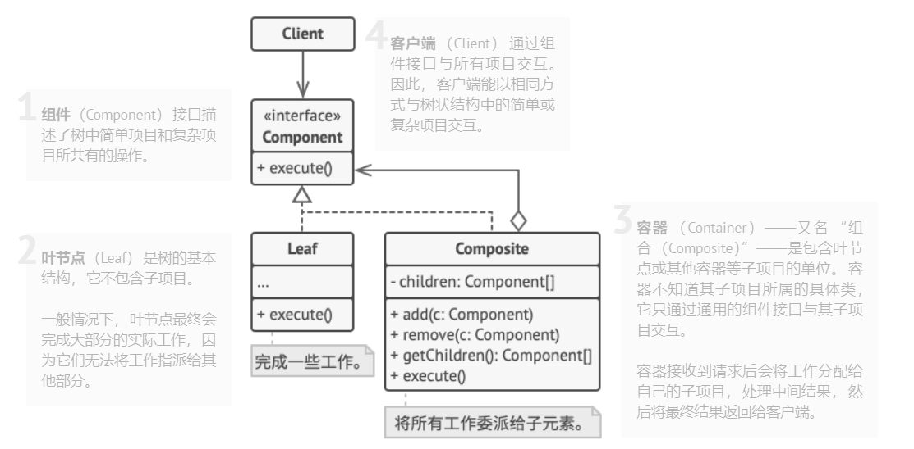

```c++
class Component{
public:
    virtual void operation()=0;
    
};

class Leaf:public Component{
public:
    void operation(){
        
    }
};

class Composite:public Component{
private:
    std::vector<Component*> chidren;
public:
    void add(Component* com){
        
    }
    
    void operation() override{
        for( auto child : chidren ){
            child->operation();
        }
        
    }
};
```

**优点：**利用多态和递归机制更方便地使用复杂树结构。

**缺点：**功能差异较大的类， 提供公共接口或许会有困难。

**应用场景：**需要实现树状对象结构， 可以使用组合模式。


### 装饰模式

将对象放入包含行为的特殊封装对象中来为原对象绑定新的行为。

> 智能指针

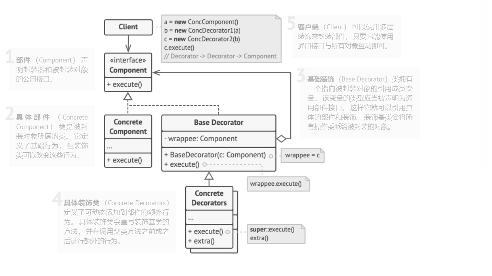

```c++
class Component{
public:
    virtual ~Component(){};
    virtual void Operation()=0;
};

class ConcreteComponent{
    ConcreteComponent(){}
    virtual void Operation(){}
};

class Decorator:public Component{
protected:
    Component* com;
public:
    Decorator(Component* component):com(component){}
    virtual void Operation() override{
        com->Operation();
    }
    virtual ~Decorator(){};
};

class ConcreteDecoratorA:public Decorator{
public:
    ConcreteDecoratorA(Component* com): Decorator(com){};
    virtual void Operation() override{
        std::cout<<"Before,:"<<'\n';
        com->Operation();
        std::cout<<"After"<<'\n';
    }
};
```

**优点：**开放封闭，可以在运行时添加或删除对象的功能。

**缺点：**封装器不能进行复杂行为

**应用场景：**无需修改代码的情况下即可使用对象， 且希望在运行时为对象新增额外的行为， 可以使用装饰模式。


### 外观模式

 能为程序库、 框架或其他复杂类提供一个简单的接口。

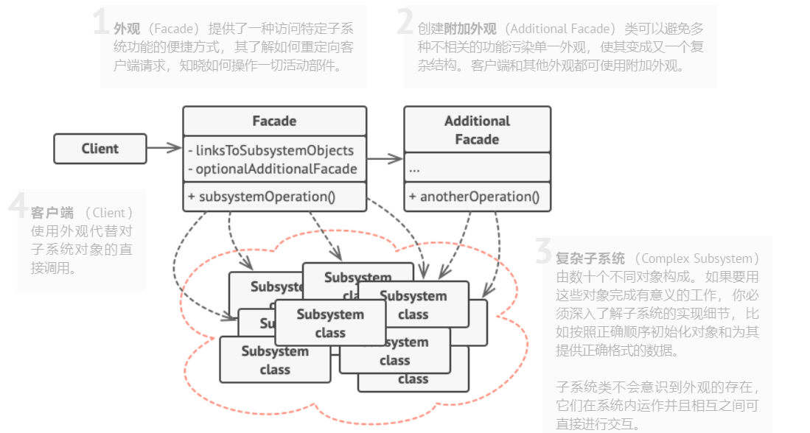

```c++
class  SubSystemInterface{
public:
    virtual ~SubSystemInterface(){};
    virtual void MethodOne()=0;
    virtual void MethodTwo()=0;
};

class ConcreteSubSystemOne:public SubSystemInterface{
public:
    void MethodOne() override{}

    void MethodTwo() override{}
};


class ConcreteSubSystemTwo:public SubSystemInterface{
public:
    void MethodOne()override{}
    void MethodTwo()override{}
};

//外观类
class Facade{
private:
    SubSystemInterface* subSystemOne;
    SubSystemInterface* subSystemTwo;
public:
    Facade(SubSystemInterface* one,SubSystemInterface* two):subSystemOne(one),
    subSystemTwo(two){}
    void FacadeMethod(){
        subSystemTwo->MethodOne();
        subSystemOne->MethodTwo();
    }
};
```

**优点：**让自己的代码独立于复杂子系统

**缺点：**外观类加剧耦合性

**应用场景：**需要一个指向复杂子系统的直接接口， 且该接口的功能有限， 则可以使用外观模式。


### 享元模式

摒弃了在每个对象中保存所有数据的方式， 通过共享多个对象所共有的相同状态， 让你能在有限的内存容量中载入更多对象。

> 共享内存

享元类的状态只能由构造函数的参数进行一次性初始化， 它不能对其他对象公开其设置器或公有成员变量。

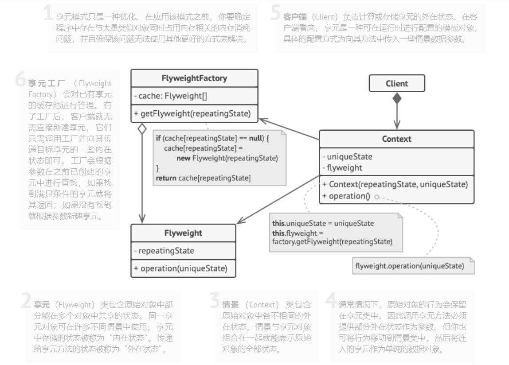

```c++
struct FlyWeight{
    int data;
    FlyWeight(int i):data(i){}
};

class FlyWeightFactory{
private:
    std::map<int,FlyWeight*> flyweights;
public:
    FlyWeight* getFlyWeight(int i){
        if(flyweights.find(i)==flyweights.end()){
            FlyWeight* fw=new FlyWeight(i);
            flyweights[i]=fw;
            return fw;
        }else{
            return flyweights[i];
        }
    }
};
```

**优点：**程序中有很多相似对象， 那么你将可以节省大量内存。

**缺点：**可能需要牺牲执行速度来换取内存， 因为他人每次调用享元方法时都需要重新计算部分情景数据。

**应用场景：**仅在程序必须支持大量对象且没有足够的内存容量时使用享元模式。


### 代理模式

代理控制着对于原对象的访问， 并允许在将请求提交给对象前后进行一些处理。

> vpn

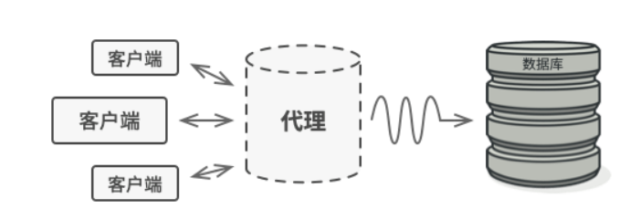


```c++
class RealSubject{
public:
    void doSomething(){}
};

class Client{

};

class ProxySubject:public RealSubject{
    bool checkAccess;
public:
    void doSomething(){
        if(checkAccess){
            RealSubject::doSomething();
        }else{
            std::cout<<"ProxySubject not allowed to do this.\n";
        }
    }
};
```

**优点：**即使服务对象还未准备好或不存在， 代理也可以正常工作

**缺点：**增加复杂性

**应用场景：**

- 缓存代理
- 记录日历请求
- 访问控制
- 远程代理
- 智能引用

## 行为模式

### 责任链模式

 允许你将请求沿着处理者链进行发送。 收到请求后， 每个处理者均可对请求进行处理， 或将其传递给链上的下个处理者。

> switch-case

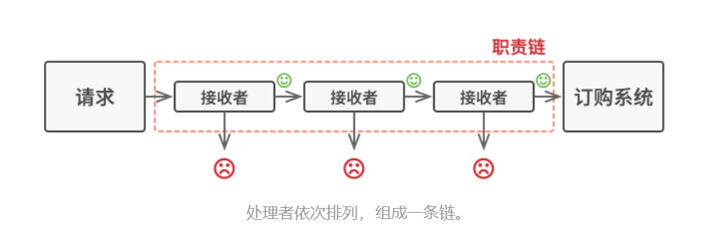

```c++
class abstractHandler{
protected:
    abstractHandler* next;
public:
    virtual void setNext(abstractHandler* n){
        next=n;
    };
    virtual void handler(int i)=0;
};

class ConcreteHander1:public abstractHandler{
public:
    virtual void handler(int i){
        if(i){
            
        }else if(next!= nullptr){
            next->handler(i);
        }
    }
};

class ConcreteHandler2:public abstractHandler{
public:
    virtual void handler(int i){
        if(i){

        }else if(next!= nullptr){
            next->handler(i);
        }
    }
};

int main(){
    abstractHandler* chain;
    abstractHandler* h=new ConcreteHander1;
    chain->setNext(h);
}
```

**优点：**单一责任，开放封闭

**缺点：**需要维护责任链顺序

**应用场景：**当程序需要使用不同方式处理不同种类请求， 而且请求类型和顺序预先未知时， 可以使用责任链模式。


### 命令模式

将一个请求封装成一个对象，从而使您可以用不同的请求对客户进行参数化

> 在请求和命令之间加一层管理机制

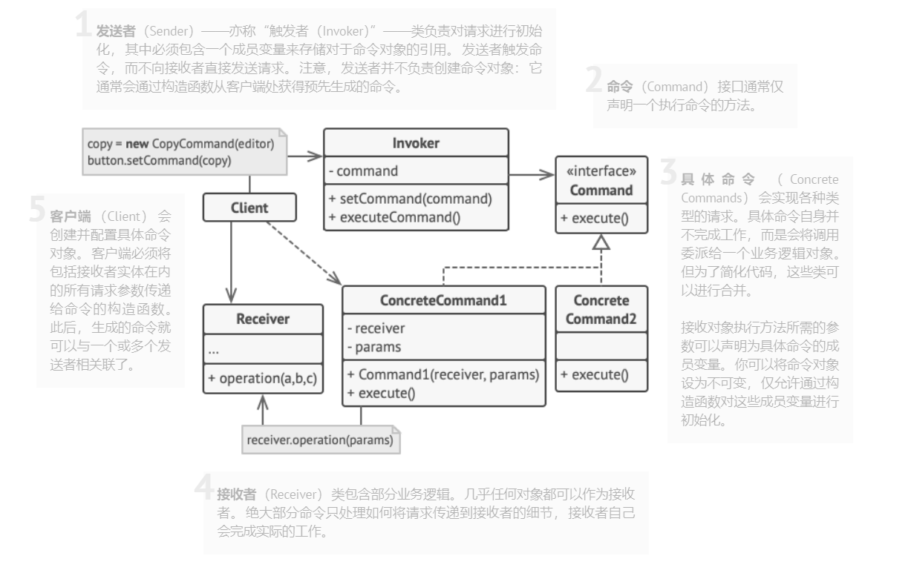

```c++
class Command{
public:
    virtual void execute()=0;
};


class Light{
public:
    void turnOn(){
        
    }
    
    void turnOff(){
        
    }
};

class LightOnCommand:public Command{
private:
    Light* light;
public:
    LightOnCommand(Light* l):light(l){};
    void  execute() override{
        light->turnOff();
    }
};
```

**优点：**解耦触发和执行操作的类,可以实现操作的延迟执行,可以将一组简单命令组合成一个复杂命令。

**缺点：**代码可能会变得更加复杂

**应用场景：**想要将操作放入队列中、 操作的执行或者远程执行操作， 可使用命令模式。


### 迭代器模式

一种行为设计模式， 让你能在不暴露集合底层表现形式 （列表、 栈和树等） 的情况下遍历集合中所有的元素

> c++迭代器


```c++
class Iterator{
public:
    virtual bool hasNext()=0;
    virtual int next()=0;
};

class ConcreteIterator:public Iterator{
private:
    std::vector<int> items;
    int position;
public:
    ConcreteIterator(const std::vector<int>& collection):items(collection),position(0){}

    bool hasNext()override{
        return position<items.size();
    }

    int next(){
        if(hasNext()){
            int item = items[position];
            ++position;
            return item;
        }
        return -1;
    }
};


class Aggregate{
public:
    virtual Iterator* createIterator()=0;
};

class ConcreteAggregate:public Aggregate{
private:
    std::vector<int> items;
public:
    void addItem(int item){
        items.push_back(item);
    }
    
    Iterator* createIterator() override{
        return new ConcreteIterator(items);
    }
};
```

**优点：**单一原则、开放封闭原则、将数据便利方式隐藏

**缺点：**增加复杂度，效率在某些场景下影响比较大

**应用场景：**当集合背后为复杂的数据结构， 且你希望对客户端隐藏其复杂性时 （出于使用便利性或安全性的考虑）， 可以使用迭代器模式。


### 中介者模式

限制对象之间的直接交互， 迫使它们通过一个中介者对象进行合作。


```c++

class Colleague;

class Mediator{
public:
    virtual void sendMessage(Colleague* sender,const std::string& message)=0;
};

class ConcreteMediator:public Mediator{
private:
    std::vector<Colleague*> colleagues;
public:
    void addColleague(Colleague* colleague){
        colleagues.push_back(colleague);
    }

    void sendMessage(Colleague* sender,const std::string& message) override;
};


class Colleague{
protected:
    Mediator* mediator;
public:
    explicit Colleague(Mediator* medi):mediator(medi){}
    virtual void send(const std::string& message)=0;
    virtual void receiveMessage(const std::string& message)=0;
};

class ConcreteColleage:public Colleague{
public:
    explicit ConcreteColleage(Mediator* mediator):Colleague(mediator){}
    void send(const std::string& message) override;
    void receiveMessage(const std::string& message) override;
};

void ConcreteColleage::receiveMessage(const std::string &message) {
    std::cout<<"Received message:"<<message<<std::endl;
}

void ConcreteColleage::send(const std::string &message) {
    mediator->sendMessage(this,message);
}
int main(){
    ConcreteMediator cm;
    Colleague* c=new ConcreteColleage(&cm);

}

void ConcreteMediator::sendMessage(Colleague *sender, const std::string &message) {
    for(Colleague* colleague:colleagues){
        if(colleague!=sender){
            colleague->receiveMessage(message);
        }
    }
}
```


**优点：**单一、开放封闭、，减少耦合性

**缺点：**上帝对象的风险

**应用场景**： 当组件因过于依赖其他组件而无法在不同应用中复用时， 可使用中介者模式。


### 备忘录模式

允许在不暴露对象实现细节的情况下保存和恢复对象之前的状态。

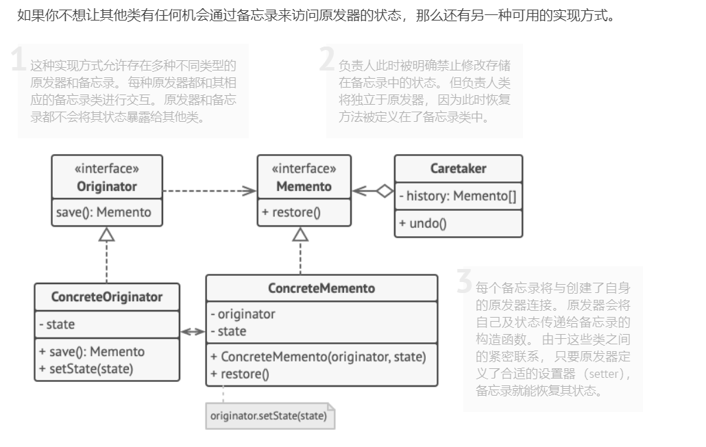

```c++
class Memento{
private:
    int state;
public:
    explicit Memento(int state):state(state){}
    int getState(){
        return state;
    }

};

class Originator{
private:
    int state;
public:
    explicit Originator(int s):state(s){}
    
    void setState(int state){
        this->state=state;
    }
    
    Memento createMemento(){
        return Memento(state);
    }
    
    void resetMemeont(Memento memento){
        state= memento.getState();
    }
};
```

**优点：**不破坏对象的情况下建立快照

**缺点：**负责人必须完整跟踪原发器的生命周期， 这样才能销毁弃用的备忘录。

**应用场景：**当你需要创建对象状态快照来恢复其之前的状态时， 可以使用备忘录模式。


### 观察者模式

允许你定义一种订阅机制， 可在对象事件发生时通知多个 “观察” 该对象的其他对象。

> 多线程notify


```c++
class Observer;
class Subject{
private:
    std::vector<Observer*> observers;
public:
    void attach(Observer* observer){
        observers.push_back(observer);
    }

    void detach(Observer* observer){
        auto it=std::find(observers.begin(),observers.end(),observer);
        if(it!=observers.end()){
            observers.erase(it);
        }
    }

    void notifyObservers();
};

class Observer{
public:
    virtual void update(Subject*)=0;
};

class ConcreteObserver:public Observer{
    void update(Subject*) override;
};

void ConcreteObserver::update(Subject *) {
    
}

void Subject::notifyObservers() {
    for(auto &observer:observers){
        observer->update(this);
    }
}
```

**优点：**开闭原则，建立对象之间的关系

**缺点：**通知模式，增加耦合性，有上帝对象的风险

**应用场景：**当一个对象状态的改变需要改变其他对象， 或实际对象是事先未知的或动态变化的时， 可使用观察者模式。


### 状态模式

**状态模式**是一种行为设计模式， 让你能在一个对象的内部状态变化时改变其行为， 使其看上去就像改变了自身所属的类一样。

> 进程的五种状态

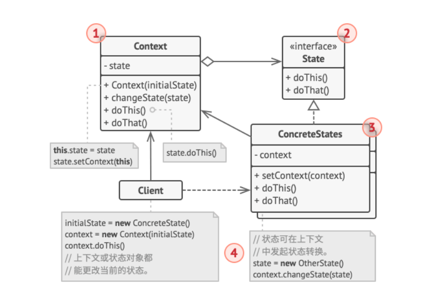

```c++
class State{
public:
    virtual ~State()=default;
    virtual void handle() const=0;
};

class ConcreteState1: public State{
public:
    void handle() const override{
        std::cout<<"Handling State 1"<<std::endl;
    }
};

class ConcreteState2: public State{
public:
    void handle() const override{
        std::cout<<"Handling State 2"<<std::endl;
    }
};

class Context{
private:
    State* currentState;
public:
    Context(State* state):currentState(state){}
    void request() const{
        currentState->handle();
    }

    void changeState(State* state){
        currentState=state;
    }
};
```

**优点：**,单一责任，开闭原则，简化上下文

**缺点：**对于简单的状态来说过于冗余，繁杂

**应用场景：**

- 如果对象需要根据自身当前状态进行不同行为， 同时状态的数量非常多且与状态相关的代码会频繁变更的话， 可使用状态模式
- 状态机转换中存在许多重复代码时， 可使用状态模式


### 策略模式

定义一系列算法， 并将每种算法分别放入独立的类中， 以使算法的对象能够改变

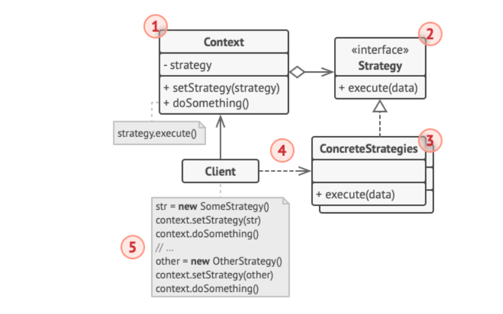

```c++
class Strategy{
public:
    virtual ~Strategy()=default;
    virtual void execute() const=0;
};

class ConcreteSstrategy1:public Strategy{
public:
    void execute() const override{
        std::cout<<"Executing Strategy 1"<<std::endl;
    }
};

class ConcreteSstrategy2:public Strategy{
public:
    void execute() const override{
        std::cout<<"Executing Strategy 2"<<std::endl;
    }
};


class Context{
private:
    Strategy* _strategy;
public:
    Context(Strategy* strategy):_strategy(strategy){}
    void executeStrategy() const{
        _strategy->execute();
    }
    
    void setStrategy(Strategy* newStrategy){
        _strategy=newStrategy;
    }
    
};
```

**优点：**开闭原则，将算法的实现和使用分离

**缺点：** 算法极少改变的场景下，会让代码更加复杂化

**应用场景：**

- 使用对象中各种不同的算法变体， 并希望能在运行时切换算法时， 可使用策略模式


### 模板方法模式

在超类中定义了一个算法的框架， 允许子类在不修改结构的情况下重写算法的特定步骤。

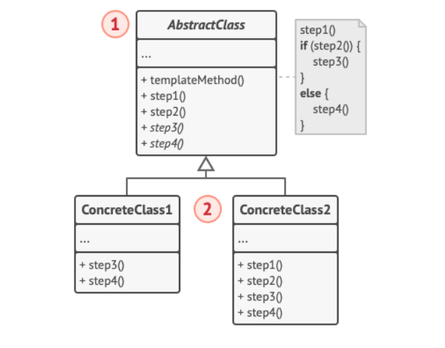

```c++
class abstractClass{
public:
    void Method()const{
        
    }
    virtual ~abstractClass()=default;
protected:
    virtual void step1()=0;
    virtual void step2()=0;
    virtual void step3()=0;
};


class ConcreteClass1:public abstractClass{
    ~ConcreteClass1()=default;
protected:
    virtual void step1() override{
        
    }
    virtual void step2() override{

    }
    virtual void step3() override{

    }
};


class ConcreteClass2:public abstractClass{
    ~ConcreteClass2()=default;
protected:
    virtual void step1() override{

    }
    virtual void step2() override{

    }
    virtual void step3() override{

    }
};
```

**优点：**开闭原则，提高超类代码的可复用性

**缺点：**超类会抑制之类的实现，反里式替换原则

**应用场景：**

- 只希望扩展某个特定算法步骤， 而不是整个算法或其结构时， 可使用模板方法模式。


### 访问者模式

将算法与其所作用的对象隔离开来

> c++的algorithm library

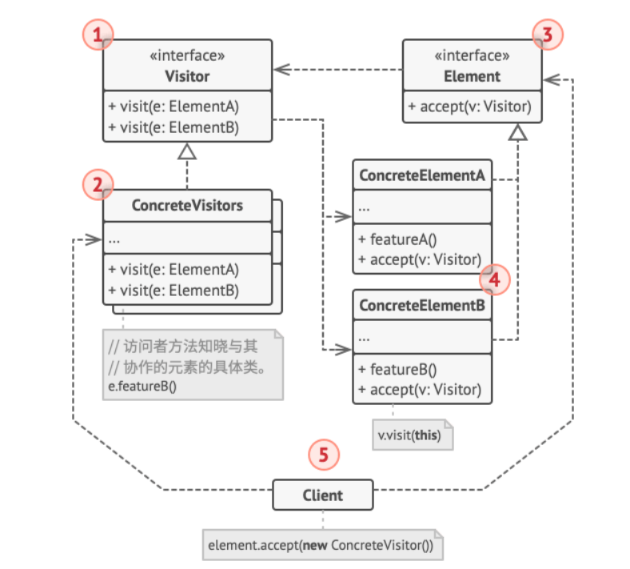

```c++
class Visitor;
class Element{
public:
    virtual ~Element()=default;
    virtual void accept(Visitor& visitor)=0;
};

class ConcreteElementA:public Element{
public:
    virtual ~ConcreteElementA()=default;
    virtual void accept(Visitor& visitor) override;
};

class ConcreteElementB:public Element{
public:
    virtual ~ConcreteElementB()=default;
    virtual void accept(Visitor& visitor) override;
};

class Visitor{
public:
    virtual ~Visitor()=default;
    virtual void visit(ConcreteElementA EA) const=0;
    virtual void visit(ConcreteElementB EB) const=0;
};

class ConcreteVisitor:public Visitor{
public:
    virtual ~ConcreteVisitor()=default;
    virtual void visit(ConcreteElementA EA) const override{
    }
    virtual void visit(ConcreteElementB EB) const override{
    }
    
};


void ConcreteElementA::accept(Visitor &visitor) {
    visitor.visit(*this);
}

void ConcreteElementB::accept(Visitor &visitor) {
    visitor.visit(*this);
}
```

**优点：**单一职责，开闭原则

**缺点：**访问者需要对了解元素具体情况，且元素的种类的改变都需要改变访问者的代码

**应用场景：**

- 需要对一个复杂对象结构 （例如对象树） 中的所有元素执行某些操作， 可使用访问者模式。


## reference

https://design-patterns.readthedocs.io/zh-cn/latest/creational_patterns/

https://refactoringguru.cn/design-patterns/

