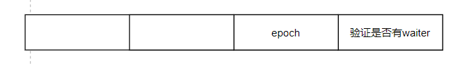
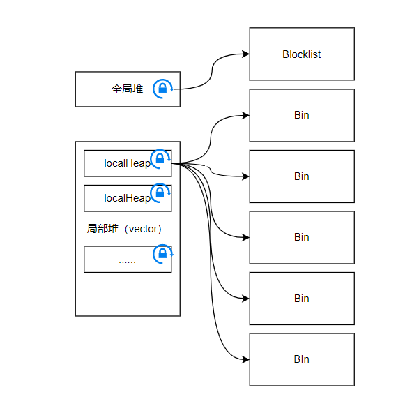
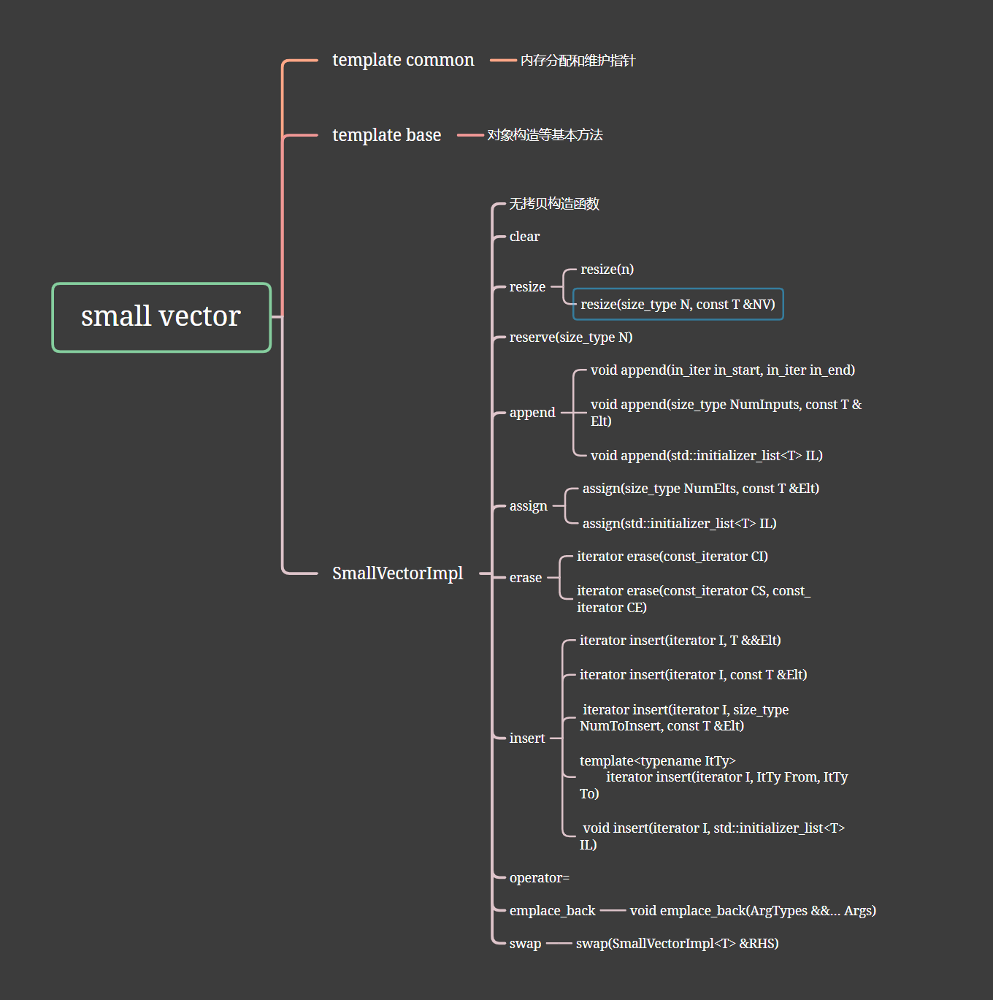
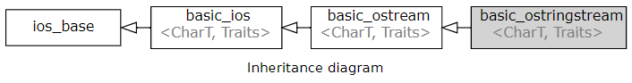

https://github.com/boost-ext/te/blob/master/include/boost/te.hpp


[TOC]


# 项目解析

## taskflow

Taskflow 是一个现代 C++ 任务图调度库，旨在简化并行和并发任务的编程。它提供了一种方便的方式来描述任务之间的依赖关系，并允许以图的形式组织任务，从而实现并行计算和任务调度。

- 任务图：Taskflow 允许用户创建一个任务图，任务图是由一组任务和它们之间的依赖关系组成的有向无环图（DAG）。任务图描述了任务之间的依赖关系，使得任务可以按照定义的顺序和条件自动执行。
- 任务组织：用户可以根据任务的依赖关系组织任务，并使用 Taskflow 提供的 API 定义任务之间的依赖关系。这使得任务之间的执行顺序变得清晰，易于理解和维护。
- 并行执行：任务图中的任务可以并行执行，Taskflow 会自动根据任务之间的依赖关系来调度任务的执行。这使得并行计算变得简单且高效，可以充分利用多核处理器的性能。
- 异步执行：Taskflow 支持异步任务执行，允许用户将任务提交给 Taskflow 并继续执行其他操作，而无需等待任务完成。这种异步执行方式可以提高程序的响应性和并发性。
- 多线程支持：Taskflow 在底层使用了多线程技术来实现任务的并行执行和调度，因此可以充分利用多核处理器的优势。

### core

#### error.h

debug:` #include<sstream>`


```c++
#define TF_THROW(...) tf::throw_re(__FILE__,___LINE__,__VA_ARGS__);
//TF_THROW(...): 这是宏的名称，它定义了一个名为TF_THROW的宏。它后面的括号中有...，表示该宏可以接受可变数量的参数。
//__VA_ARGS__: 这是一个特殊的预处理器宏，用于代表可变数量的参数。在这个上下文中，它代表了TF_THROW宏接受的可变数量的参数。
```


#### declarations.h

**向前声明**多个类的存在

Forward declarations are usually used for Classes. In this, **the class is pre-defined before its use so that it can be called and used by other classes that are defined before this.**


#### notifier.hpp

**多版本兼容管理**

```c++
truct Waiter {
            std::atomic<Waiter *> next;
            uint64_t epoch;
            enum : unsigned {
                kNotSignaled = 0,
                kWaiting,
                kSignaled,
            };

#ifdef __cpp_lib_atomic_wait
            std::atomic<unsigned> state {0};
#else
            std::mutex mu;
            std::condition_variable cv;
            unsigned state;
#endif
        };
```

类内部枚举类似，标识其作用域


**匿名枚举类型**

匿名枚举类型通常用于简化代码，尤其是当你只需要一组相关的整数常量时，而不需要在代码中引入一个命名的枚举类型

```c++
namespace MyNamespace {
    enum {
        constant1 = 1,
        constant2 = 2,
        constant3 = 3
    };
}

int main() {
    int value = MyNamespace::constant1;
    // 或者直接使用
    int value2 = constant2;
    
    // ...
    
    return 0;
}

```

> 匿名枚举类型的成员常量在编译时就已经确定，并且它们的值是在编译时分配的。当你创建多个结构体或类的实例时，它们都会共享相同的匿名枚举类型成员常量。


$state=2^{16}-1-\_waiters.size()*2^{33}$




### c++同步屏障

std::atomic_thread_fence

**Fence-atomic synchronization**

线程A: release F(原子store),F在store之前

线程B:原子获取操作


**Atomic-fence synchronization**

线程A：原子release操作

线程B:   acquire F，Y读取原子数据（在F之前）


**Fence-fence synchronization**

线程A: release F (写M,F在写操作之前)

线程B: acquire F（读M,读操作在F之前)

quanju 原子变量：M


```c++
void prepare_wait(Waiter *w) {
    w->epoch = _state.fetch_add(kWaiterInc, std::memory_order_relaxed);
    std::atomic_thread_fence(std::memory_order_seq_cst);
}
```

无锁操作，不重排数据，保证原子变量修改的时候数据一致性

- 值相同：
- 值不同：


**std::atomic_wait**

```c++
template< class T >
void atomic_wait( const std::atomic<T>* object,
                  typename std::atomic<T>::value_type old );
```


类成员变量

```c++
static const uint64_t kStackBits = 16;
static const uint64_t kStackMask = (1ull << kStackBits) - 1;
static const uint64_t kWaiterBits = 16;
static const uint64_t kWaiterShift = 16;
static const uint64_t kWaiter0Mask = ((1ull << kWaiterBits) - 1)<< kWaiterShift;
static const uint64_t kWaiterInc = 1ull << kWaiterBits;
static const uint64_t kEpochBits = 32;
static const uint64_t kEpochShift = 32;
static const uint64_t kEpochMask = ((1ull << kEpochBits) - 1) << kEpochShift;
static const uint64_t kEpochInc = 1ull << kEpochShift;
std::atomic<uint64_t> _state;
std::vector<Waiter> _waiters;
```


### alogrithm

### utility

#### math

- **enable_if_t**

```c++
template< bool B, class T = void >
struct enable_if;
```

If `B` is true, **std::enable_if** has a public member typedef `type`, equal to `T`,

```c++
template< bool B, class T = void >
using enable_if_t = typename enable_if<B,T>::type;
```


- **std::decay_t**

```c++
template< class T >
struct decay;
```

Performs the type conversions equivalent to the ones performed when passing [function arguments](https://en.cppreference.com/w/cpp/language/function#Parameter_list) by value.

```c++
template< class T >
using decay_t = typename decay<T>::type;
```

- 对于数组类型，它会退化为指向数组元素类型的指针。
- 对于函数类型，它会退化为函数指针类型。
- 对于引用类型，它会退化为对应的非引用类型。
- 对于任何其他类型，它会保持原样。


- **std::underlying_type_t**

> ```c++
> enum e1 {};
> enum class e2 {};
> enum class e3 : unsigned {};
> enum class e4 : int {};
>  
> int main()
> {
>     constexpr bool e1_t = std::is_same_v<std::underlying_type_t<e1>, int>;
>     constexpr bool e2_t = std::is_same_v<std::underlying_type_t<e2>, int>;
>     constexpr bool e3_t = std::is_same_v<std::underlying_type_t<e3>, int>;
>     constexpr bool e4_t = std::is_same_v<std::underlying_type_t<e4>, int>;
>  
>     std::cout
>         << "underlying type for 'e1' is " << (e1_t ? "int" : "non-int") << '\n'
>         << "underlying type for 'e2' is " << (e2_t ? "int" : "non-int") << '\n'
>         << "underlying type for 'e3' is " << (e3_t ? "int" : "non-int") << '\n'
>         << "underlying type for 'e4' is " << (e4_t ? "int" : "non-int") << '\n';
> }
> ```

> underlying type for 'e1' is non-int
> underlying type for 'e2' is int
> underlying type for 'e3' is non-int
> underlying type for 'e4' is int

If `T` is a complete enumeration (enum) type, provides a member typedef `type` that names the underlying type of `T`


- **is_unsigned_v**

```c++
template< class T >
struct is_unsigned;
```

If `T` is an arithmetic type, provides the member constant `value` equal to true


最低位单独处理：类似1在位上不断右移并求或

```c++
    /*
     * next_pow2:如果传递的类型不符合这些要求，编译器会自动排除该函数模板，从而避免编译错误。
     * */
    template <typename T,std::enable_if_t<
    (std::is_unsigned_v<std::decay_t<T>>&&sizeof(T)==8),void>* =nullptr>
   constexpr T next_pow2(T x){
                if(x==0) return 1;
                x--;
                x|=x>>1;
                x|=x>>2;
                x|=x>>4;
                x|=x>>8;
                x|=x>>16;
                x|=x>>32;
                x++;
                return x;
   }
```


```c++
template <typename T,std::enable_if_t<std::is_integral_v<std::decay_t<T>>,void>* = nullptr>
    constexpr bool is_pow2(const T& x){
        return x&&(!(x&(x-1)));
    }
```


- **std::memory_order**

std::memory_order指定了内存访问，包括常规的、非原子的内存访问，如何围绕原子操作进行排序。

[load]:从内存中读取数据
[store]:将数据写入内存

```c++
typedef enum memory_order {
    memory_order_relaxed,//对其他的读写没有顺序和同步约束，只保证操作时原子性的
    memory_order_consume,//load操作=消费操作
    //当前线程依赖于该变量的读写操作不能被重排在load操作之前
    //其他线程释放的该数据依赖变量对该线程可见（用作编译器优化）
    memory_order_acquire,//load操作=获取操作
    //当前线程依赖于该变量的读写操作不能被重排在load操作之前
    //其他线程释放的相同原子变量对该线程可见（用作编译器优化）
    memory_order_release,//store操作=releas操作
    //当前线程依赖于该变量的读写操作不能被重排在load操作之前
    //该线程的写操作对其他线程可见，对原子变量的写操作被依赖的消耗操作可见
    memory_order_acq_rel,//以这种内存顺序执行的读-修改-写操作=执行获取和释放操作
        //当前线程依赖于该变量的读写操作不能被重排在load操作之前
    //在修改之前，其他线程对该原子变量的写操作对该线程可见
    //并且该修改对其他获取该原子变量的线程可见
    memory_order_seq_cst//以这种内存顺序执行load操作执行获取操作，以这种内存顺序执行的store操作是释放操作,以这种内存顺序执行的读-修改-写操作=执行获取和释放操作,所有其他线程都观察到一直的修改顺序。
        
} memory_order;
```


#### iterator.hpp



使用了额外的括号 `(std::max)`，这是为了避免与可能存在的宏定义冲突，确保调用的是 `std::max` 函数

```c++
constexpr static size_t X = (std::max)(sizeof(T*),sizeof(T));
```


接受一个可选的无符号整数参数（默认为std::thread::hardware_concurrency()）作为输入。

```c++
explicit ObjectPool(unsigned=std::thread::hardware_concurrency());
```


```c++
template<typename T,size_t S=65536>
class ObjectPool{
    constexpr static size_t X = (std::max)(sizeof(T*),sizeof(T));
    constexpr static size_t M = S/X;
    constexpr static size_t F=4;
    constexpr static size_t B=F+1;
    constexpr static size_t W = (M+F-1)/F;
    constexpr static size_t K=4;
    static_assert(tf::is_pow2(S),"Block size S must be a power of two");
    static_assert(M>=128,"block size S must be larger enough to pool at least 128 objects");
```

- X：对象分配内存大小
- M：每个块可容纳对象个数
- F：空阈值
- B：每个localheap的bin的数量
- W：每个bin容纳的对象个数
- K：收敛常数

```c++
struct Blocklist{//块链接
    Blocklist* prev;
    Blocklist* next;
};

struct GlobalHeap{//全局堆
    std::mutex m;
    Blocklist list;
};

struct LocalHeap{//本地堆
    std::mutex m;
    Blocklist lists[B];
    size_t u{0};
    size_t a{0};
};

struct Block{//块
    std::atomic<LocalHeap*> heap;
    Blocklist list_node;
    size_t i;
    size_t u;
    // long double padding;
    T* top;
    char data[S];
};
```


```c++
const size_t _lheap_mask;
GlobalHeap _gheap;
std::vector<LocalHeap> _lheaps;
```


**成员方法:求成员的偏移量**

```c++
template<typename T,size_t S>
template<class P,class Q>
constexpr size_t ObjectPool<T,S>::_offset_in_class(const Q P::*member) const {
    return (size_t)&(reinterpret_cast<P*>(0)->*member);
}
```


#### os.h

判断当前系统以及确定CacheLineSize


---

**CacheLineSize**

**范围**：16~256Byte

缓存行的性能取决于应用、缓存电路设计

---


```c++
template <typename T>
struct CachelineAligned {
  alignas (2*TF_CACHELINE_SIZE) T data;//对齐指令，它告诉编译器 data 变量需要按照指定的字节数进行对齐
};
```


```c++
inline std::string get_env(const std::string& str){
#ifdef _MSC_VER//Microsoft Visual C++ 编译器的宏，用于表示代码是否在 Microsoft 编译器环境中
    char* ptr=nullptr;
    size_t len=0;

    if(_dupenv_s(&ptr,&len,str.c_str())==0&&ptr!=nullptr){//如果 _dupenv_s 执行成功且返回值为0，那么表示环境变量存在。
        std::string res(ptr,len);
        std::free(ptr);
        return res;
    }
    return "";
#else
    auto ptr=std::getenv(str.c_str());//std::getenv 是一个 C 标准库函数，用于获取指定环境变量的值。它返回一个指向字符串的指针，如果环境变量不存在，则返回空指针。
    return ptr?ptr:"";
#endif
}
```


#### serializer.h

1、常量编译

2、move函数避免拷贝操作

**"CRTP"（Curiously Recurring Template Pattern，奇异递归模板模式）**

> 通过在派生类中使用基类模板的类型作为其模板参数，从而实现在派生类中具体实现基类的方法

**SFINAE（Substitution Failure Is Not An Error，替换失败不是错误）**

>  SFINAE（Substitution Failure Is Not An Error，替换失败不是错误）机制，使用 `std::enable_if_t` 对 `T` 的类型进行条件判断。

**类型萃取（Type Traits）**

> `is_default_serializable_v<std::decay_t<T>>` 使用了类型特性来检查 `T` 的类型是否满足特定的条件。这种技术用于在编译时根据类型的特性来进行条件分支。完美转发+万能引用+类型退化来实现

**成员函数调用和委托**

> `_save` 方法在代码中调用了 `t.save(*this)`，这涉及到成员函数的调用和委托，其中 `t` 对象的 `save` 成员函数被调用，并将当前对象（`*this`）作为参数传递。


**eg1.cpp**

```c++
template<typename T>
struct is_std_basic_string : std::false_type{};

template<typename ...ArgsT>
struct is_std_basic_string<std::basic_string<ArgsT...>> :std::true_type{};

template<typename T>
constexpr bool is_std_basic_string_v=is_std_basic_string<T>::value;
```


**eg2.cpp**

```c++
template<typename T>
struct is_std_array : std::false_type {};

template<typename T,size_t N>
struct is_std_array<std::array<T,N>>:std::true_type{};

template<typename T>
constexpr bool is_std_array_v=is_std_array<T>::value;
```


```c++
template<template<typename ...> typename C,typename T,typename ...RestT>
struct ExtractType<0,C<T,RestT...>>{
    using type=T;
};
```

- 模板参数包,0或多个参数
- template<typename ...> typename C 模板模板参数（template template parameter），表示一个模板类型


**[c++std:17]std::variant**：提供了一种类型安全的**联合（Union）**容器，可以存储多个不同类型的值，并且只有一个值是活跃的（active），也就是说，`std::variant` 在任意时刻只持有一个值。传统联合类型在不同值之间切换时需要手动管理，容易出错，而 `std::variant` 能够在编译时检查类型是否匹配，避免了类型转换和潜在的错误。

- **index**:returns the zero-based index of the alternative held by the variant

**std::optional** 可能包含值，值可能存在或不存在

```c++
template< bool B, class T, class F >
struct conditional;
```

decay_t：去引用或去指针

```c++
using type=std::conditional_t<std::is_lvalue_reference_v<T>,T,std::decay_t<T>>;
```

序列化：

- 存index+值

- 取: _variant_helper(帮助进行index指向的类型萃取)


```c++
//模板参数包,0或多个参数
template<template<typename ...> typename C,typename T,typename ...RestT>
struct ExtractType<0,C<T,RestT...>>{
    using type=T;
};
```


```c++
template<typename Stream,typename SizeType>
template<size_t I,typename ...ArgsT,std::enable_if_t<I<sizeof...(ArgsT)>*>
        SizeType Deserializer<Stream,SizeType>::_variant_helper(size_t i, std::variant<ArgsT...> & v)  {
            if(i==0){
                using type=ExtractType<I,std::variant<ArgsT...>>;
                if(v.index()!=I){
                    static_assert(
                            std::is_default_constructible<type>::value,
                            "Failed to archive variant(type should be default constructible T())"
                            );
                    v=type();//持有对应成员
                }
                return _load(*std::get_if<type>(&v));
            }
    return _variant_helper<I+1,ArgsT...>(i-1,v);
    }
```


**std::visit** 对variant的每个变量进行变量并操作

**std::apply**：将方法f应用于t上

**sizeof...**:返回参数包元素个数


#### small_vector.h

```c++
#if defined(__GNUC__)
#define TF_LIKELY(x) (__builtin_expect((x), 1))
#define TF_UNLIKELY(x) (__builtin_expect((x), 0))
#else
#define TF_LIKELY(x) (x)
  #define TF_UNLIKELY(x) (x)
#endif
```

条件编译的宏定义块，用于优化代码的**分支预测**（Branch Prediction）

- `TF_LIKELY(x)` 宏表示条件 `x` 很可能为真（true）。它使用 `__builtin_expect` 函数将条件表达式 `x` 标记为“很可能为真”，这样编译器将更有可能生成机器代码，以优化为真的情况。
- `TF_UNLIKELY(x)` 宏表示条件 `x` 很可能为假（false）。它使用 `__builtin_expect` 函数将条件表达式 `x` 标记为“很可能为假”，这样编译器将更有可能生成机器代码，以优化为假的情况


```c++
template <typename T>
struct IsPod : std::integral_constant<bool, std::is_standard_layout<T>::value &&
                                            std::is_trivial<T>::value> {};
```

**标准类型布局类型**：

标准布局类是一种在C++中用于低级内存操作的特殊类型，它们的内部结构和布局受到一些严格的限制，以确保代码的可移植性和可靠性。这对于需要与底层硬件或其他C++代码进行交互的情况非常重要，因为它可以避免不必要的内存布局问题和错误。标准布局类通常在系统编程、嵌入式编程和性能优化等领域中使用。


**平凡类型**：

1. **没有用户自定义的构造函数**：平凡类型的对象可以使用默认构造函数进行构造，但没有用户自定义的构造函数。这意味着它们可以直接通过内存复制来创建。
2. **没有用户自定义的析构函数**：平凡类型的对象可以被销毁，但没有用户自定义的析构函数。它们的销毁操作是简单的内存清理。
3. **没有用户自定义的拷贝构造函数和赋值运算符**：平凡类型的对象可以进行拷贝操作，但没有用户自定义的拷贝构造函数或赋值运算符重载。它们的拷贝是直接的内存复制。
4. **没有用户自定义的移动构造函数和移动赋值运算符**：平凡类型通常不包含移动构造函数和移动赋值运算符。


```c++
void grow_pod(void *FirstEl, size_t MinSizeInBytes, size_t TSize){//扩容前不破坏原始数据
    size_t CurSizeBytes = size_in_bytes();
    size_t NewCapacityInBytes = 2 * capacity_in_bytes() + TSize; // Always grow.
    if (NewCapacityInBytes < MinSizeInBytes) {
        NewCapacityInBytes = MinSizeInBytes;
    }

    void *NewElts;//FirstEl标识的是栈分配的内存空间，动态分配的用BeginX标识
    if (BeginX == FirstEl) {
        NewElts = std::malloc(NewCapacityInBytes);
        memcpy(NewElts, this->BeginX, CurSizeBytes);
    } else {
        NewElts = realloc(this->BeginX, NewCapacityInBytes);
    }
    this->EndX = (char*)NewElts+CurSizeBytes;//最后一个元素的下一个地址
    this->BeginX = NewElts;
    this->CapacityX = (char*)this->BeginX + NewCapacityInBytes;
}
```


逆序


**c++17**

**uninitialized_copy**

> Copys elements from the range `[`first`, `last`)` to an uninitialized memory area beginning at d_first

```c++
template<class InputIt, class NoThrowForwardIt>
NoThrowForwardIt uninitialized_copy(InputIt first, InputIt last, NoThrowForwardIt d_first)
{
    using T = typename std::iterator_traits<NoThrowForwardIt>::value_type;
    NoThrowForwardIt current = d_first;
    try
    {
        for (; first != last; ++first, (void) ++current)
            ::new (static_cast<void*>(std::addressof(*current))) T(*first);
        return current;
    }
    catch (...)
    {
        for (; d_first != current; ++d_first)
            d_first->~T();
        throw;
    }
}
```

**uninitialized_move**

> Moves elements from the range `[`first`, `last`)` to an uninitialized memory area beginning at d_first


###### new

`::new`：

- `::new`操作符是全局作用域的，意味着它会在全局命名空间中查找`new`操作符。

###### move(算法)

```c++
std::move(I+1, this->end(), I);
```

> template< class InputIt, class OutputIt >
> constexpr OutputIt move( InputIt first, InputIt last, OutputIt d_first );


```c++
std::move_backward(I, this->back(), this->end());
```

> Moves the elements from the range `[`first`, `last`)`, to another range ending at d_last. The elements are moved in reverse order (the last element is moved first), but their relative order is preserved.


**std::copy**

> Copies all elements in the range `[`first`, `last`)` starting from first and proceeding to last.If d_first is in `[`first`, `last`)`, the behavior is undefined. In this case, [std::copy_backward](https://en.cppreference.com/w/cpp/algorithm/copy_backward) may be used instead.

```c++
template<class InputIt, class OutputIt>
OutputIt copy(InputIt first, InputIt last,
              OutputIt d_first)
{
    for (; first != last; (void)++first, (void)++d_first)
        *d_first = *first;
 
    return d_first;
}
```





#### stream.h



可变参数模板（Variadic Templates）和递归函数调用

```c++
template <typename T, typename... Rest>
void ostreamize(std::ostream& os, T&& token, Rest&&... rest) {
    os << std::forward<T>(token);
    ostreamize(os, std::forward<Rest>(rest)...);
}
```


```c++
template<
        class CharT,
        class Traits = std::char_traits<CharT>,
        class Allocator = std::allocator<CharT>
> class basic_ostringstream
        : public basic_ostream<CharT, Traits>;
```

> The class template `std::basic_ostringstream` implements output operations on string based streams. It effectively stores an instance of [std::basic_string](https://en.cppreference.com/w/cpp/string/basic_string) and performs output operations to it


#### traits.h

###### 兼容性处理

```c++
#if __has_include(<version>)
#  include <version>
#endif
```

`__has_include(<version>)` 会返回一个布尔值，指示编译器是否能够找到并包含 `<version>` 头文件。如果能够找到，那么条件成立，就会继续执行 `#include <version>`，否则将跳过这一行。

在这里，`<version>` 头文件通常用于检查 **C++ 标准库的版本信息和特性支持**，以便在代码中进行条件编译，根据不同的编译器和标准库版本来选择性地启用或**禁用某些功能或优化**。这样可以帮助确保代码在不同环境下都能正常编译和运行。


```c++
template <typename T>
struct MoC {

    MoC(T&& rhs) : object(std::move(rhs)) {}
    MoC(const MoC& other) : object(std::move(other.object)) {}

    T& get() { return object; }

    mutable T object;
};

template <typename T>
auto make_moc(T&& m) {
    return MoC<T>(std::forward<T>(m));
}
```


###### 有状态迭代器处理 

```c++
 template <typename B, typename E>
    struct stateful_iterator {

        using TB = std::decay_t<unwrap_ref_decay_t<B>>;
        using TE = std::decay_t<unwrap_ref_decay_t<E>>;

        static_assert(std::is_same_v<TB, TE>, "decayed iterator types must match");

        using type = TB;
    };

    template <typename B, typename E>
    using stateful_iterator_t = typename stateful_iterator<B, E>::type;

// raw integral index
    template <typename B, typename E, typename S>
    struct stateful_index {

        using TB = std::decay_t<unwrap_ref_decay_t<B>>;
        using TE = std::decay_t<unwrap_ref_decay_t<E>>;
        using TS = std::decay_t<unwrap_ref_decay_t<S>>;

        static_assert(
                std::is_integral_v<TB>, "decayed beg index must be an integral type"
        );

        static_assert(
                std::is_integral_v<TE>, "decayed end index must be an integral type"
        );

        static_assert(
                std::is_integral_v<TS>, "decayed step must be an integral type"
        );

        static_assert(
                std::is_same_v<TB, TE> && std::is_same_v<TE, TS>,
                "decayed index and step types must match"
        );

        using type = TB;
    };

    template <typename B, typename E, typename S>
    using stateful_index_t = typename stateful_index<B, E, S>::type;
```

这些模板可能在处理自定义范围迭代器和索引时非常有用，特别是在需要对迭代器和索引进行类型匹配和验证的情况下。


**std::get(N)**

> Extracts the `I`th element from the tuple. `I` must be an integer value in


###### 折叠表达式

- **( pack op ... )** 右折叠
- **( ... op pack )**  左折叠
- **( pack op .. . op init )** 第二类右折叠
- **( init op .. . op pack )** 第二类左折叠
  
  

**折叠展开**：

- **右折叠展开**`(E` *op* `...)` becomes `(E1` *op* `(`... *op* `(EN-1` *op* `EN)))`
-  **左折叠展开**`(...` *op* `E)` becomes `(((E1` *op* `E2)` *op* ...`)` *op* `EN)`
- **第二类右折叠展开**： `(E1` *op* `(`... *op* `(EN−1` *op* `(EN` *op* `I))))`
- **第二类左折叠展开**：`((((I` *op* `E1)` *op* `E2)` *op* ...`)` *op* `EN)`

> **递归模板特化**

```c++
template <typename T, typename... Ts>
struct filter_duplicates { using type = T; };

template <template <typename...> class C, typename... Ts, typename U, typename... Us>
struct filter_duplicates<C<Ts...>, U, Us...>
        : std::conditional_t<(std::is_same_v<U, Ts> || ...)
                , filter_duplicates<C<Ts...>, Us...>
                , filter_duplicates<C<Ts..., U>, Us...>> {};

template <typename T>
struct unique_variant;

template <typename... Ts>
struct unique_variant<std::variant<Ts...>> : filter_duplicates<std::variant<>, Ts...> {};

template <typename T>
using unique_variant_t = typename unique_variant<T>::type;
```


#### uuid.h


### 特性

#### "if with initializer"

该特性允许在 if 语句中初始化一个变量，然后在 if 条件判断中使用这个变量。

####  SFINAE（Substitution Failure Is Not An Error）

`SizeType Serializer<Stream,SizeType>::_save(T &&t)`


## cache


## 网络编程

### lab1

```c#
#include <stdio.h>
#include <stdlib.h>
#include <sys/types.h>
#include <string.h>
#include <netinet/in.h>
#include <sys/types.h>
#include <sys/socket.h>
#include <unistd.h>
#include <errno.h>
#include <arpa/inet.h>
#include <signal.h>

#define BUFFER_SIZE 1024
#define PORT 6789


void str_client(FILE *fp,int connfd);
ssize_t writen(int fd, void *vptr, size_t n);
int readline(int fd, void *vptr, int max);

int main(int argc, char** argv) {
    int sockfd;
    struct sockaddr_in servaddr;

    if (argc != 2) {
        perror("usage:tcpcli <IPaddress> ");
        exit(-1);
    }
    //PF_INET：表示使用的地址族，指定为IPv4
    //SOCK_STREAM：表示套接字的类型，指定为面向连接的字节流套接字。
    //0：表示指定的协议，通常为0，让操作系统根据地址族和套接字类型自动选择合适的协议。
    if ((sockfd = socket(PF_INET, SOCK_STREAM, 0)) < 0) {
        perror("socket error");
        exit(-1);
    }
    //sockfd 是一个整数变量，用于存储返回的套接字描述符。套接字描述符是一个非负整数，用于标识在进程中打开的套接字

    bzero(&servaddr,sizeof(servaddr));
    servaddr.sin_family = PF_INET;
    //htons 函数用于将主机字节序的端口号转换为网络字节序(大端)
    servaddr.sin_port = htons(PORT);
    
//IP 地址从文本格式（例如 "192.168.0.1"）转换为二进制格式，并存储在servaddr.sin_addr中
if (inet_pton(PF_INET, argv[1], &servaddr.sin_addr) < 0) {
    perror("Inet_pton failed!");
    exit(-1);
}

if (connect(sockfd, (const struct sockaddr *)&servaddr, sizeof(servaddr)) < 0) {
    perror("connect failed!");
    exit(-1);
}
    str_client(stdin, sockfd);
    exit(0);
}

void str_client(FILE *fp, int connfd) {
    char send[BUFFER_SIZE], recv[BUFFER_SIZE];
    while (fgets(send, BUFFER_SIZE, fp) != NULL) {
    if (writen(connfd, send, sizeof(send)) < 0) {
        perror("write failed");
        exit(-1);
    }
    if (readline(connfd, recv, BUFFER_SIZE) < 0) {
        perror("read failed!");
        exit(-1);
    }
    printf("Receive from server:");
    fputs(recv, stdout);
    }
}

ssize_t writen(int fd, void *vptr, size_t n) {
    size_t nleft = n;
    size_t nwriten = 0;
    void *ptr = vptr;
    while (nleft > 0) {
        if ((nwriten = write(fd, ptr, nleft)) <= 0) {
            if (nwriten < 0 || errno == EINTR) {
                nwriten = 0;
            }
            else {
                perror("server writen failed!");
                return -1;
            }
        }
        nleft -= nwriten;
        ptr += nwriten;
    }
    return n;
}

int readline(int fd, void *vptr, int max) {
    size_t nread = 0;
    size_t nleft = max;
    char *ptr = vptr;
    while (nleft > 0)
    {
    if ((nread = read(fd, ptr, nleft)) < 0) {
        if (nread < 0 && errno == EINTR) {
            nread = 0;
        }
		else {
            perror("read failed!");
            exit(-1);
    	}
    }
    else if (nread == 0)
        break;
    nleft -= nread;
    ptr += nread;
    }
    return (max - nleft);
}
```


```c++
#include <netinet/in.h>
#include <sys/types.h>
#include <sys/socket.h>
#include <stdio.h>
#include <stdlib.h>
#include <string.h>
#include <unistd.h>
#include <errno.h>
#include <arpa/inet.h>//for struct sockaddr_in

#define BUFFER_SIZE 1024
#define LENGTH_OF_QUEUE 5


void str_echo(int listenfd);
ssize_t writen(int fd, void *vptr, size_t n);

int main(int argc, char** argv) {
	int listenfd, connfd ,port;
	pid_t childpid;
	socklen_t clilen;
	struct sockaddr_in cliaddr, servaddr;
	if (argc != 2) {
		perror("usage:tcpcli  <Port>");
		exit(-1);
	}

	port = atoi(argv[1]);
    
	if ((listenfd = socket(PF_INET, SOCK_STREAM, 0)<0)) {
		perror("socket error");
		exit(-1);
	}
    
	bzero(&servaddr, sizeof(servaddr));
	servaddr.sin_family = PF_INET;
	servaddr.sin_port = htons(port);
	servaddr.sin_addr.s_addr = INADDR_ANY;
    
	int bindfd = bind(listenfd, (const struct sockaddr*)&servaddr, sizeof(servaddr));
        if (bindfd<0) {
            perror("server bind failed");
            exit(-1);
        }
        if ((listen(listenfd, LENGTH_OF_QUEUE))<0) {
            perror("server listen failed");
        }

	for (;;) {
		clilen = sizeof(cliaddr);
		if ((connfd = accept(listenfd, ( struct sock_addr*)(&cliaddr), &clilen
		))<0) {
			if (errno == EINTR)
                continue;
			else {
				perror("server accept failed");
				exit(-1);
			}
		}
		char buffer[BUFFER_SIZE];
		if ((childpid = fork()) == 0) {
			close(listenfd);
			str_echo(connfd);
			exit(0);
		}
		close(connfd);
	}
	waitpid(childpid, NULL, 0);
    //Suspends the calling process until a child process ends or is stopped
}


void str_echo(int connfd) {
	size_t n;
	char buffer[BUFFER_SIZE];

again:
	while ((n = read(connfd, buffer, BUFFER_SIZE)) > 0) {
		if (writen(connfd, buffer, n) < 0) {
			perror("write listenfd failed!");
			exit(-1);
		}
	}
	if (n < 0 && errno == EINTR) {
		goto again;
	}
	else {
		perror("read listenfd failed!");
		exit(-1);
	}
	exit(0);
}

ssize_t writen(int fd, void *vptr, size_t n) {
	size_t nleft=n;
	size_t nwriten=0;
	void *ptr=vptr;
	while (nleft > 0) {
		if ((nwriten = write(fd, ptr, nleft)) <= 0) {
			if (nwriten < 0 || errno == EINTR) {
				nwriten = 0;
			}
			else {
				perror("server writen failed!");
				return -1;
			}
		}
		nleft -= nwriten;
		ptr += nwriten;
	}
	return n;
}

```


### lab2

```c++
#include <netinet/in.h>
#include <sys/types.h>
#include <sys/socket.h>
#include <stdio.h>
#include <stdlib.h>
#include <string.h>
#include <unistd.h>
#include <errno.h>
#include <arpa/inet.h>//for struct sockaddr_in

#define BUFFER_SIZE 1024
#define LENGTH_OF_QUEUE 5


void str_echo(int listenfd);
ssize_t writen(int fd, void *vptr, size_t n);

int main(int argc, char** argv) {
	int listenfd, connfd ,port;
	pid_t childpid;
	socklen_t clilen;
	struct sockaddr_in cliaddr, servaddr;
	if (argc != 2) {
		perror("usage:tcpcli  <Port>");
		exit(-1);
	}

	port = atoi(argv[1]);
    
	if ((listenfd = socket(PF_INET, SOCK_STREAM, 0)<0)) {
		perror("socket error");
		exit(-1);
	}
    
	bzero(&servaddr, sizeof(servaddr));
	servaddr.sin_family = PF_INET;
	servaddr.sin_port = htons(port);
	servaddr.sin_addr.s_addr = INADDR_ANY;
    
	int bindfd = bind(listenfd, (const struct sockaddr*)&servaddr, sizeof(servaddr));
	if (bindfd<0) {
		perror("server bind failed");
		exit(-1);
	}
	if ((listen(listenfd, LENGTH_OF_QUEUE))<0) {
		perror("server listen failed");
	}

	for (;;) {
		clilen = sizeof(cliaddr);
		if ((connfd = accept(listenfd, ( struct sock_addr*)(&cliaddr), &clilen
		))<0) {
			if (errno == EINTR)continue;
			else {
				perror("server accept failed");
				exit(-1);
			}
		}
		char buffer[BUFFER_SIZE];
		if ((childpid = fork()) == 0) {
			close(listenfd);
			str_echo(connfd);
			exit(0);
		}
		close(connfd);
	}
	waitpid(childpid, NULL, 0);
}


void str_echo(int connfd) {
	size_t n;
	char buffer[BUFFER_SIZE];

again:
	while ((n = read(connfd, buffer, BUFFER_SIZE)) > 0) {
		if (writen(connfd, buffer, n) < 0) {
			perror("write listenfd failed!");
			exit(-1);
		}
	}
	if (n < 0 && errno == EINTR) {
		goto again;
	}
	else {
		perror("read listenfd failed!");
		exit(-1);
	}
	exit(0);
}

ssize_t writen(int fd, void *vptr, size_t n) {
	size_t nleft=n;
	size_t nwriten=0;
	void *ptr=vptr;
	while (nleft > 0) {
		if ((nwriten = write(fd, ptr, nleft)) <= 0) {
			if (nwriten < 0 || errno == EINTR) {
				nwriten = 0;
			}
			else {
				perror("server writen failed!");
				return -1;
			}
		}
		nleft -= nwriten;
		ptr += nwriten;
	}
	return n;
}

```


```c++
#include <stdlib.h>
#include <pthread.h>
#include <stdio.h>
#include <unistd.h>
#include <sys/types.h>
#include <sys/socket.h>
#include <netinet/in.h>
#include <arpa/inet.h>
#include <pthread.h>
#include <errno.h>
#include <string.h>

#define PORT 7890
#define BUFFER_SIZE 1024

static void *doit(void *fd);
int mycmp(const char* s1);
void str_echo(int connctfd);
ssize_t writen(int fd, void *vptr, size_t n);
ssize_t readn(int fd, void *vptr, size_t n);
int  Getlocaltime(char* buffer);


int main(int argc, char**argv) {
	int listenfd, connfd,listenq;
	pthread_t tid;
	struct sockaddr_in server, client;
	socklen_t clilen;

	if (argc != 2) {
		perror("usage: tcp server <connect num>");
		exit(-1);
	}

	listenq = atoi(argv[1]);

	if ((listenfd = socket(AF_INET, SOCK_STREAM, 0)) < 0) {
		perror("ERROR:socket failed!");
		exit(-1);
	}

	bzero(&server,sizeof(server));
	server.sin_family = PF_INET;
	server.sin_port = htons(PORT);
	server.sin_addr.s_addr = htonl(INADDR_ANY);

	if (bind(listenfd,(const struct sockaddr*)&server,sizeof(server))<0){
		perror("ERROR:bind failed!");
		exit(-1);
	}

	if ((listen(listenfd,listenq )) < 0) {
		perror("ERROR:listen failed!");
		exit(-1);
	}

	clilen = sizeof(client);
	for (;;) {
		printf("okkk");
		if ((connfd = accept(listenfd, (struct sockaddr*)&client, &clilen)) < 0) {
			perror("ERROR:accept failed");
			exit(-1);
		}
		printf("okkkkkk");
		if(pthread_create(&tid, NULL, &doit, (void*)&connfd) != 0) {
			perror("ERROR:pthread created failed!");
			exit(-1);
		}
	
	}
	close(listenfd);
	return 0;
}

static void *doit(void *fd) {
	int connfd = *((int*)fd);
    //The pthread_self() function returns the ID of the calling thread
	pthread_detach(pthread_self());
	str_echo(connfd);
	printf("Thread %ld created!", pthread_self());
	close(connfd);
	printf("Thread %ld terminated!", pthread_self());
	pthread_exit(NULL);
}


void str_echo(int connctfd) {
	char buffer_read[BUFFER_SIZE];
	char buffer_write[BUFFER_SIZE];
	size_t n;
again:
	printf("Thread %ld reading...\n", pthread_self());
	bzero(&buffer_read, sizeof(buffer_read));
	bzero(&buffer_write, sizeof(buffer_write));
	while ((n = read(connctfd, buffer_read, BUFFER_SIZE)) > 0) {
		printf("pid %ld running...\n", pthread_self());
		printf("Receive message:%s\n", buffer_read);
		if (!mycmp(buffer_read)) {
			perror("WARNING:unrecognized command!");;
			if (!(sprintf(buffer_write, "WARNING:unrecognized command!"))) {
				perror("ERROR:write failed!");
				exit(-1);
			}
		}
		else if (Getlocaltime(buffer_write) <= 0) {
			perror("ERROR:writen buffer error");
			exit(-1);
		}
		if (writen(connctfd, buffer_write, sizeof(buffer_write)) <= 0) {
			perror("ERROR:writen error!");
			exit(-1);
		}
		if (n < 0) {
			break;
		}
	}
	if (n < 0 && errno == EINTR) {
		goto again;
	}
	else if (n<0) {
		perror("SERVER ERROR: read failed");
		exit(-1);
	}

	return;
}


ssize_t writen(int fd, void *vptr, size_t n) {//д²Ù×÷
	size_t nleft = n;
	size_t nwriten = 0;
	void *ptr = vptr;
	while (nleft>0) {
		if ((nwriten = write(fd, ptr, nleft)) <= 0) {
			if (nwriten < 0 && errno == EINTR) {
				nwriten = 0;
				continue;
			}
			else {
				perror("SERVER ERROR: write failed!");
			}
		}
		nleft -= nwriten;
		ptr += nwriten;
	}
	return n;
}


int mycmp(const char* s1) {
	const char* s = "show me the time";
	int i = 0;
	while (i <= 15) {
		if (s[i] != s1[i]) {
			break;
		}
		i++;
	}
	return i == 16;
}


ssize_t readn(int fd, void *vptr, size_t n) {
	size_t nleft = n;
	size_t read_ = 0;
	void *ptr = vptr;
	while (nleft>0) {
		if ((read_ = read(fd, ptr, nleft)) <= 0) {
			if (read_ < 0 && errno == EINTR) {
				continue;
			}
			else {
				perror("SERVER ERROR: read failed!");
				exit(-1);
			}
		}
		nleft -= read_;
		ptr += read_;
	}
	return n;
}


int  Getlocaltime(char* buffer) {
	time_t timep;
	struct tm*p;
	time(&timep);
	p = localtime(&timep);
	return sprintf(buffer, "%d/%d/%d %d:%d:%d", (1900 + p->tm_year), (1 + p->tm_mon), p->tm_mday, p->tm_hour, p->tm_min, p->tm_sec);
}
```


### lab3

```c++
#include <sys/socket.h>
#include <sys/types.h>
#include <sys/epoll.h>
#include <poll.h>
#include <netinet/in.h>
#include <arpa/inet.h>
#include <fcntl.h>
#include <unistd.h>
#include <errno.h>
#include <arpa/inet.h> // for struct sockaddr_in
#include <string.h>   // 字节操作函数 
#include <stdlib.h>    //atoi ascii to int
#include <stdio.h>		//输入输出处理
#include <limits.h>


#define MAX_SIZE 1024
#define LISTENQ 5
#define MAXPOLL 128
#define PORT 6789
#define INFIM -1

ssize_t writen(int fd, void *vptr, size_t n);

int main1(int argc, char** argv) {
	printf("****************EPOLL SERVICES*****************\n");
	int i, nfds, listenfd, connfd, sockfd, epollfd,max;
	ssize_t n;
	socklen_t clilen;
	char buf[MAX_SIZE];
	struct epoll_event ev, events[20];
	struct sockaddr_in cliaddr, servaddr;

	if ((listenfd = socket(AF_INET, SOCK_STREAM, 0)) < 0) {
		perror("ERROR:create socket failed!");
		exit(-1);
	}

	bzero(&servaddr, sizeof(servaddr));
	servaddr.sin_family = AF_INET;
	servaddr.sin_port = htons(PORT);
	servaddr.sin_addr.s_addr = htonl(INADDR_ANY);


	if ((epollfd = epoll_create(MAXPOLL)) < 0)//返回epoll实例关联的文件描述符
	{
		perror("ERROR:epoll_createl() failed!\n");
		exit(-1);
	}
	ev.data.fd = listenfd;
	ev.events = EPOLLIN | EPOLLET;

	if (epoll_ctl(epollfd, EPOLL_CTL_ADD, listenfd, &ev) < 0) {//注册文件描述符
		perror("ERROR:epoll_ctl() failed!\n");
		exit(-1);
	}

	if ((bind(listenfd, (struct sockaddr*)&servaddr, sizeof(servaddr))) < 0) {
		perror("ERROR:bind failed!");
		exit(-1);
	}

	if (listen(listenfd, LISTENQ) < 0) {
		perror("ERROR:listen failed!");
		exit(-1);
	}

	int opt = 1;
	setsockopt(listenfd, SOL_SOCKET, SO_REUSEADDR, &opt, sizeof(opt));//立即释放端口号

	printf("*****************NOTE:Initialization successful***************\n");

	max = 0;
	for (;;) {
		printf("NOTE:wait for ready...\n");
		if ((nfds = epoll_wait(epollfd, events, max+1, -1)) < 0) {
			perror("ERROR:epoll_wait failed!\n");
			exit(-1);
		}
		printf("NOTE:nfds is %d\n", nfds);

		for (i = 0; i < nfds; ++i) {
			if (events[i].data.fd == listenfd) {
				clilen = sizeof(cliaddr);
				if ((connfd = accept(listenfd, (struct sockaddr*)&cliaddr, &clilen)) < 0) {
					perror("ERROR:accept failed!");
					exit(-1);
				}
				if (max >= MAXPOLL) {
					perror("ERROR:too many connection!\n");
					exit(-1);
				}

				printf("NOTE:accept a new connection\n");
				ev.events = EPOLLIN | EPOLLET;
				ev.data.fd = connfd;
				if (epoll_ctl(epollfd, EPOLL_CTL_ADD, connfd, &ev) < 0)
				{
					perror("ERROR:epoll set insertion error");
					exit(-1);
				}
				max += 1;
			} else {
				int n;
				sockfd = events[i].data.fd;
				if (events[i].events&EPOLLIN) {
					bzero(buf, MAX_SIZE);
					if ((n = read(sockfd, buf, MAX_SIZE)) < 0) {
						perror("ERROR:read failed!");
						close(sockfd);
						eixt(-1);
					} else {
						printf("NOTE:receive from client:%s.\n",buf);
						if (writen(sockfd, buf, n) < 0) {
							perror("ERROR:write failed!");
							exit(-1);
						}
						printf("NOTE:write successful\n");
					}
				}
		


			}
		}
	}
}


ssize_t writen(int fd, void *vptr, size_t n) {
	void *ptr = vptr;
	size_t nwriten = 0;
	size_t nleft = n;
	while (nleft > 0) {
		if ((nwriten = write(fd, ptr, nleft)) <= 0) {
			if (nwriten < 0 && errno == EINTR) {
				nwriten = 0;
				continue;
			}else{
				perror("ERROR:write failed!");
				exit(-1);
			}
		}
		nleft -= nwriten;
		ptr += nwriten;
	}
	return n;
}
```


```c++
#include <arpa/inet.h> // for struct sockaddr_in
#include <sys/socket.h>//socket操作
#include <sys/select.h>
#include <sys/types.h>
#include <netinet/in.h> // INET_ADDRSTRLEN
#include <unistd.h>   
#include <stdlib.h>    //atoi ascii to int
#include <stdio.h>		//输入输出处理
#include <errno.h>		//报错
#include <time.h>
#include <string.h>


#define PORT 6789
#define LISTENQ 10
#define BUFFERSIZE 1024


ssize_t writen(int fd, void *vptr, size_t n);
static int create_server_proc();
//创建服务，监听服务请求create_server
static void handle_client_pro(int sockfd, char*buffer, int len);

int main(int argc, char** argv) {
	printf("********************* SELECT SERVICES ***************************\n");
	int i, maxi, maxfd, listenfd, connfd, sockfd;
	int nready, client[FD_SETSIZE];
	ssize_t n;
	fd_set rset, allset;//读集合，所有描述符集合
	char buf[BUFFERSIZE];
	socklen_t clilen;
	struct sockaddr_in cliaddr, servaddr;

	if ((listenfd = create_server_proc()) < 0) {
		perror("ERROR:create listenfd error!");
		exit(-1);
	};
	//初始化select
	maxfd = listenfd;
	maxi = -1;
	FD_ZERO(&allset);//描述符清零
	FD_SET(listenfd, &allset);//把listen返回的描述符置1
	struct timeval mt;
	for (i = 0; i < FD_SETSIZE; i++) {
		client[i] = -1;
	}

	printf("NOTE:create success,wait for ask...\n");

	for (;;) {
		rset = allset;
		nready = select(maxfd + 1, &rset, NULL, NULL, NULL);//n个ready
		if (nready < 0) {
			perror("ERROR:select error!");
			exit(-1);
		}
		if (FD_ISSET(listenfd, &rset))//客户端连接,检查I/O操作是否ready
		{  //ready则接受连接
			printf("%d socket ready!\n", nready);
			clilen = sizeof(cliaddr);
			if ((connfd = accept(listenfd, (struct sockaddr*)&cliaddr, &clilen)) < 0) {
				perror("ERROR:accept failed");
				close(connfd);
				exit(-1);
			}
			//将FD放入客户端
			for (i = 0; i < FD_SETSIZE; i++)
				if (client[i] < 0) {
					client[i] = connfd;//保存连接描述符
					break;
				}
			if (i == FD_SETSIZE) {
				perror("ERROR:too many clients");
				exit(-1);
			}
			FD_SET(connfd, &allset);//增加一个新的df

			if (connfd > maxfd) {
				maxfd = connfd;  //供select使用
			}

			if (i > maxi) {
				maxi = i;  //client[]最大的index
			}


			if (--nready <= 0) {
				continue;     //没有可读的df
			}
		}
		for (i = 0; i <= maxi; i++) {
			printf("select:deal with the clients request\n");
			if ((sockfd = client[i]) < 0) {
				continue;
			}
			if (FD_ISSET(sockfd, &rset)) {
				if ((n = read(sockfd, buf, BUFFERSIZE)) <= 0) {
					if (n < 0) {
						perror("ERROR:read failed\n");
						exit(-1);
					}
					close(sockfd);
					FD_CLR(sockfd, &allset);
					client[i] = -1;//存储有效的connection fd
				}else handle_client_pro(sockfd,buf,sizeof(buf));
				if (--nready <= 0) {//处理完
					break;
				}
			}
		}
	}
}

static void handle_client_pro(int sockfd, char*buffer, int len) {
	buffer[len - 1] = '\0';
	printf("Received client message:%s\n", buffer);
	if (writen(sockfd, buffer, len) < 0) {
		perror("ERROR:write failed!");
		exit(-1);
	}
}

static int create_server_proc() {
	int fd;
	struct sockaddr_in servaddr;
	if ((fd = socket(AF_INET, SOCK_STREAM, 0)) < 0) {
		perror("ERROR:create socket failed");
		exit(-1);
	}

	bzero(&servaddr, sizeof(servaddr));
	servaddr.sin_family = AF_INET;
	servaddr.sin_port = htons(PORT);
	servaddr.sin_addr.s_addr = htonl(INADDR_ANY);

	int opt = 1;
	setsockopt(fd, SOL_SOCKET, SO_REUSEADDR, &opt, sizeof(opt));
	//马上释放端口号

	if ((bind(fd, (struct sockaddr*)&servaddr, sizeof(servaddr)) )< 0) {
		perror("ERROR:bind failed");
		exit(-1);
	}
	if (listen(fd, LISTENQ) < 0) {
		perror("ERROR:listen failed");
		exit(-1);
	}
	return fd;
}

ssize_t writen(int fd, void *vptr, size_t n) {//写操作
	size_t nleft = n;
	size_t nwriten = 0;
	void *ptr = vptr;
	while (nleft>0) {
		if ((nwriten = write(fd, ptr, nleft)) <= 0) {
			if (nwriten < 0 && errno == EINTR) {
				nwriten = 0;
				continue;
			}
			else {
				perror("SERVER ERROR: write failed!");
				exit(-1);
			}
		}
		nleft -= nwriten;
		ptr += nwriten;
	}
	return n;
}
```


### lab4

```c++
#include <arpa/inet.h> // for struct sockaddr_in
#include <sys/socket.h>//socket操作
#include <sys/types.h>
#include <netinet/in.h> // INET_ADDRSTRLEN
#include <unistd.h>   
#include <stdlib.h>    //atoi ascii to int
#include <stdio.h>		//输入输出处理
#include <errno.h>		//报错
#include <time.h>
#include <string.h>
#include "header4.h"


typedef struct {
	int flag;
	pthread_mutex_t mutex;
}flag;

typedef struct {
	int sends;
	pthread_mutex_t mutex;
}sends;

typedef struct {
	info*client2serverw;
	pthread_mutex_t mutex;
}c2sw;

typedef struct {
	info*client2serverr;
	pthread_mutex_t mutex;
}c2sr;


flag f;
sends s;
c2sr cr;
c2sw cw;
char buffer[1024*2];
char wbuffer[1024 * 2];


static int bindTCP();
static void *readit(void *fd);
static void *writeit(void *fd);
void handler(const char* name);
int heartBeat(int sockfd);
void runread(int sockfd);
int readline(int fd, void *vptr, int max);


int main(int argc, char** argv) {
	pthread_t tid1, tid2;
	int sockfd;

	//①
	if (argc != 2) {
		perror("Usage:tcpcli <clientname>\n");
		exit(-1);
	}

	//②
	cw.client2serverw = (info*)malloc(sizeof(info));
	cr.client2serverr = (info*)malloc(sizeof(info));
	strcpy(cw.client2serverw->name, argv[1]);

	s.sends = f.flag = 0;
	//③
	if ((sockfd = bindTCP()) < 0) {
		perror("socket获取失败\n");
		exit(-1);
	}

	printf("获取sockfd\n");

	//④
	if (pthread_create(&tid1, NULL, &writeit, (void*)&sockfd) != 0) {
		perror("ERROR:pthread created failed!");
		exit(-1);
	}

	//⑤
	if (pthread_create(&tid2, NULL, &readit, (void*)&sockfd) != 0) {
		perror("ERROR:pthread created failed!");
		exit(-1);
	}

	printf("线程运行成功\n");
	handler(argv[1]);
	/*
	if (pthread_create(&tid3, NULL, &handlerit, (void*)argv[1],(void*)&sockfd) != 0) {
	perror("ERROR:pthread created failed!");
	exit(-1);
	}
	*/


}

static int bindTCP() {
	struct sockaddr_in servaddr;
	int sockfd;
	if ((sockfd = socket(AF_INET, SOCK_STREAM, 0)) < 0) {
		perror("socket failed!\n");
		exit(-1);
	}
	bzero(&servaddr, sizeof(servaddr));
	servaddr.sin_family = AF_INET;
	servaddr.sin_port = htons(PORT);
	if (inet_pton(PF_INET, IP, &servaddr.sin_addr) < 0) {
		perror("IP parsing error\n");
		exit(-1);
	}

	int opt = 1;
	setsockopt(sockfd, SOL_SOCKET, SO_REUSEADDR, &opt, sizeof(opt));
	//马上释放端口号

	if (connect(sockfd, (const struct sockaddr*)&servaddr, sizeof(servaddr)) < 0) {
		perror("connet error\n");
		exit(-1);
	}

	return sockfd;
}

static void *readit(void *fd) {
	int sockfd = *((int*)fd);
//	pthread_detach(pthread_self());
	printf("read Thread %ld created!\n", pthread_self());
	runread(sockfd);
	close(sockfd);
	printf("read Thread %ld terminated!\n", pthread_self());
	pthread_exit(NULL);
}

void runread(int sockfd) {
	pthread_mutex_lock(&cr.mutex);
	char buffer[2048];
	for (;;) {
		memset(buffer, 0, sizeof(buffer));
		memset(cr.client2serverr, 0, sizeof(info));
		int readn;
		if ((readn=read(sockfd, buffer, sizeof(buffer)))<=0) {
			if (readn == 0) {
				continue;
			}
			perror("信息读取失败\n");
			exit(-1);
		}	
		memcpy(cr.client2serverr, buffer, sizeof(info));
		switch (cr.client2serverr->type) {
		case -1:
		{
			perror("服务器注册失败\n");
		}
		break;
		case 0:
		{
			fputs(cr.client2serverr->msg, stdout);
		}
		break;
		case 1:
		{
			pthread_mutex_lock(&f.mutex);
			printf("服务器注册成功！\n");
			f.flag = 1;
			pthread_mutex_unlock(&f.mutex);
		}
		break;
		case 2: {
			printf("recv:\n");
			fputs(cr.client2serverr->msg, stdout);
			printf("\n");
		}
		}
	}
	pthread_mutex_unlock(&cr.mutex);
}

/*static void *handlerit(void* name,void* fd) {
int sockfd = *((int*)fd);
char *str =(char*) name;
printf("handler Thread %ld created!", pthread_self());
pthread_detach(pthread_self());
handler(str);
close(sockfd);
printf("handler Thread %ld terminated!", pthread_self());
pthread_exit(NULL);
}
*/


static void *writeit(void *fd) {
	int sockfd = *((int*)fd);
//	pthread_detach(pthread_self());
	printf("write Thread %ld created!\n", pthread_self());
	heartBeat(sockfd);
	close(sockfd);
	printf("write Thread %ld terminated!", pthread_self());
	pthread_exit(NULL);
}

int heartBeat(int sockfd) {
	pthread_mutex_lock(&cw.mutex);
	cw.client2serverw->type = 4;
	pthread_mutex_unlock(&cw.mutex);
	for (;;) {
		memset(wbuffer, 0, sizeof(wbuffer));
		pthread_mutex_lock(&s.mutex);
		pthread_mutex_lock(&cw.mutex);
		pthread_mutex_lock(&f.mutex);
		if (s.sends) {
			memcpy(wbuffer, cw.client2serverw, sizeof(info));
			if (writen(sockfd, wbuffer, sizeof(wbuffer)) < 0) {
				perror("ERROR:tcp writen failed\n");
				exit(-1);
			}
			memset(cw.client2serverw->msg, 0, maxline);
			s.sends = 0;
			cw.client2serverw->type = 4;
			printf("send to server sucessful\n");
		}
		if (f.flag) {
			memcpy(wbuffer, cw.client2serverw, sizeof(info));
			if (write(sockfd, wbuffer, sizeof(wbuffer)) < 0) {
				perror("ERROR:heart beat writen failed\n");
				exit(-1);
			}
		}
		pthread_mutex_unlock(&f.mutex);
		pthread_mutex_unlock(&cw.mutex);
		pthread_mutex_unlock(&s.mutex);	
		sleep(1);
	}
}


/*主要用来处理用户输入的命令，以及交互信息等*/
void handler(const char* name) {
	/********处理console  command *******/
	char command, cname[40], msg[1024];
	printf("-----------------command处理界面---------------------\n");
	for (;;) {
		printf("\n请输入你的命令：【1】注册	【2】通信【3】离开：");
		scanf(" %c", &command);
		switch (command)
		{
		case '1'://注册
		{
			pthread_mutex_lock(&f.mutex);
			if (f.flag) {
				printf("本客户端已在服务器端注册\n");
			}
			else {
				pthread_mutex_lock(&s.mutex);
				pthread_mutex_lock(&cw.mutex);
				bzero(cw.client2serverw, sizeof(info));
				strcpy(cw.client2serverw->name, name);
				cw.client2serverw->type = 1;
				s.sends = 1;
				pthread_mutex_unlock(&s.mutex);
				printf("完成基本信息输入\n");
			}
			pthread_mutex_unlock(&f.mutex);
			pthread_mutex_unlock(&cw.mutex);
		}
		break;
		case '2':
		{
			pthread_mutex_lock(&f.mutex);
			pthread_mutex_lock(&s.mutex);
			pthread_mutex_lock(&cw.mutex);
			if (f.flag) {
				printf("******************请输入发送客户端和信息[name:msg]*******************\n");
				cw.client2serverw->type = 2;
				printf("格式：name:msg\n");
				scanf("%c", &command);
				if (fgets(cw.client2serverw->msg, maxline, stdin) != NULL) {
					printf("传出数据:%s",cw.client2serverw->msg);
				}
				s.sends = 1;

			}	else {
				printf("警告：该客户端未注册\n");
			}
			pthread_mutex_unlock(&cw.mutex);
			pthread_mutex_unlock(&s.mutex);
			pthread_mutex_unlock(&f.mutex);
			printf("数据读取完毕，传送中\n");
		}
		break;
		case '3':
		{

			printf(" 请确认是否退出？（y/n) \n :");
			scanf(" %c", &command);
			switch (command)
			{
			case 'y':
			case 'Y':
			{
				pthread_mutex_lock(&cw.mutex);
				printf("***该客户端正在准备关闭***\n");
				cw.client2serverw->type = 3;
				pthread_mutex_unlock(&cw.mutex);
				pthread_mutex_lock(&s.mutex);
				int sends = 1;	
				pthread_mutex_unlock(&s.mutex);
				while (1) {
					sleep(2);
					pthread_mutex_lock(&s.mutex);
					if (!s.sends) {
						break;
					}
					pthread_mutex_unlock(&s.mutex);
					sleep(2);
				}
				exit(0);
			}

			case 'n':
				break;
			case 'N':
				break;
			default:
				break;
			}
		}
		break;
		default:
			printf("无法识别的命令\n");
			break;
		}
		int sends = 1;
	}
}

int readline(int fd, void *vptr, int max) {
	size_t nread;
	size_t nleft = max;
	char *ptr = vptr;
	while (nleft > 0) {
		if ((nread = read(fd, ptr, nleft)) < 0) {
			if (errno == EINTR) {
				continue;
			}
			else {
				perror("读入信息错误\n");
				exit(-1);
			}
		}
		nleft -= nread;
		ptr += nread;
	}
	return (max - nleft);

}

int writen(int fd, void *vptr, int max) {
	size_t nwriten;
	size_t nleft = max;
	char* ptr = vptr;

	while (nleft > 0) {
		if ((nwriten = write(fd, ptr, nleft)) < 0) {
			perror("写入错误\n");
			exit(-1);
		}
		nleft -= nwriten;
		ptr += nwriten;

	}
	return max - nleft;
}
```


```c++
#include <arpa/inet.h> // for struct sockaddr_in
#include <sys/socket.h>//socket操作
#include <sys/types.h>
#include <netinet/in.h> // INET_ADDRSTRLEN
#include <unistd.h>   
#include <stdlib.h>    //atoi ascii to int
#include <stdio.h>		//输入输出处理
#include <errno.h>		//报错
#include <time.h>
#include <string.h>
#include <sys/select.h>
#include "header4.h"
#include <math.h>


/*
	基础架构模式：
		1、客户端通过和服务器交互完成基本功能
		2、服务器在有客户端登陆即下线的时候，通知所有客户端该消息
		3、hash表的方法存储客户端信息
*/


void show();
int insert(nodeptr n);
int check(const char* name);
int mystrcmp(const char* s1, const char* s2);
int hash(const char *name);
nodeptr find(const char* name);
static void init();
static int get_sockfd();
void writeit(int sockfd);
void readit(int sockfd);
int insert(nodeptr n);
void delete_(const char* name);
int  handle_client_req(int sockfd);
int check_time();
int  broadcast();
int mysubstring(char *des, const char* name);
ssize_t readline(int fd, void* vptr, size_t max);
ssize_t writen(int fd, void* vptr, size_t max);


nodeptr head;
nodeptr newn;
nodeptr clients[maxconnect];
int num=0; 
info *readbuffer, *writebuffer;
char* rbuffer[2048];
char* wbuffer[2048];
time_t t;


int main(int argc,char**argv) {
	int sockfd,connfd, i, maxi, maxfd, nready, client[FD_SETSIZE],listenfd;
	ssize_t n;
	fd_set rset, allset;
	socklen_t clilen;
	struct sockaddr_in cliaddr;
	/*select进行读写*/
	if ((listenfd = get_sockfd())<0) {
		perror("获取sockfd失败\n");
		exit(-1);
	}
	
	
	maxfd = 10;
	maxi = -1;
	FD_ZERO(&allset);//描述符清零
	FD_SET(listenfd, &allset);//把sockfd置1
	init();
	for (i = 0; i < FD_SETSIZE; i++) {
		client[i] = -1;//初始化
	}

	printf("服务器初始化成功,即将运行\n");
	for (;;) {
		rset = allset;
		nready = select(maxfd + 1, &rset, NULL, NULL, NULL);
		if (nready < 0) {
			perror("select返回值错误");
			exit(-1);
		}
		if (FD_ISSET(listenfd, &rset))//检查I/O操作
		{
			printf("有新的客户端请求连接\n");
			clilen = sizeof(cliaddr);
			if ((connfd = accept(listenfd, (struct sockaddr*)&cliaddr, &clilen))<0){
				perror("接受连接错误\n");
				close(connfd);
				exit(-1);
			}
			for (i = 0; i < FD_SETSIZE; i++) {
				if (client[i] < 0) {
					client[i] = connfd;//保存描述符
					break;
				}
			}
			if (i == FD_SETSIZE) {
				perror("连接的客户端过多\n");
				exit(-1);
			}

			FD_SET(connfd, &allset);

			if (connfd > maxfd) {
				maxfd = connfd;
			}

			if (i > maxi) {
				maxi = i;
			}

			if (--nready <= 0) {
				continue;
			}
		}
		for (i = 0; i <= maxi; i++) {
			if ((sockfd = client[i]) < 0) {
				continue;
			}
			if (FD_ISSET(sockfd, &rset)) {
				printf("处理传进来的I/O操作\n");
				memset(rbuffer, 0, sizeof(rbuffer));
				memset(readbuffer, 0, sizeof(info));
				printf("清空\n");
				if ((n = read(sockfd, rbuffer, sizeof(rbuffer))) <= 0) {
					printf("读入出现意外\n");
					if (n < 0) {
						perror("读取客户端请求失败\n");
						exit(-1);
					}
					close(sockfd);
					FD_CLR(sockfd, &allset);
					client[i] = -1;
				} else {
					printf("处理数据\n");
					memset(readbuffer,0, sizeof(info));
					memcpy(readbuffer, rbuffer, sizeof(info));
				}
				if (handle_client_req(sockfd) < 0) {
					perror("服务器处理客户端信息错误\n");
					exit(-1);
				}
				if (--nready <= 0)//处理完所有请求
				{
					if (check_time() < 0) {
						perror("客户端监听失败\n");
						exit(-1);
					}
					break;
				}
			}
		}
	}


	return 0;
}


 int  handle_client_req(int sockfd) {
	printf("收到来自客户端的信息 type:%d\n", readbuffer->type);
	switch (readbuffer->type) {
	case 1:
	{

	newn = (nodeptr)malloc(sizeof(node));
		if (!newn) {
			perror("内存分配失败\n");
		}
		newn->next = NULL;
		printf("client %s 申请注册信息\n", readbuffer->name);
		strcpy(newn->name, readbuffer->name);
		newn->sockfd = sockfd;
		memset(wbuffer, 0, sizeof(wbuffer));
		newn->t = time(NULL);
		printf("处理注册事件\n");
		if ( (insert(newn))<0 ) {
			writebuffer->type = -1;
			strcpy(writebuffer->msg, "注册信息失败");
			memcpy(wbuffer, writebuffer, sizeof(info));
			if (writen(sockfd, wbuffer, sizeof(wbuffer)) < 0) {
				perror("发送信息失败\n");
				exit(-1);
			}
		} else {
			printf("注册信息成功\n");
			writebuffer->type = 1;
			memset(wbuffer, 0, sizeof(wbuffer));
			memcpy(wbuffer, writebuffer, sizeof(wbuffer));
			if (writen(sockfd, wbuffer, sizeof(wbuffer)) < 0) {
				perror("发送信息失败\n");
				exit(-1);
			}

			printf("广播注册信息给各客户端\n");
			memset(wbuffer, 0, sizeof(wbuffer));
			writebuffer->type = 0;
			memset(writebuffer->msg, 0, sizeof(writebuffer->msg));
			sprintf(writebuffer->msg, "客户端%s注册成功", readbuffer->name);
			memcpy(wbuffer, writebuffer, sizeof(info));
			if ((broadcast()) < 0) {
				perror("服务器广播消息失败\n");
				exit(-1);
			}
		}
	}
		break;
	case 2:
	{
		char name[40];
		nodeptr n;
		if (mysubstring(name,readbuffer->msg)==0) {
			printf("获取客户端昵称：%s\n", name);
			if ((n = find(name))) {
				printf("找到客户端注册信息\n");
				sprintf(writebuffer->msg, " %s send to %s",readbuffer->name,readbuffer->msg);
				writebuffer->type = 2;
				memset(wbuffer, 0, sizeof(wbuffer));
				memcpy(wbuffer, writebuffer, sizeof(info));
				if (writen(n->sockfd, wbuffer, sizeof(wbuffer)) < 0) {
					perror("发送信息失败\n");
					exit(-1);
				}
			}else {
				memset(wbuffer, 0, sizeof(wbuffer));
				writebuffer->type = -2;
				strcpy(writebuffer->msg, "该客户端未找到\n");
				memcpy(wbuffer, writebuffer, sizeof(info));
				if (writen(sockfd, wbuffer, sizeof(wbuffer)) < 0) {
					perror("发送信息失败\n");
					exit(-1);
				}
			}
		}


	}
		break;
	case 3:
	{
		delete_(readbuffer->name);
		writebuffer->type = 2;
		memset(writebuffer->msg, 0, sizeof(writebuffer->msg));
		sprintf(writebuffer->msg, "client %s leaving\n", readbuffer->name);
		memcpy(wbuffer, writebuffer, sizeof(info));
		if (broadcast() < 0) {
			perror("服务器广播信息失败\n");
			exit(-1);
		}

	}
		break;
	case 4:
	{
		if (check(readbuffer->name) < 0) {
			perror("heart beat 失误\n");
			exit(-1);
		}
		nodeptr n;
		if ((n=find(readbuffer->name))) {
			printf("%ld", n->t);
		}

	}
		break;
	default:
		break;
	}


}


static int get_sockfd() {
	int sockfd;
	struct sockaddr_in server;
	if ((sockfd = socket(AF_INET, SOCK_STREAM, 0)) < 0) {
		perror("socket创建失败\n");
		exit(-1);
	}

	int opt = 1;
	setsockopt(sockfd, SOL_SOCKET, SO_REUSEADDR, &opt, sizeof(opt));
	//马上释放端口号

	int listenq = 10;
	bzero(&server, sizeof(server));
	server.sin_family = AF_INET;
	server.sin_port = htons(PORT);
	server.sin_addr.s_addr = htonl(INADDR_ANY);

	if (bind(sockfd, (const struct sockaddr*)&server, sizeof(server))<0) {
		perror("bind失败\n");
		exit(-1);
	}

	if ((listen(sockfd, listenq)) < 0) {
		perror("listen失败\n");
		exit(-1);
	}

	return sockfd;
}


/*初始化基本数据*/
static void init() {
	head = (nodeptr)malloc(sizeof(node));
	readbuffer = (info*)malloc(sizeof(info));
	writebuffer = (info*)malloc(sizeof(info));
	strcpy(writebuffer->name, "server");
	head->next = NULL;
	int i = 0;
	for (; i < maxconnect; i++) {
		clients[i] = NULL;
	}
}


/*插入结点*/
int insert(nodeptr n) {
	printf("插入结点\n");
	int index = hash(n->name);
	while (clients[index]) {
		if (mystrcmp(clients[index]->name, n->name) == 0)//不能用相同的客户端名
		{
			printf("客户端同名\n");
			return -1;
		}
		index += 1;
		if (index == 100) {
			index = 0;
		}
	}
	clients[index] = n;
	
	n->next = head->next;
	head->next = n;

	show();
	num += 1;
	printf("插入结束\n");
	return 0;
}

void show() {
	nodeptr n = head->next;
	while (n) {
		printf("已注册客户端%s\n", n->name);
		n = n->next;
	}
	
}

/*删除结点*/
void delete_(const char* name) {
	nodeptr now = head->next;
	nodeptr pre = head;
	while (now) {
		if (mystrcmp(now->name, name) == 0) {
			pre->next = now->next;
			free(now);
			now = NULL;
			num -= 1;
			printf("该节点已被删除\n");
		}
		else {
			pre = now;
			now = now->next;
		}
	}
}


/*找到信息，返回地址信息*/
nodeptr find(const char* name) {
	nodeptr  now = head->next;
	while (now) {
		if (mystrcmp(now->name, name)==0) {
			return now;
		}
		now = now->next;
	}
	return NULL;
}


int mystrcmp(const char* s1,const char* s2){
	int l1 = sizeof(s1);
	int l2 = sizeof(s2);
	if (l2 > l1) {
		return -1;
	}
	int i=0;
	while (s1[i] == s2[i]&&i<l2) {
		i++;
	}
	if (i == l2) {
		return 0;
	}
	return s1[i] - s2[i];
}


int hash(const char *name){
	/*根据客户端名称进行hash*/
	/*暂时没有查重机制，但可以增加，如果需要的话*/
	int l = sizeof(name);
	int index=0;
	int i = 0;
	while (i < l) {
		index += name[i] - '0';
		i++;
	}
	printf("计算索引值为%d\n", index);
	return (abs(index) % 100);
}

ssize_t writen(int fd, void* vptr, size_t max) {
	size_t nwriten=0;
	size_t nleft=max;
	void *ptr = vptr;
	while (nleft) {
		if ((nwriten = write(fd, ptr, nleft)) < 0) {
			if (errno == EINTR) {
				continue;
			}
			else {
				perror("读操作错误\n");
				exit(-1);
			}
		}
		nleft -= nwriten;
		ptr += nwriten;
	}
	return max - nleft;
}


ssize_t readline(int fd, void* vptr, size_t max) {
	size_t nread = 0;
	size_t nleft = max;
	char *ptr = vptr;
	while (nleft > 0)
	{
		if ((nread = read(fd, ptr, nleft)) < 0) {
			if (nread < 0 && errno == EINTR) {
				nread = 0;
			}
			else {
				perror("read failed!");
				exit(-1);
			}
		}
		else if (nread == 0)break;
		nleft -= nread;
		ptr += nread;

	}
	return (max - nleft);
}


int check(const char* name) {
	nodeptr n;
	if (!(n=find(name))) {
		perror("未查找该客户端\n");
		exit(-1);
	}	else {
		n->t = time(NULL);
	}
}


int mysubstring(char *des,const char* name) {
	bzero(des, sizeof(des));
	int length = sizeof(name);
	int i = 0;
	int f = 0;
	while (i<length) {
		if (name[i] != ':') {
			des[i] = name[i];
		} else {
			f = 1;
			break;
		}
		i++;
	}
	if (f==1) {		
		return 0;
	}	else {
		return -1;
	}
}

int  broadcast() {
	nodeptr nd = head->next;
	int i = 1;
	while (nd) {
		printf("%s\n", nd->name);
		if (writen(nd->sockfd, wbuffer, sizeof(wbuffer)) < 0) {
			perror("广播信息错误\n");
			exit(-1);
		}
		printf("已经广播给%d个客户端\n", i++);
		nd = nd->next;
	}
	printf("广播结束\n");
	return 0;
}


int check_time() {
	nodeptr n = head->next;
	t = time(NULL);
	
	while (n) {
		if ((t - (n->t)) > 10) {
			memset(writebuffer->msg, 0, sizeof(writebuffer->msg));
			memset(wbuffer, 0, sizeof(wbuffer));
			sprintf(writebuffer->msg,"客户端%s掉线\n", n->name);
			delete_(n->name);
			writebuffer->type = 0;
			memcpy(wbuffer, writebuffer, sizeof(info));
			if (broadcast() < 0) {
				perror("广播信息错误\n");
			}
		}
		n = n->next;
	}
	return 0;
}
```


## openGL

### 静态平面图像绘制

**GLUT**

顶点输入：将图形渲染所需的顶点数据传递给GPU的过程

顶点着色器：针对每个输入顶点执行。顶点着色器负责执行顶点变换、应用模型-视图-投影变换、传递顶点属性等操作

编译着色器：高级着色器语言（如GLSL）代码转换为GPU可以运行的低级机器码的过程

片段着色器：算每个屏幕上的像素的颜色和其他属性。片段着色器常用于实现光照、纹理映射、阴影等效果

链接顶底属性：指定哪个顶点属性对应于着色器的哪个输入变量

索引缓冲对象：


### 交互式三维观察

从给定的obj文件读入网格模型的顶点位置和颜色数据，显示在屏幕上。

- 上下左右方向键或WSAD 键移动模型;

- 鼠标左键采用虚拟跟踪球方法旋转模型（不动点可选为质心)·z或Z键缩小或放大模型（把模型拉远或拉近照相机>

- ESC键退出程序
- 鼠标滚动缩小或放大模型（把模型拉远或拉近照相机）


### 飞行模拟


## 线程共享池


```c++
using concurrency_t = std::invoke_result_t<decltype(std::thread::hardware_concurrency)>;
```

`std::thread::hardware_concurrency` 是 C++ 标准库中的一个静态成员函数，用于获取当前系统支持的最大并发线程数。它返回一个 `size_t` 类型的值，表示系统支持的最大并发线程数。


```c++
class [[nodiscard]] multi_future
```

`[[nodiscard]]` 属性时，它用于告诉编译器在创建该类的实例后，不要忽略返回的对象。
